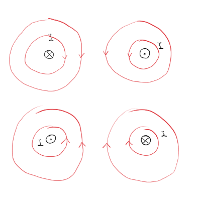

#+title: 5. predavanje iz Elektromagnetnega polja
#+startup: nolatexpreview
#+startup: entitiespretty nil
#+startup: show2levels
#+latex_header: \usepackage{amsmath} \usepackage{unicode-math} \usepackage{cancel} \usepackage{graphicx}
#+latex_header: \renewcommand{\theta}{\vartheta} \renewcommand{\phi}{\varphi} \renewcommand{\epsilon}{\varepsilon}
#+latex_header: \newcommand{\odv}[1]{\dot{\vec{#1}}} \newcommand{\oddv}[1]{\ddot{\vec{#1}}}
#+latex_header: \newcommand{\rot}{\mathrm{rot}}\newcommand{\dive}{\mathrm{div}} \newcommand{\iu}{\mathrm{i}}
#+latex_header: \newcommand\mapsfrom{\mathrel{\reflectbox{\ensuremath{\mapsto}}}}
* Magnetostatika
** Električni tok in velikosti

Električni tok je gibanje naboja po času vzdolž nekega električnega vodnika.

\[ I = \frac{\mathrm{d} e}{\mathrm{d} t},
\]

z enotami \( \mathrm{A} \) Amperov.

V magnetostatiki je električni tok časovno konstanten.

Nekaj velikosti tokov so

\[ \begin{array}{c|c} \hline \text{pojav} & \text{velikost} \\ \hline
\text{tok skozi celično membrano} & 1-10 \mathrm{p A} \\
\text{živčni impulz} & 1 \mu \mathrm{A}\\
\text{gospodinjski tok} & 1 \mathrm{A} \\
\text{tok skozi superprevodni magnet v LHC} & 12 \mathrm{k A} \\
\text{tok pri blisku} & 1-20 \cdot 10^4 \mathrm{A} \\
\text{tok v Zemeljskem jedru} & 10^9 \mathrm{A} \\ \hline
\end{array}
\]
** Gostota magnetnega toka

Podobno kot v elektrostatiki, lahko delovanje sil med električnimi vodniki opišemo z uvedbo magnetnega polja. Velja

\[ \vec{F} = - \frac{\mu_0 I_1 I_2}{4 \pi} \iint\limits_{}^{} \frac{\mathrm{d} \vec{l}_1 \times \mathrm{d} \vec{l}_2 \times \left( \vec{r} \left( l_2 \right) - \vec{r} \left( l_1 \right) \right)}{\left| \vec{r} \left( l_2 \right) - \vec{r} \left( l_1 \right) \right| ^3} = \int\limits_{c_1}^{} I_1 \, \mathrm{d} \vec{l}_1 \times \int\limits_{c_2}^{} \frac{\mu I_2}{4 \pi} \frac{\mathrm{d} \vec{l}_2 \times \left( \vec{r} (l_1) - \vec{r} (l_2) \right)}{\left| \vec{r}(l_1) - \vec{r}(l_2) \right| ^3}
\]

Ločili smo integrala, ker prvi integral sporoča, da je sila na prvi vodnik, drugi integral pa je tok, ki ustvarja silo na prvi vodnik. Slednji integral uvedemo kot magnetno polje

\[ \vec{B} \left( \vec{r} \right) = \frac{\mu_0 I_2}{4 \pi} \int\limits_{c_2}^{}  \frac{\mathrm{d} \vec{l}_2 \times \left( \vec{r} - \vec{r} (l_2) \right)}{\left| \vec{r} - \vec{r} (l_2) \right| ^3}.
\]

Ta integral poznamo tudi pod imenom Biot-Savartov zakon. S tako uvedenim magnetnim poljem \( B \) zapišemo silo kot

\[ \vec{F} = \int\limits_{c_1}^{} I_1 \, \mathrm{d} \vec{l}_1  \times \vec{B} \left( \vec{r} (l_1) \right)
\]

** Velikosti magnetnega polja

\[ \begin{array}{c|c} \hline \text{pojav} & \text{velikost} \\ \hline
\text{možganska aktivnost} & 1 \mathrm{fT} \\
\text{medgalaktična magnetna polja} & 1-10  \mathrm{pT}\\
\text{srčna aktivnost} & 100 \mathrm{pT} \\
\text{Zemeljsko magnetno polje} & 100 \mu \mathrm{T} \\
\text{železni magnet} & 100 \mathrm{mT} \\
\text{Sončne pege} & 1 \mathrm{T} \\
\text{pospeševalniki} & 10 \mathrm{T} \\
\text{nevronska zvezda} & 10^6 - 10^7 \mathrm{T} \\
\text{atomsko jedro} & 1 \mathrm{TT} \\ \hline
\end{array}
\]
** Magnetne silnice

Magnetne silnice so vedno zaključene. Do tega spoznanja smo prišli eksperimentalno.

** Magnetna cirkulacija

Magnetno cirkulacijo uvedemo kot

\[ \Gamma_M = \oint\limits_c^{} \vec{B} \cdot \mathrm{d} \vec{r},
\]

kjer je \( c \) zaključena zanka. Za razliko od električnega cirkulacije je ta integral striktno različen od \( 0 \). Integral po zaključeni zanki lahko preko Stokesovega izreka pretvorimo v integral po zaključeni površini

\[ \oint\limits_{c = \partial S}^{} \vec{B} \cdot \mathrm{d} \vec{r} = \iint\limits_S^{} \nabla \times \vec{B} \cdot \, \mathrm{d} \vec{S} \ne 0
\]

Iz tega sledi, da je

\[ \nabla \times \vec{B} \ne 0,
\]

kar pomeni, da je magnetno polje vrtinčno.
** Magnetni pretok

Magnetni pretok uvedemo kot

\[ \phi_M = \int\limits_S^{} \vec{B} \cdot \mathrm{d} \vec{S},
\]

kjer je \( S \) poljubna površina. Velja pa, da je magnetni pretok skozi zaključeno površino

\[ \oint\limits_S^{} \vec{B} \cdot \mathrm{d} \vec{S} = 0
\]

To je posledica tega, da ne obstajajo monopoli oziroma so vse magnetne silnice sklenjene. V diferencialni obliki pretok zapišemo

\[ 0 = \oint\limits_{S = \partial V}^{} \vec{B} \cdot \mathrm{d} \vec{S} = \int\limits_V^{} \nabla \cdot \vec{B} \, \mathrm{d} V = 0,
\]

iz česar zaključimo, da je magnetno polje brezizvorno, saj

\[ \nabla \cdot \vec{B} = 0
\]
** Gostota električnega toka

Električni tok, ki je vezan na žice, se posploši z uvedbo gostote električnega toka. In sicer

\[ I = \int\limits_S^{} \vec{\jmath} \cdot \mathrm{d} \vec{S}
\]

Gostota električnega toka \( \vec{\jmath} \) ima lahko poljubno smer v prostoru in ni nujno vezan na vodnike - gostota toka ne teče nujno vzdolž žice in Zemljino jedro ni sestavljeno iz vodnikov.
** Primeri gostote toka
*** Zvezno porazdeljen naboj

Imamo električen naboj z gostoto \( \rho \left( \vec{r} \right) \) in hitrostno polje \( \vec{v} \left( \vec{r} \right) \), ki poganja naboje. Izhajamo iz diferencialne oblike definicije gostote električnega toka

\[ \mathrm{d} I = \vec{\jmath} \cdot \mathrm{d} \vec{S}
\]

Z upoštevanjem definicije toka lahko povežemo gostoto električnega toka s hitrostnim poljem

\[ \mathrm{d} I = \frac{\mathrm{d} e}{\mathrm{d} t} = \frac{\rho \mathrm{d} V}{\mathrm{d} t} = \frac{\rho \mathrm{d} S \mathrm{d} x}{\mathrm{d} t} = \rho \mathrm{d} S \vec{v} = \vec{\jmath} \mathrm{d} \vec{S}.
\]

Torej je gostota električnega toka enaka

\[ \vec{\jmath} = \rho \vec{v}
\]
*** Linearni vodnik

Gostoto električnega toka zapišemo kot

\[ \vec{\jmath} = I \delta ^2 \left( \vec{\rho} - \vec{\rho}_0 \right) \hat{t},
\]

kjer sta \( \vec{\rho} \) in \( \vec{\rho}_0 \) radij vektorja v 2D, pravokotna na enotski vektor \( \hat{t} \), ki kaže vzporedno z vodnikom.
*** Točkast naboj

Gostota električnega toka je

\[ \vec{\jmath} = e \delta ^2 \left( \vec{r} - \vec{r}_0 (t) \right) \vec{v}(t),
\]

kjer je \( \vec{r}_{0} \) tir naboja, \( \vec{v} \) pa hitrost naboja.
*** Površinska gostota toka

\[ \vec{\jmath} \left( \vec{r} \right) = \sigma \cdot \vec{v} \delta \left( z - z_0 \right),
\]

kjer je \( \sigma \) površinska gostota naboja in \( z_0 \) lega površine. Pogosto se označi tudi

\[ \vec{\jmath}_S = \sigma \vec{v},
\]

kjer je površinska gostota toka.
