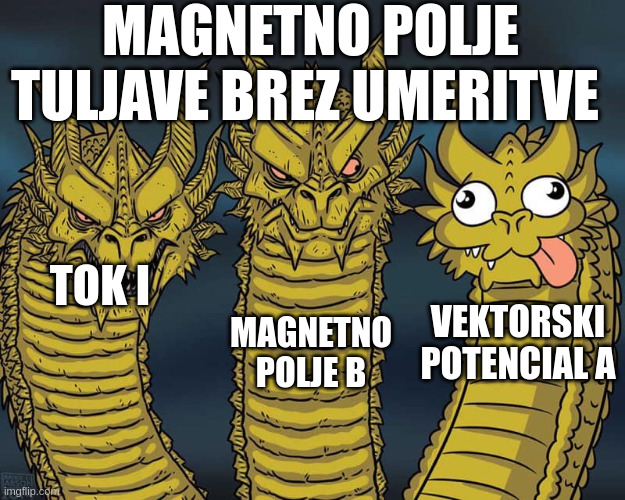

#+title: 6. predavanje iz Elektromagnetnega polja
#+startup: nolatexpreview
#+startup: entitiespretty nil
#+startup: show2levels
#+latex_header: \usepackage{amsmath} \usepackage{unicode-math} \usepackage{cancel} \usepackage{graphicx}
#+latex_header: \renewcommand{\theta}{\vartheta} \renewcommand{\phi}{\varphi} \renewcommand{\epsilon}{\varepsilon}
#+latex_header: \newcommand{\odv}[1]{\dot{\vec{#1}}} \newcommand{\oddv}[1]{\ddot{\vec{#1}}}
#+latex_header: \newcommand{\rot}{\mathrm{rot}}\newcommand{\dive}{\mathrm{div}} \newcommand{\iu}{\mathrm{i}}
#+latex_header: \newcommand\mapsfrom{\mathrel{\reflectbox{\ensuremath{\mapsto}}}}
* Magnetostatika
** Vektorski magnetni potencial tuljave

Za precej fizikalno lepo homogeno magnetno polje \( \vec{B} \) znotraj tuljave, je vektorski potencial \( \vec{A} \) grdoba, saj ima prostorsko odvisnost tudi zunaj tuljave

Po besedah profesorja želimo narediti bolj pohleven vektorski potencial, zaradi česar se poslužimo umeritve. Uvedemo nov magnetni potencial \( \vec{A} \, ' \)

\[ \vec{A} \, ' = \vec{A} + \nabla \zeta \left( \vec{r} \right)
\]

Taka vpeljava je precej priročna, saj oba vektorska polja ustrezata istemu magnetnemu polju \( \vec{B} \)

\[ \vec{B} = \nabla \times \vec{A} = \nabla \times \vec{A} \, '
\]

Kot primer za \( \zeta \) lahko uporabimo

\[ \zeta \left( \vec{r} \right) = - \frac{B_0 a ^2}{2} \arctan \frac{y}{x}.
\]

\( \vec{A} \) je potem definiran kot

\[ \vec{A} \, ' = \frac{a ^2}{2} \vec{B}_0 \times \frac{\vec{r}}{r ^2} - \nabla \left( - \frac{B_0 a ^2}{2} \arctan \frac{y}{x} \right) = \frac{B_0 a ^2}{2} \frac{2 \pi}{a} \delta (\phi - \pi) \hat{e}_{\phi}
\]

#+begin_quote
Vedno lepši potencial, kajne?
#+end_quote

Z dano umeritvijo je \( \vec{A} \, ' \) nič skoraj povsod, razen pri \( \phi = \pi \). Z uvedbo/uporabo umeritve lahko spreminjaš potencial \( \vec{A} \) ne da bi pri tem vplival na dejansko magnetno polje \( \vec{B} \).
** Magnetna sila

Magnetna silo na vodnik se zapiše kot

\[ \vec{F} = \int\limits_{L}^{} I \, \mathrm{d} \vec{l} \times \vec{B} \left( \vec{r} (l) \right)
\]

kjer je \( L \) integral po žici. Za splošno gostoto toka nadomestimo izraz \( I \, \mathrm{d} \vec{l} \) z \( \vec{\jmath} \, \mathrm{d} ^3 \vec{r} \). Naša sila se tako prevede na

\[ \vec{F} = \int\limits_V^{} \vec{\jmath} \times \vec{B} \, \mathrm{d} ^3 \vec{r}
\]

#+name: sila na gibajoč točkast naboj
#+begin_my_example
Gostoto električnega toka zapišemo kot

\[ \vec{\jmath} = \rho \vec{v} = e \delta ^3 \left( \vec{r} - \vec{r} \left( t \right) \right) \vec{v}
\]

Sila je potem

\[ \vec{F} = \int\limits_{}^{} e \delta ^3 \left( \vec{r} - \vec{r} (t) \right) \vec{v} \times \vec{B} \, \mathrm{d} ^3  \vec{r} = e \vec{v} \times \vec{B}
\]
#+end_my_example
** Kirchoffova enačba

Zanima nas osnovna enačba za vektorski magnetni potencial. Uporabimo Amperov zakon in definicijo vektorskega potenciala

\[ \mu_0 \vec{\jmath} = \nabla \times \vec{B} = \nabla \times \left( \nabla \times \vec{A} \right) = \nabla \left( \nabla \cdot \vec{A} \right) - \nabla ^2 \vec{A}.
\]

Hkrati uporabimo tudi Helmholtzov izrek, ki pravi, da lahko vsako vektorsko polje zapišemo kot

\[ \vec{A} = \vec{A} _1 + \vec{A}_2,
\]

kjer \( \nabla \cdot \vec{A}_1 = 0 \) in \( \nabla \times \vec{A}_2 = 0 \).

Za olajšavo uporabimo umeritev \( \vec{A}_2 = 0 \) Iz tega sledi, da je \( \vec{A} = \vec{A}_1  \) zaradi linearnosti rotorja, iz česar sledi \( \nabla \vec{A} = \nabla \cdot \vec{A}_1 = 0 \).

Dobimo Kirchoffovo enačbo

\[ \nabla ^2 \vec{A} = - \mu_0 \vec{\jmath},
\]

ki je osnovna enačba za izračun magnetnega vektorskega potenciala. Enačba je podobna Poissonovi enačbi, iz česar sklepamo rešitev

\[ \vec{A} \left( \vec{r} \right) = \frac{\mu_0}{4 \pi} \int\limits_{V}^{} \frac{\vec{\jmath} \left( \vec{r} \, ' \right)}{\left| \vec{r} - \vec{r} \, ' \right|} \, \mathrm{d} ^3 \vec{r} \,'
\]

Volumnski integral teče tam, kjer je \( \vec{\jmath} \ne 0 \).

Od tod sledi Biot-Savartov zakon

\begin{align*}
  \vec{B} \left( \vec{r} \right) &= \nabla \times \vec{A} \\
&= \nabla \times \int\limits_{}^{} \frac{\mu_0}{4 \pi} \frac{\vec{\jmath} \left( \vec{r} \, ' \right)}{\left| \vec{r} - \vec{r} \,' \right|} \, \mathrm{d} ^3 \vec{r} \, '
\end{align*}

Ker \( \nabla \) vpliva na \( \vec{r} \) in ne na \( \vec{r} \, ' \) lahko zapišemo

\[ \vec{B} \left( \vec{r} \right)= \frac{\mu_0}{4 \pi}  \int\limits_{}^{} \frac{\vec{\jmath} \times \left( \vec{r} - \vec{r} \, ' \right)}{\left| \vec{r} - \vec{r} \, ' \right|} \, \mathrm{d} ^3 \vec{r} \, '
\]
** Magnetna energija
*** Magnetna energija v zunanjem polju

Zamislimo si električno zanko poljubne oblike \( C \), po kateri teče tok \( I \), ki se nahaja v zunanjem magnetnem polju \( \vec{B} \). Zanko premaknemo za \( \mathrm{d} \vec{r} \). Zanima nas, koliko se je spremenila energija zanke, kar je količini dela, ki smo ga opravili.

Sila na zanko je preko definicije magnetne sile

\[ \vec{F} = \int\limits_C^{} I \, \mathrm{d} \vec{l} \times \vec{B} = I \int\limits_C^{} \hat{t} \times \vec{B} \, \mathrm{d} l,
\]

kjer je \( \hat{t} \) enotski vektor na zanki. Delo, ki ga opravimo pri tem premiku, je

\begin{align*}
  \mathrm{d} A &= - \vec{F} \cdot \mathrm{d} \vec{r} \\
&= - I \int\limits_C^{} \left[ \left( \hat{t} \times \vec{B} \right) \cdot \mathrm{d} \vec{r} \right] \, \mathrm{d} l \\
&= - I \int\limits_C^{} \left( \mathrm{d} \vec{r} \times \hat{t} \right) \cdot \vec{B} \, \mathrm{d} l
\end{align*}

\( \left(\mathrm{d} \vec{r} \times \hat{t} \right) \mathrm{d}l = \mathrm{d} S \), kjer je \( \mathrm{d} S \) diferencial površine, ki jo opiše zanka ob premiku.

Torej je delo po integriranju

\[ A = - I \int\limits_S^{} \vec{B} \cdot \mathrm{d} \vec{S} = - I \Phi_m
\]

Magnetno energijo želimo zapisati tudi z vektorskim magnetnim potencialnim poljem

\[ A = - I \int\limits_S^{} \left( \nabla \times \vec{A} \right) \, \mathrm{d} \vec{S} = - I \int\limits_{C_2}^{} \vec{A} \cdot \mathrm{d}  \vec{r} + I \int\limits_{C_1}^{} \vec{A} \cdot \mathrm{d}  \vec{r},
\]

Zanko smo premaknili za \( \mathrm{d} \vec{r} \). Površina \( S \) je površina plašča valja, ki ga omejujeta zanka \( C_1 \) pred premikom in zanka \( C_2 \), ki je \( C_1 \) premaknjena za \( \mathrm{d} \vec{r} \).

Posplošimo integral z gostoto toka \( \vec{\jmath} \) preko identitete \( I \mathrm{d}\vec{r} = \vec{\jmath} \, \mathrm{d} ^3\vec{r} \)

\[ A = - \int\limits_{(2)}^{} \vec{\jmath} \cdot \vec{A} \, \mathrm{d} ^3 \vec{r} + \int\limits_{(1)}^{} \vec{\jmath} \cdot \vec{A} \, \mathrm{d} ^3 \vec{r},
\]

kjer je (2) zanka po premiku in (1) zanka pred premikom. Torej je energija \( \vec{\jmath} \) v zunanjem magnetnem polju \( \vec{A} \), ki ni odvisen od \( \vec{\jmath} \)

\begin{equation}
\label{eq:1}
 W = - \int\limits_{}^{} \vec{\jmath} \cdot \vec{A} \, \mathrm{d} ^3 \vec{r}
\end{equation}

*** Magnetna energija kot funkcional toka

Iz Kirchoffove enačbe vemo, da velja

\[ \vec{A} \left( \vec{r} \right) = \frac{\mu_0}{4 \pi} \int\limits_{}^{} \frac{\vec{\jmath} \left( \vec{r} \, ' \right)}{\left| \vec{r} - \vec{r} \, ' \right|} \, \mathrm{d} ^3 \vec{r} \, '.
\]

Potem lahko zapišemo energijo kot

\[ W = \frac{\mu_0}{4 \pi} \int\limits_V^{} \int\limits_{V'}^{} \frac{\vec{\jmath} \left( \vec{r} \right) \vec{\jmath} \, ' \left( \vec{r} \, '\right)}{\left| \vec{r} - \vec{r} \, ' \right|} \, \mathrm{d} ^3 \vec{r} \, \mathrm{d} ^3 \vec{r} \, '
\]

Ta enačba nam pove energijo tokov \( \vec{\jmath} \) v magnetnem polju, ki ga ustvarja tok \( \vec{\jmath} \, ' \).
*** Celotna magnetna energija
Zanima nas celotna energija polja/potenciala \( \vec{A} \), ki ga ustvari gostota toka \( \vec{\jmath} \). Uvedemo parameter \( \alpha \in [0, 1] \), ki spremeni magnetni vektorski potencial \( \vec{A} \) iz \( 0 \) do \( \vec{A} \). Ker gostota električnega toka \( \vec{\jmath} \) ustvari vektorski magnetni potencial \( \vec{A} \). Pri nekem \( \alpha \) gostota toka \( \hat{\jmath} = \alpha \vec{\jmath} \) ustvari polje \( \hat{A}, \left| \hat{A} \right| \le \left| \vec{A}\right|  \). Opazujemo spremembo \( \hat{A} \), če povečamo gostoto toka za \( \mathrm{d} \vec{\jmath} \).

Uporabili bomo linearnost Kirchoffove enačbe

\[ \nabla ^2 \left( \hat{A} \right) = \nabla ^2 \left( \vec{A} \right) = - \mu_0 \left( \vec{\jmath} \cdot \alpha \right),
\]

da je sprememba energije enaka

\begin{align*}
  \mathrm{d} W &= \int\limits_V^{} - \mathrm{d} \vec{\jmath} \cdot \hat{A} \, \mathrm{d} ^3\vec{r}  && \mathrm{d} \vec{\jmath} = \vec{\jmath} \, \mathrm{d} \alpha; \ \hat{A} = \alpha \vec{A} \\
&= \int\limits_V^{} - \mathrm{d} \alpha \alpha \vec{\jmath} \vec{A}\, \mathrm{d} ^3 \vec{r} \\
W &= -\int\limits_0^{1} \alpha \, \mathrm{d} \alpha \int\limits_{}^{} \vec{\jmath} \cdot \vec{A} \, \mathrm{d} ^3 \vec{r}
\end{align*}

iz česar sledi energija celotnega magnetnega polja

\[ W = - \frac{1}{2} \vec{\jmath} \vec{A} \, \mathrm{d} ^3 \vec{r}
\]

Prejšnji izraz ne upošteva, da je za vzpostavitev toka \( \vec{\jmath} \) potrebna energija - we need some energy, da se elektroni začnejo premikati. V elektrostatiki tega ni bilo, saj nabit delec ima električno polje.

Moč je po definiciji

\[ P = - U \cdot I =  - I \int\limits_{C}^{} \vec{E} \cdot \mathrm{d} \vec{r},
\]

kjer je \( C \) zanka, po kateri teče tok \( I \).

Uporabimo indukcijski zakon

\begin{align*}
  \int\limits_{}^{} \vec{E} \cdot \mathrm{d} \vec{r} &= - \frac{\partial }{\partial t} \int\limits_{}^{} \vec{B} \cdot \mathrm{d} \vec{S} \\
\nabla \times \vec{E} &= - \frac{\partial \vec{B}}{\partial t}
\end{align*}

Spreminjanje magnetnega polja skozi čas ustvarja električno polje. To pretvori integral moči v

\[ P = I \frac{\partial }{\partial t}  \int\limits_{C}^{} \vec{B} \cdot \mathrm{d} \vec{S} = \frac{\partial W}{\partial t}
\]

Preko te enačbo prepoznamo, da velja

\[ W = I \int\limits_{}^{} \vec{B} \cdot \mathrm{d} \vec{S} = I \int\limits_{}^{} \nabla \times \vec{A} \cdot \mathrm{d} \vec{S} = I \int\limits_{}^{} \vec{A} \cdot \mathrm{d} \vec{r} = \int\limits_{}^{} \vec{\jmath} \cdot \vec{A} \, \mathrm{d} ^3 \vec{r}
\]

Celotna energija magnetnega toka je

\[ W = - \frac{1}{2} \int\limits_V^{} \vec{\jmath} \cdot \vec{A} \, \mathrm{d} ^3 \vec{r} + \int\limits_V^{} \vec{\jmath} \cdot \vec{A} \, \mathrm{d} ^3 \vec{r} = \frac{1}{2} \int\limits_V^{} \vec{\jmath} \cdot \vec{A} \, \mathrm{d} ^3 \vec{r}
\]

Poudarimo, da je napram enačbi \ref{eq:1}, vektorski magnetni potencial \( \vec{A} \) ustvarjen s strani toka \( \vec{\jmath} \), s katerim je skupaj v integralu.
*** Gostota magnetnega polja

Celotno energijo želimo prepisati v odvisnost od \( \vec{B} \). Uporabili bomo Maxwellovo enačbo

\[ \nabla \times \vec{B} = \mu_0 \vec{\jmath},
\]

ter identiteto

\[ \nabla \cdot \left( \vec{B} \times \vec{A} \right) = \vec{A} \cdot \left( \nabla \times \vec{B} \right) - \vec{B} \cdot \left( \nabla \times \vec{A} \right).
\]

Zapišemo prej povedano celotno energijo

\begin{align*}
  W &= \frac{1}{2} \int\limits_V^{} \vec{\jmath} \cdot \vec{A}  \, \mathrm{d} ^3 \vec{r} \\
&= \frac{1}{2 \mu_0} \int\limits_V^{} \left( \nabla \times \vec{B} \right) \cdot \vec{A} \, \mathrm{d} ^3 \vec{r} \\
&= \frac{1}{2\mu_0} \int\limits_V^{} \nabla \left( \vec{B} \times \vec{A} \right) \, \mathrm{d} ^3 \vec{r} + \frac{1}{2 \mu_0} \int\limits_V^{} \vec{B} \cdot \left( \nabla \times \vec{A} \right) \, \mathrm{d} ^3 \vec{r} \\
&= \frac{1}{2\mu_0} \left[ \int\limits_V^{} B ^2 \, \mathrm{d} ^3 \vec{r} + \int\limits_{\partial V}^{} \left( \vec{B} \times \vec{A} \right) \, \mathrm{d} \vec{S} \right]
\end{align*}

Rob naše prostornine \( \partial V \) je lahko v neskončnosti. Magnetno polje \( \vec{B} \) (žice) ima odvisnost \( \frac{1}{r} \). Po definiciji ima vektorski potencial odvisnost \( \frac{1}{r ^2} \). Hkrati je tudi površine našega volumna z odvisnost \( r ^2 \). Torej je celoten drugi integral obratnosorazmeren \( r \) in ko \( r \to \infty \) je integral \( 0 \).

Za divje primere, ko je žica neskončna, ima žica tudi neskončno energijo, in integral razumno divergira.

Torej zapišemo celotno energijo magnetnega polja z \( \vec{B} \) kot

\[ W = \frac{1}{2 \mu_0} \int\limits_V^{} B ^2 \, \mathrm{d} ^3 \vec{r}
\]
** Sila kot funkcional magnetnega polja

Imamo zanko/krompir s tokom \( \vec{\jmath} \) (porazdelitev toka), ki se nahaja v zunanjem magnetnem polju \( \vec{B}_Z \). Magnetno polje, ki ga izmerimo, pa je vsota zunanjega magnetnega toka \( \vec{B}_Z \) in magnetnega polja \( \vec{B}_L \), ki je posledica toka po zanki.

Zanima nas, kakšna sila deluje na \( \vec{\jmath} \). Za silo velja

\[ \vec{F} = \int\limits_V^{} \vec{\jmath} \times \vec{B}_Z \, \mathrm{d} ^3 \vec{r},
\]

kjer je \( V \) volumen zanke/krompirja. Gostoto toka zapišemo preko Amperovega zakona z lastnim magnetnim poljem \( \nabla \times \vec{B}= \mu_0 \vec{\jmath} \). Silo zapišemo torej kot

\[ \vec{F} = \frac{1}{\mu_0} \int\limits_{}^{} \left( \nabla \times \vec{B}_L \right) \times \vec{B}_Z \, \mathrm{d} ^3 \vec{r}
\]
