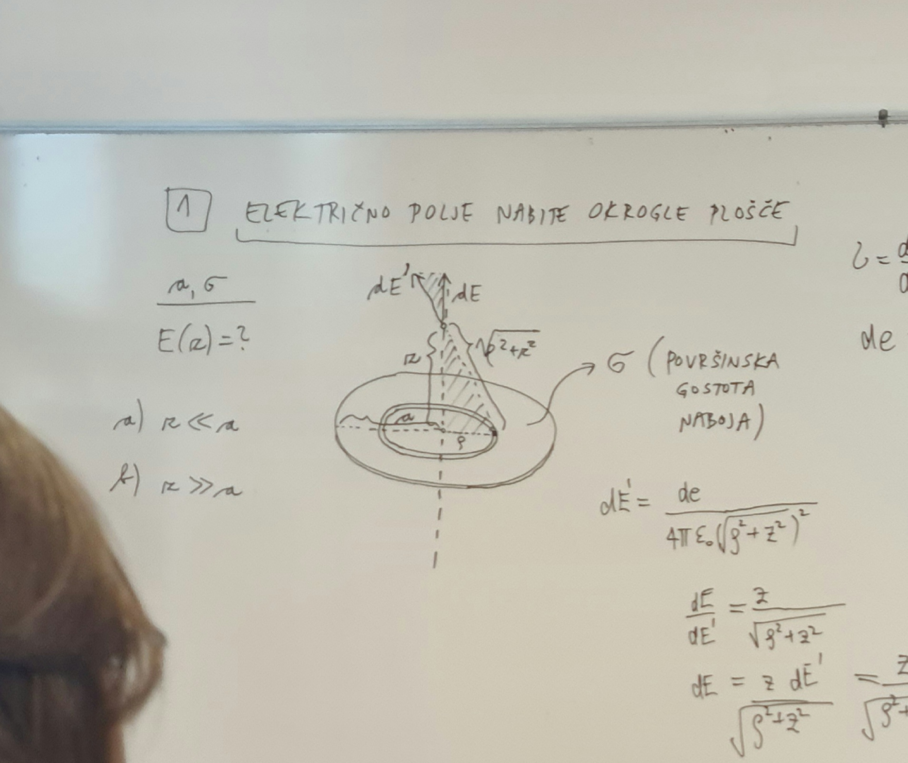
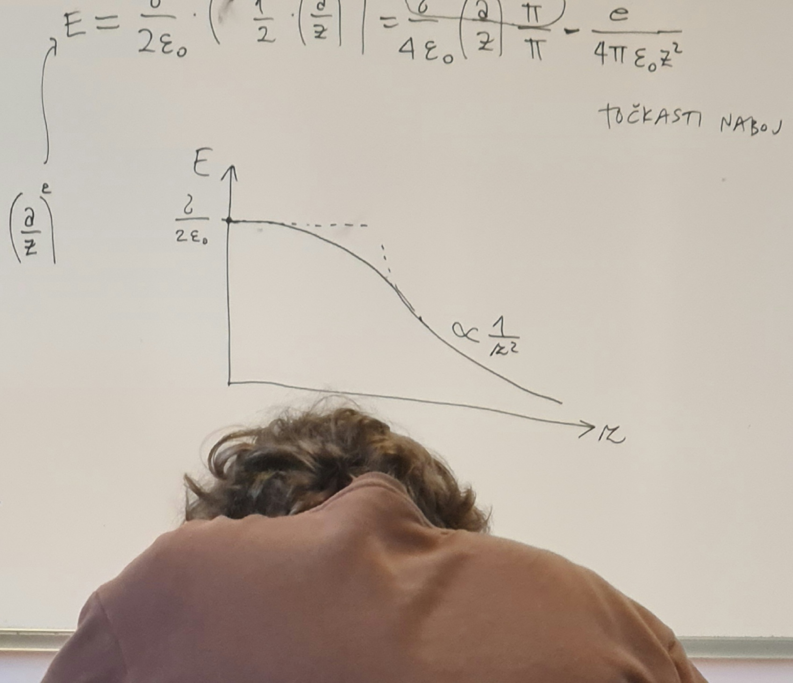

#+title: 1. vaje iz Elektromagnetnega polja
#+startup: nolatexpreview
#+startup: entitiespretty nil
#+startup: show2levels
#+latex_header: \usepackage{amsmath} \usepackage{unicode-math} \usepackage{cancel} \usepackage{graphicx}
#+latex_header: \renewcommand{\theta}{\vartheta} \renewcommand{\phi}{\varphi} \renewcommand{\epsilon}{\varepsilon}
#+latex_header: \newcommand{\odv}[1]{\dot{\vec{#1}}} \newcommand{\oddv}[1]{\ddot{\vec{#1}}}
#+latex_header: \newcommand{\rot}{\mathrm{rot}}\newcommand{\dive}{\mathrm{div}} \newcommand{\iu}{\mathrm{i}}
#+latex_header: \newcommand\mapsfrom{\mathrel{\reflectbox{\ensuremath{\mapsto}}}}
* Električno polje nabite (tanke) okrogle plošče
#+begin_my_example
Izračunaj jakost električnega polja \( E \) vzdolž osi enakomerno nabite okrogle plošče s polmerom \( a \) kot funkcijo oddaljenosti od plošče \( z \). Površinska gostota naboja na plošči je \( \sigma \). Končni rezultat poenostavi za dva posebna primera

a) zelo blizu plošče \( z \ll a \)
b) daleč stran od plošče \( z \gg a \)

Ustrezna rezultata primerjaj a točko s poljem neskončne ravne plošče oziroma b) s poljem točkastega naboja in skiciraj odvisnost \( E(z) \).
#+end_my_example

#+begin_solution
V disku s polmerom \( a \) vzamemo kolobar z notranjim polmerom \( \rho \). Diferencial električnega polja \( \mathrm{d} E' \) v točki \( z > 0 \) nad osjo diska zapišemo po definiciji električnega polja

\begin{equation}
\label{eq:1}
 \mathrm{d} E' = \frac{\mathrm{d} e }{4 \pi \epsilon_0 \left( \sqrt{\rho ^2 + z ^2 } \right) ^2}
\end{equation}

Ker je problem simetričen, si lahko privoščimo gledati samo za os nad diskom.

Projekcija električnega polja \( \mathrm{d} E' \) na navpično os je definirana preko kosinusa, torej velja razmerje

\[ \frac{\mathrm{d} E}{\mathrm{d} E'} = \frac{z}{ \sqrt{\rho ^2 + z ^2}}
\]

Upoštevamo razmerje skupaj z enačbo \ref{eq:1} in dobimo enakost

\begin{align*}
  \mathrm{d} E &= \frac{z \mathrm{d} E'}{\sqrt{\rho ^2 + z ^2}} \\
&= \frac{z}{\sqrt{\rho ^2 + z ^2}} \frac{\mathrm{d} e}{ 4 \pi \epsilon_0 \left( \rho ^2 + z ^2 \right)} && \sigma = \frac{\mathrm{d} e}{\mathrm{d} S} = \frac{\mathrm{d} e}{2 \pi \rho \,\mathrm{d} \rho} \\
&= \frac{z \sigma 2 \pi \rho \, \mathrm{d} \rho}{\left( \rho ^2 + z ^2 \right)^{\frac{3}{2}} 4 \pi \epsilon_0} \\
&= \frac{z \sigma}{2 \epsilon_0} \frac{\rho}{\left( \rho ^2 + z ^2 \right)} \, \mathrm{d} \rho
\end{align*}

\( 2 \pi \rho \, \mathrm{d} \rho \) označuje površino našega kolobarja. Dobljeni rezultat integriramo po radiju našega diska, kjer opravimo substitucijo \( u = \rho ^2 + z ^2 \).

\begin{align*}
  E &= \frac{z \sigma}{2 \epsilon_0} \int\limits_0^a \frac{\rho}{\left( \rho ^2 + z ^2 \right)^{\frac{3}{2}}} \, \mathrm{d} \rho \\
&= \frac{z \sigma}{2 \epsilon_0} \int\limits_{z ^2}^{a ^2 + z ^2} \frac{1}{u^{\frac{3}{2}}} \frac{\mathrm{d} u}{2} \\
&= \frac{z \sigma}{4 \epsilon_0} \left. \left( - 2u^{- \frac{1}{2}} \right)\right|_{z ^2}^{a ^2 + z ^2} \\
&= \frac{z \sigma}{2 \epsilon_0} \left( -2 \left( a ^2 + z ^2 \right)^{- \frac{1}{2}} + 2 \left( z ^2 \right)^{- \frac{1}{2}} \right) \\
&= \frac{z \sigma}{2 \epsilon_0} \left( - \frac{1}{\sqrt{a ^2 + z ^2}} + \frac{1}{z} \right) \\
&= \frac{\sigma}{2 \epsilon_0} \left( 1 - \frac{z}{\sqrt{a ^2 + z ^2}} \right)
\end{align*}

V primeru, ko je \( z \ll a \) je električno polje enako

\[ E = \frac{\sigma}{2 \epsilon_0}
\]

kar je polje neskončno ravne plošče (ko si blizu sredine ploskve, roba ploskve ne vidiš).

V primeru, ko \( z \gg a \), pa zapišemo razmerje

\[ \frac{a}{z} \ll 1
\]

Naš izračunan rezultat razvijemo preko Taylorja in uporabimo

\[ (1 + \epsilon)^p = 1 + p \epsilon + \binom{p}{2} \epsilon ^2 + \ldots
\]

in tako je naš razvoj enak

\begin{align*}
  E &= \frac{\sigma}{2\epsilon_0} \left( 1 - \frac{z}{\sqrt{a ^2 + z ^2}} \right) \\
& = \frac{\frac{z}{z}}{\sqrt{\left( \frac{a}{z} \right) ^2 + 1}} \\
&= \frac{1}{\left( \left[ \frac{a}{z} \right] ^2 + 1 \right)^{\frac{1}{2}}} ^{- \frac{1}{2}} \\
&\approx 1 - \frac{1}{2} \left( \frac{a}{z} \right) ^2
\end{align*}

Električno polje je tako enako

\begin{align*}
  E &= \frac{\sigma}{2 \epsilon_0} \left( \frac{1}{2} \left( \frac{a}{z} \right)^2 \right) \\
&= \frac{\sigma}{4 \epsilon_0} \left( \frac{a}{z} \right) ^2 \frac{\pi}{\pi} \\
&= \frac{e}{4 \pi \epsilon_0 z ^2}
\end{align*}

kar je izraz za točkasti naboj.

#+end_solution
* Električno polje nabite ravne plošče z režo

#+begin_my_example
Iz velike tanke izolatorske plošče, ki je enakomerno nabita z nabojem površinske gostote \( \sigma \), izrežemo ravno režo širine \( a \), kakor prikazuje slika.

a) Določi jakost električnega polja \( E \) v ravnini, ki je pravokotna na ploščo in poteka skozi sredino reže kot funkcijo oddaljenosti \( z \) od ravnine plošče.
b) Pod a) dobljeni izraz za \( E \) poenostavi za primera majhnih in veliki \( z \) (glede na \( a \)) ter skiciraj odvisnost \( E(z) \)

Uporaben razvoj za \( x > 0 \):

\[ \mathrm{arctg} \frac{1}{x} = \frac{\pi}{2} - x + \ldots
\]
#+end_my_example

#+begin_solution
Ravne plošče bomo aproksimirali z veliko količino vzporedni žic, zato si poglejmo
#+end_solution

električno polje nabitega ravnega vodnika. Raven vodnik zapremo s končnim (zelo dolgim) valjem - zaradi njegove dolžine, zanemarimo osnovne ploskve valja, ko integriramo preko Gaussovega zakona

\[ e = \epsilon_0 \oint\limits_{}^{} \vec{E} \, \mathrm{d} \vec{S}
\]

To pomeni, da so vse silnice električnega polja pravokotne na žico in za ploščino vzamemo površino valja.

\[ e = \epsilon_0 \int\limits_{}^{} E \, \mathrm{d} S = \epsilon_0 E S = \epsilon_0 E 2 \pi r l
\]

Električno polje nabitega vodnika je tako

\begin{equation}
\label{eq:2}
E = \frac{e}{2 \pi \epsilon_0 l } \frac{1}{r}
\end{equation}

#+begin_solution
Električno polje v ravnini kaže zgolj navzgor, saj se komponenti vzporedni s ploščama odštejeta in ostane samo pravokotna.

Razmerje kosinusa zapišemo po definiciji

\[ \frac{\mathrm{d} E}{\mathrm{d} E'} = \frac{z}{\left( x ^2 + z ^2 \right)^{\frac{1}{2}}}
\]

Električno polje (neskončne) žice pa je

\[ \mathrm{d} E' = \frac{\mathrm{d}e}{2 \pi \epsilon_0} \frac{1}{\left( x ^2 + z ^2 \right)^{\frac{1}{2}}}
\]

Enačbi združimo skupaj in upoštevamo definicijo površinske gostote naboja, ki nam pokrajša dolžino \( l \), da dobimo

\[ \mathrm{d} E = \frac{z}{\left( x ^2 + z ^2 \right)^{\frac{1}{2}}} \frac{\mathrm{d} x \sigma}{2 \pi \epsilon_0 \left( x ^2 + z ^2 \right)^{\frac{1}{2}}}
\]

Zadevščino integriramo in da upoštevamo obe strani plošče zaradi simetrije pomnožimo s faktorjem \( 2 \):

\begin{align*}
  \int\limits_0^E \, \mathrm{d} E &= \int\limits_{\frac{a}{2}}^{\infty} \frac{z}{\left( x ^2 + z ^2 \right)^{\frac{1}{2}}} \frac{2 \sigma}{2 \pi \epsilon_0 \left( x ^2 + z ^2 \right)^{\frac{1}{2}}} \, \mathrm{d} x \\
&= \frac{z \sigma}{\pi \epsilon_0} \int\limits_{\frac{a}{2}}^{\infty} \left( x ^2 + z ^2 \right)^{-1} \, \mathrm{d} x  \\
&= \frac{1}{z} \int\limits_{\frac{a}{2}}^{\infty} \frac{\mathrm{d} \frac{x}{z}}{\frac{z ^2}{z ^2} + \frac{x ^2}{z ^2}} \\
&= \frac{1}{z} \left. \mathrm{arctg} \frac{x}{z} \right|_{\frac{a}{2}}^{\infty} \\
&= \frac{1}{z} \left( \frac{\pi}{2} - \mathrm{arctg} \frac{a}{2z} \right)
\end{align*}

Električno polje je tako

\[ E = \frac{\sigma}{\pi \epsilon_0} \left( \frac{\pi}{2} - \mathrm{arctg }\frac{a}{2z} \right)
\]
#+end_solution
