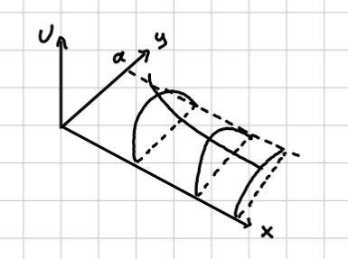
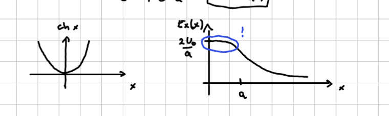

#+title: 3. vaje iz Elektromagnetnega polja
#+startup: nolatexpreview
#+startup: entitiespretty nil
#+startup: show2levels
#+latex_header: \usepackage{amsmath} \usepackage{unicode-math} \usepackage{cancel} \usepackage{graphicx}
#+latex_header: \renewcommand{\theta}{\vartheta} \renewcommand{\phi}{\varphi} \renewcommand{\epsilon}{\varepsilon}
#+latex_header: \newcommand{\odv}[1]{\dot{\vec{#1}}} \newcommand{\oddv}[1]{\ddot{\vec{#1}}}
#+latex_header: \newcommand{\rot}{\mathrm{rot}}\newcommand{\dive}{\mathrm{div}} \newcommand{\iu}{\mathrm{i}}
#+latex_header: \newcommand\mapsfrom{\mathrel{\reflectbox{\ensuremath{\mapsto}}}}
* Ploščati kondenzator s prečnim trakom - nadaljevanje

Prostor med kondenzatorjema, omejen s trakom, ne vsebuje naboja in velja Laplaceova enačba

\[ \nabla ^2 U \left( x, y \right) = 0
\]

Naboji se nahajajo na ploščah kondenzatorja in na traku. Za reševanje potrebujemo še robne pogoje (ang. /boundary conditions/ - BC). Na spodnji, ozemljeni plošči je \( U(x, 0) = 0 \). Zgornja plošča, ki je prav tako ozemljena, ima \( U(x, a) = 0 \). Trak ima napetost \( U(0, y) = U_0 \). Potrebujemo še četrti robni pogoj v neskončnosti, za katerega zahtevamo, da ne divergira.

Za reševanje bomo uporabili metodo separacije spremenljivk \( U(x, y) = X(x), Y(y) \). Upoštevamo definicijo Laplaceovega operatorja v kartezičnih koordinatah in naš nastavek, da dobimo

\[ X'' Y + X Y'' = 0  \implies \frac{X''}{X} = - \frac{Y''}{Y}
\]

Razmerji sta enaki samo, če sta konstantni \( \kappa ^2 \). To nam poda dve enačbi

\begin{equation}
\label{eq:1}
 X'' - \kappa ^2 X= 0
\end{equation}

ter

\begin{equation}
\label{eq:2}
Y'' + \kappa ^2 Y = 0
\end{equation}

S separacijo spremenljivk smo uspeli dobiti dve navadni diferencialni enačbi drugega reda. Enačbo \ref{eq:1} reši linearna kombinacija eksponentnih funkcij

\[ X(x) = A e^{\kappa x} + B e^{- \kappa x},
\]

medtem ko enačbo \ref{eq:2} reši

\[ Y(y) = C \sin (\kappa y) + D \cos (\kappa y)
\]

Upoštevajoč definicijo nastavka za separacijo spremenljivk je splošna rešitev

\begin{equation}
\label{eq:3}
 U(x, y) =  \left[ A e^{\kappa x} + B e^{- \kappa x} \right] \left[  C \sin (\kappa y) + D \cos (\kappa y) \right]
\end{equation}

Zaradi robnega pogoja v neskončnosti je \( A = 0 \). Člen s koeficientom \( B \) bo na ploščah kondenzatorja vedno različen od \( 0 \). Edini način, da zadostimo robnemu pogoju \( U(x, 0) = 0 \), je, da velja \( D = 0 \).

Našo splošno rešitev \ref{eq:3} smo sedaj oklestili do

\begin{equation}
\label{eq:4}
U(x, y) = Be^{- \kappa x} C \cdot \sin (\kappa y)
\end{equation}

Pogoj na drugi plošči kondenzatorja je \( U(x, a) = 0 = B e^{-\kappa x} C \sin (a \kappa) \). Edini člen, ki je lahko ničeln, je sinus, torej

\[ \sin (a \kappa) = 0 \implies a \kappa = n \pi, \ n = 1, 2, 3, \ldots
\]

\( n \ne 0 \), saj to implicira \( \kappa = 0 \) in nadalje \( U(x, y) = 0 \), kar pa je nezanimiva rešitev. Definiramo novo konstanto \( F = BC \).

Kvantizirali smo našo rešitev, saj ima \( \kappa \) lahko samo določene vrednosti. \( n \)-to rešitev bomo označili z indeksom \( n \). Ta indeks bo prav tako imel pripadajoč koeficient.

Vmesna rešitev \ref{eq:4} je superpozicija vseh možnih rešitev

\[ U(x, y) = \sum\limits_{n = 1}^{\infty} F_n e^{- \kappa_n x} \sin (\kappa_n y)
\]

Za iskanje koeficientov bomo uporabili še zadnji neuporabljen robni pogoj \( U(0, y) = U_0 \). Nahajamo se v prostoru, kjer so \( \sin \left( \kappa_n y \right) = \sin \left( \frac{n \pi}{a} y \right) \) bazne funkcije. Skalarno bomo množili z neko drugo bazno funkcijo

\begin{equation}
\label{eq:5}
 \int\limits_0^a U_0 \sin \left( \frac{m \pi}{a } y \right) \, \mathrm{d} y = \int\limits_0^a \sum\limits_{n = 1}^{\infty} F_n e^{- \kappa_n x} \sin \left( \frac{n \pi}{a} y  \right) \cdot \sin \left( \frac{m \pi}{a} y \right) \, \mathrm{d} y
\end{equation}

Leva stran enačbe je po integriranju enaka

\[ \int\limits_0^a U_0 \sin \left( \frac{m \pi}{a} y \right) \, \mathrm{d} y = - \left. \frac{U_0a}{m \pi} \cos  \left( \frac{m \pi}{a} y \right) \right|_{y = 0}^{y = a} = \frac{U_0 a}{m \pi} \left[ 1 - (-1)^m \right]
\]

Argument kosinusa je vedno večkratnih števila \( \pi \), kar pomeni, da kosinus zaseda samo dve možno vrednosti \( 1 \) ali \( -1 \), odvisno od \( m \).

Na desni strani enačbe \re{eq:5} si lahko zaradi predpostavk, ki jih zamolčimo, privoščimo menjavo integrala in vsote. Sinusne funkcije so si ortogonalne med seboj, zato je produkt sinusnih funkcij enak \( 0 \), če \( m \ne n \). Zapišemo

\[ \sum\limits_{n = 1}^{\infty} F_n \int\limits_0^a \sin \left( \frac{n \pi}{a} y \right) \sin \left( \frac{m \pi}{a} y  \right) \, \mathrm{d} y= \sum\limits_{n = 1}^{\infty} F_n \delta_{mn} \int\limits_0^a \sin ^2 \left( \frac{m \pi }{a} y \right) \, \mathrm{d} y = \frac{F_m a}{2}
\]

Slednji integral se lahko reši na mnogo načinov, meni najljubši je \( \sin ^2 \alpha = \frac{1}{2} \left[ 1 -  \cos  2\alpha \right] \).

Z enačenjem obeh strani enačbe dobimo, da so koeficienti enaki

\begin{equation}
\label{eq:6}
 F_m = \frac{2 U_0}{\pi m} \left( 1 - (-1)^m \right)
\end{equation}

Koeficiente \ref{eq:6} vstavimo v vmesno rešitev, da dobimo rešitev

\begin{equation}
\label{eq:7}
U(x, y) = \sum\limits_{n = 1}^{\infty} \frac{2U_0}{m \pi} \left( 1 - (-1)^m \right) \sin \left( \frac{m \pi}{a} y \right) e^{- \frac{m \pi}{a} x}
\end{equation}

1. Opazujemo primer, ko je \( x \gg a \). Eksponenti bodo zelo majhni, vendar eden prevlada in sicer \( m = 1 \). To pomeni, da je rešitev v tem primeru

   \[ U(x, y) = \frac{4 U_0}{\pi} e^{- \frac{\pi x}{a}} \sin \left( \frac{\pi y}{a} \right)
   \]

   Grafično je rešitev na spodnji sliki, kjer imamo vzdolž \( y \) osi sinusno funkcijo, ki pa z večanjem \( x \) eksponentno pada

   

2. Opazujemo tudi primer sredine kondenzatorja, torej \( y = \frac{a}{2} \).

   Potencial je enak

   \[ U \left( x, \frac{a}{2} \right) = \frac{2 U_0}{\pi} \sum\limits_{m = 1}^{\infty} \frac{1 - (-1) ^m}{m} e^{- \frac{m \pi x}{a}} \sin \left( \frac{m \pi}{2} \right)
   \]

   Namesto potenciala bomo opazovali električno polje, ki kaže vzdolž osi \( x \), saj če bi imelo polje navpično komponento, bi lahko zaradi simetrije kazalo tako gor kakor navzdol. Torej je električno polje \( \vec{E}_x (x) \). Upoštevamo definicijo potenciala \( \vec{E} = - \vec{\nabla} U \), da dobimo

   \begin{align*}
     \vec{E}_x (x) &= - \frac{\partial }{\partial x}  U \left( x, \frac{a}{2} \right) \\
        &= - \frac{2U_0}{\pi} \sum\limits_{m = 1}^{\infty} \frac{1 - \left( - 1 \right)^m}{m} \sin \left( \frac{m \pi}{2} \right) e^{- \frac{m \pi x}{a}} \left( - \frac{m \pi }{a} \right) \\
        &= \frac{2U_0}{a} \sum\limits_{m = 1}^{\infty} \left[ 1 - (-1) ^m \right] \sin \left( \frac{m \pi}{2} \right) e^{- \frac{m \pi x}{a}}
   \end{align*}

   S preizkušanjem pridobimo do spoznanja

   \[ \left( 1 - \left( -1 \right)^m \right) \sin \left( \frac{m \pi}{2} \right) = \begin{cases}
                                                                                    0; & n \text{ sod }\\
                                                                                    2; & n = 1, 5, 9, \ldots \\
                                                                                    -2; & n = 3, 7, 11, \ldots
                                                                                   \end{cases}
   \]

   Vsota se tako poenostavi v

   \[ \vec{E}_x (x) = \frac{4 U_0}{a} \left[ e^{- \frac{\pi x}{a}} - e^{- \frac{3 \pi x}{a}} + e^{- \frac{5 \pi x}{a}} - \ldots \right] = \frac{4U_0}{a} e^{- \frac{\pi x}{a}} \left[ 1 - e^{- \frac{2 \pi x}{a}} + \left( e^{- \frac{2 \pi x}{a}} \right) ^2 - \left( e^{- \frac{2 \pi x}{a}} \right) ^3 + \ldots  \right]
   \]

   Prepoznamo geometrijsko vrsto oblike

   \[ \frac{1}{1 + f} = 1 - f + f ^2 - f ^3  \ldots
   \]

   Električno polje tako zapišemo v

   \[ \vec{E}_x (x) = \frac{4 U_0}{a} e^{- \frac{\pi x}{a}} \frac{1}{1 + e^{- \frac{2 \pi x}{a}}} = \frac{2 U_0}{a} \frac{2}{e^{\frac{\pi x}{a}} + e^{- \frac{\pi x}{a}}} = \frac{2U_0}{a} \frac{1}{\mathrm{cosh} \frac{\pi x}{a}}
   \]

   
* Prepolovljena prevodna cev

#+begin_problem
Vodoravno ležečo prevodno cev polmera \( a \) vzdolž osi prepolovimo, polovici malenkost razmaknemo v navpični smeri in mednju priključimo konstantno napetost \( U_0 \), kakor v prečnem preseku cevi prikazuje slika. Stena cevi je tanka, razmik med polovicama cevi pa majhen v primerjavi z \( a \).

a) Določi potencial električnega polja povsod znotraj cevi kot funkcijo valjnih koordinat \( r \) in \( \phi \) (merjen od vodoravne ravnine). Rezultat zapiši kot neskončno vrsto.
b) Pokaži, da jakost električnega polja v vodoravni simetrijski ravnini znotraj cevi kaže v navpični smeri in ima velikost

   \[ E (r) = \frac{2 U_0 a}{\pi \left( a ^2 - r ^2 \right)},
   \]

   kjer je \( r \) oddaljenost od osi cevi.
c) Pokaži, da v navpični simetrijski ravnini znotraj cevi jakost električnega polja tudi kaže v navpični smeri, njena velikost pa je

   \[ E(r) = \frac{2 U_0 a}{\pi \left( a ^2 + r ^2 \right)}
   \]
#+end_problem

Naj \( z \) os teče vzdolž valja. Zaradi translacijske invariantnosti je potencial \( U \) neodvisen od \( z \) koordinate. V valju ni naboja in imamo Laplaceovo enačbo

\begin{equation}
\label{eq:8}
 \nabla ^2 U \left( r, \phi \right) = 0
\end{equation}

Laplaceov operator v cilindričnih koordinatah neodvisen od \( z \) je

\[ \nabla ^2 = \frac{1}{r} \frac{\partial }{\partial r} \left( r \frac{\partial }{\partial r}  \right) + \frac{1}{r ^2} \frac{\partial ^2 }{\partial \phi ^2}
\]

Ponovno uporabimo nastavek za separacijo spremenljivk \( U(r, \phi) = R(r) \Phi (\phi) \) in enačba \ref{eq:8} postane

\[ \frac{1}{r} \left( R' + r R'' \right) + \frac{R}{r ^2} \frac{\Phi ''}{\Phi} = 0
\]

Enačbo smo že delili s \( \Phi \), sedaj pa delimo še z \( \frac{r ^2}{R} \), kjer sta obe strani enačbe enaki konstanti \( m ^2 \):

\begin{equation}
\label{eq:9}
\frac{r}{R} \left( R' + r R'' \right) = - \frac{\Phi ''}{\Phi} = m ^2
\end{equation}

Imamo dve enačbi

\[ \Phi '' + m ^2 \Phi = 0 \quad r ^2 R'' + r R' - m ^2 R = 0
\]

Problem smo ponovno poenostavili na dve navadni diferencialni enačbi. Rešitev enačbe za \( \Phi \) je linearna kombinacija sinusa in kosinusa

\[ \Phi \left( \phi \right) = A_m \sin \left( m \phi \right) + B_m \cos \left( m \phi \right)
\]

Naš cilindrični problem je periodičen \( \phi \) s periodo \( 2 \pi \). Ta periodičnost nam pove, da je \( m \) celo število, zato smo koeficiente tudi že indeksirali.

Zavržemo \( m = 0 \), saj to pomeni, da imamo enačbo \( \Phi'' = 0 \), kar pa pomeni, da je \( \Phi \) linearna funkcija.

Rešitve druge diferencialne enačbe so potenčne funkcije

\begin{equation}
\label{eq:10}
 R(r) = C_m r^m + D_m r^{-m}
\end{equation}

Splošna rešitev je tako

\[ U \left( r, \phi \right) = \sum\limits_{m = 1}^{\infty} \left( A_m \sin \left( m \phi \right) + B_m \cos \left( m \phi \right) \right) \left( C_m r - D_m r^{-m } \right)
\]

Pred nadaljevanjem moramo določiti robne pogoje. Upoštevali smo že robni pogoj periodičnosti \( 2\pi \) v \( \phi \). Pri drugem robnem pogoju zahtevamo, da imata polovici sfer razliko v potencialu enako \( U_0 \). To zapišemo

\[ U(a, \phi) = \begin{cases}
                \frac{U_0}{2}; & 0 < \phi < \pi \\
                 -\frac{U_0}{2}, &\pi < \phi < 2 \pi
                \end{cases}
\]

Imamo še en "zdravorazumski" pogoj, kjer želimo, da \( R(r) \) ne divergira, specifično pri \(  r =0 \). To pomeni, da bodo koeficienti \( D_m = 0 \forall m \), saj \( r^{-m} \) divergira pri \( r = 0 \).

Grafična slika drugega robnega pogoj nam pokaže, da je potencial liha funkcijo. To pomeni, da se lahko samo liha funkcija pojavi v končni rešitvi, torej sinusi. \( A_m = 0 \), saj s tem eliminiramo kosinusne člene.

Ostane nam

\[ U(r, \phi) = \sum\limits_{m = 1}^{\infty} F_m r^m \sin \left( m \phi \right),
\]

kjer smo definirali \( B_m C_m = F_m \). Drugi robni pogoj upoštevamo še kvalitativno

\[ U(a, \phi) = \sum\limits_{m = 1}^{\infty} F_m a^m \sin \left( m \phi \right)
\]

Za reševanje te enačbe uporabimo skalarni produkt s \( \sin \left( n \phi \right) \). Imamo torej

\[ \int\limits_0^{2\pi} U (a, \phi) \sin \left( n \phi \right) \, \mathrm{d} \phi = \int\limits_0^{2\pi} \sum\limits_{m = 1}^{\infty} F_m a^m \sin \left( m \phi \right) \sin \left( n \phi \right) \, \mathrm{d} \phi
\]

Upoštevajoč robne pogoje desna stran postane

\begin{equation}
\label{eq:11}
 \frac{U_0}{2} \int\limits_0^{\pi} \sin \left( n \phi \right) \, \mathrm{d} \phi - \frac{U_0}{2} \int\limits_{\pi}^{2 \pi} \sin \left( n \phi \right) \, \mathrm{d} \phi = \int\limits_0^{2\pi} \sum\limits_{m = 1}^{\infty} F_m a^m \sin \left( m \phi \right) \sin \left( n \phi \right) \, \mathrm{d} \phi
\end{equation}

Za začetek rešimo levo stran enačbe \ref{eq:11}}

\begin{align*}
  \frac{U_0}{2} \left[ \int\limits_0^{\pi} \sin \left( n \phi \right)\, \mathrm{d} \phi - \int\limits_{\pi}^{2 \pi} \sin \left( n \phi \right) \, \mathrm{d} \phi \right] &= \frac{U_0}{2} \left[ - \left. \frac{1}{n} \cos \left( n \phi \right) \right|_0^{\pi} + \left. \frac{1}{n} \cos \left( n \phi \right) \right|_{\pi}^{2 \pi} \right] \\
&= \frac{U_0}{2n} \left[ - \cos \left( n \pi \right) + 1 + 1 - \cos \left( n \pi \right) \right] \\
&= \frac{U_0}{n} \left[ 1 - \left( -1 \right)^n \right]
\end{align*}

Rešimo še desno stran enačbe, kjer upoštevamo, da lahko zamenjamo vsoto in integral

\begin{align*}
  \int\limits_0^{2 \pi} \sum\limits_{m = 1}^{\infty} F_m a^m \sin \left( n \phi \right) \sin \left( m \phi \right) \, \mathrm{d} \phi &= \sum\limits_{m = 1}^{\infty} a^m F_m \int\limits_0^{2\pi} \sin \left( \phi m \right) \sin \left( \phi  n \right) \, \mathrm{d} \phi \\
&= \sum\limits_{m = 1}^{ \infty} a^m F_m \delta_{mn} \int\limits_0^{2\pi} \sin ^2 \left( m \phi \right) \, \mathrm{d} \phi \\
&= \sum\limits_{m = 1}^{\infty} a^m F_m \delta_{mn} \pi = a^n F_n \pi
\end{align*}

Enačba \ref{eq:11} je tako

\[ a^n F_n \pi = \frac{U_0}{n} \left( 1 - (-1)^n \right) \implies F_n = \frac{U_0 \left( 1 - (-1)^n \right)}{n \pi a^n}
\]

Splošna rešitev je tako

\[ U \left( r, \phi  \right) = \sum\limits_{m = 1}^{\infty} \frac{U_0}{m \pi} \left( 1 - \left( - 1 \right)^m \right) \sin \left( m \phi \right) \left( \frac{r}{a} \right)^m
\]
