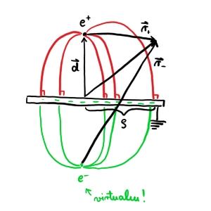

#+title: 5. vaje iz Elektromagnetnega polja
#+startup: nolatexpreview
#+startup: entitiespretty nil
#+startup: show2levels
#+latex_header: \usepackage{amsmath} \usepackage{unicode-math} \usepackage{cancel} \usepackage{graphicx}
#+latex_header: \renewcommand{\theta}{\vartheta} \renewcommand{\phi}{\varphi} \renewcommand{\epsilon}{\varepsilon}
#+latex_header: \newcommand{\odv}[1]{\dot{\vec{#1}}} \newcommand{\oddv}[1]{\ddot{\vec{#1}}}
#+latex_header: \newcommand{\rot}{\mathrm{rot}}\newcommand{\dive}{\mathrm{div}} \newcommand{\iu}{\mathrm{i}}
#+latex_header: \newcommand\mapsfrom{\mathrel{\reflectbox{\ensuremath{\mapsto}}}}
* Točkasti naboj nad prevodno ploščo

#+begin_problem
Na razdalji \( d \) nad veliko ozemljeno prevodno ploščo se nahaja točkasti naboj \( e \).

a) Določi potencial električnega polja povsod v prostoru. Kakšno je električno polje pod ploščo, se pravi na drugi strani?

b) Izračunaj površinsko gostoto naboja, ki se inducira na plošči, v odvisnosti od oddaljenosti od točke na plošči, ki je najbližje točkastemu naboju. Pokaži, da se celotni induciran naboj na plošči znaša ravno \( - e \). ali lahko do tega rezultata prideš tudi na enostaven način?
#+end_problem

** Točka a

Pri reševanju si bomo kot na sliki predstavljali, da imamo negativen naboj \( -e \) na drugi strani plošče. Potencialno polje je tako enako električnemu dipolu.

Za poljubno točko \( \vec{r} \) je njen potencial

\[ U \left( \vec{r} \right) = \frac{e}{4 \pi \epsilon_0} \left( \frac{1}{r_+} - \frac{1}{r_-} \right)
\]

Vektorja od pozitivnega in negativnega naboja do naše poljubne točke v prostoru zapišemo kot

\[ \vec{r}_+ = \vec{r} - \vec{d} \text{ in } \vec{r}_- = \vec{r} + \vec{d}
\]

Hkrati pa velja, da je dolžina do naše poljube točke enaka

\[ r ^2 = z ^2 + \rho ^2 \implies \ r ^2_{\pm} = \left( z \mp d \right) ^2 + \rho ^2.
\]

Potencial je tako

\[U \left( \vec{r} \right) = \frac{e}{4 \pi \epsilon_0} \left( \frac{1}{\sqrt{\left( z - d \right) ^2 + \phi ^2}}  - \frac{1}{\sqrt{\left( z + d \right) ^2 + \phi ^2}}\right)
\]

Električno polje pod ploščo je v resnici \( \vec{E} = 0 \), saj tam ni naboja, zato tam tudi ni potenciala.
** Točka b.1

Želimo izračunati površinsko gostoto naboja, ki se inducira na plošči. Za izračun uporabimo Gaussov zakon za košček površine

\[ \sigma = \frac{\mathrm{d} e}{\mathrm{d} S} = - \sigma E_{\perp } = \epsilon_0 \left. E_z \right|_{z = 0}
\]

Za izračun tega moramo odvajati potencial po \( z \)

\[ \left. E_z \right|_{z = 0} = \left. \frac{\partial }{\partial z}  U \left( \vec{r} \right) \right|_{z = 0}
\]

Po odvajanju dobimo

\[ \left. E_z  \right|_{z = 0} = - \frac{e}{4 \pi \epsilon_0} \left[ - \frac{1}{2} \left( \left( z - d \right)^2 + \phi ^2 \right)^{- \frac{3}{2}} + \frac{1}{2} \left( \left( z + d \right)^2 + \rho ^2 \right) ^{- \frac{3}{2}} \cdot 2 \left( z + d \right)  \right] = - \frac{ed}{2 \pi \epsilon_0} \left( \rho ^2 + d ^2 \right)^{- \frac{3}{2}}
\]

Torej je površinska gostota naboja

\[ \sigma_{ind} = - \frac{ed}{ 2 \pi} \left( \rho ^2 + d ^2 \right)^{- \frac{3}{2}}
\]

Pogledamo še limiti:

- za \( \rho \gg d \) je naboj \( \sim \rho ^{-3} \)
- za \( \rho \ll d \) je po razvoju \( \sim - \rho ^2 \)

  \[ \left[ d ^2 \left( 1 + \frac{\rho ^2}{d ^2} \right) \right]^{- \frac{3}{2}} = d^{- 3} \left( 1- \frac{3}{2} \frac{\rho ^2}{d ^2} + \ldots \right)
  \]
** Točka b.2

Celoten induciran naboj je enostavno integral po površini z upoštevanjem površinske gostote naboja.

\[ e_{plosca} = \iint\limits_S^{} \sigma \,\mathrm{d S} = \int\limits_0^{- \infty} \frac{-e d}{2\pi\left( \rho ^2 + d ^2 \right)^{\frac{3}{2}}} \cdot 2 \pi \rho \, \mathrm{d} \rho
\]

S spremenljivko \( u = \rho ^2 + d ^2 \) je naš integral

\[ e_{ind} = - \frac{ed}{2} \int\limits_{d ^2}^{\infty} u ^{- \frac{3}{2}} \, \mathrm{d} u = - \frac{ed}{2} \cdot \left( - \frac{1}{2} \right) \left. u^{- \frac{1}{2}} \right|_{d ^2}^{\infty} =  - e
\]
* Električna sila na točkasti naboj nad prevodno ploščo

#+begin_problem
Na razdalji \( d \) nad ozemljeno prevodno ploščo se nahaja točkasti naboj \( e \). Z uporabo napetostnega tenzorja izračunaj električno silo na točkasti naboj. Rezultat primerjaj s silo med točkastima nabojema \( e \) in \( -e \) v medsebojni razdalji \( 2d \).
#+end_problem
** Teorija

Električna sila \( \vec{F} \), ki deluje na naboje v zaprtem prostoru \( V \) z električnim poljem \( \vec{E} \) je

\[ \vec{F} = \epsilon_0 \iint\limits_{\partial V}^{} \left[ \vec{E} \left( \vec{E} \cdot \vec{n} \right) - \frac{1}{2} E ^2 \cdot \vec{n} \right] \, \mathrm{d} S,
\]

kjer je \( \vec{n} \) normala na površino prostora \( V \). Silo lahko zapišemo tudi z napetostnim tenzorjem

\[ \vec{F}_e = \epsilon_0 \iint\limits_{\partial V}^{} \left[ \vec{E} \otimes \vec{E} - \frac{1}{2} E ^2 \underline{I} \vec{n} \right]
\]
** Reševanje

Za reševanje si izberemo polsfero, kjer je naša prevodna plošča del ravnine polsfere. Premer te polsfere gre proti neskončnosti.

Dokažemo lahko (z malo mahanja rok), da je sila na ukrivljenem delu polsfere ničelna, ko \( R \to \infty \).

Sila je premosorazmerna z električnim poljem in površino. Električno polje pada kot pri dipolu, torej

\[ F_{ukrivljeno} \sim \left. \epsilon_0 E ^2 S \right|_{R \to \infty} \sim \left. \epsilon_0 \left( \frac{p_e}{r ^3} \right) 2 \pi r ^2 \right|_{R \to \infty} = \left. \frac{1}{r ^4} \right|_{R \to \infty} = 0
\]

Za površino, ki je vzporedna naši prevodni plošči, sta normala površine in električno polje vzporedna (navzdol). Njun skalarni produkt bo tako enak \( \vec{E} \cdot \vec{n} = E \). Sila je tako

\[ \vec{F}_e = \epsilon_0 \iint\limits_{S}^{} \left( E ^2 \vec{n} - \frac{1}{2} E ^2 \vec{n} \right) \, \mathrm{d} S = \frac{\epsilon_0 \vec{n}}{2} \iint\limits_S^{} E ^2 \, \mathrm{d} S
\]

Integriramo v mejah od \( [0, 2\pi) \) in \( (- \infty, \infty) \). Upoštevamo izraz za \( E_{\perp } \)

\[ \vec{F}_e = \vec{n} \frac{e ^2 \epsilon_0 2\pi}{4 \pi ^2 \epsilon_0 ^2 d ^2 2} \int\limits_0^{\infty} \frac{\rho}{d} \frac{1}{\left( 1 + \frac{\rho ^2}{\rho ^2} \right)^{-3}} \frac{\mathrm{d} \rho}{d} = \frac{e ^2 \vec{n}}{16 \pi \epsilon_0 d ^2} = \frac{e ^2}{4 \pi \epsilon_0 \left( 2 d \right) ^2} \cdot \left( - \hat{e}_n \right)
\]

Zadnji enačaj nam pove, da lahko na to električno silo gledamo kot električna sila med pozitivinim in negativnim nabojem, ki sta na razdalji \( 2d \).
* Električna sila na polovico prevodne krogle

#+begin_problem
Prevodno kroglo polmera \( a \) postavimo v navpično homogeno električno polje jakosti \( E_0 \). Izračunaj električno silo, ki deluje na zgornjo polovico krogle. V katero smer kaže ta sila?
#+end_problem

Naj električno polje kaže v navpični smeri navzgor. Prispevka k električni sili imamo dva. Zaradi električnega polja ima prevodna krogla v zgornji polovici na površini pozitiven naboj, na spodnji polovici pa negativen naboj. Zanima nas sila na zgornjo polovico krogle.

Ne moremo se poslužiti neskončne polsfere kot v prejšnjem primeru, saj nam integral po ukrivljeni površini v resnici divergira. Namesto tega bomo uporabili površino, ki tesno objame površino, ki nas zanima. V tem primeru ima tudi dodaten bonus, da točno poznamo smer električne polja (pravokotno na površino).

Ravnina polsfere ne prispeva k sili, saj znotraj ni električnega polja.

Pri računanju sile postopamo podobno kot prej

\[ \vec{F}_e = \frac{\epsilon_0}{2} \iint\limits_S^{} E ^2 \hat{n} \, \mathrm{d} S
\]

Tokrat normale ne nesemo iz integrala, saj je tesno povezana s delčkom površine, po katerem integriramo.

Recikliramo rezultat prejšnjih vaj, kjer je električno polje te krogle

\[ \left. E_r \right|_{r = a} = 3 E_0 \cos \theta
\]

Enotsko normala ima v sferičnih koordinatah sledeče komponente

\[ \vec{n} = \begin{bmatrix} \sin \theta \cos \phi \\ \sin \theta \sin \phi \\ \cos \theta \end{bmatrix},
\]

medtem ko je površinski element pri radiju \( r = a \) enak

\[ \mathrm{d} S = a ^2 \mathrm{d} \phi \sin \theta \, \mathrm{d} \theta
\]

Ob upoštevanju tega je električna sila

\[ \vec{F}_e  = \frac{\epsilon_0}{2} \int\limits_0^1 \int\limits_0^{2\pi} \left( 3 E_0 \cos \theta \right) ^2 \begin{bmatrix} \sin \theta \cos \phi \\ \sin \theta \sin\phi \\ \cos \theta \end{bmatrix} a ^2 \, \mathrm{d} \phi \, \mathrm{d} \left( \cos \theta \right)
\]

Integrala po prvih dveh komponentah bosta zaradi integrala kosinusa ali sinus po mejah \( [0, 2\pi) \) ničelna. Integral po tretji komponenti pa je

\[ \vec{F}_{e z } = \frac{9 \epsilon_0 E_0 ^2 a ^2}{2 } 2\pi \int\limits_0^1 \cos ^2 \theta \, \mathrm{d} \left( \cos \theta \right) = \frac{9 \pi}{4} \epsilon_0 E_0 ^2 a ^2
\]

Sila v tretji komponenti je pozitivna, torej kaže navzgor.
* Točkasti naboj v kotu med dvema pravokotnima prevodnima ploščama

#+begin_problem
Točkasti naboj \( e \) sr nahaja v kotu med dvema razsežnima prevodnima ozemljenima ploščama, ki sta pravokotni drga na drugo, tako da je od vsake oddaljen za razdaljo \( a \).

a) Izračunaj kvadrupolni moment nastale porazdelitve nabojev.
b) Kako se obnaša potencial električnega polja v veliki oddaljenosti \( r \), kjer je \( r \gg a \)?

Potencial električnega polja, ki ga povzroči lokalizirana porazdelitev nabojev v točki \( \vec{r} \), v multipolnem razvoju zapišemo kot

\[ U \left( \vec{r} \right) = \frac{1}{ 4\pi \epsilon_0} \left( \frac{e}{r} + \sum\limits_i^{} p_i \frac{ r_i}{r ^3} + \sum\limits_{i j}^{} Q_{ij} \frac{r_i r_j}{r ^5} \right),
\]

kjer so \( p_i = \int\limits_{}^{} \rho \left( \vec{r} \, ' \right) \vec{r}_i \, ' \, \mathrm{d} ^3 \vec{r} \, ' \) komponente vektorja dipolnega momenta in

\[ Q_{ij} = \int\limits_{}^{} \rho \left( \vec{r} \, ' \right) \left[ 3 r_i ' r_j ' - \delta_{ij} r' ^2 \right] \, \mathrm{d} ^3 \vec{r} \, '
\]

komponente tenzorja kvadrupolnega momenta, \( \rho \left( \vec{r} \, ' \right) \) pa je prostorninska gostota naboja v točki \( \vec{r} \,' \)
#+end_problem

Člen \( \delta_{ij} r' ^2 \) zagotovi brezslednost tenzorja.
