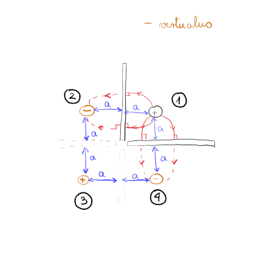

#+title: 6. vaje iz Elektromagnetnega polja
#+startup: nolatexpreview
#+startup: entitiespretty nil
#+startup: show2levels
#+latex_header: \usepackage{amsmath} \usepackage{unicode-math} \usepackage{cancel} \usepackage{graphicx}
#+latex_header: \renewcommand{\theta}{\vartheta} \renewcommand{\phi}{\varphi} \renewcommand{\epsilon}{\varepsilon}
#+latex_header: \newcommand{\odv}[1]{\dot{\vec{#1}}} \newcommand{\oddv}[1]{\ddot{\vec{#1}}}
#+latex_header: \newcommand{\rot}{\mathrm{rot}}\newcommand{\dive}{\mathrm{div}} \newcommand{\iu}{\mathrm{i}}
#+latex_header: \newcommand\mapsfrom{\mathrel{\reflectbox{\ensuremath{\mapsto}}}}

... nadaljujemo od zadnjič

* Točkasti naboj v kotu med dvema pravokotnima prevodnima ploščama

#+begin_problem
Točkasti naboj \( e \) sr nahaja v kotu med dvema razsežnima prevodnima ozemljenima ploščama, ki sta pravokotni drga na drugo, tako da je od vsake oddaljen za razdaljo \( a \).

a) Izračunaj kvadrupolni moment nastale porazdelitve nabojev.
b) Kako se obnaša potencial električnega polja v veliki oddaljenosti \( r \), kjer je \( r \gg a \)?

Potencial električnega polja, ki ga povzroči lokalizirana porazdelitev nabojev v točki \( \vec{r} \), v multipolnem razvoju zapišemo kot

\[ U \left( \vec{r} \right) = \frac{1}{ 4\pi \epsilon_0} \left( \frac{e}{r} + \sum\limits_i^{} p_i \frac{ r_i}{r ^3} + \sum\limits_{i j}^{} Q_{ij} \frac{r_i r_j}{r ^5} \right),
\]

kjer so \( p_i = \int\limits_{}^{} \rho \left( \vec{r} \, ' \right) \vec{r}_i \, ' \, \mathrm{d} ^3 \vec{r} \, ' \) komponente vektorja dipolnega momenta in

\begin{equation}
\label{eq:1}
 Q_{ij} = \int\limits_{}^{} \rho \left( \vec{r} \, ' \right) \left[ 3 r_i ' r_j ' - \delta_{ij} r' ^2 \right] \, \mathrm{d} ^3 \vec{r} \, '
\end{equation}

komponente tenzorja kvadrupolnega momenta, \( \rho \left( \vec{r} \, ' \right) \) pa je prostorninska gostota naboja v točki \( \vec{r} \,' \)
#+end_problem

Člen \( \delta_{ij} r' ^2 \) zagotovi brezslednost tenzorja \( Q \)

Skupen naboj monopola je ničeln, saj je vsota vseh naboj \( 0 \). Enako je z dipolnim členom, kjer se paroma nasprotni naboji izničijo. Torej prvi neničelni člen je kvadrupolni člen. Enačbo \ref{eq:1} zapišemo diskretno

\[ Q_{ij } = \sum\limits_{k = 1}^4 e_k \left[ 3 r_{ik} ' r_{j, k} ' - \delta_{ij} r_k ' ^2 \right]
\]

Tenzor \( Q \) bo simetričen zaradi simetričenga primera.

Prva komponenta \( Q_{xx } \) je

\begin{align*}
  Q_{xx } &= \sum\limits_{k = 1}^4 e_k \left( 3 x_n ^2 - \delta_{ij} r_k ^2 \right) \\
&= e \left( 3 a ^2 - 1 \left( \sqrt{2} a \right) ^2 \right) - e \left[ 3 \left( -a \right) ^2 - 1 \left( \sqrt{2}a \right) ^2 \right] + e \left[ 3 \left( -a \right)^2 -1 \left( \sqrt{2} a \right) ^2 \right] - e \left[ 3 a ^2 - 1 \left( \sqrt{2} a \right) ^2 \right] = 0
\end{align*}

Analogno sledi za \( Q_{yy} \) in \( Q_{zz} \). Vsi delci (virtualni in realni) ležijo v ravnini \( z = 0 \), kar pomeni, da so vse komponente tenzorja z \( z \) indeksom ničelne. Preostaneta še člena \( Q_{xy} \) in \( Q_{yx} \). Zaradi simetričnosti tenzorja izračunamo samo enega in imamo oba:

\begin{align*}
  Q_{xy} &= \sum\limits_{k = 1}^{} e_k \left( 3 x_n y_n - 0 \cdot r_n ^2 \right) \\
&= e 3 a ^2 - e \cdot 3(-a \cdot a) + e \cdot 3 \left( - a \right) ^2 - e 3 \left( -a \cdot a \right) = 12 e a ^2
\end{align*}

Tenzor \( Q \) tako izgleda

\[ \underline{Q} = \begin{bmatrix}
             0 & 12e a^{2} &  \\
             12 ea^{2} & 0 & 0 \\
             0 & 0 & 0
             \end{bmatrix}
\]

Dopolni nalogo.
* Magnetno polje krožne tokovne zanke
** Teorija magnetostatike

Za magnetostatiko velja, da je \( I = \mathrm{konst} \). K naši zbirki enačb bomo dodali še dve Maxwellovi enačbi. Prva je

\begin{equation}
\label{eq:2}
 \nabla \cdot \vec{B} = 0
\end{equation}

Ta enačba eliminira magnetne monopole in z njo lahko zapišemo magnetno polje s pomočjo vektorskega potenciala

\[ \vec{B} = \vec{\nabla} \times \vec{A}.
\]

Druga (nepopolna) enačba, ki jo dodamo na repertuar je Amperova enačba

\begin{equation}
\label{eq:3}
 \vec{\nabla} \times \vec{B} = \mu_0 \vec{\jmath}
\end{equation}

V enačbo \ref{eq:3} vstavimo definicijo vektorskega potenciala in dobimo

\[ \vec{\nabla} \times \left( \vec{\nabla} \times \vec{A} \right) = \mu_0  \vec{\jmath}.
\]

Enačba se z uporabi matematičnih identitet pretvori v

\[ \vec{\nabla} \left( \vec{\nabla} \cdot \vec{A} \right) - \nabla ^2 \vec{A} = \mu_0 \vec{\jmath}.
\]

Vektorski potencial si izberemo tako, da je \( \vec{\nabla} \cdot \vec{A} = 0 \). Iz tega sledi enačba

\[ \nabla ^2 \vec{A} \left( \vec{r} \right) = - \mu_0 \vec{\jmath} \left( \vec{r} \right)
\]

To je tridimenzionalna enačba, katere ekvivalent v elektrostatiki je

\[ \nabla ^2 U \left( \vec{r} \right) = - \frac{\rho \left( \vec{r} \right)}{\epsilon_0}.
\]

\[ \vec{A} \left( \vec{r} \right) = \frac{\mu_0}{4 \pi} \int\limits_{}^{}\frac{\mathrm{d} ^3 \vec{r} \, ' \vec{\jmath} \left( \vec{r}\, ' \right)}{\left| \vec{r} - \vec{r} \, ' \right|}
\]
