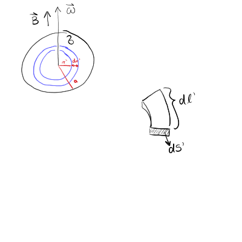
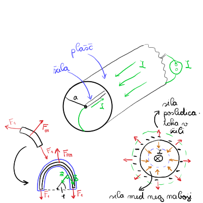
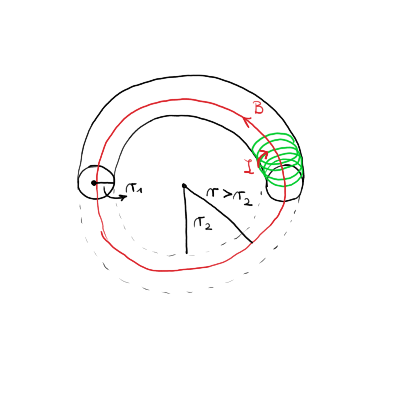
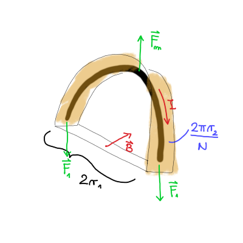

#+title: 7. vaje iz Elektromagnetnega polja
#+startup: nolatexpreview
#+startup: entitiespretty nil
#+startup: show2levels
#+latex_header: \usepackage{amsmath} \usepackage{unicode-math} \usepackage{cancel} \usepackage{graphicx}
#+latex_header: \renewcommand{\theta}{\vartheta} \renewcommand{\phi}{\varphi} \renewcommand{\epsilon}{\varepsilon}
#+latex_header: \newcommand{\odv}[1]{\dot{\vec{#1}}} \newcommand{\oddv}[1]{\ddot{\vec{#1}}}
#+latex_header: \newcommand{\rot}{\mathrm{rot}}\newcommand{\dive}{\mathrm{div}} \newcommand{\iu}{\mathrm{i}}
#+latex_header: \newcommand\mapsfrom{\mathrel{\reflectbox{\ensuremath{\mapsto}}}}
* Magnetno polje nabite vrteče se okrogle plošče :1_kolokvij:
** Točka a)

Operiramo z Biot-Savartovim zakonom

\[ \vec{B}\left( \vec{r} \right) = \frac{\mu_0}{4 \pi} \int\limits_{}^{} \frac{\vec{\jmath} \left( \vec{r} \, ' \right) \times \left( \vec{r} - \vec{r} \, ' \right)}{\left| \vec{r} - \vec{r} \, ' \right| ^3} \, \mathrm{d} ^3 \vec{r} \, '
\]

Napisali smo, da je tok kolobarja enak

\[ \mathrm{d} I = \frac{\mathrm{d} e}{t_0} = \sigma \omega r' \, \mathrm{d} r'
\]

V Biot-Savartovem zakonu lahko zapišemo

\begin{align*}
  \vec{\jmath} \left( \vec{r} \, ' \right) \mathrm{d} ^3 \vec{r} \, ' &= \vec{\jmath} \left( \vec{r} \, ' \right) \, \mathrm{d} S ' \, \mathrm{d} l' \\
&= \mathrm{d} I \cdot \hat{t} \cdot r' \mathrm{d} \phi,
\end{align*}

kjer smo upoštevali \( \vec{\jmath} \mathrm{d} S = \mathrm{d} I \cdot \hat{t} \) ter \( \mathrm{d} l = r' \mathrm{d} \phi \).

Računamo za vektor \( \vec{r} = (0, 0, z) \). Radij vektor na plošči ima komponente \( \vec{r} \, ' = (r' \cos \phi, r' \sin t, 0) \). Tangentni vektor na kolobar pa je \( \hat{t} = (- \sin \phi, \cos \phi, 0) \).

Izračunajmo najprej vektorski produkt

\[ \hat{t} \times \left( \vec{r} - \vec{r} \,' \right) = \left( z \cos \phi, z \sin \phi, r \right).
\]

Velja tudi

\[ \left| \vec{r} - \vec{r} \, ' \right| ^3 = \left( r ' ^2 + z ^2 \right)^{\frac{3}{2}}.
\]

Nadomestimo izračunane stvari v Biot-Savartovem zakonu

\[ \vec{B} = \frac{\mu_0}{4 \pi} \int\limits_0^{2 \pi} \int\limits_0^a \begin{bmatrix} z \cos \phi \\ z \sin \phi \\ r' \end{bmatrix} \frac{\sigma \omega r ^2 \, \mathrm{d} r' \mathrm{d} \phi}{\left( r '^2 + z ^2\right)^{\frac{3}{2}}}
\]

Iz tega sledi, da sta \( B_x = B_y = 0 \).

Izračunamo magnetno polje še \( B_z \), katerega integral je

\[ B_z (z) = \frac{\mu_0 \sigma \omega}{2} \int\limits_0^a \frac{r' ^3}{\left( r' ^2 + z ^2 \right)^{\frac{3}{2}}} \, \mathrm{d} r'
\]

Z uvedbo nove spremenljivke \( u = r ' + z ^2 \), katere diferencial je \( \mathrm{d} u = 2 r' \, \mathrm{d} r ' \), se naš integral preobrazi v

\begin{align*}
 B_z &= \frac{\mu_0 \sigma \omega}{4} \int\limits_{z ^2}^{a ^2 + z ^2} \frac{u - z ^2}{u^{\frac{3}{2}}} \, \mathrm{d} u \\
&= \frac{\mu_0 \sigma \omega}{4} \int\limits_{z ^2}^{a ^2 + z ^2} \left[ u^{- \frac{1}{2}} - z ^2 u^{- \frac{3}{2}} \right] \, \mathrm{d} u \\
&= \left.  \frac{\mu_0 \omega \sigma}{4} \left[ 2 u^{\frac{1}{2}} + 2 z ^2 u^{- \frac{1}{2}} \right] \right|_{z ^2}^{a ^2 + z ^2} \\
&= \frac{\mu_0 \sigma \omega}{2} \left(\frac{a ^2 + 2 z ^2}{\sqrt{a ^2 + z ^2}} - 2z\right)
\end{align*}
** Točka c)

Opazujemo limitni primer \( z \gg a \) oziroma \( \frac{a}{z} \ll 1 \) pri polju

\[ B_z (z) = \frac{\mu_0 \omega \sigma}{2} \left( \frac{a ^2 + 2 z ^2}{z \sqrt{1 + \frac{a ^2}{z ^2}}} - 2z \right)
\]

Razvijemo koren v imenovalcu preko zveze, ki smo jo že večkrat povedali

\[ \left( 1 + \frac{a ^2}{z ^2} \right)^{ - \frac{1}{2}} = 1 - \frac{1}{2} \frac{a ^2}{z ^2} + \frac{3}{8} \frac{a ^4}{z ^4},
\]

kjer smo upoštevali \( \binom{- \frac{1}{2}}{2} = \frac{3}{8} \). Razvili smo za dodaten člen, saj se nam bodo členi pokrajšali. Ekstra člen bo označen z *odebeljenim* fontom.

\begin{align*}
  B(z) &= \frac{\mu_0 \omega \sigma}{2} \left( \frac{1}{z} \left( a ^2 + 2 z ^2 \right) \left[ 1 - \frac{1}{2} \frac{a ^2}{z ^2} + \mathbf{\frac{3}{8} \frac{a ^4}{z ^4}} + \ldots \right] - 2z \right) \\
&= \frac{\mu_0 \omega \sigma}{2} \left( \frac{1}{z} \left[ a ^2 - \frac{1}{2} \frac{a ^4}{z ^2 + \mathrm{\frac{3}{8} \frac{a ^6}{z ^4}}} + 2 z ^2 - a ^2 + \mathbf{\frac{3}{4} \frac{a ^4}{z ^2}} \right] - 2 z \right) \\
&= \frac{\mu_0 \omega \sigma}{2} \left( \frac{a ^2}{z} - \frac{1}{2} \frac{a ^4}{z ^3} - \frac{a ^3}{z} + \mathbf{\frac{3}{8} \frac{a ^6}{z ^5}} + \mathbf{  \frac{3}{4} \frac{a ^4}{z ^3}}  \right) \\
&= \frac{\mu_0 \omega \sigma a ^2}{8 z ^3}
\end{align*}

Zanemarili smo člen z \( \frac{1}{z ^5} \), saj pada hitreje kot \( \frac{1}{z ^3} \). V primeru, če ne bi upoštevali dodatnega člena, bi dobili napačno predznačen in dvakrat večji rezultat

\[ - \frac{\mu_0 \sigma \omega a ^4}{4 z ^3} \quad \text{NAPAČEN REZULTAT !!!!}
\]

** Točka b)

Magnetno polje dipola je

\[ \vec{B}_{dip} = \frac{\mu_0}{4 \pi} \frac{3 \left( \vec{r} \cdot \vec{p}_m \right)\vec{r} - \vec{p}_m r ^2}{r ^5}.
\]

Po definiciji vektorskega potenciala je potem

\[ \vec{A}_{dip} = \frac{\mu_0}{4\pi} \frac{\vec{p}_m \times \vec{r}}{r ^3}
\]

Opazujemo magnetni dipol v osi dipola, torej \( \vec{p}_m \parallel \vec{r} \). Magnetno polje je takrat

\begin{equation}
\label{eq:1}
 B_{dip} = \frac{\mu_0}{4 \pi} \frac{3 ^2 p_m- r ^2 p_m}{r ^5} = \frac{\mu_0}{2 \pi} \frac{p_m}{r ^3}
\end{equation}

V ekvatorialni ravnini pa velja \( \vec{r} \perp \vec{p}_m \) in magnetno polje je

\[ B_{dip} = - \frac{\mu_0}{4 \pi} \frac{p_m}{r ^3}
\]

Magnetni dipol lahko izračunamo preko enačbe

\[ \vec{p}_m = \frac{1}{2} \int\limits_{}^{} \vec{r} \, ' \times \vec{\jmath} \left( \vec{r} \, ' \right) \, \mathrm{d} ^3 \vec{r}\, '
\]

Drugi način je, da izračunamo po prispevkih kolobarja, saj

\[ \mathrm{d} p_m = S' \, \mathrm{d} I = \pi r' ^2 \sigma \omega r' \, \mathrm{d} r\, ' \implies p_m = \pi \sigma \omega \int\limits_0^a r' ^3 \, \mathrm{d} r\, ' = \frac{\pi \sigma \omega}{4} a ^4
\]

Lahko pa tudi preberemo iz enačbe \ref{eq:1} skupaj z rezultatom iz točke c.
* Magnetna sila v koaksialnem kablu
#+begin_problem
Dolg koaksialni kabel je sestavljen iz tanke prevodne cevi polmera \( a \), po osi katere poteka tanek prevodni vodnik. Po vodniku spustimo električni tok \( I \), ki se v nasprotni smeri vrača enakomerno porazdeljen po plašču. Izračunaj silo na dolžinsko enoto, s katero je po obodu napeta cev koaksialnega kabla.
#+end_problem

Zanima nas dolžinska gostota sile plašča \( f_1 = \frac{F_1}{l} \).

Na plašč delujeta dve sili - magnetna sila, ki kaže navzven in je posledica odbijajočih se magnetnih polj. Magnetna polja sta odbijajoča, saj je električni tok različno usmerjen. Druga sila, ki kaže navznoter, pa je posledica toka, ki teče po plašču in predstavlja površinsko napetost - kakor napiše Mastnak, str. 36, predstavljamo si, da je plašč sestavljen iz veliko vzporednih žic, po katerih teče tok in se med seboj privlačijo.

Kakor vidimo na sliki, je silo na majhen delček plašča precej grdo izračunati. Raje uporabimo podoben trik kakor pri nalogah površinske napetosti, kjer uporabimo polovico plašča, saj takrat velja \( F_m = 2 F_1 \).

S pomočjo Amperovega zakona lahko določimo magnetno polje znotraj in zunaj plašča

\[ \oint\limits_{}^{} \vec{B} \, \mathrm{d} \vec{l} = \mu_0 I_{tot},
\]

kjer je \( I_{tot} \) celoten zaobjet tok. Označimo tok po žili z \( I_z \), tok po plašču pa je \( I_p \), ki sta po velikosti enaka.

Zunaj plašča, kjer se nahajamo na točki \( r > a \) (zelena črtkana črta, spodaj desno na sliki), je totalen zaobjet tok \( I_{tot} = I_z - I_p = 0 \). Iz tega sledi, da je magnetno polje zunaj žile ničelno \( \vec{B} = 0 \). Znotraj žile, v točki \( r < a \) (modra črtkana črta, spodaj desno na sliki), pa je zaobjet tok samo tok žile, iz česar sledi magnetno polje

\begin{equation}
\label{eq:2}
 B \cdot 2 \pi r = \mu_0 I \implies B = \frac{\mu_0 I}{2 \pi r}
\end{equation}

Ker zunaj plašča ni magnetnega polja, pomeni, da tudi ni magnetne sile.

Izračunajmo še magnetno silo znotraj plašča. Majhno površino plašča \( \mathrm{d} S \) zapišemo kot

\[ \mathrm{d} S = a \mathrm{d} \phi l
\]

Ker integriramo po ploskvi, ki tesno objema površino plašča (modra črta, spodaj levo na sliki), velja, da sta magnetno polje \( \vec{B} \) in normala ploskve \( \vec{n} \) pravokotna. Magnetno polje \( \vec{B} \) je tangentno na polkrožnico. Če si predstavljamo plašč iz velikega števila žic, bo vsaka žica imela svoje magnetno polje, ki jo obkroža. Ko naredimo vsoto teh magnetnih polj, ostane samo tangentna komponenta. Iz tega sledi, da je njun skalarni produkt \( \vec{B} \cdot \vec{n} = 0 \). Splošna formula za magnetno silo

\[ \vec{F}_m = \frac{1}{\mu_0} \oint\limits_S^{} \left[ \vec{B} \left( \vec{B} \cdot \vec{n} \right) - \frac{1}{2} B ^2  \vec{n}\right] \, \mathrm{d} S
\]

postane

\[ \vec{F}_{m2} = - \frac{1}{2 \mu_0} \int\limits_0^{\pi} B ^2 \vec{n} a l \, \mathrm{d} \phi,
\]

kjer je normala tangentna na površino, ki jo opišemo s cilindričnimi koordinatami \( \vec{n} = [\cos \phi, \sin \phi] \). Upoštevamo \ref{eq:2} in dobimo

\[ \vec{F}_{m2} = \frac{a l}{2 \mu_0} \left( \frac{\mu_0 I}{2 \pi a} \right) ^2 \int\limits_0^{\pi} \begin{bmatrix} \cos \phi \\ \sin \phi \end{bmatrix} \, \mathrm{d} \phi.
\]

Vrednost integrala \( \int_0^{\pi} \cos \phi \, \mathrm{d} \phi \) je \( 0 \), vrednost drugega integrala \( \int_0^{\pi} \sin \phi \, \mathrm{d} \phi \) pa je \( 2 \).

Dolžinska gostota sile je tako

\[ \frac{\vec{F}_{m2}}{l} = \frac{\mu_0 I}{4 \pi ^2 a} \begin{bmatrix} 0 \\ 1 \end{bmatrix}
\]

Sila ima pozitivno \( y \) komponento, torej kaže navzgor za zgornjo polovico plašča. To pomeni, da sila magnetna sila razpenja

\[ \frac{F_1}{l} = \frac{\mu_0 I ^2}{8 \pi ^2 a}
\]

* Magnetna sila v toroidni tuljavi

#+begin_problem
Po toroidni tuljavi s številom ovojev \( N \) teče električni tok \( I \). Polmer ovojev tuljave je \( r_1 \), os tuljave pa opisuje krog s polmerom \( r_2 \) v vodoravni ravnini.

a) Pokaži, da je gostota magnetnega polja znotraj tuljave odvisna le od oddaljenosti od navpične osi torusa \( r \) in jo izračunaj. Pokaži, da zunaj tuljave ni polja.
b) Za primer \( r_2 \gg r_1 \) z uporabo napetostnega tenzorja izračunaj, s kakšno silo je napet posamezni ovoj tuljave.
#+end_problem

S pomočjo Amperovega zakona in zaprte krivulje na razdalji \( r_1 < r < r_2 \) okrog središča torusa, ki leži v njegovi ravnini.

\begin{equation}
\label{eq:3}
 B_{in} 2 \pi r = \mu_0 N I \implies \, B_{in} = \frac{\mu_0 NI}{2 \pi r}
\end{equation}

Zunaj tuljave za zaprto krivuljo \( r > r_2 \) v torusovi ravnini velja

\[ B_{zunaj} 2 \pi r = \mu_0 \left( NI + N (-I) \right) = 0 \implies B_{zunaj} = 0
\]

V nadaljevanju bomo opazovali zgornji polkrog ene tuljavine zanke. Opazuj spodnjo sliko

Magnetno polje \( \vec{B} \) je usmerjeno pravokotno na zanko. Preko pravila desne roke hitro pridemo do zaključka, da magnetna sila deluje navzgor. Sili \( F_1 \), ki držita zanko skupaj, pa kažeta navzdol in velikost ene sile \( F_1 \) je ravno polovica magnetne sile \( F_m \).

Magnetna sila \( \vec{F}_m \) je po definiciji

\[ \vec{F}_m = \frac{1}{\mu_0} \oint_S^{} \left[ \vec{B} \left( \vec{B} \cdot \vec{n} \right) - \frac{1}{2} B ^2 \vec{n} \right] \, \mathrm{d} S
\]

Ploskva, po kateri integriramo je polovica valja, kjer polkrožnica zanke definira plašč - na sliki je plašč označen z oranžno barvo.

Integracijo po površini razdelimo na 4 dele - levo osnovno ploskev polvalja, desno osnovno ploskev polvalja, plašč ter spodnjo, pravokotno površino.

Plašč se nahaja malo nad zanko in kakor smo prej povedali, zunaj magnetnega polja ni, torej tudi ni sile.

Osnovni ploskvi polvalja imata enaki velikosti magnetnega polja, vendar nasprotno predznačeni in se zato pokrajšata.

Edina netrivialna stranica je torej spodnji pravokotnik. Normala pravokotnika kaže ven, navzdol iz valja in je pravokotna z magnetnim polje \( \vec{B} \). Magnetni sili tako ostane zgolj

\[ \vec{F}_{ms} = -\frac{1}{2 \mu_0} \iint\limits_{\square}^{} B ^2 S \hat{n}_s
\]

Zaradi predpostavke \( r_2 \gg r_1 \) se magnetno polje \ref{eq:3} zapiše kot

\[ B = \int\limits_{r_1}^{r_1 + r_2} \frac{\mu_0 NI}{2 \pi r} \, \mathrm{d} r \approx \frac{\mu_0 NI}{2 \pi r_2}.
\]

Površina pravokotnika pa je zmnožek dolžine \( 2 r_1 \) ter širine, ki je ravno ena \( N \)-tina obsega zanke, kar pomeni, da se ne rabimo mučiti z integralom!

Torej

\[ \vec{F}_{ms} = - \frac{1}{2} \left(-\vec{n}_s\right)  \frac{1}{2 \mu_0} B ^2 S = \vec{n}_s \frac{\mu_0 ^2 N ^2 I ^2 \cdot 2 r_1 \cdot 2 \pi r_2}{4 \pi ^2 r_2 ^2 \cdot 2 \mu_0 N} = \vec{n}_s \frac{\mu_0 N I ^2 r_1}{2 \pi r_2}
\]

Magnetna sila kaže v navzgor in ovoj razteguje. Sila napetosti je potem

\[ F_1 = \frac{F_m}{2} = \frac{\mu_0 N I ^2}{4 \pi} \frac{r_2}{r_1}
\]
* Opomnik h kolokviju

Osnovnih enačb, kakor so sila vodnika

\[ \vec{F}_m = I \vec{l} \times \vec{B}
\]

in sila za naboj

\[ \vec{F}_e = e \vec{E},
\]

na listu kolokvija ni, vendar je pričakovano, da jih poznaš.
