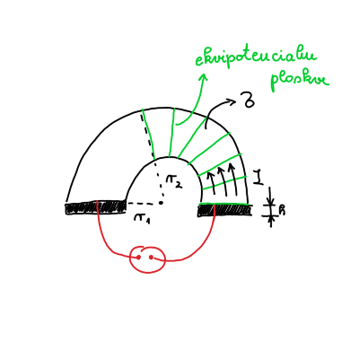
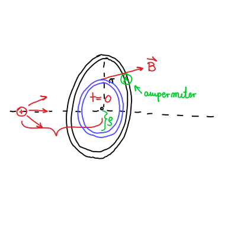
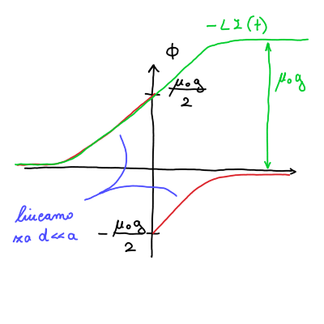
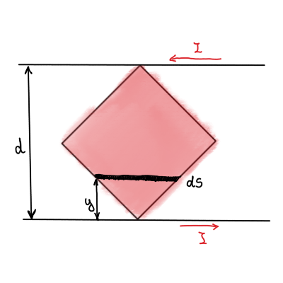

#+title: 8. vaje iz Elektromagnetnega polja
#+startup: nolatexpreview
#+startup: entitiespretty nil
#+startup: show2levels
#+latex_header: \usepackage{amsmath} \usepackage{unicode-math} \usepackage{cancel} \usepackage{graphicx}
#+latex_header: \renewcommand{\theta}{\vartheta} \renewcommand{\phi}{\varphi} \renewcommand{\epsilon}{\varepsilon}
#+latex_header: \newcommand{\odv}[1]{\dot{\vec{#1}}} \newcommand{\oddv}[1]{\ddot{\vec{#1}}}
#+latex_header: \newcommand{\rot}{\mathrm{rot}}\newcommand{\dive}{\mathrm{div}} \newcommand{\iu}{\mathrm{i}}
#+latex_header: \newcommand\mapsfrom{\mathrel{\reflectbox{\ensuremath{\mapsto}}}}
* Upornost prevodne ploščice

#+begin_problem
Iz kovinske plošče debeline \( d \) s specifično prevodnostjo \( \sigma \) izrežemo ploščico v obliki polovice kolobarja z notranjim polmerom \( r_1 \) in zunanjim polmerom \( r_2 \). Na ravni stranici ploščice naparimo elektrodi iz zelo dobrega prevodnika, mednju pa priključimo izvor konstantne napetosti \( U_0 \), kakor prikazuje slika. Določi potencial električnega polja v ploščici in s pomočjo tega izračunaj upor ploščice.
#+end_problem

Napišemo EMP-jevsko različico Ohmovega zakona, ki je stacionarni tok

\[ \vec{\jmath} = \sigma \vec{E},
\]

kjer je \( \sigma \) specifična prevodnost. Spomnimo, da je električno polje definirano preko potenciala kot \( \vec{E} = - \nabla U \), iz česar sledi

\begin{equation}
\label{eq:1}
 \vec{\jmath} = - \sigma \nabla U.
\end{equation}

Uporabimo še kontinuitetno enačbo

\[ \frac{\partial \rho}{\partial t} + \nabla \cdot \vec{\jmath} = 0 \implies \ \nabla \cdot \vec{\jmath} = 0
\]

Člen \( \frac{\partial \rho}{\partial t} = 0  \) povsod na prevodniku, saj nimamo nikjer na prevodniku izvora ali ponora.

Z vstavitvijo enačbe \ref{eq:1} v kontinuitetno enačbo dobimo Laplaceovo enačbo v cilindričnih koordinatah

\[ \nabla \cdot \vec{\jmath} = - \sigma \nabla ^2 U = 0.
\]

Na prevodniku torej velja

\[ \nabla ^2 U = 0.
\]

Splošna rešitev Laplaceove enačbe v valjni geometriji je

\begin{equation}
\label{eq:2}
 U \left( r, \phi \right) = \sum\limits_{m = 1}^{\infty} \left( A_m \cos (m\phi) + B_m \sin (m \phi) \right) \left( C_m r^m + D_m r^{-m} \right)
\end{equation}

Tokrat si bomo ogledali tudi rešitev za \( m = 0 \), saj nimamo periodične situacije. Nastavek \( U(r, \phi) = R(r) \Phi(\phi) \) vstavimo v Laplaceovo enačbo, da dobimo sistem dveh enačb

\[ r ^2 R'' + r R' - \cancel{m ^2 R} = 0 \implies R = c \ln r + d
\]

ter

\[ \Phi '' + \cancel{m ^2 \Phi} = 0 \implies \Phi = a \phi + b
\]

Splošno rešitev \ref{eq:2} razširimo z dobljenimi rezultati

\begin{equation}
\label{eq:6}
 U \left( r, \phi \right) = \sum\limits_{m = 1}^{\infty} \left( A_m \cos (m\phi) + B_m \sin (m \phi) \right) \left( C_m r^m + D_m r^{-m} \right) + \left( a\phi + b \right) \left( c \ln r + d \right)
\end{equation}

Desno elektrodo postavimo na potencial \( 0 \), torej bo naš prvi robni pogoj

\begin{equation}
\label{eq:3}
U \left( r, 0 \right) = 0.
\end{equation}

Drugi robni pogoj je leva elektroda, ki mora biti na manjšem potencialu, zato da tok teče v smeri naraščajočega kota \( \phi \).

\begin{equation}
\label{eq:4}
U (r, \pi) = - U_0.
\end{equation}

Električni tok teče tangentno na polmer in zahtevamo, da na ukrivljenih delih ploščice ne odhaja ven - torej bosta radialna gostota električnega toka in jakost električnega polja ničelna.

\begin{align} \label{eq:tok}
 \vec{\jmath}_r (r_{1, 2} \phi)&= 0  \\ \label{eq:polje}
E_r (r_{1, 2}) &= 0
\end{align}

Enačba \ref{eq:polje} poda robni pogoj po definiciji potenciala

\begin{equation}
\label{eq:5}
E_r = - \frac{\partial U}{\partial r}  (r_{1, 2}, \phi) = 0.
\end{equation}

Zaradi radialne neodvisnosti pomeni, da bo naša splošna rešitev \ref{eq:6} tudi neodvisna od radija. Posledično bodo členi \( C_m \), \( D_m \) in \( c \) enaki \( 0 \). Preostane nam torej enačba

\[ U(r, \phi) = (a\phi + b) d =  A \phi + B
\]

Robni pogoj \ref{eq:3} nam sedaj za našo oskrunjeno rešitev poda enakost \( B = 0 \). Z upoštevanjem robnega pogoja \ref{eq:4} dobimo enakost

\[ U(r, \pi) = A \pi = - U_0 \implies \ A = - \frac{U_0}{\pi}.
\]

Opravka imamo torej s potencialom oblike

\[ U (r, \phi) = - \frac{U_0}{\pi} \phi.
\]

Za izračun upora \( R = \frac{U_0}{I} \) moramo poračunati še tok.

Tok bomo poračunali preko gostote električnega toka

\[ I = \int\limits_{}^{} \vec{\jmath} \cdot \mathrm{d} \vec{S}.
\]

Diferencial površine \( \mathrm{d} S \) je produkt debeline ploščice in diferenciala radija \( h \mathrm{d} r \). Električno gostoto toka \( \vec{\jmath} \) dobimo preko enačbe

\[ \vec{\jmath} = \sigma E_{\phi},
\]

kjer je jakost električnega polja v odvisnosti od kota \( \phi \) podana z definicijo potenciala v cilindričnih koordinatah

\[ E_{\phi} = - \frac{1}{r} \frac{\partial U}{\partial \phi}.
\]

Tok bo torej

\[ I = - \int\limits_{r_1}^{r_2}  \sigma \frac{1}{r} \frac{\partial U}{\partial \phi}  h \, \mathrm{d} r = - \int\limits_{r_1}^{r_2} \frac{\sigma}{r} \left( - \frac{U_0}{\pi} \right) h \, \mathrm{d} r = + \frac{\sigma U_0 h}{\pi} \int\limits_{r_1}^{r_2} \frac{\mathrm{d} r}{r} = \frac{\sigma U_0 h}{\pi} \ln \frac{r_2}{r_1}.
\]
* Cabrerov eksperiment

#+begin_problem
Blas Cabrera je leta 1982 poročal o eksperimentu, v katerem je v 151 dneh opazovanja domnevno zaznal magnetni monopol. Za zaznavo magnetnega monopola je uporabil krožno kovinsko zanko v superprevodnem stanju, skozi katero je meril električni tok. Predpostavi, da magnetni monopol z magnetnim nabojem \( g \) potuje s hitrostjo \( v \) po osi takšne krožne zanka polmera \( a \) in induktivnosti \( L \).

a) Izračunaj in nariši časovni potek magnetnega pretoka skozi zanko. Magnetno polje monopola je v točki \( \vec{r} \) glede na monopol podano z enačbo

   \[ \vec{B} (\vec{r}) = \frac{\mu_0 g}{4 \pi} \frac{\vec{r}}{r}
   \]

b) Izračunaj in nariši časovni potek v zanki induciranega električnega toka. Posplošeno Faradayjev zakon za primer obstoja magnetnih monopolov zapišemo kot

   \[ \nabla \times \vec{E} = - \frac{\partial B}{\partial t}  - \mu_0 \vec{\jmath}_m,
   \]

   kjer je \( \vec{\jmath}_m \) vektor gostote toka magnetnih nabojev.

c) Iz rezultata pod b) sledi, da pri prečkanju magnetnega monopola magnetni pretok skozi zanko skoči za vrednost \( \mu_0 g \). Pokaži, da to ustreza ravno dvema kvantoma magnetnega pretoka \( \frac{h}{e} \). Kvantizacijo magnetnega pretoka po Diracu zapišemo kot \( \frac{1}{2} \mu_0 g e = h \).
#+end_problem

** Točka a

Magnetni monopol gre skozi središče zanke ob času \( t = 0 \).
Magnetno polje monopola zapišemo kot

\[ \vec{B}_{monopol} = \frac{\mu_0}{4 \pi} \frac{g}{r ^2} \frac{\vec{r}}{r}
\]

kjer je \( g \) magnetni naboj, ki ima enote \( [\mathrm{Am}] \). Spomnimo, da ima gostota magnetnega polja enota \( \left[ \frac{\mathrm{Vs}}{\mathrm{m} ^2} \right] \) in \( \mu_0 \) ima enote \( \left[ \frac{\mathrm{Vs}}{\mathrm{Am}} \right] \).

Magnetni pretok je po definiciji enak integralu skozi presek

\[ \Phi_m = \int\limits_{}^{}\vec{B} \cdot \mathrm{d} \vec{S}.
\]

Diferencial površine je zaradi osne simetrije enak \( \mathrm{d} S = 2 \pi \rho \mathrm{d} \rho \). Magnetno polje monopola bo

\[ B = \frac{\mu_0}{4 \pi} \frac{g}{\left( \rho ^2 + d ^2 \right)}.
\]

Za samo indukcijo je pomembno magnetno polje vzporedno normali preseka zanke, torej \( B_x \), ki je preko definicije kosinusa enak

\[ B_x = B \cdot \frac{d}{\sqrt{\rho ^2 + d ^2}} = \frac{\mu_0 g}{4\pi} \frac{d}{ \left( \rho ^2 + d ^2 \right)^{\frac{3}{2}}}.
\]

Izražene vrednosti vstavimo v enačbo za magnetni pretok in kakor že mnogokrat do sedaj rešimo problem z novo spremenljivko \( u = \rho ^2 + d ^2 \).

\[ \Phi_m = \int\limits_0^a B_x \, \mathrm{d} S = \frac{\mu_0 g}{2} \left( 1 - \frac{d}{\sqrt{d ^2 + a ^2}} \right)
\]
** Točka b

Pred prehodom skozi središče zanke velja \( t <0 \). Razdalja \( d \) se časovno spreminja kot \( d = - v t \). Po prehodu skozi središče zanke \( t > 0 \), pa se razdalja spreminja kot \( d = v t \). Po prehodu skozi zanko, se spremeni tudi smer pretoka.

\[ \Phi_m (t) = \begin{cases}
                \frac{\mu_0 g}{2} \left( 1 + \frac{v t}{\sqrt{(vt) ^2 + a ^2}} \right) &; t < 0 \\
                 -\frac{\mu_0 g}{2} \left( 1 - \frac{vt}{\sqrt{(vt) ^2 + a ^2}} \right) &; t > 0
                \end{cases}
\]

Graf pretoka je take oblike kot na spodnji sliki.

** Točka c

Indukcijsko napetost izračunamo preko indukcijskega zakona

\begin{equation}
\label{eq:7}
 U_i = - \frac{\partial \Phi}{\partial t}
\end{equation}

Posplošen Amperov zakon ima obliko

\[ \nabla \times \vec{B} = \mu_0 \vec{\jmath} + \mu_0 \epsilon_0 \frac{\partial \vec{E}}{\partial t},
\]

in nam bo služil kot inspiracija za modificirano Maxwellovo enačbo, ki smo ji dodali člen \( \mu_0 \vec{\jmath}_m \). \( \vec{\jmath}_m  \) je gostota magnetnega toka ob predpostavki, da je obstajajo monopoli. Enačba se bo tako glasila

\[ \nabla \times \vec{E} = - \frac{\partial \vec{B}}{\partial t}  - \mu_0 \vec{\jmath}_m
\]

Integralska oblika Faradayjevega zakona bo

\[ \int\limits_{}^{} \left( \nabla \times \vec{E} \right) \, \mathrm{d} \vec{S} = - \frac{\partial }{\partial t}  \int\limits_{}^{} \vec{B} \cdot \mathrm{d} \vec{S} - \mu_0 \int\limits_{}^{} \vec{\jmath}_m \, \mathrm{d} \vec{S}.
\]

Ob upoštevanju Stokesovega izreka in izračunu integralov dobimo enačbo

\[ \oint\limits_{}^{} \vec{E} \cdot \mathrm{d} \vec{l} = - \frac{\partial }{\partial t}  \Phi - \mu_0 I_m,
\]

kjer je \( I_m = g \delta(t) \) magnetni tok. Integral električnega polja po zaključeni zanki je ravno inducirana napetost \ref{eq:7} z dodatnim členom magnetnega toka. Bolj berljivo zapišemo

\[ U_i = - \dot{\Phi} - \mu_0 g \delta(t) = L \dot{I},
\]

kjer je \( L \) induktivnost zanke.

To integriramo po časovnem intervalu \( (-\infty, t) \), ko je bil delec daleč stran in dobimo

\[ - \left[ \Phi(t) - \Phi(- \infty) \right] - \mu_0 g \Theta(t) = L \left[ I(t) - I(-\infty) \right].
\]

Magnetni pretok in magnetni tok ob času \( t = - \infty \) sta ničelna. Enačba je torej

\[ - L I(t) = \Phi(t) + \mu_0 g \Theta(t)
\]
* Induciran tok v okvirju

#+begin_problem
Kvadratni okvir iz tankega vodnika postavimo med dva vzporedna dolga tanka ravna vodnika, tako da ravnina okvirja sovpada z ravnino, ki jo definirata vodnika, diagonala okvirja je pravokotna na vodnika, skrajni točki okvirja pa se ravno še ne dotikata vodnikov (glej prvo sliko). Razdalja med dolgima vodnikoma in dolžina diagonale okvirja znašata po \( d \).

a) Pokaži, da je medsebojna induktivnost okvirja in para vodnikov

   \[ L_{12} = \frac{2 \ln 2}{\pi} \mu_0 d
   \]
b) Okvir napajamo z izmeničnim tokom amplitude \( I_1 \). Kakšna je amplituda toka \( I_2 \), ki se inducira v vzporednih vodnikih, če ju daleč stran sklenemo (druga slika)? Pri tem delu naloge upoštevaj, da imata vodnika debelino \( 2a \) in dolžino \( l \), tako da je \( a \ll d \) in \( l \gg d \). Rezultat za \( \frac{I_2}{I_1} \) izrazi s parametri \( d, a \) in \( l \)  in ga numerično izvrednosti za \( \frac{l}{d} = \frac{d}{a} = 10 \).
#+end_problem

** Točka a

Magnetni pretok prve zanke označimo \( \Phi_1 \), po kateri teče tok \( I_1 \), ki gre skozi zanko.

\[ \Phi_1 = L_{11} I_1,
\]

kjer je \( L_{11} \) lastna induktivnost zanke.

Za dve bližnji zanki, bo magnetno polje prve zanke vplivalo na drugo zanko, katere pretok magnetnega polja je \( \Phi_2 \).

\[ \Phi_2 = L_{21} I_{1},
\]

kjer je \( L_{21} \) vzajemna induktivnost.

Induktivnost je po definiciji, ki bo še izpeljano na predavanjih, enaka

\[ L_{ij} = \frac{\mu_0}{4 \pi} \oint\limits_{}^{} \frac{\mathrm{d} \vec{l}_i \cdot \mathrm{d} \vec{l}_j}{ \left| \vec{r}_i - \vec{r}_j \right|}.
\]

Iz tega sledi, da je vzajemna induktivnost enaka med obema žicama \( L_{ij} = L_{ji} \).

Magnetni pretok skozi kvadratno zanko (na sliki označeno z rdečo) je po definiciji

\[ \Phi_2 = \int\limits_{}^{} \vec{B} \cdot \mathrm{d} \vec{S}
\]

Magnetno polje v odvisnosti od višine je enako

\[ B(y) = \frac{\mu_0 I}{2 \pi y} + \frac{\mu_0 I}{2 \pi (d - y)}.
\]

Diferencial površine \( \mathrm{d} S \) pa je enak

\[ \mathrm{d} S = 2 y \mathrm{d} y2 y \mathrm{d} y.
\]

Zaradi simetrije bomo integrirali samo do polovice višine kvadrata (drugače bi morali upoštevati, da se površina z večanjem višina zmanjšuje po polovici višine kvadrata).

\[ \Phi_2 = 2 \frac{\mu_0 I_1}{2 \pi} \int\limits_0^{\frac{d}{2}} \left( \frac{1}{y} + \frac{1}{d - y} \right) 2y \mathrm{d} y
\]

Integrand postavimo na isti imenovalec

\[ \Phi_2 = 2 \frac{\mu_0 I_1}{\pi} \int\limits_0^{\frac{d}{2}} \frac{d - y + y}{y (d - y)} y \, \mathrm{d} y  = \frac{2 \mu_0 d}{\pi} \int\limits_0^{\frac{d}{2}} (-1) \frac{\mathrm{d}(d - y)}{d - y} = \left. - \frac{2 \mu_0 I_1 d}{ \pi} \ln \left( d - y \right) \right|_0^{\frac{d}{2}}
\]

Magnetni pretok je tako enak

\[ \Phi_2 = \frac{2 \mu_0 I_1 d}{\pi} \ln 2,
\]

kar pomeni, da je vzajemna induktivnost

\[ L_{21} = 2\ln 2 \frac{\mu_0 d}{ \pi}
\]
