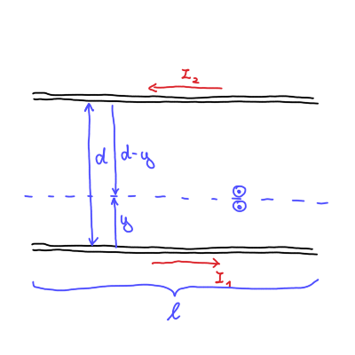
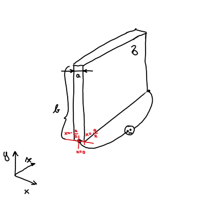
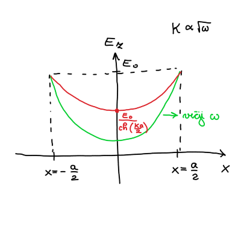

#+title: 9. vaje iz Elektromagnetnega polja
#+startup: nolatexpreview
#+startup: entitiespretty nil
#+startup: show2levels
#+latex_header: \usepackage{amsmath} \usepackage{unicode-math} \usepackage{cancel} \usepackage{graphicx}
#+latex_header: \renewcommand{\theta}{\vartheta} \renewcommand{\phi}{\varphi} \renewcommand{\epsilon}{\varepsilon}
#+latex_header: \newcommand{\odv}[1]{\dot{\vec{#1}}} \newcommand{\oddv}[1]{\ddot{\vec{#1}}}
#+latex_header: \newcommand{\rot}{\mathrm{rot}}\newcommand{\dive}{\mathrm{div}} \newcommand{\iu}{\mathrm{i}}
#+latex_header: \newcommand\mapsfrom{\mathrel{\reflectbox{\ensuremath{\mapsto}}}}
* Induciran tok v okvirju - nadaljevanje

** Točka b

Izmenični tok okvirja zapišemo s sinusno funkcijo

\[ I_1 = I_{10} \sin (\omega t)
\]

Posledično se bo tok induciral v tanki vodnikih.

Magnetni pretok vodnikov je definiran preko vzajemne induktivnosti

\begin{equation}
\label{eq:1}
 \Phi_2 = L_{21} I_1
\end{equation}

Inducirana napetost v vodniku je z upoštevanjem magnetnega pretoka

\[ U_{i2} = - \dot{\Phi}_2 = - L_{21} \dot{I}_1 =  L_{22} \dot{I}_2,
\]

kjer je \( L_{22} \) lastna induktivnost. Odvod \( I_1 \) poznamo in iz zgornje enačbe pomeni, da bosta imela enako časovni faktor.

Zanima nas razmerje tokov \( \frac{I_{10}}{I_{20}} \). Iz inducirane napetosti torej sledi

\[ \omega L_{22} I_{20} \cos (\omega t) = - \omega L_{21} I_{10} \cos (\omega t) \implies \frac{I_{20}}{I_{10}} = - \frac{L_{21}}{L_{22}}.
\]

Negativen predznak pomeni, da sta toka različno predznačena - tečeta v različnih smereh.

Izračunati moramo lastno induktivnost vodnikov \( L_{22} \), ki jo bomo izračunali preko gostote magnetnega polja. Magnetno polje dveh vodnikov glede na skico je enako

\[ B = \frac{\mu_0 I_2}{2 \pi y} + \frac{\mu_0 I_2}{2 \pi (d - y)}.
\]

Magnetni pretok je po definiciji

\[ \Phi_2 = \int\limits_{}^{} \vec{B} \cdot \mathrm{d} \vec{S} = \int\limits_{}^{} B \, \mathrm{d} S,
\]

kjer je \( \mathrm{d} S = l \mathrm{d} y  \). Širina vodnikov je \( 2a \) in zaradi superprevodnosti v vodniku ni magnetnega polja. Posledično so meje integracije \( [a, d - a] \). Torej

\[ \Phi_2 = \frac{\mu_0 I_2 l}{2 \pi} \int\limits_a^{d - a} \left( \frac{1}{y} + \frac{1}{d - y} \right) \, \mathrm{d} y = \frac{\mu_0 l }{\pi} \ln \frac{d - a}{a} I_2.
\]

Po navodilih naloge velja \( d \gg a \) iz česar sledi, da je lastna induktivnost sorazmerna

\[ L_{22} \sim \frac{\mu_0 l}{\pi} \ln \frac{d}{a}
\]

Razmerje tokov je tako

\[ \frac{I_{20}}{I_{10}} = - \frac{2 \ln 2 \mu_0 d}{\mu_0 l \ln \frac{d}{a}} = - \frac{2 \ln 2}{\frac{l}{a} \ln \frac{d}{a}} \approx -0.06
\]

#+name: Dva induktivno sklopljena tokovna kroga
#+begin_note
Tokovni krog prvega vodnika zapišemo

\[ \dot{U}_{g1} = R_1 \dot{I}_1 + L_{11} \ddot{I}_1 + L_{12} \ddot{I}_2 + \frac{I_1}{C_1},
\]

kjer je generativna napetost in \( C \) kapaciteta kondenzatorja. Analogno, splošno, za drugi vodnik zapišemo

\[ \dot{U}_{g2} = R_2 \dot{I}_2 + L_{22} \ddot{I}_2 + L_{21} \ddot{I}_1 + \frac{I_2}{C_2}
\]

Za naš primer v drugem vodniku je generativna napetosti \( U_{g2} = 0 \). Na ta način pridemo do enake zaključka glede razmerja tokov, saj

\[ 0 = L_{22} \ddot{I}_2 + L_{21} \ddot{I}_1 \implies \dot{I}_2 = - \frac{L_{21}}{L_{22}} \dot{I}_1
\]

Če bi želeli izračunati padec napetosti v prvem vodniku, bi za to upoštevali velikost toka \( I_2 \) v

\[ U_{g1} = L_{11} \dot{I}_1 + L_{12} \dot{I}_2 = L_{11} \dot{I} _1 - \frac{L_{12} ^2}{L_{22}} \dot{I}_2
\]
#+end_note
* Kožni pojav v širokem ploščatem vodniku
#+begin_problem
Skrajni ploskvi dolgega in širokega kovinskega traku debeline \( a \) premažemo z idealno prevodnima elektrodama in mednju priključimo vir izmenične napetosti krožne frekvence \( \omega \), kakor prikazuje slika. Debelina traku je precej manjša od preostalih dveh razsežnosti traku, specifična prevodnost kovine pa je \( \sigma \).

a) Pokaži, da impedanco traku v opisani postavitvi lahko zapišemo kot

   \[ Z = R_0 \frac{\frac{ka}{2}}{\mathrm{th} \frac{ka}{2}},
   \]

   kjer je \( k = \left( 1 + \mathrm{i} \right) \sqrt{\frac{\mu_0  \sigma \omega}{2}} \) kompleksni valovni vektor, \( R_0 \) statična upornost traku, \( \mathrm{th} \) pa označuje hiperbolični tangens.

b) Izračunaj faktor, za katerega se pri visokih frekvencah (zaradi kožnega pojava) upornost traku poveča glede na njegovo statično upornost. Kolikšna pa je upornost traku pri nizkih frekvencah?
#+end_problem

Indukcijski zakon v diferencialni obliki je

\begin{equation}
\label{eq:2}
 \nabla \times \vec{E} = - \frac{\partial \vec{B}}{\partial t}.
\end{equation}

Hkrati vzamemo še eno Maxwellovo enačbo, ki smo jo zapisali prejšnji teden

\[ \nabla \times \vec{B} = \mu_0 \vec{\jmath} + \mu_0 \epsilon_0 \frac{\partial \vec{E}}{\partial t} \simeq \mu_0 \vec{\jmath}
\]

Za naš primer obravnavamo kvazi-statično aproksimacijo, kar pomeni, da \( \frac{\partial \vec{E}}{\partial t}  = 0 \). Gostota električnega toka \( \vec{\jmath} \) pa je z električnim poljem zapisana kot

\[ \vec{\jmath} = \sigma \vec{E}
\]

Rotor enačbe \ref{eq:2} nam z upoštevanjem identitete za \( \nabla \times \left( \nabla \times \vec{E} \right) \) poda enakost

\[ \nabla \times \left( \nabla \times \vec{E} \right) = \nabla \left( \underbrace{\nabla \cdot \vec{E}}_{= 0} \right) - \nabla ^2 \vec{E} = - \mu_0 \sigma \frac{\partial \vec{E}}{\partial t} = - \frac{\partial }{\partial t} \nabla \times \vec{B}
\]

Dobimo difuzijsko enačbo

\begin{equation}
\label{eq:3}
 \nabla ^2 \vec{E} - \mu_0 \sigma \frac{\partial \vec{E}}{\partial t}  = 0.
\end{equation}

Trak je priključen na izmenično napetost, ki jo zapišemo

\[ U = U_0 e^{\mathrm{i} \omega t}.
\]

Posledično bo podobno odvisnost imela tudi jakost električnega polja, kar pomeni, da \( \frac{\partial \vec{E}}{\partial t} = \mathrm{i} \omega \vec{E} \). Difuzijska enačba \ref{eq:3} postane

\[ \nabla ^2 \vec{E} - \mathrm{i} \omega \mu_0 \vec{E} = \nabla ^2 \vec{E} - \kappa ^2 \vec{E} = 0,
\]

kjer smo definirali \( \kappa = \sqrt{\mathrm{i} \omega \mu_0 \sigma} = \frac{1}{\sqrt{2}} \left( 1 + \mathrm{i} \right) \sqrt{\omega \mu_0 \sigma}  \). Ker se nahajamo na traku, kjer sta širina in višina traka precej manjši od dolžine traku, lahko zanemarimo odvoda po \( x \) in \( y \) v Laplaceovem operatorju. Izmenjujoč tok teče po dolžini traku, torej \( \vec{E} = E(x) \hat{e}_z \). Posledično rešujemo enačbo

\[ E_z '' - \kappa ^2 E_z = 0.
\]

Zaradi simetrije preko \( y \) osi, ko tok teče samo po površini prevodnega traku, bo pomenilo, da zavržemo hiperbolični sinus zaradi lihosti.

\[ E_z (x) = A \mathrm{ch} (\kappa x) .
\]

Konstanto \( A \) določimo iz robnih pogojev \( E_z \left( x = \pm \frac{a}{2} \right) = E_0 \), iz česar sledi, da je električno polje

\[ E_{z, 0} (x) = \frac{E_0}{\mathrm{ch} \left( \frac{\kappa a}{2} \right)} \mathrm{ch} \left( \kappa x \right)
\]

Izračunajmo še tok \( I \) in iz njega impedanco \( Z \).

Tok bomo izračunali preko gostote električnega toka

\[ I_0 = \int\limits_{}^{} j_0 \, \mathrm{d} S,
\]

kjer je \( j_0 = \sigma E_{z, 0} \).

Integral je torej

\begin{align*}
  I_0 &= \sigma \int\limits_{- \frac{a}{2}}^{\frac{a}{2}} \frac{E_0}{\mathrm{ch} \frac{\kappa a}{2}} \mathrm{ch} \left( \kappa x \right) b \, \mathrm{d} x \\
&= \left. \frac{\sigma E_0 b}{\kappa \mathrm{ch} \left( \frac{\kappa a}{2} \right)} \mathrm{sh} \left( \kappa x \right) \right|_{- \frac{a}{2}}^{\frac{a}{2}} \\
&= \frac{\sigma E_0 b}{\kappa \mathrm{ch} \left( \frac{\kappa a}{2} \right)} 2 \mathrm{sh} \left( \frac{\kappa a}{2} \right)
\end{align*}

Tok po površini traku je torej

\[ I_0 = \frac{2 \sigma E_0 b}{\kappa} \mathrm{th} \frac{\kappa a}{2}.
\]

Napetost po površini traku je samo

\[ U_0 = E_0 l,
\]

kar pomeni, da je impedanca po definiciji

\[ Z = \frac{U_0}{I_0} = R \frac{\frac{\kappa a}{2}}{\mathrm{th} \left( \frac{\kappa a}{2} \right)} ,
\]

kjer smo definirali \( R = \frac{\xi l}{S} = \frac{l}{\sigma a b} \).
** Točka b

Uporabna bo zveza razvoja hiperboličnega tangensa za majhne \( x \):

\[ \mathrm{th} x = x - \frac{x ^3}{3!} + \ldots
\]

Za majhne frekvence \( \omega \) velja \( \kappa \ll \frac{1}{a} \). Posledično je

\[ Z = R
\]

Za visoke frekvence \( \omega \) pa velja \( \kappa \ll \frac{1}{a} \), iz česar sledi \( \kappa a \gg 1 \). Hiperbolični tangens je \( \mathrm{th} \frac{\kappa a}{2} \approx 1 \). Impedanca je tako

\[ Z = R \frac{\kappa a}{2} = \frac{R a \frac{1}{\sqrt{2}} \left( 1 + \mathrm{i} \right) \sqrt{\omega \mu_{0} \sigma}}{2}
\]

Impedanca za visoke frekvence je tako

\[ Z_R = \frac{R a}{2 \sqrt{2}} \sqrt{\omega \mu_{0} \sigma}
\]

* Energijski tok v koaksialnem vodniku in v valjastem vodniku
#+begin_problem
a) Izračunaj energijski tok skozi prečni presek koaksialnega vodnika, kjer je napetost med žilo in plaščem \( U \), ta pa po njiju v nasprotnih smereh poganja električni tok \( I \).
b) Izračunaj energijski tok skozi zunanjo površino dolgega ravnega vodnika preseka \( S \) in dolžine \( l \) iz kovine s specifično prevodnostjo \( \sigma \), po katerem teče električni tok \( I \). Končni rezultat izrazi s celotno uporabnostjo vodnika \( R = \frac{l}{\sigma S} \)
#+end_problem
