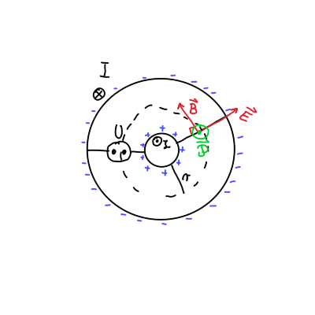
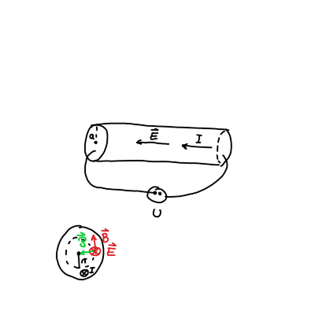
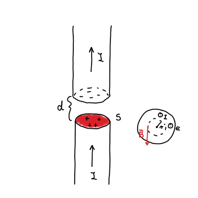

#+title: 10. vaje iz Elektromagnetnega polja
#+startup: nolatexpreview
#+startup: entitiespretty nil
#+startup: show2levels
#+latex_header: \usepackage{amsmath} \usepackage{unicode-math} \usepackage{cancel} \usepackage{graphicx}
#+latex_header: \renewcommand{\theta}{\vartheta} \renewcommand{\phi}{\varphi} \renewcommand{\epsilon}{\varepsilon}
#+latex_header: \newcommand{\odv}[1]{\dot{\vec{#1}}} \newcommand{\oddv}[1]{\ddot{\vec{#1}}}
#+latex_header: \newcommand{\rot}{\mathrm{rot}}\newcommand{\dive}{\mathrm{div}} \newcommand{\iu}{\mathrm{i}}
#+latex_header: \newcommand\mapsfrom{\mathrel{\reflectbox{\ensuremath{\mapsto}}}}
* Energijski tok v koaksialnem vodniku in v valjastem vodniku
#+begin_problem
a) Izračunaj energijski tok skozi prečni presek koaksialnega vodnika, kjer je napetost med žilo in plaščem \( U \), ta pa po njiju v nasprotnih smereh poganja električni tok \( I \).
b) Izračunaj energijski tok skozi zunanjo površino dolgega ravnega vodnika preseka \( S \) in dolžine \( l \) iz kovine s specifično prevodnostjo \( \sigma \), po katerem teče električni tok \( I \). Končni rezultat izrazi s celotno uporabnostjo vodnika \( R = \frac{l}{\sigma S} \)
#+end_problem
** Teorija energijskega toka
Energijski zakon se glasi

\[ \frac{\partial w}{\partial t} + \nabla \cdot \vec{P} + \vec{\jmath} \cdot \vec{E} = 0.
\]

\( w \) predstavlja gostoto energije in je definirana kot

\[ w = \frac{1}{2} \epsilon_0 E ^2 + \frac{1}{2 \mu_0} B ^2.
\]

\( \vec{\mathcal{P}} \) je Poyntingov vektor, ki se ga izračuna preko enačbe

\[ \vec{\mathcal{P}} = \frac{1}{\mu_0} \vec{E} \times \vec{B} ,
\]

ki podaja gostoto energijskega toka.

Zadnji člen v energijskem zakon je ohmski člen, ki govori o izgubah energije zaradi upora.

Energijski zakon pretvorimo iz diferencialne v integralno obliko preko integrala po volumnu

\[ \frac{\partial W}{\partial t}  + \int\limits_{}^{} \nabla \cdot \vec{P} \, \mathrm{d} V + \int\limits_{}^{} \vec{\jmath} \cdot \vec{E} \, \mathrm{d} V = 0.
\]

Preko Gaussovega izreka lahko integral \( \nabla \cdot \vec{\mathcal{P}} \) pretvorimo na energijski tok

\[ \int\limits_{}^{} \nabla \cdot \vec{\mathcal{P}} \, \mathrm{d} V = \int\limits_{}^{} \vec{\mathcal{P}} \cdot \, \mathrm{d} \vec{S}
\]
** Reševanje naloge
*** Koaksialni vodnik

Pomagali si bomo s skico.

Kakor vemo pri nalogi iz sile na koaksialni kabel, ima magnetno polje \( \mathbf{B} \) v vodniku pravokotno smer na radij.

Električno polje \( \mathbf{E} \) je radialno usmerjeno. Prisotnost električnega polja pomeni neenakomerno razporejenost naboja. Pozitivni naboji iz plašča so prišli na notranji vodnik in na plašču so preostali negativni naboji.

Magnetno polje dobimo preko Amperovega zakona z zaključeno zanko, ki zaobjame notranji vodnik

\[ \mu_0 I = B 2 \pi r \implies \, B = \frac{\mu_0 I}{2 \pi r}.
\]

Električno polje pa dobimo iz Gaussovega zakona, kjer si zamislimo zaključeno ploskev vzdolž vodnika.

\[ e = \epsilon_0 E \cdot 2 \pi r l \implies \, E = \frac{e}{2 \pi \epsilon_0 l r}.
\]

Naboja \( e \) ne poznamo, vendar ga lahko izračunamo preko znanega električnega potenciala, za katerega velja

\[ U = \int\limits_a^b E \, \mathrm{d} r = \frac{e}{2 \pi \epsilon_0 l} \ln  \frac{b}{a}.
\]

Iz tega sledi, da je električno polje enako

\[ E = \frac{U}{r \ln \frac{b}{a}}.
\]

Poyntingov vektor kaže ven iz ravnine lista in je enak ob upoštevanju zgoraj izračunanih količin

\[ P = \frac{1}{\mu_0} E B = \frac{UI}{2 \pi \ln \frac{b}{a} \cdot r ^2}.
\]

Površinski tok izračunamo po kolobarjih, kjer je diferencial površine \( \mathrm{d} S = 2 \pi r \, \mathrm{d} r \).

\[ \int\limits_{}^{} \mathbf{\mathcal{P}} \, \mathrm{d} \mathbf{S} = \frac{UI}{2 \pi \ln \frac{b}{a}} \int\limits_a^b \frac{1}{r ^2}2 \pi r \, \mathrm{d} r = UI
\]

Vrnimo se nazaj k integralski enačbi. V primeru koaksialnega vodnika nimamo upora, torej bo \( \mathbf{j} \cdot \mathbf{E} = 0 \). Ostane nam

\[ \frac{\partial W}{\partial t}  + \int\limits_{}^{} \mathbf{\mathcal{P}} \cdot \mathrm{d} \mathbf{S} = 0
\]

Površinski tok je različen od \( 0 \), vendar je sprememba energije skozi čas tudi \( 0 \).

Imamo torej valjast kolobar dolžine \( L < l \), v katerega zaradi konstantnosti električnega in magnetnega polja priteka enako energije kakor jo iz elementa odteka. Iz tega sledi, da je

\[ \frac{\partial W}{\partial t} = 0.
\]

*** Valjast uporovni vodnik

V valjastem vodniku je zaradi priključka napetosti na osnovni ploskvi električno polje \( \mathbf{E} \) usmerjeno vzdolž dolžine vodnika. Magnetno polje \( \mathbf{B} \) pa je še zmeraj pravokotno na radij.

Električno polje je samo

\[ E = \frac{U}{l}.
\]

Za Amperov zakon pa je malo drugačno. Zaključena krožnica z radijem \( r < a \) ne zajame celotnega toka po vodniku. Zajet tok je kvadratno sorazmeren s polmerom zaradi ploščine krožnice pri radiju \( r \). Torej

\[ B \cdot 2 \pi r = \mu_0 I \left( \frac{r}{a} \right) ^2 \implies \, B = \frac{\mu_0 I}{2 \pi a ^2} r
\]

Sedaj lahko izračunamo \( \mathbf{\mathbf{P}} \)

\[ \mathbf{\mathcal{P}} = \frac{1}{\mu_0} E B = \frac{UI}{2 \pi a ^2 l} r
\]

Opazimo lahko, da je sorazmeren s polmerom, kar pomeni, da bližje smo središču valja, manjši bo Poyntingov vektor.

Površinski tok je tokrat ploskovni integral po plašču valja s polmerom \( r \). Torej

\[ \int\limits_{}^{} \mathbf{\mathcal{P}} \cdot \mathrm{d} \mathbf{S} = \frac{UI}{2 \pi \alpha ^2 l} r \cdot 2 \pi r l = \frac{UI r ^2}{a ^2}.
\]

Površinski tok, ki nas zanima je tok celotnega vodnika, torej bo \( r = a \). Sledi

\[ \int\limits_{}^{} \mathbf{\mathcal{P}} \cdot \mathrm{d} \mathbf{S} = UI
\]

Energijski zakon tokrat zadnji dve komponenti. Zaradi konstantnosti magnetnega in električnega polja bo \( \frac{\partial W}{\partial t} = 0 \).

Površinski tok v tem primeru teče notri v vodnik (in ne vzdolž vodnika kot pri prejšnjem primeru).

Izračunajmo še ohmske izgube. Zaradi homogenosti problema je volumnski integral izračunati precej enostavno

\[ \int\limits_{}^{} \mathbf{j} \cdot \mathbf{E} \, \mathrm{d} V = j E V = j S E l = U I.
\]

Upoštevali smo identiteti \( j S = I \) ter \( E l = U \).

Ob upoštevanju \( U = RI \) so torej ohmske izgube \( R ^2 I \). Energijski zakon velja

\[ \frac{\partial W}{\partial t} + \int\limits_{}^{} \mathbf{\mathcal{P}} \cdot \mathrm{d} \mathbf{S} + \int\limits_{}^{} \mathbf{j} \cdot \mathbf{E}\cdot \, \mathrm{d} V = - UI + UI = 0.
\]
* Prekinjeni vodnik
#+begin_problem
Dolg raven valjast vodnik preseka \( S \) je na nekem mestu prekinjen. Prekinitev ima obiko ozke špranje širine \( d \) pravokotne na vodnik. Ob času \( t = 0 \) po vodniku spustimo konstanten električni tok \( I \), zaradi katerega se na zgornji in spodnji meji špranje začne nabirati naboj.

a) Določi smer in velikost jakosti električnega polja ter gostote magnetnega polja v špranji v oddaljenosti \( r \) od osi vodnika ob času \( t \).
b) S pomočjo Poyntingovega vektorja izračunaj energijski tok, ki ob času \( t \) priteka v špranjo.
c) Prejšnji rezultat primerjaj s časovnim odvodom energije elktromagnetnega polja v špranji.

Pri vseh računih zanemarik popačitev polj ob zunanjem robu špranje. Špranjo torej obravnavaj kot ploščati kondenzator. Upornost vodnika je zanemarljivo majhna.
#+end_problem

Naboj, ki se nabira na ploskvah je linearen s časom, torej

\[ e = It.
\]

Iz formule za ploščati kondenzator lahko izrazimo električno polje

\begin{equation}
\label{eq:1}
 E = \frac{\sigma}{\epsilon_0} = \frac{e}{\epsilon_0 S} = \frac{I}{\epsilon_0 S} t.
\end{equation}

V špranji tok ne teče, kar bi pomenilo, da ni magnetnega polja. Zaradi spreminjajočega električnega polja pa imamo v špranji premikalni tok

\[ \nabla \times \mathbf{B} = \epsilon_0 \mu_0 \frac{\partial \mathbf{E}}{\partial t}
\]

Z integriranjem po ploskvi pretvorimo diferencialno obliko v integralsko obliko

\[ \oint\limits_{}^{} \mathbf{B} \cdot \mathrm{d} \mathbf{l} = \epsilon_0 \mu_0 \frac{\partial \mathbf{E}}{\partial t} \cdot \pi r ^2
\]

Premikalni tok ima enako smer kakor električni tok pred zaključkom volumna. Magnetno polje je pravokotno na radij, kakor na sliki.

Sledi torej

\begin{align*}
  \oint\limits_{}^{} \mathbf{B} \cdot \mathrm{d} \mathbf{l} &= \epsilon_0 \mu_0 \frac{\partial E}{\partial t}  \cdot \pi r ^2 \\
B 2 \pi r &= \epsilon_0 \mu_0 \frac{I}{\epsilon_0 S} \pi r ^2 \\
B &= \frac{\mu_0 I}{2 S} r
\end{align*}

Poyntingov vektor ponovno kaže proti središču valja.

\[ P = \frac{1}{\mu_0} EB = \frac{I}{2 S} r \frac{I}{\epsilon_0 S} t = \frac{I ^2}{2 \epsilon_0 S ^2} r t
\]

Energijski tok v celotni špranji je pri radiju \( r = a \), površina pa je površina skozi katero tok teče - v tem primeru plašč špranje.

\[ \int\limits_{}^{} \mathbf{\mathcal{P}} \cdot \mathrm{d} \mathbf{S} = \mathcal{P} \cdot 2 \pi a d = \frac{I ^2}{\epsilon_0 S}
\]

Energijski zakon vključuje samo površinski tok in gostoto energije

\[ \frac{\partial W}{\partial t}  + \int\limits_{}^{} \mathbf{\mathcal{P}} \cdot \mathrm{d} \mathbf{S} = 0
\]

Celotna energija je sestavljena iz energije magnetnega polja \( W_m \), ki se ne spreminja ter energije električnega polja \( W_e \), ki se s časom spreminja.

Energija elektromagnetnega polja je tako

\[ W_e = \frac{1}{2} \epsilon_0 E ^2 S d = \frac{I ^2}{2 \epsilon_0 S} d t ^2,
\]

kjer smo upoštevali \ref{eq:1}. Gostota energije je

\[ \frac{\partial W_{e}}{\partial t}  = \frac{I ^2 d}{ 2 \epsilon_0 S} t.
\]

Energije se ohranja, saj velja

\[ \frac{\partial W}{\partial t}  + \int\limits_{}^{} \mathbf{\mathcal{P}} \cdot \mathrm{d} \mathbf{S} = 0 =  \frac{I ^2 d}{\epsilon_0 S}t -  \frac{I ^2 d}{2\epsilon_0 S} t = 0.
\]
