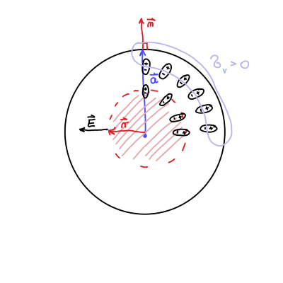
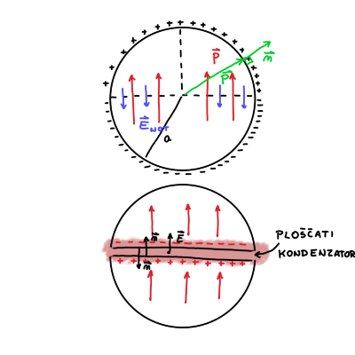
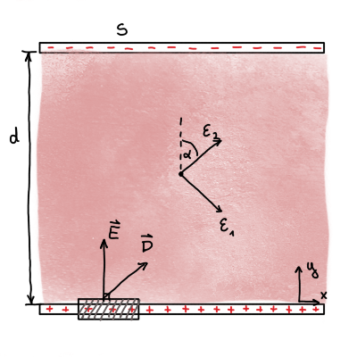

#+title: 11. vaje iz Elektromagnetnega polja
#+startup: nolatexpreview
#+startup: entitiespretty nil
#+startup: show2levels
#+latex_header: \usepackage{amsmath} \usepackage{unicode-math} \usepackage{cancel} \usepackage{graphicx}
#+latex_header: \renewcommand{\theta}{\vartheta} \renewcommand{\phi}{\varphi} \renewcommand{\epsilon}{\varepsilon}
#+latex_header: \newcommand{\odv}[1]{\dot{\vec{#1}}} \newcommand{\oddv}[1]{\ddot{\vec{#1}}}
#+latex_header: \newcommand{\rot}{\mathrm{rot}}\newcommand{\dive}{\mathrm{div}} \newcommand{\iu}{\mathrm{i}}
#+latex_header: \newcommand\mapsfrom{\mathrel{\reflectbox{\ensuremath{\mapsto}}}}
* Radialno polarizirana krogla

#+begin_problem
Krogla polmera \( a \) je spontano polarizirana tako, da ima vektor polarizacije znotraj krogle krajevno odvisnost \( \vec{P} \left( \vec{r} \right)= k \vec{r} \), kjer je \( k \) znana konstanta. Izračunaj:

a) prostorninsko gostoto vezanega naboja v krogli, površinsko gostoto vezanega naboja na površini krogle in skupni naboj krogle,
b) jakost električnega polja povsod po prostoru.

Rezultat pod b) pokaže, da je električno polje v krogli kar sorazmerno s polarizacijo. Zakaj?
#+end_problem

Polarizacija krogle je podana z

\begin{equation}
\label{eq:1}
 \vec{P} = k \vec{r}, \ k > 0
\end{equation}

Zanima nas prostorninska gostota vezanega naboja, ki je definirana kot

\begin{equation}
\label{eq:2}
 \rho_v = - \vec{\nabla} \cdot \vec{P}.
\end{equation}

Če se posvetujemo slike, lahko opazimo, da je gostota vezanega naboja negativna, saj imajo dipoli usmerjene pozitivne naboje navzven in negativne naboje proti središču sfere. Negativni naboji so torej bolj skoncentrirani proti središču in posledično je gostota vezanega naboja negativna.

Površinska gostota naboja je povezana s polarizacijo preko

\[ \sigma_v = \vec{P} \cdot \vec{n}.
\]

Do te zveze pridemo preko volumnske integracije enačbe \ref{eq:2} in Gaussovega izreka

\[ \iiint\limits_V^{} \rho_v \,\mathrm{d V} = - \iiint\limits_V^{} \nabla \cdot \vec{P} \,\mathrm{d V} = - \iint\limits_S^{} \vec{P} \cdot \,\mathrm{d } \vec{S} = - \vec{P} \cdot \vec{n} (S_{zun} - S_{not}) = e
\]

Polarizacija zunaj sfere je ničelna in velja \( \vec{S} = S \cdot \vec{n} \). Po definiciji površinske gostote naboja potem sledi

\[ \sigma_v = \frac{e}{S} = \vec{P} \cdot \vec{n}
\]

Površinska gostota naboja je pozitivna, saj kažejo pozitivni konci električnih dipolov navzen.

V prostorninsko gostoto naboja lahko samo vstavimo radialno odvisnost \ref{eq:1} in dobimo

\[ \rho_v = - \vec{\nabla} \cdot \vec{P} = - \vec{\nabla} \cdot k \vec{r} = - k \vec{\nabla} \cdot \vec{r} = - 3k.
\]

Radij vektor \( \vec{r} \) in normalni vektor v površinski gostoti naboja sta vzporedna

\[ \sigma_v = \left. \vec{P} \cdot \vec{n} \right|_{r = a} = \left. k \vec{r} \cdot \vec{n} \right|_{r = a} = ka.
\]

Celoten naboj je vsota gostote prostorninske in površinske gostote naboja

\begin{align*}
  e_{tot} &= \int\limits_{}^{}\rho_v \, \mathrm{d} V + \int\limits_{}^{} \sigma_v \, \mathrm{d} S \\
&= \int\limits_{}^{} -3k \, \mathrm{d} V + \int\limits_{}^{} ka \, \mathrm{d} S \\
&= - 3k \frac{4 \pi a ^3}{3} + ka 4 \pi a ^2 = 0
\end{align*}

To nam pove, da so v krogli res sami dipoli.
** točka b)

Do električnega polja se lahko priborimo preko naboja

\[ e(r) = \epsilon_0 \int\limits_{}^{} E(r) \, \mathrm{d} S
\]

Celoten zaobjet naboj na poljubni razdalji \( r < a \) je \( e (r) = - k 4 \pi r ^3 \), dana površina pa  \( S = 4 \pi r ^2 \).

Jakost električnega polja je tako

\[ E(r) = - \frac{kr}{\epsilon_0} = - \frac{P}{\epsilon_0}.
\]

Vektorski zapis pa je

\[ \vec{E} \left( \vec{r} \right) = - \frac{\vec{P} \left( \vec{r} \right)}{\epsilon_0}
\]

Do rezultata lahko pridemo tudi hitreje. Gostoto vseh nabojev (vezanih in zunanjih) lahko zapišemo kot

\begin{equation}
\label{eq:3}
 \rho = \vec{\nabla} \cdot \epsilon_0 \vec{E}.
\end{equation}

Za naš primer velja, da je \( \rho \) enaka gostoti vseh vezanih nabojev \( \rho_v \), iz česar sledi

\[ \rho = \rho_v \implies \ - \vec{\nabla} \cdot \vec{P} = \vec{\nabla} \cdot \epsilon_0 \vec{E}
\]
* Homogeno polarizirana krogla

#+begin_problem
Kroglo, izdelano iz snovi s homogeno spontano polarizacijo \( \vec{P} \), prerežemo na pol tako, da gre rez skozi središče krogle in je pravokoten na \( \vec{P} \). Obe polovici krogle malenkost razmaknemo, tako da je razmik zelo majhen v primerjavi s polmerom krogle. Izračunaj gostoto električnega polja v špranji med polovicama krogle. Nalogo najprej reši za primer neprerezane krogl in si z rezultatom pomagaj pri računu za primer prerezane krogle.
#+end_problem

** Točka a)

Polarizacijo zapišemo

\[ \vec{P} = P \hat{e}_z.
\]

Gostota vezanih nabojev bo po definiciji \ref{eq:2}

\[ \rho_v = - \vec{\nabla} \cdot \vec{P} = 0,
\]

kar je smiselno, saj imamo homogeno polje in odvajamo konstanto. To nam pove, da nimamo vezanih nabojev v volumnu sfere.

Površinska gostota nabojev bo različna od \( 0 \), saj drugače nimamo naloge. Normalni vektor bomo zapisali v sferičnih koordinatah

\[ \sigma_v = \vec{P} \cdot \vec{n} = P \hat{e}_z \begin{bmatrix} \sin \theta \cos \phi \\ \sin \theta \sin \phi \\ \cos \theta \end{bmatrix} = P \cos \theta.
\]

Površinska gostota je prvi Legendrov polinom \( P_1 (\cos \theta) \). Spomnimo, da je splošna rešitev potenciala v sferičnih koordinatah enaka

\[ U(r, \theta) = \sum\limits_{l = 0}^{\infty} \left( A_l r^l + B_l r^{-(l + 1)} \right) P_l (\cos \theta).
\]

Iz površinskega naboja sledi, da so v rešitvah potenciala \( l = 1 \). Nastavek potenciala je tako

\[ U(r, \theta) = \begin{cases}
                  A_1 r \cos \theta &; r < a \\
                  B_1 r^{-2} \cos \theta &; r > a
                  \end{cases}
\]

Iz robnega pogoja za zveznost pri \( r = a \), dobimo enakost \( B_1 = a ^3 A_1 \). Drugi robni pogoj pa je Gaussov izrek na površini

\[ \frac{\sigma_v}{\epsilon_0} = \left. E_{zun}^{\perp } \right|_{r = a} - \left. E_{not }^{\perp } \right|_{r = a}.
\]

Upoštevamo \( \vec{E} = - \nabla U \) in dobimo enačbo

\[ \frac{\sigma_v}{\epsilon_0} = \left. \partial_r U_{zun } \right|_{r = a} + \left. \partial_r U_{not } \right|_{r = a},
\]

iz česar po odvajanju in prvega robnega pogoja sledi \( A_1 = \frac{P}{3 \epsilon_0} \).

Rešitev je torej

\[ U(r, \theta) = \begin{cases}
                  \frac{P}{3 \epsilon_0} r \cos \theta &; r \le a \\
                  \frac{P a ^3}{3 \epsilon_0} r^{-2} \cos \theta &; r \ge a
                  \end{cases}
\]
** Točka b)

Električna jakost v notranjosti krogle je preko upoštevanja rešitve iz točke a)

\[ \vec{E}_{not} = - \nabla \left( \frac{P}{3 \epsilon_0} r \cos \theta \right) .
\]

Pred zaletavanjem z glavo v zid v sferičnem gradientu, v enačbi vidimo, da je \( r \cos \theta = z \).

\[ \vec{E}_{not} = - \frac{P}{3 \epsilon_0} \hat{e}_z = - \frac{\vec{P}}{3 \epsilon_0}
\]
*** Notes

Notranja jakost električnega polja je polovična polarizaciji v valju

\[ \vec{E}_{not} = - \frac{\vec{P}}{2 \epsilon_0}.
\]

Planparalelna plošča pa ima

\[ \vec{E}_{not} = - \frac{\vec{P}}{1 \epsilon_0}
\]

Faktorjem \( \frac{1}{3}, \frac{1}{2} \) in \( 1 \) pravimo depolarizacijski faktor.
** Točka c)

Sfero prepolovimo in pri zgornji polovici imamo negativne naboje z normalo, ki kaže v negativno smer \( z \), medtem ko na spodnji polovici pa so pozitivni naboji z normalo, ki kaže navzgor.

Električno polje je sestavljeno iz oboda krogle in ploščatega kondenzatorja, ki je posledica špranje. \( \vec{E} \) kondenzatorja je drugače predznačeno od oboda krogle.

Površinska gostota nabojev na ravninah sfer je še zmeraj \( \sigma \), iz česar sledi \( P = \sigma \).

Električno polje špranje je torej

\[ \vec{E}_{gap } = - \frac{\vec{P}}{3 \epsilon_0} + \frac{\sigma}{\epsilon_0} \hat{e}_z = - \frac{\vec{P}}{3 \epsilon_0} + \frac{\vec{P}}{\epsilon_0} = \frac{2}{3} \frac{\vec{P}}{\epsilon_0}
\]
* Ploščica iz anizotropnega dielektrika

#+begin_problem
Med plošči ploščatega kondenzatorja kapacitete \( C_0 \) vstavimo ploščico anizotropnega dielektrika, tako da ploščica zapolnjuje celotno prostornino kondenzatorja. Dielektrična konstanta ima lastne vrednosti \( \epsilon_1, \epsilon_1 \) in \( \epsilon_2 \), ploščica pa je odrezana tako, da je ena lastna os, ki ji ustreza lastna vrednosti \( \epsilon_1 \), vzporedna s ploščama, lastna os, ki ji ustreza lastna vrednost \( \epsilon_2 \), pa z normalo plošč oklepa kot \( \phi \). Izračunaj kapaciteto tako zapolnjenega kondenzatorja.
#+end_problem

Pri prejšnjih dveh nalogah smo imeli polarizacijo, ki je bila vgrajena v material kot posledica tega, da je material fero-električen. V tej nalogi imamo opravka z dielektričnimi materiali, v katerih nastopi polarizacija samo ob aktivnem zunanjem električnem polju.

Pred nadaljevanjem naloge uvedemo novo količino \( \vec{D} = \epsilon_0 \vec{E} + \vec{P} \), ki je gostota električnega polja in je razlika gostot vseh \ref{eq:3} in vezanih nabojev \ref{eq:2}

\[ \rho - \rho_v = \vec{\nabla} \left( \epsilon_0 \vec{E} + \vec{P} \right) = \vec{\nabla} \cdot \vec{D}.
\]

Za dielektrik je empirično določeno, da \( \vec{D} \propto \vec{E} \), iz česar sledi

\[ \vec{D} = \epsilon_0 \underline{\epsilon} \vec{E},
\]

kjer je \( \underline{\epsilon} \) tenzor dielektrika.

Zaradi tenzorja \( \underline{\epsilon} \), katere lastne osi niso vzporedne normalam plošč kondenzatorja, jakost električnega toka \( \vec{E} \) in gostota električnega polja \( \vec{D} \) nista vzporedni.

Če plošči priključimo na napetost, lahko hitro dokažemo, da je jakost električnega polja nima komponente vzporedne s stranicama kondenzatorja.

Zamislimo si majhen presek stranice kondenzatorja, ki je v ravnini slike. Uporabimo Maxwellovo enačbo za magnetni pretok

\[ \vec{\nabla} \times \vec{E} = - \frac{\partial \vec{B}}{\partial t} = 0.
\]

Zaradi statičnega primer velja \( \frac{\partial \vec{B}}{\partial t} = 0 \).

Slednje integriramo po površini, ki tesno objema eno od kondenzatorskih plošč (glej sliko) in preko Stokesovega izreka prevedemo na integral po zaključeni zanki površine - pravokotniku, ki tesno objema kondenzatorske plošče.

\[ \int\limits_S^{} \vec{\nabla} \times \vec{E} \, \mathrm{d} S = \oint\limits_{\partial S}^{} \vec{E} \cdot \mathrm{d} \vec{l} = 0.
\]

Integral zazna samo komponente jakosti električnega polja, ki so vzporedne kondenzatorskim ploščam.

\[ \left (\vec{E}_{zun}^{\parallel}  - \vec{E}_{not}^{\parallel} \right) \mathrm{d} l = 0
\]

in ker je \( \vec{E}_{zun}^{\parallel} = 0 \) zunaj kondenzatorja, je potem tudi \( \vec{E}_{not}^{\parallel} = 0 \).

Količina, ki bo v vzporedna s tenzorjem, je gostota električnega naboja \( \vec{D} \). Za izračun kapacitivnost (milost, prosim), potrebujemo naboj na kondenzatorskih ploščah \( e_p \).

Uporabimo Maxwellovo relacijo

\[ \vec{\nabla} \cdot \vec{D} = \rho_p,
\]

ki jo integriramo po tanki površini, ki dobro zaobjame kondenzatorsko ploščo. Preko Gaussovega izreka dobimo enakost

\[ \int\limits_V^{} \vec{\nabla} \cdot \vec{D} \, \mathrm{d} V = \int\limits_{\partial V}^{} \vec{D} \cdot \mathrm{d} \vec{S} = e_p.
\]

Rezultat ploščinskega integrala je

\[ \int\limits_{\partial V}^{} \vec{D} \cdot \mathrm{d} \vec{S} = \left[ D_{zun}^{\perp } - D_{not}^{\perp }  \right] S = e_p .
\]

Zunaj kondenzatorja ni električnega polja in posledično tudi ni gostote električnega polja \( \vec{D} \). Znotraj plošče velja \( D_{not}^{\perp } = D_y \).

Tenzor iz lastnega sistema zasukamo za \( \alpha \) v sistem kondenzatorja preko rotacijskim matrik.

\[ \underline{\epsilon} = \begin{bmatrix}
                          \cos \alpha & \sin\alpha \\
                          -\sin \alpha & \cos \alpha
                           \end{bmatrix} \begin{bmatrix}
                                         \epsilon_{1} &  \\
                                          & \epsilon_{2}
                                          \end{bmatrix} \begin{bmatrix}
                                                        \cos \alpha & -\sin \alpha \\
                                                        \sin \alpha & \cos \alpha
                                                         \end{bmatrix}
\]

Jakost električnega polja ima, kakor smo dokazali na začetku naloge, samo eno komponento \( \vec{E} = (0, E)^T \). Po definiciji gostote električnega polja lahko torej izračunamo

\[ \begin{bmatrix} D_{x} \\ D_{y} \end{bmatrix} = \epsilon_0 \begin{bmatrix}
                                                             \epsilon_{1} \cos ^2 \alpha + \epsilon_2 \sin ^2\alpha & (\epsilon_2 - \epsilon_1) \sin \alpha \cos \alpha  \\
                                                             (\epsilon_2 - \epsilon_1) \sin \alpha \cos \alpha & \epsilon_1 \sin ^2 \alpha + \epsilon_2 \cos ^2 \alpha
                                                              \end{bmatrix} \begin{bmatrix} 0 \\ E \end{bmatrix}
\]

Iz enačbe

\[ \frac{e_p}{S} = \epsilon_0 \left( \epsilon_1 \sin ^2 \alpha + \epsilon_2 \cos ^2 \alpha \right) \frac{U}{d}
\]

izračunamo, da je kapacitivnost kondenzatorja

\[ C = \frac{e_p}{U}  \frac{\epsilon_0 S}{d} \left( \epsilon_1 \sin ^2 \alpha+ \epsilon_2 \cos ^2 \alpha \right).
\]

V primeru, ko \( \epsilon_1 = \epsilon_2 = 1 \), dobimo kapacitivnost praznega kondenzatorja \( C_0 = \frac{\epsilon_0 S}{d} \).
* Točkast dipol v krogelni lupini dielektrika

Pri reševanju bomo uporabili nastavek za potencial. Električni potencial električnega dipola je

\[ U_{dip} = \frac{p_e}{4 \pi \epsilon_0} \frac{\cos \theta}{r ^2},
\]

ki vsebuje Legendrov polinom stopnje \( l = 1 \). Iz tega sledi, da bo nastavek vseboval le \( l = 1 \) člene.

\[ U(r, \theta) = \begin{cases}
                  \frac{p_e}{4 \pi \epsilon_0} \frac{\cos \theta}{r ^2} + A_1 r \cos \theta &; r < a \\
                  B_1 \frac{1}{r ^2} \cos \theta &; r > a.
                  \end{cases}
\]
