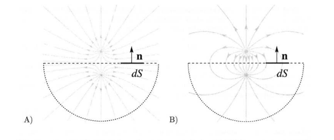
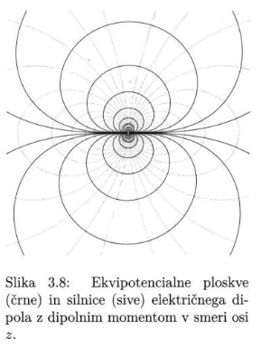
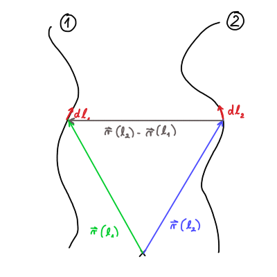
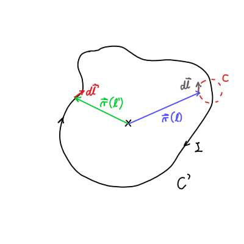
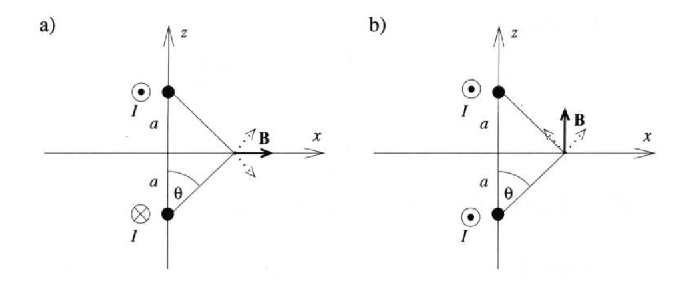

#+title: Priprava Ustni
#+startup: nolatexpreview
#+startup: entitiespretty nil
#+startup: show2levels
#+latex_header: \usepackage{amsmath} \usepackage{unicode-math} \usepackage{cancel} \usepackage{graphicx} \usepackage{bm}
#+latex_header: \renewcommand{\theta}{\vartheta} \renewcommand{\phi}{\varphi} \renewcommand{\epsilon}{\varepsilon}
#+latex_header: \newcommand{\odv}[1]{\dot{\vec{#1}}} \newcommand{\oddv}[1]{\ddot{\vec{#1}}}
#+latex_header: \newcommand{\rot}{\mathrm{rot}}\newcommand{\dive}{\mathrm{div}} \newcommand{\iu}{\mathrm{i}}
#+latex_header: \newcommand\mapsfrom{\mathrel{\reflectbox{\ensuremath{\mapsto}}}}
* Neobdelano
** TODO Earnshawyjev teorem
** TODO Thomsonov problem
** TODO Primeri gostot električnega toka
** TODO Amperova ekvivalenca
* Elektrostatika
** 1. vprašanje
 #+begin_problem
Uvedi in razloži naslednje elektrostatske količine in koncepte: Coulombska sila, naboj, jakost polja, silnice, cirkulacija, pretok, potencial, ekvipotencialne ploskve in princip superpozicije.
 #+end_problem
*** Coulombov zakon

Mirujoče naelektreno telo z nabojem \( e_1 \) deluje na drugo mirujoče naelektreno telo z nabojem \( e_2 \) z električno silo

\begin{equation}
\label{eq:1}
 \vec{F} = \frac{e_1 e_2}{4 \pi \epsilon_0 r ^2} \frac{\vec{r}}{r}.
\end{equation}

Pri tem vektor \( \vec{r} \) kaže od naboja \( e_1 \) do naboja \( e_2 \). Konstanti \( \epsilon_0 = 8.85 \cdot 10^{-12} \frac{\mathrm{As}}{\mathrm{Vm}} \) pravimo influenčna konstanta vakuuma. Enačbi pravimo Coulombska sila.
*** Naboj

Naboj je ena izmed osnovnih količin, ki jo merimo v coulombih. Označimo jo s črko \( C \) in je ekvivalentna \( \mathrm{As} \).
*** Jakost električnega polja

Električno silo, ki deluje na daljavo, v Coulombovi sliki, nadomesti električno polje v Faradayjevi in Maxwellovi sliki. Torej je električno polje posrednik interakcije.

Električno silo naboja \( e_1 \) na nabit delec \( e_2 \) zapišemo preko enačbe

\[ \vec{F} = e_2 \vec{E}_1
\]

Iz enačbe \ref{eq:1} sledi, da je električno polje točkastega naboja enako

\[ E = \frac{e_0}{4 \pi \epsilon_0} \frac{\vec{r}}{r ^3}
\]
*** Silnice

Električne silnice so primer prostorske upodobitve vektorskega polja. Prostorskim krivuljam v naravni parametrizaciji \( \vec{r}(s) \), ki so v vsaki točki sorazmerna smeri elektrostatske sile, pravimo električne silnice.

\[ \odv{r}(s) = \frac{\mathrm{d} r}{\mathrm{d} s} = \frac{\vec{F}(\vec{r}(s))}{\left| \vec{F} (\vec{r} (s)) \right|}
\]

Podobno lahko zapišemo tudi s pomočjo električnega polja v vsaki točki prostora

\[ \odv{r}(s) = \frac{\vec{E} \left( \vec{r}(s) \right)}{\left| \vec{E} \left( \vec{r} (s) \right) \right|}
\]

Silnice so usmerjene proti naboju, če je negativen, drugače so pozitivne. Električne silnice imajo naslednje 4 lastnosti:

- silnice kažejo v smeri električnega polja \( \vec{E} \) in se ne sekajo
- površinska gostota silnic je sorazmerna velikosti električne polja \( \left| \vec{E} \right| \)
- silnice izvirajo v pozitivnih nabojih in izginjajo v negativnih nabojih
- silnice niso nikoli zaključene
*** Električna cirkulacija

Definiramo jo kot integral po zaključeni krivulji \( \mathcal{C} \)

\begin{equation}
\label{eq:2}
 \Gamma_E = \oint\limits_{\mathcal{C}}^{} \vec{E} \, \mathrm{d} \vec{r}
\end{equation}

Eksperimentalno je določeno, da je cirkulacija statičnega električnega polja enaka nič. Integral \ref{eq:2} lahko razpišemo s pomočjo Stokesovega izreka kot

\[ 0 = \oint\limits_{\mathcal{C}}^{} \vec{E} \, \mathrm{d} \vec{r} = \iint\limits_S^{} \nabla \times \vec{E} \,\mathrm{d } \vec{S}
\]

V tem primeru krivulja \( \mathcal{C} \) predstavlja rob \( \partial S \) območja \( S \). Iz lastnosti cirkulacije statičnega električnega polja sledi

\[ \nabla \times \vec{E} = 0
\]

kar po definiciji pomeni, da je brezvrtinčno.
*** Električni pretok

Električni pretok preko neke površine je definiran kot površinski integral jakosti električnega polja po neki dani površini:

\[ \Phi_E = \int\limits_S^{} \vec{E} \cdot \mathrm{d} \vec{S}
\]

\( \mathrm{d}\vec{S} \) je vektorski diferencialni element površine, ki ima smer lokalne zunanje normalena površino.

Električni pretok skozi površino lahko po Faradayju razumemo kot število silnic električnega polja, ki to površino prebada. 
*** Električni potencial

Električni potencial definiramo tako, da vsaki točki prostora priredimo neko skalarno funkcijo \( \phi \left( \vec{r} \right) \), da velja zveza

\[ \vec{E} \left( \vec{r} \right) = - \nabla \phi \left( \vec{r} \right)
\]

kjer je \( \nabla \) diferencialni operator.

#+begin_my_example
Jakost električnega polja točkastega naboja je enaka

\[ \vec{E} = \frac{e}{4 \pi \epsilon_0} \frac{\vec{r}}{r ^3}
\]

Iz tega sledi, da je potencial enaka

\[ \phi = \frac{e}{4 \pi \epsilon_0} \frac{1}{r} + \phi_0.
\]
#+end_my_example

Potencial lahko določamo le do konstante natančno in je invarianten na transformacijo.
*** Ekvipotencialne ploskve
Iz definicije električnega potenciala

\[ \mathbf{E} (\mathbf{r}) = - \nabla \phi (\mathbf{r})
\]

lahko zapišemo krivuljni integral jakosti električnega polja

\[ \phi(A) - \phi(B) = - \int\limits_B^A \mathbf{E}(\mathbf{r}) \, \mathrm{d} \mathbf{r} 
\]

Imamo dve možnosti v zgornjem integralu:
- \( \mathbf{E} \) in \( \mathrm{d} \mathbf{r} \) sta pravokotna med seboj v vsaki točki med \( A \) in \( B \), iz česar sledi

  \[ \phi(A) = \phi(B) = \mathrm{konst} 
  \]

- če je razlika \( \phi(A) - \phi(B) \) konstantna na neki ploskvi, potem mora biti normala na to ploskev lokalno pravokotna na smer jakosti električnega polja.
  

Taki ploskvi pravimo ekvipotencialno ploskev.
*** Princip superpozicije

Za prostor z več naboji \( e_i \) v točkah \( \vec{r}_i \), je električna sila na naboj \( e \), ki se nahaja v točki \( \vec{r} \) različni od \( \vec{r}_i \) enaka vsoti sil ostalih nabojev

\[ \vec{F} \left( \vec{r} \right) = \sum\limits_i^{}  \frac{e \cdot e_i}{4 \pi \epsilon_0} \frac{\left( \vec{r} - \vec{r}_i \right)}{\left| \vec{r} - \vec{r}_i \right| ^3}
\]

To je /princip superpozicije/.

Opomba, da je elektrostatika zgrajena na izključno parskih interakcijah. Jakost električnega polja in potencial tudi zadoščata principu superpozicije in ju zapišemo kot

\[ \vec{E} \left( \vec{r} \right) = \frac{1}{4 \pi \epsilon_0} \sum\limits_i^{} \frac{e_i \left( \vec{r} - \vec{r}_i \right)}{\left| \vec{r} - \vec{r}_i \right| ^3}, \quad \phi \left( \vec{r} \right) = \frac{1}{4\pi\epsilon_0} \sum\limits_i^{} \frac{e_i}{\left| \vec{r} - \vec{r}_i \right|}
\]
** 2. vprašanje
#+begin_problem
Uvedi gostoto naboja in za poljubno gostoto zapiši elektrostatsko silo, polje in električni potencial. Nato navedi primere gostote naboja, pri čemer tudi pokaži, kakšna je povezava med gostoto naboja in gostoto dipolnega momenta.
#+end_problem
*** Gostota naboja

Električni naboj, ki je porazdeljen, je enostavneje zapisati s pomočjo gostote naboja \( \rho \left( \vec{r} \right) \).

Gostoto električnega naboja v točki \( \vec{r} \) obkroženo s točkastimi naboji \( e_i \) v točkah \( \vec{r}_i \) zapišemo s pomočjo Diracove \( \delta \) funkcije.

\begin{equation}
\label{eq:3}
 \rho \left( \vec{r} \right) = \sum\limits_i^{} e_i \delta ^3 \left( \vec{r} - \vec{r}_i \right)
\end{equation}

Gostoto lahko zapišemo tudi v diferencialni obliki

\[ \rho \left( \vec{r} \right) = \frac{\mathrm{d} e}{\mathrm{d} V}
\]

Volumnski integral gostote električnega naboja \ref{eq:3} je enak celotnemu naboju

\[ e = \int\limits_{}^{} \rho \left( \vec{r} \right) \, \mathrm{d} V = \int\limits_{}^{} \sum\limits_i^{} \delta ^3 \left( \vec{r} - \vec{r}_i \right) \, \mathrm{d} V = \sum\limits_i^{} e_i
\]

Prav tako lahko zapišemo silo na naboj v polju drugih nabojev

\[ \vec{F} \left( \vec{r} \right) = \int\limits_{}^{} \rho \left( \vec{r} \right) \vec{E} \left( \vec{r} \right) \, \mathrm{d} ^3 \vec{r}
\]

Električno polje sistema točkastih nabojev

\[ \vec{E} \left( \vec{r} \right) = \frac{1}{4 \pi \epsilon_0} \int\limits_V^{} \frac{\rho \left( \vec{r} \, ' \right) \left( \vec{r} - \vec{r}\,' \right)}{\left| \vec{r} - \vec{r} \, ' \right| ^3} \, \mathrm{d} ^3 \vec{r} \, '
\]
Podobno je za potencial

\[ \phi \left( \vec{r} \right) = \frac{1}{4 \pi \epsilon_0} \int\limits_V^{} \frac{\rho \left( \vec{r} \, '\right)}{\left| \vec{r} - \vec{r} \, ' \right|} \, \mathrm{d} ^3 \vec{r} \, '
\]
*** Primeri
**** Točkast naboj

Za naboj \( e \) v točki \( \vec{r}_0 \) je gostota naboja

\[ \rho \left( \vec{r} \right) = e \delta \left( \vec{r} - \vec{r}_0 \right)
\]
**** Točkast dipol

Imamo dva nasprotno nabita točkasta naboja \( e \) in \( -e \) pri \( \vec{r}_1 = \vec{r}_0 - \delta \vec{r} \) in \( \vec{r}_2 = \vec{r}_0 + \delta \vec{r} \), ki sta narazen za \( d = \left|\vec{r}_1 - \vec{r}_2\right| \).

Gostoto naboja podamo kot

\[ \rho \left( \vec{r} \right) = e \delta ^3 \left( \vec{r} - \vec{r}_1 \right) - \delta ^3 \left( \vec{r} - \vec{r}_2 \right)
\]

Predpostavimo, da je razdalja med naboje zelo majhna \( \left| \delta \vec{r} \right| \ll \left| \vec{r}  \right|\).

Taylorjev razvoj z vektorji je enak:

\[ f \left( \vec{r} + \Delta \vec{r} \right) = f \left( \vec{r} \right) + \nabla f \left( \vec{r} \right) \cdot \Delta \vec{r} + \ldots
\]

Upoštevajoč definicije \( \vec{r}_1 \) in \( \vec{r}_2 \), lahko gostoto naboja razvijemo po Taylorju, da dobimo

\[ \rho \left( \vec{r} \right) = - e \left( \vec{r}_1 - \vec{r}_2 \right) \cdot \nabla \delta ^3 \left( \vec{r} - \vec{r}_0 \right) = - 2 e \delta \vec{r}\, \nabla \delta ^3 \left( \vec{r} - \vec{r}_0 \right)
\]

Vpeljemo vektor dipolnega momenta \( p = e \left( \vec{r}_1 - \vec{r}_2 \right) = -2 e \delta \vec{r} \).

Velja identiteta

\[ \nabla \cdot \left( \vec{p} \cdot \delta ^3 \left( \vec{r} - \vec{r}_0 \right) \right) = \left( \nabla \cdot p \right) \delta ^3 \left( \vec{r} - \vec{r}_0 \right) + \vec{p} \cdot \nabla \left( \delta ^3 \vec{r} - \vec{r}_0 \right)
\]

Dipolni moment je konstanten, torej \( \nabla \cdot \vec{p} = 0 \). Preobrazimo našo gostoto v

\[ \rho \left( \vec{r} \right)= - \nabla \cdot \left[ \vec{p} \cdot \delta ^3 \left( \vec{r} - \vec{r}_0 \right) \right] = - \nabla \cdot \vec{P} \left( \vec{r} \right)
\]

kjer je \( \vec{P} = \vec{p} \cdot \delta ^3 \left( \vec{r} - \vec{r}_0 \right) \) polarizacija.
**** Površinsko porazdeljen naboj

Površinska gostota naboja \( \sigma \left( \vec{u} \right) \) vpeljemo kot

\[ \rho \left( \vec{r} \right) = \sigma \left( \vec{u} \right) \delta \left( z - z_0 \right)
\]

kjer je \( \vec{u} \) radij vektor v na površini podani z \( z = z_0 \).

Celoten naboj je površinski integral

\[ \int\limits_V^{} \rho \left( \vec{r} \right) \, \mathrm{d} ^3 \vec{r} = \int\limits_V^{} \sigma \left( \vec{u} \right) \delta \left( z - z_0 \right) \, \mathrm{d} z \, \mathrm{d} ^2 \vec{u} = \int\limits_S^{} \sigma \left( \vec{u} \right) \, \mathrm{d} ^2 \vec{u}
\]
**** Površinsko porazdeljen dipol

Podobno kot pri točkastem dipolu, imamo dve nasprotno nabiti površini, s površinskima gostotama naboja \( \sigma \left( \vec{u} \right) \) in \( - \sigma \left( \vec{u} \right) \). Površini se nahajata na ravnina \( z = z_1 = z_0 + \delta z \) ter \( z = z_2 = z_0 - \delta z \). Velja \( \delta z \ll z \).

Površinska gostota naboja je

\[ \rho \left( \vec{r} \right) = \sigma \left( \vec{u} \right) \delta (z - z_1) - \sigma (\vec{u}) \delta (z - z_2)
\]

ki jo razvijemo po Taylorju

\[ \rho \left( \vec{r} \right) = - \sigma \left( \vec{u} \right) (z_1 - z_2) \frac{\partial }{\partial z}  \delta\left( z - z_0 \right)  = - p \left( \vec{u} \right) \frac{\partial }{\partial z} \delta \left( z - z_0 \right)
\]

kjer je \( p \left( \vec{u} \right) \) površinska gostota dipolnega momenta.
**** Volumsko porazdeljen naboj

Gostota je lahko porazdeljena po končnem volumnu. Za enakomerno porazdeljeno kroglo z radijem \( a \) je gostota naboja

\[ \rho \left( \vec{r} \right) = \begin{cases}
                                 \rho_0; & \left| \vec{r} \right| \leq a \\
                                 0; & \text{else}
                                 \end{cases} = \rho_0 H \left( a - r \right)
\]

kjer je \( H \) Heavisodeova funkcija.
**** Volumsko porazdeljen dipol

Vektor polarizacije \( \vec{P} \) zapišemo s porazdelitvijo

\[ P \left( \vec{r} \right) = \begin{cases}
                               P_0; & \left| \vec{r} \right| \leq a,\\
                               0; &\text{else}
                              \end{cases} = \vec{P}_0 H (a - r)
\]

Vzamemo nastavek enakomerno polarizirane krogle

\[ \rho \left( \vec{r} \right) = - \nabla \cdot \vec{P} \left( \vec{r} \right)
\]

in velja

\[ \frac{\mathrm{d} }{\mathrm{d} r} H (a - r) = - \delta (a - r)
\]

dobimo, da je gostota naboja enaka

\[ \rho \left( \vec{r} \right) = \vec{P}_0 \delta \left( a - r \right) \frac{\vec{r}}{r}
\]

Torej je naboj zgolj površinski.

** 3. vprašanje
#+begin_problem
Zapiši in razloži Gaussov izrek v integralni in diferencialni obliki. Pokaži njegovo uporabo na primeru geometrije/problema, ki ga sam izbereš.
#+end_problem

Gaussov izrek po Faradayju nam podaja zvezo med količino naboja in električnimi silnicami iz tega naboja, ki prebadajo dano zaključeno površino.
*** Integralna oblika 

Imejmo \( n \) nabojev \( e_1, e_2, \ldots, e_n \) s pripadajočimi radij vektorji \( \mathbf{r}_1, \mathbf{r}_2, \ldots, \mathbf{r}_n \). Naboje zajamemo v sklenjeno sfero s površino \( S \) in zanima nas električni pretok skozi to sfero.

Začnemo z definicijo električnega pretoka

\[ \phi_E = \oint\limits_S^{} \mathbf{E} \cdot \mathrm{d} \mathbf{S} = \oint\limits_S^{} E \cos \theta \, \mathrm{d} S.
\]

Upoštevali smo, da ima diferencial površine sfere smer normale na površino \( \mathrm{d} \mathbf{S} = \mathbf{n} \, \mathrm{d} S \), ter definicijo skalarnega produkta.

Namesto električnega polja bomo s pomočjo principa superpozicije pretok zapisali kot

\[ \phi_E = \sum\limits_{i = 1}^n \frac{e_i}{4 \pi \epsilon_0} \oint\limits_S^{} \frac{1}{\left| \mathbf{r} - \mathbf{r}_i \right| ^2} \cos \theta_i \, \mathrm{d} S 
\]

Za primer \( i = 1 \) in \( \mathbf{r}_i = 0 \) je pretok enak

\[ \oint\limits_S^{} \mathbf{E}_1 \, \mathrm{d} \mathbf{S} = \frac{e_1}{4 \pi \epsilon_0} \oint\limits_S^{} \frac{1}{r ^2} r ^2 \sin \theta \, \mathrm{d} \theta \, \mathrm{d} \phi = \frac{e_1}{\epsilon_0},
\]

kjer smo upoštevali definicijo diferenciala površine v sferičnih koordinatah. Gauss je dokazal, da to velja za poljubno površino in \( \mathbf{r}_i \ne 0 \). Električni pretok je tako

\[ \oint\limits_S^{} \mathbf{E} \, \mathrm{d} \mathbf{S} = \sum\limits_{i = 1}^n \frac{e_i}{\epsilon_0}.
\]

Vsoto nabojev lahko nadomestimo tudi z gostoto naboja

\begin{equation}
\label{eq:4}
 \oint\limits_S^{} \mathbf{E} \, \mathrm{d} \mathbf{S} = \frac{1}{\epsilon_0} \int\limits_V^{} \rho(\mathbf{r}) \, \mathrm{d} ^3 \mathbf{r} 
\end{equation}

Enačbi \ref{eq:4} pravimo Gaussov izrek za elektrostatsko polje.
*** Diferencialna oblika

Gaussov izrek \ref{eq:4} lahko s pomočjo Gauss-Ostrogradskega izreka pretvorimo v diferencialno obliko. Spomnimo,

\[ \oint\limits_{S = \partial V}^{} \mathbf{A} \, \mathrm{d} \mathbf{S} = \int\limits_V^{} \nabla \cdot \mathbf{A} \, \mathrm{d} ^3 \mathbf{r},
\]

kjer je \( \mathbf{A} \) vektorsko polje. 

Diferencialna oblika je tako

\[ \nabla \cdot \mathbf{E} = \frac{\rho(\mathbf{r})}{\epsilon_0},
\]

in velja v vsaki točki.
*** Primer uporabe - enakomerno nabita krogla

Imejmo enakomerno nabito krogle z radijem \( a \) in nabojem \( e \). Izračunajmo najprej gostoto naboja

\[ \int \mathrm{d} e = \int\limits_{}^{}\rho \, \mathrm{d} V,
\]

kjer upoštevamo, da je diferencial površine \( \mathrm{d} V = 4 \pi r ^2 \, \mathrm{d} r \, \mathrm{d} (\cos \theta) \). Upoštevali smo simetričnost problema in posledično neodvisnost od azimutalnega kota \( \phi \).

\[ e = 4 \pi \rho \int\limits_0^a \int\limits_{-1}^1 r ^2 \, \mathrm{d} (\cos \theta) \, \mathrm{d} r = \frac{4}{3} \pi a ^3 \implies \rho = \frac{3}{4} \frac{e}{\pi a ^3}
\]

Zanimata nas dva primera: električno polje za \( r < a \) in \( r > a \). 

V prvem primeru je površina pri Gaussovem zakonu \ref{eq:4} \( S = 4 \pi r ^2 \) in posledično

\[ E(r) 4 \pi r ^2 = \frac{1}{\epsilon_0} \frac{3}{4} \frac{e}{\pi a ^3} \cdot \frac{4}{3} \pi r ^3,
\]

iz česar zaključimo, da je električno polje radialno odvisno

\[ E(r) = \frac{er}{4 \pi \epsilon_0 a ^3}, \quad r<a.
\]

V drugem primeru pa naša sfera z radijem \( r > a \) zaobjame celotno sfero radija \( a \) in posledično smo zaobjeli tudi celoten naboj. Sledi

\[ E(r) 4 \pi r ^2 = \frac{e}{\epsilon_0}
\]

in nadalje

\[ E(r) = \frac{e}{4 \pi \epsilon_0 r ^2}, \quad r > a
\]
** 4. vprašanje
#+begin_problem
Zapiši Poissonovo in Laplaceovo enačbo in ju razloži. Izpelji splošno rešitev (Greenovo funkcijo) Poissonove enačbe v Fourierovem in direktnem prostoru. Z uporabo Greenove funkcije nato zapiši splošno obliko električnega potenciala in električnega polja. Kako se ta rešitev spremeni v končnem volumnu?
#+end_problem
*** Poissonova in Laplaceova enačba

V definicijo električnega potenciala

\[ \mathbf{E} = - \nabla \phi,
\]

vstavimo prvo Maxwellovo enačbo \( \nabla \cdot \mathbf{E} = \frac{\rho(\mathbf{r})}{\epsilon_0} \) in dobimo Poissonovo enačbo oblike

\[ \nabla ^2 \phi(\mathbf{r}) = - \frac{\rho(\mathbf{r})}{\epsilon_0},
\]

kjer je \( \nabla ^2 \) Laplaceov operator. Če imamo prostor brez nabojev, je desna stran enačbe ničelna in dobimo Laplaceovo enačbo

\[ \nabla ^2 \phi (\mathbf{r}) = 0 
\]

Enačbi nam podajata prostorsko odvisnost električnega potenciala v prostoru. S pomočjo definicije električnega potenciala lahko potem izračunamo električno polje.
*** Splošna rešitev Poissonove enačbe

Do rešitve Poissonove enačbe se bomo dokopali s pomočjo nastavka, ki vsebuje konvolucijo

\[ \phi(\mathbf{r}) = \int\limits_{}^{} G(\mathbf{r} - \mathbf{r}') \rho(\mathbf{r}') \, \mathrm{d} ^3 \mathbf{r}',
\]

kjer je \( G (\mathbf{r} - \mathbf{r}') \) Greenova funkcija in \( \rho(\mathbf{r}') \) gostota nabojev.

**** Določitev Laplacea Greenove funkcije

Nastavek s konvolucijo vstavimo v Poissonovo enačbo

\[ \nabla ^2 \phi(\mathbf{r}) = \int\limits_{}^{} \nabla_{\mathbf{r}} ^2 G(\mathbf{r} - \mathbf{r}') \rho(\mathbf{r}') \, \mathrm{d} ^3 \mathbf{r} ' = - \frac{\rho(\mathbf{r})}{\epsilon_0}.
\]

Z indeksom \( \mathbf{r} \) želim poudariti, da Laplaceov operator deluje samo na \( \mathbf{r} \) in ne na \( \mathbf{r}' \).

Edini način, da je zadoščeno zgornji enačbi, je, da velja

\begin{equation}
\label{eq:5}
 \nabla_{\mathbf{r}} ^2 G (\mathbf{r} - \mathbf{r}') = - \frac{\delta ^3 (\mathbf{r} - \mathbf{r}')}{\epsilon_0}.
\end{equation}

Iz tega lahko zaključimo, da je Greenova funkcija \( G(\mathbf{r} - \mathbf{r}') \) rešitev Poissonove enačbe za točkast enotski naboj, ki se nahaja v točki \( \mathbf{r}' \) (glej 2. vprašanje, primer točkastega naboja).

Če poznamo rešitev Poissonove enačbe za točkast naboj (kar je še ne, samo njen Laplace), lahko splošno rešitev Poissonove enačbe sestavimo za poljubno porazdelitev gostote naboja.
**** Greenova funkcije v Fourierovem prostoru

Greenova funkcija v obliki Fourierovega integrala je enaka

\begin{equation}
\label{eq:6}
 G(\mathbf{r}) = \int\limits_{}^{} G(\mathbf{k}) e^{\mathrm{i} \mathbf{k} (\mathbf{r} - \mathbf{r}')} \frac{\mathrm{d} ^3 \mathbf{k}}{\left( 2 \pi \right) ^3}.
\end{equation}

Vemo iz matematike 4, da je \( \delta \) funkcija v Fourierovem prostoru enaka

\[ \delta ^3 (\mathbf{r} - \mathbf{r}') = \int\limits_{}^{} \frac{\mathrm{d} ^3 \mathbf{k}}{\left( 2 \pi \right) ^3} e^{\mathrm{i} \mathbf{k} (\mathbf{r} - \mathbf{r}')}.
\]

Dobljeno vstavimo v \ref{eq:5}

\[ \nabla_{\mathbf{r}} ^2 \left( \int\limits_{}^{} G(\mathbf{k}) e^{\mathrm{i} \mathbf{k} (\mathbf{r} - \mathbf{r}')} \frac{\mathrm{d} ^3 \mathbf{k}}{\left( 2 \pi \right) ^3} \right) = - \frac{1}{\epsilon_0} \int\limits_{}^{} e^{\mathrm{i} \mathbf{k} (\mathbf{r} - \mathbf{r}')} \frac{\mathrm{d} ^3 \mathbf{k}}{\left( 2 \pi \right) ^3}
\]

in združimo pod isti integral

\[ \int\limits_{}^{} \left[ \nabla_{\mathbf{r}} ^2 e^{\mathrm{i} \mathbf{k}(\mathbf{r} - \mathbf{r}')} G(\mathbf{k}) + \frac{1}{\epsilon_0} e^{\mathrm{i}\mathbf{k} (\mathbf{r} - \mathbf{r}')} \right] \frac{\mathrm{d} ^3 \mathbf{k}}{\left( 2\pi \right) ^3} = 0.
\]

Upoštevamo, da velja \( \nabla_{\mathbf{r}} ^2 e^{\mathrm{i} \mathbf{k}(\mathbf{r} - \mathbf{r}')} = -k ^2 e^{\mathrm{i} \mathbf{k}(\mathbf{r} - \mathbf{r}')} \), zato lahko zapišemo

\[ \int\limits_{}^{} \left[ -k ^2 G(\mathbf{k}) + \frac{1}{\epsilon_0} \right] e^{\mathrm{i} \mathbf{k} (\mathbf{r} - \mathbf{r}')} \frac{\mathrm{d} ^3 \mathbf{k}}{\left( 2 \pi \right) ^3} = 0
\]

Zgornji enačbi bo zadoščeno samo, ko velja

\[ G(\mathbf{k}) = \frac{1}{\epsilon_0 k ^2}.
\]
**** Greenova funkcija v neskončnem homogenem prostoru

Z določeno Greenovo funkcijo se lahko ob predpostavki neskončnega homogenega prostora preselimo nazaj v direktni prostor preko enačbe \ref{eq:6}, torej

\[ G \left( \mathbf{r} - \mathbf{r}' \right) = \frac{1}{\epsilon_0} \int\limits_{}^{} \frac{1}{k ^2} e^{\mathrm{i} \mathbf{k}(\mathbf{r} - \mathbf{r}')} \frac{\mathrm{d} ^3 \mathbf{k}}{\left( 2 \pi \right) ^3}.
\]

Integral bomo izračunali v sferičnih koordinatah, zato

\[ G \left( \mathbf{r} - \mathbf{r}' \right) = \frac{1}{\epsilon_0 \left( 2 \pi \right) ^3} \int\limits_0^{\infty} \int\limits_0^{2\pi} \int\limits_{-1}^1 \frac{1}{k ^2} e^{\mathrm{i} k \cdot \left| \mathbf{r} - \mathbf{r}' \right| \cos \theta} k ^2 \, \mathrm{d} \phi \, \mathrm{d} (\cos \theta) \, \mathrm{d} k,
\]

kjer smo upoštevali, da za skalarni produkt velja \( \mathbf{k} \left( \mathbf{r} - \mathbf{r}' \right) = k \cdot \left| \mathbf{r} - \mathbf{r}' \right| \cos \theta\). Uvedemo novo spremenljivko \( x = k \left| \mathbf{r} - \mathbf{r}' \right| \cos \theta\), katere diferencial je \( \mathrm{d}x = \mathrm{d} (\cos \theta) k \left| \mathbf{r} - \mathbf{r}' \right| \).

Vrednost integrala po \( \phi \) je samo \( 2 \pi \) in preostane nam

\[ G \left( \mathbf{r} - \mathbf{r}' \right) = \frac{1}{ \epsilon_0 \left( 2 \pi \right) ^2} \int\limits_0^{\infty} \int\limits_{-k \left| \mathbf{r} - \mathbf{r}' \right|}^{k \left| \mathbf{r} - \mathbf{r}' \right|}  \frac{e^{\mathrm{i} x}}{k \left| \mathbf{r} - \mathbf{r}' \right|} \, \mathrm{d} x \, \mathrm{d} k = \frac{1}{\epsilon_0 \left( 2 \pi \right) ^2} \int\limits_0^{\infty} \frac{1}{k \left| \mathbf{r} - \mathbf{r}' \right|} \sin \left( k \left| \mathbf{r} - \mathbf{r}' \right| \right) \, \mathrm{d} k,
\]

kjer smo upoštevali \( e^{- \mathrm{i}x} + e^{\mathrm{i} x} = 2\sin x \). Slednji integral lahko preko kompleksne integracije izvrednotimo v \( \frac{\pi}{2} \). Torej bo Greenova funkcija imela vrednost

\[ G \left( \mathbf{r} - \mathbf{r}' \right) = \frac{1}{4 \pi \epsilon_0 \left| \mathbf{r} - \mathbf{r}' \right|}.
\]

Splošna rešitev Poissonove enačbe pa bo

\[ \phi (\mathbf{r}) = \int\limits_{}^{} \frac{\rho(\mathbf{r})}{4 \pi \epsilon_0 \left| \mathbf{r} - \mathbf{r}' \right|} \, \mathrm{d} ^3 \mathbf{r}.
\]

Izrazimo lahko tudi električno polje

\[ \mathbf{E} = - \nabla \phi = \int\limits_{}^{} \frac{\rho(\mathbf{r}) \left( \mathbf{r} - \mathbf{r}' \right)}{4 \pi \epsilon_0 \left| \mathbf{r} - \mathbf{r}' \right|} \, \mathrm{d} ^3 \mathbf{r}'
\]

Note to self: \( \mathbf{r}' \) označuje koordinate, kjer se nahaja gostota naboja (npr. sfera), medtem ko \( \mathbf{r} \) označuje točko v prostoru, za katero nas zanima potencial.
*** Greenova funkcija končnega volumna

Ponovno rešujemo Poissonovo enačbo

\[ \nabla ^2 \phi (\mathbf{r}') = - \frac{\rho(\mathbf{r}')}{\epsilon_0},
\]

in za Greenovo funkcijo še zmeraj drži

\[ \nabla ^2 G \left( \mathbf{r} - \mathbf{r}' \right) = - \frac{\delta ^3 (\mathbf{r} - \mathbf{r}')}{\epsilon_0}.
\]

Prvo enačbo množimo z \( G \left( \mathbf{r} - \mathbf{r}' \right) \), drugo enačbo pa z \( \phi (\mathbf{r}') \), ter jo integriramo po volumnu \( V \) in ju odštejemo.

\begin{align*}
  \int\limits_V^{} &\left( \nabla ^2 \phi (\mathbf{r}') \cdot G (\mathbf{r} - \mathbf{r}') - \nabla ^2 G(\mathbf{r} - \mathbf{r}') \cdot \phi(\mathbf{r}') \right) \, \mathrm{d} ^3 \mathbf{r} = \\
&=-\int\limits_V^{} \frac{\rho(\mathbf{r}')}{\epsilon_0} G \left( \mathbf{r} - \mathbf{r}' \right) \, \mathrm{d} ^3 \mathbf{r} + \int\limits_V^{} \frac{\delta ^3 (\mathbf{r} - \mathbf{r}')}{\epsilon_0} \phi(\mathbf{r}') \, \mathrm{d} ^3 \mathbf{r}
\end{align*}

V zgornji vrstici lahko upoštevamo Gaussov izrek, na desni strani pa integracijo \( \delta \) funkcije in dobimo Greenovo enačbo

\[ \phi (\mathbf{r}') = \int\limits_V^{} \rho(\mathbf{r}') G \left( \mathbf{r} - \mathbf{r}' \right) + \epsilon_0 \int\limits_{\partial V}^{} \left( \mathbf{n}' \cdot \nabla_{\mathbf{r}'} \phi(\mathbf{r}')  \right) G \left( \mathbf{r} - \mathbf{r}' \right)- \left( \mathbf{n}' \cdot \nabla_{\mathbf{r}'} G (\mathbf{r} - \mathbf{r}') \phi(\mathbf{r}') \right) \, \mathrm{d} ^2 \mathbf{r}
\]
** 5. vprašanje
#+begin_problem
Uvedi in razloži 
a) elektrostatsko energijo nabojev v zunanjem polju 
b) celotno energijo polja, ki ga neka gostota nabojev ustvarja.

Celotno energijo polja prepiši v odvisnosti samo od gostote naboja in samo od električnega polja in dobljeno komentiraj.
#+end_problem
*** Elektrostatska energija naboja v zunanjem polju

Imamo testni (čuti polje, vendar ga sam ne ustvarja) točkasti naboj v elektrostatskem polju \( \mathbf{E} \) s pripadajočim potencialom \( \phi \).

Zanima nas, koliko elektrostatske energije ima naboj kot posledica tega, da se nahaja v elektrostatskem polju \( \mathbf{E} \)?

Na naboj deluje električna sila \( \mathbf{F}_e = e \mathbf{E} \). Zanima nas delo \( A \), ki smo ga opravili, da smo naboj postavili na dano mesto. Premik naboja povzročim z obratno nasprotno silo električni. Delo je po definiciji

\[ \mathrm{d} A = - \mathbf{F}_e \cdot \mathrm{d} \mathbf{r} = - e \mathbf{E} \cdot \mathrm{d} \mathbf{r} = e \nabla \phi \cdot \mathrm{d} \mathbf{r}.
\]

Če ni nobenih drugi izgub energije, potem bo delo potrebno, da delec premaknemo iz točke (1) v točko (2), razlika energij

\[ A = \int\limits_{(1)}^{(2)} \, \mathrm{d} A = W(2) - W(1) = \int\limits_{(1)}^{(2)} e \nabla \phi \cdot \mathrm{d} \mathbf{r} = e \left( \phi(2) - \phi(1) \right).
\]

Elektrostatska energija naboja v zunanjem polju je tako

\[ W = e \phi. 
\]

V primeru zvezno porazdeljenega naboja pa je taista energija

\[ W = \int\limits_V^{} \rho(\mathbf{r}) \phi(\mathbf{r}) \, \mathrm{d} ^3 \mathbf{r}.
\]

Recap: \( \rho(\mathbf{r}) \) je električni naboj v zunanjem električnem polju \( \mathbf{E} \), ki ima potencial \( \phi(\mathbf{r}) \). To električno polje nima nobene veze z našo gostoto el. nabojev, ampak je npr. posledica drugi el. nabojev, ki so poljubno daleč stran.

*** Celotna energija polja 

Imamo poljuben volumen, ki ima zvezno porazdelitev naboja \( \rho(\mathbf{r}) \). Ta volumen ustvari električno polje \( \mathbf{E}(\mathbf{r}) \) in pripadajoč potencial \( \phi(\mathbf{r}) \).

Uporabili bomo dejstvo, da je za konstanto \( \alpha \in [0, 1] \) Poissonova enačba linearna. Torej velja

\[ \nabla ^2 \left( \alpha \phi (\mathbf{r}) \right) = - \frac{\alpha \rho(\mathbf{r})}{\epsilon_0}.
\]

V mislih bomo parameter nabijanja \( \alpha \) povečevali iz \( 0 \) do \( 1 \) in s tem nabili naboje od \( 0 \) do \( \rho(\mathbf{r}) \). Majhna sprememba naboja je torej

\[ \mathrm{d} \rho = \rho \mathrm{d} \alpha.
\]

Uporabimo enačbo za elektrostatsko energijo naboja v zunanjem polju

\[ \int\limits_0^{W}\mathrm{d} W = \iint\limits_{}^{} \phi(\mathbf{r}) \mathrm{d} \rho(\mathbf{r}) \, \mathrm{d} ^3 \mathbf{r} = \int\limits_0^1 \int\limits_V^{} \rho(\mathbf{r}) \alpha \phi(\mathbf{r}) \, \mathrm{d} ^3 \mathbf{r} \, \mathrm{d} \alpha.
\]

Za razliko od prejšnjega poglavja je v tem primeru potencial \( \phi(\mathbf{r}) \) ustvarjen s strani \( \rho(\mathbf{r}) \) v isti enačbi.

Dobimo torej enačbo

\[ W = \int\limits_0^1 \alpha \, \mathrm{d} \alpha  \int\limits_V^{} \rho(\mathbf{r}) \phi(\mathbf{r}) \, \mathrm{d} \mathbf{r} = \frac{1}{2} \int\limits_V^{} \rho(\mathbf{r}) \phi(\mathbf{r}) \, \mathrm{d} ^3 \mathbf{r}
\]
*** Elektrostatska energija polja kot funkcional gostote naboja

Greenova enačba nam pove, da potencial zapišemo kot

\[ \phi(\mathbf{r}) = \frac{1}{4 \pi \epsilon_0} \int\limits_V^{} \frac{\rho(\mathbf{r}')}{\left| \mathbf{r} - \mathbf{r}' \right|} \, \mathrm{d} ^3 \mathbf{r}'. 
\]

Celotno energijo polja tako lahko zapišemo

\[ W = \frac{1}{8 \pi \epsilon_0} \int\limits_V^{} \int\limits_{V}^{} \frac{\rho(\mathbf{r}) \rho(\mathbf{r}')}{\left| \mathbf{r} - \mathbf{r}' \right|} \, \mathrm{d} ^3 \mathbf{r} \, \mathrm{d} ^3 \mathbf{r}' 
\]
*** Gostota elektrostatske energije polja

Prva Maxwellova enačba se glasi

\[ \nabla \cdot \mathbf{E} (\mathbf{r})= \frac{\rho(\mathbf{r})}{\epsilon_0}. 
\]

Gostoto električnega naboja v celotno energiji polja torej lahko zapišemo kot

\[ W = \frac{1}{2} \epsilon_0 \int\limits_V^{} \left(\nabla \cdot \mathbf{E}\right) \, \phi \, \mathrm{d} ^3 \mathbf{r}
\]

Uporabimo identiteto

\[ \nabla \cdot \left( f \mathbf{g} \right) = \left( \nabla f \right) \cdot \mathbf{g} + f \left( \nabla \cdot \mathbf{g} \right),
\]

kjer je \( f \) skalarna, \( \mathbf{g} \) pa vektorska funkcija. Zapišemo torej

\[ W = \frac{1}{2} \epsilon_0 \left[ \int\limits_V^{} \nabla \cdot \left( \phi \mathbf{E} \right) \, \mathrm{d} ^3 \mathbf{r} - \int\limits_V^{} \left( \nabla \phi \right)\cdot \mathbf{E} \, \mathrm{d} ^3 \mathbf{r} \right] 
\]

Integral pretvorimo s pomočjo Gaussovega zakona in definicije električnega potenciala

\[ W = \frac{1}{2} \epsilon_0 \int\limits_{\partial V}^{} \phi \mathbf{E} \, \mathrm{d} \mathbf{S} + \frac{1}{2} \epsilon_0 \int\limits_V^{} \mathbf{E} \cdot \mathbf{E} \, \mathrm{d} ^3 \mathbf{r} 
\]

Za dovolj velik volumen integracije bo površinski integral neničeln, saj \( \phi \propto r^{-1} \), \( \mathbf{E} \propto r^{-2} \) in \( \mathrm{d} \mathbf{S} \propto r ^2 \). Posledično

\[ \int\limits_{\partial V}^{} \phi \mathbf{E} \, \mathrm{d} \mathbf{S} \propto \int\limits_{\partial V}^{} \frac{1}{r} \frac{1}{r ^2} \cdot r ^2 \, \mathrm{d} r \overset{r \to \infty}{\longrightarrow} 0
\]

Izraz za energijo električnega polja je

\[ W = \frac{\epsilon_0}{2} \int\limits_V^{} E ^2 (\mathbf{r}) \, \mathrm{d} ^3 \mathbf{r}.
\]

Gostota elektrostatske energije polja je torej

\[ w = \frac{1}{2} \epsilon_0 E ^2.
\]

S tem postopanjem smo iz računa za energijo popolnoma odstranili izvore električnega polja in ga nadomestili s samim električnim poljem.

** 6. vprašanje
#+begin_problem
Formuliraj elektrostatsko silo na poljubno nabito telo, ki se nahaja v zunanjem polju, z uporabo samo električnega polja in nato uvedi napetostni tenzor električnega polja. Uporabo napetostnega tenzorja nato ilustriraj na primeru sile med dvema točkastima nabojema.
#+end_problem
*** Elektrostatska sila na poljubno nabito telo v zunanjem el. polju

Imamo poljubno nabito telo z volumnom \( V \) in zvezno porazdelitvijo naboja \( \rho(\mathbf{r}) \). To telo ima lastno električno polje \( \mathbf{E}_{\rho} \), hkrati pa se nahaja v zunanjem električnem polju \( \mathbf{E}_{zun} \).

Sila na zvezno porazdelitev naboja je

\[ \mathbf{F} = \int\limits_V^{} \rho(\mathbf{r}) \mathbf{E}_{zun}(\mathbf{r}) \, \mathrm{d} ^3 \mathbf{r} = \int\limits_V^{} \rho(\mathbf{r}) \mathbf{E}(\mathbf{r}) \, \mathrm{d} ^3 \mathbf{r},
\]

kjer je \( \mathbf{E} = \mathbf{E}_{\rho} + \mathbf{E}_{zun} \) celotno polje. Izbrali smo lahko tak napis, saj električna sila ne deluje na ustvarjalca te sile - telesa z \( \rho \). Z drugimi besedami \( \int_V^{} \rho(\mathbf{r}) E_{\rho} \, \mathrm{d} ^3 \mathbf{r} =0 \).

Upoštevamo prvo Maxwellovo enačbo za nabito telo

\[ \nabla \cdot \mathbf{E}_{\rho} = \nabla \cdot \mathbf{E} = \frac{\rho}{\epsilon_0},
\]

kjer smo upoštevali, da je \( \nabla \cdot \mathbf{E}_{zun} = 0 \), saj so naboji, ki ustvarjajo to polje neskončno daleč.

Sila je torej

\[ \mathbf{F}(\mathbf{r}) = \epsilon_0 \int\limits_V^{} \left( \nabla \cdot \mathbf{E}(\mathbf{r}) \right) \mathbf{E} \, \mathrm{d} ^3 \mathbf{r}
\]

Upoštevamo identiteto

\[ \nabla \cdot \left( \mathbf{E} \otimes \mathbf{E} \right) = \mathbf{E} \left( \nabla \cdot \mathbf{E} \right) - \left( \mathbf{E} \cdot \nabla \right) \mathbf{E},
\]

da silo zapišemo kot

\[ \mathbf{F}(\mathbf{r}) = \epsilon_0 \int\limits_V^{} \nabla \cdot \left( \mathbf{E} \otimes \mathbf{E} \right) \, \mathrm{d} ^3 \mathbf{r} + \epsilon_0 \int\limits_V^{} \left( \mathbf{E} \cdot \nabla \right) \mathbf{E} \, \mathrm{d} ^3 \mathbf{r}
\]

#+begin_note
\( \otimes \) je operacija tenzorskega produkta. Tenzorski produkt za vektorja \( \mathbf{a} = (a_1, a_2, a_3) \) in \( \mathbf{b} = (b_1, b_2, b_3) \) je \( 3\times3 \) matrika, kjer je \( ij \)-ti element matrike

\[ \left( \mathbf{a} \otimes \mathbf{b} \right)_{ij} = a_i \cdot b_j
\]
#+end_note

V prvem integralu upoštevamo Gaussov izrek in pretvorimo volumnski integral na integral po zaključeni ploskvi.

\[ \mathbf{F}(\mathbf{r}) = \epsilon_0 \oint\limits_{\partial V}^{} \left( \mathbf{E} \otimes \mathbf{E} \right) \, \mathrm{d} ^3 \mathbf{r} + \epsilon_0 \int\limits_V^{} \left( \mathbf{E} \cdot \nabla \right) \mathbf{E} \, \mathrm{d} ^3 \mathbf{r}
\]

Silo lahko nadalje pretvorimo še z identiteto

\[ \frac{1}{2} \nabla \left( E ^2 \right) = \left( \mathbf{E} \cdot \nabla \right) \mathbf{E} + \mathbf{E} \times \left( \nabla \times \mathbf{E} \right) = \left( \mathbf{E} \cdot \nabla \right) \mathbf{E},
\]

kjer smo upoštevali brezvrtinčnosti električnega polja. Sila bo torej

\[ \mathbf{F} (\mathbf{r}) = \epsilon_0 \oint\limits_{\partial V}^{} \left( \mathbf{E} \otimes \mathbf{E} \right) \, \mathrm{d} \mathbf{S} - \frac{\epsilon_0}{2} \int\limits_V^{} \nabla E ^2 \, \mathrm{d} ^3 \mathbf{r}.
\]

Ponovno upoštevamo Gaussov izrek ter upoštevamo, da je diferencial površine \( \mathrm{d} \mathbf{S} \) enako usmerjen kot normala površine \( \hat{n} \, \mathrm{d} S \).

\[ \mathbf{F} (\mathbf{r}) = \epsilon_0 \oint\limits_{\partial V}^{} \left[ \mathbf{E}\left( \mathbf{E} \cdot \hat{n} \right) - \frac{1}{2} \underline{\underline{I}} E ^2 \hat{n} \right] \, \mathrm{d} S
\]

kjer smo upoštevali \( \mathbf{E}\otimes \mathbf{E} \, \mathrm{d} \mathbf{S} = \mathbf{E} \left( \mathbf{E} \cdot \hat{n} \right) \, \mathrm{d} S \).

\( \mathbf{E} \) je celotno električno polje, \( \underline{\underline{I}} \) identiteta in \( \hat{n} \) normala na površino.
*** Napetostni tenzor električnega polja

Dobljen zapise sile v električnem polju zapišemo z uvedbo napetostnega tenzorja električnega polja

\[ F_i = \int\limits_{\partial V}^{} T_{ik} n_k \, \mathrm{d} S, \quad T_{ik} = \epsilon_0 \left( E_i \cdot E_k - \frac{1}{2} E ^2 \delta_{ik} \right),
\]

kjer je \( T_i \) napetostni tenzor električnega polja.

Za poljuben tenzor velja Gaussov izrek

\[ \int\limits_V^{} \frac{\partial }{\partial x_{k}} T_{ik} \, \mathrm{d} ^3 \mathbf{r} = \oint\limits_{\partial V}^{} T_{ik} n_k \, \mathrm{d} S.
\]

Uvedemo volumnsko gostoto sile \( f_i \)

\[ f_i = \frac{\partial }{\partial x_{k}} T_{ik}
\]
*** Primer električne sile

Električna naboja istega predznaka postavimo na razdalji \( 2a \).

Problem bomo reševali v cilindričnih koordinatah, kjer je os \( z \) na zveznici med nabojema (vzporedna normali na sliki), os \( \rho \) pa je nanjo pravokotna. Izhodišče postavimo na točko v sredini med nabojema.

Zaradi simetrije problema za električno polje velja

\[ E_z = 0 \quad \text{ in } \quad \mathbf{E}_{\rho} \ne 0.
\]

Na simetrijski ravnini ima polje vrednost

\[ \mathbf{E}_{\rho} = \frac{e}{4 \pi \epsilon_0 r ^2} \frac{\bm{\rho}}{r} + \frac{e}{4 \pi \epsilon_0 r ^2} \frac{\bm{\rho}}{r} = \frac{e}{2 \pi \epsilon_0 r ^2} \frac{\bm{\rho}}{r},
\]

kjer je \( \bm{\rho} = (x, y) \) in \( r = \sqrt{\rho ^2 + a ^2}\).

Za integracijo si izberemo ravnino \( z = 0 \), ki jo zaključimo s polkroglo v spodnji polovici prostora. Prispevek te krogle je v limiti \( r \to \infty \) ničeln. Sila je tako

\[ F_z = \epsilon_0 \oint\limits_{}^{} E_z \left( \mathbf{E} \cdot \hat{n} \right) \, \mathrm{d} S - \frac{\epsilon_0}{2} \oint\limits_{}^{} E ^2 \, \mathrm{d} S = - \frac{\epsilon_0}{2} \int\limits_{}^{} \mathbf{E}_{\rho} ^2 \, \mathrm{d} S
\]

Upoštevamo vrednost električnega polja in preidemo v cilindrične koordinate, da pridobimo rezultat

\[ F_z = - \frac{\epsilon_0}{2} \int\limits_{}^{} \frac{4 e ^2 \rho ^2}{\left( 4 \pi \epsilon_0 \right) ^2 r ^6} 2 \pi \rho \, \mathrm{d} \rho = - \frac{e ^2}{4 \pi \epsilon_0 \left( 2 a \right) ^2}
\]
** 7. vprašanje
#+begin_problem
Pokaži in razloži multipolni razvoj električnega potenciala in elektrostatske energije do dipolnega člena. Kakšna je interakcija med dvema telesoma, ki imata neničeln naboj in električni dipolni moment kot funkcija razdalje med telesoma? Kakšna je sila in navor (v multipolni sliki) na telo v zunanjem električnem polju?
#+end_problem
*** Multipolni razvoj električnega potenciala
Električni potencial za poljubno zvezno porazdelitev nabojev je

\[ \phi(\mathbf{r}) = \int\limits_{}^{} \frac{\rho(\mathbf{r})}{4 \pi \epsilon_0 \left| \mathbf{r} - \mathbf{r}' \right|} \, \mathrm{d} ^3 \mathbf{r}'.
\]

Predpostavimo, da je polje daleč stran od izvorov, ki so hkrati omejeni na volumen \( V_0 \). K električnemu potencialu prispevajo zgolj \( \mathbf{r}' \in V_0 \), ampak zaradi oddaljenosti velja \( \left| \mathbf{r} - \mathbf{r}' \right| \approx \left| \mathbf{r} \right|\).

#+begin_note
  Taylorjeva vrsta za vektorje je enaka

  \[ f \left( \mathbf{r} + \mathbf{h} \right) = f(\mathbf{r}) + \mathbf{h} \cdot \nabla f(\mathbf{r} ) + \frac{1}{2} \mathbf{h} H \left( f (\mathbf{r}) \right) \cdot \mathbf{h} + \ldots
  \]

  kjer velja \( \mathbf{r} \gg \mathbf{h} \) in je \( H \left( f(\mathbf{r}) \right) \) Hessejeva matrika.
#+end_note

Zapišemo Taylorjevo vrsto po potencah \( \mathbf{r}' \)

\[ \frac{1}{\left| \mathbf{r} - \mathbf{r}' \right|} = \frac{1}{\mathbf{r}} - \mathbf{r}' \cdot \nabla \frac{1}{\left| \mathbf{r} \right|} + \ldots = \frac{1}{\mathbf{r}} + \mathbf{r}' \frac{\mathbf{r}}{r ^3}
\]

Električni potencial bo v tem primeru

\[ \phi(\mathbf{r}) = \frac{1}{4 \pi \epsilon_0 \left| \mathbf{r} \right|} \int\limits_{V_0}^{} \rho(\mathbf{r}') \, \mathrm{d} ^3 \mathbf{r} + \frac{\mathbf{r}}{4 \pi \epsilon_0 r ^3} \int\limits_{V_0}^{} \mathbf{r}' \rho(\mathbf{r}') \, \mathrm{d} ^3 \mathbf{r}' + \ldots
\]

Drugače lahko to zapišemo kot

\[ \phi(\mathbf{r}) = \frac{e}{4 \pi \epsilon_0 r} + \frac{\mathbf{r} \cdot \mathbf{p}_e}{4 \pi \epsilon_0 r ^3}  + \ldots,
\]

kjer je celotni naboj

\[ e = \int\limits_{V_0}^{} \rho(\mathbf{r}') \, \mathrm{d} ^3 \mathbf{r}'
\]

in dipolni moment porazdelitve naboja je

\[ \mathbf{p}_e = \int\limits_{V_0}^{} \mathbf{r}' \rho(\mathbf{r}') \, \mathrm{d} ^3 \mathbf{r}'
\]

Enačbi pravimo multipolni razvoj električnega potenciala.

V sferičnih koordinatah \( r, \phi, \theta \) velja

\[ \phi(\mathbf{r}) = \frac{1}{4 \pi \epsilon_0} \sum\limits_{l = 0}^{\infty} \sum\limits_{m = -l}^l \frac{4 \pi}{2l + 1} \frac{q_{lm}}{r^{l + 1}} Y_{lm} (\theta, \phi),
\]

kjer so \( Y_{lm} (\theta, \phi) \) sferični harmoniki in \( q_{lm} \) multipolni momenti

\[ q_{lm} = \int\limits_{V_0}^{} \rho(\mathbf{r}') r'^l Y_{lm} (\theta', \phi') \, d ^3 \mathbf{r}'
\]
*** Multipolni razvoj elektrostatske energije

Želimo izračunati elektrostatsko energijo nabitega telesa, ki se nahaja v zunanjem električnem polju s potencialom \( \phi(\mathbf{r}) \). Naboj telesa bomo opisali z zvezno porazdelitvijo naboja \( \rho_0 (\mathbf{r}) \).

Energija porazdelitve naboja je

\[ W = \int\limits_V^{} \rho_0 (\mathbf{r}) \phi(\mathbf{r}) \, \mathrm{d} ^3 \mathbf{r},
\]

kjer je \( V \) volumen, v katerem se nahaja nabito telo.

Predpostavimo, da je naboj zbran v majhnem predelu okoli točke \( \mathbf{r}_0 \in V_0 \). Potencial lahko tako v približku zapišemu

\[ \phi(\mathbf{r}) = \phi(\mathbf{r}_0) + \left( \mathbf{r} - \mathbf{r}_0 \right) \cdot \nabla_{\mathbf{r}} \phi(\mathbf{r}_0) + \ldots
\]

[To ni potencial zvezne porazdelitve, ampak potencial v točki \( \mathbf{r}_0 \).]

Energija je v tem primeru

\begin{align*}
  W &= \int\limits_V^{} \rho_0 (\mathbf{r}) \left( \phi(\mathbf{r}_0) + (\mathbf{r} - \mathbf{r}_0) \cdot \nabla_{\mathbf{r}} \phi(\mathbf{r}_0) + \ldots \right) \, \mathrm{d} ^3 \mathbf{r} \\
&= \phi(\mathbf{r}_0) \int\limits_V^{} \rho_0(\mathbf{r}) \, \mathrm{d} ^3 \mathbf{r} + \nabla_{\mathbf{r}} \phi(\mathbf{r}_0) \int\limits_V^{} \left( \mathbf{r} - \mathbf{r}_0 \right) \rho_0 (\mathbf{r}) \, \mathrm{d} ^3 \mathbf{r} + \ldots
\end{align*}

Spomnimo se definicij za naboj \( e \) in točkast dipolni moment in energijo zapišemo kot

\[ W = e_0 \phi(\mathbf{r}_0) + \mathbf{p}_0 \cdot \mathbf{E}(\mathbf{r}_0).
\]
*** Polje in potencial točkastega električnega dipola

Električni potencial točkastega dipolnega momenta je

\[ \phi(\mathbf{r}) = \frac{\mathbf{p} \cdot \mathbf{r}}{4 \pi \epsilon_0 r ^3}.
\]

Jakost električnega polja je po definiciji potenciala

\[ \mathbf{E}(\mathbf{r}) = - \nabla \phi(\mathbf{r}) = - \nabla \left( \frac{\mathbf{r} \cdot \mathbf{p}}{4 \pi \epsilon_0 r ^3} \right) = - \frac{\mathbf{p}}{4 \pi \epsilon_0 r ^3} + + \frac{3 \left( \mathbf{r} \cdot \mathbf{p} \right) \mathbf{r}}{4 \pi \epsilon_0 r ^5} = \frac{3 (\mathbf{p} \cdot \mathbf{r}) \mathbf{r} - \mathbf{p} r ^2}{4 \pi \epsilon_0 r ^5}
\]

*** Sila in navor v zunanjem električnem polju

Za porazdelitev naboja \( \rho_0 \) nas zanima sila v najnižjem multipolnem približku. Splošen izraz za silo je

\[ \mathrm{d} W = - \mathbf{F} \cdot \mathrm{d} \mathbf{r},
\]

kjer porazdelitev naboja premaknemo v prostoru za \( \mathrm{d} \mathbf{r} \).

Izraz za delo zapišemo ob upoštevanju definicije dela v najnižjem multipolnem približku

\[ \mathrm{d} W = e_0 \nabla \phi(\mathbf{r}_0) \cdot \mathrm{d} \mathbf{r} - \nabla \left( \mathbf{p}_e \cdot \mathbf{E}(\mathbf{r}_0) \right) \cdot \mathrm{d} \mathbf{r} = - \mathbf{F} \cdot \mathrm{d} \mathbf{r}
\]

Upoštevamo, sedaj že enkrat uporabljeno, identiteto

\[ \nabla \left( \mathbf{p}_e \cdot \mathbf{E} (\mathbf{r}_0) \right) = \mathbf{p}_e \times \left( \nabla \times \mathbf{E}(\mathbf{r}_0) \right) + \left( \mathbf{p}_e \cdot \nabla \right) \mathbf{E}(\mathbf{r}_0).
\]

Prvi člen je ničeln, saj je elektrostatsko polje brezvrtinčno.

Sila na naboj \( \rho_0 (\mathbf{r}) \) je torej

\[ \mathbf{F} = e \mathbf{E}(\mathbf{r}_0) + \left( \mathbf{p}_e \cdot \nabla \right) \mathbf{E}(\mathbf{r}_0).
\]

V homogenem zunanjem el. polju na testni dipol ne deluje nobena sila. V nehomogenem polju pa ga bo neslo proti energijskem minimumu.

Isto porazdelitev naboja \( \rho_0 \) sedaj želimo zavrteti za kot \( \mathrm{d} \bm{\phi} \). Zanima nas navor na porazdelitev navora

\[ \mathrm{d} W = - \mathbf{M} \cdot \mathrm{d} \bm{\phi}. 
\]

Pri zasuku se monopolni moment nič ne spremeni, dipolni moment pa se

\[ \mathrm{d} W = \mathrm{d} (e \phi - \mathbf{p}_e \cdot \mathbf{E}) = - \mathrm{d} \mathbf{p}\cdot \mathbf{E}.
\]

Dipolni moment je v tem primeru enak \( \mathrm{d} \bm{\phi} \times \mathbf{p}_e = \mathrm{d} \mathbf{p} \) in delo nabora je tako

\[ \mathrm{d} W = - \mathrm{d} \bm{\phi} \left( \mathbf{p}_e \times \mathbf{E} \right) =- \mathbf{M} \cdot \mathrm{d} \bm{\phi},
\]

iz česar zaključimo, da je navor

\[ M = \mathbf{p}_e \times \mathbf{E} 
\]

* Magnetostatika
** 8. vprašanje
#+begin_problem
Uvedi in razloži Amperovo silo med poljubnima tokovnima vodnikoma in nato pokaži ter zapiši Biot-Savartov zakon za magnetno polje. Opiši tipične velikosti magnetnega polja. Kakšna je značilna lastnost magnetnih silnic, posebej v primerjavi z električnimi silnicami?
#+end_problem
*** Amperova sila med tokovnima vodnikoma

Z izpeljavo Amperove sile med poljubnima tokovnima vodnikoma s bomo pomagali z Amperovo silo med ravnima tokovnima vodnikoma. 

Na dva tokovna vodnika dolžine \( l \) na razdalji \( 2a \), po katerih teče tok \( I_1 \) in \( I_2 \), deluje sila drugega vodnika. Če sta tokova isto predznačena, potem se privlačita, drugače odbijata. 

Eksperimentalno je pokazano, da je sila na vodnik

\[ \mathbf{F} = \frac{\mu_0}{4 \pi} \frac{I_1 I_2 l}{\left| \bm{\rho}_2 - \bm{\rho}_2 \right|} \frac{\bm{\rho}_2 - \bm{\rho}_1}{\left| \bm{\rho}_2 - \bm{\rho}_1 \right|},
\]

kjer je \( \frac{\bm{\rho}_2 - \bm{\rho_1}}{\left| \bm{\rho}_2 - \bm{\rho_1} \right|} \) smerni enotski vektor, ki kaže pravokotno na vodnika.

Razširimo sedaj to na poljubna tokovna vodnika, ki sta parametrizirana z \( \mathbf{r}(l_1) \) in \( \mathbf{r}(l_2) \). Zanima nas magnetna sila med \( \mathrm{d} l_1 \) in \( \mathrm{d} l_2 \), ki sta po velikosti enaka ločnima elementoma, po smeri pa kolinearna tangentnima vektorjema na žico v točkah \( \mathbf{r}(l_1) \) in \( \mathbf{r}(l_2) \). Lahko torej zapišemo

\[ \mathrm{d} \mathbf{l} = \hat{t} \mathrm{d} l 
\]

Sila na oba odseka žice je

\[ \mathrm{d} \mathbf{F} ^2 = \frac{\mu_0}{4 \pi} \frac{\left( I_1 \mathrm{d} \mathbf{l}_1 \right) \left( I_2 \mathrm{d} \mathbf{l}_2 \right)}{\left| \mathbf{r}(l_2) - \mathbf{r}(l_1) \right|} \cdot \frac{\mathbf{r} (l_2) - \mathbf{r}(l_1)}{\left| \mathbf{r}(l_2) - \mathbf{r}(l_1) \right|}
\]

Zadnji faktor je enotski vektor, ki kaže od enega ločnega elementa k drugemu.

Celotna sila na eno žico je

\[ \mathbf{F} = \frac{\mu_0 I_1 I_2}{4 \pi} \int\limits_{c_1}^{c_2} \frac{\mathrm{d} l_1 \mathrm{d} \mathbf{l}_2}{\left| \mathbf{r}(l_2) - \mathbf{r}(l_1) \right|} \cdot \frac{\mathbf{r}(l_2) - \mathbf{r}(l_1)}{\left| \mathbf{r}(l_2) - \mathbf{r}(l_1) \right|},
\]

kar lahko prepišemo v

\[ \mathbf{F} = \frac{\mu_0 I_1 I_2}{4 \pi} \int\limits_{c_1}^{} \int\limits_{c_2}^{} \frac{\mathrm{d} \mathbf{l}_1 \times \left( \mathrm{d} \mathbf{l}_2 \times \left( \mathbf{r}(l_2) - \mathbf{r}(l_1) \right) \right)}{\left| \mathbf{r}(l_2) - \mathbf{r}(l_1) \right| ^3}.
\]

\( c_1 \) in \( c_2 \) sta parametrični krivulji posameznih vodnikov. 

*** Biot-Savartov zakon za magnetno polje

Cilj je ekvivalenten elektrostatiki, da zapis z magnetno silo nadomestimo s posrednikom, ki bo magnetno polje. 

Zapis za Amperovo silo bomo predrugačili v

\[ \mathbf{F} = - \frac{\mu_0 I_1 I_2}{4 \pi} \oint\limits_{c_1}^{} \oint\limits_{c_2}^{} \frac{\mathrm{d} \mathbf{l}_1 \times \left( \mathrm{d} \mathbf{l}_2 \times \left[ \mathbf{r}(l_2) - \mathbf{r}(l_1) \right] \right)}{\left| \mathbf{r}(l_2) - \mathbf{r}(l_1) \right| ^3} = \oint\limits_{c_1}^{} I_1 \, \mathrm{d} \mathbf{l}_1 \times \oint\limits_{c_2}^{} \frac{\mu I_2}{4 \pi} \frac{\mathrm{d} \mathbf{l}_2 \times \left[ \mathbf{r}(l_1) - \mathbf{r}(l_2) \right]}{\left| \mathbf{r}(l_1) - \mathbf{r}(l_2) \right|^3}
\]

Nov zapis ima dva dela: vodnik, po katerem teče tok, ter vodnik s tokom, ki ustvarja silo na prvi vodnik. Uvedemo vektor gostote magnetnega polja in lahko zapišemo Biot-Savartov zakon za magnetno polje

\[ \mathbf{B}(\mathbf{r}) = \frac{\mu_0 I_2}{4 \pi} \oint\limits_{c_2}^{} \frac{\mathrm{d} \mathbf{l}_2 \times \left( \mathbf{r}(l_1) - \mathbf{r}(l_2) \right)}{\left| \mathbf{r}(l_1) - \mathbf{r}(l_2) \right| ^3}
\]

Silo lahko sedaj zapišemo kot

\[ \mathbf{F} (\mathbf{r}) = \oint\limits_{c_1}^{} I_1 \mathrm{d} \mathbf{l}_1 \times \mathbf{B}(\mathbf{r}(l_1)) 
\]
*** Tipične velikost magnetnega polja
 \begin{array}{|c|c|} \hline \text{pojav} & \text{velikost} \\ \hline
\text{možganska aktivnost} & 1 \mathrm{fT} \\
\text{medgalaktična magnetna polja} & 1-10  \mathrm{pT}\\
\text{srčna aktivnost} & 100 \mathrm{pT} \\
\text{Zemeljsko magnetno polje} & 100 \mu \mathrm{T} \\
\text{železni magnet} & 100 \mathrm{mT} \\
\text{Sončne pege} & 1 \mathrm{T} \\
\text{pospeševalniki} & 10 \mathrm{T} \\
\text{nevronska zvezda} & 10^6 - 10^7 \mathrm{T} \\
\text{atomsko jedro} & 1 \mathrm{TT} \\ \hline
\end{array}
*** Magnetne silnice

Magnetne silnice uporabljamo za upodobitev vektorskega magnetnega polja. Definirane so kot krivulje

\[ \dot{\mathbf{r}} = \frac{\mathrm{d} \mathbf{r}}{\mathrm{d} s} = \frac{\mathbf{B}(\mathbf{r}(s))}{\left| \mathbf{B}(\mathbf{r}(s)) \right|}.
\]

Lastnosti magnetnih silnic so:

- silnice kažejo v smeri magnetnega polja \( \mathbf{B} \) in se ne sekajo 
- površinska gostota silnic je sorazmerna velikosti \( \left| \mathbf{B} \right| \)
- Magnetne silnice so vedno zaključene in nimajo ne izvorov ne ponorov. 
- bližnje silnice so odbijajo
** 9. vprašanje
#+begin_problem
Uvedi magnetni pretok in razloži, koliko je pretok skozi zaključeno zanko. Zapiši in uvedi Amperov izrek v integralni in diferencialni obliki in ga razloži.
#+end_problem
*** Magnetna cirkulacija

Za zaključeno krivuljo \( C \) definiramo magnetno cirkulacijo kot

\[ \Gamma_M = \oint\limits_C^{} \mathbf{B} \cdot \mathrm{d} \mathbf{r}. 
\]

Integral je v splošnem različen od nič - okrog ravnega prevodnika s stalnim tokom imamo namreč konstantno magnetno polje, ki da končen prispevek k magnetni cirkulaciji po poljubni krivulji okrog vodnika, ki zaobjema vodnik. 

Preko Stokesovega izreka integral pretvorimo na površinski integral

\[ \oint\limits_C^{} \mathbf{B} \cdot \mathrm{d} \mathbf{r} = \int\limits_S^{} \left( \nabla \times \mathbf{B} \right) \, \mathrm{d} \mathbf{S},
\]

kjer je \( S \) površina, ki jo omejuje krivulja \( C \).

Iz tega zaključimo, da je

\[ \nabla \times \mathbf{B} \ne 0, 
\]

kar pomeni, da magnetno polje ni brezvrtinčno.
*** Magnetni pretok 

Magnetni pretok skozi površino \( S \) uvedemo kot

\[ \Phi_M = \int\limits_S^{} \mathbf{B} \cdot \mathrm{d} \mathbf{S}. 
\]

Za zaključeno površino je magnetni pretok

\[ \oint\limits_S^{} \mathbf{B} \cdot \mathrm{d} \mathbf{S} = 0, 
\]

kar je analogno električnemu polju v prostoru brez nabojev. Pove nam tudi, da je število silnic, ki gre v površino, enako številu silnic, ki gre ven iz površine. 

Preko Gaussovega zakona zapišemo

\[ 0 = \oint\limits_{S = \partial V}^{} \mathbf{B} \cdot \mathrm{d} \mathbf{S} = \int\limits_V^{} \nabla \cdot  \mathbf{B} \, \mathrm{d} V =0.
\]

Zapišemo

\[ \nabla \cdot \mathbf{B} = 0, 
\]

kar nam sporoča, da je magnetno polje brezizvorno - ne obstajajo magnetni monopoli.
*** Gostota električnega toka 

Električni tok posplošimo z uvedbo gostote električnega toka \( \mathbf{j} \). Definiran je tako, da je pretok gostote toka \( \mathbf{j} \) skozi ploskev \( S \) enaka celotnemu električnemu toku \( I \) skozi to ploskev. 

\[ I = \int\limits_S^{} \mathbf{j} \cdot \mathrm{d} \mathbf{S}. 
\]

Gostota toka je povezana s smerjo gibanja nosilcev naboja, ki nosijo tok, ima lahko poljubno prostorsko porazdeltiev in ni več vezana na vodnike.
***  Amperov izrek

Zaključeno tokovno zanko \( C' \), po kateri teče tok \( I \), opisuje parametrizacija \( \mathbf{r}(l') \), kjer je ločni element \( \mathrm{d} \mathbf{l}' \). Tokovno zanko objame navidezna zanka \( C \), ki jo parametrizira \( \mathbf{r}(l) \), njen ločni element pa je \( \mathrm{d} \mathbf{l} \). 

Cirkulacija magnetnega polja po navidezni zanki \( C \) je

\[ \Gamma_M = \oint\limits_C^{} \mathbf{B} \cdot \mathrm{d} \mathbf{l} = \oint\limits_C^{} \left[ \frac{\mu_0 I}{4 \pi} \oint\limits_{C'}^{} \mathrm{d} \mathbf{l}' \times \frac{\mathbf{r}(l) - \mathbf{r}(l')}{\left| \mathbf{r}(l) - \mathbf{r}(l')  \right| ^3} \right] \cdot \mathrm{d} \mathbf{l},
\]

kjer smo upoštevali Biot-Savartov zakon za tokovno zanko.

Zaradi mešanega produkta smemo ciklično zamenjati vrstni red

\[ \Gamma_M = \oint\limits_C^{} \oint\limits_{C'}^{} \frac{\mu_0 I}{4 \pi} \left( \mathrm{d} \mathbf{l} \times \mathrm{d} \mathbf{l}' \right) \cdot \frac{\mathbf{r}(l) - \mathbf{r}(l')}{\left| \mathbf{r}(l) - \mathbf{r}(l')  \right| ^3} \right].
\]

Uvedemo posplošeno površino \( \mathrm{d} S = \mathrm{d} \mathbf{l} \times \mathrm{d} \mathbf{l}' \) in integral se prepiše v

\[ \Gamma_M = \frac{\mu_0 I}{4\pi} \oint\limits_S^{} \mathrm{d} \mathbf{S} \cdot   \frac{\mathbf{r}(l) - \mathbf{r}(l')}{\left| \mathbf{r}(l) - \mathbf{r}(l')  \right| ^3} \right]
\]

Vrednost integrala v sferičnih koordinatah je \( 4 \pi \), iz česar sledi Amperov izrek

\[ \Gamma_M = \mu_0 I. 
\]

Amperov izrek nam pove, da je magnetna cirkulacija po krivulji, ki zaobjema vodnik s tokom, sorazmerna temu toku. 

S pomočjo Stokesovega izreka pa lahko zapišemo še Amperov izrek v integralni obliki

\[ \Gamma_M = \oint\limits_{\partial S = C}^{} \mathbf{B} \cdot \mathrm{d} \mathbf{r}  = \oint\limits_S^{} \nabla \times \mathbf{B} \, \mathrm{d} S = \mu_0 I = \mu_0 \int\limits_S^{} \mathbf{j} \cdot \mathrm{d} \mathbf{S}.
\]

Diferencialna oblika Amperovega zakona pa je tako

\[ \nabla \times \mathbf{B} = \mu_0 \mathbf{j}.
\]
** 10. vprašanje
#+begin_problem
Uvedi magnetni vektorski potencial in ga razloži/izračunaj na primeru dolge tuljave. Na primeru tuljave tudi razloži umeritev/nedoločenost magnetnega potenciala. 
#+end_problem
*** Magnetni vektorski potencial

Pri magnetnem polju imamo dva pogoja

1) Silnice magnetnega polja so zaključene, \( \nabla \cdot \mathbf{B} = 0 \).
2) Magnetno polje je vrtinčno \( \nabla \times \mathbf{B} \ne 0 \).

Če bi sledili razmisleku kot smo to storili pri električnem polju, bi lahko magnetno polje zapisali s potencialom \( \mathbf{B} = - \nabla \phi_M \). Težava nastopi, saj vedno velja, da je rotor gradienta ničeln

\[ \nabla \times \mathbf{B} = \nabla \times \left( \nabla \phi_M \right) = 0,
\]

kar pa je v navzkrižju z drugim povedanim pogojem. 

Tako si bomo pomagali s prvim pogojem, saj v splošnem velja

\[ \nabla \cdot \left( \nabla \times \mathbf{F} \right) = 0,  
\]

kjer je \( \mathbf{F} \) poljubno vektorsko polje. 

Posledično lahko uvedemo vektorski magnetni potencial \( \mathbf{A} \) kot

\[ \mathbf{B} = \nabla \times \mathbf{A}.
\]

Če upoštevamo uvedbo in Stokesov izrek v magnetnem pretoku, dobimo

\[ \Phi_M = \int\limits_S^{} \mathbf{B} \cdot \mathrm{d} \mathbf{S} = \int\limits_S^{} \left( \nabla \times \mathbf{A} \right) \cdot \mathrm{d} \mathbf{S} = \int\limits_{\partial S}^{} \mathbf{A} \cdot \mathrm{d} \mathbf{r}.
\]

Zgornja enačba nam pove, da je magnetni pretok enak cirkulaciji vektorskega potenciala po zanki, ki obkroža površino, skozi katero računamo pretok.
*** Vektorski potencial tuljave 

Vzemimo tuljavo, ki

- je zelo dolga in idealna tuljava orientirana v smeri osi \( z \)
- ima polmer \( a \)
- po njej teče tok \( I \)

Zaradi prve predpostavke je magnetno polje znotraj tuljave homogeno in ga zapišemo

\[ \mathbf{B}_0 = (0, 0, B_0),
\]

zunaj tuljave pa je magnetno polje \( \mathbf{B} = 0 \). 

Za zadostitev pogoja \( \mathbf{B} = \nabla \times \mathbf{A} \) ima vektorski potencial *znotraj* tuljave obliko 

\[ \mathbf{A} = \frac{1}{2} \mathbf{B}_0 \times \mathbf{r}.
\]

*Zunaj* tuljave vektorski potencial navkljub \( \mathbf{B} = 0 \) ni enak nič, saj je magnetni pretok skozi površino zanke, ki zaobjema tuljavo tik ob zunanji površini

\[ \int\limits_S^{} \mathbf{B} \cdot \mathrm{d} \mathbf{S} = \oint\limits_C^{} \mathbf{A} \cdot \mathrm{d} \mathbf{r} = B_0 \pi a ^2 \ne 0 
\]

Uporabimo nastavek, da ugotovimo obliko vektorskega potenciala

\[ \mathbf{A} = C \mathbf{B} \times \frac{\mathbf{r}}{r ^2}.
\]

Rotor tega nastavka je ničeln, hkrati pa zahtevamo, da je vektorski potencial zvezen pri prehodu iz notranjosti v zunanjost tuljave, iz česar dobimo

\[ \mathbf{A} = \frac{a ^2}{2} \mathbf{B} \times \frac{\mathbf{r}}{r ^2}.
\]

Slednji vektorski potencial je odvisen od koordinate tudi na področjih, kjer magnetnega polja sploh ni.

**** Umeritev vektorskega polja

Za lepši zapis vektorskega potenciala ga bomo umerili.

Uvedemo nov vektorski potencial

\[ \mathbf{A}' = \mathbf{A} + \nabla \zeta (\mathbf{r}),
\]

kjer je \( \zeta(\mathbf{r}) \) skalarna funkcija. Za nov vektorski potencial še zmeraj velja \( \nabla \times \mathbf{A}' = 0 \). 

Zaradi te lastnosti lahko vektorskemu potencial vedno prištejemo gradient neke skalarne funkcije in to ne bo imelo vpliv na magnetno polje \( \mathbf{B} \), ki ga dejansko merimo. 

Vzemimo za primer skalarne funkcije potem

\[ \zeta(\mathbf{r}) = -\frac{B_0 a ^2}{2} \arctan \frac{y}{x}.
\]

\( \arctan \frac{y}{x} \) predstavlja polarni kot \( \phi \) in je zvezen povsod razen pri \( x < 0 \), ko se zgodi skok za \( 2\pi \) iz \( \phi = \pi \) na \( \phi = - \pi \).

Za to umeritev z začetnim magnetnim poljem \( \mathbf{B} = (0, 0, B_0) \), potem velja

\[ \mathbf{A}' = \frac{a ^2}{2} \mathbf{B} \times \frac{\mathbf{r}}{r ^2} - \frac{B_0 a ^2}{2} \nabla \arctan \frac{y}{x} = 0,
\]

povsod razen na \( x < 0 \). Vektorski potencial lahko tako torej umerimo kot

\[ \mathbf{A}' = \frac{B_0 a ^2}{2} \frac{2 \pi}{a} \delta(\phi - \pi) \mathbf{e}_{\phi} 
\]
** 11. vprašanje
#+begin_problem
Izpelji Krichoffovo enačbo za magnetni vektorski potencial in zapiši ter komentiraj njeno rešitev. Kakšno povezavo ima z Biot-Savartovim zakonom?
#+end_problem

Četrta Maxwellova enačba oz. Amperova enačba se glasi

\[ \nabla \times \mathbf{B} = \mu_0 \mathbf{j}.
\]

Upoštevamo še definicijo vektorskega potenciala \( \mathbf{B} = \nabla \times \mathbf{A} \) in dobimo

\[ \mu_0 \mathbf{j} = \nabla \times \left( \nabla \times \mathbf{A} \right) = \nabla \left( \nabla \cdot \mathbf{A} \right) - \nabla ^2 \mathbf{A}. 
\]

Ker obravnavamo področje magnetostatike, velja, da so vse tokovne zanke sklenjene \( \nabla \cdot \mathbf{j} = 0 \).

Po Helmholtzovem izreku lahko vektor \( \mathbf{A} \) razstavimo na dva vektorja

\[ \mathbf{A} = \mathbf{A}_1 + \mathbf{A}_2,
\]

kjer bo za enega veljalo, da je brez vrtincev \( \nabla \times \mathbf{A}_2 = 0 \), za drugega pa bo veljalo, da je brez izvorov \( \nabla \cdot \mathbf{A}_1 = 0 \). 

Iz lastnosti brezvrtinčnosti sledi \( \nabla \cdot \mathbf{A}_1 = \nabla \cdot \mathbf{A} = 0 \) in preostane nam enačba

\[ \mu_0 \mathbf{j} = \nabla ^2 \mathbf{A}.
\]

Rešitev je zelo podobna Poissonovi enačbi, iz česar sklepamo, da je

\[ \mathbf{A} (\mathbf{r}) = \frac{\mu_0}{4 \pi} \int\limits_V^{} \frac{\mathbf{j}(\mathbf{r}')}{\left| \mathbf{r} - \mathbf{r}' \right|} \, \mathrm{d} ^3 \mathbf{r} '.
\]

Integral teče po volumnu, za katerega je \( \mathbf{j}(\mathbf{r}') \ne 0 \). Slednja rešitev velja za neskončen homogen prostor.

Iz definicije vektorskega potenciala \( \mathbf{B} = \nabla _{\mathbf{r}} \times \mathbf{A} \) lahko sedaj izpeljemo Biot-Savartov zakon

\[ \mathbf{B}(\mathbf{r}) = \nabla_{\mathbf{r}} \times \int\limits_V^{} \frac{\mu_0}{4 \pi} \frac{\mathbf{j}(\mathbf{r}')}{\left| \mathbf{r} - \mathbf{r}' \right|} \, \mathrm{d} ^3 \mathbf{r}',
\]

kjer velja

\[ \nabla_{\mathbf{r}} \times \frac{\mathbf{j}(\mathbf{r}')}{\left| \mathbf{r} - \mathbf{r}' \right|} =  \nabla_{\mathbf{r}} \times \frac{1}{\left| \mathbf{r} - \mathbf{r}' \right|} \mathbf{j}(\mathbf{r}') = \frac{\mathbf{j}(\mathbf{r}') \times \left( \mathbf{r} - \mathbf{r}' \right)}{\left| \mathbf{r} - \mathbf{r}' \right| ^3}.
\]

Končamo z

\[ \mathbf{B}(\mathbf{r}) = \frac{\mu_0}{4 \pi} \int\limits_V^{} \frac{\mathbf{j}(\mathbf{r}') \times \left( \mathbf{r} - \mathbf{r}' \right)}{\left| \mathbf{r} - \mathbf{r}' \right| ^3}  \, \mathrm{d} ^3 \mathbf{r}' 
\]

** 12. vprašanja
#+begin_problem
Uvedi in razloži 

1) magnetno energijo sklenjene tokovne zanke v zunanjem magnetnem polju z uporabo zakona o ohranitvi energije 
2) celotne energije magnetnega polja, ki ga ustvarja in vzdržuje neka gostota električnega toka
#+end_problem
*** Magnetna energija v zunanjem magnetnem polju

Imamo tokovno zanko \( C \), po kateri teče konstanten, od \( 0 \) različen tok \( I \). Magnetno silo na zanko \( C \) zapišemo po definiciji

\[ \mathbf{F} = \oint\limits_{C}^{} I \mathrm{d} \mathbf{l} \times \mathbf{B} = I \oint\limits_{C}^{} \mathbf{t} \times \mathbf{B} \, \mathrm{d} l,
\]

kjer je \( \mathbf{t} \) tangentni vektor na zanko.

Zanko premaknemo za \( \mathrm{d} \mathbf{r} \) in po definiciji dela potem velja

\[ \mathrm{d} A = - \mathbf{F} \cdot \mathrm{d} \mathbf{r} = - I \oint\limits_C^{} \mathrm{d} \mathbf{r} \cdot \left( \mathbf{t} \times \mathbf{B} \right) \, \mathrm{d} l.
\]

Upoštevamo, da velja distributivnost mešanega produkta 

\[ \mathrm{d} \mathbf{r} \cdot \left( \mathbf{t} \times \mathbf{B} \right) = \left( \mathrm{d} \mathbf{r} \times \mathbf{t} \right) \cdot \mathbf{B},
\]

in delo zapišemo

\[ \mathrm{d} A = - I \oint\limits_C^{} \left( \mathrm{d} \mathbf{r} \times \mathbf{t} \right) \cdot \mathbf{B} \, \mathrm{d} l. 
\]

Po definiciji je \( \left( \mathrm{d} \mathbf{r} \times \mathbf{t} \right) \mathrm{d} l \) je ravno diferencial površine, ki jo zanka opiše ob premiku. 

Delo je torej

\[ A = - I \int\limits_S^{} \mathbf{B} \cdot \mathrm{d} \mathbf{S} = - I \Phi_M.
\]

Zapišemo ga lahko tudi z vektorskim potencialom, integral pa lahko razpišemo s pomočjo Stokesovega izreka

\[ A = - I \int\limits_S^{} \left( \nabla \times \mathbf{A} \right) \cdot \mathrm{d} \mathbf{S} = - I \oint\limits_{C_2}^{} \mathbf{A} \cdot \mathrm{d} \mathbf{l} + I \oint\limits_{C_1}^{} \mathbf{A} \cdot \mathrm{d} \mathbf{l}  
\]

Zanka \( C_2 \) je lega zanke po premiku. Integral lahko iz zanke posplošimo na poljubno volumnsko gostoto toka preko definicije

\[ I \mathbf{t} \mathrm{d} l = \mathbf{j} \mathrm{d} ^3 \mathbf{r}. 
\]

Opravljeno delo je tako

\[ A = W(2) - W(1) = - \int\limits_{(2)}^{} \mathbf{j}\cdot \mathbf{A} \mathrm{d} ^3 \mathbf{r} + \int\limits_{(1)}^{} \mathrm{j}\cdot \mathbf{A}  \mathrm{d} ^3 \mathbf{r}.
\]

Zaključimo torej, da je energija gostote toke \( \mathbf{j} \) v zunanjem magnetnem polju z vektorskim potencialom \( \mathbf{A} \)

\[ W = - \int\limits_V^{} \mathbf{j}(\mathbf{r}) \cdot \mathbf{A}(\mathbf{r}) \, \mathrm{d} ^3 \mathbf{r}.
\]

Gostota energije toka je

\[ w(\mathbf{r}) = - \mathbf{j}(\mathbf{r}) \cdot \mathbf{A}(\mathbf{r}).
\]
*** Magnetna energija kot funkcional toka

Zunanje magnetno polje ustvarja neka gostota toka \( \mathbf{j}' \). Vektorski potencial lahko v izrazu za energijo zunanje magnetnega polja nadomestimo s pomočjo Kirchoffove enačbe

\[ A (\mathbf{r}) = \frac{\mu_0}{4 \pi} \int\limits_V^{} \frac{\mathbf{j}'(\mathbf{r}') \, \mathrm{d} ^3 \mathbf{r}'}{\left| \mathbf{r} - \mathbf{r}' \right|} 
\]

Spomnimo: Kirchoffova enačba nam pove vrednost vektorskega potencial v točki \( \mathbf{r} \) za gostoto toka, ki teče po volumnu \( V \) in ga opisuje \( \mathbf{r}' \).

Energija v zunanjem magnetnem polju je tako

\[ W = - \int\limits_V^{} \int\limits_{V'}^{} \frac{\mathbf{j}(\mathbf{r}) \cdot \mathbf{j}' (\mathbf{r}') \, \mathrm{d} ^3 \mathbf{r} \, \mathrm{d} ^3 \, \mathbf{r}' }{\left| \mathbf{r} - \mathbf{r}' \right|}.
\]

Enačba nam tako pove magnetno energijo tokov \( \mathbf{j} \), ki se nahajajo v zunanjem magnetnem polju, ki ga ustvarjajo \( \mathbf{j}' \).

*** Celotna magnetna energija

Imamo gostoto toka \( \mathbf{j} \), ki ustvari magnetni vektorski potencial \( \mathbf{A} \). Zanima nas celotna energija, ki je za to potrebna.

Imejmo konstanto \( \alpha \in [0, 1] \). Kirchoffova enačba je linearna za to konstanto

\[ \nabla ^2 (\alpha \mathbf{A}) = - \alpha \mu_0 \mathbf{j}.
\]

Podobno kot pri električnem polju bomo področju zviševali gostoto električnega toka \( \mathbf{j} \). Majhno spremembo gostote toka bomo opisali z \( \mathrm{d} \mathbf{j} = \mathbf{j} \mathrm{d}\alpha  \). Posledično se bo spremenil tudi vektorski potencial \( \mathbf{A} '(\mathbf{r}) = \alpha \mathbf{A} (\mathbf{r}) \).

Napačna sprememba energije je potem

\[ \mathrm{d} W = - \int\limits_0^1 \alpha \mathrm{d} \alpha \int\limits_V^{} \mathbf{j}(\mathbf{r}) \mathbf{A}(\mathbf{r}) \, \mathrm{d} ^3 \mathbf{r} = - \frac{1}{2} \int\limits_V^{} \mathbf{j}(\mathbf{r}) \mathbf{A}(\mathbf{r}) \, \mathrm{d} ^3 \mathbf{r}.
\]

Napaka je v tem, da ne upoštevamo trošenja energije, ki pride s poganjanjem toka. Pri elektrostatiki je naboj samo /imel/ električno polje. Tukaj pa temu ni tako in magnetno polje je ustvarjeno s tokom.

*Kaj pa v primeru magnetov? Kaj pa energija potrebna za nabiti telo v elektrostatiki?*

Za vzdrževanje toka opravljamo delo, ki ga bomo predstavili z močjo

\[ P = - U \cdot I = - I \oint\limits_{C}^{} \mathbf{E} \cdot \mathrm{d} \mathbf{r}, 
\] 

kjer je \( C \) zanka, po kateri teče tok \( I \). 

Upoštevamo še (neomenjen do sedaj) Faradeyjev zakon indukcije

\[ \oint\limits_C^{} \mathbf{E} \cdot \mathrm{d} \mathbf{r} = - \frac{\partial }{\partial t} \int\limits_S^{} \mathbf{B} \cdot \mathrm{d} \mathbf{S},
\]

kjer je \( S \) površina zanke \( C \) s tokom \( I \).

Zaradi definicije moči potem velja

\[ P = I \frac{\partial }{\partial t} \int\limits_{C}^{} \mathbf{B} \cdot \mathrm{d} \mathbf{S} = \frac{\mathrm{d} W}{\mathrm{d} t},
\]

iz česar zaključimo, da je energija potrebna za ohranjanje toka

\[ W = I \int\limits_S^{} \mathbf{B} \cdot \mathrm{d} \mathbf{S} = I \int\limits_S^{} \nabla \times \mathbf{A} \cdot \mathrm{d} \mathbf{S} = I \oint\limits_{C}^{} \mathbf{A} \cdot \mathrm{d} \mathbf{r} = \int\limits_V^{} \mathbf{j} \cdot \mathbf{A} \, \mathrm{d} ^3 \mathbf{r}.
\]

Celotna magnetna energija je tako

\[ W = - \frac{1}{2} \int\limits_V^{} \mathbf{j} \cdot \mathbf{A} \, \mathrm{d} ^3 \mathbf{r} + \int\limits_V^{} \mathbf{j} \cdot \mathbf{A} \, \mathrm{d} ^3 \mathbf{r} = \frac{1}{2} \int\limits_V^{} \mathbf{j} \cdot \mathbf{A} \, \mathrm{d} ^3 \mathbf{r}
\]
*** Gostota magnetne energija polja 

Izraz za magnetno energijo želimo napisati v odvisnosti od \( \mathbf{B} \). Za pomoč bomo uporabili Maxwellovo enačbo

\[ \nabla \times \mathbf{B} = \mu_0 \mathbf{j}, 
\]

ter identiteto

\[ \nabla \cdot \left( \mathbf{B} \times \mathbf{A} \right) = \mathbf{A} \cdot \left( \nabla \times \mathbf{B} \right) - \mathbf{B} \cdot \left( \nabla \times \mathbf{A} \right).
\]

Gostoto toka v izrazu za energijo torej nadomestimo z Maxwellovo enačbo

\[ W = \frac{1}{2\mu_0} \int\limits_V^{} \left( \nabla \times \mathbf{B} \right) \cdot \mathbf{A} \, \mathrm{d} ^3 \mathbf{r}.
\]

Upoštevamo identiteto in zapišemo

\[ W = \frac{1}{2 \mu_0} \int\limits_V^{} \nabla \left( \mathbf{B} \times \mathbf{A} \right) \, \mathrm{d} ^3 \mathbf{r} + \frac{1}{2 \mu_0} \int\limits_V^{} \mathbf{B} \cdot \left( \nabla \times \mathbf{A} \right) \, \mathrm{d} ^3 \mathbf{r}.
\]

V drugem členu prepoznamo definicijo vektorskega potenciala, prvi člen pa pretvorimo po Gaussovem izreku

\[ W = \frac{1}{2 \mu_0} \left[ \int\limits_V^{}B ^2 , \mathrm{d} ^3 \mathbf{r} + \int\limits_{\partial V}^{} \left( \mathbf{B} \times \mathbf{A} \right) \, \mathrm{d} \mathbf{S} \right]
\]

Predpostavimo, da je rob naše prostornine \( \partial V \) v neskončnosti. Potem sledi

\[ \int\limits_{\partial V}^{} \left( \mathbf{B} \times \mathbf{A} \right) \, \mathrm{d} \mathbf{S} \propto \int\limits_{\partial V}^{} \left( \frac{1}{r} \cdot \frac{1}{r ^2} \right) r ^2 \, \mathrm{d} r \overset{r \to \infty}{\longrightarrow} 0.
\] 

Celotna energija magnetnega polja zapisanega z \( \mathbf{B} \) je potem

\[ W = \frac{1}{2 \mu_0} \int\limits_V^{} B ^2 \, \mathrm{d} ^3 \mathbf{r}, 
\]

oziroma zapisano z gostoto kot

\[ w = \frac{1}{2\mu_0} B ^2 (\mathbf{r}) 
\]

** 13. vprašanje
#+begin_problem
Formuliraj magnetostatsko silo na telo s poljubno gostoto električnega toka, ki se nahaja v zunanjem polju, z uporabo samo magnetnega polja in uvedi napetostni tenzor magnetnega polja. Uporabo napetostnega tenzorja nato pokaži na primeru sile med dvema ravnima vodnikoma. 
#+end_problem
*** Sila kot funkcional magnetnega polja

Zanima nas sila \( \mathbf{F} \) na porazdelitev tokov \( \mathbf{j} \) v prostoru. Silo bi radi izrazili samo s pomočjo magnetnega polja \( \mathbf{B} \). 

Velja

\[ \mathbf{F} = \int\limits_{}^{} \mathbf{j}(\mathbf{r}) \times \mathbf{B}(\mathbf{r}) \, \mathrm{d} ^3 \mathbf{r}.
\]

Zgornje magnetno polje \( \mathbf{B} \) vsebuje tako zunanje magnetno polje \( \mathbf{B}_{zun} \) kot magnetno polje \( \mathbf{B}_{not} \), ki je posledica gostote tokov \( \mathbf{j} \).

/Ker sam sebe ne moreš dvigniti/, velja da je sila, ki vsebuje gostoto tokov \( \mathbf{j} \) in magnetno polje \( \mathbf{B}_{not} \), ki ga ustvarja, ničelna

\[ \mathbf{F} = \int\limits_{}^{} \mathbf{j}(\mathbf{r}) \times \mathbf{B}_{not} (\mathbf{r}) \, \mathrm{d} ^3 \mathbf{r}. 
\]

Hkrati so viri zunanjega magnetnega polja neskončno stran, zato je zunanje polje \( \mathbf{B}_{zun} \) brezvrtinčno in velja

\[ \nabla \times \mathbf{B} = \nabla \times \left( \mathbf{B}_{not} + \mathbf{B}_{zun} \right) = \nabla \times B_{not} + 0.
\]

Preko četrte Maxwellove enačbe lahko torej silo zapišemo v

\[ \mathbf{F} = \frac{1}{\mu_0} \int\limits_V^{} \left( \nabla \times \mathbf{B} \right) \times \mathbf{B} \, \mathrm{d} ^3 \mathbf{r}. 
\]

Uporabimo identiteto

\[ \mathbf{B} \times \left( \nabla \times \mathbf{B} \right) = \frac{1}{2} \nabla B ^2 + \nabla \cdot \left( \mathbf{B} \otimes \mathbf{B} \right) + \mathbf{B} \left( \nabla \cdot \mathbf{B} \right).
\]

Velja, da je \( \nabla \cdot \mathbf{B} = 0 \) in potem zapišemo silo kot

\[ \mathbf{F} = \frac{1}{\mu_0} \int\limits_V^{} \left[ \nabla \left( \mathbf{B} \otimes \mathbf{B} \right) - \frac{1}{2} \nabla B ^2 \right] \, \mathrm{d} ^3 \mathbf{r}.
\]

Preko Gaussovega zakona lahko to pretvorimo na ploščinski integral

\[ \mathbf{F} = \frac{1}{\mu_0} \int\limits_{\partial V}^{} \left( \mathbf{B} \otimes \mathbf{B} - \frac{1}{2} B ^2 \underline{I} \right) \, \mathrm{d} \mathbf{S}
\]
*** Tenzor napetosti magnetnega polja

Uvedemo tenzor napetosti magnetnega polja

\[ F_i = \oint\limits_{\partial V}^{} T_{ik} n_k \, \mathrm{d} S, 
\]

kjer je

\[ T_{ik} = \frac{1}{\mu_0} \left[ B_i B_k - \frac{1}{2} B ^2 \delta_{ik} \right].
\]

Preko Gaussovega izreka lahko ponovno silo zapišemo kot volumnski integral divergence tenzorja napetosti magnetnega polja

\[ F_i = \int\limits_V^{} \frac{\partial T_{ik}}{\partial x_{k}}  \, \mathrm{d} ^3 \mathbf{r},
\]

kjer je \( f_i = \frac{\partial T_{ik}}{\partial x_{k}}  \) volumnska gostota sile.
*** Sila med ravnima vodnikoma

Imejmo dve vzporedni žici na razdalji \( 2a \), skozi katere teče tok \( I \) v nasprotnih smereh. 

V tem primeru je na simetrijski ravnini med vodnikoma magnetno polje

\[ B_z = B_y = 0, \, B_x \ne 0. 
\]

Silo zapišemo kot smo jo prej izpeljali

\[ F_z = \frac{1}{\mu_0} \int\limits_{\partial V}^{} \left[ B_z \left( \mathbf{B} \cdot \mathbf{n} \right) - \frac{1}{2} B ^2 n_z \right] \, \mathrm{d} S = - \frac{1}{2\mu_0} \int\limits_{\partial V}^{} B_x ^2 n_z \, \mathrm{d} S
\]

\( B_x \) komponenta posamezne žice se na simetrijski ravnini sešteva in ima vrednosti

\[ B_x = \frac{\mu_0 I 2 \cos \theta}{2 \pi \sqrt{x ^2 + a ^2}} = \frac{\mu_0 I a}{\pi \left( x ^2 + a ^2 \right)},
\]

kjer je kot \( \theta \) kot med veznico med žicama in smerjo, v kateri merimo polje. Sila na enoto dolžine med obema žicama je potem

\[ \frac{F_z}{L} = -\frac{1}{2 \mu_0} \frac{\left( \mu_0 I a \right)^2}{\pi ^2} \int\limits_{- \infty}^{\infty} \frac{\mathrm{d} x}{\left( x ^2 + a ^2 \right) ^2} = - \frac{\mu_0 I ^2}{2 \pi \cdot 2 a} 
\]
** 14. vprašanje
#+begin_problem
Zapiši in razloži multipolni razvoj magnetnega polja do dipolnega člena z uporabo vektorskega magnetnega potenciala. Razloži multipolni razvoj magnetne energije gostote toka v zunanjem magnetnem potencialu. Kakšna pa sta sila in navor na magnetni dipol v poljubnem zunanjem magnetnem polju?
#+end_problem
*** Multipolni razvoj magnetnega polja

Želimo zapisati multipolni razvoj za vektorski potencial \( \mathbf{A} \), ki ga ustvarja gostota tokov \( \mathbf{j} \) na območju \( V_0 \) in jih opisuje \( \mathbf{r}' \).

Kirchoffova enačba poda zvezo med \( \mathbf{A} \) in \( \mathbf{j} \)

\[ \mathbf{A}(\mathbf{r}) = \frac{\mu_0}{4 \pi} \int\limits_V^{} \frac{\mathbf{j}(\mathbf{r}')}{\left| \mathbf{r} - \mathbf{r}' \right|} \, \mathrm{d} ^3 \mathbf{r}'.
\]

Podobno kot pri električnem multipolnem razvoju, lahko za \( \left| \mathbf{r} \right| \gg \left| \mathbf{r} ' \right|\) razvijemo

\[ \frac{1}{\left| \mathbf{r} - \mathbf{r}' \right|} = \frac{1}{r} - \left( \mathbf{r} \cdot \nabla \right)\frac{1}{r} + \ldots = \frac{1}{r} + \frac{\mathbf{r}' \cdot \mathbf{r}}{r ^3} + \ldots
\]

Vektorski potencial do drugega reda je tako

\[ \mathbf{A}(\mathbf{r}) = \frac{\mu_0}{4 \pi r} \int\limits_V^{} \mathbf{j}(\mathbf{r}') \, \mathrm{d} ^3 \mathbf{r}' + \frac{\mu_0}{4 \pi r ^3} \int\limits_V^{} \mathbf{j}(\mathbf{r}') \left( \mathbf{r} \cdot \mathbf{r}' \right) \, \mathrm{d} ^3 \mathbf{r}' + \ldots
\]

Monopolni člen je zaradi sklenjenih tokovnih zank

\[ \int\limits_V^{} \mathbf{j}(\mathbf{r}') \, \mathrm{d} ^3 \mathbf{r}' = 0. 
\]

Dipolni člen

\[ \mathbf{A}(\mathbf{r}) = \frac{\mu_0}{4 \pi r ^3} \int\limits_V^{} \mathbf{j}(\mathbf{r}') \left( \mathbf{r} \cdot \mathbf{r}' \right) \, \mathrm{d} ^3 \mathbf{r},
\]

pa bomo preprosteje zapisali s pomočjo Gauss-Ostrogradskega izreka za tenzor 3. reda \( \mathbf{r} \otimes \mathbf{r} \otimes \mathbf{A} \).

Velja

\[ \oint\limits_{\partial V}^{} r_i r_j j_k n_k \, \mathrm{d} S = \int\limits_V^{} \left( r_i j_j + r_j j_i + r_i r_j \nabla \cdot \mathbf{j} \right) \, \mathrm{d} ^3 \mathbf{r}.
\]

Po predpostavi so vse tokovne zanke zaključene, zato bo levi integral enak nič po zaključeni površini. Na desni strani bo iz istega razloga divergenca gostote toka ničelna. Ostane nam torej enakost

\begin{equation}
\label{eq:7}
\int\limits_V^{} r_i j_j \, \mathrm{d} ^3 \mathbf{r} = -\int\limits_V^{} r_j j_i \, \mathrm{d} ^3 \mathbf{r}
\end{equation}

Posvetimo sedaj svojo pozornost nazaj na dipolni člen, ki je v indeksni notaciji

\[ \mathbf{A}(\mathbf{r}) = \frac{\mu_0}{4 \pi r ^3} \int\limits_V^{} r_j  s_j j_i (\mathbf{s}) \, \mathrm{d} ^3 \mathbf{s}.
\]

Enačbo \ref{eq:7} lahko drugače razširimo kot

\[ \int\limits_V^{} r_i j_j \, \mathrm{d} ^3 \mathbf{r} = \frac{1}{2} \int\limits_V^{} \left[ r_i j_j - r_j i_i \right] \, \mathrm{d} ^3 \mathbf{r}.
\]

pa lahko izrazimo z magnetnim dipolnim momentom

\[ \mathbf{A}(\mathbf{r}) = \frac{\mu_0}{4 \pi} \frac{\mathbf{m} \times \mathbf{r}}{r ^3}, 
\]

kjer je

\[ \mathbf{m} = \frac{1}{2} \int\limits_V^{} \mathbf{r}' \times \mathbf{j}(\mathbf{r}') \, \mathrm{d} ^3 \mathbf{r}' .
\]

Sedaj lahko izrazimo tudi magnetno polje magnetnega dipola

\[ \mathbf{B} = \nabla \times \mathbf{A} = \nabla \times \left( \frac{\mu_0}{4 \pi} \frac{\mathbf{m} \times \mathbf{r}}{r ^3} \right) = \frac{\mu_0}{4 \pi} \frac{- r ^2 \mathbf{m} + 3 \mathbf{r} \left( \mathbf{m} \cdot \mathbf{r} \right)}{r ^5}.
\]
*** Multipolni razvoj magnetne energije

*** Sila in navor na magnetni dipol
** 15. vprašanje 
