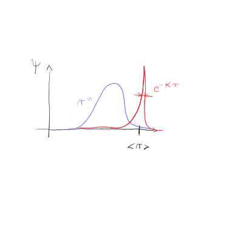

#+title: 7. predavanje iz Kvantne mehanike
#+startup: nolatexpreview
#+startup: entitiespretty nil
#+startup: show2levels
#+latex_header: \usepackage{amsmath} \usepackage{unicode-math} \usepackage{cancel} \usepackage{graphicx}
#+latex_header: \renewcommand{\theta}{\vartheta} \renewcommand{\phi}{\varphi} \renewcommand{\epsilon}{\varepsilon}
#+latex_header: \newcommand{\odv}[1]{\dot{\vec{#1}}} \newcommand{\oddv}[1]{\ddot{\vec{#1}}}
#+latex_header: \newcommand{\rot}{\mathrm{rot}}\newcommand{\dive}{\mathrm{div}} \newcommand{\iu}{\mathrm{i}}
#+latex_header: \newcommand\mapsfrom{\mathrel{\reflectbox{\ensuremath{\mapsto}}}}
* Coulombski potencial

Rešujemo Schrödingerjevo enačbo za Coulumbski problem

\begin{equation}
\label{eq:1}
 \left( - \frac{\hbar ^2}{2m} \frac{\mathrm{d} ^2 }{\mathrm{d} r ^2} + \frac{l (l + 1)\hbar ^2}{2m r ^2} - \frac{e ^2}{4 \pi \epsilon_0 r}   \right) u(r) = E u  (r)
\end{equation}

za vezana stanja \( E = - \left| E \right| \). Enačbe ne bomo reševali, kakor jo je Schrödinger. Enačbo prevedemo na brezdimenzijske enote z uvedbo spremenljivke \( \rho = \kappa r \), kjer velja

\begin{equation}
\label{eq:5}
 \left| E \right| = \frac{\hbar ^2 \kappa ^2}{2m}
\end{equation}

Enačbo \ref{eq:1} pomnožimo s faktorjem \( \frac{1}{\kappa ^2} \frac{2m}{\hbar ^2} \)

\[ \left( - \frac{\mathrm{d} ^2 }{\mathrm{d} \rho ^2} + \frac{l(l + 1)}{\rho ^2} + \frac{2m e ^2}{4 \pi \epsilon_0 \hbar ^2 \kappa} \frac{1}{\rho} \right) u(r) = \frac{E}{\left| E \right|} = - \frac{\left| E \right|}{\left| E \right|} u(r)
\]

Uvedemo konstanto

\begin{equation}
\label{eq:6}
 \rho_0 = \frac{m e ^2}{ 2 \pi \epsilon_0 \hbar ^2 \kappa}
\end{equation}

in enačba je bolj pregledno zapisana

\begin{equation}
\label{eq:2}
 u'' + \frac{l(l + 1)}{\rho ^2} u + \frac{\rho_0}{\rho} u - u = 0.
\end{equation}

Za rešitev bomo uporabili nastavek

\begin{equation}
\label{eq:4}
 u \left( r \kappa \right) = \rho^{l + 1} v(r \kappa) e^{- \rho},
\end{equation}

ki ga dvakrat odvajaš in rezultate vstaviš v \ref{eq:2}. Po čiščenju členov nam preostane enačba

\begin{equation}
\label{eq:3}
 \rho v'' + 2 (l + 1 - \rho) v ' + (\rho_0 - 2 (l + 1)) v = 0
\end{equation}

Tukaj naše poti divergirajo z načinom, ki ga je uporabil Schrödinger. On je uporabil

\[ \sum\limits_{m = 0}^2 \left( a_m + b_m x \right)y^{(m)}(x) = 0,
\]

kar je zgornjo enačbo spremenilo v Laplaceovo enačbo. Mi bomo uporabili razvoj v vrsto (Frobenius)

\begin{align*}
  v(\rho) &= \sum\limits_{k = 0}^{\infty} c_k \rho^k \\
v' &= \sum\limits_{k = 0}^{\infty} k c_k \rho^{k + 1} \overset{k \to k + 1}{\longrightarrow} \sum\limits_{k = 0}^{\infty} (k + 1)c_{k + 1} \rho^k \\
v'' &= \sum\limits_{k = 0}^{\infty} k (k + 1) c_{k + 1} \rho^{k - 1}
\end{align*}

Želimo, da imajo vse spremenljivke \( \rho \) potenco \( k \)

\[ \sum\limits_{k = 0}^{\infty} \left[ \left( k (k + 1) + 2(l + 1) (k + 1) \right) c_{k + 1} + (- 2k + (\rho_0 - 2(l + 1))) c_k \right] \rho^k = 0
\]

Dobili smo rekurzivno zvezo

\[ c_{k + 1} = \frac{2(k + l + 1) - \rho_0}{(k + 1) (k + 2l + 2)} c_k.
\]

Zvezo si poglejmo v limiti \( k \gg 1 \). Vodilni vrednosti bosta \( c_{k + 1} = \frac{2k}{k ^2} c_k = \frac{2}{k} c_k \).

Eksponent razvijemo v vrsto

\[ e^{2x} = \sum\limits_{k = 0}^{\infty} \frac{2^k x^k}{k !}.
\]

Kvocientni kriterij nam poda enako koeficient kot naša rekurzivna zveza za \( k \gg 1 \)

\[ \frac{2^{k + 1}}{(k + 1)!} \frac{k!}{2^k} = \frac{2}{k + 1} \overset{k \gg 1}{\longrightarrow} \frac{k}{2}.
\]

Iz tega lahko zaključimo, da se funkcij \( v(\rho) \) obnaša podobno kot \( e^{2 \rho} \) za \( k \gg  1 \). Nadalje sledi, da bo funkcija \ref{eq:4} divergirala, saj

\[ \left. u (\rho) \right|_{k \gg 1, \rho \gg 1} = \rho^{l + 1} e^{2 \rho} e^{-\rho} \longrightarrow e^{\rho}.
\]

Ker nam divergenca ni všeč, želimo doseči to, da bo \( c_k = 0 \) za \( k > k_{maks} \). Koeficient \( c_{k_{maks} + 1} \) je ničeln, ko je števec v rekurzivni zvezi ničeln, torej

\[ 2(k_{maks} + l + 1) = \rho_0 = 2n, \ n = k_{maks} + l + 1 \in \mathbb{N},
\]

kjer je \( n \leq 1 \). Ker ima vrsta končno število koeficientov, pomeni, da je polinom. Nastavek sedaj ne divergira več, saj je funkcija \( v_k(\rho) \) polinom stopnje \( k \) in

\[ u(\rho) = \rho^{l + 1} v_k (\rho) e^{- \rho} \propto \rho^{k + l + 1} e^{- \rho}
\]

Zanima nas še energije, kjer izhajamo iz začetne zveze za energijo \ref{eq:5} ter smo \( \kappa \) izrazili iz \ref{eq:6}

\[ E = - \frac{\hbar ^2 \kappa ^2}{2m} = - \frac{m e ^2}{8 \pi ^2 \epsilon_0 ^2 \hbar ^2 \rho_0 ^2}
\]

V diskretnem spektru lahko zapišemo torej

\[ E_n = - \frac{m}{2 \hbar ^2} \left( \frac{e}{4 \pi \epsilon_0} \right) ^2 \frac{1}{n ^2} = - \frac{\left| E_1 \right|}{n ^2}
\]
* Kvantni Laplace-Runge-Lenzov vektor (Pauli, 1926)

Operator

\[ \hat{\vec{A}} = \frac{1}{2} \left( \hat{\vec{p}} \times \hat{\vec{L}} + \left( \hat{\vec{p}} \times \hat{\tilde{L}} \right)^{\dagger} \right) - \frac{m e ^2}{4 \pi \epsilon_0} \frac{\vec{r}}{r} = \vec{A} ^{\dagger}
\]

je hermitski. LRL vektor ne komutira z gibalno količino, saj

\[ \left[ L_{\alpha}, A_{\beta} \right] = \mathrm{i} \hbar \epsilon_{\alpha\beta\gamma} A_{\gamma}.
\]

Komutira pa z Hamiltonianom \( \left[ \vec{A}, H \right] = 0 \).

Uvedemo pojem degeneracije, ki je število funkcij pri isti lastni vrednosti.

\[\begin{array}{|c|c|c|c|c|} \hline
n = k + l + 1 & l & k & u & \mathrm{deg} \\ \hline
1 & 0 & 0 & e^{-\rho} & 1 \\ \hline
2 & 0 & 1 & \rho e^{- \rho} Y_0^0 & 2 \\
2 & 1 & 0 & e^{-\rho} Y_1^m & 2\\ \hline
3 & 0 & 2 & & 3 \\
3 & 1 & 1 & \rho e^{-\rho} Y_1^m & 3 \\
3 & 2 & 0 & e^{-\rho} Y_2^m & 3 \\ \hline
\end{array}
\]

kjer \( \mathrm{deg} \) označuje degeneracijo. Zanima nas degeneracija poljubnega \( n \)-tega energijskega stanja. \( m \) zaseda vrednosti od \( -l \) do \( l \), kar pomeni, da imamo \( 2l + 1 \) stanj. Torej

\[ \mathrm{deg} E_n = \sum\limits_{l = 0}^{n - 1} (2l + 1) = \ldots = n ^2
\]

Imamo torej \( n ^2 \) različnih funkcij.
* Klasična limita

Vemo, da so rešitve klasične limite Keplerjeve orbite. Pod klasično limito uvrščamo stvari, kjer za tipično razdaljo \( R \) velja

\[ \Delta r ^2 = \left\langle r  ^2 \right\rangle - \left\langle r \right\rangle ^2 \le R.
\]

Za klasično limito tudi velja, da so kvantna števila kot so \( n, l \) in \( m \) veliko večja od \( 1 \).

Zanima nas, ko valovni paket kroži po ravnini. Iz definicije to pomeni, da gledamo valovno funkcijo, katere \( l \) ima največjo vrednost

\[ \psi_{n, l} = \psi_{n, n - 1} = C_n r^{n - 1} \exp \left\{ -\frac{r}{n a_0} \right\},
\]

kjer je \( a_0 \) Bohrov radij.

Velja

\[ \frac{\Delta r}{\left\langle r \right\rangle} \sim \frac{1}{\sqrt{n}}.
\]

Če vzamemo za primer elektron, ki kroži na \( \left\langle r \right\rangle = 1 \mathrm{cm} \) z natančnostjo \( \Delta r = 0.1 \mathrm{mm } \) je \( n = 10^4 \). Gledamo 3 stvari našega valovnega paketa. Lupina z radij \( \left\langle r \right\rangle \) se ne spreminja skozi čas \( \Delta r \ne \Delta r (t) \).

Tudi ven iz ravnine ne gre, torej \( \theta = \frac{\pi}{2} \ne \theta(t) \). Tisto, kar pa ni značilno za klasično limito pa je, da se bo valovni paket razširil tekom časa

\[ \left\langle \phi \right\rangle = \omega t + c
\]
