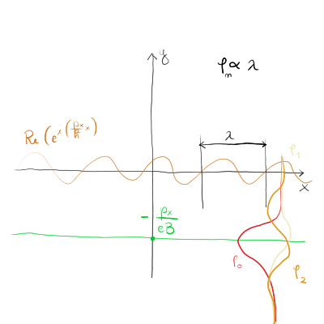
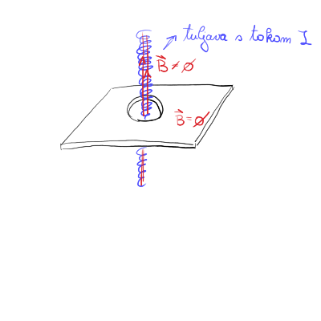
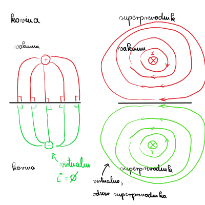

#+title: 8. predavanje iz Kvantne mehanike
#+startup: nolatexpreview
#+startup: entitiespretty nil
#+startup: show2levels
#+latex_header: \usepackage{amsmath} \usepackage{unicode-math} \usepackage{cancel} \usepackage{graphicx}
#+latex_header: \renewcommand{\theta}{\vartheta} \renewcommand{\phi}{\varphi} \renewcommand{\epsilon}{\varepsilon}
#+latex_header: \newcommand{\odv}[1]{\dot{\vec{#1}}} \newcommand{\oddv}[1]{\ddot{\vec{#1}}}
#+latex_header: \newcommand{\rot}{\mathrm{rot}}\newcommand{\dive}{\mathrm{div}} \newcommand{\iu}{\mathrm{i}}
#+latex_header: \newcommand\mapsfrom{\mathrel{\reflectbox{\ensuremath{\mapsto}}}}
* Nabit delec v magnetnem ali električnem polju

Spomnimo se od zadnjič, da smo opazovali homogeno magnetno polje \( \vec{B} = (0, 0, 1) \) ter si izbrali Landauovo umeritev vektorskega potenciala \( \vec{A} = B(-y, 0, 0) \).

Iščemo lastna stanja enačbe

\[ \left( \frac{\left( \vec{p} - e \vec{A} \right)^2}{2m} + e \phi + U \right) \psi = E \psi,
\]

kjer sta funkciji \( U = U(y)  \) in \( \phi = \phi(y) \). Edina komponenta odvisna od \( x \) spremenljivke je \( p = p(x) \). Rešitve v \( x \) in \( z \) koordinati so zaradi neodvisnosti operatorjev od \( y \) samo ravna valova za prost delec

\[ \psi(x, y, z) = \exp \left\{ \mathrm{i} \left( \frac{p_x}{\hbar} x + \frac{p_z}{\hbar}z \right) \right\} \chi(y)
\]

S tem nastavkom rešujemo diferencialno enačbo

\[ \left[ - \frac{\hbar ^2}{2m} \frac{\mathrm{d} ^2 }{\mathrm{d} y ^2} + \frac{1}{2} m \omega ^2 \left( y - y_0  \right)^2 + V(y) \right] \chi(y) = E \chi(y),
\]

kjer sta \( \omega = \frac{eB}{m} \) ciklotronska frekvenca in \( y_0 = - \frac{p_0}{eB} \).

Potencial \( V(y) = 0 \), zato so rešitve te diferencialne enačbe rešitve harmonskega oscilatorja

\[ E_n = \hbar \omega \left( n + \frac{1}{2} \right) + \frac{p_z ^2}{2m} = E_{n p_x p_z}
\]

(Normirano) valovno funkcijo zapišemo

\[ \psi_{n p_x p_z} = \frac{1}{\sqrt{2 \pi \hbar} ^2} \exp \left\{ \mathrm{i} \left( \frac{p_x}{\hbar} x + \frac{p_z}{\hbar} z \right) \right\} \phi_n (y - y_0).
\]

Funkcija \( \phi_n  \) je premaknjena za \( p_x \) zaradi definicije \( y_0 \).

Kakor vidimo na zgornji sliki, je rešitev premaknjena za faktor \( \frac{p_x}{eB} \) v negativen \( y \) in hkrati so rešitve \( \phi_n \) odvisne od valovne dolžine rešitve ravnega vala v \( x \) smeri.

Imejmo energije, ki so neodvisne od \( p_x \), torej \( E_{n p_x p_z} = E_{n p_z} \). Začetno stanje

\[ \psi(x, 0) = \int\limits_{-\infty}^{\infty} \tilde{\psi}(p_x) \frac{\exp \left\{ \mathrm{i} \frac{p_x}{\hbar} x \right\}{\sqrt{2 \pi\hbar}} \, \mathrm{d} p_x
\]

razvijemo po času

\[ \psi(x, t) = \int\limits_{- \infty}^{\infty} \tilde{\psi} (p_x) \frac{\exp \left\{ \mathrm{i} \frac{p_x}{\hbar} x - \mathrm{i} \frac{E}{\hbar} t \right\}{\sqrt{2 \pi \hbar}} \, \mathrm{d} p_x = \exp \left\{ - \mathrm{i} \frac{E_n p_z}{\hbar} t \right\} \psi(x, 0)
\]

Upoštavli smo, da je energija neodvisna od \( p_x \). Tak ravni val delca v magnetnem polju se ne bo ne premikal niti ne bo spreminjal oblike skozi čas, ampak bo isto kot je bilo ob začetnem stanju. (primerjaj rešitev z delcem, ko je energija odvisna od \( p_x \)!). Razlog za to je /degeneracija/ - Landauovi nivoji.

Degeneracija je posledica izbrane umeritve, saj ni simetrična. Lahko bi si izbrali simetrično obliko umeritve

\[ \vec{A} = \frac{1}{2} \vec{r} \times \vec{B} = \frac{B}{2} \left( - y, x, 0 \right) = \frac{1}{2} B \left[ (-y, 0, 0) + (0, x, 0) \right]
\]

Rešitev te simetrične umeritve so za \( z = x + \mathrm{i}y \) oblike

\[ \psi(x, y) = C \exp \left\{ - \frac{1}{4 \xi ^2} \left(\left| z \right| ^2 - 2z z_0 + \left| z_0 \right| ^2\right) \right\}, \quad \xi = \sqrt{\frac{\hbar}{e B}}
\]

kar je ravni val, ki kroži s krožno frekvenco \( \omega \). Rešitev je koherentno stanje (what does that mean?).
* Lokalne umeritvene transformacije

Imamo magnetno polje

\begin{equation}
\label{eq:1}
 \vec{B} = \nabla \times \vec{A},
\end{equation}

ter električno polje

\begin{equation}
\label{eq:2}
 \vec{E} = - \nabla \phi - \frac{\partial \vec{A}}{\partial t}.
\end{equation}

\( \vec{A} \) nas v tem primeru ne zanima, saj sta \( \vec{B} \) in \( \vec{E} \) merljivi količini. Posledično lahko definiramo nove vektorske potenciale in električne potenciale tako, da so oblike

\[ \vec{A}\, ' = \vec{A} + \nabla \Lambda \left( \vec{r}, t \right), \quad \phi' = \phi - \frac{\partial }{\partial t} \Lambda
\]

Nove potenciale lahko uvedemo, saj ostaneta enačbi \ref{eq:1} in \ref{eq:2} ostaneta nespremenjeni. Vendar z uvedbo nove umeritve spremenimo bazo rešitve in posledično nas zanima, kakšne so nove rešitve valovne funkcije \( \psi' \).

Predpostavimo, da poznamo rešitev \( \psi \) enačbe

\[ \mathrm{i} \hbar \frac{\partial \psi}{\partial t} = \frac{\left( \vec{p} - e \vec{A} \right) ^2}{2m} \psi + e \phi \psi.
\]

Ali moramo \( \psi' \) vsakič znova preračunati ali obstaja recept, ki nam olajša delo?

Globalna umeritvena transformacija je definirana kot

\[ \psi' = e^{\mathrm{i} \delta_0}, \ \delta_0 \in \mathbb{R}
\]

#+begin_theorem
Trdimo, da je nastavek \( \psi' = \exp \left\{ \mathrm{i} \delta \left( \vec{r}, t \right) \right\} \psi \) recept, ki nam reši nove umeritve.
#+end_theorem

Določiti moramo še vrednost \( \delta \).
#+begin_proof
Dokaz zgornje trditve začnemo s pomožnim računom

\begin{equation}
\label{eq:3}
 \left( \mathrm{i} \frac{\partial }{\partial x}  + f(x) \right) \exp \left\{ \mathrm{i} \delta(x) \right\} \psi(x) = \exp \left\{ \mathrm{i} \delta(x) \right\} \left( \mathrm{i} \frac{\partial }{\partial x}  + \left( f - \frac{\partial \delta(x)}{\partial x}  \right) \right) \psi,
\end{equation}

kjer smo upoštevali verižni odvod. Odvajamo še drugič

\begin{equation}
\label{eq:4}
\left( \mathrm{i} \frac{\partial }{\partial x}  + f(x) \right) ^2 \exp \left\{ \mathrm{i} \delta(x) \right\} \psi = \exp \left\{ \mathrm{i} \delta(x) \right\} \left( \mathrm{i} \frac{\partial }{\partial x} + \left( f - \frac{\partial \delta}{\partial x}  \right)^2 \right) \psi,
\end{equation}

kjer smo si pri računanju pomagali z enakostjo \ref{eq:3}.

Rešujemo Schrödingerjevo enačbo

\[ \mathrm{i} \hbar \frac{\partial \psi'}{\partial t}  = \frac{\left( \vec{p} - e \vec{A} \right) ^2}{2m} \psi' + e \phi ' \psi'.
\]

Desno stran Schrödingerjeve lahko ob upoštevanju globalne umeritvene transformacije in identitete \ref{eq:4} zapišemo kot

\begin{equation}
\label{eq:5}
\mathrm{i} \hbar \frac{\partial }{\partial t} \exp \left\{ \mathrm{i} \delta \right\} \psi = \frac{1}{2m} \sum\limits_{\alpha}^{} \left( + \mathrm{i} \hbar \frac{\partial }{\partial x}  + e A_{\alpha}' \right) ^2 \exp \left\{ \mathrm{i} \delta \right\} \psi + e \phi' \exp \left\{ \mathrm{i} \delta \right\} \psi
\end{equation}

Leva stran pa je ob upoštevanju identitete \ref{eq:3}

\begin{equation}
\label{eq:6}
\exp \left\{ \mathrm{i} \delta \right\} \left( \mathrm{i} \hbar \frac{\partial }{\partial t}  - \hbar \frac{\partial \delta}{\partial t}  \right) \psi = \frac{\exp \left\{ \mathrm{i} \delta \right\}{2m} \sum\limits_{\alpha}^{} \left( \mathrm{i} \hbar \frac{\partial }{\partial x_{\alpha}} + e \left( A_{\alpha}' - \frac{\hbar}{e} \frac{\partial \delta}{\partial x_{\alpha}}  \right) \right) ^2 \psi + e \phi' \psi
\end{equation}

Iz enačbe \ref{eq:6} lahko definiramo vektorski potencial \( \vec{A} \) v treh dimenzijah kot

\[ \vec{A} \, ' - \frac{1}{e} \hbar \nabla \delta(x) = \vec{A}.
\]

Hkrati pa velja tudi za električni potencial \( \phi \)

\[ \phi' + \frac{\partial }{\partial t}  \frac{\hbar}{e} \delta(x) = \phi
\]

Če sedaj primerjamo zapis od začetka poglavja z zadnjima dvema enakostima, vidimo, da je \( \Lambda = \frac{\hbar}{e} \delta(x) \).

Torej res velja

\[  \mathrm{i} \hbar \frac{\partial \psi}{\partial t} = \frac{\left( \vec{p} - e \vec{A} \right) ^2}{2m} \psi + e \phi \psi \iff  \mathrm{i} \hbar \frac{\partial \psi'}{\partial t}  = \frac{\left( \vec{p} - e \vec{A} \right) ^2}{2m} \psi' + e \phi ' \psi'.
\]

za

\begin{align*}
  \psi' &= \exp \left\{ \mathrm{i} \frac{e}{\hbar}\Lambda \right\} \psi \\
\vec{A} \, ' &= \vec{A} + \nabla \Lambda \\
\phi' &= \phi - \frac{\partial \Lambda}{\partial t}
\end{align*}

Verjetnostna gostota obeh funkcije je enaka

\[ \rho' = \rho = \left| \psi \right|  ^2
\]
#+end_proof
* Aharonov-Bohmov pojav

Imamo tuljavo, po kateri teče magnetni tok in tuljava prebada ravnino, po kateri se premika naš delec. Na ravnini ni magnetnegea polja, znotraj tuljave pa je.

Pričakovali bi, da delec na ravnini ne čuti magnetnega polja znotraj tuljave, vendar temu ni tako. Za magnetno polje velja

\[ \vec{B} = \nabla \times  \vec{A} = 0, \quad \vec{A} = \nabla \Lambda \ne 0
\]

Iz slednjega lahko zapišemo

\[ \Lambda \left( \vec{r} \right) = \Lambda \left( \vec{r} _{0} \right) - \int\limits_{\vec{r}_0}^{\vec{r}} \vec{A} \left( \vec{r} \right) \, \mathrm{d} \vec{r},
\]

kjer je integral po poti delca, v ravnini.

Uporabimo lahko analogijo iz EMP, kjer velja \( \nabla \times \vec{B} = \vec{\jmath} \mu_0 \) za magnetno polje prevodnika polmera \( R \). Naše magnetno polje v tuljavi \( \vec{B} \) igra vlogo \( \vec{\jmath} \) in vektorski potencial \( \vec{A} \) igra vlogo magnetnega polja \( \vec{B} \). Magnetno polje prevodnika je

\[ \vec{B} = \frac{\mu_0 I}{2 \pi r} \hat{e}_{\phi}, \quad I = \int\limits_{}^{} \vec{\jmath} \cdot \mathrm{d} \vec{S}.
\]

Magnetno polje narašča linearno do polmera \( R \), potem pa z oddaljevanjem od vodnika pada obratno sorazmerno.

Če pa narišemo graf z ustrezno zamenjamini količino in rišemo \( \vec{A} \left( \vec{r} \right) \) pa dobimo

\[ \vec{A} \left( \vec{r}  \right)= \begin{cases}
                                     1 &; r < R \\
                                     0 &; r > R
                                    \end{cases}
\]

Rešujemo torej Schrödingerjevo enačbo za \( \vec{B} = 0 \) in \( \vec{A} \ne 0 \)

\[ \mathrm{i} \hbar \frac{\partial \psi_{A}}{\partial t}  = \frac{\left( \vec{p} - e \vec{A} \right)^2}{2m} \psi_A + V \psi _A
\]

Zaradi prej izpeljanih umeritev lahko sedaj definiramo funkcijo \( \psi_0 \), za katero velja \( \vec{B} = 0 \) in \( \vec{A} = 0 \), kar je naš ekvivalent funkcije \( \psi' \).

Iz prej izpeljanih enačb torej velja

\[ \vec{A} \, ' = \vec{A} + \nabla \left( - \lambda \right) = 0
\]

Tako lahko zapišemo

\[ \psi_A \left( \vec{r}, t \right) = \exp \left\{ \mathrm{i} \frac{e}{\hbar} \int\limits_{\vec{r}_0}^{\vec{r}} \vec{A} \left( \vec{r}\, ' \right) \, \mathrm{d} \vec{r} \, ' \right\} \psi_0 \left( \vec{r}, t \right)
\]

Poglejmo si ponovno sliko na začetku poglavja. Naj bo na levem robu točka \( I \), kamor priključimo tok \( I \). Tok odteka iz ravnine v točki \( II \) na levem robu ravnine. Oglejmo si dve različni poti: pot \( (1) \) poteka od točke \( I \) do točke \( II \) tako, da gre mimo luknje v ravnini tako, da gre pred njo. Druga pot \( (2) \) pa gre od iste točke za luknjo (torej je globje.).

V primeru,da v tuljavi ni magnetnega toka \( \vec{B} = 0 \) in vektorski potencial je \( \vec{A} = 0 \). Zapišemo valovno funkcijo kot vsoto valovne funkcije, ki gre po poti \( (1) \) in valovne funkcije, ki gre po poti \( (2) \). Torej

\[ \psi_{II, 0} = \psi_1 + \psi_2
\]

Vključimo magnetno polje v tuljavi/cilindru \( B \ne 0 \). Vektorski potencial je sedaj tudi zunaj tuljave različen od nič \( \vec{A} \ne 0 \). Zapišemo valovno funkcijo kot

\[ \psi_{II, B} = \exp \left\{ \mathrm{i} \delta_1 \right\} \psi_1 + \exp \left\{ \mathrm{i} \delta_2 \right\} \psi_2,
\]

kjer je

\[ \delta_i = \frac{e}{\hbar} \int\limits_{(i)}^{} \vec{A} \, \mathrm{d} \vec{r}, \ i = 1, 2.
\]

Valovno funkcijo lahko tako zapišemo kot

\[ \psi_{II, B} = \exp \left\{ \mathrm{i} \delta_2 \right\} \left( \exp \left\{ \mathrm{i} \left( \delta_1 - \delta_2 \right) \right\} \psi_1 + \psi_2 \right) = \exp \left\{ \mathrm{i} \delta_2 \right\} \left( 1 + \exp \left\{ \mathrm{i} \left( \delta_1 - \delta_2 \right) \right\} \right) \psi_1,
\]

kjer smo upoštevali, da \( \psi_1 \approx \psi_2 \).

Izračunajmo torej

\[ \delta = \delta_1 - \delta_2 = \frac{e}{\hbar} \left[ \int\limits_{(1)}^{} \vec{A} \cdot \mathrm{d} \vec{r} + \int\limits_{(2)}^{} \vec{A} \cdot \mathrm{d} \vec{r} \right]
\]

Pot \( (2) \) lahko orientiramo v drugo smer in dobim integral po krožni poti

\[ \delta = \frac{e}{\hbar} \oint\limits_{}^{} \vec{A} \cdot \mathrm{d} \vec{r}.
\]

Upoštevamo še Gaussov izrek in definicijo vektorskega potenciala, da dobimo

\[ \delta = \frac{e}{\hbar} \int\limits_{}^{} \nabla \times \vec{A} \, \mathrm{d} \vec{S} = \frac{e}{\hbar}A \int\limits_{}^{} \vec{B} \cdot \mathrm{d} \vec{S} = \frac{e}{\hbar} \phi_B
\]

Če sedaj primerjamo razmerja valovnih funkcij, kjer magnetnega toka ni in je, dobimo sinusoido

\[ \frac{I_B}{I_0} = \frac{\left| \psi_{II, B} \right| ^2}{\left| \psi_{II, 0} \right| ^2} = \frac{1}{4} \left| 1 + \exp \left\{ \mathrm{i} \frac{e}{\hbar} \phi_B \right\} \right|  ^2 = \cos ^2 \frac{e}{2 \hbar} \phi_B
\]

Maksimum tega nihanja je, ko velja \( \exp \left\{ \mathrm{i} \frac{e}{\hbar} \phi_B \right\}= 1 \), kjer so maksimumi \( \phi_B = \frac{2 \pi \hbar}{e} n = \frac{\hbar}{e} n = \phi_0 n \)
[dodaj]

* Superprevodniki :dodatna_snov::ni_za_izpit:

Lastnosti superprevodnikov so

1. \( B = 0 \), Weissner - idealen diamagnet
2. \( \rho = 0 \) idealni prevodnik
3. energijska vrzel (s katero se ne bomo ukvarjali)

** Levitacija :opis_storjenega_eksperimenta:
*** \( T > T_C \sim 91 \mathrm{K} \)

Imejmo superprevodnik z luknjo in magnetnim poljem. Silnice magnetnega polja gredo skozi superprevodnik in magnetno polje ni ničelno znotraj prevodnika.

*** \(T < T_C \)

Magnetne silnice gredo sedaj skozi luknjo in okrog superprevodnika, iz česar sledi, da magnetnega polja v superprevodniku ni \( \vec{B} = 0 \). Zunaj prevodnika magnetno polje je \( B \ne 0 \), kjer velja \( \phi = n\phi_0 \).

Če si zamislimo podobno krožno pot kakor pri Aharanov-Bohmovemu pojavu, bo valovna funkcija

\[ \psi_A = \exp \left\{ \mathrm{i} \frac{e ^2}{\hbar} \int\limits_{\vec{r}_0}^{\vec{r}} \vec{A} \, \mathrm{d} \vec{r} \right\} \psi_0
\]

Velja torej, da je

\[ \psi_2 = \psi_1 \exp \left\{ \mathrm{i} \delta \right\}
\]

in pa hkrati \( \psi_2 = \psi_1 \). To dvoje velja samo, če je \( \exp \left\{ \mathrm{i} \delta \right\} = 1 \). Iz tega sledi, da je

\[ \int\limits_{}^{} \vec{A} \cdot \mathrm{d} \vec{r} = \phi = n \phi_0
\]

Torej superprevodnik pri tej temperaturi sproži električne tokove v sebi tako, da je magnetno polje večkratnik zunanjega magnetnega polja, usmerjeno v nasprotni smeri.

Imamo še dva tipa superprevodnika - prva je čisti kristal, ki preslika magnetni polje. Drugi tip superprevodnika je sestavljen iz praška, v katerega ujamemo magnetno polje.
