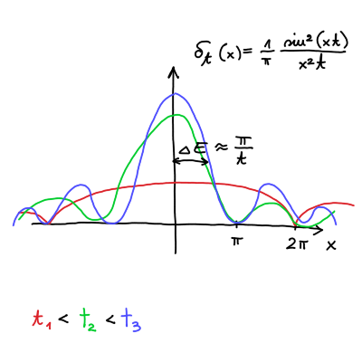

#+title: 13. predavanje iz Kvantne mehanike
#+startup: nolatexpreview
#+startup: entitiespretty nil
#+startup: show2levels
#+latex_header: \usepackage{amsmath} \usepackage{unicode-math} \usepackage{cancel} \usepackage{graphicx}
#+latex_header: \renewcommand{\theta}{\vartheta} \renewcommand{\phi}{\varphi} \renewcommand{\epsilon}{\varepsilon}
#+latex_header: \newcommand{\odv}[1]{\dot{\vec{#1}}} \newcommand{\oddv}[1]{\ddot{\vec{#1}}}
#+latex_header: \newcommand{\rot}{\mathrm{rot}}\newcommand{\dive}{\mathrm{div}} \newcommand{\iu}{\mathrm{i}}
#+latex_header: \newcommand\mapsfrom{\mathrel{\reflectbox{\ensuremath{\mapsto}}}}
* Fermijevo zlato pravilo

Izpeljali smo verjetnost, da delec po dolgem času skoči iz \( n \)-tega lastnega stanja v \( k \)-ti lastno stanje ob prisotnosti motnje \( V \), ki je neodvisna od časa, vendar se pojavi ob času \( t > 0 \).

Verjetnost je

\[ P_{km} (t) = \frac{\left| V_{km} \right|^2}{\hbar ^2} \delta \delta_t \left( \frac{1}{2 \hbar} \left( E_k - E_m \right) \right)t,
\]

kjer je \( V_{km} = \left\langle k \middle| V \middle| m \right\rangle \).

Priporočam bralcu, da si nariše \( \delta_t(x) \) in opazuje, kako se spreminja v odvisnosti od parametra \( t \). Opazil bo, da se funkcija oža in viša proti neskončnosti okoli izhodišča \( x = 0 \).

Širina med izhodiščem in krivuljo, ki vodi do prve ničle. Širina je \( \Delta x \), ki je

\[ \Delta x = \frac{\pi}{t} = \frac{\Delta E}{2 \hbar},
\]

kjer je \( \Delta E \) definirana kot razlika lastne energije \( E_k = E_1 ' + E_2 ' \) lastnega stanja \( \left| k \right\rangle \) in lastne energije \( E_m = E_1 + E_2 \) lastnega stanja \( \left| m \right\rangle \).

\[ \Delta E = E_k - E_m
\]

Iz tega sledi \( \Delta E t \approx \hbar \).

Z minevanjem časa \( t \to \infty \) se oblika krivulje oža in viša proti neskončnosti. To pomeni, da \( \Delta E \to 0 \).

Iz tega sledi, da so skoki med stanjema \( n \) in \( k \) ob krajšem času večji, saj je \( \Delta E \) večji. Z večanjem časa se manjša \( \Delta E \), kar pomeni, da je manjša verjetnost, da najdemo delec v drugem stanju kakor \( \left| m \right\rangle \).

Delec bomo vedno našli, saj je \( P_m (t = 0) = 1 \).

To se ne uporablja pri harmonskem oscilatorju, ampak pri sipanju delcev.

Imejmo končno stanje \( E_k \), ki ima v svoji okolici \( \epsilon > 0 \) veliko drugih možnih energij. Naj bo na intervalu \( \mathrm{d} E_k = E_k \pm \epsilon \) možnih \( \mathrm{d} N \) energijskih stanj.

To lahko opišemo z gostoto stanj

\[ \rho_k = \frac{\mathrm{d} N}{\mathrm{d}  E_{k}} \cdot \frac{1}{N_k} = \frac{\mathrm{d} P}{\mathrm{d} E_k}
\]

Zanima nas, v katerem stanju \( k \), ki je različen od osnovnega stanja \( m \), bo delec po času \( t \). Do tega rezultata bomo prišli preko verjetnosti

\[ P = \sum\limits_{k \ne m}^{} P_{kn} \to \int\limits_{- \infty}^{\infty} P_{km} (t) \rho \left( E_k \right) \mathrm{d} E_k,
\]

kjer smo predpostavili zvezen spekter energijskih nivojev. To predpostavko lahko tudi drugače ubesedimo: matrični element \( V_{km} \) se ne spreminja veliko oz. \( E_k \approx E_m \).

Upoštevamo prej izpeljano verjetnost \( P_{km} \) in ko čas \( t \to \infty \) integral postane

\[ P \overset{t \to \infty}{=} \int\limits_{- \infty}^{\infty} \frac{\left| V_{km} \right| ^2}{\hbar ^2} 2 \pi \hbar \delta \left( E_k - E_m \right) \rho \left( E_k \right) \, \mathrm{d} E_k = \frac{2 \pi}{\hbar} \left| V_{km} \right| ^2 \rho \left( E_m \right) t.
\]

Po dolgem času verjetnost za prehod v neko bližnje stanje \( E_k \) narašča linearno.

Iz tega sledi Fermijevo zlato pravilo

\[ w = \frac{\mathrm{d} P}{\mathrm{d} t} = \frac{2 \pi}{\hbar} \left| V_{km} \right| ^2 \rho \left( E_m \right).
\]

Pravilo ima tudi nekatere pogoje.

- verjetnost, da delec ostane v istem stanju je enako

  \[ P_{mm} = \left| c_m \right| ^2 \approx 1 - \lambda ^2 + \ldots,
  \]

  Posledično pomeni, da je verjetnost za prestop v drugo stanje \( P_{km} \ll 1 \).

- \( t \to \infty \)

- \( V_{km} \) ni zelo odvisen od začetnega stanja \( E_k \).

#+name: Radioaktivni razpad
#+begin_my_example
Verjetnost radioaktivnega razpada je konstantna

\[ w = \frac{\mathrm{d} P}{\mathrm{d} t} = \mathrm{konst},
\]

kar sledi iz Fermijevega zlatega pravila.

Če imamo \( N \) delcev, bo število delcev, ki bo radioaktivno razpadlo enako

\[ \mathrm{d} N = - N \mathrm{d} P = - NP \mathrm{d}t.
\]

Slednje lahko precej enostavno rešimo

\[ \frac{\mathrm{d} N}{N} = - w \mathrm{d } t  \implies N(t) = N_0 e^{- w t},
\]

kjer velja \( t \gg \frac{1}{w} \).

#+end_my_example
* Adiabatne spremembe in kvantne faze

Imejmo časovno odvisen Hamiltonian \( H(t) \). Poglejmo si primere adiabatnih sprememeb

a) Neskončno potencialna jama z dolžino \( L(t = 0) \). Osnovno stanje je \( \sin (kx) \). Potencialno jamo počasi širimo, torej \( L(t) \). Za dovolj počasno širjenje bo sistem ostajal v istem stanju \( \sin \left( k(t) x \right) \).

b) Imamo končno potencialno jamo globine \( V_0 (t = 0) \), ki ji bomo s časom spreminjali globino \( V_0 (t) \).

Primer hipne spremembe (protipomenka adiabatne spremembe) je, da neskončno potencialno jamo širine \( L \) hipno razširimo na \( L' > L \). Tak primer znamo rešiti z znanjem iz kvantnomehanskih vaj iz začetka leta.

Postavimo sedaj problem.

Imejmo Hamiltonian, ki je časovno odvisen od \( n \) spremenljivk \( H (\vec{Q}(t)) \), kjer je \( \vec{Q} = \left( q_1, q_2, \ldots, q_n \right) \), kjer so to lahko npr. \( q_1 = L(t) \), \( q_2(t) = V_0 (t) \), ipd.

Rešujemo enačbo

\[ H(\vec{Q}) \left| \psi_n \left( \vec{Q} \right) \right\rangle = E_n \left( \vec{Q} \right) \left| \psi_n \left( \vec{Q} \right) \right\rangle,
\]

kjer je \( \left| \psi_n \left( \vec{Q} \right) \right\rangle \) nedegenerirano lastno stanje.

Označimo rešitev lastno stanje pri neki vrednosti poljubnega parametra ob času \( t \) z

\[ \psi_n^0 \left( \vec{r}, t \right) = \left\langle \vec{r} \middle| \psi_n^0 \left( \vec{Q} (t) \right) \right\rangle.
\]

Za primer a) je ta funkcija enaka

\[ \psi_n^0 = A \sin \left( k(t) r \right) e^{- \mathrm{i} \frac{\hbar ^2 k ^2  (t)}{\hbar} t} .
\]

Stanje \( \psi_n^0 \) ne reši Schrödingerjeve enačbe

\[ \mathrm{i} \hbar \frac{\partial }{\partial t} \left| \psi_n^0 (\vec{r}, t) \right\rangle \ne H \left( \vec{Q} \right) \left| \psi_n^0 \left( \vec{r}, t \right) \right\rangle
\]

Adiabatna sprememba mora biti tako, da je verjetnostna gostota skozi čas ostaja enaka. Za a) primer je ta pogoj

\[ \frac{1}{L} \frac{\mathrm{d} L}{\mathrm{d} t} \ll \frac{\Delta E_n}{ \hbar},
\]

kjer velja \( \Delta E_n \Delta t > \hbar \).

Sistem mora ves čas ostajati v istem \( n \)-tem lastnem stanju \( H \left( \vec{Q} \right) \), vendar lahko neka časovno neodvisna faza \( \phi_n(t) \) spreminja lastni vektor \( \left| \psi_n \left( \vec{Q} \right) \right\rangle \) .

\[ \psi_n \left( \vec{r}, t \right) = e^{\mathrm{i} \phi_n (t)} \psi_n^0 \left( \vec{r}, t \right)
\]

Velja

\begin{equation}
\label{eq:1}
 \left\langle \psi_n^0 \middle| \psi_n^0 \right\rangle = 1.
\end{equation}

Vstavek s fazo \( \phi_n \) vstavimo v Schrödingerjevo enačbo

\begin{align*}
  \mathrm{i} \hbar \frac{\partial }{\partial t}  \left| \psi_n \right\rangle &= H \left| \psi_n \right\rangle \\
\mathrm{i} \hbar \left( \mathrm{i} \frac{\partial }{\partial t} \phi_n (t) e^{\mathrm{i} \phi_n (t)} \left| \psi_n^0 \right\rangle + e^{\mathrm{i} \phi_n (t)} \frac{\partial }{\partial t} \left| \psi_n^0 \right\rangle\right) &= H e^{\mathrm{i} \phi_n(t)} \left| \psi_n^0 \right\rangle = E_n \left| \psi_n^0 \right\rangle
\end{align*}

Po množenju z bra \( \left\langle \psi_n^0 \right| \) in upoštevanjem lastnosti \re{eq:1} dobimo

\[ \mathrm{i} \hbar \left( \mathrm{i} \frac{\partial }{\partial t} \phi_n (t) \left\langle \psi_n ^0 \middle| \psi_n^0 \right\rangle  + \left\langle \psi_n^0 \middle| \frac{\partial }{\partial t}  \psi_n^0 \right\rangle\right) = \mathrm{i} \hbar \left( \mathrm{i} \frac{\partial }{\partial t} \phi_n(t) + \left\langle \psi_n^0 \middle| \frac{\partial }{\partial t} \psi_n^0 \right\rangle \right) = E_n \left\langle \psi_n^0 \middle| \psi_n^0 \right\rangle = E_n
\]

Fazo sedaj razdelimo na dva dela \( \phi_n = \gamma_n + \theta_n \) tako, da velja

\[ \mathrm{i} \hbar \left( \mathrm{i} \frac{\partial }{\partial t} \gamma_n (t) + \left\langle \psi_n^0 \middle| \frac{\partial }{\partial t} \psi_n^0 \right\rangle \right) = E_n + \hbar \frac{\partial }{\partial t} \theta_n (t) = 0.
\]

Z drugimi besedami, izberemo si tako vrednosti, da faze ni.

Rešimo lahko sedaj desno stran enačbo

\[ \frac{\mathrm{d} \theta_{n}(t)}{\mathrm{d} t}= - \frac{E_n (t)}{\hbar},
\]

katera rešitev je

\[ \theta_n = - \frac{1}{\hbar} \int\limits_0^t E_n(t') \, \mathrm{d} t'.
\]

Enačba na levi strani pa se glasi

\[ \frac{\partial }{\partial t}  \gamma_n = \mathrm{i} \left\langle \psi_n^0 \middle| \frac{\partial }{\partial t}  \psi_n^0 \right\rangle.
\]

Ker je \( \psi_n^0 \) rešitev enačbe za parameter \( q \) ob nekem času \( t \) (ne vseh časih!), lahko odvod zapišemo posredno

\[ \frac{\partial }{\partial t}  \psi_n^0 = \sum\limits_i^{ } \left( \frac{\partial }{\partial q_{i}} \psi_n^0 \right) \frac{\partial }{\partial t} q_i(t) = \nabla_{\vec{Q}} \cdot \dot{\vec{Q}} \psi_n^0,
\]

kjer je \( \nabla_{\vec{Q}} \) gradient v prostoru \( \vec{Q} \).

Faza je potem

\[ \gamma_n (t) = \int\limits_0^t \mathrm{i} \left\langle \psi_n^0 \middle| \nabla_{\vec{Q}} \psi_n^0 \right\rangle \cdot \dot{\vec{Q}}(t') \, \mathrm{d} t'
\]

Nadomestimo \( \dot{\vec{Q}}(t') \, \mathrm{d} t' = \mathrm{d} \vec{Q} \) in dobimo enačbo za fazo

\[ \gamma_n = \int\limits_{\vec{Q}(0)}^{\vec{Q}(t)} \mathrm{i} \left\langle \psi_n^0 \middle| \nabla_{\vec{Q}} \psi_n^0 \right\rangle  \cdot \mathrm{d} \vec{Q}
\]
