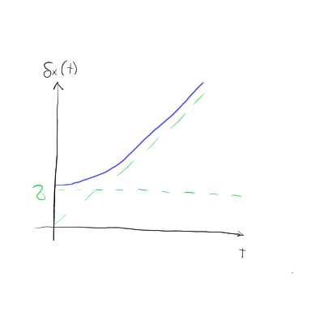

#+title: 5. vaje iz Kvantne mehanike
#+startup: nolatexpreview
#+startup: entitiespretty nil
#+startup: show2levels
#+latex_header: \usepackage{amsmath} \usepackage{unicode-math} \usepackage{cancel} \usepackage{graphicx}
#+latex_header: \renewcommand{\theta}{\vartheta} \renewcommand{\phi}{\varphi} \renewcommand{\epsilon}{\varepsilon}
#+latex_header: \newcommand{\odv}[1]{\dot{\vec{#1}}} \newcommand{\oddv}[1]{\ddot{\vec{#1}}}
#+latex_header: \newcommand{\rot}{\mathrm{rot}}\newcommand{\dive}{\mathrm{div}} \newcommand{\iu}{\mathrm{i}}
#+latex_header: \newcommand\mapsfrom{\mathrel{\reflectbox{\ensuremath{\mapsto}}}}
* Pričakovane vrednosti in nedoločenosti časa Gaussovega paketa

Pričakovane vrednosti kraja in gibalne količine od prejšnje ure so

\begin{align*}
  \left\langle x, t \right\rangle &= \frac{t}{m} \left\langle p, 0 \right\rangle + \left\langle x, 0 \right\rangle \\
\left\langle x ^2, t  \right\rangle &= \frac{t ^2}{m ^2} \left\langle p ^2, 0 \right\rangle + \frac{t}{m} \left\langle px, 0 \right\rangle + \frac{t}{m} \left\langle xp, 0 \right\rangle - \left\langle x ^2, 0 \right\rangle,
\end{align*}

kjer sta \( \left\langle p ^2, t \right\rangle = \left\langle p ^2, 0 \right\rangle\) in \( \left\langle p, t \right\rangle = \left\langle p, 0 \right\rangle \). Ne vemo, kako bi zapisali člen z \( \left\langle xp + px, 0 \right\rangle \). To težavo bomo razrešili s pomočjo nekaj identitet. Vemo, da velja

\[ \left( xp \right) ^{\dagger} = px
\]

Hkrati velja, da je hermitirana pričakovana vrednost enaka kompleksni vrednosti

\[ \left\langle A ^{\dagger} \right\rangle  = \left\langle \psi \middle| A^{\dagger} \psi \right\rangle = \left\langle A \psi \middle| \psi \right\rangle = \left( \left\langle \psi \middle| A \psi \right\rangle \right)^{\ast} = \left\langle A \right\rangle^{\ast}
\]

Vsota dveh pričakovanih vrednosti pa je vsota posameznih pričakovanih vrednosti in kakor povedano na vajah

\[ \left\langle A  + A ^{\dagger} \right\rangle  = \left\langle A \right\rangle + \left\langle A^{\dagger} \right\rangle = \left\langle A \right\rangle  + \left\langle A \right\rangle^{\ast} = 2 \mathrm{Re} \left\langle A \right\rangle
\]

Naš izraz se tako posodobi v

\begin{equation}
\label{eq:2}
 \delta ^2 x (t) = \left\langle x ^2, t \right\rangle - \left\langle x, t \right\rangle ^2 = \frac{t ^2}{m ^2} \left( \frac{\hbar ^2}{2\sigma} \right) ^2 + \sigma ^2 + \frac{t}{m}2 \left[ \mathrm{Re} \left\langle xp, 0 \right\rangle  - \left\langle p, 0 \right\rangle \left\langle x, 0 \right\rangle\right]
\end{equation}

Za funkcijo

\[ \psi(x, 0) = \frac{1}{\sqrt[4]{2 \pi \sigma ^2}} \exp \left\{ - \frac{(x - \left\langle x \right\rangle) ^2}{4 \pi ^2} \right\} \exp \left\{ \mathrm{i} \frac{\left\langle p \right\rangle}{\hbar} x \right\},
\]

bo njen odvod po \( x \) enak

\begin{equation}
\label{eq:1}
 \frac{\mathrm{d} }{\mathrm{d} x} \psi(x, 0) = \left( \mathrm{i} \frac{\left\langle p \right\rangle}{\hbar} - \frac{2 \left( x - \left\langle x \right\rangle \right)}{4 \sigma ^2} \right) \psi(x, 0).
\end{equation}

Poglejmo si sedaj člen \( \mathrm{Re} \left\langle xp, 0 \right\rangle \):

\[ \mathrm{Re} \left\langle xp, 0 \right\rangle = \left\langle \psi, 0 \middle| xp \middle| \psi, 0 \right\rangle = \int\limits_{-\infty}^{\infty} \psi^{\ast} (x, 0) x \left( - \mathrm{i} \hbar \right) \frac{\mathrm{d} }{\mathrm{d} x} \psi(x, 0) \, \mathrm{d} x = \int\limits_{- \infty}^{\infty} \psi^{\ast} x \left\langle p \right\rangle \psi(x, 0) \, \mathrm{d} x = \left\langle p \right\rangle \left\langle x \right\rangle
\]

Upoštevali smo, kaj je realni del odvoda \ref{eq:1}, ko ga pomnožimo z imaginarno enoto, ki izhaja iz definicija gibalne količine.

V enačbi \ref{eq:2} se stvari v zadnjem oklepaju pokrajšajo. Nedoločenost paketa lahko sedaj izrazimo v odvisnosti od širine paketa \( \sigma \)

\begin{equation}
\label{eq:4}
 \delta x (t) = \sigma \sqrt{1 + \left( \frac{t \hbar}{2m \sigma ^2} \right)}.
\end{equation}

Značilen čas \( t_0 \) je na začetku enak

\[ t_0 = \frac{2m \sigma ^2}{\hbar} = \frac{\hbar}{\frac{\hbar ^2}{2 m \sigma ^2}} = \frac{\hbar}{E_0}
\]

kar smo dobili iz tega, da je \( \delta x(t = 0) = \sigma \). V večini primerov velja, da je velja identiteta \( t_0 \cdot \hbar = E_0 \)

Če se ozremo na enačbo \ref{eq:4} lahko hitro vidimo, da se po za \( t > 0 \), nedoločenost kraja veča. Posledično se veča tudi njun produkt \( \delta x \delta p \), iz česar sledi, da tisto, kar je bilo ob času \( t = 0 \) Gaussov paket, ni več! To spoznanje sledi iz definicije, da za vsak Gaussov paket velja \( \delta x \delta p = \frac{\hbar}{2} \), kar pa potem ne velja več, ampak velja \( \delta x \delta p \ge \frac{\hbar}{2} \).

* Harmonski oscilator
** Teorija

Hamiltonian delca z maso \( m \) v harmonskem oscilatorju se glasi

\[ H = \frac{p ^2}{2m} + \frac{k x ^2}{2} = \hbar \omega \left( a^{\dagger} a + \frac{1}{2} \right), \quad \omega = \sqrt{\frac{k}{m}},
\]

kjer sta \( a \) anihilacijski in \( a^{\dagger} \) kreacijski operator, definirana kot

\[ a = \frac{1}{\sqrt{2}} \left( \frac{x}{x_0} + \mathrm{i} \frac{p}{p_0} \right), \quad a^{\dagger} = \frac{1}{\sqrt{2}} \left( \frac{x}{x_0} - \mathrm{i} \frac{p}{p_0} \right).
\]

V enačbi smo definirali še

\[ x_0 = \sqrt{\frac{\hbar}{m \omega}}, \quad p_0 = \frac{\hbar}{x_0}.
\]

Z anihilacijskim in kreacijski operatorjem lahko tudi izrazimo krajevni operator in operator gibalne količine

\[ x = \frac{x_0}{\sqrt{2}} \left( a + a^{\dagger} \right), \quad p = \frac{p_0}{\sqrt{2} \mathrm{i}} \left( a - a^{\dagger} \right).
\]

Pomembna informacija je tudi to, da operatorja \( a \) in \( a^{\dagger} \) ne komutirata, saj velja

\[ \left[ a, a^{\dagger} \right] = 1
\]

Lastna stanja harmonskega oscilatorja so

\[ H \left| n \right\rangle = \hbar \omega \left( n + \frac{1}{2} \right) \left| n \right\rangle, \ n = 0,1 ,2 , \ldots.
\]

Anihlilacijski in kreacijski operator imata naslednji učinek na lastna stanja Hamiltoniana

\[ a \left| n \right\rangle  = \sqrt{n} \left| n - 1 \right\rangle, \quad a ^{\dagger} \left| n \right\rangle = \sqrt{n + 1} \left| n + 1 \right\rangle
\]

Operator \( a^{\dagger} a \), ki deluje na lastno stanje \( \left| n \right\rangle \), bo razkril indeks tega stanja, saj

\[ a ^{\dagger} a \left| n \right\rangle = n \left| n \right\rangle
\]
* Časovni razvoj delca v harmonskem oscilatorju

#+begin_problem
Imamo funkcijo delca v harmoničnem oscilatorju

\[ \left| \psi, 0  \right\rangle = \frac{1}{\sqrt{2}} \left| 0 \right\rangle + \frac{\mathrm{i}}{\sqrt{2}} \left| 1 \right\rangle
\]

Zanimajo nas časovni razvoji \( \left\langle x, t \right\rangle, \left\langle p, t \right\rangle \)  in nedoločenosti \( \delta x(t), \delta p (t) \).
#+end_problem

Nalogo bomo rešili najprej v Schrödingerjevi sliki, kjer funkcijo pomnožimo s časovnim faktorjem. Energije v eksponentu nadomestimo z energijami harmonskega oscilatorja \( E_0 = \frac{\hbar \omega}{2} \) ter \( E_1 = \frac{3}{2}\hbar \omega \)

\[ \left| \psi, t \right\rangle  = \frac{1}{\sqrt{2}} \exp \left\{ - \mathrm{i}\frac{E_0 t}{\hbar} \right\} + \mathrm{i} \frac{1}{\sqrt{2}} \exp \left\{ \mathrm{i} \frac{E_1 t}{\hbar} \right\} = \frac{1}{\sqrt{2}} \exp \left\{ - \mathrm{i} \frac{\omega t}{2} \right\} + \frac{\mathrm{i}}{\sqrt{2}} \exp \left\{ - \mathrm{i} \frac{3 \omega t}{2} \right\}
\]

Pričakovana vrednost kraja je ob upoštevanju, da je operator kraja zapisan z anihilacijskim in kreacijskim faktorjem enak \( x = \frac{x_0}{\sqrt{2}} \left( a + a^{\dagger} \right) \).

\[ \left\langle x, t \right\rangle = \left\langle \psi, t \middle| x \middle| \psi, t \right\rangle = \left\langle \psi, t \middle| \frac{x_0}{\sqrt{2}} \middle| \psi, t \right\rangle= \frac{x_0}{\sqrt{2}} \mathrm{Re} \left\langle a, t \right\rangle.
\]

Del z realno vrednostjo smo izpeljali prejšnji teden na vajah. Pričakovana vrednost za gibalno količine pa je z upoštevanjem identitete \( p = \frac{p_0}{\sqrt{2} \mathrm{i}} (a - a^{\dagger}) \) enaka

\[ \left\langle p, t \right\rangle  = \frac{p_0}{\sqrt{2} \mathrm{i}} 2 \mathrm{i} \mathrm{Im} \left\langle a, t \right\rangle = \frac{p_0}{\sqrt{2}} 2 \mathrm{Im} \left\langle a, t \right\rangle.
\]

Vse, kar nam sedaj ostane je to, da najdemo časovni razvoj pričakovane vrednosti anihilacijskega operatorja

\[ \left\langle a, t \right\rangle = \left\langle \psi, t  \middle| a \middle| \psi, t \right\rangle = \left\langle \psi, t \middle| \left( \frac{1}{\sqrt{2}} \exp \left\{ - \mathrm{i} \frac{\omega t}{2} \right\} a \left| 0 \right\rangle + \frac{\mathrm{i}}{\sqrt{2}} \exp \left\{ - \mathrm{i} \frac{3 \omega t}{2} \right\} a \left| 1 \right\rangle\right) \right\rangle
\]

Po definiciji anihilacijskega operatorja, izniči osnovno stanje \( a \left| 0 \right\rangle = 0 \) in spremeni prvo stanje v osnovno stanje \( a \left| 1 \right\rangle = \left| 0 \right\rangle\). Časovni razvoj anihilacijskega operatorja

\begin{equation}
\label{eq:5}
\begin{aligned}
 \left\langle a, t \right\rangle &=  \left( \frac{1}{\sqrt{2}} \exp \left\{ \mathrm{i} \frac{\omega t}{2} \right\} - \frac{\mathrm{i}}{\sqrt{2}} \exp \left\{ \mathrm{i} \frac{3}{2} \omega t \right\} \left\langle 1 \right|  \right) \left( \frac{\mathrm{i}}{\sqrt{2}} \exp \left\{ - \mathrm{i} \frac{3 \omega t}{2} \right\} \left| 0 \right\rangle \right) \\
&= \mathrm{i} \frac{1}{2} \exp \left\{ \mathrm{i} \frac{\omega t}{2} - \mathrm{i} \frac{3}{2} \omega t \right\}\\
 &= \frac{\mathrm{i}}{2} \exp \left\{ - \mathrm{i} \omega t \right\} \\
&= \frac{\mathrm{i}}{2} \cos \omega t + \frac{1}{2} \sin \omega t
\end{aligned}
\end{equation}

Iz tega zaključimo

\begin{equation}
\label{eq:7}
 \left\langle x,t  \right\rangle = \frac{x_0}{\sqrt{2}} \sin \omega t, \quad \left\langle p, t \right\rangle = \frac{p_0}{\sqrt{2}} \cos \omega t.
\end{equation}

Prav tako lahko preverimo veljavnost Ehrenfestovega teorema za poljubni operator \( A \)

\[ \frac{\mathrm{d} }{\mathrm{d} t} \left\langle A, t \right\rangle = \frac{\mathrm{i}}{\hbar} \left\langle \left[ H, A \right], t \right\rangle
\]

Z upoštevanjem identitete \( \left[ AB, C \right] = A \left[ B, C \right] + \left[ A, C \right] B \), je komutacija operatorjev Hamiltoniana in gibalne količine

\[ \left[ H, p \right] = \left[ \frac{p ^2}{2m} + \frac{1}{2} k x ^2, p \right] = \frac{1}{2}k \left[ x ^2, p \right] = \frac{1}{2} k \left( x \left[ x, p \right] x + \left[ x, p \right] x \right) = k \mathrm{i} \hbar x
\]

Velja torej

\[ \frac{\mathrm{d} }{\mathrm{d} t} \left\langle x, t \right\rangle = \frac{\left\langle p, t \right\rangle}{m}, \quad \frac{\mathrm{d} }{\mathrm{d} t} \left\langle p, t \right\rangle = - k \left\langle x, t \right\rangle.
\]

Izračunajmo sedaj za naš specifičen primer časovna razvoja pričakovanih vrednosti kraja in gibalne količine. Upoštevali bomo definicije iz teoretičnega dela, da \( x_0 = \sqrt{ \frac{\hbar}{m \omega}} \) in \( p_0 = \frac{\hbar}{x_0} \).

\begin{align*}
  \frac{\mathrm{d} }{\mathrm{d} t} \left\langle x, t \right\rangle &= \frac{\mathrm{d} }{\mathrm{d} t} \left( \frac{x_0}{\sqrt{2}} \sin \omega t \right) \\
&= + \frac{\omega x_0}{\sqrt{2}} \cos \omega t \\
&= \frac{p_0 \omega}{\sqrt{2}} \left( \frac{x_0}{p_0} \cos \omega t \right) && p_0 = \frac{\hbar}{x_0} \\
&= \frac{p_0 \omega}{\sqrt{2}} \left( \frac{x_0 ^2}{\hbar} \cos \omega t \right)  && x_0 ^2 = \frac{\hbar}{m \omega}\\
&= \frac{p_0 \omega}{\sqrt{2}} \left( \frac{\hbar}{m \omega} \frac{1}{\hbar} \cos \omega t \right) = \frac{\left\langle p, t \right\rangle}{m}
\end{align*}

** Heisenbergova slika

Izraza za \( \left\langle x, t \right\rangle \) in \( \left\langle p, t \right\rangle \) v Heisenbergovi sliki sta

\[ \left\langle x, t \right\rangle  = \sqrt{2} x_0 \mathrm{Re} \left\langle a, t \right\rangle \quad \left\langle p, t \right\rangle = \sqrt{2} p_0 \mathrm{Im} \left\langle a, t \right\rangle.
\]

Preko Ehrenfestovega teorema izpeljemo

\[ \frac{\mathrm{d} }{\mathrm{d} t} a(t) = \frac{\mathrm{i}}{\hbar} \left[ H, a \right] (t) = - \mathrm{i} \omega a(t),
\]

kjer velja

\[ \left[ H, a \right]= \hbar \omega \left[ a^{\dagger} a + \frac{1}{2}, a \right] = \hbar \omega \left( a^{\dagger}\left[ a, a\right] + \left[ a ^{\dagger}, a \right] a \right) = - \hbar \omega a
\]

Z začetnim pogojem \( a(0) = 0 \) in \( \left\langle a, t \right\rangle  = \left\langle a(t), 0 \right\rangle\), po integraciji dobimo

\[ a(t) = C \exp \left\{ -\mathrm{i} \omega t \right\} \implies a(t) = a e^{- \mathrm{i} \omega t}.
\]

Zgornji izraz dodamo k uporabnim enačbam.

Vrnimo se nazaj k \( \left\langle x, t \right\rangle \).

\[ \sqrt{2} x_0 \mathrm{Re} \left\langle a e^{- \mathrm{i} \omega t}, 0 \right\rangle  = \sqrt{2} x_0 \mathrm{Re} \left\langle e^{- \mathrm{i} \omega t} \left\langle a, 0 \right\rangle \right\rangle
\]

Heisenbergov formalizem drži v splošnem za poljubno funkcijo \( \psi(t) \), kar je precej močno. Vstavimo notri našo funkcijo \( \left| \psi, 0 \right\rangle \) in dobimo enakost Schrödingerjevi sliki.
** Nedoločenosti stanja

Računajmo še nedoločenost \( \delta x(t) \) in \( \delta p (t) \). Izhajamo iz njune definicije

\[ \delta ^2 i (t) = \left\langle i ^2, t \right\rangle - \left\langle i, t \right\rangle ^2, \ i = x, p
\]

Z upoštevanjem \( x = \frac{x_0}{\sqrt{2}} \left( a + a^{\dagger} \right) \), dobimo

\[ \left\langle x^2, t \right\rangle  = \frac{x_0 ^2}{2} \left\langle \left( a + a^{\dagger} \right) ^2, t \right\rangle = \frac{x_0 ^2}{2} \left\langle a ^2 + a a^{\dagger} + a^{\dagger} a + a^{\dagger2}, t \right\rangle
\]

Tako smo zapisali, saj operatorja \( a \) in \( a^{\dagger} \) ne komutirata.

Upoštevamo, da sta \( a ^2 \) in \( a ^{\dagger2} \) hermitsko adjungirana, kar pomeni, da bo njuna vsota enaka \( 2 \mathrm{Re} \left\langle a ^2, t \right\rangle \). Hkrati pa upoštevamo še identiteto

\[ \left[ a, a^{\dagger} \right] = 1 = a a ^{\dagger} - a^{\dagger} a \implies a a^{\dagger} = 1 + a^{\dagger} a
\]

Torej

\[ \left\langle x ^2, t \right\rangle = \frac{x_0 ^2}{2} \left( 2 \mathrm{Re} \left\langle a ^2, t \right\rangle  + 2 \left\langle a ^{\dagger} a, t \right\rangle + 1\right).
\]

Analogno je tudi za gibalno količino

\[ \left\langle p ^2, t \right\rangle = - \frac{p_0 ^2}{2} \left( 2 \mathrm{Re} \left\langle a ^2, t \right\rangle  - 2 \left\langle a^{\dagger} a, t \right\rangle - 1\right)
\]

Nadaljujemo z računanjem v Heisenbergovi sliki. Zapis je

\begin{equation}
\label{eq:3}
 \left\langle x ^2, t \right\rangle = \frac{x_0 ^2}{2} \left( 2 \mathrm{Re} \left\langle a ^2, t \right\rangle + 2 \left\langle a ^{\dagger} a, t \right\rangle + 1\right)
\end{equation}

Uporabimo identitete izpeljane na prejšnjih vajah \( (AB) (t) = A(t) B(t) \) in \( A^{\dagger}(t) = \left( A(t) \right)^{\dagger} \). Upoštevamo \( a (t) = a e^{- \mathrm{i} \omega t} \) in torej bo njegov kvadrat

\begin{equation}
\label{eq:6}
 a ^2 (t) = \left( a (t) \right) ^2 = a ^2 e^{- \mathrm{i} 2 \omega t}.
\end{equation}

Torej bo po \ref{eq:5} z upoštevanjem \ref{eq:6} pričakovana vrednost

\[ \left\langle a ^2, t \right\rangle = \left\langle \psi, t \right| \left( \frac{1}{\sqrt{2}} \exp \left\{ -\mathrm{i} \frac{\omega}{2} t  \right\}a ^2 \left| 0 \right\rangle + \frac{1}{\sqrt{2}} \exp \left\{ - \mathrm{i} \frac{3 \omega}{2} t \right\}a ^2 \left| 1 \right\rangle\right)
\]

Velja

\[ a ^2 \left| 0 \right\rangle = a \left(a \left| 0 \right\rangle\right) = 0, \quad a ^2 \left| 1 \right\rangle = a \left( a \left| 1 \right\rangle \right) = a \left| 0 \right\rangle = 0,
\]

iz česar sledi

\[ \left\langle a ^2, t \right\rangle  = \left\langle \psi, t \right| \cdot 0 = 0.
\]

Hkrati pa tudi

\[ \left( a ^{\dagger} a \right)(t) = a^{\dagger} (t) a(t) = \left( a(t) \right)^{\dagger} a(t) = \left( a e^{- \mathrm{i} \omega t} \right) a e^{- \mathrm{i} \omega t} = a ^{\dagger} a.
\]

Pričakovana vrednost je

\begin{align*}
 \left\langle a^{\dagger} a, t \right\rangle &= \left\langle \psi, t \right| \left( \frac{1}{\sqrt{2}} \exp \left\{ - \mathrm{i} \frac{\omega}{2} t \right\} a^{\dagger} a \left| 0 \right\rangle + \frac{1}{\sqrt{2}} \exp \left\{ - \mathrm{i} \frac{3 \omega}{2}t \right\} a ^{\dagger} a \left| 1 \right\rangle\right) \\
&= \left\langle \psi, t \middle| \frac{1}{\sqrt{2}} \exp \left\{ - \mathrm{i} \frac{3 \omega}{2} t \right\} \middle| \right\rangle \\
&= \left( \frac{1}{\sqrt{2}} \exp \left\{ \mathrm{i} \frac{\omega}{2}t \right\} \left\langle 0 \right| + \frac{1}{\sqrt{2}} \exp \left\{ \mathrm{i} \frac{3 \omega}{2} t \right\} \left\langle 1 \right|\right) \frac{1}{\sqrt{2}} \exp \left\{ - \mathrm{i} \frac{3 \omega}{2} t \right\} \left| 1 \right\rangle = \frac{1}{2}
\end{align*}

Enačba \ref{eq:3} postane

\[ \left\langle x ^2, t \right\rangle = \frac{x_0 ^2}{2} \left( 2 \mathrm{Re} \left( e^{- \mathrm{i} 2 \omega t} \left\langle a ^2, 0 \right\rangle \right) + 2 \left\langle a ^{\dagger} a, 0 \right\rangle + 1\right) = \frac{x_0 ^2}{2} \left( 0 + 2 \cdot \frac{1}{2} + 1  \right) = x_0 ^2
\]

Ponovno, analogno,

\[ \left\langle p ^2, t \right\rangle = p_0 ^2 \left( - \mathrm{Re} \left\langle a ^2, 0 \right\rangle + \left\langle a^{\dagger} a, 0 \right\rangle\right) = p_0 \left( 0 + \left\langle a^{\dagger} a \right\rangle  + \frac{1}{2} \right) = p_0 ^2.
\]

Sedaj imamo skupaj z enačbo \ref{eq:7} vse koščke sestavljanke, da izračunamo nedoločenosti:

\begin{align*}
\delta x ^2 &= \left\langle x ^2, t \right\rangle - \left\langle x, t \right\rangle ^2 = x_0 ^2 + \frac{x_0 ^2}{2} \cos ^2 \omega t = x_0 \left( 1 - \frac{\cos ^2 \omega t }{2} \right)
\delta p ^2 &= \left\langle p ^2, t \right\rangle - \left\langle p, t \right\rangle ^2 = p_0 ^2 + \frac{p_0 ^2}{2} \sin ^2 \omega t = p_0 \left( 1 - \frac{\sin ^2 \omega t }{2} \right)
\end{align*}

Njun produkt pa je enak

\begin{align*}
 \delta x (t) \delta p(t) &= x_0 p_0 \sqrt{\left( 1 - \frac{\cos ^2 \omega t}{2} \right)\left( 1 - \frac{\sin ^2 \omega t}{2} \right)}  \\
&= \hbar \sqrt{\frac{1}{2} + \frac{1}{4} \sin ^2 \omega t \cos ^2 \omega t} \\
&= \hbar \sqrt{\frac{1}{2} + \frac{1}{16} \sin ^2 2 \omega t}
\end{align*}

Nedoločenost bo nihala skozi čas med minimumom, ki je \( \frac{\hbar}{2} \) ter maksimum \( \frac{3 \hbar}{4} \).
