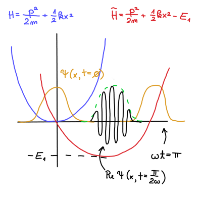

#+title: 7. vaje iz Kvantne mehanike
#+startup: nolatexpreview
#+startup: entitiespretty nil
#+startup: show2levels
#+latex_header: \usepackage{amsmath} \usepackage{unicode-math} \usepackage{cancel} \usepackage{graphicx}
#+latex_header: \renewcommand{\theta}{\vartheta} \renewcommand{\phi}{\varphi} \renewcommand{\epsilon}{\varepsilon}
#+latex_header: \newcommand{\odv}[1]{\dot{\vec{#1}}} \newcommand{\oddv}[1]{\ddot{\vec{#1}}}
#+latex_header: \newcommand{\rot}{\mathrm{rot}}\newcommand{\dive}{\mathrm{div}} \newcommand{\iu}{\mathrm{i}}
#+latex_header: \newcommand\mapsfrom{\mathrel{\reflectbox{\ensuremath{\mapsto}}}}
* Harmonski oscilator v električnem polju

Nadaljujem nalogo od zadnjič. Spomnimo, da je Hamiltonian harmonskega oscilatorja enak

\[ H = \frac{p ^2}{2m} + \frac{1}{2} k x ^2 = \hbar \omega \left( a^{\dagger} a + \frac{1}{2} \right),
\]

kjer sta \( a \) anihilacijski in \( a^{\dagger} \) kreacijski operator definirana kot

\[ a = \frac{1}{\sqrt{2}} \left( \frac{x}{x_0} + \mathrm{i} \frac{p}{p_0} \right), \quad x_0 = \sqrt{\frac{\hbar}{m \omega}} \text{ in } p_0 = \frac{\hbar}{x_0}
\]

Kreacijski in anihilacijski operator ne komutirata, saj velja zveza

\[ \left[ a, a^{\dagger} \right] = 1
\]

Kvadrata pričakovanih vrednosti kraja in gibalne količine sta kot izpeljano na predavanjih

\begin{align} \label{eq:kraj}
  \left\langle x ^2 \right\rangle &= x_0 ^2 \left( \mathrm{Re} \left\langle a ^2 \right\rangle + \left\langle a^{\dagger} a \right\rangle + \frac{1}{2} \right)  \\ \label{eq:gk}
\left\langle p ^2 \right\rangle &= p_0 ^2 \left( - \mathrm{Re} \left\langle a ^2 \right\rangle + \left\langle a^{\dagger} a \right\rangle + \frac{1}{2} \right)
\end{align}

Definirali smo tudi koherentno stanje harmonskega oscilatorja, kjer za \( z \in \mathbb{C} \) velja

\[ a \left| z \right\rangle  = z \left| z \right\rangle
\]

Časovni razvoj začetnega stanja \( \left| \psi, 0 \right\rangle = \left| z \right\rangle\) je enak

\begin{equation}
\label{eq:1}
 \left| \psi, t \right\rangle  = \exp \left\{ - \mathrm{i} \frac{\omega t}{2} \right\} \left| z \exp \left\{ - \mathrm{i} \omega t \right\} \right\rangle = \left| z, t \right\rangle
\end{equation}

Pričakovana vrednost kraja in gibalne količine sta

\[ \left\langle x \right\rangle = \sqrt{2} x_0 \mathrm{Re} z \text{ in } \left\langle p \right\rangle = \sqrt{2} p_0 \mathrm{Im} z
\]

Po času \( t = 0 \) vklopimo električno polje se harmonski oscilator modificira v

\[ \tilde{H} = \frac{\tilde{p} ^2}{2m} + \frac{1}{2} k x ^2 - E_1,
\]

kjer velja \( \tilde{x} = x - x_1 \) in \( \tilde{p} = p \). \( x_1 \) je definiran iz klasičnega harmonskega oscilatorja in je enak \( x_1 = \frac{e \epsilon}{k} \). Kreacijski operator novega harmonskega oscilatorja je

\[ \tilde{a} = \frac{1}{\sqrt{2}} \left( \frac{\tilde{x}}{x} + \mathrm{i} \frac{\tilde{p}}{p_0} \right) = a - \frac{x_1}{\sqrt{2} x_0}
\]

Ne moremo zahtevati identičnega začetnega pogoja kot pri klasičnem harmonskem oscilatorju, saj bi kršili Heisenbergov princip nedoločenosti. Namesto tega uporabimo najbližji ekvivalent - osnovne stanje harmonskega oscilatorja pred vklopom električnega polja \( \left| \psi, 0 \right\rangle = \left| 0 \right\rangle \).

Anihilacijski operator \( a \) ima na začetno stanje sledeče učinek

\[ a \left| \psi, 0 \right\rangle  = 0.
\]

Novi anihilacijski operator \( \tilde{a} \) pa modificira začetno stanje v

\[\tilde{a} \left| \psi, 0 \right\rangle = - \frac{x_1}{\sqrt{2}x_0} \left| \psi, 0 \right\rangle.
\]

Označimo torej

\[ \left|\psi, 0 \right\rangle  = \left| z \right\rangle; \quad z = - \frac{x_1}{\sqrt{2}x_0}
\]

Iz definicij \ref{eq:kraj} in \ref{eq:gk} želimo priti do njunih vrednosti, ko je vključeno električno polje.

\begin{align}
  \left\langle x ^2 \right\rangle &= x_0 ^2 \left( \mathrm{Re} \left\langle a ^2 \right\rangle + \left\langle a^{\dagger} a \right\rangle + \frac{1}{2} \right) \\
&= x_0 ^2 \left( \mathrm{Re} z ^2 + z ^{\ast} z + \frac{1}{2} \right) \\
\left\langle p ^2 \right\rangle &= p_0 ^2 \left( - \mathrm{Re} \left\langle a ^2 \right\rangle + \left\langle a^{\dagger} a \right\rangle + \frac{1}{2} \right) \\
&= p_0 ^2 \left( - \mathrm{Re} z ^2 + z^{\ast} z + \frac{1}{2} \right)
\end{align}

Nedoločenost kraja je po definiciji \( \delta ^2 x = \left\langle x ^2 \right\rangle - \left\langle x \right\rangle ^2\). Upoštevamo zgoraj izpeljane količine, da dobimo

\begin{align*}
\delta ^2 x &= \left\langle x ^2  \right\rangle- \left\langle x  \right\rangle ^2 = x_0 ^2 \left( \mathrm{Re}  z ^2 + z^{\ast} z ++ \frac{1}{2} \right) - 2x_0 ^2 \mathrm{Re}  z  ^2 \\
&= x_0 ^2 \left( \frac{z^{\ast 2}+ z ^2}{2} + z^{\ast} z + \frac{1}{2} \right) - 2 x_0 \frac{z^{\ast 2} + 2 z^{\ast} z + z ^2}{2} \\
&= \frac{1}{2} x_0 ^2
\end{align*}

Upoštevali smo identiteto

\[ \mathrm{Re} z ^2 = \frac{z ^2 + z^{\ast 2}}{2}.
\]

Podobno identiteto

\[ \mathrm{Im} z ^2 = \frac{z ^2 - z ^{\ast 2}}{2}
\]

uporabimo, da dobimo nedoločenost gibalne količine

\[ \delta ^2 p = \frac{p_0 ^2}{2}.
\]

Nedoločenost tega stanja je enostavno Gaussov valovni paket, saj \( \delta x \delta p = \frac{\hbar}{2} \). Gaussov valovni paket je sedaj

\[ \psi_z (x) = \frac{1}{\sqrt[4]{\pi x_0 ^2}} \exp \left\{ - \frac{\left( x - \sqrt{2} x_0 \mathrm{Re} z \right) ^2}{2x_0 ^2} \right\} \exp \left\{ \mathrm{i} \frac{\sqrt{2} p_0 \mathrm{Im} z}{\hbar} x \right\}.
\]

Ta valovni paket ima en parameter manj (\( s \)), kakor tisti, ki smo ga že izpeljali na predavanjih.

Pričakovani vrednosti Hamiltoniana in kvadrata Hamiltoniana sta

\[ \left\langle H \right\rangle= \hbar \omega \left( z^{\ast} z + \frac{1}{2}  \right)
\]

ter

\begin{align*}
 \left\langle H ^2 \right\rangle &= \left\langle \hbar ^2 \omega ^2 \left( z^{\ast} z + \frac{1}{2} \right) ^2 \right\rangle
\end{align*}

[dopolni, str. 42]

pri računanju smo morali biti biti pozorni na vrstni red operacij (oz. nekomutacijo).

Z danim začetnim stanjem \( \left| \psi, 0 \right\rangle = \left| z \right\rangle \) bi radi izračunali časovni razvoj za nov Hamiltonian z vklopljenim električnim poljem. Upoštevamo \ref{eq:1}, kjer dodamo faktor, za koliko je začetno stanje nižje (\( E_1 \)) od navadnega Hamiltoniana.

\[ \left| \psi, t \right\rangle  = \exp \left\{ - \frac{\mathrm{i} \omega t}{2} \right\} \left| z \exp \left\{ - \mathrm{i} \omega t \right\} \right\rangle \exp \left\{ - \mathrm{i} \frac{E_1}{\hbar}t \right\}
\]

Ta novi faktor nima vpliva pri opazljivkah, saj se pri računanju faktor odšteje s svojo konjugirano vrednostjo iz bra-ja.

Časovna odvisnost pričakovane vrednosti kraja je

\begin{align*}
  \left\langle x, t \right\rangle &= \left\langle \tilde{x}, t \right\rangle + x_1 = \sqrt{2} x_0 \mathrm{Re} \left( z \exp \left\{ - \mathrm{i} \omega t \right\} \right) + x_1 \\
&= \sqrt{2} x_0 \frac{x_1}{\sqrt{2} x_0} \mathrm{Re} \left( \exp \left\{ - \mathrm{i} \omega t \right\} \right) + x_1 \\
&= x_1 \left( 1 - \cos (\omega t) \right)
\end{align*}

Vidimo, da smo dobili enak rezultat kot pri klasičnem harmonskem oscilatorju v električnem polju.

Naš harmonski oscilator ima vedno obliko Gaussovega paketa, vendar je samo v skrajnih lega dejanski valovni paket. V vmesnih stanjih valovanje valovne funkcije tvori ovojnico Gaussovega paketa. Glej priloženo sliko

Pri fazi \( \omega t = \frac{\pi}{2} \) je \( z = - \mathrm{i} \frac{x_1}{\sqrt{2} x_0} \in \mathrm{i} \mathbb{R} \). Pri fazi \( \omega t = \pi \) pa je \( z = \frac{x_1}{\sqrt{2} x_0} \in \mathbb{R} \).
* Dvodimenzionalni harmonski oscilator :2_kolokvij_snov:
** Teorija

Imamo dvodimenzionalni Hamiltonian s harmonskim potencialom

\[ H = \frac{p_x ^2}{2m} + \frac{p_y ^2}{2m} + \frac{1}{2} k_x x ^2 + \frac{1}{2} k_y y ^2 = H_x + H_y,
\]

kjer velja

\[ H_i = \frac{p_i ^2}{2m} + \frac{1}{2} k_i i ^2, \quad i= x, y.
\]

Zanimajo nas lastna stanja in lastne energije za tak harmonski oscilator.

Za posamezno dimenzijo velja

\begin{align*}
  H_x \psi_x (x) &= E_x \psi_x (x) \\
H_y \psi_y (y) &= E_y \psi_y (y).
\end{align*}

Zanima pa nas celoten Hamiltonian

\[ H \psi(x, y) = E \psi(x, y).
\]

Od prej vemo, da velja potem enakost za lastna stanja

\[ \psi(x, y) = \psi_x (x) \psi_y (y)
\]

ter za lastne energije

\begin{equation}
\label{eq:2}
E = E_x + E_y.
\end{equation}

Lastne energije harmonskega oscilatorja so ob upoštevanju enodimenzionalnih harmonskih oscilatorjev enake

\[ E = \hbar \omega_x \left( n_x + \frac{1}{2} \right) + \hbar \omega_y \left( n_y + \frac{1}{2} \right), \quad \omega_i = \sqrt{\frac{k_i}{m}}
\]

V Diracovem zapisu bomo Schrödingerjevo enačbo zapiše kot

\begin{equation}
\label{eq:3}
 H \left| n_x \right\rangle  \left| n_y \right\rangle = E \left| n_x \right\rangle \left| n_y \right\rangle.
\end{equation}

Harmonska oscilatorja v \( x \) in \( y \) komponenti sta vsak v svojem Hilbertovem prostoru. Harmonski oscilator v dveh dimenzijah je večji Hilbertov prostor, katerega baza je sestavljena iz harmonskih oscilatorjev posameznih komponent. Krajše enačbo zapišemo kot

\[ H \left| n_x n_y \right\rangle = E \left| n_x n_y \right\rangle
\]
*** Posebni primeri

Opazujemo primer, ko \( k_x > 0 \) in \( k_y = 0 \).

Lastna funkcija Hamiltoniana v \( y \) koordinati je samo ravni val \( \psi_y (y) = \exp \left\{ \mathrm{i} q y \right\} \). Energija tega stanja je energija ravnega vala \( E_y = \frac{\hbar ^2 q ^2}{2m} \), energija dvodimenzionalnega Hamiltoniana pa je

\[ E = \hbar \omega_x  \left( n_x + \frac{1}{2} \right) + \frac{\hbar ^2 q ^2}{2m}
\]

Drugi poseben primer je \( k_x = k_y = k \) oz. z drugimi besedami je to izotropen dvodimenzionalni harmonski oscilator. Hamiltonian je tako oblike

\[ H_0 = \frac{p ^2}{2m} + \frac{1}{2} k r ^2, \quad r ^2 = x ^2 + y ^2
\]

Ker sta valovna vektorja enaka, je tudi frekvenca enaka, torej bo energija

\[ E = \hbar \omega \left( n_x + n_y + 1 \right)
\]

Osnovno stanje takega harmonskega oscilatorja je pri \( n_x = n_y = 0 \), in stacionarna Schrödingerjeva enačba je

\[ H \left| 0, 0 \right\rangle = \hbar \omega \left| 0, 0 \right\rangle
\]

Prvi vzbujeni stanji sta

\[ H \left| 1, 0 \right\rangle = 2 \hbar \omega \left| 1, 0 \right\rangle \text{ in } H \left| 0, 1 \right\rangle = 2 \hbar \omega \left| 0, 1 \right\rangle,
\]

torej je dvakrat degenerirano. Rešitev tega stanja je tudi linearna kombinacija teh dveh vzbujeni stanj

\[ H \left( \alpha \left| 1, 0 \right\rangle + \beta \left| 0, 1 \right\rangle\right) = 2 \hbar \omega \left( \alpha \left| 1, 0 \right\rangle + \beta \left| 0, 1 \right\rangle\right), \ \alpha, \beta \in \mathbb{C}
\]
*** Vrtilna količina \( z \)

Hamiltonianu dodamo člen \( \lambda L_z \), da ima obliko

\[ H = \frac{p ^2}{2m} + \frac{1}{2} k r ^2 + \lambda L_z = H_0 + \lambda L_z, \ L_z = xp_y - y p_x = - \mathrm{i} \hbar \frac{\partial }{\partial \phi}.
\]

Zanima nas, kako ta novi člen vpliva na lastna stanja in lastne energije našega problema.

Operator gibalne količine v cilindričnih koordinatah je

\[ \frac{p ^2}{2m} = - \frac{\hbar ^2}{2m} \nabla ^2 = - \frac{\hbar ^2}{2m} \left( \frac{1}{r} \frac{\partial }{\partial r}  \left( r \frac{\partial }{\partial r}  \right) + \frac{1}{r ^2} \frac{\partial ^2 }{\partial \phi ^2}  \right)
\]

Operatorja \( H_0 \) in \( L_z \) komutirata

\begin{align*}
  \left[ H_0, L_z \right] &= 0
\end{align*}

[dopolni]

Naj bo \( F(\phi) \) lastna funkcija \( L_z \). Potem velja

\[ L_z F(\phi) = \lambda F(\phi)
\]

Rešujemo torej diferencialno enačbo

\[ - \mathrm{i} \hbar \frac{\partial }{\partial \phi}  F(\phi) = \lambda F(\phi),
\]

katere rešitev je

\[ F = A \exp \left\{ - \frac{\lambda}{\mathrm{i} \hbar} \phi \right\}.
\]

Zahtevamo periodičnost \( F(\phi + 2 \pi) = F(\phi) \), iz česar sledi enačba

\[ A \exp \left\{ - \frac{\lambda}{\mathrm{i} \hbar} \phi \right\} = A \exp \left\{ \mathrm{i} m \phi \right\},
\]

in nato enakost \( \lambda= \hbar m \).

Konstanto \( A \) določimo iz normiranosti

\[ \int\limits_0^{2\pi} \left| F(\phi) \right|  ^2 \, \mathrm{d} \phi = 1 \implies \ A = \frac{1}{\sqrt{2\pi}}
\]

Torej je lastna funkcija operatorja \( L_z \)

\begin{equation}
\label{eq:4}
F_m (\phi) = \frac{1}{\sqrt{2\pi}} e^{\mathrm{i} m \phi}, \ m \in \mathbb{Z},
\end{equation}

enačba pa se glasi

\[ L_z F_m(\phi) = \hbar m F_m (\phi)
\]
** Naloga

Opazujemo Harmonski oscilator v prvem vzbujenem stanju \( E = 2 \hbar \omega \). Vzbujena stanja sta

\begin{align*}
  \psi_{10} (x, y) &= \psi_1 (x) \psi_0 (y) = \left| 1, 0 \right\rangle \\
\psi_{01}(x, y) &= \psi_0 (x) \psi_1 (y) = \left| 0, 1 \right\rangle
\end{align*}

Iz prejšnje naloge vemo, da so lastne funkcije koherentnih stanj Gaussovi paketi. Če je koherentno stanje \( z = 0 \), potem \( \left\langle x \right\rangle = 0 \) in \( \left\langle p \right\rangle = 0 \), iz česar sledi

\[ \psi_0 (x) = \frac{1}{\sqrt[4]{\pi x_0 ^2}} \exp \left\{ - \frac{x ^2}{2x_0 ^2} \right\}
\]

Zaradi kreacijskega faktorja vemo, da velja

\[ a ^{\dagger} \psi_0 (x) = 1 \cdot \psi_1 (x)
\]

Upoštevajoč definicijo kreacijskega faktorja in Gaussovega valovnega paketa.
