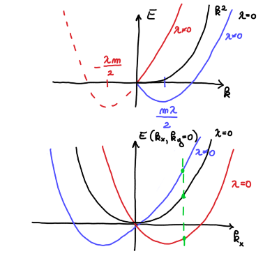
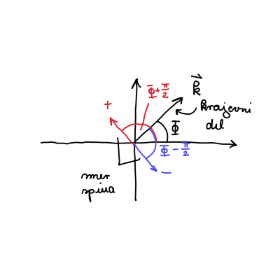
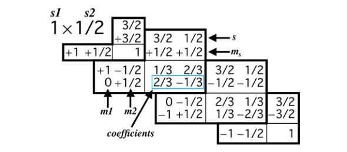

#+title: 9. vaje iz Kvantne mehanike
#+startup: nolatexpreview
#+startup: entitiespretty nil
#+startup: show2levels
#+latex_header: \usepackage{amsmath} \usepackage{unicode-math} \usepackage{cancel} \usepackage{graphicx}
#+latex_header: \renewcommand{\theta}{\vartheta} \renewcommand{\phi}{\varphi} \renewcommand{\epsilon}{\varepsilon}
#+latex_header: \newcommand{\odv}[1]{\dot{\vec{#1}}} \newcommand{\oddv}[1]{\ddot{\vec{#1}}}
#+latex_header: \newcommand{\rot}{\mathrm{rot}}\newcommand{\dive}{\mathrm{div}} \newcommand{\iu}{\mathrm{i}}
#+latex_header: \newcommand\mapsfrom{\mathrel{\reflectbox{\ensuremath{\mapsto}}}}
* Rashbova sklopitev

#+begin_problem
Obravnavajmo delec v dvodimenzionalni \( x, y \) ravnini s spinom \( S = \frac{1}{2} \) in Hamiltonianom

\[ H = \frac{p ^2}{2m} + \lambda \left( p_x S_y - p_y S_x \right),
\]

kjer sta \( \vec{p} = (p_x, p_y, 0) \) in \( \vec{S} = (S_x, S_y, 0) \) gibalna količina in spin operatorja. \( \lambda \) je konstantna. Iščemo lastne vrednosti in funkcije Hamiltoniana \( H \).
#+end_problem

Matematično je spinska vrtilna količina identitična tirni vrtilni količini. Zanjo veljajo tudi enake relacije, čeprav ima fizikalno drugačen pomen.

Hilbertov prostor \( \mathcal{H} \) je tenzorski prostor Hilbertovega prostora krajevnega dela in spinskega dela

\[ \mathcal{H} = \mathcal{H}_r \otimes \mathcal{H}_s.
\]

Valovna funkcija v Hilbertovem prostoru \( \mathcal{H} \) je

\[ \left| \psi  \right\rangle = \left| \psi_r \right\rangle \otimes \left| \psi_2 \right\rangle
\]

Delec s spinom \( S = \frac{1}{2} \) ima valovno funkcijo, ki je linearna kombinacija obeh stanj

\[ \left| \psi_2 \right\rangle = \alpha \left| \frac{1}{2}, \frac{1}{2} \right\rangle + \beta \left| \frac{1}{2}, - \frac{1}{2} \right\rangle,
\]

kjer prvo kvantno število označuje velikost spina \( s= \frac{1}{2} \), druga številka pa projekcijo spina \( m_s \in \left\{ - \frac{1}{2}, \frac{1}{2} \right\} \).

Operator spina \( S ^2 \) deluje na stanje \( \left| s, m_s \right\rangle \)

\begin{equation}
\label{eq:1}
 S ^2 \left| s, m_s \right\rangle = \hbar ^2 s( s + 1 ) \left| s, m_s \right\rangle.
\end{equation}

Učinek operatorja \( S ^2 \) na bazno stanje bo torej po \ref{eq:1}

\[ S ^2 \left| \frac{1}{2}, \frac{1}{2} \right\rangle = \frac{3}{4} \hbar ^2 \left| \frac{1}{2}, \frac{1}{2} \right\rangle, \quad S ^2 \left| \frac{1}{2}, - \frac{1}{2} \right\rangle = \frac{3}{4} \hbar ^2 \left| \frac{1}{2}, - \frac{1}{2} \right\rangle
\]

Operator \( S_z \) pa ima na stanje \( \left| s, m_s \right\rangle \) naslednji učinek

\[ S_z \left| s, m_s \right\rangle = \hbar m \left| s, m_s \right\rangle
\]

\( S_z \) na bazno stanje bo torej povzročilo

\[ S_z \left| \frac{1}{2}, \frac{1}{2} \right\rangle = \frac{\hbar}{2} \left| \frac{1}{2}, \frac{1}{2} \right\rangle, \quad S_z \left| \frac{1}{2}, - \frac{1}{2} \right\rangle = - \left| \frac{1}{2}, - \frac{1}{2} \right\rangle
\]

Za stanja v spinskem prostoru ponavadi uporabimo drugo notacijo. Stanje s spinom navzgor \( \left| \frac{1}{2}, \frac{1}{2} \right\rangle \) označimo z \( \left| \uparrow \right\rangle \), stanje s spinom navzdol pa označimo \( \left| \downarrow \right\rangle \).

Krajevni Hilbertov prostor je neskončno-dimenzionalen, medtem ko spinski del pa je dvodimenzionalen, saj je osnovno stanje predstavljeno z linearno kombinacijo dveh vektorjev.
** Lestvični operatorji spina

Podobno kot pri tirni vrtilni količini lahko definiramo lestvična operatorja, ki nam zvišujeta ali znižujeta dano stanje \( m_s \)

\[ S_{\pm} \left| s, m_s \right\rangle = \hbar \sqrt{s (s+ 1) - m_{s} (m_{s} \pm 1)} \left| s, m_s \pm 1 \right\rangle
\]

Definirana sta kot

\begin{align}
  S_+ &= S_x + \mathrm{i} S_y \label{eq:spinU} \\
S_- &= S_x - \mathrm{i} S_y \label{eq:spinD}
\end{align}

S seštevanjem in odštevanjem enačb lahko izrazimo operatorja \( S_x \) in \( S_y \)

\begin{align}
S_x &= \frac{S_+ + S_-}{2} \label{eq:spinX} \\
S_y &= \frac{S_+ - S_-}{2 \mathrm{i}} \label{eq:spinY}
\end{align}

#+begin_my_example
Kot primer si poglejmo, kako lestvični operatorji vplivajo na stanje s spinom navzgor \( \left| \uparrow \right\rangle \) in navzdol \( \left| \downarrow \right\rangle \).

Operator \( S_+ \) ima na stanji sledeč učinek

\[ S_+ \left| \uparrow \right\rangle = 0 \text{ in } S_+ \left| \downarrow \right\rangle = \left| \uparrow \right\rangle \hbar \sqrt{ \frac{1}{2} \cdot \frac{3}{2} + \frac{1}{2} \cdot \frac{1}{2}} = \hbar \left| \uparrow \right\rangle
\]

Analogno velja tudi

\[ S_- \left| \uparrow \right\rangle = \left| \downarrow \right\rangle \hbar \sqrt{\frac{3}{4} - \frac{1}{2} \left( - \frac{1}{2} \right)} = \hbar \left| \downarrow \right\rangle \text{ in } S_- \left| \downarrow \right\rangle = 0
\]

Z upoštevanjem definiciji \ref{eq:spinX} dobimo

\[ S_x \left| \uparrow \right\rangle = \frac{\hbar}{2} \left| \downarrow \right\rangle \text{ in } S_x \left| \downarrow \right\rangle = \frac{\hbar}{2} \left| \uparrow \right\rangle,
\]

ter analogno

\[ S_y \left| \uparrow \right\rangle  = - \frac{\hbar}{2 \mathrm{i}} \left| \downarrow \right\rangle \text{ in } S_y \left| \downarrow \right\rangle = \frac{\hbar}{2 \mathrm{i}} \left| \uparrow \right\rangle
\]
#+end_my_example

** Reševanje naloge

Lastne funkcije in stanja bomo dobili preko reševanje Schrödingerjeve enačbe

\[ H \left| \psi \right\rangle = E \left| \psi \right\rangle.
\]

Enačbo bomo reševali z nastavkom

\[ \left| \psi \right\rangle = \left| \psi_{\uparrow} \right\rangle \left| \uparrow \right\rangle + \left| \psi_{\downarrow} \right\rangle \left| \downarrow \right\rangle,
\]

kjer iščemo funkciji \( \left| \psi_{\uparrow} \right\rangle \) in \( \left| \psi_{\downarrow} \right\rangle \).

Upoštevamo definicijo Hamiltoniana in nastavek

\[ \left( \frac{p_x ^2 + p_y ^2}{2m} + \lambda \left( p_x S_y - p_y S_x \right)  \right) \left( \left| \psi_{\uparrow}\right\rangle  \left| \uparrow \right\rangle + \left| \psi_{\downarrow} \right\rangle \left| \downarrow \right\rangle \right) = E \left( \left| \psi_{\uparrow}\right\rangle  \left| \uparrow \right\rangle + \left| \psi_{\downarrow} \right\rangle \left| \downarrow \right\rangle \right)
\]

Operatorja gibalne količine delujeta na \( \left| \psi_{\uparrow} \right\rangle \) in \( \left| \psi_{\downarrow} \right\rangle \), medtem ko operatorja spina delujte na \( \left| \uparrow \right\rangle \) ter \( \left| \downarrow \right\rangle \). Za operatorja gibalne količine ne vemo točnega rezultata, kakšen bo učinek.

Našo enačbo pomnožimo in razpišemo

\begin{align*}
   E \left( \left| \psi_{\uparrow}\right\rangle  \left| \uparrow \right\rangle + \left| \psi_{\downarrow} \right\rangle \left| \downarrow \right\rangle \right) = & \frac{1}{2m} \left[ \left| \uparrow \right\rangle \left( p_x ^2 \left| \psi_{\uparrow} \right\rangle + p_y ^2 \left| \psi_{\uparrow} \right\rangle \right) + \left| \downarrow \right\rangle \left( p_x ^2 \left| \psi_{\downarrow} \right\rangle + p_y ^2 \left| \psi_{\downarrow} \right\rangle \right) \right] \\
& + \lambda \left[ p_x \left| \psi_{\uparrow} \right\rangle \cdot \left( - \frac{\hbar}{2 \mathrm{i}} \right)\left| \downarrow \right\rangle + p_x \left| \psi_x \right\rangle \frac{\hbar}{2 \mathrm{i}} \left| \uparrow \right\rangle - p_y \left| \psi_{\uparrow} \right\rangle \frac{\hbar}{2} \left| \downarrow \right\rangle - p_y \left| \psi_{\downarrow} \right\rangle \cdot \frac{\hbar}{2} \left| \uparrow \right\rangle \right]
\end{align*}

Dobljeno pomnožimo z \( \left\langle \uparrow \right| \)

\[ \frac{1}{2m} \left( p_x ^2 \left| \psi_{\uparrow} \right\rangle + p_y ^2 \left| \psi_{\uparrow} \right\rangle \right) + \lambda \left( p_x \left| \psi_{\downarrow}\right\rangle  \cdot \frac{\hbar}{2 \mathrm{i}} - p_y \left| \psi_{\downarrow} \right\rangle \frac{\hbar}{2} \right) = E \cdot \left| \psi_{\uparrow} \right\rangle.
\]

Analogno pomnožimo tudi z \( \left\langle \psi_{\downarrow} \right| \)

\[ \frac{1}{2m} \left( p_x ^2 \left| \psi_{\downarrow} \right\rangle + p_y ^2 \left| \psi_{\downarrow} \right\rangle \right) + \lambda \left( p_x \left| \psi_{\uparrow}\right\rangle  \cdot\left( -  \frac{\hbar}{2 \mathrm{i}}\right) - p_y \left| \psi_{\uparrow} \right\rangle \frac{\hbar}{2} \right) = E \cdot \left| \psi_{\downarrow} \right\rangle.
\]

Dobili smo sistem diferencialnih enačb, ki jih lahko z upoštevanjem definicijo operatorjev zapišemo

\begin{align*}
 -\frac{\hbar ^2}{2m} \nabla ^2 \psi_{\uparrow} \left( \vec{r} \right) + \lambda \left( - \frac{\mathrm{i} \hbar \partial_x \psi_{\downarrow} \hbar}{2 \mathrm{i} } + \mathrm{i} \hbar \partial_y \psi_{\downarrow} \cdot \frac{\hbar}{2} \right) &= E \psi_{\uparrow} \left( \vec{r} \right) \\
 -\frac{\hbar ^2}{2m} \nabla ^2 \psi_{\downarrow} \left( \vec{r} \right) + \lambda \left( \frac{\mathrm{i} \hbar \partial_x \psi_{\uparrow} \hbar}{2 \mathrm{i} } + \mathrm{i} \hbar \partial_y \psi_{\uparrow} \cdot \frac{\hbar}{2} \right) &= E \psi_{\downarrow} \left( \vec{r} \right).
\end{align*}

Ne bomo reševali tega sistema, ampak bomo ubrali lažjo pot, ki vključuje simetrije.

Za začetek bomo dokazali, da velja

\[ \left[ H, \vec{p} \right] = 0.
\]

Za dokaz moramo dokazati, da hamiltonian \( H \) komutira z vsako komponento \( \vec{p} \).

\[ \left[ H, p_x \right] = \left[ \frac{p_x ^2 + p_y ^2}{2m} + \lambda \left( p_x S_y - p_y S_x  \right), p_x \right]
\]

Operatorja \( p_x ^2 \) in \( p_x \) komutirata in prav tako \( p_y ^2 \) in \( p_x \). Poglejmo si še člen Rashbove sklopitve \( \left( p_x S_y - p_y S_x \right) \). \( p_x \) in \( p_y \) komutirata s \( p_x \). Spinska operatorja \( S_{x, y} \) delujeta na Hilbertov prostor \( \mathcal{H}_s \), medtem ko \( p_x \) deluje na Hilbertov prostor \( \mathcal{H}_p \).

Vsak operator iz enega Hilbertovega prostora komutira z vsakim operatorjem iz drugega Hilbertovega prostora. Sledi

\[ \left[ H, p_x \right] = \left[ H, p_y \right] = 0
\]

Za dva operatorja, ki komutirata, lahko najdemo lastne funkcije, ki so hkrati lastne funkcije obeh operatorjev. Z drugimi besedamo, lastne funkcije gibalne količine so prav tako lastne funkcije Hamiltoniana. Velja tudi obratno, vendar je lastne funkcije \( \vec{p} \) lažje najti.

Lastne funkcije gibalne količine operatorja gibalne količine \( \vec{p} = - \mathrm{i} \hbar \nabla \) so rešitve enačbe

\[ \vec{p} \left| \psi_1 \right\rangle = \alpha \left| \psi_1 \right\rangle.
\]

Lastne funkcije gibalne količine so ravni valovni oblike \( e^{\mathrm{i} \vec{k} \cdot \vec{r}} \). V koordinatni reprezentaciji je rešitev

\[ \vec{p} e^{\mathrm{i} \vec{k} \cdot \vec{r}} = - \mathrm{i} \hbar \left( \mathrm{i} \vec{k} \right)e^{\mathrm{i} \vec{k} \cdot \vec{r}} = \hbar \vec{k} e^{\mathrm{i} \vec{k} \cdot \vec{r}}.
\]

Rešitev lahko zapišemo tudi v Diracovem zapisu, kjer je \( \hbar \vec{k} = \hbar \left( k_x, k_y \right) \) kvantno število dane valovne funkcije, saj je presorazmerno z valovno funkcijo

\[ \vec{p} \left| \vec{k} \right\rangle  = \hbar \vec{k} \left| \vec{k} \right\rangle.
\]

Pri reševanju Schrödingerjeve enačbe, kjer nadomestimo \( \left| \psi_p \right\rangle = \left| \vec{k} \right\rangle\).

\[ H \left( \left| \vec{k} \right\rangle \otimes \left| \psi_s \right\rangle\right) = \left( \left| \vec{k} \right\rangle \otimes \left| \psi_s \right\rangle\right).
\]

Preverimo, če ta nastavek res reši našo enačbo, vendar bomo zaradi krajšega zapisali izpuščali tenzorski znak \( \otimes \).

\begin{align*}
  H \left( \left| \vec{k} \left| \psi_s \right\rangle \right\rangle \right) &= \\
\left[ \frac{p ^2}{2m} + \lambda \left( p_x S_y - p_y S_x \right) \right] \left( \left| \vec{k} \right\rangle \left| \psi_s \right\rangle\right) &= \\
\left( \frac{p ^2}{2m} \left| \vec{k} \right\rangle \right) \left| \psi_s \right\rangle  + \lambda \left( p_x \left| \vec{k} \right\rangle S_y \left| \psi_s \right\rangle  - p_y  \left| \vec{k} \right\rangle S_x \left| \psi_s \right\rangle  \right) &= \\
\frac{\hbar ^2 k ^2}{2m} \left| \vec{k} \right\rangle \left| \psi_s   \right\rangle+ \lambda \hbar k_x \left| \vec{k} \right\rangle S_y \left| \psi_s \right\rangle - \lambda \hbar k_y \left| \vec{k} \right\rangle S_x \left| \psi_s \right\rangle &= E \left| \vec{k} \right\rangle \left| \psi_s \right\rangle
\end{align*}

V zgornji enačbi sedaj nastopajo samo števila razen operatorjev \( S_y \) in \( S_x \). Zgornjo enačbo pomnožimo z \( \left\langle \vec{k} \right| \), kar nam poda enačbo, ki se sedaj nahaja zgolj v Hilbertovem prostoru \( \mathcal{H}_s \).

\[ \frac{\hbar ^2 k ^2}{2m} \left| \psi_s \right\rangle + \lambda \hbar \left( k_x S_y - k_y S_x \right) \left| \psi_s \right\rangle = E \left| \psi_s \right\rangle.
\]

Z upoštevanjem rezultatov iz teoretičnega uvoda za funkcijo \( \left| \psi_s \right\rangle = \left( \alpha \left| \uparrow \right\rangle + \beta \left| \downarrow \right\rangle\right)\) dobimo

\[ \frac{h ^2}{2m} \left( \alpha \left| \uparrow \right\rangle + \beta \left| \downarrow \right\rangle\right) + \frac{\lambda \hbar ^2 k_x}{2 \mathrm{i}} \left( - \alpha  \left| \downarrow \right\rangle + \beta \left| \uparrow  \right\rangle\right) - \frac{\lambda \hbar ^2 k_y}{2} \left( \alpha \left| \downarrow \right\rangle + \beta \left| \uparrow \right\rangle\right) = E \left( \alpha \left| \uparrow \right\rangle + \beta \left| \downarrow \right\rangle\right).
\]

Dobljena enačba je sestavljena zgolj iz skalarjev ter dveh linearno neodvisnih stanj \( \left| \uparrow \right\rangle \) in \( \left| \downarrow \right\rangle \).

Dobimo lahko sistem enačb tako, da zgornjo enačbo pomnožimo z \( \left\langle \uparrow \right| \) in \( \left| \downarrow \right\rangle \) in upoštevamo ortogonalnost stanj

\begin{align*}
  \frac{\hbar ^2 k ^2}{2m} \alpha + \frac{\lambda \hbar ^2 k_x}{2 \mathrm{i}} \beta - \frac{\lambda \hbar ^2 k_y}{2} \beta &= E \alpha  \\
\frac{\hbar ^2 k ^2}{2m} \beta - \frac{\lambda \hbar ^2 k_x}{2 \mathrm{i}} \alpha - \frac{\lambda \hbar ^2 k_y}{2} \alpha &= E \beta,
\end{align*}

kjer iščemo vrednosti \( \alpha \) in \( \beta \). Hkrati so nam tudi vrednosti lastnih energij neznane. Drugače povedano, imamo problem lastnih vrednosti za matrični sistem

\begin{equation}
\label{eq:5}
 \begin{bmatrix}
   \frac{\hbar ^2 k ^2}{2m} & \frac{ \lambda\hbar ^2 }{2 \mathrm{i}} \left( k_x - \mathrm{i} k_y \right) \\
    -\frac{\lambda \hbar ^2}{2 \mathrm{i}} \left( k_x + \mathrm{i} k_y \right) & \frac{\hbar ^2 k ^2}{2m}
    \end{bmatrix}  \begin{bmatrix} \alpha \\ \beta \end{bmatrix} = E \begin{bmatrix} \alpha \\ \beta \end{bmatrix}
\end{equation}

Pred nadaljevanjem reševanja problema bomo prepisali vektor \( \vec{k} = (k_x, k_y) \) v polarne koordinate

\[ k_x + \mathrm{i} k_y = k e^{\mathrm{i} \phi} \text{ in } k_x - \mathrm{i} k_y = e^{ -\mathrm{i} k \phi}.
\]

Problem lastnih vrednosti je torej

\[ \begin{bmatrix}
   \frac{\hbar ^2 k ^2}{2m} & \frac{ \lambda\hbar ^2 }{2 \mathrm{i}} ke^{-\mathrm{i} \phi} \\
    -\frac{\lambda \hbar ^2}{2 \mathrm{i}} ke^{\mathrm{i} \phi} & \frac{\hbar ^2 k ^2}{2m}
    \end{bmatrix}  \begin{bmatrix} \alpha \\ \beta \end{bmatrix} = E \begin{bmatrix} \alpha \\ \beta \end{bmatrix}.
\]

Lastne vrednosti dobimo iz karakterističnega polinoma

\begin{equation}
\label{eq:3}
 \det \begin{vmatrix}
      \frac{\hbar ^2 k ^2}{2m} - E & \frac{ \lambda\hbar ^2 }{2 \mathrm{i}} ke^{-\mathrm{i} \phi} \\
         -\frac{\lambda \hbar ^2}{2 \mathrm{i}} ke^{\mathrm{i} \phi} & \frac{\hbar ^2 k ^2}{2m} - E
         \end{vmatrix} = \left( \frac{\hbar ^2 k ^2}{2m} - E \right) ^2 - \left( \frac{\lambda \hbar ^2 k }{2} \right) ^2 = 0.
\end{equation}

Po korenjenju in izražavi \( E \) dobimo

\begin{equation}
\label{eq:2}
 E_{\pm} = \frac{\hbar ^2 k}{2m} \pm \frac{\lambda \hbar ^2 k}{2}.
\end{equation}

Za \( \lambda = 0 \), ko Rashbove sklopitve ni, je energija enaka \( E = \frac{\hbar ^2 k ^2}{2m} \). Dobili smo prost delec, ki je dvakrat degeneriran za vsak \( \vec{k} \).

V primeru \( \lambda \ne 0 \), bomo izraz dopolnili do popolnega kvadrata

\[ E = \frac{\hbar ^2}{2m} \left( k \pm \frac{m \lambda }{2} \right) ^2 - \frac{\hbar ^2 m \lambda ^2}{8}.
\]

Vidimo, da degeneracije v tem primeru ni, saj imamo za stanji \( \pm k \) dve različni energiji \( E_{\pm} \), ki sta premaknjeni za \( \frac{\lambda \hbar ^2 k}{2}\) višje ali nižje od energij dvakrat degeneriranega prostega delca..

V besedišču lastnih stanj in pripadajočih energij pravimo:

Pri \( \lambda = 0 \) imamo poljubno linearno kombinacijo \( \alpha \left| \uparrow \right\rangle + \beta \left| \downarrow \right\rangle \ \forall \alpha, \beta\), ki imajo isto energijo \( \frac{\hbar ^2 k ^2}{2m} \). Drugače zapisano

\[ H \left| \vec{k} \right\rangle  \left( \alpha \left| \uparrow \right\rangle + \beta \left| \downarrow  \right\rangle\right) = \frac{\hbar ^2 k ^2}{2m} \left( \alpha \left| \uparrow \right\rangle + \beta \left| \downarrow \right\rangle\right).
\]

Za \( \lambda \ne 0 \) pa bosta dve točno določeni linearni kombinaciji lastna stanja tega problema, vse ostale linearne kombinacije pa ne bodo lastna stanja. Poiščimo sedaj ta lastna stanja.

V izraz \ref{eq:3} vstavimo naše energije \ref{eq:2} in nam ostane

\[ \begin{bmatrix}
   \mp \frac{\lambda \hbar ^2 k}{2} &  \frac{\lambda \hbar ^2}{2 \mathrm{i}} e^{- \mathrm{i} \phi} \\
     -\frac{\lambda \hbar k}{2 \mathrm{i}} e^{\mathrm{i} \phi} & \mp \frac{\lambda \hbar k}{2m}
    \end{bmatrix} \begin{bmatrix} \alpha \\ \beta \end{bmatrix} = 0
\]

Po množenju energij dobimo enačbo

\[ \mp \frac{\lambda \hbar ^2 k}{2} \alpha + \frac{\lambda \hbar ^2 k}{2 \mathrm{i}} e^{- \mathrm{i} \phi} \beta =0 \implies \ \beta = \pm \alpha \mathrm{i} e^{\mathrm{i} \phi}.
\]

Normalizirana lastna vektorja sta torej

\[ \begin{bmatrix} \alpha \\ \beta \end{bmatrix} = \frac{1}{\sqrt{2}} \begin{bmatrix} 1 \\ \pm \mathrm{i} e^{\mathrm{i} \phi} \end{bmatrix}
\]

Pripadajoči lastni funkciji za lastne vrednosti \( E_{\pm} \) sta

\[ \left| \psi_+ \right\rangle  = \left| \vec{k} \right\rangle \frac{\left| \uparrow \right\rangle + \mathrm{i} e^{\mathrm{i} \left| \downarrow \right\rangle}}{\sqrt{2}} \text{ in } \left| \psi_- \right\rangle = \left| \vec{k} \right\rangle \frac{\left| \uparrow \right\rangle - \mathrm{i} e^{\mathrm{i} \phi} \left| \downarrow \right\rangle}{\sqrt{2}}.
\]
** Spin v prostoru

Če projekcija \( \vec{S} \cdot \hat{e} \) spina \( \vec{S} \) v smeri \( \hat{e} \) deluje na funkcijo \( \left| \psi_s \right\rangle \) tako, da velja

\begin{equation}
\label{eq:4}
 \vec{S} \cdot \hat{e} \left| \psi_s \right\rangle = \frac{\hbar}{2} \left| \psi_s \right\rangle,
\end{equation}

potem pravimo, da spin delca kaže v smeri \( \hat{e} \).

Za smer \( \hat{e} \) v sferičnih koordinatah

\[ \hat{e} = \left( \sin \theta \cos \phi, \sin \theta \sin\phi , \cos \theta\right),
\]

potem je rešitev zgornje enačbe

\[ \left| \psi_s \right\rangle = \cos \left( \frac{\theta}{2} \right) \left| \uparrow \right\rangle + \sin \left( \frac{\theta}{2} \right) e^{\mathrm{i} \Phi} \left| \downarrow \right\rangle.
\]

Torej za naši lastni funkciji \( \psi_{\pm} \) lahko določimo \( \theta \) in \( \phi \) s primerjavo argumentov.

\[ \frac{1}{\sqrt{2}} \left| \uparrow \right\rangle + \mathrm{i} e^{\mathrm{i} \phi} \left| \downarrow \right\rangle = \frac{1}{\sqrt{2}} \left| \uparrow \right\rangle + \frac{1}{\sqrt{2}} e^{\mathrm{i} \left( \phi \pm \frac{\pi}{2} \right)} \left| \downarrow \right\rangle.
\]

Iz enakosti

\[ \cos \left(  \frac{\theta}{2} \right) = \frac{1}{\sqrt{2}} \implies \theta = \frac{\pi}{2}
\]

ter

\[ e^{\mathrm{i} \left( \phi \pm \frac{\pi}{2} \right)} = e^{\mathrm{i} \Phi} \implies \Phi = \phi \pm \frac{\pi}{2}.
\]

** Paulijeve matrike

Spinski operator \( \vec{S} \) bomo predstavili z vektorjem Paulijevih matrik \( \vec{\sigma} = \left( \sigma_x, \sigma_y, \sigma_z \right) \)

\[ \vec{S} = \frac{\hbar}{2} \vec{\sigma}.
\]

Za zapis linearnega operatorja kot matriko moramo izbrati neko bazo. V našem primeru bo baza \( \left| \uparrow \right\rangle, \left| \downarrow \right\rangle \), Paulijeve matrike pa so

\[ \sigma_x = \begin{pmatrix}
              0 & 1 \\
              1 & 0
               \end{pmatrix} \quad \sigma_y = \begin{pmatrix}
                                              0 & - \mathrm{i} \\
                                              \mathrm{i} & 0
                                               \end{pmatrix} \quad \sigma_z = \begin{pmatrix}
                                                                              1 & 0 \\
                                                                              0 & - \mathrm{i}
                                                                               \end{pmatrix}.
\]

Pri prejšnji rešitvi smo rešitev zapisali kot \( \left| \psi_s \right\rangle = \alpha \left| \uparrow \right\rangle + \beta \left| \downarrow \right\rangle\). Ko imamo opravka s Paulijevimi matrikami, zapišemo valovno funkcijo s t.i. spinorjem

\[ \begin{pmatrix} \alpha \\ \beta \end{pmatrix}.
\]

** Reševanje naloge s Paulijevimi spinskimi matrikami

Hamiltonian, ki vsebuje Rashbovo sklopitev, bo s pomočjo Paulijevih matrik zapisan kot

\[ H = \frac{p ^2}{2m} + \lambda \frac{\hbar}{2} \left( p_x \sigma_y - p_y \sigma_x \right).
\]

Ponovno napišemo valovno funkcijo v koordinatnem zapisu

\[ \psi = e^{\mathrm{i} \vec{k} \cdot \vec{r}} \begin{bmatrix} \alpha \\ \beta \end{bmatrix}.
\]

Schrödingerjeva enačba \( H \psi = E \psi \) se glasi

\[ H \psi = \frac{\hbar ^2 k ^2}{2m} e^{\mathrm{i} \vec{k} \cdot \vec{r}} \begin{bmatrix} \alpha \\ \beta \end{bmatrix} + \frac{\lambda \hbar}{2} \left( \hbar k_x \sigma_y - \hbar k_y \sigma_x  \right) e^{\mathrm{i} \vec{k} \cdot \vec{r}} \begin{bmatrix} \alpha \\ \beta \end{bmatrix} = E \psi = E e^{\mathrm{i} \vec{k} \cdot \vec{r}} \begin{bmatrix} \alpha \\ \beta \end{bmatrix}.
\]

Krajevni del valovne funkcije lahko pokrajšamo in nam ostane

\[ \frac{ \hbar ^2 k ^2}{2m} \begin{bmatrix} \alpha \\ \beta \end{bmatrix} + \frac{\lambda \hbar ^2}{2} \left( k_x \begin{bmatrix}
                                                                                                                   0 & -\mathrm{i} \\
                                                                                                                   \mathrm{i} & 0
                                                                                                                    \end{bmatrix}  - k_y \begin{bmatrix}
                                                                                                                                                0 & 1 \\
                                                                                                                                                1 & 0
                                                                                                                                                 \end{bmatrix} \right) \begin{bmatrix} \alpha \\ \beta \end{bmatrix} = E \begin{bmatrix} \alpha \\ \beta \end{bmatrix}
\]

Rešujemo sistem enačb

\[ \begin{bmatrix}
   \frac{\hbar ^2 k ^2}{2m}  & \frac{\lambda \hbar ^2}{2} \left( - \mathrm{i} k_x - k_y \right) \\
    \frac{\lambda \hbar ^2}{2} \left( \mathrm{i} k_x - k_y \right) & \frac{\hbar ^2 k ^2}{2m}
    \end{bmatrix} \begin{bmatrix} \alpha \\ \beta \end{bmatrix}= E \begin{bmatrix} \alpha  \\ \beta \end{bmatrix}
\]

Vidimo, da je problem identičen \ref{eq:5}, kar pomeni, da bi do rešitve postopali enako kakor prej.
* Simetrija na obrat časa z Rashbovo sklopitvijo

Imamo Hamiltonian

\[ H = \frac{p ^2}{2m} + \lambda \frac{\hbar}{2} \left( p_x \sigma_y - p_y \sigma_x \right).
\]

Nalogo rešujemo s Paulijevimi matrikami.
** Teorija - simetrija na obrat časa

To, da imamo simetrijo na obrat časa, pomeni, da imamo operator obrata časa \( \mathcal{T} \), ki komutira s Hamiltonianom \( \left[ H, \mathcal{T} \right] = 0 \).

Komutativnost operatorja ni nič novega, kar pa je, je to, da je \( \mathcal{T} \) antikomutitaren. To pomeni, da konjugira skalaren produkt

\[ \left\langle \mathcal{T} \psi_1 \middle| \mathcal{T} \psi_2 \right\rangle = \left\langle \psi_1 \middle| \psi_2 \right\rangle^{\ast}.
\]

Spomnimo, da unitaren operator \( U \) ohranja skalarni produkt

\[ \left\langle U \psi_1 \middle| U \psi_2 \right\rangle = \left\langle U^{\dagger} U \psi_1 \middle| \psi_2 \right\rangle= \left\langle \psi_1 \middle| \psi_2 \right\rangle.
\]

Iz tega sledi, da velja \( U^{\dagger} U = I \), kjer je \( I \) identiteta.

Definirajmo operator kompleksne konjugacije \( K: \psi \mapsto \psi^{\ast} \). Dokazujemo, da če lahko zapišemo \( \mathcal{T} \) kot produkt operatorjev \( U \) in \( K \), potem je \( \mathcal{T} \) antikomutitaren.

\begin{align*}
  \left\langle \mathcal{T} \psi_1 \middle| \mathcal{T} \psi_2 \right\rangle &= \left\langle U K \psi_1 \middle| U K \psi_2 \right\rangle \\
&= \left\langle U^{\dagger} U K \psi_1 \middle| K \psi_2 \right\rangle \\
&= \left\langle  K \psi_1 \middle| K \psi_2 \right\rangle \\
&= \int\limits_{}^{} \left( K \psi_1 (\vec{r}) \right)^{\ast} \left( K \psi_2 (\vec{r}) \right) \, \mathrm{d} \vec{r} \\
&= \int\limits_{}^{} \left( \psi_1^{\ast} (\vec{r}) \right)^{\ast} \psi_2 ^{\ast} (\vec{r}) \, \mathrm{d} \vec{r} \\
&= \int\limits_{}^{} \psi_2^{\ast} (\vec{r}) \psi_1 (\vec{r}) \, \mathrm{d} \vec{r} = \left\langle \psi_2 \middle| \psi_1 \right\rangle = \left\langle \psi_1 \middle| \psi_2 \right\rangle^{\ast}
\end{align*}

Iz predavanj vemo, da za delce s spinom \( S = \frac{1}{2} \), da je operator obrata časa oblike

\[ \mathcal{T} = \mathrm{i} \sigma_y K.
\]

Dokazujemo, da to velja. Iz definicije produkta operatorjev razberemo, da je \( U = \mathrm{i} \sigma_y \). Z dokazom, da je \( U \) unitaren, dokažemo, da je \( \mathcal{T} \) antikomutitativen.

\[ U^{\dagger} U = \left[ \sigma_y ^{\dagger} \left( \mathrm{i} \right)^{\dagger} \right] \mathrm{i} \sigma_y = \sigma_y (- \mathrm{i}) \mathrm{i} \sigma_y = \sigma_y ^2 = I
\]
** Reševanje naloge

Za začetek dokazujemo, da Hamiltonian \( H \) komutira z operatorjem obrata časa \( \left[ H, \mathcal{T} \right] = 0 \). Upoštevamo definicijo komutacije ter pomnožimo enačbo z desne s \( \mathcal{T}^{-1} \). Dobimo enakost

\[ H = \mathcal{T} H \mathcal{T}^{-1}.
\]

Če velja ta enakost, \( H \) in \( \mathcal{T} \) komutirata. Operator obrata časa nadomestimo s \( \mathcal{T} = \mathrm{i} \sigma_y K \)

\[ H = \mathrm{i} \sigma_y K H \left( K^{-1} \sigma_y^{-1} i^{-1} \right).
\]

Za operator kompleksne konjugacije in Paulijevo matriko velja \( K ^2 = 1 \), iz česar sledi \( K^{-1} = K \). Iz iste lastnosti za Paulijevo matriko sledi \( \sigma_y = \sigma_y^{-1} \). Hkrati sledi \( \mathrm{i}^{-1} = -\mathrm{i} \).

\[ \mathcal{T} H \mathcal{T} ^{-1} = \left( \mathrm{i} \sigma_y K \right) H \left( K \sigma_y (- \mathrm{i}) \right)
\]

Levi operator kompleksne konjugacije \( K \) najprej vpliva na Hamiltonian \( H \), nato pa še na vse, kar je desno od njega.

\[ \mathcal{T} H \mathcal{T} ^{-1} =  \left( \mathrm{i} \sigma_y \right) H^{\ast} K K \sigma_y (- \mathrm{i}) = \left( \mathrm{i} \sigma_y \right) H^{\ast} \underbrace{K ^2}_{= I} \sigma_y (- \mathrm{i})
\]

Sledi

\begin{align*}
  \mathcal{T} H \mathcal{T}^{-1} &= \mathrm{i} \sigma_y H^{\ast} \sigma_y (- \mathrm{i}) \\
&= \sigma_y H^{\ast} \sigma_y
\end{align*}

Pred izločitvijo operatorjev \( K \) nismo smeli pokrajšati imaginarnih enot \( \mathrm{i} \) zaradi učinka, ki jih ima operator \( K \) na njih.

Hamiltonianom nadomestimoz izrazom za Rashbovo sklopitev

\begin{align*}
  \mathcal{T} H \mathcal{T} &= \left[ \frac{p ^2}{2m} + \lambda \frac{\hbar}{2} \left( p_x \sigma_y - p_y \sigma_x \right) \right]^{\ast} \sigma_y \\
&= \sigma_y \left[ \frac{p ^2}{2m} + \lambda \frac{\hbar}{2} \left( (- p_x) (- \sigma_y) - (- p_y) (\sigma_x) \right) \right] \sigma_y.
\end{align*}

Upoštevali smo definicijo \( p ^2 = - \hbar ^2 \left( \partial_x ^2 + \partial _y ^2 \right) \), iz česar sledi \( p^{2 \ast} = p ^2 \). Analogno sledi \( p_{x, y}^{\ast} = - p_{x, y} \), \( \sigma_y^{\ast} = - \sigma_y \) ter \( \sigma_x ^{\ast} = \sigma_x \).

Opomniti moramo, da Paulijeve matrike ne komutirajo, kar pomeni, da moramo ohraniti vrstni red

\[ \mathcal{T} H \mathcal{T}^{-1} = \frac{p ^2}{2m} \sigma_y ^2  + \lambda \frac{\hbar}{2} \left( p_x \sigma_y ^3 + p_y \sigma_y \sigma_x \sigma_y \right).
\]

Velja antikomutacija \( \left\{ \sigma_{\alpha}, \sigma_{\beta} \right\}= 2 \delta_{\alpha \beta} \cdot I \). Iz definicije antikomutacije tako sledi

\[ \sigma_x \sigma_y + \sigma_y \sigma_x = 0 \implies \, \sigma_y \sigma_x = - \sigma_x \sigma_y.
\]

in

\[ \sigma_y ^2 = I.
\]

V dokazu komutacije bomo zapisali \( \sigma_y ^3 = \sigma_y \cdot I = \sigma_y \) ter obrat vrstnega reda

\begin{align*}
   \mathcal{T} H \mathcal{T}^{-1}  &= \frac{p ^2}{2m} + \lambda \frac{\hbar}{2} \left( p_x \sigma_y + p_y\left( - \sigma_x \sigma_y \right) \sigma_y \right) \\
&= \frac{p ^2}{2m} + \lambda\frac{\hbar}{2} \left( p_x \sigma_y - p_y \sigma_x \right) = H
\end{align*}

Dokazali smo torej, da je \( H \) invarianten na obrat časa.

Oglejmo si fizikalne lastnosti, ki so posledica te invariantnosti. Začnemo s Schrödingerjevo enačbo \( H \left| \psi \right\rangle = E \left| \psi \right\rangle\), kjer je \( \left| \psi \right\rangle \) lastna funkcija, na katero vplivamo s \( \mathcal{T} \). Iz komutativnosti tako sledi

\[ H \mathcal{T} \left| \psi \right\rangle  = \mathcal{T}H \left| \psi \right\rangle = \mathcal{T} E \left| \psi \right\rangle = E \mathcal{T} \left| \psi \right\rangle.
\]

Iz tega sledi, če je \( \left| \psi \right\rangle \) lastna funkcija Hamiltoniana, potem bo tudi \( \mathcal{T} \left| \psi \right\rangle \) lastna funkcija.

Oglejmo si skalarni produkt \( \left\langle \psi \middle| \mathcal{T} \psi \right\rangle \). Če najdemo rešitev, lastno funkcijo, \( \left| \psi \right\rangle \), potem je tudi \( \mathcal{T} \left| \psi \right\rangle \) rešitev z isto lastno energijo. Rešitvi sta tako ortogonalni in linearno neodvisni.

\begin{align*}
  \left\langle \psi \middle| \mathcal{T} \psi \right\rangle &= \left\langle \mathcal{T} \psi \middle| \mathcal{T} (\mathcal{T} \psi) \right\rangle^{\ast} \\
&= \left\langle \mathcal{T} \psi \middle| \mathcal{T} ^2 \psi \right\rangle^{\ast},
\end{align*}

kjer smo upoštevali definicijo antikomutativnosti. Za \( \mathcal{T} = \mathrm{i} \sigma_y K \) velja

\[ \mathcal{T} ^2 = \mathrm{i} \sigma_y K \mathrm{i} \sigma_y K = \mathrm{i} \sigma_y (-\mathrm{i}) (- \sigma_y) K ^2 = - \sigma_y ^2 = -I .
\]

Komutativnost operatorja obrata časa velja vedno, vendar \( \mathcal{T} ^2 = -I \) pa ne. Za delec brez spina je operator časa \( \mathcal{T} = K \) in kvadrat operatorja je \( \mathcal{T} ^2 = I \).

Zgornji skalarni produkt tako postane

\[ \left\langle \psi \middle| \mathcal{T} \psi \right\rangle = \left\langle \mathcal{T} \psi \middle| - \psi \right\rangle^{\ast} = - \left\langle \mathcal{T} \psi \middle| \psi \right\rangle^{\ast} = - \left\langle \psi \middle| \mathcal{T} \psi \right\rangle.
\]

To je možno samo, če velja \( \left\langle \psi \middle| \mathcal{T} \psi \right\rangle = 0 \).

Vsak energijski nivo je tako vsaj dvakrat degeneriran. Taki degeneraciji se reče Kramersova degeneracija. Ortogonalen par \( \left| \psi \right\rangle \) in \( \mathcal{T} \left| \psi \right\rangle \) pa je Kramersov par.

Sedaj se bomo vrnili k Rashbovi sklopitvi. Za vsak valovni vektor \( \vec{k} \) smo dobili dve lastni energiji

\[ E_{\pm} = \frac{\hbar ^2 k ^2}{2m} \pm \frac{1}{2} \lambda \hbar ^2 k,
\]

s pripadajočima lastnima vektorjema

\[ \left| \psi_{\pm} \right\rangle = \left| \vec{k} \right\rangle \frac{\left| \uparrow \right\rangle \pm \mathrm{i} e ^{\mathrm{i} e \phi} \left| \downarrow \right\rangle}{\sqrt{2}}.
\]

Izberemo si stanje s pozitivnim predznakom in za njega poiščimo njegov Kramersov par. Nalogo podamo v Diracovi reprezentaciji, vendar preidemo v koordinatno prezentacijo

\begin{align*}
  \mathcal{T} \left| \psi_+ \right\rangle = \mathcal{T} \psi &= \mathrm{i} \sigma_y K e^{\mathrm{i} \vec{k} \cdot \vec{r}} \begin{pmatrix} \alpha \\ \beta \end{pmatrix} \\
&= \mathrm{i} \begin{pmatrix}
             0 & - \mathrm{i} \\
             \mathrm{i} & 0
              \end{pmatrix} e^{- \mathrm{i} \vec{k} \vec{r}} \begin{pmatrix} \alpha^{\ast} \\ \beta^{\ast} \end{pmatrix} \\
&= e^{- \mathrm{i} \vec{k} \cdot \vec{r} } \begin{pmatrix}
                                           0 & 1 \\
                                           -1 & 0
                                            \end{pmatrix} \begin{pmatrix} \alpha^{\ast} \\ \beta^{\ast} \end{pmatrix} \\
&=e^{- \mathrm{i} \vec{k} \cdot \vec{r}} \begin{pmatrix} \beta^{\ast} \\ - \alpha^{\ast} \end{pmatrix}.
\end{align*}

V Diracovi reprezentaciji je zapis

\[ \mathcal{T} \left| \psi_+ \right\rangle = \left| -\vec{k} \right\rangle \left( \beta^{\ast} \left| \downarrow \right\rangle - \alpha^{\ast} \left| \downarrow \right\rangle\right),
\]

kjer sta nekonjugirani vrednosti \( \alpha = \frac{1}{\sqrt{2}} \) ter \( \beta = \frac{\mathrm{i} e^{\mathrm{i} \phi}}{\sqrt{2}} \). Tako dobimo

\[ \mathcal{T} \left| \psi_+ \right\rangle = \left| - \vec{k} \right\rangle \left[ - \frac{\mathrm{i} e^{- \mathrm{i} \phi}}{\sqrt{2}} \left| \uparrow  \right\rangle - \frac{1}{\sqrt{2}} \left| \downarrow \right\rangle\right] = - \mathrm{i} e^{- \mathrm{i} \phi} \left| - \vec{k} \right\rangle \frac{\left| \uparrow \right\rangle - \mathrm{i} e^{\mathrm{i} \phi} \left| \downarrow \right\rangle}{\sqrt{2}}
\]

Kakor smo dorekli že na začetku semestra, če sta valovni funkciji za fazni faktor narazen, lahko fazo zanemarimo, saj faza na opazljivko ne vpliva. Velikost faze \( - \mathrm{i} e^{- \mathrm{i} \phi} \) je \( 1 \).

\begin{align*}
  \mathcal{T} \left| \psi_+ \right\rangle &= \left| - \vec{k} \right\rangle \frac{\left| \uparrow \right\rangle - \mathrm{i } e^{- \mathrm{i} \phi} \left| \downarrow \right\rangle}{\sqrt{2}}\\
&= \left| - \vec{k} \right\rangle \frac{\left| \uparrow \right\rangle + \mathrm{i} e^{\mathrm{i} (\phi + \pi)} \left| \downarrow \right\rangle}{\sqrt{2}}
\end{align*}

kjer smo uporabili identiteto \( - \mathrm{i} = \mathrm{i} e^{\mathrm{i} \pi} \). Naša začetna funkcija \( \left| \psi_+ \right\rangle \) je imela fazni kot \( \phi \) s pripadajočim vektorjem \( \vec{k} \) in spinom navzgor. Pripadajoč par pa ima fazo zamaknjeno za \( \pi \), torej \( \phi + \pi \) s pripadajočim negativno usmerjenim vektorjem \( - \vec{k} \) ter spinom navzdol.
* Sipanje na spinskem odvisnem potencialu \( \delta \) funkcije v eni dimenziji

#+begin_problem
Imejmo dva delca. Prvi delec ima spin \( S_1 = \frac{1}{2} \) v stanju \( s_1 = \left| \uparrow \right\rangle \) in se lahko prosto giba po koordinatni osi \( x \). Drugi delec ima spin \( S_2 = 1 \) v stanju \( s_2 = \left| 1 0 \right\rangle \) in je fiksno pritrjen na koordinati \( x = 0 \). Delca čutita spina drug drugega samo, ko sta oba na koordinati \( x = 0 \).

Njun Hamiltonian je

\[ H = \frac{p_1 ^2}{2m} - \frac{\lambda}{\hbar ^2} \delta(x_1) \vec{S}_1 \cdot \vec{S}_2,
\]

kjer indeks \( 1 \) označuje prvi delec in \( \lambda > 0 \).

Prost delec potuje od \( - \infty \) proti \( +\infty \) z neko energijo \( E > 0 \) in se sipa na drugem delcu. Kaj se zgodi s spini po sipanju?
#+end_problem

Hilbertov prostor našega problema je sestavljen iz treh podprostorov \( \mathcal{H} = \mathcal{H}_1 \otimes \mathcal{H}_{S_1} \otimes \mathcal{H}_{S_{2}} \). \( \mathcal{H}_1 \) je krajevni podprostor za 1. delec, \( \mathcal{H}_{S_1} \) in \( \mathcal{H}_{S_2} \) pa spinska podprostora. Drugi delec zaradi mirovanja nima svojega krajevnega podprostora.

Prostor \( \mathcal{H}_{S_1} \) je dvodimenzionalen, saj je izbrana baza lahko \( \left| \uparrow \right\rangle , \left| \downarrow \right\rangle\). Prostor \( H_{S_2} \) pa je tridimenzionalen, primer baze pa je \( \left| 1, 1 \right\rangle , \left| 1, 0 \right\rangle , \left| 1, -1 \right\rangle\). Prva številka baze predstavlja spin, druga številka pa njeno projekcijo na \( z \)-os.

To pomeni, da je spinski del Hilbertovega prostora 6-dimenzionalen, saj \( 2 \cdot 3 = 6 \). Radi bi zapisali bazo za \( H_{S_1} \otimes \mathcal{H}_{S_2} \). Eden od načinov je /produktna baza/, v kateri \( S_1 ^2, S_{1z}, S_2 ^2, S_{2z} \) komutirajo, kar implicira obstoj lastnih funkcij, ki so hkrati lastna stanja vseh naštetih operatorjev. Baza je

\[ \left\{ \left| \uparrow \right\rangle \left| 1 1 \right\rangle, \left| \uparrow \right\rangle \left| 1 0 \right\rangle, \left| \uparrow \right\rangle \left| 1 -1 \right\rangle, \left| \downarrow \right\rangle \left| 11 \right\rangle, \left| \downarrow \right\rangle \left| 10 \right\rangle, \left| \downarrow \right\rangle \left| 1, - 1 \right\rangle \right\}.
\]

Baza je oblike \( \left| s_1 m_1 \right\rangle \left| s_2, m_2 \right\rangle\), vendar ker sta \( s_1 \) in \( s_2 \) fiksirana, bomo okrajšali zapis v \( \left| m_1 \right\rangle \left| m_2 \right\rangle \). Krajše zapisana baza je tako

\[ \left\{ \left| \uparrow \right\rangle \left| 1 \right\rangle, \left| \uparrow \right\rangle \left| 0 \right\rangle, \left| \uparrow \right\rangle \left|- 1 \right\rangle, \left| \downarrow \right\rangle \left| 1 \right\rangle, \left| \downarrow \right\rangle \left| 0 \right\rangle, \left| \downarrow \right\rangle \left| -1 \right\rangle \}
\]

Drugi način skupne baze pa je baza z dobrim skupnim spinom \( \vec{S} = \vec{S}_1 + \vec{S}_2 \), kjer \( S ^2, S_z, S_1 ^2, S_2 ^2 \) komutirajo. Vrednosti, ki jih zavzame skupni spin je

\[ \left| S_1 - S_2 \right| \le S \le \left| S_1 + S_2 \right|.
\]

V našem primeru to pomeni, da je \( S = \frac{1}{2}, \frac{3}{2} \). Baza bi tako bila

\[ \left\{ \left| \frac{3}{2}, \frac{3}{2}, \frac{1}{2} 1 \right\rangle, \left| \frac{3}{2}, \frac{1}{2}, \frac{1}{2} 1 \right\rangle, \left| \frac{3}{2},- \frac{1}{2}, \frac{1}{2} 1 \right\rangle, \left| \frac{3}{2}, - \frac{3}{2}, \frac{1}{2} 1 \right\rangle, \left| \frac{1}{2}, \frac{1}{2}, \frac{1}{2} 1 \right\rangle, \left| \frac{1}{2}, -\frac{1}{2}, \frac{1}{2} 1 \right\rangle \right\}.
\]

Ker sta \( s_1 = \frac{1}{2} \) in \( s_2 = 1 \) nespreminjajoči, ju v zapisu baze izpustimo. Posodobljena baza je tako

\[ \left\{ \left| \frac{3}{2}, \frac{3}{2} \right\rangle, \left| \frac{3}{2}, \frac{1}{2} \right\rangle, \left| \frac{3}{2}, -\frac{1}{2} \right\rangle, \left| \frac{3}{2}, -\frac{3}{2} \right\rangle, \left| \frac{1}{2}, \frac{1}{2} \right\rangle, \left| \frac{1}{2}, - \frac{1}{2} \right\rangle \right\}
\]
** Sipanje na \( \delta \) funkciji brez spina

Na začetku leta smo imeli delec s Hamiltonianom

\[ H = \frac{p ^2}{2m} - \lambda \delta(x).
\]

Prišli smo do ugotovitev, da ima sistem eno vezano stanje

\[ E_0 = - \frac{\hbar ^2 k ^2}{2m}, \ \kappa = \frac{m \lambda}{\hbar ^2} ,
\]

s pripadajočo valovno funkcijo

\[ \psi_0 = \sqrt{\kappa} e^{- \kappa \left| x \right|}.
\]

Potem pa imamo še sipalna stanja za \( E > 0 \). Parametrizirali smo sipalno matriko

\[ S = \begin{pmatrix}
       r & t' \\
       t & r'
        \end{pmatrix} = \frac{1}{k + \mathrm{i} \kappa} \begin{pmatrix}
                         -\mathrm{i} \kappa& k \\
                         k& -\mathrm{i} \kappa
                         \end{pmatrix},
\]

kjer je \( k = \sqrt{\frac{2m E}{\hbar ^2}} \).

Delec, ki ga pošljemo iz leve strani potenciala, z indeksnim vektorjem \( (1, 0)^T \) bo delno prepuščen, delno pa odbit

\[ \psi(x < 0) = e^{\mathrm{i} k x} + re^{- \mathrm{i} k x} \text{ in } \psi(x > 0) = t e^{\mathrm{i} k x}.
\]

Sipalna matrika je unitarna, kar pomeni, da velja \( S ^{\dagger} S = I \). Iz tega posledično sledi

\[ \left| t \right| ^2 + \left| r \right| ^2 = T + R = 1,
\]

kjer sta \( T \) in \( R \) verjetnosti za prepuščenost in odbitost delca.
** Sipanje na \( \delta \) potencialu s spinom

Hamiltonian

\[ H = \frac{p_1 ^2}{2m} - \frac{\lambda}{\hbar ^2} \vec{S}_1 \cdot \vec{S}_2 \delta(x_1),
\]

bomo zapisali drugače tako, da nadomestimo zapis za skalarni produkt. Iz baze z dobrim skupnim spinom velja \( \vec{S} = \vec{S}_1 + \vec{S}_2 \), kar pomeni, da po kvadriranju dobimo

\[ S ^2 = S_1 ^2 + 2 \vec{S}_1 \cdot \vec{S}_2 + S_2 ^2 \implies \vec{S}_1 \cdot \vec{S}_2 = \frac{1}{2} \left( S ^2 - S_1 ^2 - S_2 ^2 \right),
\]

kar lahko vstavimo v Hamiltonian

\[  H = \frac{p_1 ^2}{2m} - \frac{\lambda}{2 \hbar ^2} \left( S ^2 - S_1 ^2 - S_2 ^2 \right) \delta(x_1).
\]

Vsi operatorji v bazi z dobrim skupnim spinom komutirajo med sabo, potem tudi vsi komutirajo s Hamiltonianom

\[ \left[ H, S ^2 \right] = \left[ H, S_1 ^2 \right] = \left[ H, S_2 ^2 \right] = \left[ H, S_z \right] = 0
\]

Lastne funkcije enega operatorja so tudi lastne funkcije vseh ostalih operatorjev.

Rešimo sedaj Schrödingerjevo enačbo

\[ H \left| \psi \right\rangle = E \left| \psi \right\rangle,
\]

z nastavkom \( \left| \psi \right\rangle = \left| \psi_1 \right\rangle \otimes \left| s , m\right\rangle\). To lahko naredimo zaradi komutacije med Hamiltonianom in spinskimi operatorji. Dobimo enačbo

\begin{align*}
  H \left| \psi_1 \right\rangle \otimes \left| s, m \right\rangle &= \left( \frac{p_1 ^2}{2m} \left| \psi_1 \right\rangle \right) \otimes \left| s, m \right\rangle - \frac{\lambda}{2 \hbar ^2} \delta(x_1) \left| \psi_1 \right\rangle \otimes \left( S ^2 - S_1 ^2 - S_2 ^2 \right) \left| s, m \right\rangle \\
&= E \left| \psi_1 \right\rangle \otimes \left| s, m \right\rangle
\end{align*}

Spinski operatorji \( S \), \( S_1 ^2 \) in \( S_2 ^2 \) delujejo na lastna stanja, kar pomeni, da lahko operatorje nadomestimo z njihovimi lastnimi stanji

\begin{align*}
    H \left| \psi_1 \right\rangle \otimes \left| s, m \right\rangle &= \left( \frac{p_1 ^2}{2m} \left| \psi_1 \right\rangle \right) \otimes \left| s, m \right\rangle - \frac{\lambda}{2 \hbar ^2} \delta(x_1) \left| \psi_1 \right\rangle \otimes \left[ \hbar ^2 s(s + 1) - \hbar ^2 s_1 (s_1 - 1) - \hbar ^2 s_2 (s_2 + 1) \right] \left| s, m \right\rangle \\
&= E \left| \psi_1 \right\rangle \otimes \left| s, m \right\rangle
\end{align*}

\( \left| s, m \right\rangle \) se pokrajša iz enačbe. Prav tako nadomestimo \( s_1 \) in \( s_2 \) z njunima vrednostima

\[ \left( \frac{p_1 ^2}{2m} - \frac{\lambda}{2} \delta(x_1) \left[ s (s + 1) - \frac{3}{4} - 2 \right] \right) \left| \psi_1 \right\rangle  = E \left| \psi_1 \right\rangle.
\]

Rešitev Schrödingerjeve enačbe krajevnega dela bo odvisna samo od spina \( s \), ki lahko zavzema dve vrednosti - \( \frac{1}{2} \) in \( \frac{3}{2} \).

Za \( s = \frac{3}{2} \) imamo enačbo

\[ \left[ \frac{p_1 ^2}{2m} - \frac{\lambda}{2} \delta(x_1) \right] \left| \psi_1 \right\rangle = E \left| \psi_1 \right\rangle.
\]

Za \( s = \frac{1}{2} \) pa je enačba

\[ \left[ \frac{p_1 ^2}{2m} + \lambda \delta(x_1) \right] \left| \psi_1 \right\rangle = E \left| \psi_1 \right\rangle.
\]

Naš problem smo tako preobrazili v problem sipanja na \( \delta \) funkciji, ki ni odvisna od spina. Rešitve tega problema že poznamo.

- Vezana stanja ima samo \( \delta \) potencial, ki je usmerjena navzdol - torej samo \( s = \frac{3}{2} \). Stanje \( s = \frac{1}{2} \) ima pozitivno vrednost \( \delta \) potenciala.
   Definiramo \( \lambda_{\frac{3}{2}} = \frac{\lambda}{2} \) in pripadajoč Hamiltonian je

   \[ \frac{p_1 ^2}{2m} - \lambda_{\frac{3}{2}} \delta(x_1) = H_{S = \frac{3}{2}}.
   \]

   Analogno definiramo \( \lambda_{\frac{1}{2}} = - \lambda \) in Hamiltonian je

   \[ \frac{p_1 ^2}{2m} - \lambda_{\frac{1}{2}} \delta(x_1) = H_{S = \frac{1}{2}}.
   \]

   Vezano stanje ima energijo

   \[ E_0 = - \frac{\hbar ^2 \kappa_{\frac{3}{2}} ^2}{2m}, \ \kappa_{\frac{3}{2}} = \frac{m \lambda_{\frac{3}{2}}}{\hbar ^2} = \frac{m \lambda}{2 \hbar ^2} ,
   \]

   in lastno funkcijo

   \[ \left| \psi_0^m \right\rangle = \sqrt{\kappa_{\frac{3}{2}}} \exp \left\{ - \kappa_{\frac{3}{2}} \left| x \right| \right\} \left| \frac{3}{2} m \right\rangle.
   \]

   \( m \) zaseda vrednosti \( \left\{ \frac{3}{2}, \frac{1}{2}, - \frac{1}{2}, - \frac{3}{2} \right\} \). To pomeni, da imamo štirikrat degenerirano stanje. V zgornjem zapisu smo uporabili mešanico koordinatne in Diracove reprezentacije. Dogovorimo se, da zgornji zapis pomeni

   \[ \psi(x_1) \left| s, m \right\rangle = \left[ \int\limits_{}^{} \psi(x_1) \left| x_1 \right\rangle \, \mathrm{d} x_1 \right] \left| s, m \right\rangle
   \]

- Poglejmo sedaj še sipalna stanja. Na območju levo od delta potenciala bomo imeli dva valova - vpadajoči in odbiti. Desno od delta potenciala pa bo prepuščeni val.

  \begin{equation}
  \label{eq:6}
  \left| \psi_b^- \right\rangle = \left( e^{\mathrm{i} k x} + r_s e^{- \mathrm{i} k x} \right) \left| s, m \right\rangle; \ x_1 < 0
  \end{equation}

  Na desni pa bo

  \begin{equation}
  \label{eq:7}
   \left| \psi_b^+ \right\rangle  = t_s e^{\mathrm{i} k x} \left| s, m \right\rangle; x_1 > 0.
  \end{equation}

  Sipalna matrika je oblike

  \[ \mathbf{S}_S = \begin{bmatrix}
                    r_{s} & t_{s}' \\
                    t_{s} & r_{s}'
                     \end{bmatrix},
  \]

  in je enaka tisti iz začetka leta, saj je krajevni del enačbe identičen. Torej

  \[ \mathbf{S}_S = \frac{1}{k + \mathrm{i} \kappa_S} \begin{bmatrix}
                                                      -\mathrm{i} \kappa_S & k \\
                                                       k& - \mathrm{i} \kappa_S
                                                       \end{bmatrix}; \ \kappa_{\frac{3}{2}} = \frac{m \lambda_{\frac{3}{2}}}{\hbar ^2} = \frac{m \lambda}{2 \hbar ^2} \text{ in } \kappa_{\frac{1}{2}} = \frac{m \lambda_{\frac{1}{2}}}{\hbar ^2} = - \frac{m \lambda}{\hbar ^2}.
  \]

  Opomba, da matrika je sicer enake oblike, vendar parametra \( r_s \) in \( t_s \) sta odvisna od spina.
** Reševanje naloge

Imamo delec 1 s spinom \( \left| \uparrow \right\rangle \), ki je levo od delca 2 s spinom \( \left| 0 \right\rangle \). Zanima nas sipano stanje teh dveh delcev.

Valovno funkcijo pred sipanjem zapišemo z

\[ e^{\mathrm{i} k x} \left| \uparrow \right\rangle \left| 0 \right\rangle,
\]

ki je zapisana v produktni bazi - produkt spinov delca 1 in delca 2. Hkrati pa so lastne funkcije \ref{eq:6} in \ref{eq:7} v bazi z dobrim skupnim spinom.

Začetno stanje bomo pretvorili v iz produktne baze v bazo z dobrim skupnim spinom.

Vir: [[https://ejmastnak.com/notes/fmf/qm/qm-exercises.pdf][Mastnak zapiski, stran 77]]

Na listu z GC koefienti najprej poiščemo tabelo, katere naslov ima našo kombinacijo spinov. V našem primeru sta to \( s_1 = \frac{1}{2} \) in \( s_2 = 1 \). Začetno stanje našega problema ima spinsko stanje \( \left| \uparrow \right\rangle \left| 0 \right\rangle = \left| \frac{1}{2} \right\rangle \left| 0 \right\rangle \).

Najdemo vrstico, ki vsebuje naša spinska stanja. Nadaljevanje vrstice so koeficienti, ki jih je potrebno koreniti. V stolpcu nad koeficientom pa je zapisano stanje v bazi z dobrim skupnim spinom.

Naše začetno spinsko stanje v produktni bazi tako zapišemo v bazi z dobrim skupnim spinom

\[ \left| \frac{1}{2} \right\rangle \left| 0 \right\rangle \implies \sqrt{\frac{3}{2}} \left| \frac{3}{2}, \frac{1}{2} \right\rangle - \sqrt{\frac{1}{3}} \left| \frac{1}{2}, \frac{1}{2} \right\rangle.
\]

Celotno stanje stanje pa je

\begin{equation}
\label{eq:8}
 \left| \psi_{in} \right\rangle = e^{\mathrm{i} k x} \left| \uparrow \right\rangle  \left| 0 \right\rangle = e^{\mathrm{i} k x} \left[ \sqrt{\frac{3}{2}} \left| \frac{3}{2}, \frac{1}{2} \right\rangle - \sqrt{\frac{1}{3}} \left| \frac{1}{2}, \frac{1}{2} \right\rangle \right].
\end{equation}

Lastno stanje po sipanju z lastno energijo \( E \) za \( x_1 < 0 \) je

\[ \psi_b^- = \left( e^{\mathrm{i} k x} + r_s e^{- \mathrm{i} k x} \right) \left| s, m \right\rangle,
\]

za \( x_1 > 0 \) pa

\[ \psi_b^+ = t_s e^{\mathrm{i} k x} \left| s, m \right\rangle.
\]

Če primerjamo lastni stanji \( \psi_b^- \) z začetnim stanjem \ref{eq:8} lahko opazimo, da moramo prvi člen obtežiti s koeficientom \( \sqrt{\frac{3}{2}} \), drugo člen pa s koeficientom \( -\sqrt{\frac{1}{3}} \). Lastna funkcija za \( x_1 < 0 \) bo tako

\begin{equation}
\label{eq:9}
 \left| \psi_- \right\rangle = \sqrt{\frac{2}{3}} \left[ e^{\mathrm{i} k x} + r_{\frac{3}{2}} e^{- \mathrm{i} k x} \right] \left| \frac{3}{2} \frac{1}{2} \right\rangle - \sqrt{\frac{1}{3}} \left[ e^{\mathrm{i} k x} + r_{\frac{1}{2}} e^{- \mathrm{i} k x} \right] \left| \frac{1}{2} \frac{1}{2} \right\rangle
\end{equation}

Lastna funkcija za \( x_1 > 0 \) pa

\[ \psi_+ = \sqrt{\frac{2}{3}} \left( t_{\frac{3}{2}} e^{\mathrm{i} k x} \left| \frac{3}{2}, \frac{1}{2} \right\rangle \right) - \sqrt{\frac{1}{3}} \left( t_{\frac{1}{2}} e^{\mathrm{i} k x} \left| \frac{1}{2}, \frac{1}{2} \right\rangle \right).
\]

V \ref{eq:9} lahko prepoznamo začetno stanje in ga nadomestimo

\[ \left| \psi_- \right\rangle = \left| \psi_{in} \right\rangle + e^{- \mathrm{i} k x} \left( \sqrt{\frac{2}{3}} r_{\frac{3}{2}} \left| \frac{3}{2}, \frac{1}{2} \right\rangle - \sqrt{ \frac{1}{3}} r_{\frac{1}{2}} \left| \frac{1}{2}, \frac{1}{2} \right\rangle\right).
\]

Drugo lahko drugače zapišemo kot

\[ \left| \psi_+ \right\rangle = e^{\mathrm{i} k x} \left( \sqrt{\frac{2}{3}} t_{\frac{3}{2}} \left| \frac{3}{2}, \frac{1}{2} \right\rangle - \sqrt{\frac{1}{3}} t_{\frac{1}{2}} \left| \frac{1}{2}, \frac{1}{2} \right\rangle \right).
\]

Za pridobitev verjetnosti po sipanju moramo pretvoriti nazaj iz baze z dobrim skupnim spinom v produktno bazo.

Stanje \( \left| \psi_{in} \right\rangle \) v produktni bazi že poznamo, ostalo je potrebno pretvoriti. Pretvorimo \( \left| \frac{3}{2}, \frac{1}{2} \right\rangle \) v produktno bazo. Stanje poiščemo v stolpcu in v pripadajočem stolpcu odčitamo korenjene koeficiente s pripadajočim spinskim stanjem

\[ \left| \frac{3}{2}, \frac{1}{2} \right\rangle \implies \ \sqrt{\frac{1}{3}} \left| \downarrow \right\rangle \left| 1 \right\rangle + \sqrt{\frac{2}{3}} \left| \uparrow \right\rangle \left| 0 \right\rangle.
\]

Analogno je

\[ \left| \frac{1}{2}, \frac{1}{2} \right\rangle \implies \ \sqrt{\frac{2}{3}} \left| \downarrow \right\rangle \left| 1 \right\rangle - \sqrt{\frac{1}{3}} \left| \uparrow \right\rangle \left| 0 \right\rangle.
\]

Lastno stanje za \( x_1 < 0 \) v produktni bazi zapišemo

\begin{align*}
  \left| \psi_- \right\rangle = e^{\mathrm{i} k x} \left| \uparrow \right\rangle \left| 0 \right\rangle + &\left[ \sqrt{\frac{2}{3}} r_{\frac{3}{2}} \left( \sqrt{\frac{1}{3}} \left| \downarrow \right\rangle  \left| 1 \right\rangle + \sqrt{\frac{2}{3}} \left| \uparrow \right\rangle \left| 0 \right\rangle\right) \right. \\
-& \left.  \sqrt{\frac{1}{3}} r_{\frac{1}{2}} \left( \sqrt{\frac{2}{3}} \left| \downarrow \right\rangle \left| 1 \right\rangle - \sqrt{\frac{1}{3}} \left| \uparrow \right\rangle \left| 0 \right\rangle \right) \right]
\end{align*}

Lastno stanje za \( x_1 > 0 \) je analogno pretvorjeno

\begin{align*}
  \left| \psi_+ \right\rangle = e^{\mathrm{i} k x} &\left[\sqrt{\frac{2}{3}} t_{\frac{3}{2}} \left( \sqrt{\frac{1}{3}} \left| \downarrow \right\rangle  \left| 1 \right\rangle + \sqrt{\frac{2}{3}} \left| \uparrow \right\rangle \left| 0 \right\rangle\right) \right. \\
&- \left. \sqrt{\frac{1}{3}} t_{\frac{1}{2}} \left( \sqrt{\frac{2}{3}} \left| \downarrow \right\rangle \left| 1 \right\rangle - \sqrt{\frac{1}{3}} \left| \uparrow \right\rangle \left| 0 \right\rangle \right)    \right]
\end{align*}

Združimo podobne člene v obeh izrazih.

\begin{align*}
  \left| \psi_- \right\rangle &= e^{\mathrm{i} k x} \left| \uparrow \right\rangle \left| 0 \right\rangle + e^{- \mathrm{i} k x} \left[ \left( \frac{\sqrt{2}}{3} r_{\frac{3}{2}} - \frac{\sqrt{2}}{3} r_{\frac{1}{2}} \right) \left| \downarrow \right\rangle \left| 1 \right\rangle + \left( \frac{2}{3}r_{\frac{3}{2}} + \frac{1}{3} r_{\frac{1}{2}} \right) \left| \uparrow \right\rangle \left| 0 \right\rangle\right] \\
\left| \psi_+ \right\rangle &= e^{\mathrm{i} k x} \left[ \left( \frac{\sqrt{2}}{3} t_{\frac{3}{2}} - \frac{\sqrt{2}}{3} t_{\frac{1}{2}} \right)\left| \downarrow \right\rangle \left| 1 \right\rangle + \left( \frac{2}{3} t_{\frac{3}{2}} + \frac{1}{3} t_{\frac{1}{2}} \right)\left| \uparrow \right\rangle \left| 0 \right\rangle \right]
\end{align*}

Koeficiente \( r_{s} \) in \( t_s \) že poznamo in jih lahko izračunamo iz sipalne matrike. Definiramo nove verjetnostne amplitude kot so \( r_{\downarrow 1 \gets \uparrow 0} = r_{\downarrow 1} \). Ta verjetnostna amplituda nam pove, da se je stanju z začetnim spinom \( \left| \uparrow \right\rangle \left| 0 \right\rangle \) spremenil spin po sipanju v \( \left| \downarrow \right\rangle \left|  1 \right\rangle\).

Zapišemo lastna stanja z novimi verjetnostnimi amplitudami

\begin{align*}
  \left| \psi_- \right\rangle &= e^{\mathrm{i} k x} \left| \uparrow \right\rangle \left| 0 \right\rangle + e^{- \mathrm{i} k x} \left[ r_{\downarrow 1} \left| \downarrow \right\rangle \left| 1 \right\rangle + r_{\uparrow 0} \left| \uparrow \right\rangle \left| 0 \right\rangle \right] \\
\left| \psi_+ \right\rangle &= e^{\mathrm{i} k x} \left[ t_{\downarrow 1} \left| \downarrow \right\rangle \left| 1 \right\rangle + t_{\uparrow 0} \left| \uparrow \right\rangle \left| 0 \right\rangle \right]
\end{align*}

Možni so štirje rezultati: vpadajoči delec se lahko odbije ali prepusti in njegov spin se lahko obrne ali ostane enak. Kot primer, verjetnost, da se delec odbije z obrnjenim spinom je

\[ R_{\downarrow 1} = \left| \frac{\sqrt{2}}{3} r_{\frac{3}{2}} - \frac{\sqrt{2}}{3} r_{\frac{1}{2}} \right| ^2.
\]

Dokažimo, da je vsota verjetnosti vseh 4 možnih dejanj enako 1.

\begin{align*}
  P_{tot} &= \left| \frac{\sqrt{2}}{3} r_{\frac{3}{2}} - \frac{\sqrt{2}}{3} r_{\frac{1}{2}} \right| ^2 + \left| \frac{2}{3} r_{\frac{3}{2}} + \frac{1}{3} r_{\frac{1}{2}} \right| ^2 + \left| \frac{\sqrt{2}}{3} t_{\frac{3}{2}} - \frac{\sqrt{2}}{3} t_{\frac{1}{2}} \right| ^2 + \left| \frac{2}{3} t_{\frac{3}{2}} - \frac{1}{3} t_{\frac{1}{2}} \right| ^2 \\
&= \frac{2}{9} \left| r_{\frac{3}{2}} \right| ^2 + \frac{2}{9} \left| r_{\frac{1}{2}}  \right| ^2 - \frac{2}{9} \cdot 2 \mathrm{Re} \left( r_{\frac{3}{2}} ^{\ast} r_{\frac{1}{2}} \right) + \frac{4}{9} \left| r_{\frac{3}{2}}  \right| ^2 + \frac{1}{9} \left| r_{\frac{1}{2}} \right| ^2 + \frac{2}{9} \cdot 2 \mathrm{Re} \left( r_{\frac{3}{2}}^{\ast} r_{\frac{1}{2}} \right) \\
&\quad +\frac{2}{9} \left| t_{\frac{3}{2}} \right| ^2 + \frac{2}{9} \left| t_{\frac{1}{2}}  \right| ^2 - \frac{2}{9} \cdot 2 \mathrm{Re} \left( t_{\frac{3}{2}} ^{\ast} t_{\frac{1}{2}} \right) + \frac{4}{9} \left| t_{\frac{3}{2}}  \right| ^2 + \frac{1}{9} \left| t_{\frac{1}{2}} \right| ^2 + \frac{2}{9} \cdot 2 \mathrm{Re} \left( t_{\frac{3}{2}}^{\ast} t_{\frac{1}{2}} \right) \\
&= \frac{2}{3} \left| r_{\frac{3}{2}} \right| ^2 + \frac{1}{3} \left| r_{\frac{1}{2}} \right| ^2 + \frac{2}{3} \left| t_{\frac{3}{2}} \right| ^2 + \frac{1}{3} \left| t_{\frac{1}{2}} \right| ^2 \\
&= \frac{2}{3} \left( \left| r_{\frac{3}{2}} \right| ^2 + \left| t_{\frac{3}{2}} \right| ^2\right) + \frac{1}{3} \left( \left| r_{\frac{1}{2}} \right| ^2 + \left| t_{\frac{1}{2}} \right| ^2\right)
\end{align*}

Pripadajoča člena posameznega oklepaja sta ravno del iste sipalne matrike

\[ S_{\frac{3}{2}} = \begin{bmatrix}
                     r_{\frac{3}{2}} & t_{\frac{3}{2}} ' \\
                     t_{\frac{3}{2}} & r_{\frac{3}{2}} '
                      \end{bmatrix} \text{ in } S_{\frac{1}{2}} = \begin{bmatrix}
                     r_{\frac{1}{2}} & t_{\frac{1}{2}} ' \\
                     t_{\frac{1}{2}} & r_{\frac{1}{2}} '
                     \end{bmatrix}.
\]

Iz unitarnosti \( S^{\dagger} S = I \) in posledično

\[ \left| r_s \right| ^2 + \left| t_s \right| ^2 = 1 , \ s = \frac{1}{2}, \frac{3}{2},
\]

sledi, da je \( P_{tot} = 1 \).
