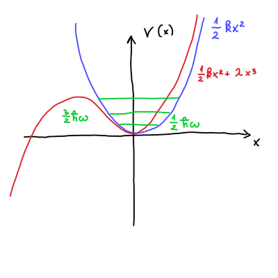

#+title: 10. vaje iz Kvantne mehanike
#+startup: nolatexpreview
#+startup: entitiespretty nil
#+startup: show2levels
#+latex_header: \usepackage{amsmath} \usepackage{unicode-math} \usepackage{cancel} \usepackage{graphicx}
#+latex_header: \renewcommand{\theta}{\vartheta} \renewcommand{\phi}{\varphi} \renewcommand{\epsilon}{\varepsilon}
#+latex_header: \newcommand{\odv}[1]{\dot{\vec{#1}}} \newcommand{\oddv}[1]{\ddot{\vec{#1}}}
#+latex_header: \newcommand{\rot}{\mathrm{rot}}\newcommand{\dive}{\mathrm{div}} \newcommand{\iu}{\mathrm{i}}
#+latex_header: \newcommand\mapsfrom{\mathrel{\reflectbox{\ensuremath{\mapsto}}}}
* Nedegenerirana teorija perturbacije
** Teorija

Imamo Hamiltonian, ki je sestavljen iz dveh delov - Hamiltoniana \( H_0 \) s pripadajočimi lastnimi funkcijami \( \left| n_0 \right\rangle \) in nedegenerirane lastne vrednosti energije \( E_n^{(0)} \) in majhne perturbacije \( H' \).

\[ H = H_0 + H'
\]

Lastne vrednosti energije tega Hamiltoniana pridobimo preko drugega reda perturbacijske teorije

\[ E_n = E_n^{(0)} + \left\langle n^{(0)} \middle| H' \middle| n^{(0)} \right\rangle + \sum\limits_{m \ne n}^{} \frac{\left| \left\langle m^{(0)} \middle| H' \middle| n^{(0)} \right\rangle \right|}{E_n^{(0)} - E_m ^{(0)}}
\]
** Harmonski oscilator s perturbacijo 4. reda

#+begin_problem
Želimo izračunati približke lastnih vrednosti energij Hamiltoniana s perturbacijo 4. reda.

\[ H = \frac{p ^2}{2m} + \frac{1}{2} k x ^2 + \lambda x ^4, \, \ \lambda > 0
\]
#+end_problem

V neperturbiranem Hamiltonianu prepoznamo harmonski oscilator, za katerega poznamo lastne vrednosti

\[ E_n^{(0)} = \hbar \omega \left( n + \frac{1}{2} \right).
\]

Perturbacija je torej \( H' = \lambda x ^4 \). Prvi red perturbacije je torej

\[ E_n = E_n^{(0)} + \left\langle n^{(0)} \middle| \lambda x ^4 \middle| n^{(0)} \right\rangle
\]

Pri računanju se bomo poslužili anihilacijskega in kreacijskega operatorja, za katera velja odvisnost

\[ x = \frac{x_0}{\sqrt{2}} \left( a + a^{\dagger} \right) , \, \ x_0 = \sqrt{\frac{\hbar}{m \omega}}
\]

\( x^4 \) z anihilacijskima operatorjema nam poda 16 členov, kar je fuj. Namesto tega bomo razdelili izraz na \( \left\langle x^2 n^{(0)} \middle| x ^2\middle| n^{(0)} \right\rangle \).

Pred nadaljevanjem se spomnimo identitete za komutacijo anihilacijskega in kreacijskega operatorja

\[ \left[ a, a^{\dagger} \right] = 1 \implies \ a a^{\dagger} = 1 + a^{\dagger} a.
\]

Kvadrat operatorja položaja za harmonski oscilator je po definiciji \( x ^2 = \frac{x_0 ^2}{2} \left( a + a^{\dagger} \right) ^2 \). Vpliv tega operatorja na stanje \( \left| n \right\rangle \) je enako

\begin{align*}
  x ^2 \left| n \right\rangle &= \frac{x_0 ^2}{2} \left( a + a^{\dagger} \right) ^2 \left|  n \right\rangle \\
&= \frac{x_0 ^2}{2} \left( a ^2  + 2 a^{\dagger} a + a ^{\dagger 2} + 1  \right) \left| n \right\rangle \\
&= \frac{x_0 ^2}{2} \left( \sqrt{n} \sqrt{n - 1} \left| n - 2 \right\rangle + (2n + 1) \left| n \right\rangle  + \sqrt{n + 1} \sqrt{n + 2} \left| n + 2 \right\rangle\right)
\end{align*}

Zaradi ortogonalnosti bo braket rezultat potem

\begin{align*}
  \left\langle x ^2 n^{(0)} \middle| x ^2 \middle| n^{(0)} \right\rangle &= \frac{x_0 ^4}{2} \left[ n (n - 1) +  (2n + 1) ^2 + (n + 1)(n + 2) \right] \\
&= \frac{x_0 ^4}{4} \left[ 6n ^2 + 6n + 3 \right]
\end{align*}

Torej, energija peturbiranega Hamiltoniana v prvem redu je

\[ E_n = E_n^{(0)} + \lambda \frac{3 x_0 ^4}{4} \left( 2n ^2 + 2n + 1 \right)
\]

** Harmonski oscilator s perturbacijo 3. reda

#+begin_problem

#+end_problem

Intuicija nam pravi, da se bo energija znižala, saj se valovna funkcija zaradi nižjega potenciala na levi premakne v levo.

Dokazujemo, da je prvi red popravka perturbacije ničeln. Naj bo \( \psi_n (x) \) lastna funkcija osnovnega harmonskega oscilatorja. Za nedegenerirana stanja je lastno stanje lahko soda ali liha funkcija. Zaradi lihosti perturbacije \( \lambda x ^3 \) bo

\[ \left\langle n \middle| \lambda x ^3 \middle| n \right\rangle = \int\limits_{- \infty}^{\infty} \psi_n^{\ast} (x) \lambda x ^3 \psi_n(x) \, \mathrm{d} x = 0.
\]

integrand vedno ničeln. Integral lihe funkcije na sodem intervalu pa je vedno \( 0 \).

Poglejmo si sedaj drugi popravek perturbacijskega približka

\[ \sum\limits_{m \ne n}^{} \frac{\left| \left\langle m \middle| \lambda x ^3 \middle| n \right\rangle \right| ^2}{E_n - E_m} + o \left( \lambda ^3 \right)
\]

Pričakovano vrednost tega popravka je

\[ \left\langle m \middle| \lambda x ^3 \middle| n \right\rangle = \lambda \left\langle x m \middle| x ^2 \middle| n \right\rangle.
\]

Ket lahko uporabimo iz prejšnje naloge in je enak

\[ x ^2 \left| n \right\rangle  = \frac{x_0 ^2}{2} \left( \sqrt{n} \sqrt{n - 1} \left| n - 2 \right\rangle + (2n + 1) \left| n \right\rangle + \sqrt{n + 1} \sqrt{n + 2} \left| n + 2 \right\rangle \right).
\]

Bra pa moramo še izračunati, vendar je precej enostavno

\[ x \left| m \right\rangle = \frac{x_0}{\sqrt{2}} \left( a + a^{\dagger} \right) \left| m \right\rangle = \frac{x_0}{\sqrt{2}} \left[ \sqrt{m} \left| m - 1 \right\rangle + \sqrt{m + 1} \left| m + 1 \right\rangle\right]
\]

Pričakovano vrednost dobimo z združitvijo bra-keta in si pomagamo s Krönekerjevo delto

\begin{align*}
  \lambda \left\langle x m \middle| x ^2 \middle| n \right\rangle &= \lambda  \frac{x_0}{\sqrt{2}} \left(\sqrt{m} \left\langle m - 1 \right| + \sqrt{m + 1} \left\langle m + 1 \right| \right) \\
&\quad \cdot \frac{x_0 ^2}{2} \left( \sqrt{n} \sqrt{n - 1} \left| n - 2 \right\rangle + (2n + 1) \left| n \right\rangle + \sqrt{n + 1} \sqrt{n + 2} \left| n + 2 \right\rangle \right)\\
\end{align*}

Krönekerjevo delto preindeksiramo. Podam dva primera preindeksacije

\[ \left\langle m - 1 \right| \left| n - 2 \right\rangle = \delta_{m - 1, n - 2} \implies \delta_{m, n - 1} \quad \text{ in } \quad \left\langle m + 1 \right| \left| n - 1 \right\rangle = \delta_{m + 1, n - 1} \implies \delta_{m, n - 2}
\]

Končen rezultat je

\begin{align*}
  \left\langle m \middle| \lambda x ^3 \middle| n \right\rangle  = & \lambda \frac{x_0 ^3}{2 \sqrt{2}} \left( 3n \sqrt{n}\delta_{m,n -1} + 3 (n + 1 ) \sqrt{n + 1} \delta_{m, n + 1} \right. \\
    &+ \left. \sqrt{(n + 1) (n + 2) (n + 3)} \delta_{m, n + 3} + \sqrt{n (n - 1) (n - 2)} \delta_{m, n - 3} \right)
\end{align*}

Razliko energij v popravki perturbacije zapišemo kot

\[ E_n - E_m = \hbar \omega (n - m).
\]

Vsota postane razlika polinomov

\begin{align*}
\sum\limits_{m \ne n}^{} \frac{\left| \left\langle m \middle| \lambda x ^3 \middle| n \right\rangle \right| ^2}{E_n - E_m} &= \frac{\lambda ^2 x_0 ^6}{8} \left( \frac{9n ^3}{\hbar \omega} + \frac{9 (n + 1) ^3}{(- \hbar \omega)} + \frac{(n + 1)(n + 2)(n + 3)}{(- 3\hbar \omega)} + \frac{n (n - 1) (n - 2)}{3 \hbar \omega} \right) \\
&= - \frac{\lambda ^2 x_0 ^6}{8 \hbar \omega} \left( 30n ^2 + 30 n + 11 \right)
\end{align*}

Želimo preveriti, ali se je verjetnostna porazdelitev res premaknila v levo. Lastne funkcije perturbacije so po definiciji

\[ \left| n \right\rangle = \left| n_0 \right\rangle + \sum\limits_{m \ne n}^{} \frac{\left\langle m \middle| \lambda x ^3 \middle| n \right\rangle}{E_n - E_m} \left| m \right\rangle,
\]

kjer je \( \left| n_0 \right\rangle \) lastna funkcija osnovnega harmonskega oscilatorja. Vsota predstavlja popravek osnovnega stanja. Upoštevajoč matrični element \( \left\langle m \middle| \lambda x ^3 \middle| n \right\rangle \), je popravljeno osnovno stanje

\begin{align*}
 \left| n \right\rangle = \left| n_0 \right\rangle &+ \frac{\lambda x_0 ^3}{\sqrt{8}} \left( \frac{\sqrt{n (n - 1) (n - 2)}}{3 \hbar \omega} \left| n_0 - 3 \right\rangle + \frac{3n\sqrt{n}}{\hbar \omega} \left| n_0 - 1 \right\rangle \right. \\
&- \left. \frac{3(n + 1) \sqrt{n + 1}}{\hbar \omega} \left| n_0 + 1 \right\rangle - \frac{\sqrt{(n + 1) (n + 2) (n + 3)}}{3 \hbar \omega} \left| n_0 + 3 \right\rangle \right)
\end{align*}

Osnovno stanje perturbacije je

\[ \left| 0 \right\rangle = \left| 0_0 \right\rangle + \frac{\lambda x_0 ^3}{\sqrt{8} \cdot 3 \hbar \omega} \left( -9 \left| 1 \right\rangle - \sqrt{6} \left| 3 \right\rangle  \right) + o \left( \lambda ^2 \right)
\]

Slednje stanje ni normirano, saj

\[ \left\langle 0 \middle| 0 \right\rangle = 1 + \frac{\lambda ^2 x_0 ^6}{8 \cdot 9 \hbar ^2 \omega ^2} \left( 81 + 6 \right) + o \left( \lambda ^2 \right).
\]

Osnovno stanje zapišemo

\[ \frac{\left| 0 \right\rangle}{\sqrt{1 + \frac{\lambda ^2 x_0 ^2}{\hbar ^2\omega ^2} \frac{87}{72}}} = \left| 0 \right\rangle \left( 1 - o \left( \lambda ^2 \right) \right)
\]

Popravek, ki je posledica normiranosti, se skriva znotraj približka \( o \left( \lambda ^2 \right) \), ki smo ga že tako ali tako zanemarili.

Za odgovor na vprašanje, kaj se zgodi z valovno funkcijo po perturbaciji, moramo izračunati pričakovano osnovnega stanja perturbacije

\begin{align*}
  \left\langle 0 \middle| x \middle| 0 \right\rangle &= \frac{x_0}{\sqrt{2}} \left\langle 0 \middle| \left( a + a ^{\dagger} \right) \middle| 0 \right\rangle \\
&=  0 + \left\langle 0 \right| \left[ \frac{\lambda x_0 ^3}{\sqrt{8} \cdot 3 \hbar \omega} \left( -9 \left| 0 \right\rangle_0 - \sqrt{6} \left| 2 \right\rangle_0 - 9 \sqrt{2} \left| 2 \right\rangle_0 - \sqrt{24} \left| 4 \right\rangle_0 \right) \right] \\
&= - \frac{3 \lambda x_0 ^4}{2 \hbar \omega} + o \left( \lambda ^2 \right) = - \frac{3}{2} \left( \frac{\lambda x_0 ^3}{\hbar \omega} \right) x_0
\end{align*}

Vidimo torej, da se osnovno stanje tega stanja dejansko premakne v levo.
* Degenerirana teorija perturbacije

#+begin_problem

#+end_problem

Hamiltonian vodikovega delca v električnem polju je

\[ H = \frac{p ^2}{2m} - \frac{e ^2}{4 \pi \epsilon_0} \frac{1}{r} - e \epsilon z,
\]

kjer je \( \vec{\epsilon} = (0, 0, \epsilon) \) električno polje v smeri \( z \).

Osnovno stanje vodikovega atoma nižje kot osnovno stanje \( E_0 = -13.6 \mathrm{eV} \).
