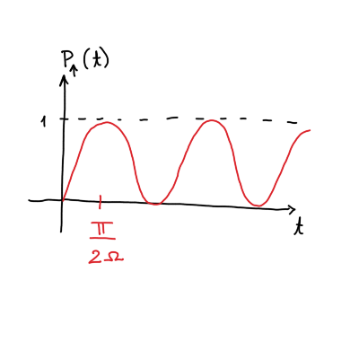

#+title: 13. vaje iz Kvantne mehanike
#+startup: nolatexpreview
#+startup: entitiespretty nil
#+startup: show2levels
#+latex_header: \usepackage{amsmath} \usepackage{unicode-math} \usepackage{cancel} \usepackage{graphicx}
#+latex_header: \renewcommand{\theta}{\vartheta} \renewcommand{\phi}{\varphi} \renewcommand{\epsilon}{\varepsilon}
#+latex_header: \newcommand{\odv}[1]{\dot{\vec{#1}}} \newcommand{\oddv}[1]{\ddot{\vec{#1}}}
#+latex_header: \newcommand{\rot}{\mathrm{rot}}\newcommand{\dive}{\mathrm{div}} \newcommand{\iu}{\mathrm{i}}
#+latex_header: \newcommand\mapsfrom{\mathrel{\reflectbox{\ensuremath{\mapsto}}}}
* Rabijeve oscilacije

#+begin_problem
Imejmo delec s spinom \( s = \frac{1}{2} \) v osnovnem stanju \( \left| \psi, 0 \right\rangle = \left| \downarrow \right\rangle\). Delec ima Hamiltonian

\[ H = \gamma s_z + \lambda \cos \left( \omega t \right) s_x,
\]

kjer je \( H_0 = \gamma s_z \) in motnja je \( H' = \lambda \cos (\omega t) s_x \).
#+end_problem

Poiščimo rešitve za \( H_0 \). Prepišemo ga lahko s pomočjo Paulijevih matrik

\[ H_0 = \gamma \frac{\hbar}{2} \sigma_z.
\]

Poglejmo, kaj se zgodi, če s tem Hamiltonianom delujemo na stanje \( (1, 0)^T \):

\[ H_0 \begin{bmatrix} 1 \\ 0 \end{bmatrix} = \gamma \frac{\hbar}{2} \sigma_z \begin{bmatrix} 1 \\ 0 \end{bmatrix} = \gamma \frac{\hbar}{2} \begin{bmatrix}
                                                                                                                                            1 & 0 \\
                                                                                                                                            0 & -1
                                                                                                                                             \end{bmatrix} \begin{bmatrix} 1  \\ 0 \end{bmatrix} = \gamma \frac{\hbar}{2} \begin{bmatrix} 1 \\ 0 \end{bmatrix}
\]

Vidimo torej, da je \( (1, 0)^T \) lastno stanje tega Hamiltoniana. Hitro se preveri, da je tudi spin dol lastno stanje tega Hamiltoniana.

\[ H_0  \left| \downarrow \right\rangle = - \frac{\gamma \hbar}{2} \left| \downarrow \right\rangle.
\]

Zaradi tega lahko zapišemo

\[ H_0 \begin{bmatrix} \psi_{+} \\ \psi_- \end{bmatrix} = \gamma \frac{\hbar}{2} \sigma_z \begin{bmatrix} \psi_{+} \\ \psi_{-} \end{bmatrix}.
\]

Zanima nas verjetno, da delec po času \( t \) najdemo v stanju s spinom navzgor.

Časovni razvoj funckije je

\[ \left| \psi, t \right\rangle  = c_{\uparrow} (t) \left| \uparrow \right\rangle \exp \left\{ - \mathrm{i}\frac{\gamma}{2} t \right\} + c_{\downarrow} (t) \exp \left\{ \mathrm{i} \frac{\gamma}{2} t \right\}.
\]

Verjetnost za prehod delca iz stanja s spinom dol v stanje s spinom gor je enako kvadrat koeficienta

\[ P_{\uparrow} (t) = \left| c_{\uparrow} (t) \right|  ^2.
\]

Iz prejšnjh predavanje vemo, da je v prvem približku

\[ c_{\uparrow} (t) =- \frac{\mathrm{i}}{\hbar} \int\limits_-^t \left\langle \uparrow, t \middle| H' \middle| \downarrow, t' \right\rangle  \, \mathrm{d} t' + c_{\uparrow}(t = 0).
\]

Ob času \( t = 0 \) je \( c_{\uparrow} (t = 0)= 0 \). Preostane nam ob upoštevanju definicije motnje \( H' \) integral

\[ c_{\uparrow} (t) = - \frac{\mathrm{i}}{\hbar}\lambda \int\limits_0^t \exp \left\{ \mathrm{i} \gamma t \right\} \left\langle \uparrow \middle| s_x \middle| \downarrow \right\rangle  \cos \left( \omega t' \right) \, \mathrm{d} t'.
\]

Operator \( s_x \) lahko zapišemo s Paulijevo matriko in posledično je matrični element

\[ \left\langle \uparrow \middle| s_x \middle| \downarrow \right\rangle = \frac{\hbar}{2} [1, 0] \begin{bmatrix}
                                                                                                 0 & 1 \\
                                                                                                 1 & 0
                                                                                                  \end{bmatrix} \begin{bmatrix} 0 \\ 1 \end{bmatrix} = \frac{\hbar}{2}.
\]

Upoštevali smo, da je stanje v bra hermitirano.

Zapišemo ponovno integral koeficienta

\begin{align*}
  c_{\uparrow} (t) &= - \frac{\mathrm{i}}{\hbar} \lambda \frac{\hbar}{2} \int\limits_0^t \frac{1}{2} \left( \exp \left\{ \mathrm{i} (\gamma + \omega) t' \right\} + \exp \left( \mathrm{i} (\gamma - \omega) t' \right)  \right)\, \mathrm{d} t' \\
&=\left. - \frac{\mathrm{i} \lambda}{4} \left[ \frac{1}{\mathrm{i} (\gamma + \omega)} \exp \left\{ \mathrm{i} (\gamma + \omega) t' \right\} + \frac{1}{\mathrm{i} (\gamma - \omega)} \exp \left\{ \mathrm{i} (\gamma - \omega) t' \right\}  \right] \right|_0^t\\
&= - \frac{\mathrm{i} \lambda}{4} \left( \frac{\exp \left\{ \mathrm{i} (\gamma + \omega)  \right\} - 1}{\mathrm{i} (\gamma + \omega)} - \frac{\exp \left\{ \mathrm{i} (\gamma - \omega) \right\} - 1}{\mathrm{i} (\gamma - \omega)} \right)
\end{align*}

[dopolni]

Zanima nas, kdaj ima prvi red motnje težave. Zato, da smo lahko zapisali teorijo motnje mora biti \( \lambda \ll 1 \). Hkrati pa je lahko tudi imenovalec \( (\gamma - \omega) \) blizu 0, kar pomeni, da tisti ulomek postane velik. To je problematično, četudi je \( \lambda \) majhen.

Radi bi rešili to težavo brez odkrivanja tople vode.

Uporabili bomo nastavek, ki je popolnoma splošen

\[ \left| \psi, t \right\rangle  = c_{\uparrow} (t) \left| \uparrow \right\rangle \exp \left\{ - \mathrm{i} \omega ' t \right\} + c_{\downarrow} (t) \left| \downarrow \right\rangle \exp \left\{ \mathrm{i} \omega ' t \right\}.
\]

S tem nastavkom bi radi rešili nestacionarno Schrödingerjevo enačbo

\[ \mathrm{i} \hbar \partial_t \left| \psi, t \right\rangle  = H(t) \left| \psi, t \right\rangle
\]

z začetnim pogojem \( \left| \psi, 0 \right\rangle = \left| \downarrow \right\rangle\).

\[ \mathrm{i} \hbar \mathrm{i} \omega \left( -c_{\uparrow} (t) \left| \uparrow \right\rangle \exp \left\{ - \mathrm{i} \omega' t \right\} + c_{\downarrow} (t) \left| \downarrow \right\rangle \exp \left\{ \mathrm{i} \omega' t \right\}\right) + \mathrm{i} \hbar \left( \dot{c}_{\uparrow}(t) \left| \uparrow \right\rangle \exp \left\{ - \mathrm{i} \omega' t \right\} + \dot{c}_{\downarrow}(t) \exp \left\{ - \mathrm{i} \omega t \right\} \right) = \left[ \gamma \frac{\hbar}{2} \left( \left| \uparrow \right\rangle \left\langle \uparrow \right| - \left| \downarrow \right\rangle \left\langle \downarrow \right|  \right) + \lambda \cos (\omega t)  \frac{\hbar}{2} \left( \left| \uparrow \right\rangle \left\langle \downarrow \right| + \left| \downarrow \right\rangle \left\langle \uparrow \right| \right) \right] \left( c_{\uparrow} (t) \left| \uparrow \right\rangle \exp \left\{ - \mathrm{i} \omega ' t \right\} + c_{\downarrow} (t) \left| \downarrow \right\rangle \exp \left\{ \mathrm{i} \omega' t \right\}\right)
\]

Velja

\[ \left| \uparrow \right\rangle \left\langle \uparrow \right| - \left| \downarrow \right\rangle \left\langle \downarrow \right| = \sigma_z \quad \text{ in } \quad \left| \uparrow \right\rangle \left\langle \downarrow \right| + \left| \downarrow \right\rangle \left\langle \uparrow \right| = \sigma_x.
\]

To lahko hitro preverimo z

\[ \sigma_z = \begin{bmatrix}
              1 & 0 \\
              0 & -1
               \end{bmatrix} \begin{bmatrix} 1 \\ 0 \end{bmatrix} = \left( \left| \uparrow \right\rangle \left\langle \uparrow \right| - \left| \downarrow \right\rangle \left\langle \downarrow \right| \right) \left| \uparrow \right\rangle
\]

Operatorjema \( \sigma_z \) in \( \sigma_x \) pustimo, da vplivata na stanji in dobimo

\[ \left[ \gamma \frac{\hbar}{2} \sigma_z + \lambda \cos (\omega t) \frac{\hbar}{2} \sigma_x \right] \left( c_{\uparrow} (t) \left| \uparrow \right\rangle \exp \left\{ - \mathrm{i} \omega' t \right\}+ c_{\downarrow}(t) \left| \downarrow \right\rangle \exp \left\{ \mathrm{i} \omega ' t \right\} \right) = \gamma\frac{\hbar}{2} \left( c_{\uparrow} (t) \left| \uparrow \right\rangle \exp \left\{ - \mathrm{i} \omega' t \right\} - c_{\downarrow}(t) \left| \downarrow \right\rangle \exp \left\{ \mathrm{i} \omega' t \right\} \right) + \lambda \cos (\omega t) \left( c_{\downarrow} (t) \left| \uparrow \right\rangle \exp \left\{ \mathrm{i} \omega ' t \right\} + c_{\uparrow}(t) \left| \downarrow \right\rangle \exp \left\{ - \mathrm{i} \omega' t \right\}  \right).
\]

Dobimo sistem dveh enačb za stanje \( \left| \uparrow \right\rangle \) in stanje \( \downarrow \).

\begin{align*}
\mathrm{i} \hbar \dot{c}_{\uparrow}(t) \exp \left\{ - \mathrm{i} \omega' t \right\} &= - \hbar \omega' c_{\uparrow} (t) \exp \left\{ - \mathrm{i} \omega' t \right\} + \gamma \frac{\hbar}{2} c_{\uparrow} (t) \exp \left\{ - \mathrm{i} \omega' t \right\} + \frac{\hbar}{2} \lambda \cos (\omega t) \exp \left\{ \mathrm{i} \omega t \right\} c_{\downarrow} (t) \\
\mathrm{i} \hbar \dot{c}_{\downarrow}(t) \exp \left\{ \mathrm{i} \omega' t \right\} &= + \hbar \omega' c_{\downarrow} (t) \exp \left\{ - \mathrm{i} \omega' t \right\} - \gamma \frac{\hbar}{2} c_{\downarrow} (t) \exp \left\{  \mathrm{i} \omega' t \right\} + \frac{\hbar}{2} \lambda \cos (\omega t) \exp \left\{r- \mathrm{i} \omega t \right\} c_{\uparrow} (t) \\
\end{align*}

Zgornjo enačbo pomnožimo z \( \frac{1}{\hbar} \exp \left\{ \mathrm{i} \omega ' t \right\} \), spodnjo enačbo pa z \( \frac{1}{\hbar} \exp \left\{- \mathrm{i} \omega' t \right\} \)

[dopolni]

Preostane nam

\begin{align*}
 \mathrm{i} \dot{c}_{\uparrow} (t) &= \left( - \omega ' + \frac{\gamma}{2} \right) c_{\uparrow}(t) + \frac{\lambda}{4} \left( \exp \left\{ \mathrm{i} (\omega + 2 \omega') t \right\} + \exp \left\{ \mathrm{i} (\omega + 2\omega') t \right\} \right) c_{\downarrow} (t) \\
\mathrm{i} \dot{c}_{\downarrow} (t) &= \left(  \omega ' - \frac{\gamma}{2} \right) c_{\downarrow}(t) + \frac{\lambda}{4} \left( \exp \left\{ \mathrm{i} (\omega - 2 \omega') t \right\} + \exp \left\{- \mathrm{i} (\omega + 2\omega') t \right\} \right) c_{\uparrow} (t).
\end{align*}

Odločimo se, da je \( \omega - 2 \omega' = 0 \), iz česar sledi \( \omega' = \frac{\omega}{2} \). Sistem enačb se tako preobrazi v

\begin{align*}
  \mathrm{i} \dot{c}_{\uparrow} (t) = \left( - \omega' + \frac{\gamma}{2} \right) c_{\uparrow} (t) + \frac{\lambda}{4} \left( \exp \left\{ \mathrm{i} 2 \omega t \right\} + 1 \right) c_{\downarrow} (t) \\
\mathrm{i} \dot{c}_{\downarrow} (t) = \left(  \omega' - \frac{\gamma}{2} \right) c_{\downarrow} (t) + \frac{\lambda}{4} \left( \exp \left\{ - \mathrm{i} 2 \omega t \right\} + 1 \right) c_{\uparrow} (t) \\
\end{align*}

Izraz lahko primerjamo z vsiljenim nihanjem v klasični fiziki. [predpostavka].

Sklopljen sistem lahko posledično poenostavimo

\begin{align*}
  \mathrm{i} \dot{c}_{\uparrow}(t) &= \left( \frac{\gamma}{2} - \frac{\omega}{2} \right) c_{\uparrow} (t) + \frac{\lambda}{4} c_{\downarrow} (t) \\
\mathrm{i} \dot{c}_{\downarrow} (t) &= \frac{\lambda}{4} c_{\uparrow} (t) + \left( \frac{\omega}{2} - \frac{\gamma}{2} \right) c_{\downarrow} (t)
\end{align*}

#+name: alternativna rešitev
#+begin_alternative
Pri reševanju sistema uporabimo identiteto

\begin{equation}
\label{eq:2}
 \exp \left\{ \mathrm{i} \theta \left( \hat{n} \cdot \sigma \right) \right\} = \cos \theta + \mathrm{i} \sin \theta \left( \hat{n} \cdot \sigma \right),
\end{equation}

kjer velja \( \left( \hat{n} \cdot \sigma \right) ^2 = I \) in je \( \hat{n} \) unit vector.

Sistem zapišemo v matrični obliki kot

\[ \frac{\mathrm{d} }{\mathrm{d} t} \vec{c} (t) = - \mathrm{i} \begin{bmatrix}
                                                               \frac{\theta}{2} - \frac{\omega}{2} & \frac{\lambda}{4} \\
                                                               \frac{\lambda}{4} & - \left( \frac{\gamma}{2} - \frac{\omega}{2} \right)
                                                                \end{bmatrix} \vec{c},
\]

kjer smo definirali \( \vec{c} (t) = \left( c_{\uparrow}(t), c_{\downarrow} (t) \right)^T \). Matriko lahko zapišemo s pomočjo Paulijevih matrik

\[\begin{bmatrix}
  \frac{\theta}{2} - \frac{\omega}{2} & \frac{\lambda}{4} \\
  \frac{\lambda}{4} & - \left( \frac{\gamma}{2} - \frac{\omega}{2} \right)
  \end{bmatrix} = \left( \frac{1}{2} \left( \gamma - \omega \right) \sigma_z + \frac{\lambda}{4} \sigma_x \right).
\]

Za vektor Paulijevih matrik \( \vec{\sigma} = (\sigma_x, \sigma_y, \sigma_z) \) lahko posledično zapišemo skalarni produkt

\[  \left( \frac{1}{2} \left( \gamma - \omega \right) \sigma_z + \frac{\lambda}{4} \sigma_x \right) = \left( \frac{\lambda}{4}, 0, \frac{1}{2} (\gamma - \omega) \right) \cdot \vec{\sigma}
\]

Rešujemo torej sistem enačb

\begin{equation}
\label{eq:1}
-\mathrm{i} \left( \left( \frac{\lambda}{4}, 0, \frac{1}{2} (\gamma - \omega) \right) \cdot \vec{\sigma} \right) \vec{c}(t) = \frac{\mathrm{d} }{\mathrm{d} t} \vec{c}(t)
\end{equation}

Definiramo dolžino vektorja \( \Omega = \sqrt{\frac{\lambda ^2}{4 ^2} + \left( \gamma - \omega \right) \frac{1}{2 ^2}} \), in posledično lahko rešitev zapišemo kot

\[ \vec{c}(t) = \exp \left\{ - \mathrm{i} \Omega t \frac{\left( \frac{\lambda}{4}, 0 \frac{1}{2} \left( \gamma - \omega \right) \right) \cdot \vec{\sigma}}{\Omega} \right\} \vec{c} (0)
\]

(glej Matematiko 3, reševanje sistemov ODE)

Če to rešitev vstavimo v enačbo \ref{eq:1}, se lahko prepričamo, da ta rešitev reši to enačbo.

Poslužimo se sedaj identitete \ref{eq:2}, da zapišemo vektor koeficientov kot

\[ \vec{c} (t) = \left( \underline{I} \cos (\Omega t) - \mathrm{i} \sin (\Omega t) \left( \frac{1}{\Omega} \left( \frac{\lambda}{4}, 0, \frac{1}{2} (\gamma - \omega) \right) \cdot \vec{\sigma} \right) \right) \begin{bmatrix} 0 \\ 1 \end{bmatrix} .
\]

Poračunamo matrike in dobimo

\begin{align*}
  \vec{c}(t) &= \begin{bmatrix} 0 \\ 1 \end{bmatrix} \cos (\Omega t) - \mathrm{i} \sin (\Omega t) \frac{1}{\Omega} \begin{bmatrix}
                                                                                                                   \frac{1}{2} (\gamma - \omega) & \frac{\lambda}{4} \\
                                                                                                                    \frac{\lambda}{4} &  - \frac{1}{2} (\gamma - \omega)
                                                                                                                    \end{bmatrix} \begin{bmatrix} 0 \\ 1 \end{bmatrix}\\
&= \begin{bmatrix} 0 \\ 1 \end{bmatrix} \cos (\Omega t) - \mathrm{i} \sin (\Omega t) \frac{1}{\Omega} \begin{bmatrix} \frac{\lambda}{4} \\ - \frac{1}{2} (\gamma - \omega) \end{bmatrix} \\
&= \begin{bmatrix} - \mathrm{i} \sin (\Omega t) \frac{1}{\Omega} \frac{\lambda}{4} \\ \cos (\Omega t) + \mathrm{i} \sin (\Omega t) \frac{1}{\Omega} \frac{1}{2} (\gamma - \omega) \end{bmatrix}
\end{align*}

Slednje deluje samo v primeru, če je \( \Omega \ll 2 \omega \) zaradi členov, ki smo jih zavrgli višje gor.

Zanima nas verjetnost za prehod delca v stanje s spinom navzgor in torej odčitamo vrednosti prve komponente, ki predstavlja \( c_{\uparrow} \).

\[ P_{\uparrow} (t) = \left( \frac{\lambda}{4 \Omega} \right) ^2 \sin ^2 (\Omega t) = \frac{\lambda ^2 \sin ^2 (\Omega t)}{\lambda ^2 + 4 (\gamma - \omega) ^2}
\]

\( \gamma \) je energijska razlika med stanjema \( \left| \uparrow \right\rangle \) in \( \left| \downarrow \right\rangle \), medtem ko \( \omega \) je frekvenca vzbujanja.

Pri \( \gamma = \omega \) smo v resonanci, iz česar sledi \( \Omega = \frac{\lambda}{4} \).
#+end_alternative

Vrh sinusa je pri \( \sin (\Omega t) = \frac{\pi}{2} \), kar pomeni, da je čas maksimuma \( t = \frac{\pi}{2 \Omega} \).

Časovna teorija motnje je imela težave, saj je bila pri izpeljavi postavljena predpostavka, da je prehod v drugo stanje zelo majhno skozi čas. Kakor vidimo iz časovne odvisnosti verjetnosti za spin navzgor pa je to sinusna odvisnost.
