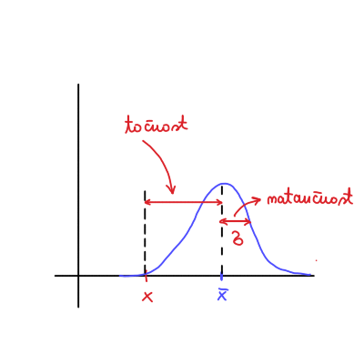

#+title: Vaje iz Fizikalnih merjenj, 9. teden v letu
#+subtitle: 2026/02/24
#+startup: nolatexpreview
#+startup: entitiespretty nil
#+startup: show2levels
#+latex_header: \usepackage{amsmath} \usepackage{unicode-math} \usepackage{cancel} \usepackage{graphicx}
#+latex_header: \renewcommand{\theta}{\vartheta} \renewcommand{\phi}{\varphi} \renewcommand{\epsilon}{\varepsilon}
#+latex_header: \newcommand{\odv}[1]{\dot{\vec{#1}}} \newcommand{\oddv}[1]{\ddot{\vec{#1}}}
#+latex_header: \newcommand{\rot}{\mathrm{rot}}\newcommand{\dive}{\mathrm{div}} \newcommand{\iu}{\mathrm{i}}
#+latex_header: \newcommand\mapsfrom{\mathrel{\reflectbox{\ensuremath{\mapsto}}}}
* Kovarianca/korelacija

Neznana količina, ki jo merimo, je \( x \). Imamo dva seta meritev, oba porazdeljena po normalni porazdelitvi

\[ z_1 \sim N (x, \sigma_1 ^2 ) \quad \text{ in } \quad z_2 \sim N(x, \sigma_2 ^2)
\]

#+begin_note
O točnosti in natančnosti: Razdalja med pričakovana vrednostjo \( x \) in njeno povprečno vrednostjo \( \bar{x} \) je točnost, medtem ko odstopanje od povprečne vrednosti pa je natančnost.

Velika netočnost je ponavadi rezultat sistematska napaka.

#+end_note

Predpostavimo, da so naši izmerki natančni.

Naša seta meritev napišemo kot vsoto pričakovane vrednosti in šuma, ki sta oba razporejena po normalni porazdelitvi.

\[ z_1 = x + r_1; \quad r_1 \sim N (0, \sigma_1 ^2) \quad \text{ in } \quad z_2 = x + r_2; \quad r_2 \sim N(0, \sigma_2 ^2)
\]

Če imamo odvisne meritve (šume), potem zapišemo

\[ r_2 = \alpha r_1 + w; \quad w \sim N(0, \sigma_w ^2)
\]

Varianca \( \sigma_2 ^2 \) je po definiciji

\[ \sigma_2 ^2 = \left\langle \left( z_2 - x \right) ^2 \right\rangle = \left\langle r_2 ^2 \right\rangle.
\]

Upoštevamo odvisnost meritve (šumov) in varianca postane

\begin{align*}
  \sigma_2 ^2 &= \left\langle r_2 ^2 \right\rangle \\
&= \left\langle \left( \alpha r_1 + w \right) ^2 \right\rangle \\
&= \left\langle \alpha ^2 r_1 ^2 + 2\alpha r_1 w + w ^2 \right\rangle \\
&= \alpha ^2 \sigma_1 ^2 + \sigma_w ^2
\end{align*}

Člen \( \left\langle r_1 w \right\rangle \) je kovarianca in ker je \( r_2 = r_2 (r_1, w) \) in sta \( r_1 \) in \( w \) neodvisni, je njuna kovarianca ničelna.

Sledi, da dobimo zapis

\[ 1 = \left( \alpha \frac{\sigma_1}{\sigma_2} \right) ^2 + \left( \frac{\sigma_w}{\sigma_2} \right) ^2,
\]

iz česar vidimo, da je korelacijski koeficient \( \rho_{12} = \left( \alpha \frac{\sigma_1 }{\sigma_2} \right) ^2 \) omejen na intervalu

\[ 0 \le \left( \alpha \frac{\sigma_1}{\sigma_2} \right) ^2 \le 1 \implies -1 \le \rho_{12} \le 1
\]

V primeru \( \rho_{12} = 0 \) je popolna neodvisnost spremenljivk, v primeru \( \rho = \pm 1 \) imamo pa popolno korelacijo.

Kovarianca je po definiciji

\[ \sigma_{12} = \left\langle \left( z_1 - x \right) \left( z_2 - x \right) \right\rangle  = \left\langle r_1 r_2 \right\rangle.
\]

Upoštevamo definicije šumov in dobimo

\[ \sigma_{12} = \left\langle r_1 \left( \alpha r_1 + w \right) \right\rangle  = \alpha \sigma_1 ^2,
\]

saj je kovarianca \( \left\langle r_1 w \right\rangle = 0\).

Če se vrnemo h korelacijskemu faktorju,

\[ \rho_{12} = \alpha \frac{\sigma_1}{\sigma_2},
\]

ki ga pomnožimo z \( \sigma_1 \sigma_2 \), potem lahko zapišemo kot

\[ \rho_{12} \sigma_1 \sigma_2 = \alpha \sigma_1 ^2 = \sigma_{12} = \rho_{12} \sigma_1 \sigma_2
\]
* Širjenje napak (splošni predpis = po Gaussu)

Imamo večjo kombinacijo spremenljivk

\begin{align*}
  u_1 &= f_1 (x_1, x_2, \ldots, x_n) \\
u_2 &= f_2 (x_1, x_2, \ldots, x_n) \\
&\vdots \\
u_n &= f_n (x_1, x_2, \ldots, x_n),
\end{align*}

kjer so \( x_1, x_2, \ldots, x_n \) količine, ki jih merimo. Uvedemo vektorski zapis

\[ \mathbf{x} = \begin{bmatrix} x_{1} \\ x_{2} \\ \vdots \\ x_{n} \end{bmatrix} \quad \text{ in } \quad \mathbf{u} = \begin{bmatrix} u_{1} \\ u_{2} \\ \vdots \\ u_{n} \end{bmatrix}
\]

Za \( \mathbf{x} \) poznamo ocene, ki jih označimo kot

\[ \bar{\mathbf{x}} = \begin{bmatrix} \bar{x}_{1} \\ \bar{x}_{2} \\ \vdots \\ \bar{x}_{n} \end{bmatrix}.
\]

Dejanska vrednost \( \bar{x}_i \) je vsota ocene \( x_i \) in šuma \( m_i \)

\[ \bar{x}_i = x_i + m_i; \quad m_i \sim N(0, \sigma_1 ^2).
\]

Kovarianca je po definiciji

\[ \delta_{ij} = \left\langle (\bar{x}_{i - x_i}) \left( \bar{x}_j - x_j \right) \right\rangle  = \left\langle m_i m_j \right\rangle.
\]

V primeru \( i = j \) dobimo \( \sigma_i ^2 = \left\langle (\bar{x}_i - x_i) ^2 \right\rangle = \sigma_i ^2 \), kar je že zapis variance znotraj zapisa za kovarianco!

Uvedemo kovariantno matriko, katere elementi so

\[ \left( M \right)_{ij} = \sigma_{ij} = \left\langle (\bar{x}_i - x_i) \left( \bar{x}_j - x_j \right) \right\rangle  = \left\langle m_i m_j \right\rangle.
\]

Matrični zapis kovariantne matrike je

\[ M = \left\langle \left( \bar{\mathbf{x}} - \mathbf{x} \right) \left( \bar{\mathbf{x}} - \mathbf{x} \right)^T \right\rangle =\left\langle \mathbf{m} \mathbf{m}^T \right\rangle.
\]

Lastnosti kovariantne matrike so

- simetričnost \( M = M^T \)
- diagonalni elementi kovariantne matriko \( \left( M \right)_{ii} = \sigma_{ii} = \sigma_i ^2 \) so  variance
- izvendiagonalni elementi so kovariance \( \left( M \right)_{ij, i \ne j} = \sigma_{ij} \)

Za vektor \( \mathbf{u} = \left( f_1 (\mathbf{x}), f_2 (\mathbf{x}), \ldots, f_n (\mathbf{x}) \right) \) nas zanima ocena \( \bar{\mathbf{u}} \), zato da lahko izračunamo kovariantno matriko \( U \).

Po definiciji je kovariantna matrika

\[ U = \left\langle \left( \bar{\mathbf{u}} - \mathbf{u} \right) \left( \bar{\mathbf{u}} - \mathbf{u} \right)^T \right\rangle.
\]

Ocene ne poznamo, zato postopamo podobno kot zadnjič, ko razvijemo po Taylorju

\[ \mathbf{u} = \begin{bmatrix} f_1 (\bar{\mathbf{x}}) \\ f_2 (\bar{\mathbf{x}}) \\ \ldots \\ f_n (\bar{\mathbf{x}}) \end{bmatrix} + J_{\mathbf{u}}(\mathbf{x})   \left( \mathbf{x} - \bar{ \mathbf{x}} \right) + o(x ^2),
\]

kjer je \( J_{\mathbf{u}} \) Jacobijeva matrika. Ocena je potem

\[ \bar{\mathbf{u}} = \begin{bmatrix} f_1 (\bar{\mathbf{x}}) \\ f_2 (\bar{\mathbf{x}}) \\ \vdots \\ f_n (\bar{\mathbf{x}}) \end{bmatrix} + J_{\mathbf{u}} (\bar{\mathbf{x}}) \left( \bar{\mathbf{x}} - \bar{\mathbf{x}} \right) = \begin{bmatrix} f_1 (\bar{\mathbf{x}}) \\ f_2 (\bar{\mathbf{x}}) \\ \vdots \\ f_n (\bar{\mathbf{x}}) \end{bmatrix},
\]

saj je drugi člen ničeln.

Torej

\[ \bar{\mathbf{u}} - \mathbf{u}  = J_{\mathbf{u}} (\bar{\mathbf{x}}) \left(\bar{ \mathbf{x}}  - \mathbf{x}  \right).
\]

Kovariantna matrika je potem

\begin{align*}
  U &= \left\langle \left( \bar{\mathbf{u}} - \mathbf{u} \right)\left( \bar{\mathbf{u}} - \bar{u} \right)^T \right\rangle \\
&= \left\langle J_{\mathbf{u}} \left( \bar{\mathbf{x}} \right) \left( \bar{\mathbf{x}} - \mathbf{x} \right) \left( \bar{\mathbf{x}} - \bar{x} \right)^T J_{\mathbf{u}}^T (\bar{\mathbf{x}}) \right\rangle \\
&= J_{\mathbf{u}} (\bar{\mathbf{x}}) M J_{\mathbf{u}}^T (\bar{\mathbf{x}}).
\end{align*}

Upoštevali smo, da velja \( \left\langle J_{\mathbf{u}} (\bar{\mathbf{x}})\right\rangle = J_{\mathbf{u}}(\bar{\mathbf{x}}) \), saj je to matrika konstant. Spomnimo se še definicije Jacobijeve matrike, ki je

\[ J_{\mathbf{u}}(\mathbf{x}) = \begin{bmatrix}
                                \frac{\partial f_{1}}{\partial x_{1}}  & \frac{\partial f_{1}}{\partial x_{2}}  & \ldots & \frac{\partial f_{1}}{\partial x_{n}}  \\
                                 \vdots &  & & \\
                                 \vdots &  & & \\
                                 \frac{\partial f_{n}}{\partial x_{1}} & \frac{\partial f_{n}}{\partial x_2} & \ldots & \frac{\partial f_{n}}{\partial x_{n}}
                                \end{bmatrix}
\]
* Meritev časa preleta (ang. /time-of-flight/ or TOF)
#+begin_problem
Imamo delec, ki se premika s hitrostjo \( v \). Imamo dva senzorja, ki se nahajata na koordinatah \( x_1 \) in \( x_2 \). Čas za prelet intervala je \( \Delta t \). Senzor 1 ima oceno meritev \( \bar{x}_1 \) in nedoločenost \( \sigma_1 \). Senzor 2 ima oceno meritve \( \bar{x}_2 \) in nedoločenost \( \sigma_2 \). Senzorja sta neodvisna.

Izračunaj kovariantno matriko za vektor \( \mathbf{u} = (x_1, x_2, v)^T \).
#+end_problem

Vektor ocen je

\[ \bar{\mathbf{x}} = \begin{bmatrix} \bar{x}_{1} \\ \bar{x}_{2} \end{bmatrix}.
\]

Kovariantna matrika je

\[ M = \begin{bmatrix}
       \sigma_{1} ^2 &  \\
        & \sigma_2 ^2
        \end{bmatrix},
\]

saj je kovarianca senzorjev 0 zaradi neodvisnosti.

Vektor ocene je

\[ \bar{\mathbf{u}} = \begin{bmatrix} \bar{x}_{1} \\ \bar{x}_{2} \\ \bar{v} \end{bmatrix},
\]

želimo pa izračunati kovariantno matriko \( U \).

Odvisnost hitrost od meritve je

\[ v = \frac{x_2 - x_1}{\Delta t}.
\]

Vektor, za katerega računamo, je v odvisnosti od meritev

\[ \mathbf{u} = \begin{bmatrix} x_{1} \\ x_{2} \\ v \end{bmatrix} = \begin{bmatrix} f_{1}(\mathbf{x}) \\ f_2 (\mathbf{x}) \\ f_3 (\mathbf{x}) \end{bmatrix}.
\]

Jacobijeva matrika je potem

\[ J_{\mathbf{u}} = \begin{bmatrix} 1 & 0  \\ 0 & 1 \\ - \frac{1}{\Delta t} & \frac{1}{\Delta t} \end{bmatrix}.
\]

Kovariantna matrika je potem po definiciji

\begin{align*}
  U &= J_{\mathbf{u}} M J_{\mathbf{u}}^T \\
&=  \begin{bmatrix} 1 & 0  \\ 0 & 1 \\ - \frac{1}{\Delta t} & \frac{1}{\Delta t} \end{bmatrix} \begin{bmatrix}
                                                                                               \sigma_1 ^2 &  \\
                                                                                                & \sigma_2 ^2
                                                                                                \end{bmatrix}  \begin{bmatrix} 1  & 0 & - \frac{1}{\Delta t}  \\ 0 & 1 & \frac{1}{\Delta t}\end{bmatrix} \\
&= \begin{bmatrix}
  \sigma_1 ^2  & 0 & - \frac{\sigma_1 ^2}{\Delta t} \\
   0 & \sigma_2 ^2 & \frac{\sigma_2 ^2}{\Delta t} \\
   -\frac{\sigma_1 ^2}{\Delta t} & \frac{\sigma_2 ^2}{\Delta t} &  \frac{\sigma_1 ^2 \sigma_2  ^2}{\left( \Delta t \right) ^2}
   \end{bmatrix}
\end{align*}
* Uvod v združevanje odvisnih meritev

Želimo doseči optimalno združevanje meritev, kjer bomo besedo /optimalno/ še definirali.

Ocenjujemo neznano konstantno količino \( x \), za katero imamo dve oceni/meritvi

\[ z_1 = x + r_1; \quad \left\langle r_1 ^2 \right\rangle = \sigma_1 ^2 \quad \text{ in } \quad z_2 = x + r_2; \quad \left\langle r_2 ^2 \right\rangle = \sigma_2 ^2,
\]

kjer velja

\[ \left\langle r_1 r_2 \right\rangle = \sigma_{12} \ne 0.
\]

Izmerjeni oceni želimo združiti v novo oceno za \( x \), ki jo označimo z \( \tilde{x} \). Zanjo zahtevamo, da je \( \left\langle \tilde{x} \right\rangle = x \) (pričakovana vrednost nove ocene je še zmeraj \( x \)). Zapišemo

\[ \tilde{x} = x + \tilde{r}.
\]

Novo oceno zapišemo z nastavkom linearne kombinacije ocen

\[ \tilde{x} = a z_1 + b z_2.
\]

Zahtevamo linearno kombinacijo, saj samo \( z_1 \) ne bi zadostil pogoju \( \left\langle \tilde{x} \right\rangle = x \).

Razpišemo vse količine

\begin{align*}
  \tilde{x} = x + \tilde{r} &= a \left( x + r_1 \right) + b (x + r_2) \\
x + \tilde{r} &= x (a + b) + ar_1 + b_2 && \left/ \left\langle \cdot \right\rangle \right. \\
x &= x (a + b),
\end{align*}

kjer dobimo pogoj \( a + b = 1 \) oz. \( a = 1 - b \).

Novo oceno torej lahko zapišemo kot

\[ \tilde{x} = (1 - b) z_1 + z_2 = z_1 + b (z_2 - z_1).
\]

Členu \( (z_2 - z_1) \) pravimo /inovacija/, \( b \) pa pravimo utež/faktor. Člen se imenuje inovacija, saj \( z_1 \) nenehno z večanjem meritev popravlja drugi člen.

V primeru vrednosti \( b = \frac{1}{2} \) dobimo ravno povprečje

\[ \tilde{x} = z_1 + \frac{1}{2} (z_2 - z_1) = \frac{z_1 + z_2}{2} = \bar{z},
\]

kar pomeni, da je povprečje dobra, vendar ne optimalna ocena.

Iščemo \( b_0 \) - optimalno utež - ki nam poda optimalno oceno (optimalno združevanje \( z_1 \) in \( z_2 \)).

Beseda optimalno pomeni, da je napaka minimalna. Optimalno oceno bomo označili z \( \tilde{x} = \hat{x} \). Z drugimi besedami zapisan pogoj za optimalno oceno je, da /zahtevamo najmanjšo varianco/.

\[ \frac{\mathrm{d} \tilde{\sigma} ^2}{\mathrm{d} b} = 0  \implies b_0.
\]

Zapišemo varianco po definiciji

\[ \tilde{\sigma} ^2 = \left\langle \tilde{r} ^2 \right\rangle = \left\langle \left( (1 - b)r_1  + br_2 \right) ^2 \right\rangle,
\]

ki jo kvadriramo in dobimo

\begin{equation}
\begin{aligned}
  \tilde{\sigma} ^2 &= \left\langle \left( 1 - b \right) ^2 r_1 ^2 + b ^2 r_2 ^2 + 2 (1 - b) b r_1 r_2 \right\rangle \\
&= \left( 1 - b \right) ^2 \sigma_1 ^2 + b ^2 \sigma_2 ^2 + 2 (1 - b) b \sigma_{12},
\end{aligned}\label{ali:vari}
\end{equation}

kjer smo upoštevali \( \left\langle r_1 ^2 \right\rangle = \sigma_1 ^2 \) in \( \left\langle r_2 ^2 \right\rangle = \sigma_2 ^2 \).

Za minimum moramo odvajati in dobimo

\[ \frac{1}{2} \frac{\mathrm{d} \tilde{\sigma} ^2}{\mathrm{d} b} = b_0 \left( \sigma_1 ^2 + \sigma_2 ^2 - 2 \sigma_{12} \right) - \sigma_1 ^2 + \sigma_{12},
\]

iz česar zaključimo

\[ b_0 = \frac{\sigma_1 ^2 - \sigma_{12}}{\sigma_1 ^2 + \sigma_2 ^2 - 2 \sigma_{12}}.
\]

Optimalna ocena je torej

\begin{equation}
\label{eq:2}
 \hat{x} = z_1 + \frac{\sigma_1 ^2 - \sigma_{12}}{\sigma_1 ^2 + \sigma_2 ^2 - 2\sigma_{12}} (z_2 - z_1).
\end{equation}

Iz pogoja se vidi, da povprečevanje ni optimalna ocena. Lahko pa si pogledamo, kdaj je optimalna ocena povprečje s tem, da pogledamo pogoj

\[ b_0 = \frac{1}{2} = \frac{\sigma_1 ^2 - \sigma_{12}}{\sigma_1 ^2 + \sigma_2 ^2 -2 \sigma_{12}} \implies \ \sigma_1 ^2 = \sigma_2 ^2 \iff \sigma_1 = \sigma_2 = \sigma.
\]

V primeru, ko imamo negotovosti, ki so enake, lahko merimo.

V kontekstu fizikalnega praktkuma: meritve so bile opravljene na isti napravi v obdobju kratkega časa in zato se lahko predpostavi enakost negotovosti posameznih meritev. Povprečenje naših rezultatov torej sploh ni bilo tako napačno.

Če v \ref{ali:vari} vstavimo vrednost \( b_0 \) za optimalno oceno, lahko izračunamo kakšna je negotovost optimalne ocene

\begin{equation}
\label{eq:1}
 \hat{\sigma} ^2 = \left( 1 - b_0 \right) ^2 \sigma_1 ^2 + b_0 ^2 \sigma_2 ^2 + 2 (1 - b_0) b_0 \sigma_{12}
\end{equation}

Izračunajmo vmesni rezultat

\[ 1- b_0 = \frac{\sigma_2 ^2 - \sigma_{12}}{\sigma_1 ^2 + \sigma_2 ^2 - 2 \sigma_{12}} = \frac{\sigma_2 ^2 - \sigma_{12}}{I}
\]

V vseh členih enačbe \ref{eq:1} se pojavi imenovalec \( I ^2 \), zato

\[ \hat{\sigma} ^2 = \frac{1}{I ^2} \left[ \left( \sigma_2 ^2 - \sigma_{12} \right) ^2 \sigma_1 ^2 + \left( \sigma_21 ^2 - \sigma_{12} \right) ^2 \sigma_2 ^2 + 2 \left( \sigma_2 ^2 - \sigma_{12} \right) \left( \sigma_1 ^2 - \sigma_{12} \right)\sigma_{12} \right].
\]

Namesto računanja bomo najprej izostavili \( \sigma_2 ^2 - \sigma_{12} \) in \( \sigma_1 ^2 - \sigma_{12} \), kjer zadnji člen s faktorjem \( 2 \) razbijemo na dva delo (dobesedno \( 2x = x + x \)). Dobimo

\begin{align*}
   & \left( \sigma_2 ^2 - \sigma_{12} \right) ^2 \sigma_1 ^2 + \left( \sigma_21 ^2 - \sigma_{12} \right) ^2 \sigma_2 ^2 + 2 \left( \sigma_2 ^2 - \sigma_{12} \right) \left( \sigma_1 ^2 - \sigma_{12} \right)\sigma_{12} = \\
& =  \left( \sigma_2 ^2 - \sigma_{12} \right) \left[ \left( \sigma_2 ^2 - \sigma_{12} \right) \sigma_1 ^2 + \left( \sigma_1 ^2 - \sigma_{12} \right) \sigma_{12} \right] \\
&\quad+ \left( \sigma_1 ^2 - \sigma_{12} \right) \left[ \left( \sigma_1 ^2 - \sigma_{12} \right) \sigma_2 ^2 + \left( \sigma_2 ^2 - \sigma_{12} \right) \sigma_{12} \right] \\
&= \left( \sigma_1 ^2 \sigma_2 ^2 - \sigma_{12} ^2 \right) \left[ \sigma_2 ^2 - \sigma_{12} + \sigma_1 ^2 - \sigma_{12} \right].
\end{align*}

V prvi vrstici se po računanju oklepajev pokrajša v prvi faktor v drugi vrstici, ki smo ga lahko izpostavili. Drugi faktor druge vrstice pa je ravno imenovalec \( I \).

Torej

\[ \hat{\sigma} ^2 = \frac{\sigma_1 ^2 \sigma_2 ^2 - \sigma_{12} ^2}{\sigma_1 ^2 + \sigma_2 ^2 - 2 \sigma_{12}}
\]

in ob upoštevanju \(  \sigma_{12} = \rho_{12} \sigma_1 \sigma_2  \) zapišemo

\[ \hat{\sigma} ^2 = \frac{\sigma_1 ^2 \sigma_2 ^2 \left( 1 - \rho_{12} ^2 \right)}{\sigma_1 ^2 + \sigma_2 ^2 - 2 \rho_{12} \sigma_1 \sigma_2}.
\]

Če izpostavimo \( \left( 1 - \rho_{12} ^2 \right)  \), potem

\begin{align*}
  \hat{\sigma} ^2 &= \left( 1 - \rho_{12} ^2 \right) \left( \frac{\sigma_1 ^2 + \sigma_2 ^2 - 2 \rho_{12} \sigma_1 \sigma_2}{\sigma_1 ^2 \sigma_2 ^2} \right)^{-1} \\
&= \left( 1- \rho_{12} ^2 \right) \left( \sigma_1^{-2} \sigma_2 ^{-2} - \frac{2 \rho_{12}}{\sigma_1 \sigma_2} \right)^{-1}.
\end{align*}

Rezultat v zadnji vrstici se pogosto pojavlja v literaturi in je za na list z enačbami skupaj z \ref{eq:2}.
