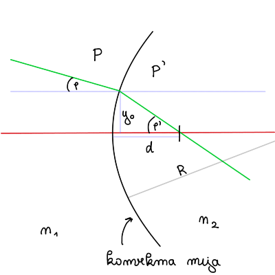
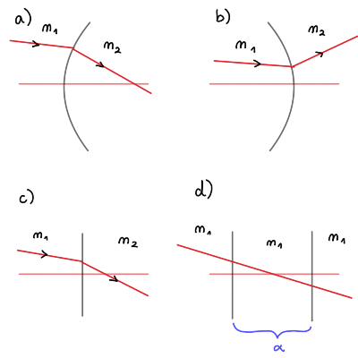
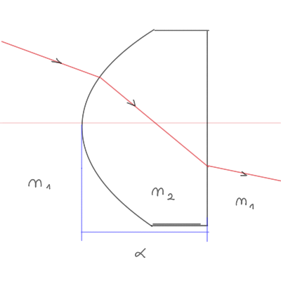

#+title: Vaje iz Fizikalnih merjenj, 12. teden v letu
#+subtitle: 2026/03/17
#+startup: nolatexpreview
#+startup: entitiespretty nil
#+startup: show2levels
#+latex_header: \usepackage{amsmath} \usepackage{unicode-math} \usepackage{cancel} \usepackage{graphicx}
#+latex_header: \renewcommand{\theta}{\vartheta} \renewcommand{\phi}{\varphi} \renewcommand{\epsilon}{\varepsilon}
#+latex_header: \newcommand{\odv}[1]{\dot{\vec{#1}}} \newcommand{\oddv}[1]{\ddot{\vec{#1}}}
#+latex_header: \newcommand{\rot}{\mathrm{rot}}\newcommand{\dive}{\mathrm{div}} \newcommand{\iu}{\mathrm{i}}
#+latex_header: \newcommand\mapsfrom{\mathrel{\reflectbox{\ensuremath{\mapsto}}}}
* Naloga: Kalmanov filter prožnega trka dveh teles - nadaljevanje

Nadaljujemo s problemom od zadnjič. Iskali smo dinamiko oblike

\[ \mathbf{v}' = \Phi \mathbf{v} + \mathbf{c} + \Gamma \mathbf{w}.
\]

Preko težiščnega sistema smo prišli do vrednosti hitrosti po trku za obe telesi

\[ v_1 ' = - v_1 + 2 v_T \quad \text{ in } \quad v_2 ' = - v_2 + 2 v_T,
\]

kjer je \( v_T = \frac{m_1 v_1 + m_2 v_2}{m _1 + m_2} \) težiščna hitrost.

V dobljenih hitrostih posameznega telesa razpišemo težiščno hitrost

\begin{align*}
  v_1 ' &= \frac{-m_1 v_1 - m_2 v_1 + 2m_1 v_2 + 2m_2 v_2}{m_1 + m_2} \\
&= \frac{m_1 v_1 - m_2 v_1 + 2 m_2 v_2}{m_1 + m_2} \\
&= \frac{1 - \mu}{1 + \mu} v_1 + \frac{2 \mu}{1 + \mu} v_2,
\end{align*}

kjer smo označili razmerje \( \mu = \frac{m_2}{m_1} \). Analogno lahko naredimo z drugo hitrostjo po trku

\[ v_2 ' = \frac{\mu - 1}{1 + \mu} v_2 + \frac{2 \mu}{1 + \mu}.
\]

Dobljeno lahko sedaj zapišemo v vektorski obliki

\[ \mathbf{v}' = \begin{bmatrix} v_{1}' \\ v_{2}' \end{bmatrix} = \frac{1}{1 + \mu} \begin{bmatrix}
                                                                                    1 - \mu & 2\mu \\
                                                                                    2 & \mu - 1
                                                                                     \end{bmatrix} \begin{bmatrix} v_{1} \\ v_{2} \end{bmatrix} + 0 + 0.
\]

Prepoznamo torej matriko \( \Phi \), hkrati pa vidimo, da sta \( \mathbf{c} = \Gamma \mathbf{w} = 0 \). Ker ni meritev, je kovariančna matrika izostrene ocene \( P \) kar kovariančna matrika \( M \). Dinamičnega šuma ni in torej imamo samo zapis

\[ P' = M' = \Phi P \Phi^T + \cancel{\Gamma Q \Gamma^T},
\]

kjer je \( P \) kovariančna matrika pred trkom.

Definiramo nove oznake \( A = \frac{1}{1 + \mu} \) in \( a = 1- \mu \) in matrika

\[ \Phi = A \begin{bmatrix}
            a & 2\mu \\
            2 & -a
             \end{bmatrix}.
\]

Sedaj lahko izračunamo matriko \( P' \)

\begin{align*}
 P' &= A ^2 \begin{bmatrix}
            a & 2\mu \\
            2 & -a
             \end{bmatrix} \begin{bmatrix}
                           \sigma_{1}^{2} & 0 \\
                           0 & \sigma_{2}^{2}
                            \end{bmatrix}
\begin{bmatrix}
a & 2 \\
2\mu & -a
 \end{bmatrix} \\
&= A ^2 \begin{bmatrix}
        a & 2\mu \\
        2 & -a
         \end{bmatrix}
\begin{bmatrix}
a \sigma_{1}^{2} & 2 \sigma_{1}^{2} \\
2 \mu \sigma^{2}_2 & -a \sigma_2 ^2
 \end{bmatrix}\\
&= A ^2 \begin{bmatrix}
        a ^2 \sigma_1 ^2 + 4 \mu ^2 \sigma_2 ^2 & 2 a \sigma_1 ^2 - 2 a \mu \sigma_2 ^2 \\
        2a \sigma_1 ^2 - 2 a \mu \sigma_2 ^2 & 4 \sigma_1 ^2 + \left( 1 - \mu \right) ^2 \sigma_2 ^2
         \end{bmatrix}
\end{align*}

Kovariančna matrika izostrene ocene je po trku torej

\[ P' = \frac{1}{\left( 1 + \mu \right) ^2} \begin{bmatrix}
                                            \left( 1 - \mu \right) ^2 \sigma_1 ^2 + 4 \mu ^2 \sigma_2 ^2 & 2 \left( 1 - \mu  \right) \left( \sigma_1 ^2 - \mu \sigma_2 ^2 \right) \\
                                            2 \left( 1 - \mu \right) \left( \sigma_1 ^2 - \mu \sigma_2 ^2 \right) & 4 \sigma_1 ^2 + \left( 1 - \mu \right) ^2 \sigma_2 ^2
                                             \end{bmatrix}
\]

Navkljub temu da je bila pred trkom \( P \) diagonalna in torej začetni hitrosti nista bili korelirani, po trku očitno sta. V primeru, da je \( m_1 = m_2 \), potem je \( \mu = 1 \) in

\[ P' = \begin{bmatrix}
        \sigma_{2} ^2 & 0 \\
         0& \sigma_1 ^2
         \end{bmatrix}
\]

V tem primeru se nedoločenosti po trku ravno zamenjata.
* Naloga: geometrijska optika
#+begin_problem
Žarek svetlobe z začetno kovariančno matriko

\[ P = \begin{bmatrix}
       \sigma_y ^2 & 0 \\
        0 & \sigma_{\phi} ^2
        \end{bmatrix}
\]

s lomi na konveksni meji. Kako se spremeni kovariančna matrika \( P' \) na prehodu?

Pri računih upoštevaj obosno aproksimacijo (ang. /paraxial approximation/), kjer je kot med žarkom in optično osjo majhen \( \tan \phi = \phi \).

#+end_problem
** Teorija: geometrijska optika

Žarek bomo predstvili z dvema parametroma \( y \) in \( \phi \), ki je v vektorski obliki

\[ \mathbf{y} = \begin{bmatrix} y_0 \\ \tan \phi \end{bmatrix} \approx \begin{bmatrix} y_0 \\ \phi \end{bmatrix}.
\]

Žarek po lomljenju pa je

\[ \mathbf{y}' = \begin{bmatrix} y_{0} \\ \phi' \end{bmatrix}.
\]

Lomljenje žarka bomo predstavili z matriko prehoda (ang. /transfer matrix/) \( A \).

Za naš specifičen primer, ki ga prikazuje slika v navodilih naloge je prehodna matrika

\[ A_{conv} = \begin{bmatrix}
              1 & 0 \\
              \frac{1}{R} \left( 1 - \frac{n_1}{n_2} \right) & \frac{n_1}{n_2}
               \end{bmatrix},
\]

kjer je \( R \) polmer konveksne leče.

Spodnja slika prikazuje ostale možnosti prehoda

s pripadajočimi matrikami:

a) konveksna meja
b) konkavna meja

   \[ A_{conc} = \begin{bmatrix}
                 1 & 0 \\
                \frac{1}{R} \left( \frac{n_1}{n_2} - 1 \right)  & \frac{n_1}{n_2}
                  \end{bmatrix}
   \]
c) ravna meja \( R \to \infty \)

   \[ A_{flat} = \begin{bmatrix}
                 1 & 0 \\
                 0 & - \frac{n_1}{n_2}
                  \end{bmatrix}
   \]
d) prehodi skozi območje dolžine \( \alpha \)

   \[ A_{\alpha} = \begin{bmatrix}
            1 & \alpha \\
            0 & 1
             \end{bmatrix}
   \]

Prehod je lahko tudi sestavljen, kakor prikazuje spodnja slika.

Prehod v tem primeru dobimo tako, da množimo matrike. Specifično za dano sliko prehod na konveksno območje označuje prehodna matrika

\[ \mathbf{y}_1 = A_{konv} \mathbf{y}.
\]

Sledi prehod skozi območje dolžine \( \alpha \), ki ga potem opišemo z

\[ \mathbf{y}_2 = A_{\alpha} \mathbf{y}_1 = A_{\alpha} A_{konv} \mathbf{y}.
\]

Prehod skozi ravno meja pa potem opisuje

\[ \mathbf{y}_3 = \mathbf{y}' = A_{flat} A_{\alpha} A_{konv} \mathbf{y}.
\]
** Rešitev naloge

Hitro lahko prepoznamo dinamiko, saj je matrika \( \Phi \) kar prehodna matrika

\[ \Phi = A_{konv} = \begin{bmatrix}
                     1 & 0 \\
                     \frac{1}{R} \left( 1 - \frac{n_1}{n_2} \right)   & \frac{n_1}{n_2}
                      \end{bmatrix}.
\]

Pri prehodu ni vmesnih merjenj, torej bo kovariančna matrika izostrene matrike \( P' \) kar kovariančna matrika \( M' \).

Podobno kot pri prejšnji nalogi izhajamo iz dinamike Kalmanovega filtra, za katerega velja

\[ P' = M' = \Phi P \Phi^T.
\]

Postopek množenja matrik je sledeč

\begin{align*}
  P' &= \begin{bmatrix}
        1 & 0 \\
        a & \frac{n_1}{n_2}
         \end{bmatrix}
\begin{bmatrix}
\sigma_y ^2 & 0 \\
0 & \sigma_{\phi} ^2
 \end{bmatrix}
\begin{bmatrix}
1 & a \\
0 & \frac{n_1}{n_2}
\end{bmatrix} \\
&= \begin{bmatrix}
   1 & 0 \\
   a & \frac{n_1}{n_2}
    \end{bmatrix}
\begin{bmatrix}
\sigma_y ^2 & a \sigma_y ^2 \\
0 & \frac{n_1}{n_2} \sigma_{\phi} ^2
 \end{bmatrix} \\
&=
\begin{bmatrix}
\sigma_y ^2 & a \sigma_y ^2 \\
a \sigma_y ^2 & a ^2 \sigma_y ^2 + \left( \frac{n_1}{n_2} \right) ^2 \sigma_{\phi} ^2
 \end{bmatrix},
\end{align*}

kjer smo za lažjo aritmetiko označili \( a = \frac{1}{R}\left( 1 - \frac{n_1}{n_2} \right) \).

Matrika \( P' \) je torej

\[ P' = \begin{bmatrix}
        \sigma_y ^2 & \frac{1}{R} \left( 1 - \frac{n_1}{n_2} \right) \sigma_y ^2 \\
         \frac{1}{R} \left( 1 - \frac{n_1}{n_2} \right) \sigma_y ^2 & \frac{1}{R ^2} \left( 1 - \frac{n_1}{n_2} \right) ^2 \sigma_y ^2 + \left( \frac{n_1}{n_2} \right) ^2 \sigma_{\phi} ^2
         \end{bmatrix}
\]

Opazimo lahko, da se varianca \( y \) pri prehodu ni spremenila, saj se \( y \) sam ni spremenil. Po drugi strani pa se je varianca \( \phi \) spremenila, saj se je pri prehodu spremenil kot \( \phi \).
* Teorija: Kalmanov filter z linearnimi vezmi

#+begin_my_example

Merimo notranje kote v trikotniku.

Prvi način je, da opravimo meritev

\[ \mathbf{z} = \begin{bmatrix} z_{\alpha} \\ z_{\beta} \\ z_{\gamma} \end{bmatrix}.
\]

Negotovosti teh kotov bodo enake in nekolinearne

\[ R = \begin{bmatrix}
       \sigma ^{2} & 0 & 0 \\
       0 & \sigma ^{2} & 0 \\
       0 & 0 & \sigma^{2}
       \end{bmatrix} = \sigma ^2 I,
\]

kjer je \( I \) identiteta. Najboljša začetna ocena \( \hat{\mathbf{x}} \) je torej kar prva meritev

\[ \hat{\mathbf{x}} = \begin{bmatrix} \alpha \\ \beta \\ \gamma \end{bmatrix} = \mathbf{z} = \begin{bmatrix} z_{\alpha} \\ z_{\beta} \\ z_{\gamma} \end{bmatrix}.
\]

Zgornja trditev bi bila resnična, vendar ima trikotnik eno vez - vsota kotov trikotnika je ravno \( \pi \). Torej je vez

\[ \gamma = \pi - \alpha  - \beta.
\]

Ob upoštevanju vezi bo najboljša ocena boljša od meritve same.

Parametra sta v primeru vezi samo dva

\[ \mathbf{x} = \begin{bmatrix} \alpha \\ \beta \end{bmatrix},
\]

in njuna ocena je

\[ \hat{\mathbf{x}} = \begin{bmatrix} \hat{\alpha} \\ \mathbf{\beta} \end{bmatrix}.
\]

Poleg tega pa imamo še meritev \( \mathbf{z} = (z_{\alpha}, z_{\beta}, z_{\gamma}) \).

Ocena bo torej

\[ \hat{\mathbf{x}} = \bar{\mathbf{x}} + K \left( \mathbf{z} - H \bar{ \mathbf{x}} \right),
\]

kjer je \( K = P H^T R^{-1} \) ojačevalni faktor in matrika \( P^{-1} = M^{-1} + H^T R^{-1} H \). V primeru, da gre kovariančna matrika \( M \to \infty \), potem nam ostane samo

\[ P^{-1} = H^T R^{-1} H.
\]

Ocena je v tem primeru

\begin{align*}
  \hat{\mathbf{x}} &= \bar{\mathbf{x}} + PH^T R^{-1} \mathbf{z} - P \underbrace{H^T R^{-1} H}_{P^{-1}} \bar{\mathbf{x}} \\
&= P H^T R^{-1}.
\end{align*}

Matriki \( H \) pravimo /okenska matrika/ oziroma matrika senzorja.

Meritev \( \mathbf{z} \) definiramo z okensko matriko \( H \) in vektorjem šuma \( \mathbf{r} \), torej

\[ \mathbf{z} = H \mathbf{x} + \mathbf{r} = \begin{bmatrix} 1 & 0 \\ 0 & 1 \\ -1 & -1 \end{bmatrix}\begin{bmatrix} \alpha \\ \beta \end{bmatrix} + \begin{bmatrix} r_{\alpha} \\ r_{\beta} \\ r_{\gamma} \end{bmatrix} + \begin{bmatrix} 0 \\ 0 \\ \pi \end{bmatrix}.
\]

Z zadnjo vrstico matrike \( H \) in zadnjim vektorjem smo opisali vez \( \gamma = \pi - \alpha \beta \). Meritev z vezjo je torej

\[ \mathbf{z}' = \begin{bmatrix} z_{\alpha} \\ z_{\beta} \\ z_{\gamma} - \pi \end{bmatrix} = \begin{bmatrix} 1 & 0 \\ 0 & 1 \\ -1 & -1 \end{bmatrix} \begin{bmatrix} \alpha \\ \beta \end{bmatrix} + \mathbf{r}.
\]

Sedaj lahko izračunamo inverz kovariančne matrike izostrene ocene, saj imamo okensko matriko \( H \) ter \( R \)

\begin{align*}
  P^{-1} &= H^T R^{-1} H \\
&= \begin{bmatrix} 1 & 0 & -1 \\ 0 & 1 & -1 \end{bmatrix} \sigma^{-2} I \begin{bmatrix} 1 & 0 \\ 0 & 1 \\ -1 & -1 \end{bmatrix} \\
&= \sigma^{-2} \begin{bmatrix}
               2 & 1 \\
               1 & 2
                \end{bmatrix}
\end{align*}

Trivialno opravimo inverz \( 2 \times 2 \) matrike in dobimo

\[ P = \sigma ^2 \frac{1}{3} \begin{bmatrix}
                             2 & -1 \\
                             -1 & 2
                              \end{bmatrix}.
\]

Sedaj lahko primerjamo rezultata. Brez vezi je bila najboljša ocena

\[ P = \sigma ^2 \begin{bmatrix}
                 1 & 0 & 0 \\
                 0 & 1 & 0 \\
                 0 & 0 & 1
                 \end{bmatrix}.
\]

Z vezjo pa imamo

\[ P = \frac{\sigma ^2}{3} \begin{bmatrix}
                           2 & -1 & -1 \\
                           -1 & 2 & -1 \\
                           -1 & -1 & 2
                           \end{bmatrix}.
\]

Matriko smo razširili na \( 3 \times 3 \) z razmislekom, da ima vez tri možnosti zapisa

\begin{align*}
  \gamma &= \pi - \alpha -\beta \\
\beta &= \pi - \alpha - \gamma \\
\alpha &= \pi - \gamma - \beta.
\end{align*}

in se koti torej obnašajo simetrično glede na vez. Naša ocena je boljša saj \( \frac{2}{3} \sigma ^2 < \sigma ^2 \).

Izostrena ocena je potem

\[ \hat{\mathbf{x}} = P H^T R^{-1} \mathbf{z}.
\]

Upoštevamo definicije posameznih matrik in dobimo

\begin{align*}
  \hat{\mathbf{x}} &= \frac{\sigma ^2}{3} \begin{bmatrix}
                                          2 & -1 \\
                                          -1 & 2
                                           \end{bmatrix} \begin{bmatrix} 1 & 0 & -1 \\ 0 & 1 & -1 \end{bmatrix} \sigma ^2 I \begin{bmatrix} z_{\alpha} \\ z_{\beta} \\ z_{\gamma - \pi} \end{bmatrix} \\
&= \frac{1}{3} \begin{bmatrix} 2 & -1 & -1 \\ -1 & 2 & -1 \end{bmatrix}
\begin{bmatrix} z_{\alpha} \\ z_{\beta} \\ z_{\gamma} - \pi \end{bmatrix} .
\end{align*}

Posamezne izostrene ocene so potem

\begin{align*}
  \hat{\alpha} &= \frac{1}{3} \left( 2 z_{\alpha} - z_{\beta} - z_{\gamma} + \pi \right) \\
\hat{\beta} &= \frac{1}{3} \left( - z_{\alpha} + 2 z_{\beta} - z_{\gamma} + \pi \right) \\
\hat{\gamma} &= \pi - \hat{\alpha} - \hat{\beta} = \frac{1}{3} \left( - z_{\alpha} - z_{\beta} + 2 z_{\gamma} + \pi \right).
\end{align*}
#+end_my_example
* Teorija: ostrenje s Kalmanovim filtrom z upoštevanjem linearnih vezi

Do sedaj je Kalmanov filter vključeval tri korake

1) ocena
2) meritev
3) ostrenje.

Sedaj dodamo nov korak - upoštevanje vezi.

Linearno vez v splošnem zapišemo kot

\[ A \mathbf{x} = \mathbf{b}.
\]

Oceno izostreno z vezjo bomo označevali z \( \tilde{\mathbf{x}} \) in zanjo velja

\[ \tilde{\mathbf{x}} = \hat{\mathbf{x}} - G \left( A \hat{\mathbf{x}} - \mathbf{b} \right), \quad G = A^T \left( AA^T \right)^{-1}.
\]

#+begin_my_example
Ponovno se vrnimo na primer merjenja kotov. Spremenljivke v vektorski obliki so

\[ \mathbf{x} = \begin{bmatrix} \alpha \\ \beta \\ \gamma \end{bmatrix},
\]

in vez \( \alpha + \beta + \gamma = \pi \) bo, da zadostimo splošni definiciji \( A \mathbf{x} = \mathbf{b} \) potem

\[ [1, 1, 1] \begin{bmatrix} \alpha \\ \beta \\ \gamma \end{bmatrix} = \pi.
\]

Ocena \( \tilde{\mathbf{x}} \) bo potem po definiciji

\[ \tilde{\mathbf{x}} = \left( I - G A \right) \hat{\mathbf{x}} + G \mathbf{b}.
\]

Upoštevamo, da je izostrena ocena brez vezi kar enaka meritvi

\[ \hat{\mathbf{x}} = \mathbf{z} = \begin{bmatrix} z_{\alpha} \\ z_{\beta} \\ z_{\gamma} \end{bmatrix}.
\]

Hitro lahko poračunamo matriko \( GA \)

\begin{align*}
  GA &= A^T \left( AA^T \right)^{-1} A \\
&= \begin{bmatrix} 1 \\ 1 \\ 1 \end{bmatrix} \left( [1, 1, 1] \begin{bmatrix} 1 \\ 1 \\ 1 \end{bmatrix} \right)^{-1} [1, 1, 1] \\
&= \frac{1}{3} \begin{bmatrix}
               1 & 1 & 1 \\
               1 & 1 & 1 \\
               1 & 1 & 1
               \end{bmatrix}.
\end{align*}

S tem lahko nadalje računamo člene v oceni \( \tilde{\mathbf{x}} \)

\[ I - GA = \frac{1}{3} \begin{bmatrix}
                        2 & -1 & -1 \\
                        -1 & 2 & -1 \\
                        -1 & -1 & 2
                         \end{bmatrix}.
\]

ter

\[ G \mathbf{b} = \pi A^T \left( A A^T \right)^{-1} = \frac{\pi}{3} \begin{bmatrix} 1 \\ 1 \\ 1 \end{bmatrix}.
\]

Preostane nam torej

\[ \tilde{\mathbf{x}} = \frac{1}{3} \begin{bmatrix}
                                    2 & -1 & -1 \\
                                    -1 & 2 & -1 \\
                                    -1 & -1 & 2
                                    \end{bmatrix} \begin{bmatrix} z_{\alpha} \\ z_{\beta} \\ z_{\gamma} \end{bmatrix} + \frac{\pi}{3} \begin{bmatrix} 1 \\ 1 \\ 1 \end{bmatrix}.
\]

Dobili smo

\begin{align*}
  \hat{\alpha} &= \frac{1}{3} \left( 2 z_{\alpha} - z_{\beta} - z_{\gamma} + \pi \right) \\
\hat{\beta} &= \frac{1}{3} \left( - z_{\alpha} + 2 z_{\beta} - z_{\gamma} + \pi \right) \\
\hat{\gamma} &= \pi - \hat{\alpha} - \hat{\beta} = \frac{1}{3} \left( - z_{\alpha} - z_{\beta} + 2 z_{\gamma} + \pi \right),
\end{align*}

kar je identično rezultatu od prej. Za razliko od prej pa smo šli po splošnem postopku, ki ni specifičen za ta problem.

Izračunajmo še kovariančno matriko izostrene ocene z vezjo

\[ \tilde{P} = \left( I - GA \right) P \left( I - GA \right)^T,
\]

kjer je začeten \( P = R = \sigma^2 I \). Razpišemo torej

\[ \tilde{P} = \sigma ^2 \left( I - GA \right) \left( 1 - GA \right)^T.
\]

Matrika \( GA \) je simetrična, saj velja

\begin{align*}
  \left( GA \right)^T &= \left( A^T \left( A A^T \right)^{-1} A \right)^T \\
&= A^T \left( A A^T \right)^{-1} A = GA.
\end{align*}

Posledično lahko zapišemo

\[ \left( I - GA \right)^T = I - \left( GA \right)^T = I - GA.
\]

Definiramo novo matriko \( D = GA = A^T \left( A A^T \right) ^{-1} A \). Kvadrat te matrike bo

\begin{align*}
  D ^2 &= GAGA \\
&=  A^T \left( A A^T \right)^{-1} A  A^T \left( A A^T \right)^{-1} A  \\
&= A^T \left( AA^T \right)^{-1} A = \\
&= GA = D.
\end{align*}

Opravka imamo torej z idempotentno matriko \( D ^2 = D \). Upoštevamo to lastnost in zapišemo

\begin{align*}
  \left( I - GA \right) \left( I - GA \right) &= I - GA - GA + D ^2 \\
&= I - GA.
\end{align*}

Sledi, da je torej kovariančna matrika

\[ \tilde{P} = \sigma ^2 \left(  I - GA \right) = \frac{\sigma ^2}{3} \begin{bmatrix}
                                                                      2 & -1 & -1 \\
                                                                      -1 & 2 & -1 \\
                                                                      -1 & -1 & 2
                                                                       \end{bmatrix}.
\]

Ponovno smo dobili enak rezultat kot prej, vendar je bila izpeljava splošnejša in hitrejša.
#+end_my_example
