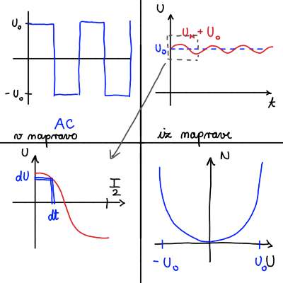
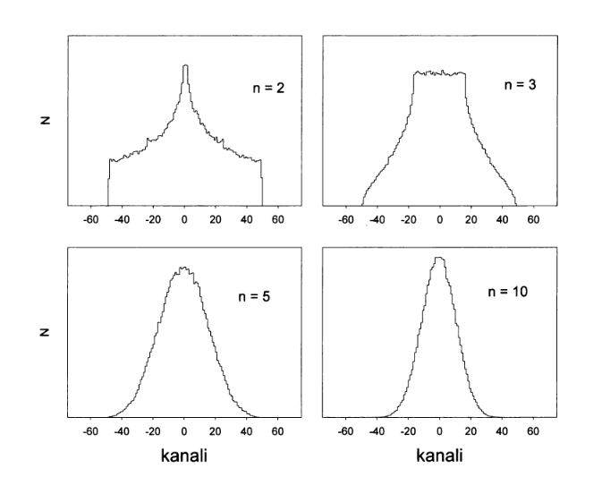
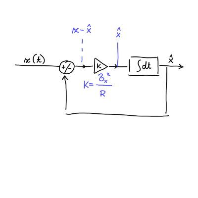

#+title: Optimalno filtriranje
#+startup: nolatexpreview
#+startup: entitiespretty nil
#+startup: show2levels
#+latex_header: \usepackage{amsmath} \usepackage{unicode-math} \usepackage{cancel} \usepackage{graphicx}
#+latex_header: \renewcommand{\theta}{\vartheta} \renewcommand{\phi}{\varphi} \renewcommand{\epsilon}{\varepsilon}
#+latex_header: \newcommand{\odv}[1]{\dot{\vec{#1}}} \newcommand{\oddv}[1]{\ddot{\vec{#1}}}
#+latex_header: \newcommand{\rot}{\mathrm{rot}}\newcommand{\dive}{\mathrm{div}} \newcommand{\iu}{\mathrm{i}}
#+latex_header: \newcommand\mapsfrom{\mathrel{\reflectbox{\ensuremath{\mapsto}}}}
#+bibliography: refs.bib
* Združevanje meritev 

#+begin_idea
Želimo sinhronizirati realni sistem \( S \) z modelskim sistemom \( M \) tako, da poznamo napako spremenljivk sistema \( M \) glede na prave vrednosti v sistemu \( S \).

Izmerek \( z \) spremenljivke \( x \) vsebuje tudi merilni šum \( r \)

\begin{equation}
\label{eq:1}
 z = x + r, 
\end{equation}
za katerega velja, da je porazdeljen po normalni porazdelitvi \( \mathcal{N}(0, \sigma) \). Velja \( \left\langle r \right\rangle = 0 \) in \( \left\langle r ^2 \right\rangle = \sigma ^2 \).

Imejmo \( z_i, i = 1, 2, 3, \ldots, N \) izmerkov z normalno porazdelitvijo \( \mathcal{N}(x, \sigma) \), ki so med seboj neodvisni. Povprečje izmerkov

\[ \bar{z} = \frac{1}{N} \sum\limits_{n = 1}^N z_i, 
\]
je porazdeljeno po *ožji* normalni porazdelitvi

\[ \frac{\mathrm{d} P}{\mathrm{d} z} = \mathcal{N} \left( x, \frac{\sigma}{\sqrt{N}} \right). 
\]

Dva seta meritev, prvega z \( N \) meritvami \( \left( \bar{z}_1, \sigma_1 = \frac{\sigma}{\sqrt{N}} \right) \), drugega z \( M \) meritvami \( \left( \bar{z}_2, \sigma_2 = \frac{\sigma}{\sqrt{M}} \right) \) optimalno združimo z inovacijo

\begin{equation}
\label{eq:4}
 \bar{z}_3 = \bar{z}_1 + \frac{\sigma_1 ^2}{\sigma_1 ^2 + \sigma_2 ^2} \left( \bar{z}_2 - \bar{z}_1 \right),
\end{equation}

kjer je razliki v drugem členu pravimo *inovacija*, faktorjem pred njo pa *utež*. Disperzija združitve pa je

\[ \frac{1}{\sigma_3 ^2} = \frac{1}{\sigma_1 ^2} + \frac{1}{\sigma_2 ^2},
\]
Do tega rezultata lahko pridemo na več načinov: definicija povprečja \( \bar{z}_3 \), kvadratna forma ali linearna kombinacija \( z_3 = \alpha z_1 + \beta z_2 \).
#+end_idea

#+attr_latex: :options [Pričakovane vrednosti šuma]
#+begin_izpeljava
Merilni šum \( r \) je porazdeljen po normalni porazdelitvi \( \frac{\mathrm{d} P}{\mathrm{d} r} = \mathcal{N}(0, \sigma) \). Po definiciji pričakovane vrednosti velja

\[ \left\langle r \right\rangle = \int\limits_{- \infty}^{\infty} \frac{\mathrm{d} P}{\mathrm{d} r} \cdot r \, \mathrm{d} r = 0,
\]
saj integriramo liho funkcijo \( r \) po sodem intervalu. Varianca šuma je po definiciji

\[ \left\langle \left( r - \left\langle r \right\rangle \right) ^2 \right\rangle = \left\langle r ^2 \right\rangle.
\]

Pričakovana vrednost kvadrata šuma je, ponovno po definiciji,

\begin{align*}
  \left\langle r ^2 \right\rangle &= \int\limits_{- \infty}^{\infty} \frac{\mathrm{d} P}{\mathrm{d} r} \cdot r ^2 \, \mathrm{d} r \\
&= \int\limits_{- \infty}^{\infty} \frac{1}{\sqrt{2 \pi} \sigma} r ^2 \exp \left\{ - \frac{r ^2}{2 \sigma ^2} \right\} \, \mathrm{d} r. 
\end{align*}
Z uvedbo nove spremenljivke \( u ^2 = \frac{r ^2}{2 \sigma ^2} \) in \( \mathrm{d} r = \sqrt{2 \sigma} \mathrm{d} u \) lahko izvrednotimo integral s pomočjo \( \Gamma \) funkcije

\[ \left\langle r ^2 \right\rangle = 2 \sigma ^2 \frac{1}{ \sqrt{\pi}} \int\limits_{- \infty}^{\infty} u ^2 e ^{- u ^2} \, \mathrm{d} u = \sigma ^2.
\]

Varianca šuma je torej \( \left\langle r ^2 \right\rangle = \sigma ^2\).
#+end_izpeljava

#+attr_latex: :options [Normalna porazdelitev povprečja]
#+begin_izpeljava
Šum lahko izrazimo s pomočjo spremenljivke \( x \) in izmerka \( z \) iz enačbe \eqref{eq:1} kot \( r = z - x \). Velja

\[ \left\langle r \right\rangle = 0 = \overline{\left( z_i  - x \right)}
\]
in posledično tudi

\[ \overline{\left( \bar{z} - x \right)} = 0, 
\]
saj je \( \bar{z} \) definirana z \( z_i \). Izračunati moramo še kvadrat pričakovane vrednosti

\[ \overline{\left( \bar{z} - x \right) ^2} = \overline{\left( \frac{1}{N} \sum\limits_{i = 1}^N z_i - x \right) ^2}.
\]
V nadaljevanju izpostavimo \( N^{-1} \) in zapišemo razliko izmerka in spremenljivke pod eno vsoto

\begin{align*}
   \overline{\left( \frac{1}{N} \sum\limits_{i = 1}^N z_i - x \right) ^2} &= \frac{1}{N ^2} \overline{\left( \sum\limits_{i = 1}^N z_i - N x \right) ^2} \\
&= \frac{1}{N ^2} \overline{\left[ \sum\limits_{i = 1}^N \left( z_i - x \right) \right] ^2}.
\end{align*}
Kvadrat vsote lahko ločimo na dva dela in upoštevamo, da imamo neodvisne meritve in velja \( r_i r_j = \delta_{ij} \)

\begin{align*}
   \frac{1}{N ^2} \overline{\left[ \sum\limits_{i = 1}^N \left( z_i - x \right) \right] ^2} &= \frac{1}{N ^2} \left[ \overline{\sum\limits_{i = 1}^N \left( z_i - x \right) ^2} + \overline{\sum\limits_{i = 1}^N \sum\limits_{j = 1, j\ne i}^N \left( z_i - x \right) \left( z_j - x \right)}  \right] \\
&= \frac{1}{N ^2} \left[ \sum\limits_{i=1}^N \sigma ^2 + \overline{\sum\limits_{i = 1}^N \sum\limits_{j = 1, j\ne i}^N r_i r_j} \right]
&= \frac{1}{N ^2} N \sigma ^2 = \frac{\sigma ^2}{N}.
\end{align*}

Povprečna vrednost je torej res porazdeljena po ožji normalni porazdelitvi

\[ \frac{\mathrm{d} P}{\mathrm{d} \bar{z}} = N \left( x, \frac{\sigma}{\sqrt{N}} \right).
\]
#+end_izpeljava

#+attr_latex: :options [Združevanje meritev - povprečje]
#+begin_izpeljava
Dva seta izmerkov z različnima disperzijama

\[ \bar{z}_1 = \frac{1}{N} \sum\limits_{i = 1}^N z_i, \ \sigma_1 ^2 = \frac{\sigma ^2}{N} \quad \text{ in } \quad \bar{z}_2 = \frac{1}{M} \sum\limits_{i = 1}^M z_i, \ \sigma_2 ^2 = \frac{\sigma ^2}{M}
\]

združimo v \( \left( \mathbf{z}_3, \sigma_3 \right) \) po definiciji povprečja

\[ \mathbf{z}_3 = \frac{1}{N + M} \sum\limits_{i = 1}^{N + M} z_i, \ \sigma_3 ^2 = \frac{\sigma ^2}{N + M}.
\]

Vsoto razdelimo na dve

\[ \mathbf{z}_3 = \frac{N}{N + M} \left( \frac{1}{N} \sum\limits_{i = 1}^N z_i \right) + \frac{M}{N + M} \left( \frac{1}{M} \sum\limits_{i = 1}^M z_i \right). 
\]
Uteži pred vsotama, \( \frac{N}{N + M} \) in \( \frac{M}{N + M} \), zapišemo z disperzijami \( \sigma_1, \sigma_2 \) in \( \sigma_3 \). Velja

\[ N = \frac{\sigma ^2}{\sigma_1 ^2} \quad \text{ in } \quad M = \frac{\sigma ^2}{\sigma_2 ^2}
\]
in njuna vsota je

\[ N + M = \frac{\sigma ^2}{\sigma_1 ^2} + \frac{\sigma ^2}{\sigma_2 ^2} = \frac{\sigma ^2}{\sigma_3 ^2}, 
\]
kjer smo upoštevali definicijo \( \sigma_3 \). Izpeljali smo zvezo

\begin{equation}
\label{eq:2}
 \sigma_3^{-2} = \sigma_1^{-2} + \sigma_2^{-2}.
\end{equation}

Sedaj nadomestimo vsote po \( N \) in \( M \) z variancami

\begin{align*}
  \frac{N}{N + M} &= \frac{\sigma ^2}{\sigma_1 ^2} \cdot \frac{\sigma_3 ^2}{\sigma ^2} \\
&= \frac{\sigma_3 ^2}{\sigma_1 ^2},
\end{align*}
in analogno za drugo utež. Iz zveze \eqref{eq:2} dobimo enakost

\[ \sigma_3 ^2 = \frac{\sigma_1 ^2 \sigma_2 ^2}{\sigma_1 ^2 + \sigma_2 ^2},
\]
ki jo upoštevamo v uteži, da zapišemo kot

\[ \mathbf{z}_3 = \frac{\sigma_2 ^2}{\sigma_1 ^2 + \sigma_2 ^2} \bar{z}_1 +\frac{\sigma_1 ^2}{\sigma_1 ^2 + \sigma_2 ^2} \bar{z}_2.
\]

Optimalno združena ocena je torej

\[ \bar{z}_3 = \mathbf{z}_1 + \frac{\sigma_1 ^2}{\sigma_1 ^2 + \sigma_2 ^2} \left( \bar{z}_2 - \bar{z}_1 \right). 
\]

#+end_izpeljava

#+attr_latex: :options [Združevanje meritev - kvadratna forma]
#+begin_izpeljava
Dve meritvi

\[ z_1 = \mathcal{N} \left( x, \sigma_1 \right) \quad \text{ in } \quad  z_2 = \mathcal{N} \left( x, \sigma_2 \right),
\]
pretvorimo na standarno normalno porazdelitev \( \mathcal{N} (0, 1) \)

\[ \mathcal{N}(0, 1) = \frac{\left( z_1 - x \right)}{\sigma_1} = \frac{\left( z_2 - x \right)}{\sigma_2}. 
\]

Kvadratna forma ima obliko

\[ 2 J(x) = \frac{\left( z_1 - x \right) ^2}{\sigma_1 ^2} + \frac{\left( z_2 - x \right) ^2}{\sigma_2 ^2},
\]
ki jo v iskanju optimalne združitve minimiziramo z odvodom,
\[ 0 = \frac{\mathrm{d} }{\mathrm{d} x} \left[ 2J(x) \right] = - \frac{2 \left( z_1 - x \right)}{\sigma_1 ^2} - \frac{2 \left( z_2 - x \right)}{\sigma_2 ^2}.
\]
Izpostavimo \( x \) in optimalna združitev je

\[ x = z_3 = \left( \sigma_1^{-2} + \sigma_2^{-2} \right)^{-1} \left[ \frac{z_1}{\sigma_1 ^2} + \frac{z_2}{\sigma_2 ^2} \right]. 
\]
#+end_izpeljava

#+ATTR_LATEX: :options [Združevanje meritev - linearna kombinacija]
#+begin_izpeljava
Dva izmerka

\[ \bar{z}_1 = x + r_1, \ \left\langle r_1 ^2 \right\rangle = \sigma_1 ^2 \quad \text{ in } \quad  \bar{z}_2 = x + r_2, \ \left\langle r_2 ^2 \right\rangle = \sigma_2 ^2
\]
združimo v novo oceno z linearno kombinacijo

\[ \bar{z}_3 = x + r_3 = \alpha \bar{z}_1 + \beta \bar{z}_2.
\]
Upoštevamo definicij izmerkov in enačimo koeficiente
\[ x + r_3 = \left( \alpha + \beta \right) x + \alpha r_1 + \beta r_2,
\]
ki nam podajata pogoja, kjer prvega \( \alpha + \beta = 1 \) upoštevamo v drugem

\[ r = \alpha r_1 + \beta \left( 1 - \alpha \right)r_2 = \alpha r_1 + \left( 1 - \alpha \right) r_2. 
\]
Pričakovana vrednost šumov \( r_1 \) in \( r_2 \) je \( 0 \) in enako velja za skupen šum. Iz pričakovane vrednosti kvadrata pa sledi

\begin{align*}
  \left\langle r_3 ^2 \right\rangle &= \left\langle \left[ \alpha r_1 + \left( 1 - \alpha \right) r_{2}  \right]^2 \right\rangle \\
&= \left\langle \alpha ^2 r_1 ^2 + \left( 1 - \alpha \right) ^2 r_2 ^2 + 2 \alpha (1 - \alpha) r_1 r_2 \right\rangle.
\end{align*}
Pričakovano vrednost apliciramo na vsak člen posebej ter upoštevamo nekoreliranost šumov

\[ \sigma_3 ^2 = \alpha ^2 \sigma_1 ^2 + \left( 1 - \alpha \right) ^2 \sigma_2 ^2.
\]
Optimalna vrednost disperzije je v minimumu, zato odvajamo v odvisnosti od parametra \( \alpha \)

\[ \frac{\mathrm{d} }{\mathrm{d} \alpha} \left( \sigma_3 ^2 \right) = 2 \alpha \sigma_1 ^2 - 2 \left( 1 - \alpha \right)   \sigma_2 ^2 = 0,
\]
iz česar sledita enakosti

\[ \alpha = \frac{\sigma_2 ^2}{\sigma_1 ^2 + \sigma_2 ^2} \quad \text{ in } \quad \beta = \frac{\sigma_1 ^2}{\sigma_1 ^2 + \sigma_2 ^2}.
\]
#+end_izpeljava
** Primer: Brumov šum
#+begin_idea
Brum ali brumov šum so motnje zaradi napajanja z AC napetostjo. Verjetnostna gostota za napetost \( U = U_0 \cos \left( \omega t \right) \) je

\[ \frac{\mathrm{d} P}{\mathrm{d} U}= \frac{1}{\pi} \frac{1}{\sqrt{U_0 ^2 - U ^2}}. 
\]

Centralni limitni izrek: Vsota velikega števila neodvisnih naključnih spremenljivk s končno disperzijo teži proti normalni porazdelitvi neodvisno od porazdelitvenih zakonov posameznih spremenljivk v vsoti. 

Zaradi centralnega limitnega izreka bo verjetnostna gostota vsote

\[ U_v = \frac{1}{N} \sum\limits_{i = 1}^N U_i,
\]
porazdeljena po normalni porazdelitvi

\[ \frac{\mathrm{d} P}{\mathrm{d} U_{v}} = \mathcal{N}(0, \sigma).
\]
#+end_idea

#+ATTR_LATEX: :width 0.5\textwidth :caption \caption{AC napetost, nihanje napetosti na izhodu naprave ter ena naključna meritev U}

Neko napravo napajamo z AC napetostjo in iz nje izhaja DC napetost, ki zaradi napajanja z AC napetostjo niha okoli neke vrednosti, ki je v povprečju \( 0 \). To nihanje opišemo z

\[ U = U_0 \cos \left( \omega t \right),
\]
njen odvod pa je

\[ \mathrm{d} U = - U_0 \omega \sin \left( \omega t \right) \mathrm{d}t.  
\]

Verjetnost, da ob \( \mathrm{d} t \in \left[ 0, \frac{T}{2} \right] \) izmerimo vrednost napetosti \( U = - U_0 \cos \left( \omega t \right) \) je

\begin{equation}
\label{eq:3}
 \mathrm{d} P = \frac{\mathrm{d} t}{\frac{T}{2}} = \frac{2}{T} \frac{\mathrm{d} U}{U_0 \omega \sin \left( \omega t \right)}. 
\end{equation}
Upoštevamo identiteto \( \sin ^2 \left( \omega t \right) = 1 - \cos ^2 \left( \omega t \right) \) za \( \omega = \frac{2 \pi}{T} \) in zapišemo \eqref{eq:3}

\begin{align*}
  \frac{\mathrm{d} P}{\mathrm{d} U} &= \frac{2}{T} \frac{T}{2 \pi} \frac{1}{U_0 \sqrt{\sin ^2 \left( \omega t \right)}}  \\
&= \frac{1}{\pi} \frac{1}{\sqrt{U_0 ^2 - U_0 \cos ^2 \left( \omega t \right)}} \\
&= \frac{1}{\pi} \frac{1}{\sqrt{U_0 ^2 - U ^2}}.
\end{align*}

To ni Gaussova porazdelitev, vendar kakor lahko vidimo na sliki 2.2 v Osnovah fizikalnih merjenj (str. 19) že za vsoto \( n = 10 \) merjenj napetosti, dobiva Gaussovo porazdelitev.

#+ATTR_LATEX: :width 0.5\textwidth :caption \caption{Prikaz centralnega limitnega izreka, \cite{likar_osnove_2016}, str. 19, slika 2.2}

** Združevanje odvisnih meritev
#+begin_idea
Dva seta meritev \( z_1 \) in \( z_2 \) s pripadajočima šuma \( w_1 \) in \( w_2 \). Velja

\[ \bar{z}_1 = x + w_1, \ \left\langle w_1 ^2 \right\rangle = \sigma_1 ^2 \quad \text{ in } \quad \bar{z}_2 = x + w_2, \ \left\langle w_2  ^2 \right\rangle = \sigma_2 ^2.
\]
Zaradi odvisnosti meritev pa velja tudi

\[ \left\langle w_1 w_2 \right\rangle = \sigma_{xy} = \rho_{12} \sigma_1 \sigma_2 \ne 0,
\]
kjer je \( \rho_{12} \) korelacijski koeficient z vrednostmi \( \left| \rho_{12} \right|  \leq 1 \).
Kovarianco lahko izračunamo tudi po enačbi

\[ \sigma_{12} = \overline{z_1 z_2} - \bar{z}_1 \bar{z}_2. 
\]
Optimalna ocena koreliranih meritev \( \hat{z} \) je

\[ \hat{z} = \left( \frac{1}{\sigma_1 ^2} + \frac{1}{\sigma_2 ^2} - \frac{2 \rho}{\sigma_1 \sigma_2} \right)^{-1} \left[ \frac{z_1}{\sigma_1 ^2} + \frac{z_2}{\sigma_2 ^2} - \frac{\rho (z_1 + z_2)}{\sigma_1 \sigma_2} \right]. 
\]

V primeru, da ni korelacije, torej \( \rho = 0 \), dobimo enačbo \eqref{eq:4}.

V primeru, da je korelacija popolna, torej \( \rho = 1 \), je optimalna ocena \( \hat{z} = z_2 = z_1 \).

Za poljuben \( \rho \), vendar \( \sigma_1 = \sigma_2 = \sigma \), potem je optimalna ocena

\[ \hat{z} = \frac{z_1 + z_2}{2}. 
\]
#+end_idea

#+attr_latex: :options [Izpeljava - kovarianca]
#+begin_izpeljava
Za dva seta meritev \( \left\{ x_i \right\} \) in \( \left\{ y_i \right\} \), kjer \( i = 1, 2, \ldots, N \) je kovarianca definirana kot

\[ \sigma_{xy} = \frac{1}{N} \sum\limits_{i= 1}^N \left( x_i + \bar{x} \right) \left( y_i - \bar{y} \right).
\]
Oklepaja zmnožimo med seboj znotraj vsote, da dobimo
\[ \frac{1}{N} \sum\limits_{i= 1}^N \left( x_i + \bar{x} \right) \left( y_i - \bar{y} \right) =\frac{1}{N} \sum\limits_{i = 1}^N \left( x_i y_i + \bar{x} y_i - x_i \bar{y} + \bar{x} \bar{y} \right).
\]
Vsoto na koncu razdelimo po posameznih členih

\begin{align*}
  \sigma_{xy} &= \frac{1}{N}\sum\limits_{i = 1}^N x_i y_i + \frac{1}{N} \bar{x} \sum\limits_{i = 1}^N y_i - \frac{1}{N} \bar{y} \sum\limits_{i = 1}^N x_i + \frac{1}{N} \bar{x} \bar{y} \sum\limits_{i = 1}^N 1 \\
&= \overline{xy} - \bar{x} \bar{y} - \bar{x} \bar{y} + \bar{x} \bar{y}  
\end{align*}
#+end_izpeljava

#+attr_latex: :options [Izpeljava - združevanje koreliranih ocen]
#+begin_izpeljava
Dva izmerka \( z_1 \) in \( z_2 \) s pripadajočima variancama \( \left\langle w_1 ^2 \right\rangle = \sigma_1 ^2 \) ter \( \left\langle w_2 \right\rangle = \sigma_2 ^2 \), kjer sta \( w_1, w_2 \) šuma

\[ z_1 = x + w_1 \quad \text{ in } \quad z_2 = x + w_2.
\]
Naj obstaja korelacija med šumoma, torej \( \left\langle w_1 w_2 \right\rangle = \sigma_{12} \ne 0 \). Posledično lahko šum prvega zapišemo kot linearno kombinacijo šuma drugega in neodvisnega dela

\[ w_1 = \alpha w_2 + w, \ \left\langle w_2 w \right\rangle = 0.
\]
V zgornji izraz sedaj šum nadomestimo z razliko izmerka in spremenljivke

\[ \left( z_1 - x \right) = \alpha \left( z_2 - x \right) + w, \ \left\langle w w_2 \right\rangle = \left\langle w (z_2 - x) \right\rangle = 0.
\]

V definicijo kovariance sedaj vstavimo linearno odvisnost ter upoštevamo \( \left\langle w \right\rangle = 0 \) in \( \left\langle w ^2 \right\rangle = \sigma ^2 \)

\begin{align*}
  \sigma_{12} &= \left\langle w_1 w_2 \right\rangle = \left\langle \left( \alpha w_2 + \xi \right) w_2 \right\rangle \\
&= \alpha \left\langle w_2 ^2 \right\rangle + \left\langle w w_2 \right\rangle = \alpha \sigma_2 ^2
\end{align*}

Hkrati pa za kovarianco velja \( \sigma_{12} = \rho_{12} \sigma_1 \sigma_2 \), iz česar sledi

\begin{equation}
\label{eq:6}
 \alpha = \rho_{12} \frac{\sigma_1}{\sigma_2}.
\end{equation}

Zapišemo še varianco prvega šuma

\begin{align*}
  \sigma_1 ^2 &= \left\langle w_1 ^2 \right\rangle = \left\langle \left( \alpha w_2 + w \right) ^2 \right\rangle \\
&= \left\langle a ^2 w_2 ^2 + w ^2 + 2 \alpha w_2 w \right\rangle \\
&= \alpha ^2 \sigma_1 ^2 + \sigma ^2
\end{align*}

Izraz \eqref{eq:6} sedaj upoštevamo v zgornjem in neodvisen šum zapišemo kot

\[ \sigma ^2 = \sigma_1 ^2 \left( 1 - \rho_{12} ^2 \right) 
\]

Optimalno združevanje ocen bomo izpeljali s pomočjo kvadratne forme 

\[ 2 J (x) = \frac{w_2 ^2(x)}{\sigma_2 ^2} + \frac{w ^2(x)}{\sigma ^2} = \frac{w_2 ^2}{\sigma_2 ^2} + \frac{\left( w_1 - \alpha w_2 \right) ^2}{\sigma ^2}
\]

Upoštevamo \eqref{eq:6} ter ulomka razstavimo

\[ 2 J(x) = \frac{w_2 ^2}{\sigma_2 ^2} \left[ 1 + \frac{\rho ^2}{\left( 1 - \rho ^2 \right)} \right] + \frac{w_1 ^2}{\sigma_1 ^2 \left( 1 - \rho ^2 \right)} - \frac{2 \rho w_1 w_2}{\sigma_1 \sigma_2 \left( 1- \rho ^2 \right)}.
\]
Upoštevamo, da je šum razlika izmerka in spremenljivke

\[ 2 J(x) = \frac{(z_2 - x) ^2}{\left( 1 - \rho ^2 \right) \sigma_2 ^2} + \frac{\left( z_1 - x \right) ^2}{\left( 1 - \rho ^2 \right)\sigma_1 ^2} - \frac{2 \rho \left[ (z_1 - x) (z_2 - x)  \right]}{\left( 1 - \rho ^2 \right) \sigma_1 \sigma_2},
\]

in minimiziramo v iskanju optimalne ocene

\begin{align*}
  \frac{\mathrm{d} }{\mathrm{d} x} \left[ 2 J(x) \right] &= 0\\
-\frac{2 (z_2 - x)}{\sigma_2 ^2} - \frac{2 (z_1 - x)}{\sigma_1 ^2} + \frac{2 \rho}{\sigma_1 \sigma_2} \left( 2x - (z_1 + z_2) \right) &= 0,
\end{align*}
in dobimo predpis za optimalno združevanje

\[ \hat{z} = \left[ \frac{1}{\sigma ^2_2} + \frac{1}{\sigma_1 ^2} - \frac{2 \rho}{\sigma_1 \sigma_2} \right] ^{-1} \left[ \frac{z_2}{\sigma_2 ^2} + \frac{z_1}{\sigma_1 ^2} - \frac{\rho (z_1 + z_2)}{\sigma_1 \sigma_2} \right]. 
\]
#+end_izpeljava
* Merjenje konstantnih skalarnih količin
#+begin_idea
Merimo količino \( x \) iz sistema \( S \), za katero vemo, da je konstantna. Na časovno periodo \( T \) razberemo nov izmerek \( z_i = x + r_i \), kjer je \( r_i \) šum porazdeljen po normalni porazdelitvi. Merilni šum je prav tako nekoreliran, torej

\[ \left\langle r_i r_j \right\rangle = \sigma ^2 \delta_{ij}.
\]

Optimalno oceno \( \hat{x}_n \) ob \( n \)-ti meritvi združimo z novim izmerkom \( z_{n + 1} \). Optimalna ocena \( n + 1 \) meritve je določena z enačbo

\begin{equation}
\label{eq:8}
 \hat{x}_{n + 1} = \hat{x}_n + \frac{\sigma_{n + 1} ^2}{\sigma ^2} \left( z_{n + 1} - \hat{x}_n \right), 
\end{equation}

kjer je \( \sigma_{n + 1} = \frac{\sigma ^2}{n + 1} \). Faktorju \( K_{n + 1} = \frac{\sigma_{n + 1} ^2}{\sigma ^2} \) pravimo ojačevalni faktor. To je *diferenčna enačba povratne zanke*.

Pri prehodu na zvezno sliko \( T \to 0 \) dobimo diferencialno enačbo

\[ \dot{\hat{x}} = \frac{\sigma_{\hat{x}} ^2 (t)}{R} \left( z(t) - \hat{x} (t) \right),
\]
in varianca je

\[ \dot{\sigma}_{\hat{x}} ^2 (t) = - \frac{\sigma_{\hat{x}} ^4 (t)}{R},
\]
kjer je \( R = \lim_{T \to 0} \sigma ^2 T > 0 \). Ob zmanjšanju časa med meritvami so sosednje meritve vse bolj korelirane, kar upoštevamo s tem, da se napaka meritev \( \sigma ^2 \) ustrezno povečuje in se \( R \) ohranja. 
#+end_idea

#+attr_latex: :width 0.5\textwidth :caption \caption{Shema povratne zanke.}

#+attr_latex: :options [Izpeljava diferenčne enačbe]
#+begin_izpeljava
Vzorčimo s časovno periodo \( T \) in ob vsaki meritvi dobimo izmerek \( z_i = x + r_i \). Šumi so nekorelirani \( \left\langle r_i r_j \right\rangle = \sigma ^2 \delta_{ij} \). Optimalna ocena s pripadajočo varianco ob \( n \)-ti meritvi je že znana

\[ \hat{x} = \frac{1}{n} \sum\limits_{i = 1}^n z_i \quad \text{ in } \quad \hat{\sigma}_n = \frac{\sigma ^2}{n}.
\]

Dodajmo sedaj izmereke \( z_{n + 1} \).  Po definiciji lahko optimalno meritev zapišemo

\[ \hat{x}_{n + 1} = \frac{1}{n + 1} \sum\limits_{i = 1}^{n + 1} z_i \quad \text{ in } \quad \hat{\sigma}_{n + 1} = \frac{\sigma ^2}{n + 1},
\]
vendar jo lahko zapišemo tudi z optimalno oceno iz \( n \)-tega koraka

\begin{align*}
  \hat{x}_{n + 1} &= \frac{1}{n + 1} \left( \sum\limits_{i = 1}^n z_i + z_{n + 1} \right) \\
&= \frac{n}{n + 1} \left( \frac{1}{n} \sum\limits_{i = 1}^n z_i \right) + \frac{1}{n + 1} z_{n + 1} \\
&= \frac{n}{n + 1} \hat{x}_n + \frac{1}{ n + 1} z_{n + 1}.
\end{align*}

Faktor pred \( n \)-to optimalno oceno razširimo z \( 1 - 1 \)

\[ \hat{x}_{n + 1} = \hat{x}_n + \frac{1}{n + 1} \left( z_{n + 1} - \hat{x}_n \right). 
\]

Utež želimo zapisati z varianco, za katero velja

\begin{equation}
\label{eq:7}
 \sigma_{n + 1} ^{-2} = \frac{n + 1}{\sigma ^2} = \sigma_n ^{-2} + \sigma^{-2}, 
\end{equation}

in sledi

\[ \hat{x}_{n + 1} = \hat{x}_n + \frac{\hat{\sigma}_{n + 1} ^2}{\sigma ^2} \left( z_{n + 1} - \hat{x}_n \right) 
\]
#+end_izpeljava

#+attr_latex: :options [Izpeljava diferencialne enačbe]
#+begin_izpeljava
Z naraščanjem pogostosti merjenja \( T \to 0 \) je limita

\[ \lim_{T \to 0} \frac{\hat{x}_{n + 1} - \hat{x}_n}{T} = \dot{\hat{x}} (t) = \frac{\hat{\sigma}_{n + 1}}{\sigma ^2 T} \left( z_{n + 1} - \hat{x}_n \right).
\]

V limiti označimo prehod na zvezno sliko \( \hat{x}_n \to \hat{x} \), \( \hat{\sigma}_n ^2 \to \hat{\sigma}_x ^2 \) in \( z_n \to z(t) \). Naš izmereke je torej oblike

\[ z(t) = x + r(t), 
\]
kjer za nekoreliranost zapišemo z

\[ \left\langle r(t) r'(t) \right\rangle = \delta(t - t') R.
\]

Diferenčna enačba je v limiti diferencialna enačba

\[ \dot{\hat{x}} (t) = \frac{\sigma_{\hat{x}} ^2}{R} \left[ z(t) - \hat{x}(t) \right], 
\]
če velja \( \lim_{T \to 0}  \left( \sigma ^2 T \right) = R > 0 \). S to limito ohranjamo potek merjenja v zvezni sliki enak merjenju na diskretni sliki. Če to ne bi veljalo, bi ocena \( \hat{x} \) neskončno hitro kazala pravo vrednost \( x \).

Variacijo v zvezni sliki zapišemo glede na \refeq{eq:7}. Velja

\[ \hat{\sigma}_{n + 1} ^2 = \left( \frac{1}{\hat{\sigma}_n ^2} + \frac{1}{\sigma ^2} \right)^{-1} = \frac{\hat{\sigma}_n ^2 \sigma ^2}{\hat{\sigma}_n ^2 + \sigma ^2},
\]
kar upoštevamo v limiti

\[ \dot{\hat{\sigma}}_x ^2 (t) = \frac{\hat{\sigma}_{n + 1} ^2 - \hat{\sigma}_n ^2}{T}.
\]

Zapišemo

\begin{align*}
  \dot{\hat{\sigma}}_x ^2 (t) &= \frac{1}{T} \left[ \frac{\hat{\sigma}_n ^2 \sigma ^2}{\hat{\sigma}_n ^2 + \sigma ^2} - \frac{\hat{\sigma}_n ^2 \left( \hat{\sigma}_n ^2 + \sigma ^2 \right)}{\left( \hat{\sigma}_n ^2 + \sigma ^2 \right)} \right]\\
&= - \frac{\left[ \hat{\sigma}_n ^2 (t)\right] ^2}{\cancel{\hat{\sigma}_n ^2 T} + \sigma ^2 T} = -\frac{\hat{\sigma}_n ^4}{R}.
\end{align*}

Negotovost se v limiti \( T \to 0 \) zmanjša na nič.
#+end_izpeljava
* Merjenje skalarne spremenljivke
#+begin_idea
Če nimamo informacij o spreminjanju količine, potem je najboljše čim gostejše in natančno merjenje. 

Če imamo informacijo o spreminjanju količine, pravimo, da poznamo *dinamični zakon* spremenljivke. Dinamični zakon se podaja v obliki diferencialne enačbe kot je

\begin{equation}
\label{eq:5}
 \dot{x} = A(t) x + c(t).  
\end{equation}
Diferenčno enačbo oblike ob \( n \)-ti meritvi
\[  x_{n + 1} = \Phi_n x_n + c_n,
\]
podajamo kot približek enačbe \eqref{eq:5}, kjer je \( \Phi_n = 1 + A(nT) \) in \( c_n = c(nT) T \). Z znano optimalno oceno \( \hat{x}_n \) in pripadajočo kovarianco \( \hat{\sigma}_n ^2 \), napovemo oceno ob času \( (n + 1) T \) z

\[ \bar{x}_{n + 1} = \Phi_n \hat{x}_n + c_n \quad \text{ in } \quad \bar{\sigma}_{n + 1} ^2 = \Phi_n ^2 \hat{\sigma}_n ^2,
\]
ki jo nato izostrimo z novim izmerkom \( z_{n + 1} \)

\[ \hat{x}_{n + 1} = \bar{x}_{n + 1} + \frac{\bar{\sigma}_{n + 1} ^2}{\bar{\sigma}_{n + 1} ^2 + \sigma ^2} \left( z_{n + 1} - \bar{x}_{n + 1} \right). 
\]
Pripadajoča varianca je
\[ \hat{\sigma}_{n + 1} ^2 = \frac{\bar{\sigma}_{n + 1} ^2 \sigma ^2}{\bar{\sigma}_{n + 1} ^2 + \sigma ^2}. 
\]

Uvedemo nove oznake za oceno variance, izostreno oceno variance ter ojačevalni faktor.

\begin{align*}
\bar{\sigma}_{n + 1} ^2 &= M_{n + 1} = \Phi_n ^2 \hat{\sigma}_n ^2 = \Phi_n P_n \\
\hat{\sigma}_{n + 1} ^2 &= P_{n + 1} = M_{n + 1} - \frac{M_{n + 1} ^2}{M_{n + 1} ^2 + \sigma ^2} \\
\frac{\bar{\sigma}_{n + 1} ^2}{\bar{\sigma}_{n + 1} ^2 + \sigma ^2} &= K_{n + 1} = \frac{P_{n + 1}}{\sigma ^2}.
\end{align*}

Ker dinamike v sistemu \( S \) ne poznamo eksaktno, pomeni, da imata \( \Phi_n \) in \( c_n \) svojo negotovost, ki jo predstavimo v obliki dinamičnega žuma \( \Gamma_n w_n \), za katerega velja

\[ \left\langle w_n w_n' \right\rangle = \delta_{n, n'} Q_n.
\]
Posodobljen člen ocene variance je potem

\[ M_{n + 1} = \Phi_n P_n + \Gamma_n ^2 Q_n,  
\]
vsi ostali členi pa ga ne vsebujejo.

Pri prehodu na zvezno sliko za \( T \to 0 \) velja

\[ \dot{\hat{x}} (t) = A(t) \hat{x}(t) + c(t) + \frac{P(t)}{R(t)} \left[ z(t) - \hat{x}(t) \right], 
\]
kjer so \( \lim_{T \to 0} \left( \sigma ^2 T \right) = R(t) \), \( \lim_{T \to 0} P_{n + 1} = P(t) \) ter \( \lim_{T \to 0} \Phi_n = 1 \). Enačba za disperzijo je

\[ \dot{P}(t) = 2A(t) P(t) - \frac{P ^2 (t)}{R(t)} + \Gamma ^2 (t) Q(t),
\]
kjer je \( \lim_{T \to 0} TQ_n = Q(t) \) in \( \Gamma ^2 = \lim_{T \to 0} \frac{\Gamma_n ^2}{T ^2} \).
#+end_idea

#+attr_latex: :options [Izostrena ocena diferenčne enačbe]
#+begin_izpeljava
V diskretnem prostoru, kjer vzorčimo s časovno periodo \( T \) pretvorimo diferencialno enačbo \eqref{eq:5} v diferenčno z upoštevanjem

\[ \dot{x} = \frac{x_{n + 1} - x_n}{T},
\]
kjer je \( x_n = (nT) \) ter \( x_{n + 1} = x[(n + 1) T] \), ki ga izrazimo

\[ x_{n + 1} = x_n + A (nT) T x_n + c(nT) T. 
\]

Z uvedbo \( \Phi_n = 1 + A(nT) T \) in \( c_n = c(nT) T \) dobimo diferenčno enačbo

\[ x_{n + 1} = \Phi_n x_n + c_n. 
\]

Po \( n \) vzorčenjih imamo optimalno oceno \( \hat{x}_n \) in pripadajočo varianco \( \hat{\sigma} ^2_n \), s katerima lahko preko diferenčne enačbe napovemo oceno

\[ \bar{x}_{n + 1} = \Phi_n \hat{x}_n + c_n. 
\]

Do variance \( \bar{\sigma}_{n + 1} ^2 \) po definiciji variance

\[ \bar{\sigma}_{n + 1} ^2 = \left\langle \left( \bar{x}_{n + 1}  - x_{n + 1} \right) ^2 \right\rangle,
\]
v kateri upoštevamo napoved ocene

\begin{align*}
  \bar{\sigma}_{n + 1} ^2 &= \left\langle \left[ \left( \Phi_n \hat{x}_n + c_n \right) - \left( \Phi_n x_n - c_n \right) \right] ^2 \right\rangle \\
&= \left\langle \left[ \Phi_n \left( \hat{x}_n - x_n \right) \right] ^2 \right\rangle.
\end{align*}
V zadnji vrstici prepoznamo definicijo disperzije za izostreno oceno \( \hat{\sigma}_n ^2 \) in posledično velja

\[ \bar{\sigma}_{n + 1} = \Phi_n ^2 \hat{\sigma}_n ^2. 
\]

Oceno \( \bar{x}_{n + 1} \) in pripadajočo disperzijo izostrimo z novim izmerkom \( z_{n + 1} \) z enačbo \eqref{eq:8}

\[ \hat{x}_{n + 1} = \bar{x}_{n + 1} + \frac{\hat{\sigma}_{n + 1} ^2}{\sigma ^2} \left( z_{n + 1} - \bar{x}_{n + 1} \right). 
\]

in varianca izostrene ocene je

\[ \hat{\sigma}_{n + 1} ^2 = \left( \bar{\sigma}_{n + 1} ^{-2} + \sigma^{-2} \right)^{-1} = \frac{\bar{\sigma}_{n + 1} ^2 \sigma ^2}{\bar{\sigma}_{n + 1} ^2 + \sigma ^2},
\]
s čimer posodobimo zapis izostrene ocene

\begin{equation}
\label{eq:10}
 \hat{x}_{n + 1} = \bar{x}_{n + 1} + \frac{\bar{\sigma}_{n + 1} ^2}{\bar{\sigma}_{n + 1} ^2 + \sigma ^2} \left( z_{n + 1} - \bar{x}_{n + 1} \right). 
\end{equation}
#+end_izpeljava

#+attr_latex: :options [Dinamični šum]
#+begin_izpeljava
Kot smo napisali v povzetku, pri zgornji izpeljavi smo privzeli, da se spremenljivke točno ujemajo z dinamično enačbo. V resnici členov \( \Phi_n \) in \( c_n \) ne poznamo eksaktno in imata pripadajočo negotovost. To rešimo z uvedbo člena dinamičnega šuma \( \Gamma_n w_n \), kjer velja \( \left\langle w_n \right\rangle = 0 \) in \( \left\langle w_n w_{n'} \right\rangle = \delta_{n n'} Q_n \).

Odstopanje v sistemu \( M \) od spremenljivke v sistemu \( S \) pri izostreni oceni \( \hat{x}_{n + 1} \) ne bo imelo vpliva, bo pa vplivalo na negotovost

\begin{align*}
  M_{n + 1} = \bar{\sigma}_{n + 1} &= \left\langle \left( \bar{x}_{n + 1} - x_{n + 1} \right) ^2 \right\rangle \\
&= \left\langle \left[ \left( \Phi_n \hat{x}_n + c_n \right) - \left( \Phi_n x_n + c_n + \Gamma_n w_n \right) \right] ^2 \right\rangle \\
&= \left\langle \left[ \Phi_n \left( \hat{x}_n - x_n \right) - \Gamma_n w_n \right] ^2 \right\rangle.
\end{align*}
Korelacije med \( \hat{x}_n, x_n \) in \( w_n \), zato po kvadriranju ostane

\begin{align*}
  M_{n + 1} &= \left\langle \Phi_n ^2 \left( \hat{x}_n - x \right) ^2 + \left( \Gamma_n w_n \right) ^2 \right\rangle \\
&= \Phi_n ^2 P_n + \Gamma_n ^2 \left\langle w_n ^2 \right\rangle \\
&= \Phi_n ^2 P_n + \Gamma_n ^2 Q_n
\end{align*}
#+end_izpeljava

#+attr_latex: :options [Prehod na zvezno sliko]
#+begin_izpeljava
Enačbo \eqref{eq:10} ponesemo v čas \( (n + 1)T \)

\[ \hat{x}_{n + 1} = \Phi_n \hat{x}_n + K_n \left( z_n - \Phi_n \hat{x}_n \right) + c_n, 
\]
ki jo pretvorimo v
\begin{equation}
\label{eq:11}
 \frac{\hat{x}_{n + 1} - \hat{x}_n}{T} = \frac{\left( \Phi_n - 1 \right)}{T} \hat{x}_n + \frac{c_n}{T} + \frac{P_{n + 1}}{\sigma ^2 T} \left( z_{n + 1} - \hat{x}_{n} \right),
\end{equation}
s pomočjo ocene \( \bar{x}_n \). 

Ob upoštevanju limite \( T \to 0 \)

\begin{align*}
  \lim_{T \to 0} \left( \sigma ^2 T \right) &= R(t) \\
\lim_{T \to 0} P_{n + 1} &= P(t) \\
\lim_{T \to 0} \Phi_n &= 1 \\
\lim_{T \to 0} \frac{\Phi_n - 1}{T} &= A(t),
\end{align*}
preide enačba \eqref{eq:11} v obliko

\[ \dot{\hat{x}} (t) = A(t) \hat{x}(t) + c(t) \frac{P(t)}{R(t)} \left[ z(t) - \hat{x}(t) \right],
\]
s katero sledimo merjeni količini \( x \), v katero dodamo inovacijo \( z(t) - \hat{x}(t) \). Ojačevalni faktor \( \frac{P(t)}{R(t)} \) se s časom spreminja, saj se spreminja tudi stopnja usklajenosti med sistemoma \( S \) in \( M \), ki jo meri \( P(t) \) \cite{likar_osnove_2016}.

Do negotovosti pridemo na podoben način preko enačbe

\[ P_{n + 1} = M_{n + 1} - \frac{M_{n + 1} ^2}{M_{n + 1}  + \sigma ^2} = \Phi_n  ^2 P_n  + \Gamma_n Q_n - \frac{\left( \Phi_n ^2 P_n + \Gamma_n Q_n \right) ^2}{M_{n + 1} + \sigma ^2},
\]
kjer zapišemo

\[ \frac{P_{n + 1} - P_n}{T} = \frac{\left( \Phi_n ^2 - 1 \right) P_n}{T} + \frac{\Gamma_n ^2 Q_n}{T} - \frac{\Phi_n ^2 P_n ^2 + 2 \Phi_n ^2 P_n \Gamma_n ^2 Q_n + \Gamma_n ^4 Q_n ^2}{T M_{n + 1} + \sigma ^2 T}.
\]
Upoštevamo limito \( T \to 0 \) in lahko prvi člen zapišemo kot

\[ \lim_{T \to 0}  \frac{\left( \Phi_n ^2 - 1 \right)P_n}{T} = \lim_{T \to 0}  \left( \Phi_n - 1 \right) \frac{\left( \Phi_n - 1 \right)}{T} P_n = 2 A P(t).
\]

Definiramo limito \( \lim_{T \to 0} \left( Q_n T \right) = Q(t) \) in drugi člen zapišemo na sledeč način

\[ \lim_{T \to 0} \frac{\Gamma_n ^2 Q_n}{T} = \lim_{T \to 0}  \frac{\Gamma_n ^2 Q_n T}{T ^2} = \Gamma ^2 Q.
\]

Zadnji člen v limiti pa je

\begin{align*}
  \lim_{T \to 0} \frac{\Phi_n ^2 P_n ^2 + 2 \Phi_n ^2 P_n \Gamma_n ^2 Q_n + \Gamma_n ^4 Q_n ^2}{T M_{n + 1} + \sigma ^2 T} &= \lim_{T \to 0}\left[ \frac{1}{T M_{n + 1} + \sigma ^2 T} \left( \Phi_n ^2 P_n ^2 + 2 \Phi_n ^2 P_n \Gamma_n ^2 Q_n \frac{T ^2}{T ^2} + \Gamma_n ^4 Q_n ^2 \frac{T ^4}{T ^4} \right)\right] \\
&= \frac{1}{T M(t) + R} \left[ P ^2 (t) + 2 P \Gamma ^2 Q \lim_{T \to 0} (T) + \Gamma ^4 (t) Q(t) \lim_{T \to 0} T ^2 \right] \\
&= \frac{P ^2}{R},
\end{align*} 
kjer smo upoštevali limiti 

\[ \lim_{T \to 0}  \left( \frac{\Gamma_n}{T} \right) = \Gamma(t) \quad \text{ in } \quad \lim_{T \to 0}  \left( Q_n T \right) = Q(t).
\]

Negotovost v zveznem spektru je potlej

\[ \dot{P}(t) = 2 A(t) P(t) - \frac{P ^2 (t)}{R(t)} + \Gamma ^2 Q(t), 
\]
kjer prvi člen opisuje širjenje napake spremenljivke \( x \), drugi člen zmanjšuje negotovost zaradi dotoka novih meritev, tretji člen pa povečuje negotovost ocene z upoštevanjem dinamičnega šuma. 
#+end_izpeljava
* Merjenje vektorskih spremenljivk
#+begin_idea
Spremenljivke sistema \( S \), ki nas zanimajo, zberemo v vektor

\[ \mathbf{x} = [x_1, x_2, x_3, \ldots, x_n]^T \in \mathbf{R}^n.
\]

(Izostrene) ocene v sistemu \( M \) prav tako zberemo v vektor,

\[ \bar{\mathbf{x}} = [\bar{x}_1, \bar{x}_2, \bar{x}_3, \ldots, \bar{x}_n]^T. 
\]
Disperzijo in korelacijo, ki pripada ocenam v sistemu \( S \) zapišemo s kovariančno matriko \( \mathsf{M} \)

\[ \mathsf{M} = \left\langle \left( \bar{\mathbf{x}} - \mathbf{x} \right) \left( \bar{\mathbf{x}} - \mathbf{x} \right)^T \right\rangle = \begin{bmatrix}
                                                                                                                                         \sigma_1 ^2 & \sigma_{12} & \ldots & \sigma_{1n} \\
                                                                                                                                         \sigma_{21} & \sigma_2 ^2 & & \vdots \\
                                                                                                                                         \vdots &  & \ddots & \\
                                                                                                                                         \sigma_{n1} & \ldots & & \sigma_n ^2 
                                                                                                                                         \end{bmatrix},
\]
kjer so diagonalni matrični elementi znane disperzije, izvendiagonalni elementi \( \sigma_{ij} \) pa so korelacije med različnimi spremenljivkami. Kovariančno matriko izostrenih ocen označimo s \( \mathsf{P} \) in se jo izračuna analogno \( \mathsf{M} \) kot

\[ \mathsf{P} = \left\langle \left( \hat{\mathbf{x}} - \mathbf{x} \right) \left( \hat{\mathbf{x}} - \mathbf{x} \right)^T \right\rangle 
\]
Matriki \( \mathsf{M} \) in \( \mathsf{P} \) sta simetrični ter pozitivno definitni. Gostota verjetnosti \( p \) vektorske spremenljivke \( \bar{\mathbf{x}} \) zapišemo z večrazsežno normalno porazdelitvijo

\[ p(\bar{\mathbf{x}}) = \frac{1}{\sqrt{\left( 2 \pi \right)^n \det \mathsf{M}}} \exp \left\{ - \frac{1}{2} \left( \mathbf{x} - \bar{\mathbf{x}} \right)^T \mathsf{M}^{-1} \left( \mathbf{x} - \bar{\mathbf{x}} \right) \right\} 
\]

Pri merjenju ene spremenljivke znotraj vektorja \( \mathbf{x} \), lahko ostrimo tudi kakšno drugo komponento vektorja (glej primer za hitrost).

Pri merjenju vektorskih spremenljivk imamo lahko več senzorjev \( s \), ki vsak meri eno ali več spremenljivk vektorja \( \mathbf{x} \). Signale iz senzorjev zapišemo v vektor

\[ \mathbf{z} = \left[ z_1, z_2, z_3, \ldots, z_s \right] ^T \in \mathbf{R}^s.
\]

Za linearen odziv in idealen senzor velja

\[ \mathbf{z} = \mathsf{H} \mathbf{z} - \mathbf{r},
\]
kjer je \( \mathsf{H} \) senzorsko okno, \( \mathbf{r} \) pa je vektor šumov, ki pripada vsakemu senzorskemu signalu in so lahko korelirani. Zapišemo torej kovariančno matriko merilnega šuma

\[ \mathsf{R} = \left\langle \mathbf{r} \mathbf{r}^T \right\rangle.
\]

Oceno \( \bar{\mathbf{x}} \) želimo izostriti z meritvami \( \mathbf{z} \), kar naredimo z enačbo

\[ \hat{\mathbf{x}} = \bar{\mathbf{x}} + \mathsf{P} \mathsf{H}^T \mathsf{R}^{-1} \left( \mathbf{z} - \mathsf{H} \bar{\mathbf{x}} \right),
\]
do katere pridemo s pomočjo Lagrangeovo metodo multiplikatorja. Pripadajočo kovariančno matriko \( \mathsf{P} \) določa enačba

\[ \mathsf{P} = \mathsf{M} - \mathsf{M} \mathsf{H}^T \left( \mathsf{H} \mathsf{M} \mathsf{H}^T + \mathsf{R} \right)^{-1} \mathsf{H} \mathsf{M}. 
\]

Naj sistem \( S \) sledi dinamični enačbi oblike

\[ \mathbf{x}_{n + 1} = \Phi_n \mathbf{x}_n + \mathbf{c}_n + \Gamma_n \mathbf{w}_n, 
\]
kjer sta \( \Phi_n, \Gamma_n \) matriki, \( \mathbf{c}_n \) znan vektor in \( \mathbf{w}_n \) naključen vektor s povprečjem nič in kovariančno matriko \( \left\langle \mathbf{w}_n \mathbf{w}_{n'}^T \right\rangle = Q_n \delta_{n, n'}\). Pri prehodu iz \( n \)-te meritve na \( (n + 1) \)-to meritev najprej zapišemo oceno

\[ \bar{\mathbf{x}}_{n + 1} = \Phi_n \hat{\mathbf{x}} + \mathbf{c}_n,
\]
ki ji pripada kovariančna matrika 

\[ \mathsf{M}_{n + 1} = \Phi_n \mathsf{P}_n \Phi_n^T + \Gamma_n Q_n \Gamma_n^T. 
\]

Izostreno oceno določa enačba

\[ \hat{\mathbf{x}}_{n + 1} = \bar{\mathbf{x}}_{n + 1} + K_{n + 1} \left( \mathbf{z}_{n + 1} - \mathsf{H} \bar{\mathbf{x}}_{n + 1} \right),
\]
kjer je

\[ K_{n + 1} = \mathsf{P}_{n + 1} \mathsf{H}^T \mathsf{R}_{n + 1}^{-1},
\]
in

\[ \mathsf{P}_{n + 1} = \mathsf{M}_{n + 1} - \mathsf{M}_{n + 1} \mathsf{H}^T \left( \mathsf{H} \mathsf{M}_{n + 1} \mathsf{H}^T + \mathsf{R}_{n + 1} \right) ^{-1} \mathsf{H} \mathsf{M}_{n + 1}. 
\]

Pri prehodu na zvezno sliko je optimalna shema za sledenje zvezni spremenljivki

\[ \dot{\hat{\mathbf{x}}} (t) = A(t) \hat{\mathbf{x}} + c(t) + \mathsf{P} \mathsf{H}^T \mathsf{R}^{-1} \left( \mathbf{z} - \mathsf{H} \hat{\mathbf{x}}(t) \right),
\]
kjer je \( A(t) = \lim_{T \to 0}  \frac{\Phi_{n + 1} - 1}{T} \) in \( c(t) = \lim_{T \to 0} \frac{\mathbf{c}_n}{T} \).

Kovariančna matrika izostrene ocene je

\[ \dot{\mathsf{P}} = A \mathsf{P} + \mathsf{P} A^T + \Phi Q \Phi^T - \mathsf{P} \mathsf{H}^T \mathsf{R}^{-1} \mathsf{H} \mathsf{P}
\]

Zgornja enačba se imenuje Ricattijeva enačba. Tretji člen podaja dinamični šum, zadnji člen pa zmanjšuje vrednost izraza zaradi dotoka novih meritev. 
#+end_idea

#+attr_latex: :options [Združevanje vektorskih meritev]
#+begin_izpeljava
Oceno

\[ \bar{\mathbf{x}} = \mathbf{x} + \mathbf{m}, \ \left\langle \mathbf{m} \mathbf{m}^T \right\rangle = \mathsf{M}
\]
želimo združiti z izmerkom

\[ \mathbf{z} = \mathsf{H} \mathbf{x} + \mathbf{r}, \ \left\langle \mathbf{r} \mathbf{r}^T \right\rangle = \mathsf{R},
\]
da dobimo optimalno oceno \( \hat{\mathbf{x}} \), ki bo linearna kombinacija vseh ocen in meritev

\begin{equation}
\label{eq:9}
 \hat{\mathbf{x}} = \mathsf{A} \bar{\mathbf{x}} + \mathsf{B} \mathbf{z}, 
\end{equation}
kjer matriki \( \mathsf{A} \in \mathbf{R}^{n \times n} \) in \( \mathsf{B} \in \mathbf{R}^{n \times s} \) vsebujeta uteži za komponente vektorjev \( \mathbf{x} \) in \( \mathbf{z} \). Za izostreno oceno mora veljati oblika

\begin{equation}
\label{eq:12}
 \hat{\mathbf{x}} = \mathbf{x} + \mathbf{p}, 
\end{equation}
kjer je vektor \( \mathbf{p} \) vektor naključnih odmikov izboljšane ocene \( \hat{\mathbf{x}} \). V linearni kombinaciji \eqref{eq:9} upoštevamo definicijo ocene in izmerka ter jo primerjamo z obliko \eqref{eq:12}

\[ \hat{x} = \mathbf{x} + \mathbf{p} = \mathsf{A}(\mathbf{x} + \mathbf{m}) + \mathsf{B} \left( \mathsf{H} \mathbf{x} + \mathbf{r} \right) = \left( \mathsf{A} + \mathsf{B} \mathsf{H} \right) \mathbf{x} + \mathsf{A} \mathbf{m} + \mathsf{B} \mathbf{r}, 
\]
od koder dobimo enačbi 

\begin{align}
  \mathsf{A} + \mathsf{B} \mathsf{H} &= \mathsf{I} \\ \label{ali:1}
\mathsf{A} \mathbf{m} + \mathsf{B} \mathbf{r} &= \mathbf{p}, \label{ali:2}.
\end{align}
kjer je \( \mathsf{I} \) identiteta.

V iskanju optimalne ocene minimiziramo kovariančno matriko \( \mathsf{P} \), v kateri upoštevamo \eqref{ali:2}

\begin{equation}
\label{eq:13}
\begin{aligned}
  \mathsf{P} &= \mathbf{p} \mathbf{p}^T = \left( \mathsf{A} \mathbf{m} + \mathsf{B} \mathbf{r} \right) \left( \mathsf{A} \mathbf{m} + \mathsf{B} \mathbf{r} \right)^T \\
&= \mathsf{A} \mathbf{m} \mathbf{m}^T A^T + \mathsf{B} \mathbf{r} \mathbf{r}^T B^T \\
&= \mathsf{A} \mathsf{M} A^T + \mathsf{B} \mathsf{R} \mathsf{B}^T.
\end{aligned}
\end{equation}

Kovariančno matriko bomo minimizirali s pomočjo Langreeve metode, v kateri moramo upoštevati vez \eqref{ali:1}

\[ \tilde{\mathsf{P}} = \mathsf{A} \mathsf{M} \mathsf{A}^T + \mathsf{B}\mathsf{R}\mathsf{B}^T - \lambda \left( \mathsf{A} + \mathsf{B} \mathsf{H} - \mathsf{I} \right). 
\]

Potreben pogoj, da \( \tilde{\mathsf{P}} \) doseže minimum podajajo enačbe 

\begin{align*}
  \frac{\partial \tilde{\mathsf{P}}}{\partial \mathsf{A}} &= 2 \mathsf{M} \mathsf{A}^T - \lambda = 0 \\
\frac{\partial \tilde{\mathsf{P}}}{\partial \mathsf{B}}  &= 2 \mathsf{B} \mathsf{R} - \mathsf{H} \lambda = 0 \\
\frac{\partial \tilde{\mathsf{P}}}{\partial \lambda} &= \mathsf{A}^T + \left( \mathsf{B}\mathsf{H} \right)^T - \mathsf{I}^T = 0.
\end{align*}

Iz prvega in drugega pogoja dobimo enakosti

\[ \mathsf{A}^T = \mathsf{M}^{-1} \frac{\lambda}{2} \quad \text{ in } \quad \mathsf{B} = \mathsf{R}^{-1} \mathsf{H} \frac{\lambda}{2},
\]
ki jih vstavimo v tretji pogoj in dobimo vrednost Lagrangeevega multiplikatorja (ki je matrika!)

\begin{align*}
  \mathsf{I} &= \mathsf{A}^T + \mathsf{H} ^T \mathsf{B}^T \\
&= \mathsf{M}^{-1} \frac{\lambda}{2} + \mathsf{H}^T \mathsf{R}^{-1} \mathsf{H} \frac{\lambda}{2} \\
&= \frac{\lambda}{2} \left( \mathsf{M}^{-1} + \mathsf{H}^T \mathsf{R}^{-1} \mathsf{H} \right),
\end{align*}
ki znaša

\begin{equation}
\label{eq:14}
 \frac{\lambda}{2} = \left( \mathsf{M}^{-1} + \mathsf{H}^T \mathsf{R}^{-1} \mathsf{H} \right)^{-1}.
\end{equation}

Multiplikator vstavimo v začetno enačbo \eqref{eq:13}, od koder dobimo 

\begin{align*}
  \mathsf{P} &= \frac{\lambda ^T}{2} \mathsf{M}^{-1} \mathsf{M} \mathsf{M}^{-1} \frac{\lambda}{2} + \frac{\lambda}{2} \mathsf{H}^T \mathsf{R}^{-1} \mathsf{R} \mathsf{R}^{-1} \mathsf{H} \frac{\lambda}{2} \\
&= \frac{\lambda ^T}{2} \left( \mathsf{M}^{-1} + \mathsf{H}^T \mathsf{R}^{-1} \mathsf{H} \right) \frac{\lambda}{2} \\
&= \frac{\lambda^T}{2},
\end{align*}
kjer smo prepoznali v oklepaju prepoznali izraz enačbe \eqref{eq:14}.

Kovariančna matrika je potem

\begin{equation}
\label{eq:15}
 \mathsf{P}^{-1} = \mathsf{M}^{-1} + \mathsf{H}^T \mathsf{R}^{-1} \mathsf{H},
\end{equation}
kar je vektorski analog \( \hat{\sigma}_x ^{-2} = \bar{\sigma}_x^{-2} + \sigma^{-2}  \).

Izračunano upoštevamo v enačbi \eqref{eq:9} in zapišemo

\[ \hat{\mathbf{x}} = \mathsf{A} \bar{\mathbf{x}} + \mathsf{B} \mathbf{z} = \frac{\lambda^T}{2} \mathsf{M}^{-1} \bar{\mathbf{x}} + \left( \mathsf{H} \frac{\lambda}{2} \right)^T \mathsf{R}^{-1} \mathbf{z} 
\]

Izraz razširimo

\begin{align*}
  \hat{\mathbf{x}} &= \frac{\lambda^T}{2} \mathsf{M}^{-1} \bar{\mathbf{x}} + \left( \mathsf{H} \frac{\lambda}{2} \right)^T \mathsf{R}^{-1} \mathbf{z} + \mathsf{H}^T \mathsf{R}^{-1} \mathsf{H} \bar{\mathbf{x}} - \mathsf{H}^T \mathsf{R}^{-1} \mathsf{H} \bar{\mathbf{x}} \\
&= \frac{\lambda^T}{2} \left[ \left( \mathsf{M}^{-1} + \mathsf{H}^T \mathsf{R}^{-1} \mathsf{H} \right) \bar{\mathbf{x}} + \mathsf{H}^T \mathsf{R}^{-1} \left( \mathbf{z} - \mathsf{H} \bar{\mathbf{x}} \right) \right]
\end{align*}

Iz enačbe \eqref{eq:15} vemo, da velja \( \mathsf{P} = \frac{\lambda^T}{2} \) in posledično \( \mathsf{P}^{-1} = \left( \frac{\lambda^T}{2} \right)^{-1} \). Izostrena ocena je potem

\[ \hat{\mathbf{x}} = \mathsf{P} \mathsf{P}^{-1} \bar{\mathbf{x}} + \mathsf{P} \mathsf{H} \mathsf{R}^{-1} \left( \mathbf{z} - \mathsf{H} \bar{\mathbf{x}} \right) = \bar{\mathbf{x}} +\mathsf{P} \mathsf{H} \mathsf{R}^{-1} \left( \mathbf{z} - \mathsf{H} \bar{\mathbf{x}} \right)
\]

Kovariančno matriko \( \mathsf{P} \) dobimo tako, da enačbo \eqref{eq:15} pomnožimo z \( \mathsf{M} \) z desne strani

\[ \mathsf{P}^{-1} M = I + \mathsf{H}^T \mathsf{R}^{-1} \mathsf{H} \mathsf{M},
\]
nato pa z leve s \( \mathsf{P} \), od koder dobimo

\begin{equation}
\label{eq:17}
 \mathsf{P} \left( \mathsf{I} + \mathsf{H}^T \mathsf{R}^{-1} \mathsf{H} \mathsf{M} \right) = \mathsf{M},
\end{equation}
kar lahko z množenjem prepišemo v

\begin{equation}
\label{eq:16}
\mathsf{P} = \mathsf{M} - \mathsf{P} \mathsf{H}^T \mathsf{R}^{-1} \mathsf{H} \mathsf{M}.
\end{equation}

Hkrati lahko enačbo \eqref{eq:17} z množenjem s \( \mathsf{H}^T \) z desne zapišemo kot

\begin{align*}
  \mathsf{P} \left( \mathsf{H}^T + \mathsf{H}^T \mathsf{R}^{-1} \mathsf{H} \mathsf{M} \mathsf{H} \right) &= \mathsf{M} \mathsf{H}^T \\
\mathsf{P} \mathfs{H}^T \left( \mathsf{I} + \mathsf{R}^{-1} \mathsf{H} \mathsf{M} \mathsf{H}^T \right) = \mathsf{M} \mathsf{H}^T,
\end{align*}
kjer smo v drugi vrstici izpostavili \( \mathsf{H}^T \).

#+end_izpeljava
** Primer: ocena lege gibajočega se telesa

Obravnavamo merjenje lege gibajočega se telesa. Spremenljivke, ki nas zanimajo so lega \( x \) in hitrost \( v \), kar pomeni, da je vektor spremenljivk oblike

\[ \mathbf{x} = [x, v]^T. 
\]

Zajemamo meritve v obliki \( z = x + r \) - merimo torej samo lego delca. Za šum velja \( \left\langle r ^2 \right\rangle = \sigma_r ^2 \). Oceni za lego in hitrost naj bosta korelirani

\[ \bar{\mathbf{x}} = \begin{bmatrix} \bar{x} \\ \bar{p} \end{bmatrix} = \begin{bmatrix} x + m_{x} \\ v + m_{v} \end{bmatrix},
\]
kjer velja \( \left\langle m_x m_v \right\rangle \ne 0  \) in \( \left\langle r m_x \right\rangle = \left\langle r m_v \right\rangle = 0 \). Medsebojna odvisnost je pričakovana, saj je tudi lega telesa povezana s hitrostjo preko enačbe \( x(t) = x(t) + vt \).

Z izmerkom \( z \) želimo izostriti oceno \( \hat{\mathbf{x}} \), kjer predpostavimo sledečo obliko

\[ \hat{\mathbf{x}} = \begin{bmatrix} \hat{x} + p_{x} \\ \hat{v} + p_v \end{bmatrix},
\]
ter nekorelacijo \( \left\langle rp_x \right\rangle = \left\langle rp_v \right\rangle = 0 \). Oceni želimo izostriti z linearno superpozicijo 

\begin{align*}
   \hat{x} &= x + p_x = a_{xx} \bar{x} + a_{xv} \bar{v} + b_x z \\
\hat{v} &= v + p_v = a_{vx} \bar{x} + a_{vv} \check{v} + b_v z.
\end{align*}

Iščemo take koeficiente \( a_{ij} \) in \( b_i \), da bosta imela šuma \( p_x \) in \( p_v \) najmanjšo disperzijo. V enačbo izostrene ocene za \( \hat{x} \) vnesemo definicijo ocene \( \bar{x} \), razpišemo in primerjamo z definicijo izostrene ocene

\begin{align*}
  \hat{x} &= a_{xx} \left( x + m_x \right) + a_{xv} \left( v + m_v \right) + b_x (x + r) \\
x + p_x &= x (a_{xx} + b_x) + a_{xv} v + a_{xv} m_v + a_{xx} m_x + b_x r \\
\end{align*}
Sledi, da je \( a_{xv} = 0 \), saj v definiciji izostrene ocene \( \hat{x} \) ni člena z \( v \), ter velja \( a_{xx} + b_x = 1 \). Na podoben način postopamo pri izostreni oceni za hitrost

\begin{align*}
  \hat{v} &= a_{vx} (x + m_x) + a_{vv} (v + m_v) + b_v (x + r) \\
v + p_v &= x(a_{vx} + b_v) + a_{vv} v + a_{vv} m_v  + a_{vx} m_x + b_v r,
\end{align*}
od koder sledi enačba \( a_{vx} + b_v = 0 \) ter \( a_{vv} = 1 \). Varianca \( p_x \) je torej

\[ p_x = a_{xv} m_v + a_{xx} m_x + b_x r = a_{xx} m_x + \left( 1 - a_{xx} \right) r
\]
in lahko izračunamo njeno pričakovano vrednost kvadrata

\begin{align*}
  \left\langle p_x ^2 \right\rangle &= a_{xx} ^2 \left\langle m_x \right\rangle ^2 + \left( 1- a_{xx} \right) ^2 \left\langle r ^2 \right\rangle + a_{xx} \left( 1 - a_{xx} \right) \left\langle m_x r \right\rangle \\
&= a_{xx} ^2 \sigma_x ^2 + \left( 1 - a_{xx} \right) ^2 \sigma_r ^2.
\end{align*}

Optimalno oceno dobimo z odvodom zgornje enačbe

\[  \frac{\mathrm{d} }{\mathrm{d} a_{xx}} \left\langle p_x ^2 \right\rangle = 2a_{xx} \sigma_x ^2 - 2 \left( 1 - a_{xx} \right) \sigma_r ^2   =0,
\]
iz česar sledi

\[ a_{xx} = \frac{\sigma_r ^2}{\sigma_r ^2 + \sigma_x ^2}.
\]

Analogno postopamo tudi pri izostreni oceni \( \hat{v} \), kjer dobimo enačbo

\[ p_v = a_{vx} m_x + m_v + b_v r = a_{vx} (m_x - r) + m_v, 
\]
ki jo kvadriramo in odvajamo po \( a_{vx} \) v iskanju minimuma ter dobimo

\[ a_{vx} = - \frac{\left\langle m_x m_v \right\rangle}{\sigma_x ^2 + \sigma_r ^2}.
\] 

Izostrena ocena lege in hitrosti je potem določena z enačba

\begin{align*}
  \hat{x} &= \bar{x} + \frac{\sigma_x ^2}{\sigma_x ^2 + \sigma_r ^2} (z - \bar{x}) \\
\hat{v} &= \bar{v} + \frac{\left\langle m_x m_v \right\rangle}{\sigma_x ^2 + \sigma_r ^2} \left( z - \bar{x} \right).
\end{align*}

Dokazali smo, da navkljub merjenju zgolj lege, ostrimo tudi komponento hitrosti.

Kot dodatek, gostota verjetno porazdelitve je

\[ p \left( \begin{bmatrix} x \\ v \end{bmatrix} \right) = \frac{1}{\sqrt{ \left( 2 \pi \right)  ^2 \sigma_x ^2 \sigma_v ^2 \left( 1 - \rho ^2 \right)}} \exp \left\{ - \frac{1}{2 \left( 1 - \rho ^2 \right)} \left[ \frac{\left( x - \bar{x} \right) ^2}{\sigma_x ^2} + \frac{\left( v - \bar{v} \right) ^2}{\sigma_v ^2} - \frac{2 \rho \left( x - \bar{x} \right) \left( v - \bar{v} \right)}{\sigma_{xv}} \right] \right\}
\]
** Primer: Brownovo gibanje
** Primer: praznenje RC člena  
