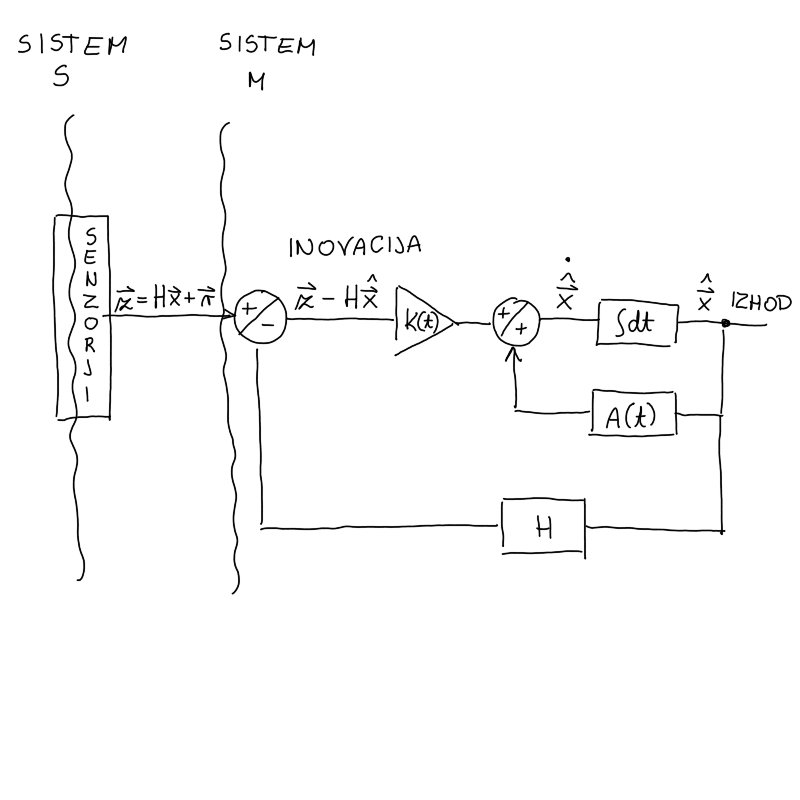
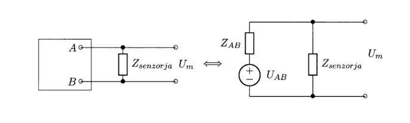
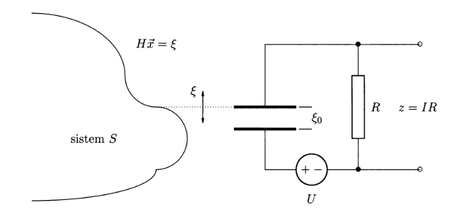
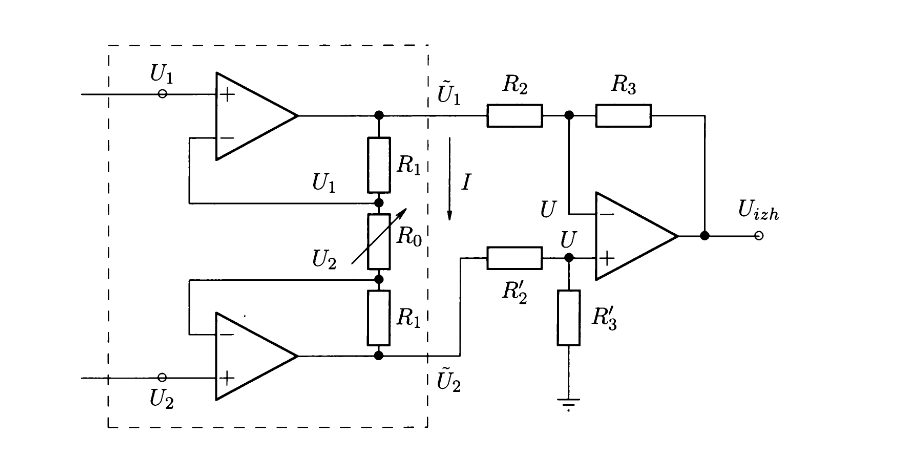
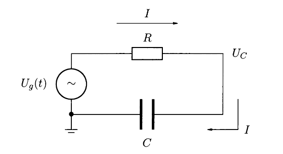
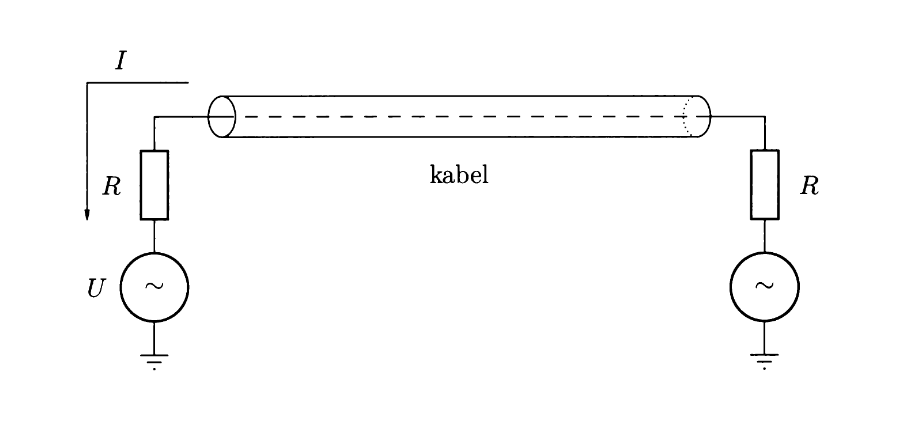

#+title: Optimalna povratna zanka
#+startup: nolatexpreview
#+startup: entitiespretty nil
#+startup: show2levels
#+latex_header: \usepackage{amsmath} \usepackage{cancel} \usepackage{graphicx}
#+latex_header: \renewcommand{\theta}{\vartheta} \renewcommand{\phi}{\varphi} \renewcommand{\epsilon}{\varepsilon}
#+latex_header: \newcommand{\odv}[1]{\dot{\vec{#1}}} \newcommand{\oddv}[1]{\ddot{\vec{#1}}}
#+latex_header: \newcommand{\rot}{\mathrm{rot}}\newcommand{\dive}{\mathrm{div}} \newcommand{\iu}{\mathrm{i}}
#+latex_header: \newcommand\mapsfrom{\mathrel{\reflectbox{\ensuremath{\mapsto}}}}
#+latex_header: \def\npredmet{FMER - OPZ}
#+latex_header: \usepackage[european]{circuitikz}
#+bibliography: refs.bib
* Optimalna povratna zanka

#+attr_latex: :width 0.5\textwidth :caption \caption{Skica povratne zanke.}

V splošnem spremenljivko \( x \) iz sistema \( S \) /transformiramo/(?) v sistem \( M \) preko meritve \( \mathbf{z} = H\mathbf{x} + \mathbf{r} \). Našo trenutno oceno sistema \( \hat{\mathbf{x}} \) izboljšamo z inovacijo \( \mathbf{z} - \mathsf{H} \hat{\mathbf{x}} \) ter (časovno odvisnim) ojačevalnim faktorjem. Oceno izboljšamo z matriko \( A \) in po integraciji dobimo novo, boljšo oceno \( \hat{\mathbf{x}} \). Iz izhoda novo, boljšo oceno preko senzorske matrike \( H \) ponovno pelje na stičišče s senzorji.

V primeru popolne usklajenosti med sistemoma \( S \) in \( M \) je inovacija \( \mathbf{z} - \mathsf{H} \hat{\mathbf{x}} \) samo beli šum s pričakovano vrednostjo \( 0 \).

Prispevek ojačevalnega faktorja \( K(t) \) s časom pada, zato se v praksi uporablja konstanten ojačevalni faktor \( K_{\infty} \). Ker je definiran z matriko \( A \) mora biti tudi ta časovno neodvisna. Zanima nas končna vrednost (think, termometer), ne sprotno dogajanje, za kar je potrebno nekaj časa.

* Senzorji
#+begin_idea
Zahteve za senzor:
- občutljiv naj bo na eno količino, najpogosteje napetost

- hitra uskladitev z merjeno količino

- odstranitev čim večje količine šuma

- čim manjši vpliv na sistem \( S \).

Obstajajo senzorji večih redov. Senzor je reda \( n \), če je to najvišja potenca odvoda v diferencialni enačbi, ki jo rešuje za povezovanje vhodne količine \( z \) in izhodne količine \( \hat{x} \).

Drugače povedano: senzor \( n \)-tega reda obravnavamo kot optimalen sledilni sistem za spremenljivke \( \mathbf{x}(t) \), katerih dinamika v sistemu \( S \) se spreminja kvečjemu kot

\[ \frac{\mathrm{d} ^{(n)}}{\mathrm{d} t^{(n)}} \mathbf{x} = 0 + \mathbf{w}, 
\]
kjer je \( \mathbf{w} \) beli šum. 

Dinamična enačba v sistemu \( S \) za *senzor 1. reda* je

\[ \dot{x} = w, 
\]
kjer za šum velja \( \left\langle w(t) w(t') \right\rangle = Q \delta(t - t') \). Diferencialna enačba za senzor 1. reda za meritev \( z = x + r(t), \ \left\langle r ^2 \right\rangle = R \) je tako

\begin{equation}
\label{eq:5}
 \tau \dot{\hat{x}} + \hat{x} = z, \quad  \tau = \frac{1}{K_{\infty}} = \sqrt{\frac{R}{Q}}
\end{equation}

Dinamična enačba v sistemu \( S \) za *senzor 2. reda* je
\[ \frac{\mathrm{d} ^2 x}{\mathrm{d} t ^2} = w. 
\]
Diferencialna enačba za senzor 2. reda je

\begin{equation}
\label{eq:6}
 \ddot{\hat{x}} + 2 \xi \omega \dot{\hat{x}} + \omega ^2 \hat{x} = 2 \xi \omega \dot{z} + \omega ^2 z, 
\end{equation}
kjer je \( \xi \) koeficient dušenja in \( \omega \) frekvenca z vrednostima

\[ \xi = \frac{1}{\sqrt{2}} \quad \text{ in } \quad \omega ^2 = \sqrt{\frac{Q}{R}}.
\]

#+end_idea

#+attr_latex: :options [Senzor 1. reda]
#+begin_izpeljava
Dinamična enačba v sistemu \( S \) za senzor 1. reda je

\[ \dot{x} = w, 
\]
kjer ima dinamični šum znano disperzijo

\[ \left\langle w(t) w(t') \right\rangle = Q \delta(t - t').
\]

Iz enačbe za Kalmanov filter razberemo \( A = 0 \), \( c = 0 \), \( \Gamma = 1 \) in \( H = 1 \). Senzor zajame nek izmerek

\[ z = x + r, 
\]
kjer je \( r \) merilni šum z znano disperzijo

\[ \left\langle r(t) r(t') \right\rangle = R \delta(t - t').
\]

V merilnem sistemu \( M \) je ocena

\[ \dot{\hat{x}} = A \hat{x} + c + K(z - H \hat{x}) = K (z - \hat{x}),
\]
s pripadajočo disperzijo

\[ \dot{P} = 2 AP + \Gamma ^2 Q - \frac{P ^2}{R} = Q - \frac{P ^2}{R}. 
\]
Po definiciji je potem ojačevalni faktor

\[ K = \frac{P}{R}. 
\]

Konstanten ojačevalni faktor \( K_{\infty} \) dobimo za rešitev enačbe \( \dot{P} = 0 \). Rešitev nam poda enakost

\[ Q = \frac{P_{\infty} ^2}{R} \implies \ P_{\infty} = \sqrt{QR}. 
\]
Iz definicije sledi

\[ K_{\infty} = \frac{P_{\infty}}{R} = \sqrt{\frac{Q}{R}}, 
\]
in izostritev ocene je

\[ \dot{\hat{x}} = K_{\infty} (z - \hat{x}) = \sqrt{\frac{Q}{R}} (z - \hat{x}).
\]

Senzor torej opišemo z enačbo 1. reda

\[ \frac{1}{K_{\infty}} \dot{\hat{x}} + \hat{x} = z,
\] 
kjer uvedemo časovno konstanto

\[ \tau = \frac{1}{K_{\infty}} = \sqrt{\frac{R}{Q}}. 
\]

#+end_izpeljava

#+attr_latex: :options [Senzor 2. reda]
#+begin_izpeljava
Dinamična enačba v sistemu \( S \) za senzor 2. reda je

\[ \frac{\mathrm{d} ^2 x}{\mathrm{d} t ^2} = w, 
\]
kjer je \( w \) dinamičnim šum z znano disperzijo

\[ \left\langle w(t) w(t') \right\rangle = Q \delta(t - t').
\]

Preidemo na vektorsko reševanje zgornje dinamične enačbe z \( \mathbf{x} = [x \ v]^T \)

\[ \dot{x} = v \quad \text{ in } \quad \dot{v} = w,
\]
kar zapišemo v matrični enačbo 

\begin{equation}
\label{eq:1}
 \frac{\mathrm{d} }{\mathrm{d} t} \begin{bmatrix} x \\ v \end{bmatrix} = \begin{bmatrix}
                                                                           0 & 1 \\
                                                                           0 & 0
                                                                            \end{bmatrix} \begin{bmatrix} x \\ v \end{bmatrix} +
                                                                            \begin{bmatrix} 0 \\ 1 \end{bmatrix} w
\end{equation}

Senzor naj se optimalno odziva na spremembo spremenljivke \( x \), toreb bo izmerek oblike

\[ z = x + r, 
\]
kjer je \( r \) dinamični šum z znano disperzijo

\[ \left\langle r(t) r(t') \right\rangle = R \delta(t - t').
\]

Iz enačbe \eqref{eq:1} razberemo

\[ A = \begin{bmatrix}
       0 & 1 \\
       0 & 0
        \end{bmatrix}, \quad \mathbf{c} = 0, \quad \Gamma = w,
\]
in senzorsko okno je oblike \( H = [1 \ 0] \).

V sistemu \( M \) je ocena podana z enačbo

\begin{equation}
\label{eq:2}
\begin{aligned}
   \dot{\hat{x}} &= A \mathbf{x} + \mathbf{c} + \Gamma \mathbf{w} \\ 
\frac{\mathrm{d} }{\mathrm{d} t} \begin{bmatrix} \hat{x} \\ \hat{v} \end{bmatrix} &= \begin{bmatrix}
                                                                         0 & 1 \\
                                                                         0 & 0
                                                                          \end{bmatrix} \begin{bmatrix} \hat{x} \\ \hat{v} \end{bmatrix} + \mathsf{P} \mathsf{H} \frac{1}{R} \left( z - \mathsf{H} \hat{\mathbf{x}} \right)
\end{aligned}
\end{equation}
pripada pa ji enačba za disperzijo

\begin{align*}
  \dot{\mathsf{P}} &= A \mathsf{P} + \mathsf{P} A^T + \Gamma Q \Gamma^T - \mathsf{P} \mathsf{H}^T R^{-1} \mathsf{H} \mathsf{P} \\
\frac{\mathrm{d} }{\mathrm{d} t} \begin{bmatrix}
                                 p_{11} & p_{12} \\
                                 p_{21} & p_{22}
                                  \end{bmatrix} &= \begin{bmatrix}
                                                   2p_{12} & p_{22} \\
                                                   p_{22} & Q
                                                    \end{bmatrix} - \frac{1}{R} \begin{bmatrix}
                                                                                p_{11} ^2 & p_{11} p_{12} \\
                                                                                 p_{11} p_{12} & p_{12} ^2
                                                                                 \end{bmatrix}.
\end{align*}

Stacionarno rešitev zgornje enačbe dobimo pri pogoju \( \dot{\mathsf{P}} = 0 \), iz česar sledi sistem treh enačb

\begin{align} \label{ali:1}
  2p_{12} - \frac{1}{R} p_{11} ^2 &= 0 \\ \label{ali:2}
p_{22} - \frac{1}{R} p_{11} p_{12} &= 0 \\ \label{ali:3}
Q - \frac{1}{R} p_{12} ^2 &= 0.
\end{align}

Iz enačbe \eqref{ali:3} izrazimo

\[ p_{12} = + \sqrt{QR}, 
\]
kar vstavimo v enačbo \eqref{ali:1}

\[ p_{11} = \sqrt{2 R p_{12}} = \sqrt{2R \sqrt{RQ}},
\]
ter v enačbo \eqref{ali:2}

\[ p_{22} = \sqrt{2 Q \sqrt{RQ}}. 
\]

Konstanten ojačevalni faktor je potem iz definicije

\[ K_{\infty} = \frac{1}{R} P_{\infty} H^T = \frac{1}{R} \begin{bmatrix} p_{11} \\ p_{12} \end{bmatrix},
\]
in ga vstavimo v enačbo \eqref{eq:2}

\begin{align*}
  \dot{\hat{x}} &= \hat{v} + \frac{1}{R} p_{11} \left( z - \hat{x} \right) \\
\dot{\hat{v}} &= \frac{1}{R} p_{12} \left( z - \hat{x} \right).
\end{align*}

Ne opazujemo hitrosti \( \hat{v} \), zato enačbo za oceno \( \dot{\hat{x}} \) odvajamo in nadomestimo odvod ocene \( \dot{\hat{v}} \) z njeno vrednostjo

\[ \ddot{\hat{x}} = \frac{1}{R} p_{12} \left( z - \hat{x} \right) + \frac{1}{R} \left( z - \dot{\hat{x}} \right). 
\]

Dobili smo enačbo 2. reda za \( \hat{x} \), ki jo preoblikujemo v

\[ \ddot{\hat{x}} = \frac{p_{11}}{R} \dot{\hat{x}} + \frac{p_{12}}{R} \hat{x} = \frac{p_{11}}{R} \dot{z} + \frac{p_{12}}{R}z. 
\]

Pogosto ne opazujemo odvoda meritve \( \dot{z} \), zato ga lahko zanemarimo.

Z uvedbo koeficienta dušenja \( \xi \) in frekvence \( \omega \), ki imata vrednosti

\[ \omega ^2 = \frac{p_{12}}{R} = \sqrt{\frac{Q}{R}},
\]

ter

\[ 2 \xi \omega = 2 \xi \sqrt{\frac{p_{12}}{R}} = \frac{1}{2}\frac{\sqrt{2 R \sqrt{RQ}}}{\sqrt{R \sqrt{RQ}}}  \implies \xi = \frac{1}{\sqrt{2}}.
\]

zapišemo normalizirano obliko diferencialne enačbe 2. reda za senzor 2. reda

\begin{equation}
\label{eq:3}
 \ddot{\hat{x}} + 2 \xi  \omega \dot{\hat{x}} + \omega ^2  \hat{x} = 2 \xi \omega \dot{z} + \omega ^2 z.
\end{equation}
#+end_izpeljava
** Primer senzorja 1. reda: termometer
Predstavljajmo (ali skuhajmo!) si skodelico kave/čaja, ki naj ima temperaturo \( T_z \). S termometrom merimo temperaturo \( \hat{T}(t) \), vendar temperaturi nista isti, saj ima termometer stekleno steno površine \( S \) z debelino \( d \), skozi katero gre neka gostota toplotnega toka \( \mathbf{j} \). Zaradi steklene stene bo \( T(t) \) vedno zaostajal za dejansko temperaturo \( T_c \).

Gostota toplotnega toka je definirana z

\[ \mathbf{j} = - \lambda\nabla T = - \lambda \left( \frac{T_z - T}{d - 0} \right).
\]

Po definiciji je toplotni tok

\[ P = - \mathbf{j} S = - \frac{\lambda S}{d} \left( T_z - T \right),
\]
ki je hkati enak tudi spremembi toplote v tekočini

\[ P = \frac{\mathrm{d} Q}{\mathrm{d} t} = -m c_p \frac{\mathrm{d} T}{\mathrm{d} t}. 
\]

Obe enačbi enačimo in dobimo diferencialno enačbo senzorja prvega reda

\[ \dot{T} = \frac{\lambda S}{m c_p d} \left( T_z - T \right),  
\]
kjer konstanto označimo z \( \Lambda = \frac{\lambda S}{m c_p d} \)

\[ \frac{1}{\Lambda} \dot{T} + T = T_z. 
\]

** Primer: vhod \( \delta(t) \)

Naj bo vhodna količina \( z(t) = \delta(t) \). Rešujemo nehomogeno diferencialno enačbo

\[ \tau \dot{x} + x = \delta(t). 
\]

Rešitev homogenega dela diferencialne enačbe je eksponentna funkcija

\[ x = C \exp \left\{ - \frac{t}{\tau} \right\}, 
\]
parcialno rešitev pa poiščemo z integracijo po intervalu \( \left[ -\epsilon, \epsilon \right] \) v limiti \( \epsilon \to 0 \).

\begin{align*}
  \tau \int\limits_{-\epsilon}^{\epsilon} \frac{\mathrm{d} x}{\mathrm{d} t} \, \mathrm{d} t + \int\limits_{-\epsilon}^{\epsilon} x \, \mathrm{d} t &= \int\limits_{-\epsilon}^{\epsilon} \delta(t) \, \mathrm{d} t \\
\tau \left[ x(\epsilon) - x(- \epsilon) \right] = 1,
\end{align*}
kjer smo upoštevali, da je vrednost integracije po spremenljivki \( x \) ničelna.

Zahtevamo, da za čase \( t < 0 \) velja, da je merilec v prvotni legi in se ne vrača tja. Z drugimi besedami, zahtevamo

\[ \hat{x} (t < 0) = \ldots = \hat{x}^{(n)} (t < 0) = 0, 
\]
iz česar sledi rešitev parcialnega dela diferencialne enačbe

\[ \hat{x}_p (t = 0) = \frac{1}{\tau} = C,
\]
kar je tudi vrednost koeficienta \( C \). Rešitev diferencialne enačbe ima torej obliko Greenove funkcije

\[ x(t) = G(t) = \frac{1}{\tau} \exp \left\{ - \frac{t}{\tau} \right\}. 
\]

*vstavi sliko*

V primeru senzorja 2. reda integriramo enačbo \eqref{eq:3}

\[ \int\limits_{-\epsilon}^{\epsilon} \ddot{x} \, \mathrm{d} t + \int\limits_{- \epsilon}^{\epsilon} 2 \xi \omega \dot{x} \, \mathrm{d} t+ \int\limits_{- \epsilon}^{\epsilon} \omega ^2 x \, \mathrm{d} t = \omega ^2 \int\limits_{-\epsilon}^{\epsilon} \delta(t) \, \mathrm{d} t, 
\]
kjer smo zanemarili odvod vhodne količine \( \dot{z} \). Integracija nam poda enačbo

\[ \dot{x}(\epsilon) - \dot{x}(-\epsilon) + 2 \xi \omega \left[ x(\epsilon) - x(-\epsilon)  \right] = \omega ^2,
\]
kjer upoštevamo, da je integral lihe funkcije \( x \) na sodem intervalu ničeln ter enake začetne pogoje kot prej, torej \( \frac{\mathrm{d} ^{(n)} x(t)}{\mathrm{d} t^{(n)}} = 0 \) za \( n = 0, 1, 2, \ldots \) in čas \( t > 0 \). Iz tega prav tako sledijo začetni pogoji

\[ x(t = 0) = 0 \quad \text{ in }\quad \dot{x}(t = 0) = \omega ^2. 
\]

Rešitev homogenega dela enačbe \eqref{eq:3} pridobimo z eksponentnim nastavkom \( x = \exp \left\{ \lambda x \right\} \)

\[ \lambda_{1, 2} = - \frac{2 \xi  \omega \pm \sqrt{4 \xi ^2 \omega ^2 - \omega ^2 }}{2}, 
\]
kar prepišemo v

\[ \lambda_{1, 2} = - \frac{\omega}{\sqrt{2}} \left( 1 \mp \mathrm{i} \right)
\]
če upoštevamo \( \xi = \frac{1}{2} \), saj želimo optimalen filter. Rešitev je

\[ x(t) = C_1 \exp \left\{\lambda_1  t  \right\} + C_2 \exp \left\{ \lambda_2 t \right\}. 
\]

Iz začetnega pogoja \( x(0) = 0 \) sledi \( C_1 = -C_2 \). Iz drugega začetnega pogoja \( \dot{x}(0) = \omega^2 \) rešujemo enačbo

\[ \left. \dot{x}(t) \right|_{t = 0} =\left.  C_1 \lambda_1 \exp \left\{ \lambda_1 t \right\} - C_1 \lambda_2 \exp \left\{ \lambda_2 t \right\} \right|_{t = 0} = \omega ^2,
\]
iz česar določimo vrednost konstante

\[ C_1 = \frac{\omega ^2}{\lambda _1 - \lambda_2} = \frac{\omega \sqrt{2}}{2 \mathrm{i}}. 
\]

Rešitev je torej 

\[ x (t) = \frac{\omega \sqrt{2}}{2 \mathrm{i}} \left( \exp \left\{  - \frac{\omega}{\sqrt{2}} (1 + \mathrm{i}) t\right\} - \exp \left\{ \frac{\omega}{\sqrt{2}} \left( 1 + \mathrm{i} \right) t \right\}  \right) = \omega \sqrt{2} \sin \left( \frac{\omega t}{\sqrt{2}} \right) \exp \left\{ - \frac{\omega t}{\sqrt{2}} \right\} = G(t).
\]

Za splošen \( \xi \) sta vrednosti

\[ \lambda_{1, 2} = - \xi  \omega \pm \mathrm{i} \omega \sqrt{1 - \xi ^2}
\]

in njuna razlika je potem

\[ \lambda_1 - \lambda_2 = 2 \mathrm{i} \omega \sqrt{1 - \xi ^2}.
\]

Iz enakih začetnih pogojev potem določimo koeficient

\[ C_1 = \frac{\omega}{2 \mathrm{i} \sqrt{1 - \xi ^2}},
\]
pripadajoča rešitev pa je

\begin{align*}
 x(t) = G(t) &= \frac{\omega}{\sqrt{1 - \xi ^2}} \frac{1}{2 \mathrm{i}} \left[ \exp \left\{ \mathrm{i} \omega \sqrt{1 - \xi ^2} t \right\} - \exp\left\{ -\mathrm{i} \omega \sqrt{1 - \xi ^2} t \right\}  \right] \exp \left\{ - \xi \omega t \right\}\\
& = \frac{\omega}{ \sqrt{1 - \xi ^2}} \sin \left( \sqrt{1 - \xi ^2 } \omega t \right) \exp \left\{ - \xi \omega t \right\}
\end{align*}

V primeru splošnega \( \xi \) ločimo tri primere:

- \( \xi \to 0 \) imamo nedušeno nihanje

  \[ x(t) = \omega \sin (\omega t). 
  \]

- za \( \xi \to \frac{1}{\sqrt{2}} \) smo rešitev že zapisali, dušenje oscilatorno.

- za \( \xi \gg 1 \) je senzor predušen in sinus razvijevo

  \[ x(t) = \frac{\omega}{\xi ^2 - 1} \sinh \left( \sqrt{\xi ^2 - 1 } \omega t \right) \exp \left\{ - \xi \omega t \right\},
  \]
  in dušenje ni več oscilatorno.
** Primer: vhod \( \alpha t \)

Naj bo vhodni signal oblike \( z(t) = \alpha t \), kjer je \( \alpha \in \mathbb{R} \). Za senzor 1. reda rešujemo nehomogeno diferencialno enačbo

\[ \tau \dot{x} + x = \alpha t, 
\]
katere homogeno rešitev že poznamo

\[ x_h(t) =  C \exp \left\{ - \frac{t}{\tau} \right\}.
\]

Parcialno rešitev pridobimo z nastavkom oblike 

\[ x_p (t) = A t + B, 
\]
ki jo vstavimo v enačbo in dobimo \( A = \alpha \) ter \( B = - \alpha \tau \). Celotna rešitev je

\[ x(t) = x_h (t) + x_p (t) = C \exp \left\{ - \frac{t}{\tau} \right\} + \alpha t - \alpha \tau. 
\]

Iz robnih pogojev \( x(0) = 0 \), sledi \( C = \alpha \tau \) in rešitev je potem

\[ x(t) = \alpha t + \alpha \tau \left( \exp \left\{ - \frac{t}{\tau} - 1 \right\} \right) 
\]

Prvi člen je enak vhodni funkciji, drugemu členu pa pravimo \textit{zamik} (ang. /offset/). V naši meritvi imamo torej sistematično napako, ki je enaka vrednosti zamika. Za dovolj majhen \( \tau \) je ta zanemarljiva.
** Primer: blažilnik, amortizer

Nahajamo se na vrhu kolesa z amortizerjem, ki ima v sebi tekočino z viskoznostjo \( \eta \) (kar bi rad trenutno počel, ampak se moram učiti). Vozimo se s hitrostjo \( v \) in imamo maso \( m \). Pri vožnji se spreminja višina terena, kar je naš vhodni signal \( z(t) \). Zanima nas odziv našega sedeža \( x(t) \) glede na vhodni signal.

Dinamika našega sistema je odvisna od relativne lege in sile upora \( F_u = - \beta v \), torej

\[ m \ddot{x} = k (z - x) - \beta (\dot{x} - \dot{z}), 
\]
kar prepišemo v

\[ \ddot{x} + \frac{\beta}{m} \dot{x} + \frac{k}{m} x = \frac{k}{m} z + \frac{\beta}{m} \dot{z}.
\]

Za dane pogoje je amortizer senzor 2. reda. Če je senzor optimalen \( \xi = \frac{1}{\sqrt{2}} \), določimo koeficient \( \beta \) iz zgornje enačbe

\[ 2 \xi \omega = 2 \xi \sqrt{\frac{k}{m}} = \frac{\beta}{m} \implies \beta = \sqrt{2 km} = \gamma \eta, 
\]
kjer je \( \gamma \) koeficient upora.
* Prenosna funkcija senzorja
#+begin_idea
Delovanje senzorjev predstavimo s pomočjo prenosne funkcije senzorjev. Do te funkcije pridemo s pomočjo Laplaceove transformacije diferencialne enačbe senzorja \( n \)-tega reda.

Prenosna funkcija senzorja je definirana kot

\[ H(s) = \frac{\hat{x}(s)}{z(s)} = \frac{s^m + b_{m - 1}s^{m - 1} + \ldots b_0}{s^n + a_{n - 1}s^{n - 1} + \ldots + a_0} 
\]

Prenosna funkcija senzorja 1. reda je

\begin{equation}
\label{eq:8}
 H(s) = \frac{1}{1 + \tau s}.
\end{equation}

Prenosna funkcija senzorja 2. reda je

\[ H(s) = \frac{\omega ^2}{s ^2 + 2 \xi \omega s + \omega ^2}. 
\]
#+end_idea
#+begin_definition
Laplaceova transformacija \( \mathcal{L} \) je preslikava, ki funkcijo \( f(t) \) preslika v kompleksno funkcijo \( F(s) \) po enačbi

\[ F(s) = \int\limits_0^{\infty} f(t) e^{- st }\, \mathrm{d} t. 
\]

Za funkcijo \( f(t) \) zahtevamo, da je od nič različna za vse pozitivne čase. Prav tako naj velja isto za njene odvode.
#+end_definition
#+begin_theorem
Lastnosti Laplaceove transformacije so:

- \[ \mathcal{L}(1) = \int\limits_0^{\infty} e^{- s t} \, \mathrm{d} t = \left. \frac{1}{s} e^{-st} \right|_0^{\infty} = \frac{1}{s}.
  \]

- \[ \mathcal{L} \left( e^{at} \right) = \int\limits_0^{\infty} e^{(s - a) t} \, \mathrm{d} t = \frac{1}{s - a}.
  \]

- Produkt funkcije z eksponentno bodo
  \[ \mathcal{L} \left( f(t) e^{a t} \right) = \int\limits_0^{\infty} f(t) e^{(s - a) t} \, \mathrm{d} t = F(s - a).
  \]

- odvod funckije po parametru

  \begin{equation}
  \label{eq:4}
   \mathcal{L} \left( \frac{\mathrm{d} }{\mathrm{d} t} f(t) \right) = \int\limits_0^{\infty} \frac{\mathrm{d} }{\mathrm{d} t} f(t) e^{- st} \, \mathrm{d} t = s F(s)
  \end{equation}
  To se izračuna s pomočjo integriranja po delih za \( u = e^{- st} \) in \( \mathrm{d} v = \frac{\mathrm{d} }{\mathrm{d} t} f(t) \, \mathrm{d} t \).

- \[ \mathcal{L} \left( t \right) = \int\limits_0^{\infty} t e^{- st }\, \mathrm{d} t = \frac{1}{s ^2}.
  \]

  Do te identitete lahko pridemo tudi z uporabo prve alineje in lastnosti odvajanja.

- Podobno kot prejšnja alineja

  \[ \mathcal{L} \left( t^n \right) = n! \frac{1}{s ^{n + 1}}.
  \]

- z uporabo druge alineje za \( e^{\mathrm{i} \omega t} \) lahko dobimo vrednost za kosinus in sinus

  \[ \mathcal{L} \left( \cos (\omega t) + \mathrm{i} \sin (\omega t)  \right) = \mathcal{L} \left( e^{\mathrm{i} \omega t} \right) = \frac{s}{s ^2 + \omega ^2} + \mathrm{i} \frac{\omega}{s ^2 + \omega ^2}.
  \]

  Torej

  \[ \mathcal{L} \left( \cos \left( \omega t \right) \right) = \frac{s}{s ^2 + \omega ^2} \quad \text{ in } \quad \mathcal{L} \left( \sin \left( \omega t \right) \right) = \frac{\omega}{s ^2 + w ^2}.
  \]
#+end_theorem

#+attr_latex: :options [Splošna prenosna funkcija senzorja]
#+begin_izpeljava
Splošna diferencialna enačbo za senzor \( n \)-tega reda je

\[ \frac{\mathrm{d}^{(n)} }{\mathrm{d} t^{(n)}} x + a_{n - 1} \frac{\mathrm{d}^{(n - 1)} }{\mathrm{d} t^{(n - 1)}} x + \ldots + a_1 \frac{\mathrm{d} }{\mathrm{d} t} x + a_0 x = \frac{\mathrm{d}^{(m)} }{\mathrm{d} t^{(m)}} z + b_{m - 1 } \frac{\mathrm{d}^{(m - 1)} }{\mathrm{d} t^{(m - 1)}} z + \ldots + b_1 \frac{\mathrm{d} }{\mathrm{d} t}z + b_0 z.
\]

Z lastnostjo \eqref{eq:4} jo Laplaceovo transformiramo v

\[ \left( s^n + a_{n - 1} s^{n - 1} + \ldots + a_0 \right) x(s) = \left( s^m + b_{m - 1}s^{m - 1} + \ldots + b_0 \right) z(s), 
\]
in prenosna funkcija je

\[ H(s) = \frac{x(s)}{z(s)} = \frac{s^m + b_{m- 1} s^{m - 1} + \ldots + b_0}{s^n + a_{n - 1} s^{n - 1} + \ldots + a_0}. 
\]
#+end_izpeljava

#+attr_latex: :options [Prenosna funkcija senzorja 1. reda]
#+begin_izpeljava
Laplaceova transformacije enačbe \eqref{eq:5} je

\[ \left( \tau s + 1 \right) x(s) = z(s), 
\]
iz česar sledi prenosna funkcija senzorja 1. reda

\[ H(s) = \frac{1}{1 + \tau s}. 
\]
#+end_izpeljava

#+attr_latex: :options [Prenosna funkcija senzorja 2. reda]
#+begin_izpeljava
Laplaceova transformacija enačbe \eqref{eq:6} je

\[ \left( s ^2 + 2 \xi \omega s + \omega ^2 \right) x(s) = \left( 2 \xi \omega s + \omega ^2  \right)z(s) 
\]
in prenosna funkcija senzorja 2. reda je

\[ H(s) = \frac{\omega ^2 + 2 \xi \omega s}{s ^2 + 2 \xi \omega s + \omega ^2}.
\]
#+end_izpeljava
** Bodejevi diagrami
#+begin_idea
V primeru periodičnega vhoda \( z(t) = z_0 e^{\mathrm{i} \omega t} \) je na izhodu tudi harmonična funkcija, ki pa je premaknjena za neko fazo \( \delta \)

\[ x = x_0 e^{\mathrm{i} \omega t} e^{\mathrm{i} \delta} 
\]

Parameter \( s \) nadomestimo z \( \mathrm{i} \omega \) v prenosnih funkciji

\[ H(\mathrm{i} \omega) = \frac{x(\mathrm{i} \omega)}{z(\mathrm{i} \omega)},
\]
razmerje velikost amplitud pa je

\[ \left| H (\mathrm{i} \omega) \right| = \left| \frac{x_0}{z_0} \right|.
\]

Za fazo \( \delta \) velja

\[ \tan \delta = \frac{\mathrm{Im} H(\mathrm{i \omega})}{\mathrm{Re} H (\mathrm{i} \omega)}.
\]

Vsako prenosno funkcijo, ki sledi iz diferencialne enačbe s konstantnimi koeficienti lahko zapišemo kot produkt prenosnih funkcij prvega in drugega reda

\[ H(\mathrm{i} \omega) = \frac{\prod_{i}^{} \left( 1 + \mathrm{i} \omega \tau_i \right) \cdot \prod_{j}^{} \left[ \left( \frac{\mathrm{i} \omega}{\omega_j} \right) ^2 + \frac{2 \xi_j \mathrm{i}\omega}{\omega_j} + 1 \right]}{\prod_{k}^{} \left( 1 + \mathrm{i} \omega \tau_k \right) \cdot \prod_{l}^{} \left[ \left( \frac{\mathrm{i} \omega}{\omega_l} \right) ^2 + \frac{2 \xi_l \mathrm{i}\omega}{\omega_l} + 1 \right]}.
\]

Zapišemo jih lahko tudi kot

\[ H(\mathrm{i} \omega) = \frac{\prod_{i}^{} \left|\left( 1 + \mathrm{i} \omega \tau_i \right) \right| e^{\mathrm{i} \delta_i} \cdot \left| \prod_{j}^{} \left[ \left( \frac{\mathrm{i} \omega}{\omega_j} \right) ^2 + \frac{2 \xi_j \mathrm{i}\omega}{\omega_j} + 1 \right]\right| e^{\mathrm{i} \delta_j}}{\left|\prod_{k}^{} \left( 1 + \mathrm{i} \omega \tau_k \right)\right| e^{\mathrm{i} \delta_k} \cdot\left| \prod_{l}^{} \left[ \left( \frac{\mathrm{i} \omega}{\omega_l} \right) ^2 + \frac{2 \xi_l \mathrm{i}\omega}{\omega_l} + 1 \right]\right| e^{\mathrm{i} \delta_l}},
\]
kjer je fazni faktor

\[ \Delta = \exp \left[ \mathrm{i} \left( \sum\limits_i^{} \delta_i + \sum\limits_j^{} \delta_j + \sum\limits_k^{} \delta_{k} + \sum\limits_l^{} \delta_l \right) \right].
\]

Definiramo decibel (\( \mathrm{dB} \)) na enoto moči

\[ 20 \log_{10} \left| H(\mathrm{i} \omega) \right| = 10 \log_{10} \left| H(\mathrm{i} \omega) \right| ^2.
\]

Rišemo lahko dve vrsti Bodejevih diagramov (glej slike primerov!)

- *amplitudni Bodejev diagram* rišemo \( 20 \log_{10} \left| H(\mathrm{i} \omega) \right| \) v odvisnosti od frekvence \( \omega \)
- *fazni Bodejev diagram* rišemo fazni zamik \( \Delta \) v odvisnosti od frekvence \( \omega \).
#+end_idea

#+attr_latex: :options [Razmerje velikosti amplitud]
#+begin_izpeljava
Parameter \( s \) v prenosni funkciji \( H(s) \) lahko nadomestimo s harmoničnim \( \mathrm{i} \omega \), saj velja enačba

\[ \frac{\mathrm{d} }{\mathrm{d} t} e^{\mathrm{i} \omega t} = \mathrm{i \omega} e^{\mathrm{i} \omega t}. 
\]

Transformacija zgornje enačbe je

\[ s \mathcal{L} \left( e^{\mathrm{i} \omega t} \right) = \mathrm{i} \omega \mathcal{L} \left( e^{\mathrm{i} \omega t} \right), 
\]
iz česar sklepamo \( s = \mathrm{i} \omega \) in posledično \( H(s) = H(\mathrm{i} \omega) \).

Po definiciji prenosne funkcije senzorja velja

\[ H(\mathrm{i} \omega) z(\mathrm{i} \omega) = x(\mathrm{i} \omega), 
\]
in njena transformacija za harmoničnen vhod \( z = z_0 e^{\mathrm{i} \omega t} \) in izhod \( x = x_0 e^{\mathrm{i} \omega t} e^{\mathrm{i} \delta} \) je

\begin{equation}
\label{eq:7}
 H(\mathrm{i} \omega) \cdot z_0  \mathcal{L} \left( e^{\mathrm{i} \omega t} \right) = x_0 e^{\mathrm{i} \delta} \mathcal{L} \left( e^{\mathrm{i} \omega t} \right).
\end{equation}

Iz absolutne vrednosti zgornje enačbe dobimo razmerje velikosti amplitud

\[ \left| H(\mathrm{i} \omega) \right| =\left| \frac{x_0}{z_0} \right|.
\]
#+end_izpeljava

#+attr_latex: :options [Faza \( \delta \)]
#+begin_izpeljava
Za kompleksno funkcijo \( H(\mathrm{i} \omega) \in \mathbb{C} \) je faza \( \alpha \) po definiciji

\[ \tan \alpha = \frac{\mathrm{Im} H(\mathrm{i} \omega)}{\mathrm{Re} H(\mathrm{i} \omega)}. 
\]
V kompleksnem prostoru torej lahko zapišemo kot

\[ H(\mathrm{i} \omega) = \left| H(\mathrm{i} \omega) \right| e^{\mathrm{i} \alpha}.
\]
Njeno transformacijo enačimo z zapisom \eqref{eq:7}

\[ \left| H(\mathrm{i} \omega) \right| e^{\mathrm{i} \alpha} z_0 \mathcal{L} \left( e^{\mathrm{i} \omega t} \right) = x_0 e^{\mathrm{i} \delta} \mathcal{L} \left( e^{\mathrm{i} \omega t} \right),
\]
iz česar sledi \( \alpha = \delta \).
#+end_izpeljava

#+attr_latex: :options [Bodejevi diagrami(?)]
#+begin_izpeljava
Brez dokaza navajamo, da lahko vsako prenosno funkcijo, ki sledi iz diferencialne enačbe s konstantnimi koeficienti, zapišemo kot produkt prenosnih funkcij za sistem prvega in drugega reda.

\[ H(\mathrm{i} \omega) = \frac{\prod_{i}^{} \left( 1 + \mathrm{i} \omega \tau_i \right) \cdot \prod_{j}^{} \left[ \left( \frac{\mathrm{i} \omega}{\omega_j} \right) ^2 + \frac{2 \xi_j \mathrm{i}\omega}{\omega_j} + 1 \right]}{\prod_{k}^{} \left( 1 + \mathrm{i} \omega \tau_k \right) \cdot \prod_{l}^{} \left[ \left( \frac{\mathrm{i} \omega}{\omega_l} \right) ^2 + \frac{2 \xi_l \mathrm{i}\omega}{\omega_l} + 1 \right]}.
\]

Zapišemo jih lahko tudi kot

\[ H(\mathrm{i} \omega) = \frac{\prod_{i}^{} \left|\left( 1 + \mathrm{i} \omega \tau_i \right) \right| e^{\mathrm{i} \delta_i} \cdot \left| \prod_{j}^{} \left[ \left( \frac{\mathrm{i} \omega}{\omega_j} \right) ^2 + \frac{2 \xi_j \mathrm{i}\omega}{\omega_j} + 1 \right]\right| e^{\mathrm{i} \delta_j}}{\left|\prod_{k}^{} \left( 1 + \mathrm{i} \omega \tau_k \right)\right| e^{\mathrm{i} \delta_k} \cdot\left| \prod_{l}^{} \left[ \left( \frac{\mathrm{i} \omega}{\omega_l} \right) ^2 + \frac{2 \xi_l \mathrm{i}\omega}{\omega_l} + 1 \right]\right| e^{\mathrm{i} \delta_l}},
\]
kjer je fazni faktor

\[ \Delta = \exp \left[ \mathrm{i} \left( \sum\limits_i^{} \delta_i + \sum\limits_j^{} \delta_j + \sum\limits_k^{} \delta_{k} + \sum\limits_l^{} \delta_l \right) \right].
\]

Množenje (in deljenje) prevedemo s pomočjo logaritmiranja na seštevanje (in odštevanje)

\begin{align*}
 20 \log_{10} \left| H(s) \right| = 20 & \left[ \sum\limits_i^{} \log \left| 1 + \mathrm{i} \omega \tau_i\right|  + \sum\limits_j^{} \left| \left( \frac{\mathrm{i} \omega}{\omega_j} \right) ^2 + \frac{2 \xi_j \mathrm{i}\omega}{\omega_j} + 1  \right| \right. \\
& \left. - \sum\limits_k^{}\left|  1 + \mathrm{i} \omega \tau_k \right| - \sum\limits_l^{} \left| \left( \frac{\mathrm{i} \omega}{\omega_l} \right) ^2 + \frac{2 \xi_l \mathrm{i}\omega}{\omega_l} + 1  \right| \right]
\end{align*}
#+end_izpeljava
*** Senzor 1. reda

Prenosna funkcija senzorja 1. reda za periodične vhode izhaja iz enačbe \eqref{eq:8} in je

\[ H(\mathrm{i} \omega) = \frac{1}{1 + \mathrm{i} \omega \tau}. 
\]

Njena absolutna vrednost je

\[ \left| H (\mathrm{i} \omega) \right| = \frac{1}{\sqrt{1 + \omega ^2 \tau ^2 }}
\]

Za amplitudni Bodejev diagram si pogledamo naslednje točke

- \( \omega \tau \to 0 \), iz česar sledi

  \[ 20 \log \left| H(\mathrm{i} \omega) \right| \to 0
  \]

- \( \omega \tau \to \infty \), iz česar sledi preko Taylorjevega razvoja sledi

  \[ 20 \log \left| \frac{1}{\omega \tau} \right| = -20 \log \left( \omega \tau \right)
  \]

- \( \omega \tau = 1 \), iz česar sledi

  \[ 20 \log \left( \frac{1}{\sqrt{2}} \right) = -10 \log (2) \approx - 3 
  \]

Za fazni Bodejev diagram si pogledamo iste točke

- \( \omega \to 0 \) je faza \( \delta = 0 \)
  
- \( \omega \to \infty \) je faza \( \delta = - \frac{\pi}{2} \)

- \( \omega = 1 \) je faza \( \delta = - \frac{\pi}{4} \).

*vstavi sliko diagramov*
*** Prenosna funkcija člena s potenco

Prenosna funkcija, ki vsebuje člen s potenco je

\[ H(\mathrm{i} \omega) = \left( \mathrm{i} \omega \right)^n = \omega^n \exp \left\{ \mathrm{i} n \frac{\pi}{2} \right\}, \quad n = 1, 2, 3, \ldots 
\]

*vstavi grafe*
*** Senzor 2. reda

Prenosna funkcija senzorja 2. reda za periodične vhode izhaja iz enačbe \eqref{eq:6} in je

\[ H(\mathrm{i} \omega) = \frac{1}{- \frac{\omega ^2}{\omega_0 ^2} + \frac{2 \xi \omega}{\omega_0} + 1}. 
\]

Njena absolutna vrednost je

\[ \left| H(\mathrm{i} \omega) \right| = \frac{1}{\sqrt{\left( 1 - \frac{\omega ^2}{\omega_0 ^2} \right) ^2 + \left( \frac{2 \xi \omega}{ \omega_0} \right) ^2}}
\]

Označimo \( x = \frac{\omega}{\omega_0} \) in absolutna vrednost je

\[ \left| H(\mathrm{i} \omega) \right| = \left[ \left( 1 - x ^2 \right) ^2 + \left( 2 \xi x \right) ^2 \right]^{- \frac{1}{2}} = \left[ 1 -2 x ^2 + x ^4 + 4 \xi ^2 x ^2 \right]^{-\frac{1}{2}}.
\]

Faza pa je

\[ \tan \delta = -\frac{2 \xi x}{1 - x ^2}. 
\]

Za amplitudni Bodejev diagram so pomembne sledeče točke

- \( x \to 0 \), iz česar sledi

  \[ 20 \log \left| H(\mathrm{i} \omega) \right| = 20 \log 1 = 0
  \]

- \( x \gg 1 \), iz česar sledi

  \[ 20 \log \left| H \right| = 20 \log \left( x ^{-2}\right) = -40 \log x
  \]

- \( x = 1 \), iz česar sledi

  \[ 20 \log \frac{1}{2 \xi} = -10 \log 2 = -3 
  \]

Za fazni Bodejev diagram so pomembne točke

- \( \omega \to 0 \), iz česar sledi

  \[ \tan \delta = 0 \implies \ \delta = 0
  \]

- \( x \to \infty \), iz česar sledi

  \[ \tan \delta = - \frac{2 \xi}{x} \implies \ \delta = - \pi
  \]

- ter \( x  = 1 \), iz česar sledi

  \[ \tan \delta = - \frac{2\xi}{1 - x} \implies \delta = - \frac{\pi}{2}. 
  \]
*** Low-pass filter

Shema low-pass filtra je naslednja

#+begin_src latex
\begin{center}
 \begin{circuitikz}
    \scalebox{1}{
      \draw node[left]{$U_{in}$} (0, 0) to[R=$R$, o-] (2, 0) to[short, -o] (4, 0) 
      node[right]{$U_{out}$};
      \draw (2, 0) to[C=$C$] node[ground]{} (2, -1.5);
    }
  \end{circuitikz} 
\end{center}
#+end_src

Low-pass filter je filter, ki prepušča nizke frekvence. Za osnovne komponente električnih vezij (upor, kondenzator, tuljava) naslednje:

- upor \( Z_R = R \)

- kondenzator \( Z_C = \frac{1}{\mathrm{i} \omega C} \), kjer je \( C \) kapaciteta kondenzatorja

- tuljava \( Z_L = \mathrm{i} \omega L \), kjer je \( L \) induktivnost (?)

Impedanca low-pass filtra je

\[ Z = R + \frac{1}{\mathrm{i} \omega C} = \frac{\mathrm{i} \omega RC + 1}{\mathrm{i} \omega C}. 
\]

Preko Ohmovega zakona zapišemo napetost na izhodu \( U_{out} \), ki je

\begin{equation}
\label{eq:9}
 U_{out} = I \cdot Z_C. 
\end{equation}

Za tok, ki teče od \( U_{in} \) do *GROUND* pa velja

\begin{equation}
\label{eq:10}
 I = \frac{U_{in}}{Z} = U_{in} \frac{\mathrm{i} \omega C}{1 + \mathrm{i} \omega RC}. 
\end{equation}

Ko združimo enačbi \eqref{eq:9} in \eqref{eq:10} lahko izrazimo razmerje med vhodno in izhodno napetostjo

\[ U_{out} = U_{in} \frac{1}{1 + \mathrm{i} \omega C} \implies \ H(\mathrm{i} \omega) = \frac{U_{out}}{U_{in}} = \frac{1}{1 + \mathrm{i} \omega \tau},
\]
kjer smo uvedli karakteristični čas \( \tau = RC \).

Za visoke frekvence \( \omega \tau \gg 1 \) je low-pass filter integrator, saj velja

\[ H(\mathrm{i} \omega) = \frac{1}{\mathrm{i} \omega \tau} = \frac{1}{\mathrm{i} \omega} \frac{1}{\tau} = \frac{1}{\tau} H(\mathrm{i} \omega) 
\]

Za neko frekvenco \( \nu = \nu_0 e^{\mathrm{i} \omega t} \) velja

\[ \int\limits_{}^{} \nu \, \mathrm{d}t = \nu_0 \int\limits_{}^{} e^{\mathrm{i} \omega t} = \nu_0 \frac{1}{\mathrm{i} \omega} e^{\mathrm{i} \omega t}. 
\]

*vstavi graf*
*** High-pass filter

Shema high-pass filtra je

#+begin_src latex
\begin{center}
  \begin{circuitikz}
    \scalebox{1.}{
      \draw node[left]{$U_{in}$} (0, 0) to[C=$C$, o-] (2, 0) to[short, -o] (4, 0) 
      node[right]{$U_{out}$};
      \draw (2, 0) to[R=$R$] node[ground]{} (2, -1.5);
    }
  \end{circuitikz}
\end{center}\vspace{-30pt}
#+end_src

Impedanca zgornje sheme je

\[ Z + \frac{1}{ \mathrm{i} \omega C} + R = \frac{1 + \mathrm{i} \omega \tau}{\mathrm{i} \omega C}, \ \tau = RC.
\]

Preko Ohmovega zakona (ali pa Kirchoffovega) je napetost \( U_{out} \) definirana kot

\[ U_{out} - 0 = R I. 
\]

Tok iz vhodne napetosti \( U_{in} \) do GROUND je

\[ I = \frac{U_{in}}{Z} = U_{in} \frac{- \mathrm{i} \omega C}{1 + \mathrm{i} \omega \tau}. 
\]

Združitev zgornjih dveh enačb nam poda prenosno funkcijo za high-pass filter

\[ H(\mathrm{i} \omega) = \frac{U_{out}}{U_{in}} = \frac{\mathrm{i} \omega \tau}{1 + \mathrm{i} \omega \tau}. 
\]

Poglejmo si Bodejev amplitudni diagram za značilne točke

- \( \tau \omega \to 1 \), iz česar sledi

  \[ 20 \log \left| H(\mathrm{i} \omega) \right|  \to -\infty.
  \]

- \( \omega \tau \to \infty \), iz česar sledi

  \[ 20 \log \left| H(\mathrm{i} \omega) \right| = 0,
  \]

- \( \omega \tau = 1 \), iz česar sledi

  \[ 20 \log \frac{1}{\sqrt{2}} = - 3 
  \]

Za nizke frekvence deluje high-pass filter kot diferenciator. Za diferenciator velja

\[ \nu_0 e^{\mathrm{i} \omega t} \to \mathrm{i} \omega \nu_0 e^{\mathrm{i} \omega t}. 
\]

Prenosna funkcija diferenciatorja je

\[ H = H_{dif} \tau = \mathrm{i} \omega \tau
\]
*vstavi graf*
* Vpliv senzorja na opazovani sistem
#+begin_idea
Senzor interagira z opazovanim sistemom \( S \). Merilo, ki ga uporabljamo za opis vpliva senzorja na sistem \( S \) je moč, ki jo senzor črpa iz opazovanega sistema

\[ P_M = \frac{U_M ^2}{Z_M}, 
\]
kjer je \( U_M \) napetosti, ki jo kaže voltmeter, ter \( Z_M \) vhodni upor voltmetra.

Preko Theveninovega izreka pridemo do zaključka, da za \( U_M < U_{AB} \), kjer \( U_{AB} \) napetost med dvema točkama \( A \) in \( B \) v sistemu \( S \), velja \( \frac{Z_{AB}}{Z_M} \to 0 \). Naš sistem bo trošil minimalno moč \( P \ll P_{\max} \), ko je \( Z_M \gg Z_{AB} \).

Želimo, da je vhodna impedanca \( Z_{in} \to \infty \) ter izhodna impedanca \( Z_{out} = 0 \).
#+end_idea

#+attr_latex: :options [Theveninov izrek]
#+begin_theorem
Vsako električno vezje sestavljeno iz linearnih elementov (upor, tuljava, kondenzator) v poljubnih točkah \( A \) in \( B \) lahko nadomestimo z generatorjem napetosti \( U_{AB} \) in notranjo upornostjo \( Z_{AB} \).
#+end_theorem

#+attr_latex: :options [Trošena moč]
#+begin_izpeljava
Vezje za senzor, ki interagira s sistemom \( S \) nadomestimo z vezje, ki ima napetostni izvor \( U_{AB} \) ter impedanco \( Z = Z_{AB} + Z_M \). Tok (glej sliko) je potem

\[ I = \frac{U_{AB}}{Z_{AB} + Z_M}. 
\]

#+attr_latex: :width 0.5\textwidth :caption \caption{Uporaba Theveninovega izreka za izračun moči \( P_M \), ki jo troši naš senzor. Vir: \cite{likar_osnove_2016}.}

Po Ohmovem zakonu je napetost \( U_M \)  v merilnem sistemu z uporom \( Z_M \) potem

\[ U_M = I Z_M = U_{AB}\frac{Z_M}{Z_{AB} + Z_M}. 
\]

Moč, ki se troši na senzorju je potem po definiciji

\begin{equation}
\label{eq:11}
 P_M = \frac{U_M ^2}{Z_M} = \frac{U_{AB} ^2 Z_M}{ \left( Z_{AB} + Z_M \right) ^2}.
\end{equation}

Odvajamo po \( Z_M \), da najdemo točko, v kateri senzor črpa maksimalno moč

\[ \frac{\mathrm{d} P}{\mathrm{d} Z_{M}} = 0 = U_{AB} \left[ \frac{Z_M + Z_{AB}}{\left(Z_{AB} + Z_M\right) ^2} - \frac{2 Z_M}{\left( Z_{AB} + Z_M \right) ^2} \right].
\]

Največ moči se torej točki, ko velja \( Z_{AB} = Z_M \) in sicer

\[ P_{\max} = U_{AB} ^2 \frac{Z_{AB}}{4 Z_{AB} ^2}  = \frac{U_{AB} ^2}{4 Z_{AB}}.
\]

Enačbo \eqref{eq:11} razširimo s \( 4 Z_{AB} \), zato da zapišemo

\[ P_M = \frac{U_{AB} ^2}{4 Z_{AB}} \frac{Z_M}{\left( Z_{AB} + Z_M \right) ^2} = P_{\max} \frac{4 Z_{AB} Z_M}{\left( Z_M + Z_{AB} \right) ^2}.
\]

Iz imenovalca izpostavimo \( Z_M \), ki se nam pokrajša s števcem

\[ P_M = 4 P_{\max} \frac{4 Z_{AB}}{Z_M \left( 1 + \frac{Z_{AB}}{Z_M} \right) ^2},
\]

ali drugače

\[ P_M = P_{\max} \frac{Z_M}{Z_{AB}} \frac{4}{\left( 1 + \frac{Z_M}{Z_{AB}} \right) ^2}. 
\]

Za \( \frac{Z_M}{Z_{AB}} \gg 1 \) imenovalec razvijemo po Taylorju

\[ P_M = P_{\max} = \frac{Z_M}{Z_{AB}} \frac{Z_{AB} ^2}{Z_M ^2} = 4 P_{\max} \frac{Z_{AB}}{Z_M}.
\] 

Izrazimo v razmerju

\[ \frac{P_M}{P_{\max}} = 4\frac{Z_{AB}}{Z_M}, 
\]
iz česar lahko zaključimo, da bo moč \( P_M \) na senzorju minimalna za \( Z_M \gg Z_{AB} \).
#+end_izpeljava
** Primer: Premik v kondenzatorju

#+attr_latex: :width 0.5\textwidth :caption \caption{Shema vezja za merjenje hitrosti \( \dot{\xi}(t) \)}

Ena od plošč je direktno povezana s sistemom \( S \), ki mu merimo hitrost \( \dot{\xi}(t) \). Premik plošče označimo s \( \xi(t) \). Za premik plošče je potrebna majhna sila, zato ima senzor veliko impedanco. Delo, ki ga mora sistem \( S \) opraviti za premik kondenzatorja je

\[ A = F_e \Delta \xi, 
\]
kjer je \( F_e \) električna sila. Moč, ki jo bo potem črpal naš senzor iz sistema \( S \), je

\[ P = \frac{\mathrm{d} A}{\mathrm{d} t} = F_e \dot{\xi}.
\]

Električno polje znotraj kondenzatorja z začetno širino plošč \( \xi_0 \) je

\[ E = \frac{1}{C} \frac{e}{\xi_0}, 
\]

za naboj pa velja

\[ e = C U. 
\]

Izrazimo torej električno silo

\[ F_e = \frac{1}{2} e E = \frac{1}{2} \epsilon_0 \frac{U ^2}{\xi_0 ^2} S = \frac{1}{2} \frac{CU ^2}{\xi_0}.
\]

Moč je potem

\[ P = \frac{1}{2} C U ^2 \frac{\dot{\xi}}{\xi_0},
\]
in je majhna za majhne \( C \), \( U \) ter velik \( \xi_0 \). Vendar to ni vse! Signal, ki ga dobimo iz senzorja je tudi odvisen od teh količin. Za majhne hitrosti \( \dot{\xi} \) je napetost \( U \) na kondenzatorju v prvem približku konstantna. Tok skozi desno polovico vezja je potem

\[ I = \dot{C} U, 
\]
signal pa je

\[ z = IR = R U \dot{C} = - RU \frac{\epsilon_0 S}{\xi_0 ^2} \dot{\xi} = RUC \frac{\dot{\xi}}{\xi_0}. 
\]

Za velik signal moramo torej izbrati velik \( C \), \( U \) ter čim manjši \( \xi_0 \), kar je ravno obratno od tega, kar zahtevamo za trošenje minimalne moči. Zato uporabljamo ojačevalnike.
** Instrumentacijski ojačevalnik

Shema instrumentacijskega ojačevalnika je

#+attr_latex: :width 0.5\textwidth :caption \caption{Shema instrumentacijskega ojačevalnika, vir \cite{likar_osnove_2016}.}

Sestavljajo ga trije operacijski ojačevalniki (OPAMP), ki imajo sledečo shemo

#+begin_src latex
\begin{center}
  \begin{circuitikz}
    \scalebox{1.}{
      \draw (0,0) node[op amp] (opamp) {} 
      (opamp.+) node[left] {$U_+$}
      (opamp.-) node[left] {$U_-$}
      (opamp.out) node[right] {$U_{out}$}
      (opamp.up) --++(0,0.5) node[vcc]{$5 \ {V}$}
      (opamp.down) --++(0,-0.5) node[vee]{$-5 \ {V}$};
    }
  \end{circuitikz} 
\end{center}
#+end_src

Njegova naloga je, da ojača šibke električne signale. Ima dva vhoda \( U_1 \) (ang. /inverting/), \( U_2 \) (ang. /non-inverting/) in en izhod \( U_{izh} \). Prenosna funkcija OPAMP-a je

\[ H = A_{DC} H_{LPF}, 
\]
kjer je \( H_{LPF} \) prenosna funkcija low-pass filtra. Napetost na izhodu podaja enačba

\[ U_{izh} = A_{DC} \left( U_1 - U_2 \right). 
\]

V shemi instrumentacijskega ojačevalnika se uporablja tudi negativno povratno zanko s shemo 

#+begin_src latex
\begin{center}
  \begin{circuitikz}
    \scalebox{1.}{
      \draw (0,0) node[op amp] (opamp) {} 
      (opamp.+) to[short, -o] ++(-1,0) node[left]{$U_{in}$}
      (opamp.-) -- ++(0, 1) to[R = $F$] ++(2.5, 0) -- ++(0, -1.49)
      (opamp.out) to[short, -o] (2, 0) node[right] {$U_{out}$};
    }
  \end{circuitikz}
\end{center}
#+end_src

Tvorimo jo tako, da izhod OPAMP-a povežemo z invertirajočim vhodom \( U_2 \) preko upora \( F \).

Faktor ojačanja \( A \) je pogojen z uporom \( F \). Za napetost na izhodu velja

\[ U_{out} = A \left( U_{in} - FU_{out} \right), 
\]
iz česar sledi

\[ A U_{in} = AF U_{out} + U_{out}.
\]

Prenosna funkcija je potem

\[ H = \frac{U_{out}}{U_{in}} = \frac{A}{AF + 1} = \frac{1}{F + \frac{1}{A}} \approx \frac{1}{F}, 
\]
kjer smo upoštevali velik \( A \gg 1 \). V primeru \( F = 1 \) imamo t.i. /napetostni sledilnik/, ki sledi napetosti na vhodu in od signala ne črpa moči.

#+begin_idea
Za izhodno napetosti instrumentacijskega ojačevalnika velja

\[ U_{out} = - \frac{R_3}{R_2} \left[ \tilde{U}_1 - \left( 1 + \frac{R_2}{R_3} \right) \frac{R_3 '}{R_2 ' + R_3 ' }\tilde{U}_2 \right] 
\]

Faktor pred \( \tilde{U}_2 \) je enak 1 za

\[ \frac{R_2}{R_3} = \frac{R_2 '}{R_3 '},
\]
vendar ne drži vedno v praktičnih primerih. Če je faktor

\[   \left( 1 + \frac{R_2}{R_3} \right) \frac{R_3 '}{R_2 ' + R_3 ' } = \frac{1 + \epsilon}{1 - \epsilon},
\]

za \( \epsilon \ll 1 \), potem velja na izhodu

\[ U_{out} = - \frac{R_3}{R_1 (1 - \epsilon)} \left[ \Delta \tilde{U}_1 - \epsilon \left( \tilde{U}_1 + \tilde{U}_2 \right) \right]. 
\]

Ohranja se \( \Delta \tilde{U}_1 \), močno pa se spreminja vsota \( \tilde{U}_1 + \tilde{U}_2 \), saj se spreminja vsota \( U_1 + U_2 \). Z vhodnima OPAMP-oma in verigo uporov \( R_1 - R_0 - R_1 \) ojačamo razliko \( \Delta U \). 

Vsoti napetosti \( U_1 + U_2 \) pravimo *Common mode*. *Common Mode Rejection Ratio* (CMRR) je definiran kot

\[ \text{CMRR} = \frac{A \left( U_1 - U_2 \right)}{A \left( U_1 + U_2 \right)}. 
\]
#+end_idea

#+attr_latex: :options [Izhodna napetosti instrumentacijskega ojačevalnika]
#+begin_izpeljava
Za vezje v črtkanem okviru velja Kirchoffov zakon

\[ \tilde{U}_1 + \tilde{U}_2 = U_1 + U_2.
\]

Za tok \( I \) potem velja

\[ \frac{\tilde{U}_1 - U_1}{R_1} + \frac{U_2 - \tilde{U}_2}{R_1} = \frac{2(U_1 - U_2)}{R_0},
\]
kjer je \( U_1 - U_2 = z \) signal iz senzorja. Prepišemo v

\[\left[ \frac{\tilde{U}_1 - \tilde{U}_2}{R_1} + \frac{U_2 - U_1}{R_1} \right] R_1 = 2 R_1 \frac{\left( U_1 - U_2 \right)}{R_0},
\]

in nadalje

\[ \left( \tilde{U}_1 - \tilde{U}_2 \right) = \Delta \tilde{U} = \left( 2 \frac{R_1}{R_0} + 1 \right) \left( U_1 - U_2 \right) =  \left( 2 \frac{R_1}{R_0} + 1 \right) \Delta U.
\]

Za del vezja izven črtkanega okviarja velja

\[ \frac{\tilde{U}_2 - U}{R_2 '} = \frac{U}{R_3 '}, 
\]
iz česar sledi

\[ \frac{\tilde{U}_2}{R_2 '} = U \left( \frac{1}{R_3 '} + \frac{1}{R_2 '} \right) = U \frac{R_2 ' + R_3 '}{R_3 ' R_2 '} \implies U = \tilde{U}_2 \frac{R_3 '}{R_2 ' + R_3 '}
\]

Za drugi del vezja pa velja

\[ \frac{\tilde{U}_1 - U}{R_2} = \frac{U - U_{out}}{R_3},
\]
in izrazimo

\[ U_{out} = - \frac{R_3}{R_2} \left[ \tilde{U}_1 - \left( 1 + \frac{R_2}{R_3} \right) \frac{R_3'}{R_2 ' + R_3 '} \tilde{U}_2 \right] 
\]
#+end_izpeljava
** Termični šum na uporu
#+begin_idea
Termične fluktuacije naboja v uporu povzročajo termični šum. 

#+attr_latex: :width 0.5\textwidth :caption \caption{\label{fig:termSum} Vezje, s katerim preučujemo termični šum na uporu, vir \cite{likar_osnove_2016}.}

Kalmanova dinamika za zgornje vezje je

\[ \dot{U}_C = - \frac{1}{\tau} U_C + \frac{U_g}{\tau}, \ \tau = RC, 
\]
kjer je \( U_g \) dinamični šum in nihanje napetosti na kondenzatorju ima pričakovano vrednost \( \left\langle U_C ^2 \right\rangle = P_0 \).

Disperzija brez členov s prisotnim dinamičnim šumom za merjenje je

\begin{equation}
\label{eq:13}
 \dot{P} = - \frac{2}{\tau} P + \frac{1}{\tau ^2} Q 
\end{equation}

Stacionarna rešitev je

\[ P = \frac{Q}{2 \tau}. 
\]

RC člen je v termičnem ravnovesju z okolico pri temperaturi \( T \), zato lahko enačbo za energijo nihajočega električnega polja v kondenzatorju povežemo preko ekviparticijskega izreka z eno prostostno stopnjo

\[ \left\langle W_C \right\rangle = \frac{1}{2} C \left\langle U_C ^2 \right\rangle = \frac{1}{2} k_B T \implies \ Q = 2k TR.
\]

Definiramo *spektralno gostoto šuma*

\[ R \frac{\mathrm{d} P}{\mathrm{d} \omega} = \frac{\mathrm{d} \left\langle U ^2 \right\rangle}{\mathrm{d} \omega},
\]
ki nam pove povprečno moč, ki jo dobiva upor \( R \) zaradi nihanja napetosti na intervalu \( [\omega - \mathrm{d} \omega, \omega + \mathrm{d} \omega] \). 

Po Wiener-Khinchinovem izreku sledi, da je spektralna gostota šuma Fourierov obrat avtokorelacijske funkcije funkcije \( \left\langle U_g (t) U_g (t + \tau) \right\rangle = 2k TR \delta(\tau) \),

\[ \frac{\mathrm{d} \left\langle U ^2 \right\rangle}{\mathrm{d} \omega} = \frac{1}{\pi} \int\limits_{- \infty}^{\infty} 2 k TR \delta(t) e^{- \mathrm{i} \omega t}  \, \mathrm{d} t = 2 \frac{k T R}{\pi} = \phi(\omega), \quad \omega \geq 0.
\]

Po Nyquistovi izpeljavi, ki izhaja iz spodnjega vezja

#+attr_latex: :width 0.5\textwidth :caption \caption{Vezje, ki ga je uporabil Nyquist za izpeljavo termičnega šuma, vir \cite{likar_osnove_2016}.}

kjer imamo enaka upora \( R \), ki sta v termičnem ravnovesju z okolico in sta medseboj povezana s koaksialnim kablom dolžine \( L \).

Spektralna gostota šuma je v tem primeru

\[ \frac{\mathrm{d} \left\langle U ^2 \right\rangle}{\mathrm{d} \omega}  = \frac{2R}{\pi} \frac{\hbar \omega}{\exp \left\{ \frac{\hbar \omega}{k T} - 1 \right\},
\]
za visoke frekvence \( \hbar \omega \gg k T \) je to \( 0 \), za nizke frekvence \( \hbar \omega \ll k T \) pa je vrednost

\[ \frac{\mathrm{d} \left\langle U ^2 \right\rangle}{\mathrm{d} \omega }  = \frac{2 k T R}{\pi}.
\]
#+end_idea

#+attr_latex: :options [Velikost termičnega šuma]
#+begin_izpeljava
Po Kirchoffovem zakonu zapišemo padce napetosti na sliki \ref{fig:termSum}

\begin{equation}
\label{eq:12}
 U_g - IR - \frac{e}{C} = 0. 
\end{equation}
Naboj na kondenzatorju \( e \) je enak

\[ e = C U_C, 
\]
in po odvajanju dobimo tok

\[ \frac{\mathrm{d} e}{\mathrm{d} t} = I = C \dot{U}_C.
\]

Ko dobljeno vstavimo v enačbo \eqref{eq:12} dobimo

\[ U_g - U_C = IR = RC \mathbf{U}_C. 
\]
Označimo \( \tau = RC \) in imamo enačbo za Kalmanovo dinamiko vezja

\[ \dot{U}_C = - \frac{1}{\tau} U_C + \frac{U_g}{\tau}. 
\]
Veljata začetna pogoja \( \left\langle \hat{U}_C \right\rangle = 0 \) ter \( \left\langle \hat{U}_C ^2 \right\rangle = P_0 \). Za dinamični šum velja \( \left\langle U_g ^2 \right\rangle = Q \). Odčitamo \( A = \frac{1}{\tau} \) in \( \Gamma = Q \) in lahko zapišemo časovni razvoj za disperzijo

\[ \dot{P} = - \frac{2}{\tau} P + \frac{1}{\tau ^2} Q. 
\]

V stacionarnem stanju (\( t \to \infty \)) sledi

\begin{equation}
\label{eq:14}
 P = \frac{Q}{2\tau}. 
\end{equation}

Energija nihajočega električna polja v kondenzatorju določa enačba

\[ \left\langle W_C \right\rangle = \frac{1}{2} C \left\langle U_C ^2 \right\rangle = \frac{1}{2} C P,
\]
ki je enaka ekviparticijskemu izreku za eno prostostno stopnjo (normalna smer na plošče kondenzatorja)

\[ \frac{1}{2} C P = \frac{k T}{2}. 
\]
Vstavimo enačbo \eqref{eq:14} in izrazimo vrednost dinamičnega šuma

\[ Q = \frac{2 k T \tau}{C} = 2 k T R. 
\]

Ker smo privzeli, da je \( U_g(t) \) beli šum, potem velja enačba

\begin{equation}
\label{eq:15}
 \left\langle U_g (t) + U_g \left( t + \tau \right) \right\rangle = 2k T R \delta(t).
\end{equation}
#+end_izpeljava

#+attr_latex: :options [Wiener-Khinchinov izrek]
#+begin_theorem
Spektralna gostota šuma je enaka Fourierovi transformaciji njegove avtokorelacijske funkcije.
#+end_theorem

#+begin_proof
Definicija avtokorelacijske funkcije je

\[ c(\tau) = \int\limits_{-\infty}^{\infty} U(t) U(t + \tau) \, \mathrm{d} t. 
\]

Definicija (obrata) Fourierove transformacije je

\[ U(t) = \int\limits_{-\infty}^{\infty} \hat{U}(\omega) e^{\mathrm{i} 2\pi \omega t} \, \mathrm{d} \omega 
\]

Spomnimo tudi na integralsko definicijo \( \delta \) funkcije

\[ \delta(\omega - \omega') = \int\limits_{-\infty}^{\infty} e^{\mathrm{i} 2 \pi \left( \omega - \omega' \right)} \, \mathrm{d} t.  
\]

Nadomestimo sedaj izraza \( U(t) \) in \( U(t + \tau) \) s Fourierovo transformacijo in konjugirano Fourierovo transformacijo

\begin{align*}
  c(\tau) &= \iiint\limits_{- \infty}^{\infty} \hat{U}^{\ast} (\omega ') e^{\mathrm{i} 2 \pi \omega t} \, \mathrm{d} \omega ' \hat{U}(\omega) e^{-\mathrm{i} 2 \pi \omega t} e^{- \mathrm{i} 2 \pi \omega \tau} \, \mathrm{d} \omega  \,\mathrm{d t} \\
&= \iint\limits_{-\infty}^{\infty} \hat{U}^{\ast}(\omega') \hat{U}(\omega) \int\limits_{-\infty}^{\infty} e^{\mathrm{i} 2 \pi (\omega ' - \omega) t} \, \mathrm{d} t \, e^{- \mathrm{i} 2 \pi \omega \tau}  \,\mathrm{d} ' \mathrm{d} \omega \\
&= \int\limits_{-\infty}^{\infty} \left| \hat{U}(\omega) \right| ^2 e^{- \mathrm{i} 2 \pi \omega \tau} \, \mathrm{d} \omega.
\end{align*}

Potem velja

\[ \left| U(\omega) \right|  ^2 = \frac{1}{\pi} \int\limits_{- \infty}^{\infty} c(\tau) e^{- \mathrm{i} \omega \tau} \, \mathrm{d} \tau.
\]

Če upoštevamo izraz \eqref{eq:15}, potem dobimo

\[ \frac{\mathrm{d} \left\langle U ^2(\omega) \right\rangle}{\mathrm{d} \omega} = \frac{1}{\pi} \int\limits_{-\infty}^{\infty} \left\langle U(t) U(t + \tau) \right\rangle e^{-\mathrm{i} \omega \tau} \, \mathrm{d} \tau = \frac{2k TR}{\pi} = \mathrm{konst}.
\]
#+end_proof

#+attr_latex: :options [Nyquistova izpeljava]
#+begin_izpeljava

#+end_izpeljava
** Primer: Prikaz spektralne gostote termičnega šuma

