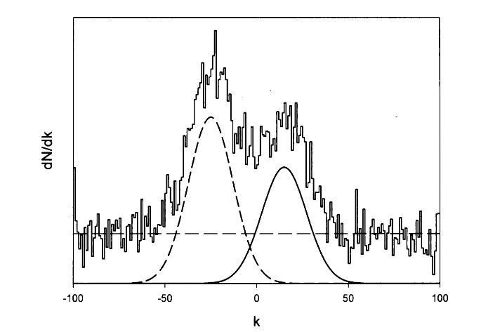
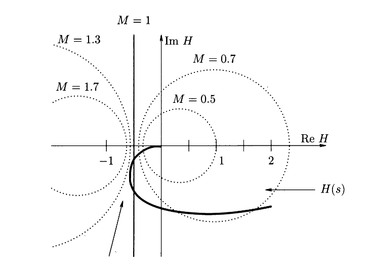
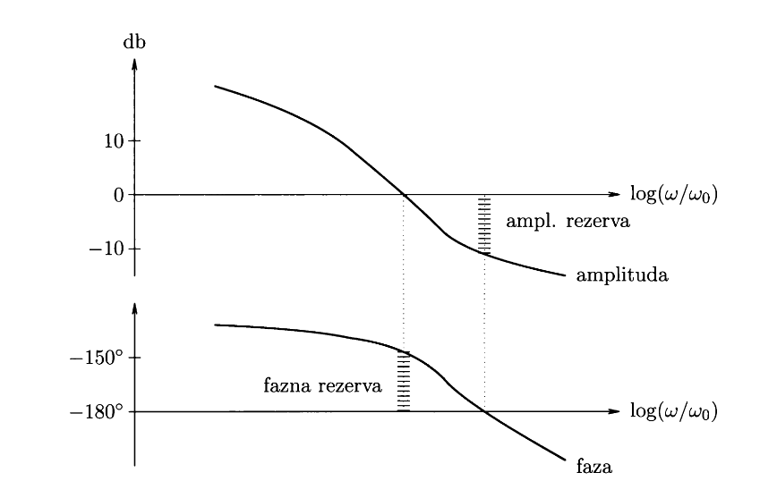

#+title: Statistika 
#+startup: nolatexpreview
#+startup: entitiespretty nil
#+startup: show2levels
#+latex_header: \usepackage{amsmath} \usepackage{cancel} \usepackage{graphicx}
#+latex_header: \renewcommand{\theta}{\vartheta} \renewcommand{\phi}{\varphi} \renewcommand{\epsilon}{\varepsilon}
#+latex_header: \newcommand{\odv}[1]{\dot{\vec{#1}}} \newcommand{\oddv}[1]{\ddot{\vec{#1}}}
#+latex_header: \newcommand{\rot}{\mathrm{rot}}\newcommand{\dive}{\mathrm{div}} \newcommand{\iu}{\mathrm{i}}
#+latex_header: \newcommand\mapsfrom{\mathrel{\reflectbox{\ensuremath{\mapsto}}}}
#+latex_header: \def\npredmet{FMER - STAT}
#+latex_header: \usepackage[european]{circuitikz}
#+bibliography: refs.bib
* Meritve konstantnih količin in statistika
** Studentova \( T \) statistika
#+begin_idea
Imamo senzor, ki nam daje izmerke oblike \( z = H x + r \). Iz \( n \) izmerkov želimo določiti povprečno vrednost šuma \( \bar{r} \) in njegovo disperzijo \( R \). Želeli bi tudi potrditi, ali je šum normalno porazdeljen (kar je bila do sedaj samo predpostavka).

Imamo \( n \) nekoreliranih izmerkov, ki so vsi porazdeljeni po istem normalnem zakonu z neznanima parametroma \( \mathcal{N} (a, \sqrt{R}) \).

S Studentovo \( T \)-statistiko trdimo, da vrednost \( T \) in pripadajoče povprečje \( a \), leži znotraj intervala \( [t_{<}, t_{>}] \) z verjetnostjo \( 1 - \alpha \).
#+end_idea

#+begin_izpeljava
Naredimo *vzorčni funkciji* ali *statistiki*

\begin{align*}
  \bar{z} &= \frac{1}{n} \sum\limits_{i = 1}^n z_i \\
S ^2 &= \frac{1}{n - 1} \sum\limits_{i = 1}^n \left( z_i - \bar{z}  \right)^2,
\end{align*}
s čimer sestavimo novo statistiko

\[ T = \frac{\bar{z} - a}{\sqrt{S ^2}} \sqrt{n}. 
\]

Nova statistika ima verjetnostno gostoto

\begin{equation}
\label{eq:1}
 \frac{\mathrm{d} P}{\mathrm{d} T} = \frac{1}{\sqrt{n - 1} B\left(\frac{n - 1}{2}, \frac{1}{2}\right)} \left( 1 + \frac{T ^2}{n - 1} \right)^{- \frac{n}{2}} = S (n - 1),
\end{equation}
kjer je \( B \) Beta funkcija definirana kot

\[ B(x, y) = \int\limits_0^1 t^{x - 1} (1 - t)^{y - 1} \, \mathrm{d} t. 
\]
Porazdelitvi v enačbi \eqref{eq:1} pravimo Studentova porazdelitev z \( n - 1 \) prostostnimi stopnjami.

Porazdelitev je neodvisna od parametrov \( a \) in \( R \), je soda funkcija in je podobna normalni porazdelitvi, vendar ima bolj položne repe.

Porazdelitev ima maksimalno vrednost pri \( T = 0 \) in tukaj izberemo oceno za \( a \), ki je

\[ a = \bar{z}.
\]

Izberemo si simetričen interval \( [t_{<} = - t, t_{>} = t] \), na katerem z izbrano verjetnostjo \( \alpha \) ležijo vrednosti \( T \) in pripadajoče vrednosti \( a \). Interval zaupanja (ang. /confidence level/) definiramo kot

\[ \int\limits_{t_{<}}^{t_{>}} \frac{\mathrm{d} P}{\mathrm{d} T} \, \mathrm{d} T = 1 - \alpha. 
\]

Z (veliko) verjetnostjo \( 1 - \alpha \) pričakujemo \( \left| T \right| \leq t \) (oz. vrednost \( T \) je v intervalu zaupanja \( [-t, t] \)). Z majhno verjetnostjo \( \alpha \) pričakujemo \( \left| T \right| > t \) (oz. vrednost \( T \) je izven intervala zaupanja).

Parametru \( 1 - \alpha \) pravimo stopnja zaupanja, \( \alpha \) pa stopnja tveganja.

Iz pogoja

\[ t_{<} = - t \leq \frac{\bar{z} - a}{S} \sqrt{n} \leq t_{>} = t,
\]
dobimo, da je iskano povprečje \( a \) z verjetnostjo \( 1 - \alpha \) znotraj intervala

\[ a \in \left[ \bar{z} - \frac{t_{<} S}{\sqrt{n}}, \bar{z} + \frac{t_{>} S}{\sqrt{n}} \right] 
\]

Značilne vrednosti stopnje zaupanja so \( 90\% \), \( 95\% \) in \( 99\% \).
#+end_izpeljava
** Porazdelitev \( \chi ^2 \)
#+begin_idea
S porazdelitvijo \( \chi ^2 \) določimo disperzijo \( R \) s stopnjo zaupanja \( 1 - \alpha \).
#+end_idea
#+begin_izpeljava
Statistika \( \chi ^2 \) je definirana z

\begin{equation}
\label{eq:3}
 \chi ^2 = \frac{(n - 1) S ^2}{R}, 
\end{equation}
njen porazdelitveni zakon pa je 

\[ \frac{\mathrm{d} P}{\mathrm{d} \chi ^2} = \chi ^2 (n - 1) = \frac{1}{2^{\frac{n - 1}{2}} \Gamma \left( \frac{n - 1}{2} \right)} \left( \chi ^2 \right)^{\frac{n - 3}{2}} e^{- \frac{\chi ^2}{2}}, \quad \chi \geq 0.
\]

Porazdelitev \( \frac{\mathrm{d} P}{\mathrm{d} \chi ^2 } \) označimo z \( \chi ^2 (n - 1) \) in ji rečemo, porazdelitev \( \chi ^2 \) z \( n - 1 \) prostostnimi stopnjami.

Interval zaupanja \( \chi ^2 \in [ \chi ^2 _{<}, \chi ^2 _{>}] \) določimo z integralom

\[ \int\limits_{\chi_{<} ^2}^{\chi_{>} ^2} \frac{\mathrm{d} P}{\mathrm{d} \chi ^2} \, \mathrm{d} \chi ^2 = 1- \alpha,
\]
kjer interval zaupanja dobimo tako, da ga simetrično obrežemo

\begin{align*}
  \int\limits_{\chi_{>} ^2}^{\infty} \frac{\mathrm{d} P}{\mathrm{d} \chi ^2 } \, \mathrm{d} \chi ^2 &= \frac{\alpha}{2}\\
\int\limits_0^{\chi_{<} ^2} \frac{\mathrm{d} P}{\mathrm{d} \chi ^2 } \, \mathrm{d} \chi ^2 &= \frac{\alpha}{2}
\end{align*}

Iz pogoja

\[ \chi_{<} ^2 \leq \frac{(n - 1) S ^2}{R} \leq \chi_{>} ^2,  
\]
dobimo interval zaupanja za disperzijo

\[  R \in \left[ \frac{(n - 1) S ^2}{\chi_{<} ^2}, \frac{(n - 1) S ^2}{\chi_{>} ^2} \right]
\]
#+end_izpeljava

#+begin_theorem
Vsote kvadratov \( n \) neodvisnih spremenljivk porazdeljenih po normalni porazdelitvi \( \mathcal{N}(0, 1) \) je porazdeljena po univerzalnem zakonu \( \chi ^2 (n) \).
#+end_theorem
#+begin_proof
Imamo izmerke \( z_i \), ki so porazdeljeni po \( \mathcal{N} (\bar{z}, \sigma ^2) \) in pripadajočo disperzijo

\begin{equation}
\label{eq:2}
 S ^2 = \frac{1}{n - 1} \sum\limits_{i = 1}^n \left( z_i - \bar{z} \right) ^2.
\end{equation}

Spremenljivka

\[ x = \frac{z_i - \bar{z}}{\sigma}, 
\]
ima standardno normalno porazdelitev \( \mathcal{N}(0, 1) \). Pripadajoča disperzija je porazdeljena po \( \chi ^2 (n - 1) \), ko obe strani enačbe \eqref{eq:2} množimo s \( \sigma ^2 \)

\[ \sum\limits_{i= 1}^n \frac{\left( z_i - \bar{z} \right) ^2}{\sigma ^2} = \frac{S ^2 (n - 1)}{\sigma ^2} = \chi (n - 1). 
\]
#+end_proof

#+begin_theorem
Naj bo \( X \) porazdeljena po \( \mathcal{N}(0, 1) \) in \( Y \) porazdeljena po \( \chi ^2 (n) \). Iz njiju lahko tvorimo \( T \)-statistiko porazdeljeno po \( S(n) \) s predpisom

\[ T = \frac{X}{\sqrt{\frac{Y}{n}}}. 
\]
#+end_theorem

#+begin_proof
Izhajamo iz definicije \( T \) statistike

\[ T = \frac{\bar{z} - a}{s} \sqrt{n}. 
\]

Imenovalec razširimo s \( \sigma \)

\[ T = \frac{\bar{z} - a}{\sigma \sqrt{\frac{s ^2}{\sigma ^2}}} \sqrt{n} 
\]

Koren v imenovalcu dodatno razširimo z \( (n - 1) \) in malo preoblikujemo

\[ T = \frac{\bar{z} - a}{\frac{\sigma}{\sqrt{n}}} \cdot \left( \sqrt{\frac{s ^2}{\sigma ^2} \frac{n - 1}{n - 1}} \right)^{-1}
\]

Člen \( \frac{\bar{z} - a}{\frac{\sigma}{\sqrt{n}}} \) je porazdeljen po \( \mathcal{N}(0, 1) \), v korenu pa prepoznamo definicijo \( \chi ^2 \), enačba \eqref{eq:3}, kar pomeni, da je porazdeljen po \( \chi ^2 (n - 1) \). Zapišemo torej

\[ T = \frac{X}{\sqrt{\frac{Y}{n - 1}}}. 
\]
#+end_proof
** Oblikovni testi
#+begin_idea
Z oblikovnimi testi preverimo, ali porazdelitev naključne spremenljivke v izmerjenem vzorcu odstopa od privzete porazdelitve.
#+end_idea
*** Pearsonov \( \chi ^2 \) test
#+begin_idea
\( N \) izmerkov razdelimo na \( \rho \) (ne-)enakih intervalov (ali *razredov*), ki se med seboj *ne prekrivajo* in hkrati *pokrijejo celotno območje*, kjer je verjetnostna gostota različna od nič. V razredu \( k \) naj bo \( N_k \) izmed vseh izmerkov in njegove meje so \( \left[ \xi_{k - 1}, \xi_k \right] \). Verjetnost \( p_k \), da je izmerek v \( k \)-tem razredu je definirana

\[ p_k = \int\limits_{\xi_{k - 1}}^{\xi_k} \frac{\mathrm{d} P}{\mathrm{d} \xi} \, \mathrm{d} \xi. 
\]

V \( k \)-tem razredu bo potem \( N p_k \) izmerkov.

Za pravilno izbrano porazdelitev je razlika \( N_k - Np_k \) bel šum. S Pearsonovim \( \chi ^2 \) testom

\[ \chi ^2 = \sum\limits_{k = 1}^{\rho} \frac{\left( N_k - Np_k \right) ^2}{Np_k} 
\]
dobimo informacijo o statistični pomembnosti odmikov \( Np_k \) od \( N_k \). Porazdeljen je po \( \chi ^2 (\rho - 1) \).
#+end_idea
#+attr_latex: :options [Disperzija \( \chi ^2 \)]
#+begin_izpeljava
Zahtevamo, da je \( \frac{\left( N_k - Np_k \right) ^2}{Np_k} \) standardizirano normalno porazdeljen \( \mathcal{N}(0, 1) \). Razlika v števcu je beli šum, vendar ali je disperzija \( Np_k \) pravilno izbrana?

Štejemo zadetke v \( k \)-tem razredu, pričakujemo pa jih \( Np_k = \bar{N} \). Odstopanje od \( \bar{N} \) je podana s Poissonovo porazdelitvijo

\[ w_v = \frac{\mathrm{d} P}{\mathrm{d} N} = \frac{\bar{N}^N e^{- \bar{N}}}{N!} 
\]

Za dovolj velik \( \bar{N} \geq 10 \) je širina zvonaste porazdelitve približno \( \mathcal{N}(\bar{N}, \sqrt{\bar{N}}) \).
#+end_izpeljava

#+attr_latex: :options [Radioaktivni razpad]
#+begin_my_example
Opazujemo radioaktivni razpad in beležimo čas med sosednjima sunkoma \( t_k \). Imamo vzorec z \( N = 100 \) meritvami, za katere čas \( t_k > 1.6 \mathrm{s} \). Ali lahko na stopnjo tveganja \( \alpha = 5\% \) ovržemo hipotezo \( \tau = 1 \mathrm{s} \). Eksponentna porazdelitev je definirana kot

\[ \frac{\mathrm{d} P}{\mathrm{d} t} = \frac{1}{\tau} e^{- \frac{t}{\tau}}. 
\]

Ustvarimo dva razreda (\( \rho = 2 \)). Prvi razred \( k = 1 \) je na intervalu \( t \in [0, 1.6 \mathrm{s}] \), drugi \( t = (1.6 \mathrm{s}, \infty] \). V prvem razredu je torej \( N_1 = 100 \), v drugem razredu pa \( N_2 = 0 \). Izračunajmo \( Np_1 \) in \( Np_2 \) po definiciji

\begin{align*}
  Np_1 &= N \int\limits_0^{1.6 \mathrm{s}} \frac{\mathrm{d} P}{\mathrm{d} t} \, \mathrm{d}t = 100 \int\limits_0^{1.6 \mathrm{s}} \frac{1}{\tau} e^{- \frac{t}{\tau}} \, \mathrm{d} t = 80 \\
Np_2 &= N \int\limits_{1.6 \mathrm{s}}^{\infty} \frac{1}{\tau} e^{- \frac{t}{\tau}} = 20
\end{align*}

Pearsonov \( \chi ^2 \) test je po definiciji

\[ \chi ^2 = \frac{(100 - 80) ^2}{80} + \frac{(0 - 20) ^2}{20} = 25.  
\]

Tabelirana vrednost porazdelitve \( \chi ^2(\rho - 1) \) pa je za \( \rho = 2 \) in \( \alpha = 0.05 \)

\[ \chi_{>} ^2 (2 - 1)^{0.05} = 5.99.
\]

Ker je \( \chi ^2 = 25 > \chi_{>} ^2 = 5.99\) lahko hipotezo za \( \tau = 1 \mathrm{s} \) za stopnjo tveganja \( 5\% \) zavržemo.
#+end_my_example
*** Fisherjev test in funkcija zanesljivosti
#+begin_idea
Imamo neznan porazdelitveni zakon \( \frac{\mathrm{d} P}{\mathrm{d} \xi} \) z neznanimi parametri \( Q_1, Q_2, \ldots, Q_m \)

\[ \frac{\mathrm{d} P}{\mathrm{d} \xi} (Q_1, Q_2, \ldots, Q_m). 
\]

Parametre ocenimo iz meritev, s podanimi parametri pa lahko uporabimo v nadaljevanju Pearsonov \( \chi ^2 \) test.
#+end_idea
#+attr_latex: :options [Funkcija zanesljivosti]
#+begin_izpeljava
Izmerke razdelimo na \( \rho \) intervalov kot pri Pearsonovem testu. Sestavimo funkcijo zanesljivosti

\[ L^{\ast} = \prod\limits_{k = 1}^{\rho} \left[ p_k (Q_1, Q_2, \ldots, Q_m) \right]^{N_k}.
\]

Parametre poiščemo z ekstremom funkcije zanesljivosti, ki je sistem enačb

\[ \frac{\partial L^{\ast}}{\partial Q_{i}} = \frac{\partial \ln L^{\ast}}{\partial Q_{i}} =  0, \ i = 1, 2, \ldots, m. 
\]

Iz ocen \( Q_1^{\ast}, Q_2^{\ast}, \ldots, Q_m^{\ast} \) sestavimo test

\[ \chi ^2 = \sum\limits_{k = 1}^{\rho} \frac{\left( N_k - Np_k^{\ast} \right) ^2}{Np_k ^{\ast}},
\]
ki je porazdeljena po \( \chi ^2 (\rho - 1 -m) \).
#+end_izpeljava

#+attr_latex: :options [Poenostavljena funkcija zanesljivosti]
#+begin_izpeljava
Pri poenostavljeni funkciji zanesljivosti izmerkov ne razdelimo na \( \rho \) razredov, ampak jo definiramo kot

\[ L = \prod_{k=1}^{N} \frac{\mathrm{d} P}{\mathrm{d} z} \left( z_k , Q_1, Q_2, \ldots, Q_m \right),
\]
kjer to izračunamo v vrednostih izmerkov \( z_k \). Enako zahtevamo ekstrem funkcije

\[ \frac{\partial L}{\partial Q_{i}} = 0, 
\]
iz česar dobimo ocene \( \hat{Q}_1, \hat{Q}_2, \ldots, \hat{Q}_m \), iz katerih potem tvorimo statistiko. Pri velikem številu izmerkov, je porazdelitev \( \chi ^2 \) nekje med \( \chi ^2 (\rho - 1 - m) \) in \( \chi ^2 ( \rho - 1 ) \).
#+end_izpeljava

#+begin_my_example
Ocenjujemo radioaktivni razpad s porazdelitvijo

\[ \frac{\mathrm{d} P}{\mathrm{d} t} = \frac{1}{\tau} e^{- \frac{t}{\tau}}, 
\]
kjer iščemo optimalno vrednost parametra \( \tau \). Poenostavljena funkcija zanesljivosti je

\[ L = \prod_{k = 1}^N \frac{1}{\tau} e^{- \frac{t_k}{\tau}} = \frac{1}{\tau ^N} \exp \left\{ - \sum\limits_{k = 1}^N \frac{t_k}{\tau} \right\}.
\]

Enačbo logaritmiramo

\[ \ln L = -N \ln \tau - \sum\limits_{k = 1}^N \frac{t_k}{\tau},
\]
ter odvajamo po parametru \( \tau \)

\[ \frac{\partial L}{\partial \tau} = - \frac{N}{T} + \frac{1}{\tau ^2} \sum\limits_{k = 1}^N t_k = 0. 
\]

Dobimo pogoj

\[ \tau = \frac{1}{N} \sum\limits_{k = 1}^N t_k. 
\]

Optimalna vrednost \( \tau \) bo torej povprečje vseh izmerkov.
#+end_my_example
*** Test Kolmogorova
#+begin_idea
S testom Kolmogorova preverimo ali število izmerkov \( z_1, z_2, \ldots, z_N \) podpirajo zvezno porazdelitveno funkcijo.
#+end_idea

#+begin_izpeljava
Definiramo zvezno kumulativno porazdelitveno funkcijo \( F(z) \)

\[ F(z) = \int\limits_{- \infty}^z \frac{\mathrm{d} P}{\mathrm{d} \xi} \, \mathrm{d}\xi. 
\]

Naj \( k(z) \) označuje število izmerkov, ki so manjši od \( z \). Definiramo eksperimentalno kumulativno funkcijo

\[ f(z) = \frac{k(z)}{N}. 
\]

#+attr_latex: :width 0.5\textwidth :caption \caption{Kumulativna (zvezna) in eksperimentalna kumulativna (stopničasta) porazdelitvena funkcija, vir \cite{likar_osnove_2016}}
[[file:figures/testKolmogorova1.png]]

Opazujemo absolutno vrednost največje odmika

\[ D = \sup_{- \infty < z < \infty} \left| F(z) - f(z) \right| 
\]

Če so izmerki usklajeni s porazdelitvenim zakonom \( \frac{\mathrm{d} P}{\mathrm{d} \xi} \), potem je ta razlika izjemoma zelo velika.

Velja limita

\[ \lim_{N \to \infty} P \left( D \sqrt{n} < d \right) = \sum\limits_{k = -\infty}^{\infty} \left( -1 \right)^k e^{-2k ^2 d ^2}, 
\]
kjer je \( d \) meja.

#+attr_latex: :width 0.5\textwidth :caption \caption{Limitna verjetnost \( P \) in stopnja zaupanja \( 1 - \alpha \), ter stopnja tveganja \( \alpha \), vir \cite{likar_osnove_2016}.}
[[file:figures/testKolmogorova2.png]]

Pri testiranju si mejni \( d_{>} \) izberemo tako, da je \( P(D \sqrt{N} < d_{>}) = 1- \alpha \). Če je \( D \sqrt{N} > d_{>} \), potem lahko s tveganjem \( \alpha \) zavrnemo hipotezo, da \( F(z) \) ustreza izmerkom.
#+end_izpeljava
* Metode najmanjših kvadratov
#+begin_idea
Z metodo najmanjših kvadratov želimo odfiltrirati šum iz že opravljenih \( n \) meritev \( z_1, z_2, \ldots, z_n \) konstantnih količin. Senzorska matrika je časovno odvisna \( H = H(t) \). Signal iz senzorja v vektorski obliki je

\[ \mathbf{z} = \mathsf{H} \mathbf{x} + \mathbf{r}, 
\]
v matrični obliki pa

\[ \begin{bmatrix} z_{1} \\ z_{2} \\ \vdots \\ z_{n} \end{bmatrix} = \begin{bmatrix}
f_0(t_1) & f_1 (t_1) & \ldots & f_m(t_1) \\
\vdots & \vdots & \ddots & \vdots \\
f_0(t_n) & f_1 (t_n) & \ldots & f_m(t_n) \\
\end{bmatrix} \begin{bmatrix} x_{0} \\ x_{1} \\ \vdots \\ x_{m} \end{bmatrix}.
\]

Optimalne vrednosti koeficientov vektorja \( \mathbf{x} \) poiščemo preko kvadratne forme

\[ 2J = \left( \mathbf{z} - \mathsf{H} \mathbf{x} \right)^T \mathsf{R}^{-1} \left( \mathbf{z} - \mathsf{H} \mathbf{x} \right),
\]
kjer privzamemo nekoreliranost komponent šuma in enako disperzijo \( \mathsf{R} = \sigma ^2 I \), in njegovega ekstrema

\[ \frac{\partial (2J)}{\partial \mathbf{x}} = 0. 
\]

Optimalne vrednosti so ob privzetku \( \bar{x} = 0 \) in \( M^{-1} = 0 \)

\[ \hat{\mathbf{x}} = \left( \mathsf{H}^T \mathsf{H} \right)^{-1} \mathsf{H}^T \mathbf{z} 
\]
#+end_idea
#+begin_izpeljava
Pri obravnavi vektorskih meritev smo rezultat za optimalno oceno

\[ \hat{\mathbf{x}} = \bar{\mathbf{x}} + \mathsf{P} \mathsf{H} \mathsf{R}^{-1} \left( \mathbf{z} - \mathsf{H} \bar{\mathbf{x}} \right), 
\]
kjer je

\[ \mathsf{P}^{-1} = \mathsf{M}^{-1} + \mathsf{H}^T \mathsf{R}^{-1} \mathsf{H} 
\]

Pred časom \( t = t_0 \) ne vemo ničesar o meritvi, zato \( \mathsf{M}^{-1} = 0 \). Prav tako postavimo \( \bar{\mathbf{x}} = 0 \).

Če privzamemo, da so komponente šuma medseboj nekorelirane in enake, potem velja

\[ \mathsf{R} = \sigma ^2 I \implies \mathsf{R}^{-1} = \frac{1}{\sigma ^2} I 
\]

Disperzija je tako podana z

\begin{equation}
\label{eq:5}
 P = \sigma ^2 \left( \mathsf{H}^T \mathsf{H} \right)^{-1}, 
\end{equation}
in optimalne vrednosti koeficientov so

\begin{equation}
\label{eq:4}
 \hat{\mathbf{x}} = \left( \mathsf{H}^T \mathsf{H} \right)^{-1} \mathsf{H}^T \mathbf{z}.
\end{equation}

Kovariančna matrika je porazdeljena po \( \chi ^2 (n - m - 1) \) z \( n - m - 1 \) prostostnimi stopnjami.
#+end_izpeljava
** Primer: Linearen fit

V primeru izmerkov oblike \( \mathbf{z} = x_0 t + \mathbf{r} \), je matrična enačba oblike

\[ \begin{bmatrix} z_{1} \\ z_{2} \\ \vdots \\ z_{n} \end{bmatrix} = \begin{bmatrix} t_{1} \\ t_{2} \\ \vdots \\ t_{n} \end{bmatrix} x_0 + \mathbf{r}
\]

Produkt senzorskih matrik je

\[ \mathsf{H}^T \mathsf{H} = \sum\limits_{i = 1}^n t_i ^2, 
\]
optimalna ocena pa je

\[ x_0 = \frac{1}{\sum\limits_{i = 1}^n t_i ^2} \sum\limits_{i = 1}^n t_i z_i. 
\]

V primeru izmerkov oblike \( \mathbf{z} = x_0 t + x_1 + r \), pa je matrična enačba oblike

\[ \begin{bmatrix} z_{1} \\ z_{2} \\ \vdots \\ z_{n} \end{bmatrix} = \begin{bmatrix} t_{1} & 1 \\ t_{2} & 1 \\ \vdots & \vdots \\ t_{n} & 1 \end{bmatrix} \begin{bmatrix} x_{0} \\ x_{1} \end{bmatrix} + \mathbf{r}
\]

Produkt senzorskih matrike je

\[ \mathsf{H}^T \mathsf{H} = \begin{bmatrix}
                             t_{1} & t_{2} & \ldots & t_n \\
                             1 & & 1 & \ldots & 1
                              \end{bmatrix} \begin{bmatrix}
                                            t_{1} & 1 \\
                                            t_{2} & 1 \\
                                            \vdots & \vdots \\
                                            t_{n} & 1
                                             \end{bmatrix} = \begin{bmatrix}
                                                             \sum\limits_{i = 1}^n t_i ^2 & \sum\limits_{i = 1}^n t_i \\
                                                             \sum\limits_{i = 1}^n t_i & n
                                                              \end{bmatrix}
\]

Njen inverz je kot vemo iz Matematike 2

\[ \left( \mathsf{H}^T \mathsf{H} \right)^{-1} = \frac{1}{n \sum\limits_{i = 1}^n t_i ^2 - \left( \sum\limits_{i = 1}^n t_i \right) ^2} \begin{bmatrix}
n & - \sum\limits_{i = 1}^nt_i \\
-\sum\limits_{i = 1}^n t_i &  \sum\limits_{i = 1}^n t_i ^2
\end{bmatrix} 
\]

Končno pa še

\[ \mathsf{H}^T \mathbf{z} = \begin{bmatrix} \sum\limits_{i = 1}^n t_i z_i \\ \sum\limits_{i = 1}^n z_i \end{bmatrix}. 
\]

Optimalni vrednosti koeficientov sta

\[ \hat{x} = \begin{bmatrix} x_{0} \\ x_{1} \end{bmatrix} = \frac{1}{n \sum\limits_{i = 1}^n t_i ^2 - \left( \sum\limits_{i = 1}^n t_i  \right) ^2}\begin{bmatrix} n \sum\limits_{i = 1}^n t_i z_i - \left( \sum\limits_{i = 1}^n t_i \right) \left( \sum\limits_{i = 1}^n z_i \right) \\ - \left( \sum\limits_{i = 1}^n t_i \right) \left( \sum\limits_{i = 1}^n t_i z_i \right) + \left( \sum\limits_{i= 1}^n z_i \right) \left( \sum\limits_{i = 1}^n t_i \right) ^2 \end{bmatrix}
\]
** Luščenje vrhov v spektru
#+begin_idea
Pri radioaktivnem razpadu merimo amplitude sunkov iz detektorjev žarkov \( \gamma \). Ti izmerki so sestavljeni iz ozadja (koeficient \( B \)) ter vrhovov, ki ustrezajo fotonom z dano energijo. Izmerjeni vrhovi se lahko med sabo prekrivajo kot kaže to spodnja slika

#+attr_latex: :width 0.5\textwidth :caption \caption{Prekrivanje dveh vrhov spektra, vir \cite{likar_osnove_2016}.}

K izmerku \( z_i \) prispevata oba vrhova in ozadje, zato zapišemo

\[ z_i = \left( \mathsf{H} \mathbf{x} + \mathbf{r} \right)_i = B + A_1 f_1 (i) + A_2 f_2 (i) + r_i, \quad i = E_i
\]
kjer sta \( A_1 \) in \( A_2 \) amplitudi, \( f_1 \) in \( f_2 \) pa obliki vrhov, v našem primeru Gaussovsko porazdeljeni

\[ f_k (i) = \exp \left\{ - \frac{\left( i - a_k \right) ^2}{2 \sigma_k ^2} \right\}, \quad k = 1, 2. 
\]

S pomočjo metode najmanjših kvadratov določimo optimalni vrednosti amplitud

\[ \hat{\mathbf{x}} = \begin{bmatrix} \hat{A}_{1} \\ \hat{A}_{2} \end{bmatrix} = \frac{1}{\sum\limits_{i = 1}^n f_1 ^2 \sum\limits_{i = 1}^n f_2 ^2 - \left( \sum\limits_{i = 1}^n f_1 f_2 \right) ^2}\begin{bmatrix}
\sum\limits_{i = 1}^n f_2 ^2 (i)  \sum\limits_{i = 1}^n f_1 (i) z_i - \sum\limits_{i = 1}^n f_1 (i) f_2 (i) \sum\limits_{i = 1}^n f_2 (i) z_i\\ - \sum\limits_{i= 1}^n f_1 (i) f_2 (i) \sum\limits_{i = 1}^n f_1 (i) z_i + \sum\limits_{i = 1}^n f_1 ^2 (i) \sum\limits_{i = 1}^n f_2 (i) z_i \end{bmatrix}
\]

Kovariančna matrika je

\[ P = \sigma ^2 \left( \mathsf{H}^T \mathsf{H} \right)^{-1} = \frac{\sigma ^2}{\sum\limits_{i = 1}^n f_1 ^2 (i) \sum\limits_{i = 1}^n f_2 ^2 (i) - \left( \sum\limits_{i = 1}^n f_1 (i) f_2 (i)  \right) ^2}\begin{bmatrix}
\sum\limits_{i = 1}^n f_2 ^2 (i) & - \sum\limits_{i = 1}^n f_1 (i) f_2 (i) \\
-\sum\limits_{i= 1}^n f_1 (i) f_2 (i) & \sum\limits_{i = 1}^n f_1 ^2 (i)
 \end{bmatrix}.
\]

V primeru, da sta vrhova dobro ločljiva (ni pokrivanja), sta izvendiagonalna člena \( p_{12} = 0 \), saj je \( \sum\limits_{i = 1}^n f_1(i) f_2 (i) \approx 0 \).

V primeru, da vrhova nista dobro ločljiva, potem \( p_{12} = 0 \), potem velja \( f_1 (i) \approx f_2 (i) \). Sledi

\[ \rho_{12} = \frac{- \sum\limits_{i = 1}^n f_1 (i)  f_2 (i)}{\sqrt{\sum\limits_{i = 1}^n f_1 ^2 (i) f_2 ^2 (i)}}  = -1
\]
#+end_idea

#+begin_izpeljava
Za izmerek

\[ z_i = \left( \mathsf{H} \mathbf{x} + \mathbf{r} \right)_i = B + A_1 f_1 (i) + A_2 f_2 (i) + r_i, \quad i = E_i,
\]
sta matrična elementa

\[ \mathsf{H} = \begin{bmatrix} f_{1}(1) & f_2 (1) \\ f_{1}(2) & f_{2}(2) \\ \vdots & \vdots \\ f_1(n) & f_2 (n)  \end{bmatrix} \quad \text{ in } \quad \mathbf{x} = \begin{bmatrix} A_{1} \\ A_{2} \end{bmatrix}
\]

Produkt matrik je

\[ \mathsf{H}^T \mathsf{H} = \begin{bmatrix}
                             \sum\limits_{i= 1}^n f_1 ^2 (i) & \sum\limits_{i = 1 }^n f_1 (i) f_2 (i) \\
                              \sum\limits_{i = 1}^n f_1 (i) f_2 (i) & \sum\limits_{i = 1}^n f_2 ^2 (i)
                              \end{bmatrix} 
\]

Dobljeno vstavimo v enačbo \eqref{eq:4} za optimalno oceno, ter enačbo \eqref{eq:5} za disperzijo.
#+end_izpeljava
** Merjenje odziva sistema na periodično motnjo
#+begin_idea
Imamo sistem \( S \) in senzor, ki nam daje izmerke oblike \( \mathbf{z} = \mathsf{H} \mathbf{x} + \mathbf{r} \). Za izluščitev šuma \( \mathbf{r} \) senzor dodatno moduliramo s periodičnim signalom \( \sin (\omega t + \delta) \).

Senzor je linearen sistem, torej bo tudi njegov odziv periodičen,

\begin{equation}
\label{eq:9}
 \mathbf{z} = x_0 \sin (\omega t + \delta) + \mathbf{r}. 
\end{equation}

V primeru, da je \( \delta = 0 \) postopamo kot v nadaljevanju.

Za \( n \) izmerkov lahko preko metode najmanjših kvadratov dobimo optimalno utež

\[ \hat{x}_0 = \frac{\sum\limits_{i = 1}^n \sin (\omega t_i) z_i \Delta t}{\sum\limits_{i = 1}^n \sin ^2 (\omega t_i) \Delta t} \overset{\Delta t \to 0}{\longrightarrow} \frac{\int\limits_0^t \sin (\omega t) z(t)\, \mathrm{d} t}{\int\limits_0^T \sin ^2 (\omega t) \, \mathrm{d} t}
\]

Kovariančna matrika pa je

\[ P = \frac{\sigma ^2}{\sum\limits_{i = 1}^n \sin ^2 (\omega t_i)  \Delta t} \frac{\Delta t}{\Delta t} \overset{\Delta t \to 0}{\longrightarrow} \frac{\sigma ^2 \Delta t}{\int\limits_0^T \sin ^2 (\omega t) \, \mathrm{d} t} = \frac{2}{T} \sigma ^2 \Delta t 
\]

V limiti je \( \lim_{\Delta t \to 0} \sigma ^2 \Delta t = R \). Potem je

\[ \lim_{T \to \infty} P = \lim_{T \to \infty} \frac{2R}{T} = 0. 
\]

Negotovost gre poti \( 0 \), dlje časa kot merimo.

Šum s frekvencami v okolici delovne frekvence pride skozi filter kot

\[ \alpha(\omega) = A_{\omega} \frac{\sin \left[ (\omega - \omega_0) T \right]}{T (\omega - \omega_0)},
\]
za referenčni signal

\[ A(t) = A_{\omega} \cos (\omega_0 t). 
\]

Frekvenčno okno se oža za daljše integracijske čase kot

\[ \Delta \omega = 2 (\omega - \omega_0) = \frac{2\pi}{T} \propto \frac{1}{T}. 
\]

V primeru, da faza \( \delta \ne 0 \) v enačbi \eqref{eq:9}, si pomagamo z dodatnim referenčnim signalom, ki je zamaknjen za \( \frac{\pi}{2} \) od prvega. Fazo potem izračunamo kot

\[ \tan \delta = \frac{Y_{\frac{\pi}{2} F}}{Y_0F},
\]
kjer sta \( Y_{0F} \) in \( Y_{\frac{\pi}{2} F} \) referenčna signala filtrirana skozi LPF.

Optimalna amplituda pa je

\[ x_0 = \frac{2 \sqrt{Y_{0F} ^2 + Y_{\frac{\pi}{2} F} ^2} }{RT} 
\]

Moduliramo spremenljivko(-e), od katere je odvisen izhod na senzorju. Če je šum nastal pred modulacijo (npr. moduliranje napetosti na senzorju), se ga ne znebimo. Naj bo izhod na senzorju odvisen od stimulusa \( s \) (magnetno polje \( B \), električno polje \( E \), temperatura \( T \), ipd.) in njena modulacija je

\[ s(t) = \bar{s} + A \sin (\Omega T), \quad A \ll \bar{s}. 
\]

Izhodna funkcija iz senzorja \( V = V(s) \) je potem enako periodična s frekvenco \( \Omega \). Z lock-in detekcijo (vzamemo izhodni signal, ga pomnožimo z referenčnim signalom) izluščimo Fourierovo komponento (sinusno funkcijo) izhoda s frekvenco \( \omega \)

\[ V(s) = V(\bar{s}) + \left.\frac{\mathrm{d} V}{\mathrm{d} s}\right|_{\bar{s}} A \sin (\omega t) + \left. \frac{1}{2} \frac{\mathrm{d} ^2 V}{\mathrm{d} s ^2} \right|_{\bar{s}} A ^2 \sin ^2 (\omega t) + \ldots  
\]

Izhodna funkcija je potem odvisen od

\[ V_{out} \propto \left. A \frac{\mathrm{d} V}{\mathrm{d} s}\right|_{\bar{s}} 
\]
#+end_idea

#+attr_latex: :options [Merjenje odziva sistema na periodično motnjo]
#+begin_izpeljava

Amplituda \( x_0 \) vsebuje informacije o spremenljivki \( x \), ki jo merimo, in jo moramo izračunati.

Z znano funkcijo \( \sin(\omega t + \delta) \) lahko pridobimo informacije o amplitudi \( x_0 \) preko metode najmanjših kvadratov.

Po opravljenih \( n \) meritvah ob časih \( t_1 = \Delta t, t_2 = 2 \Delta t, \ldots, t_n = n \Delta t \), zapišemo senzorsko okno kot

\[ \mathsf{H} = \begin{bmatrix} \sin(\delta) \\ \sin(\omega \Delta t + \delta) \\ \vdots \\ \sin (n \omega \Delta t + \delta ) \end{bmatrix}. 
\]

Optimalna vrednost ocene za amplitudo je potem po definiciji

\[ \hat{x}_0 = \left( \mathsf{H}^T \mathsf{H} \right)^{-1} \mathsf{H}^T \mathbf{z} = \frac{\sum\limits_{i = 1}^n z_i \sin (\omega t_i + \delta)}{\sum\limits_{i = 1}^n \sin ^2 (\omega t_i + \delta)}
\]

V limiti \( \Delta t \to 0 \) je potem optimalna vrednost ocene za amplitudo

\begin{equation}
\label{eq:6}
 \hat{x}_0 = \frac{\int\limits_0^T \sin (\omega t + \delta) z(t) \, \mathrm{d} t}{\int\limits_0^T \sin ^2 (\omega t + \delta) \, \mathrm{d} t} 
\end{equation}

Meritev \( z(t) \) pomnožimo s funkcijo, s katero smo modulirali signal (aka *referenčni signal*), in dobimo optimalno oceno, ki ima izluščen šum.

Napaka ocenjene amplitude \( \hat{x}_0 \) je po definiciji

\[ \mathsf{P} = \left( \mathsf{H}^T \mathsf{H} \right)^{-1} \sigma ^2 = \frac{\sigma ^2}{\sum\limits_{i = 1}^n \sin ^2 (\omega t_i + \delta)} 
\]

Zgornji ulomek razširimo z \( \Delta t \) in v limiti \( \Delta t \to 0 \) dobimo

\[ P = \frac{\lim_{\Delta t \to 0} (\sigma ^2 \Delta t)}{\int\limits_0^T \sin ^2 (\omega t + \delta) \, \mathrm{d} t} 
\]

Kot smo naredili pri vektorski spremenljivki, definiramo

\[ \lim_{\Delta t \to 0} (\sigma ^2 \Delta t) = R. 
\]

V limiti \( T \to \infty \) je vrednost imenovalca \( \frac{T}{2} \) in negotovost se izniči

\[ \mathsf{P} = \frac{2R}{T} \overset{T \to \infty}{\longrightarrow} 0  
\]
#+end_izpeljava

#+attr_latex: :options [Prepuščanje harmoničnega signala]
#+begin_izpeljava
Referenčni signal, s katerimo moduliramo senzor ima amplitudo \( A_{\omega} \) in frekvenco \( \omega_0 \)

\[ A(t) = A_{\omega} \cos (\omega_0 t). 
\]

Kot smo videli v enačbi \eqref{eq:6}, amplitudo \( x_0 \) dobimo tako, da pomnožimo signal \( z(t) \) z referenčnim signalom. Če nas zanima prepuščen harmonični signal, vzamemo \( z(t) = \cos (\omega t) \) in izračunamo

\[ \alpha(\omega) =  \frac{\int\limits_0^T \cos(\omega_0 t) \cos(\omega t) \, \mathrm{d} t}{\int\limits_0^T \cos ^2 (\omega_0 t) \, \mathrm{d} t}
\]

Upoštevamo, da je vrednost imenovalca \( \frac{T}{2} \), produkt kosinusov pa zapišemo kot vsoto

\[ \alpha(\omega) = \frac{A_{\omega}}{T} \int\limits_0^T \left\{ \cos \left[ (\omega - \omega_0) t \right] + \cos \left[ (\omega + \omega_0) t \right] \right\} \, \mathrm{d} t
\]

Izvrednotimo integral

\[ \alpha(\omega) = \frac{A_{\omega}}{T} \left\{ \frac{\sin \left[ (\omega - \omega_0) T \right]}{(\omega - \omega_0)} + \frac{\sin \left[ (\omega + \omega_0)T \right]}{(\omega + \omega_0)} \right\}.
\]

Prispevka razlike ali vsote frekvenc sta velika za \( \omega \approx \pm \omega_0 \) in ker nismo nikoli pri \( \omega = - \omega_0 \), lahko zadnji člen zanemarimo.

Velja torej

\[ \alpha(\omega) = A_{\omega} \frac{\sin \left[ (\omega - \omega_0) T \right]}{T (\omega - \omega_0)}. 
\]

Vemo, da velja limita

\[ \lim_{x \to 0}  \frac{\sin x}{x } = 0.
\]
Frekvenčno okno se potem oža kot

\[ \Delta \omega = 2 (\omega - \omega_0) \propto \frac{1}{T} 
\]

Dlje časa kot integriramo signal, bolj se znebimo šumov in ožje je frekvenčno okno.
#+end_izpeljava

#+attr_latex: :options [Lock-In detekcija]
#+begin_izpeljava
Imamo sistem \( S \) in senzor \( \mathbf{z} = \mathsf{H} \mathbf{x} + \mathbf{r} \). Ponovno umetno moduliramo signal na senzorju s periodično funkcijo. Tej periodični funkcijo previmo referenčni signal

\begin{equation}
\label{eq:7}
 \text{Ref}_0 = R \sin (\omega t). 
\end{equation}

Izhod iz senzorja pa bo oblike

\[ \mathbf{z} = x_0 \sin (\omega t + \delta) + \mathbf{r}. 
\]

Imamo *dve neznanki*: amplitudo \( x_0 \) in fazo \( \delta \), in obe neznanki nam podata informacije o spremenljivki \( x \). V primeru, da je \( \delta = 0 \) glej enačbo \eqref{eq:6}.

Poleg referenčnega signala \eqref{eq:7}, ki je v fazi s signalom \( z(t) \), lahko uporabimo tudi referenčni signal, ki je v fazi s prvim za \( \frac{\pi}{2} \)

\begin{equation}
\label{eq:8}
\text{Ref}_{\frac{\pi}{2}} = R \cos (\omega t).
\end{equation}

Preko metode najmanjših kvadratov za referenčni signal \eqref{eq:7} dobimo

\[ Y_0 = \text{Ref}_0  z(t) = \text{Ref}_0 \sin(\omega t + \delta).
\]

Signal \( Y_0 \) peljemo skozi integrator (low-pass filter) in integriran signal označimo z \( Y_{0F} \).

Na podoben način postopamo z referenčnim signalom \eqref{eq:8}, *vendar* \( z(t) \) *je še vedno moduliran s* \eqref{eq:7}!

\[ Y_{\frac{\pi}{2}} = \text{Ref}_{\frac{\pi}{2}} z(t) = \text{Ref}_{\frac{\pi}{2}} \sin (\omega t + \delta). 
\]

Signal \( Y_{\frac{\pi}{2}} \) ponovno peljemo na integrator in signal označimo z \( Y_{\frac{\pi}{2} F} \).

Signala sta potem

\begin{align*}
 Y_0 &= R x_0 \sin (\omega t) \sin (\omega t + \delta) = \frac{1}{2} R x_0 \left[ \cos(\delta) - \cos(2\omega t + \delta) \right] \\
Y_{\frac{\pi}{2}} &= R x_0 \cos (\omega t) \sin (\omega t + \delta) = \frac{1}{2} R x_0 \left[ \sin(\delta) + \sin (2 \omega t + \delta)  \right].
\end{align*}

Po integraciji nam ostanejo zgolj konstante in torej nam od zgornjih signalov ostanejo zgolj

\begin{align*}
  Y_{0F} = \frac{1}{2} R x_0 \cos \delta \\
Y_{\frac{\pi}{2} F} = \frac{1}{2} R x_0 \sin\delta
\end{align*}

Fazni zamik je potlej

\[ \tan \delta = \frac{Y_{\frac{\pi}{2}F}}{Y_{OF}}, 
\]
amplitudo pa dobimo iz enačbe

\[ \frac{1}{2} R x_0 = \sqrt{Y_{0F} ^2 + Y_{\frac{\pi}{2} F} ^2}, 
\]
in znaša

\[ x_0 = \frac{2 \sqrt{Y_{0F} ^2 + Y_{\frac{\pi}{2}F} ^2}}{R} 
\]
#+end_izpeljava
* Stabilnost povratne zanke
#+begin_idea
Do sedaj smo imeli opravka zgolj z optimalnimi merilnimi sistemi, ki jih definira določena zgradba in svoj lasten časovno odvisen faktor inovacije \( K(t) \). 

Realen optimalni sistem je neoptimalen (npr. parametri kot so \( \xi \)), kar pomeni, da ne bo deloval enako dobro za vse dinamike, in univerzalen. Oba merilna sistema, realni in optimalni, delujeta po načelu povratne zanke in zadostnega dušenja, zato da stabilno sledi hitrim spremembam. Realne optimalne sisteme je mnogo lažje zgraditi kot optimalne.

#+begin_src latex
\begin{center}
  \begin{circuitikz}
    \scalebox{1.}{
      \draw (0, 0) node[mixer](m){}
      (m.w) node[pos=-0.1, left]{+}
      (m.s) node[above]{-};
      \draw[color=red]
      (m.w) node[inputarrow] to (-1.5, 0) node[above]{$z$}
      (m.e) to[twoport, t={$H(s)$}] (2.5, 0)
      to[short, o-] node[above]{$x$} (3.5, 0)
      \draw (2.5, 0) to (2.5, -1)
      to (0, -1)
      to (m.s) node[inputarrow, rotate=90]{}
    ;}
  \end{circuitikz}
\end{center}
#+end_src

Merimo količino s shemo zgornje povratne zanke. Primer take povratne zanke je napetostni sledilnik. Prenosna funkcija \( H(s) \) naj bo znana. Rdeča črta označuje /prenosno funkcijo odprtega sistema/, ki jo označimo s \( H_{OZ} = H(s) \) (OZ pomeni odprta zanka). Ko izhod povežemo z vhodom, dobimo povratno zanko in prenosna funkcija te merilne naprave je /prenosna funkcija zaprtega sistema/

\[ H_{ZZ} = \frac{x}{z} = \frac{H}{1 + H}. 
\]

Prenosna funkcija \( H_{ZZ} \) bo nestabilna za \( H(s) \to -1 \). V primeru periodičnega vhoda, ko prenosno funkcijo zapišemo kot

\[ H (\mathrm{i} \omega) = \left| H(\mathrm{i} \omega) \right|  e^{\mathrm{i} \delta},
\]
se to zgodi pri fazi \( \delta = \pm \pi \) in \( \left| H(\mathrm{i} \omega) \right| \sim 1 \). Pri frekvenci \( \omega \), kjer je fazni zamik \( \delta (\omega) = \pi \), in ojačevalnem faktorju odprte zanke \( f \) je zaprta zanka stabilna za \( f < 1 \).

Poleg ojačevalnega faktorja pa moramo za senzorje drugega reda in višjega reda določiti tudi do zadovoljivega dušenja. Iz optimalne senzorja 2. reda z \( \xi = \frac{1}{\sqrt{2}} \) določimo, da je maksimalna vrednost amplitudnega ojačevalnega faktorja na celotnem frekvenčnem spektru

\[ M_{\max} ^2 (\omega) = \left| \frac{x ^2}{z ^2} \right| = 1.62,
\]
iz česar sledi pogoj, da mora realen senzor imeti maksimalno vrednost amplitudnega ojačevalnega faktorja manjšo od \( M_{\max} \), torej

\[ M_{\text{realen}} (\omega) \le M_{\max} (\omega) = 1.3 
\]
#+end_idea

#+begin_my_example
Kot primer razlike med optimalnim in realnim senzorjem, se spomnimo prenosne funkcije optimalnega senzorja drugega reda

\[ H_o(s) = \frac{\alpha \left( 1 + \frac{2 \xi}{\omega_0} s \right)}{\frac{s ^2}{\omega_0 ^2} + \frac{2 \xi s}{\omega_0} + 1},
\]
in jo primerjajmo z neoptimalnim senzorjem, kakršni so električni inštrumenti za merjenje toka in napetosti,

\[ H_n(s) = \frac{\alpha}{\frac{s ^2}{\omega_0 ^2} + \frac{2 \xi s}{\omega_0} + 1}.
\]

Ena od možnih razlik je tako različen (neoptimalen) števec!
#+end_my_example

#+attr_latex: :options [Določitev pogoja za ojačevalni faktor]
#+begin_izpeljava
Iz sheme zaprte zanke odčitamo, da velja

\[ H(s) (z - x) = x, 
\]
iz česar določimo prenosno funkcijo zaprtega sistema (zaključene zanke)

\[ H_{zz} = \frac{x}{z} = \frac{H(s)}{1 + H(s)}. 
\]

Povratna zanka bo nestabilna pri \( H(s) \to -1 \) in v primeru periodičnega vhoda in kompleksnega zapisa

\[ H(\mathrm{i} \omega) = \left| H(\mathrm{i} \omega) \right| e^{\mathrm{i} \delta},
\]
velja za vrednosti \( \delta(\omega) = \pm \pi \) ter \( \left| H(\mathrm{i} \omega) \right| \sim 1 \).

Predpostavimo sedaj, da imamo frekvenco \( \omega_0 \), ki ima fazni zamik med vhodom in izhodom \( \delta(\omega_0) = \pi \). Ojačevalni faktor pri tej frekvenci označimo s \( f \). Skozi sistem pošljemo nek val in po prvem prehodu velja

\[ x_1 = z - (-x) = z + x = z + fz = (1 + f) z 
\]

Zgornji rezultat uporabimo pri drugem prehodu, za katerega velja

\[ x_2 = z - (- x) = z + x = z + f x_1 = z + f (1 + f) z = z (1 + f + f ^2).
\]

Po \( n \)-tem prehodu bo veljalo

\[ x = z (1 + f + f ^2 + f ^3 + \ldots + f^n), 
\]
kar je geometrijska vrsta

\[ \sum\limits_{i = 1}^n f^i = \frac{1}{1 - f},
\]
ki bo konvergirala za \( f < 1 \). Dobili smo pogoj za stabilnosti za ojačevalni faktor \( f \) zaprtega vezja \( H_{zz} \), kjer sta vhod in izhod v fazi \( \pi \).
#+end_izpeljava

#+attr_latex: :options [Določitev pogoja za amplitudno ojačanje]
#+begin_izpeljava
Določiti moramo tudi pogoj za dušenje. Začeli bomo z optimalnim senzorjem 2. reda in nato posplošili na realne senzorje.

Narišim Nyquistov diagram v odvisnosti od parametra \( \omega \). Vemo, da za ojačevalni faktor operacijskega ojačevalnika (enačimo ga s \( H_{OZ} \)) veljata limiti

\[ \lim_{\omega \to 0} H_{OZ} (\mathrm{i} \omega) = 10^6 \quad \text{ in } \quad \lim_{\omega \to \infty} H(\mathrm{i} \omega) = 0.
\]

Hkrati bo pri neki poljubni frekvenci \( 0 \ll \omega_0 \ll \infty \) veljalo

\[ H(\mathrm{i}\omega_0) = \left| H(\mathrm{i} \omega_0) \right| e^{\mathrm{i} \delta(\omega_0)}.
\]

Na sliki jasno vidimo, kako gre od realne neskončnosti do ničle.

Definiramo kvadrat amplitudnega ojačanja kot

\[ M ^2 = \left| \frac{x}{z} \right|^2,
\]
kar je v primeru optimalnega senzorja 2. reda

\[ M ^2 = \frac{1 + 2 \left( \frac{\omega}{\omega_0} \right)^2 }{1 + \left( \frac{\omega}{\omega_0} \right) ^4} = \frac{1 + 2 u ^2}{1 + u ^4}, \quad u = \frac{\omega}{\omega_0}
\]

Kot že vemo iz poglavja o senzorjih, je Bodejev amplitudni diagram potem

#+attr_latex: :width 0.5\textwidth :caption \caption{Bodejev amplitudni diagram za optimalen senzor 2. reda z dušenjem \( \xi = \frac{1}{\sqrt{2}} \)}

Z odvajanjem po parametru \( u \) sedaj poiščimo ekstrem

\begin{align*}
  \frac{\mathrm{d} M ^2}{\mathrm{d} u} &= \frac{-1 (1 + 2 u ^2) 4 u ^3}{(1 + u ^4) ^2} + \frac{(1 + u ^4) 4 u}{(1 + u ^4) ^2} \\
&= \frac{4u \left[ 1 + u ^4 - (1 + 2 u ^2) u ^2 - u ^4 \right]}{\left( 1 + u ^4 \right) ^2} \\
&= \frac{1 - u ^2 - u ^4}{\left( 1 + u ^4 \right) ^2}
\end{align*}

Maksimum torej dosežemo v pozitivni točki \( u_1 ^2 = 0.618 \) in maksimalna vrednost znaša

\[ M_{\max} ^2 \left( u = 0.786 \right) =  1.62.
\]

Naš realen merilni sistem mora torej imeti amplitudno ojačanje enako ali manjše od \( M_{\max} \)

\[ M_{OZ} \le M_{\max} = 1.3 
\]

Če se vrnemo k zaprti zanki in pripadajoči prenosni funkciji

\[ M ^2 = \left| \frac{x}{z} \right| ^2 = \left| \frac{H (\mathrm{i} \omega)}{1 + H (\mathrm{i} \omega)} \right| ^2 = \left| \frac{\Re H + \mathrm{i} \Im H}{1 + \Re H + \mathrm{i} \Im H}\right|.
\]

Označimo \( \Re H = \zeta \) in \( \Im H = \eta \) in izračunamo:

\[ M ^2 = \frac{\zeta ^2 + \eta ^2}{\left( 1 + \xi \right) ^2 + \eta ^2}.
\] 

Po malo preobračanja dobimo enačbo

\[ \left( \frac{M}{1 - M ^2} \right) ^2 = \left( \zeta - \frac{M ^2}{1 - M ^2} \right) ^2 + \eta ^2.
\]

\( M \) je konstanten in zgornja enačba predstavlja krožnice s polmerom \( \frac{M}{1 - M ^2} \) in središčem v \( \frac{M ^2}{1 - M ^2} \).

Na sliki \ref{fig:kroznice} je celotno območje znotraj krožnice s polmerom \( M_{\max} = 1.3 \) prepovedano, saj drugače naša zaprta zanka ni stabilna.

#+attr_latex: :width 0.5\textwidth :caption \caption{\label{fig:kroznice} Nyquistov diagram z narisanimi krogi. Optimalen senzor 2. reda se dotika krožnice s polmerom \( M_{\max} = 1.3 \) in to želimo tudi za realen senzor, vir \cite{likar_osnove_2016}}

Definiramo dva termina:

- fazna rezerva, ki nam pove, kako daleč smo od nestabilnosti smo, vendar imamo še zmeraj optimalno dušenje

- pri faznem premiku \( \delta(\omega) = \pi \) mora biti amplituda pod \( -10 \mathrm{dB} \). Amplitudna rezerva nam pove, za koliko se spusti pod \( 0 \mathrm{dB} \).

Odprti sistem mora za optimalno dušenje v zaprtem sistemu imeti fazni premik \( \delta(\omega) = 150^{\degree} \) pri ojačevalnem faktorju \( 1 \).

#+attr_latex: :width 0.5\textwidth :caption \caption{Prikaz fazne in amplitudne rezerve, vir \cite{likar_osnove_2016}}

  
#+end_izpeljava
