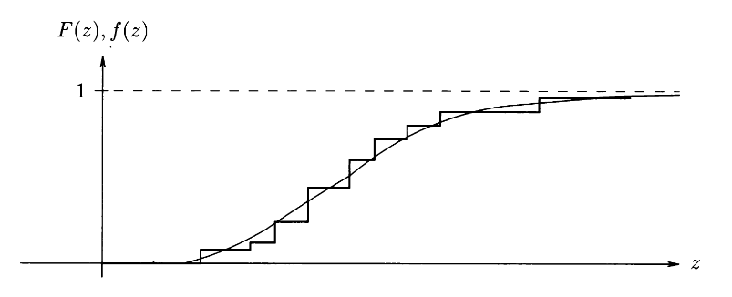
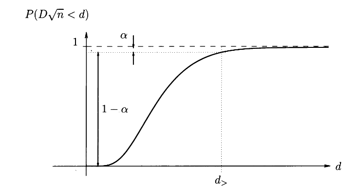

#+title: 03statistika
#+startup: nolatexpreview
#+startup: entitiespretty nil
#+startup: show2levels
#+latex_header: \usepackage{amsmath} \usepackage{cancel} \usepackage{graphicx}
#+latex_header: \renewcommand{\theta}{\vartheta} \renewcommand{\phi}{\varphi} \renewcommand{\epsilon}{\varepsilon}
#+latex_header: \newcommand{\odv}[1]{\dot{\vec{#1}}} \newcommand{\oddv}[1]{\ddot{\vec{#1}}}
#+latex_header: \newcommand{\rot}{\mathrm{rot}}\newcommand{\dive}{\mathrm{div}} \newcommand{\iu}{\mathrm{i}}
#+latex_header: \newcommand\mapsfrom{\mathrel{\reflectbox{\ensuremath{\mapsto}}}}
#+latex_header: \def\npredmet{FMER - OPZ}
#+latex_header: \usepackage[european]{circuitikz}
#+bibliography: refs.bib
* Meritve konstantnih količin in statistika
** Studentova \( T \) statistika
#+begin_idea
Imamo senzor, ki nam daje izmerke oblike \( z = H x + r \). Iz \( n \) izmerkov želimo določiti povprečno vrednost šuma \( \bar{r} \) in njegovo disperzijo \( R \). Želeli bi tudi potrditi, ali je šum normalno porazdeljen (kar je bila do sedaj samo predpostavka).

Imamo \( n \) nekoreliranih izmerkov, ki so vsi porazdeljeni po istem normalnem zakonu z neznanima parametroma \( \mathcal{N} (a, \sqrt{R}) \).

S Studentovo \( T \)-statistiko trdimo, da vrednost \( T \) in pripadajoče povprečje \( a \), leži znotraj intervala \( [t_{<}, t_{>}] \) z verjetnostjo \( 1 - \alpha \).
#+end_idea

#+begin_izpeljava
Naredimo *vzorčni funkciji* ali *statistiki*

\begin{align*}
  \bar{z} &= \frac{1}{n} \sum\limits_{i = 1}^n z_i \\
S ^2 = \frac{1}{n - 1} \sum\limits_{i = 1}^n \left( z_i - \bar{z}  \right)^2,
\end{align*}
s čimer sestavimo novo statistiko

\[ T = \frac{\bar{z} - a}{\sqrt{S ^2}} \sqrt{n}. 
\]

Nova statistika ima verjetnostno gostoto

\begin{equation}
\label{eq:1}
 \frac{\mathrm{d} P}{\mathrm{d} T} = \frac{1}{\sqrt{n - 1} B\left(\frac{n - 1}{2}, \frac{1}{2}\right)} \left( 1 + \frac{T ^2}{n - 1} \right)^{- \frac{n}{2}} = S (n - 1),
\end{equation}
kjer je \( B \) Beta funkcija definirana kot

\[ B(x, y) = \int\limits_0^1 t^{x - 1} (1 - t)^{y - 1} \, \mathrm{d} t. 
\]
Porazdelitvi v enačbi \eqref{eq:1} pravimo Studentova porazdelitev z \( n - 1 \) prostostnimi stopnjami.

Porazdelitev je neodvisna od parametrov \( a \) in \( R \), je soda funkcija in je podobna normalni porazdelitvi, vendar ima bolj položne repe.

Porazdelitev ima maksimalno vrednost pri \( T = 0 \) in tukaj izberemo oceno za \( a \), ki je

\[ a = \bar{z}.
\]

Izberemo si simetričen interval \( [t_{<} = - t, t_{>} = t] \), na katerem z izbrano verjetnostjo \( \alpha \) ležijo vrednosti \( T \) in pripadajoče vrednosti \( a \). Interval zaupanja (ang. /confidence level/) definiramo kot

\[ \int\limits_{t_{<}}^{t_{>}} \frac{\mathrm{d} P}{\mathrm{d} T} \, \mathrm{d} T = 1 - \alpha. 
\]

Z (veliko) verjetnostjo \( 1 - \alpha \) pričakujemo \( \left| T \right| \leq t \) (oz. vrednost \( T \) je v intervalu zaupanja \( [-t, t] \)). Z majhno verjetnostjo \( \alpha \) pričakujemo \( \left| T \right| > t \) (oz. vrednost \( T \) je izven intervala zaupanja).

Parametru \( 1 - \alpha \) pravimo stopnja zaupanja, \( \alpha \) pa stopnja tveganja.

Iz pogoja

\[ t_{<} = - t \leq \frac{\bar{z} - a}{S} \sqrt{n} \leq t_{>} = t,
\]
dobimo, da je iskano povprečje \( a \) z verjetnostjo \( 1 - \alpha \) znotraj intervala

\[ a \in \left[ \bar{z} - \frac{t_{<} S}{\sqrt{n}}, \bar{z} + \frac{t_{>} S}{\sqrt{n}} \right] 
\]

Značilne vrednosti stopnje zaupanja so \( 90\% \), \( 95\% \) in \( 99\% \).
#+end_izpeljava
** Porazdelitev \( \chi ^2 \)
#+begin_idea
S porazdelitvijo \( \chi ^2 \) določimo disperzijo \( R \) s stopnjo zaupanja \( 1 - \alpha \).
#+end_idea
#+begin_izpeljava
Statistika \( \chi ^2 \) je definirana z

\begin{equation}
\label{eq:3}
 \chi ^2 = \frac{(n - 1) S ^2}{R}, 
\end{equation}
njen porazdelitveni zakon pa je 

\[ \frac{\mathrm{d} P}{\mathrm{d} \chi ^2} = \chi ^2 (n - 1) = \frac{1}{2^{\frac{n - 1}{2}} \Gamma \left( \frac{n - 1}{2} \right)} \left( \chi ^2 \right)^{\frac{n - 3}{2}} e^{- \frac{\chi ^2}{2}}, \quad \chi \geq 0.
\]

Porazdelitev \( \frac{\mathrm{d} P}{\mathrm{d} \chi ^2 } \) označimo z \( \chi ^2 (n - 1) \) in ji rečemo, porazdelitev \( \chi ^2 \) z \( n - 1 \) prostostnimi stopnjami.

Interval zaupanja \( \chi ^2 \in [ \chi ^2 _{<}, \chi ^2 _{>}] \) določimo z integralom

\[ \int\limits_{\chi_{<} ^2}^{\chi_{>} ^2} \frac{\mathrm{d} P}{\mathrm{d} \chi ^2} \, \mathrm{d} \chi ^2 = 1- \alpha,
\]
kjer interval zaupanja dobimo tako, da ga simetrično obrežemo

\begin{align*}
  \int\limits_{\chi_{>} ^2}^{\infty} \frac{\mathrm{d} P}{\mathrm{d} \chi ^2 } \, \mathrm{d} \chi ^2 &= \frac{\alpha}{2}\\
\int\limits_0^{\chi_{<} ^2} \frac{\mathrm{d} P}{\mathrm{d} \chi ^2 } \, \mathrm{d} \chi ^2 &= \frac{\alpha}{2}
\end{align*}

Iz pogoja

\[ \chi_{<} ^2 \leq \frac{(n - 1) S ^2}{R} \leq \chi_{>} ^2,  
\]
dobimo interval zaupanja za disperzijo

\[  R \in \left[ \frac{(n - 1) S ^2}{\chi_{<} ^2}, \frac{(n - 1) S ^2}{\chi_{>} ^2} \right]
\]
#+end_izpeljava

#+begin_theorem
Vsote kvadratov \( n \) neodvisnih spremenljivk porazdeljenih po normalni porazdelitvi \( \mathcal{N}(0, 1) \) je porazdeljena po univerzalnem zakonu \( \chi ^2 (n) \).
#+end_theorem
#+begin_proof
Imamo izmerke \( z_i \), ki so porazdeljeni po \( \mathcal{N} (\bar{z}, \sigma ^2) \) in pripadajočo disperzijo

\begin{equation}
\label{eq:2}
 S ^2 = \frac{1}{n - 1} \sum\limits_{i = 1}^n \left( z_i - \bar{z} \right) ^2.
\end{equation}

Spremenljivka

\[ x = \frac{z_i - \bar{z}}{\sigma}, 
\]
ima standardno normalno porazdelitev \( \mathcal{N}(0, 1) \). Pripadajoča disperzija je porazdeljena po \( \chi ^2 (n - 1) \), ko obe strani enačbe \eqref{eq:2} množimo s \( \sigma ^2 \)

\[ \sum\limits_{i= 1}^n \frac{\left( z_i - \bar{z} \right) ^2}{\sigma ^2} = \frac{S ^2 (n - 1)}{\sigma ^2} = \chi (n - 1). 
\]
#+end_proof

#+begin_theorem
Naj bo \( X \) porazdeljena po \( \mathcal{N}(0, 1) \) in \( Y \) porazdeljena po \( \chi ^2 (n) \). Iz njiju lahko tvorimo \( T \)-statistiko porazdeljeno po \( S(n) \) s predpisom

\[ T = \frac{X}{\sqrt{\frac{Y}{n}}}. 
\]
#+end_theorem

#+begin_proof
Izhajamo iz definicije \( T \) statistike

\[ T = \frac{\bar{z} - a}{s} \sqrt{n}. 
\]

Imenovalec razširimo s \( \sigma \)

\[ T = \frac{\bar{z} - a}{\sigma \sqrt{\frac{s ^2}{\sigma ^2}}} \sqrt{n} 
\]

Koren v imenovalcu dodatno razširimo z \( (n - 1) \) in malo preoblikujemo

\[ T = \frac{\bar{z} - a}{\frac{\sigma}{\sqrt{n}}} \cdot \left( \sqrt{\frac{s ^2}{\sigma ^2} \frac{n - 1}{n - 1}} \right)^{-1}
\]

Člen \( \frac{\bar{z} - a}{\frac{\sigma}{\sqrt{n}}} \) je porazdeljen po \( \mathcal{N}(0, 1) \), v korenu pa prepoznamo definicijo \( \chi ^2 \), enačba \eqref{eq:3}, kar pomeni, da je porazdeljen po \( \chi ^2 (n - 1) \). Zapišemo torej

\[ T = \frac{X}{\sqrt{\frac{Y}{n - 1}}}. 
\]
#+end_proof
** Oblikovni testi
#+begin_idea
Z oblikovnimi testi preverimo ali porazdelitev naključne spremenljivke v izmerjenem vzorcu odstopa od privzete porazdelitve.
#+end_idea
*** Pearsonov \( \chi ^2 \) test
#+begin_idea
\( N \) izmerkov razdelimo na \( \rho \) (ne-)enakih intervalov (ali *razredov*), ki se med seboj *ne prekrivajo* in hkrati *pokrijejo celotno območje*, kjer je verjetnostna gostota različna od nič. V razredu \( k \) naj bo \( N_k \) izmed vseh izmerkov in njegove meje so \( \left[ \xi_{k - 1}, \xi_k \right] \). Verjetnost \( p_k \), da je izmerek v \( k \)-tem razredu je definirana

\[ p_k = \int\limits_{\xi_{k - 1}}^{\xi_k} \frac{\mathrm{d} P}{\mathrm{d} \xi} \, \mathrm{d} \xi. 
\]

V \( k \)-tem razredu bo potem \( N p_k \) izmerkov.

Za pravilno izbrano porazdelitev je razlika \( N_k - Np_k \) bel šum. S Pearsonovim \( \chi ^2 \) testom

\[ \chi ^2 = \sum\limits_{k = 1}^{\rho} \frac{\left( N_k - Np_k \right) ^2}{Np_k} 
\]
dobimo informacijo o statistični pomembnosti odmikov \( Np_k \) od \( N_k \). Porazdeljen je po \( \chi ^2 (\rho - 1) \).
#+end_idea
#+attr_latex: :options [Disperzija \( \chi ^2 \)]
#+begin_izpeljava
Zahtevamo, da je \( \frac{\left( N_k - Np_k \right) ^2}{Np_k} \) standardizirano normalno porazdeljen \( \mathcal{N}(0, 1) \). Razlika v števcu je beli šum, vendar ali je disperzija \( Np_k \) pravilno izbrana?

Štejemo zadetke v \( k \)-tem razredu, pričakujemo pa jih \( Np_k = \bar{N} \). Odstopanje od \( \bar{N} \) je podana s Poissonovo porazdelitvijo

\[ w_v = \frac{\mathrm{d} P}{\mathrm{d} N} = \frac{\bar{N}^N e^{- \bar{N}}}{N!} 
\]

Za dovolj velik \( \bar{N} \geq 10 \) je širina zvonaste porazdelitve približno \( \mathcal{N}(\bar{N}, \sqrt{\bar{N}}) \).
#+end_izpeljava

#+attr_latex: :options [Radioaktivni razpad]
#+begin_my_example
Opazujemo radioaktivni razpad in beležimo čas med sosednjima sunkoma \( t_k \). Imamo vzorec z \( N = 100 \) meritvami, za katere čas \( t_k > 1.6 \mathrm{s} \). Ali lahko na stopnjo tveganja \( \alpha = 5\% \) ovržemo hipotezo \( \tau = 1 \mathrm{s} \). Eksponentna porazdelitev je definirana kot

\[ \frac{\mathrm{d} P}{\mathrm{d} t} = \frac{1}{\tau} e^{- \frac{t}{\tau}}. 
\]

Ustvarimo dva razreda (\( \rho = 2 \)). Prvi razred \( k = 1 \) je na intervalu \( t \in [0, 1.6 \mathrm{s}] \), drugi \( t = (1.6 \mathrm{s}, \infty] \). V prvem razredu je torej \( N_1 = 100 \), v drugem razredu pa \( N_2 = 0 \). Izračunajmo \( Np_1 \) in \( Np_2 \) po definiciji

\begin{align*}
  Np_1 &= N \int\limits_0^{1.6 \mathrm{s}} \frac{\mathrm{d} P}{\mathrm{d} t} \, \mathrm{d}t = 100 \int\limits_0^{1.6 \mathrm{s}} \frac{1}{\tau} e^{- \frac{t}{\tau}} \, \mathrm{d} t = 80 \\
Np_2 &= N \int\limits_{1.6 \mathrm{s}}^{\infty} \frac{1}{\tau} e^{- \frac{t}{\tau}} = 20
\end{align*}

Pearsonov \( \chi ^2 \) test je po definiciji

\[ \chi ^2 = \frac{(100 - 80) ^2}{80} + \frac{(0 - 20) ^2}{20} = 25.  
\]

Tabelirana vrednost porazdelitve \( \chi ^2(\rho - 1) \) pa je za \( \rho = 2 \) in \( \alpha = 0.05 \)

\[ \chi_{>} ^2 (2 - 1)^{0.05} = 5.99.
\]

Ker je \( \chi ^2 = 25 > \chi_{>} ^2 = 5.99\) lahko hipotezo za \( \tau = 1 \mathrm{s} \) za stopnjo tveganja \( 5\% \) zavržemo.
#+end_my_example
*** Fisherjev test in funkcija zanesljivosti
#+begin_idea
Imamo neznan porazdelitveni zakon \( \frac{\mathrm{d} P}{\mathrm{d} \xi} \) z neznanimi parametri \( Q_1, Q_2, \ldots, Q_m \)

\[ \frac{\mathrm{d} P}{\mathrm{d} \xi} (Q_1, Q_2, \ldots, Q_m). 
\]

Parametre ocenimo iz meritev, s podanimi parametri pa lahko uporabimo v nadaljevanju Pearsonov \( \chi ^2 \) test.
#+end_idea
#+attr_latex: :options [Funkcija zanesljivosti]
#+begin_izpeljava
Izmerke razdelimo na \( \rho \) intervalov kot pri Pearsonovem testu. Sestavimo funkcijo zanesljivosti

\[ L^{\ast} = \prod\limits_{k = 1}^{\rho} \left[ p_k (Q_1, Q_2, \ldots, Q_m) \right]^{N_k}.
\]

Parametre poiščemo z ekstremom funkcije zanesljivosti, ki je sistem enačb

\[ \frac{\partial L^{\ast}}{\partial Q_{i}} = \frac{\partial \ln L^{\ast}}{\partial Q_{i}} =  0, \ i = 1, 2, \ldots, m. 
\]

Iz ocen \( Q_1^{\ast}, Q_2^{\ast}, \ldots, Q_m^{\ast} \) sestavimo test

\[ \chi ^2 = \sum\limits_{k = 1}^{\rho} \frac{\left( N_k - Np_k^{\ast} \right) ^2}{Np_k ^{\ast}},
\]
ki je porazdeljena po \( \chi ^2 (\rho - 1 -m) \).
#+end_izpeljava

#+attr_latex: :options [Poenostavljena funkcija zanesljivosti]
#+begin_izpeljava
Pri poenostavljeni funkciji zanesljivosti izmerkov ne razdelimo na \( \rho \) razredov, ampak jo definiramo kot

\[ L = \prod_{k=1}^{N} \frac{\mathrm{d} P}{\mathrm{d} z} \left( z_k , Q_1, Q_2, \ldots, Q_m \right),
\]
kjer to izračunamo v vrednostih izmerkov \( z_k \). Enako zahtevamo ekstrem funkcije

\[ \frac{\partial L}{\partial Q_{i}} = 0, 
\]
iz česar dobimo ocene \( \hat{Q}_1, \hat{Q}_2, \ldots, \hat{Q}_m \), iz katerih potem tvorimo statistiko. Pri velikem številu izmerkov, je porazdelitev \( \chi ^2 \) nekje med \( \chi ^2 (\rho - 1 - m) \) in \( \chi ^2 ( \rho - 1 ) \).
#+end_izpeljava

#+begin_my_example
Ocenjujemo radioaktivni razpad s porazdelitvijo

\[ \frac{\mathrm{d} P}{\mathrm{d} t} = \frac{1}{\tau} e^{- \frac{t}{\tau}}, 
\]
kjer iščemo optimalno vrednost parametra \( \tau \). Poenostavljena funkcija zanesljivosti je

\[ L = \prod_{k = 1}^N \frac{1}{\tau} e^{- \frac{t_k}{\tau}} = \frac{1}{\tau ^N} \exp \left\{ - \sum\limits_{k = 1}^N \frac{t_k}{\tau} \right\}.
\]

Enačbo logaritmiramo

\[ \ln L = -N \ln \tau - \sum\limits_{k = 1}^N \frac{t_k}{\tau},
\]
ter odvajamo po parametru \( \tau \)

\[ \frac{\partial L}{\partial \tau} = - \frac{N}{T} + \frac{1}{\tau ^2} \sum\limits_{k = 1}^N t_k = 0. 
\]

Dobimo pogoj

\[ \tau = \frac{1}{N} \sum\limits_{k = 1}^N t_k. 
\]

Optimalna vrednost \( \tau \) bo torej povprečje vseh izmerkov.
#+end_my_example
*** Test Kolmogorova
#+begin_idea
S testom Kolmogorova preverimo ali število izmerkov \( z_1, z_2, \ldots, z_N \) podpirajo zvezno porazdelitveno funkcijo.
#+end_idea

#+begin_izpeljava
Definiramo zvezno kumulativno porazdelitveno funkcijo \( F(z) \)

\[ F(z) = \int\limits_{- \infty}^z \frac{\mathrm{d} P}{\mathrm{d} \xi} \, \mathrm{d}\xi. 
\]

Naj \( k(z) \) označuje število izmerkov, ki so manjši od \( z \). Definiramo eksperimentalno kumulativno funkcijo

\[ f(z) = \frac{k(z)}{N}. 
\]

#+attr_latex: :width 0.5\textwidth :caption \caption{Kumulativna (zvezna) in eksperimentalna kumulativna (stopničasta) porazdelitvena funkcija, vir \cite{likar_osnove_2016}}

Opazujemo absolutno vrednost največje odmika

\[ D = \sup_{- \infty < z < \infty} \left| F(z) - f(z) \right| 
\]

Če so izmerki usklajeni s porazdelitvenim zakonom \( \frac{\mathrm{d} P}{\mathrm{d} \xi} \), potem je ta razlika izjemoma zelo velika.

Velja limita

\[ \lim_{N \to \infty} P \left( D \sqrt{n} < d \right) = \sum\limits_{k = -\infty}^{\infty} \left( -1 \right)^k e^{-2k ^2 d ^2}, 
\]
kjer je \( d \) meja.

#+attr_latex: :width 0.5\textwidth :caption \caption{Limitna verjetnost \( P \) in stopnja zaupanja \( 1 - \alpha \), ter stopnja tveganja \( \alpha \), vir \cite{likar_osnove_2016}.}

Pri testiranju si mejni \( d_{>} \) izberemo tako, da je \( P(D \sqrt{N} < d_{>}) = 1- \alpha \). Če je \( D \sqrt{N} > d_{>} \), potem lahko s tveganjem \( \alpha \) zavrnemo hipotezo, da \( F(z) \) ustreza izmerkom.
#+end_izpeljava
* Metode najmanjših kvadratov

