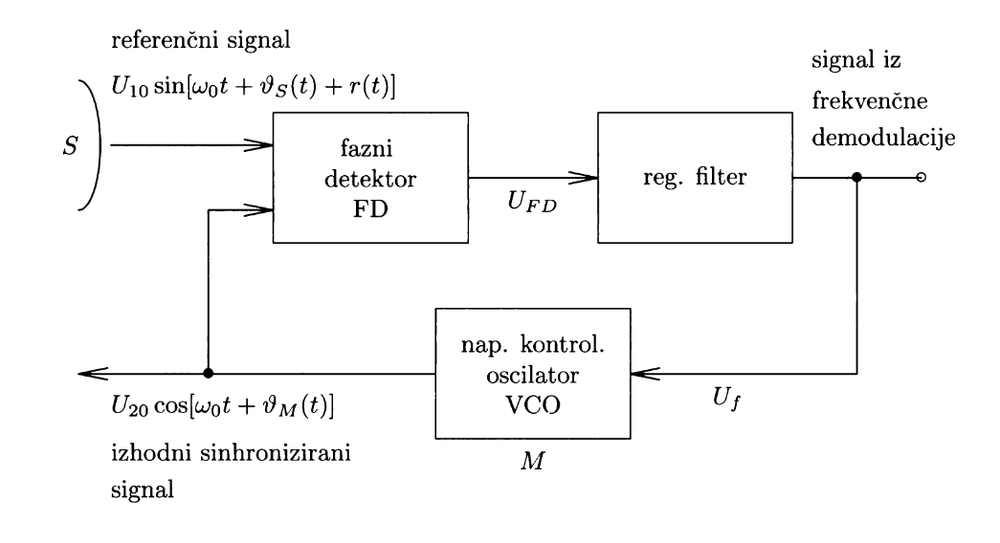
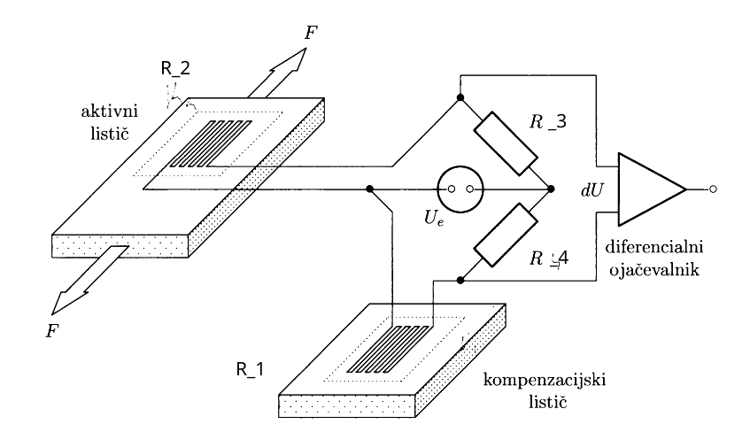
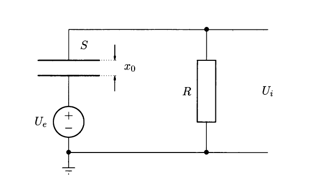
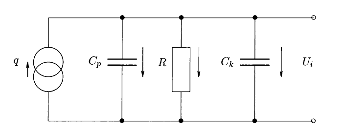
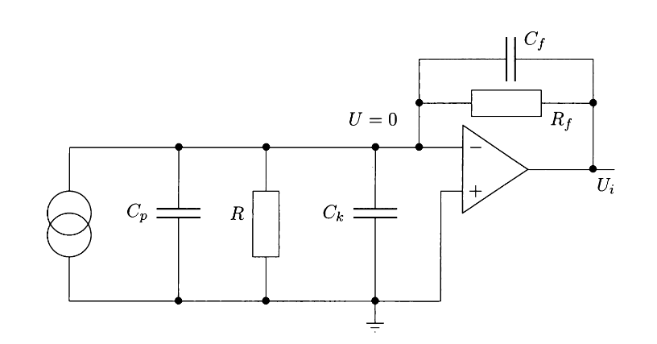

#+title: Merjenje frekvence in časa, majhnih premikov
#+startup: nolatexpreview
#+startup: entitiespretty nil
#+startup: show2levels
#+latex_header: \usepackage{amsmath} \usepackage{cancel} \usepackage{graphicx}
#+latex_header: \renewcommand{\theta}{\vartheta} \renewcommand{\phi}{\varphi} \renewcommand{\epsilon}{\varepsilon}
#+latex_header: \newcommand{\odv}[1]{\dot{\vec{#1}}} \newcommand{\oddv}[1]{\ddot{\vec{#1}}}
#+latex_header: \newcommand{\rot}{\mathrm{rot}}\newcommand{\dive}{\mathrm{div}} \newcommand{\iu}{\mathrm{i}}
#+latex_header: \newcommand\mapsfrom{\mathrel{\reflectbox{\ensuremath{\mapsto}}}}
#+latex_header: \def\npredmet{FMER - MFCP}
#+latex_header: \usepackage[european]{circuitikz}
#+bibliography: refs.bib
* Merjenje frekvence in časa
#+begin_idea
Merimo frekvenco preko fazno vpete zanke (ang. /Phase Locked Loop/ ali /PLL/), ki sinhronizira fizikalna sistema \( S \) in \( M \). V tem primeru prevedemo merjenje frekvence na primerjalno meritev faze iz modelskega sistema \( \theta_m \) in opazovanega sistema \( \theta_s \). Glede na njuno razliko moduliramo frekvenco oscilatorja v modelskem sistemu \( M \).

#+attr_latex: :width 0.5\textwidth :caption \caption{Shema fazno vpete zanke, vir \cite{likar_osnove_2016}.}

Signal iz opazovanega sistema s fazo \( \theta_1 \), ki vsebuje šum \( r \) je

\[ U_1 = U_{10} \sin \left[ \omega_0 t + \theta_1 (t) \right], \quad \theta_1(t) = \theta_s (t) + r(t),
\]
na izhodu pa imamo

\[ U_2 = U_{20} \cos \left( \omega_0 t + \theta_m \right).
\]

Fazno vpeto zanko sestavljajo 3 komponente:

- fazni detektor (FD), ki sprejme na vhodu signala \( U_1 \) in \( U_2 \) na izhodu pa poda razliko faz \( \theta_e = \theta_1 - \theta_2 \). Izhodni signal faznega detektorja je konstantna napetost

  \[ U_{FD} = K_{FD} \sin \theta_e \approx K_{FD} \theta_e, \quad K_{FD} = \frac{k U_{10} U_{20}}{2},
  \]
  kjer je \( k \) neka konstanta. Pripadajoča prenosna funkcija je

  \[ H_{FD} (s) = \frac{U_{FD}}{\theta_e} = K_{FD} 
  \]

- regulacijski filter, ki zaduši signale z visokimi frekvencami in poskrbi za stabilnost povratne zanke (dela podobno kot lowpass filter). Izhodni signal regulacijskega filtra je

  \[ U_F = F(s) U_{FD},
  \]
  pripadajoča  prenosna funkcija pa je

  \[ H_{LPF} (s) = \frac{U_F}{U_{FD}} = F(s),
  \]
  kjer \( F(s) \) določimo kasneje.

- napetostno občutljiv/kontroliran oscilator (ang. /voltage controlled oscillator/ oz. /VCO/), ki generira drugi signal (radio vsebuje VCO in ko iščemo frekvenco Vala 202, nastavimo izhodiščno frekvenco, s katero najdemo potem signal Vala 202). Izhodni signal je sorazmeren z vhodno napetostjo \( U_F \)

  \[ \omega_2 = \omega_0 + K_0 U_F (t), 
  \]
  iz česar dobimo njegovo prenosno funkcijo

  \[ H_{VCO} (s) = \frac{\theta_2}{U_F} = \frac{1}{s} K_0 
  \]

Izhod iz fazno vpete zanke je

\begin{equation}
\label{eq:2}
\theta_2 = \frac{1}{s} K_{FD} K_0 F(s) \left( \theta_1 - \theta_2 \right).
\end{equation}

in njena prenosna funkcija je

\[ H_{PLL} (s) = \frac{\theta_e}{\theta_1} = \frac{1}{1 + \frac{K_0 K_{FD} }{s} F(s)}.
\]

Kot regulacijski filter si izberemo modificiran RC filter s prenosno funkcijo

\[ F(s) = \frac{1 + \tau_2}{1 + \left( \tau_1 + \tau_2 \right) s}, \quad \tau_i = R_i C,
\] 
in dobimo

\[ H_{PLL} = \frac{s ^2 + \frac{1}{\tau_1 + \tau_2} s}{s ^2 + s \left( \frac{1}{\tau_1 + \tau_2} + \frac{\tau_2}{\tau_1 + \tau_2} K_0 K_{FD}  \right) + \frac{K_0 K_{FD}}{\tau_1 + \tau_2}}.
\]

Odčitamo lahko lastno frekvenco \( \omega_n ^2 \) in faktor dušenja \( 2\xi \omega_n \)

\[ \omega_n ^2 = \frac{K_0 K_{FD}}{\tau_1 + \tau_2} \quad \text{ in } \quad 2\xi\omega_n = \frac{1 + K_0 K_{FD} \tau_2}{\tau_1 + \tau_2}
\]

Če ne velja \( \theta_e \ll 1 \), potem je dinamična enačba fazno vpetega detektorja

\begin{equation}
\label{eq:6}
 \ddot{\theta}_e + \frac{1 + K_0K_{FD} \tau_2 \cos \theta_e }{\tau_1 + \tau_2} \dot{\theta}_e + \frac{K_0 K_{FD}}{\tau_1 + \tau_2} \sin \theta_e = \ddot{\theta}_1 + \frac{\dot{\theta}_1}{\tau_1 + \tau_2} 
\end{equation}

Fazno vpeta zanka se uspešno ujame na vhodno frekvenco

- za skok, ki ga opišemo kot

  \[ \dot{\theta}_1 = \Delta  \omega \quad \text{ in } \quad \ddot{\theta}_1 = 0,
  \]
  če velja pogoj

  \[ \Delta \omega \le \Delta \omega_n = K_0 K_{FD}
  \]

- za driftanje, ko se frekvenca približuje pravilni in ga opišemo z

  \[ \frac{\mathrm{d} }{\mathrm{d} t}\Delta \omega = \ddot{\theta}_1 \quad \text{ in } \quad \dot{\theta}_1 = 0,
  \]
  če velja pogoj

  \[ \frac{\mathrm{d} }{\mathrm{d} t} \Delta \omega \le \omega_n ^2 = \frac{K_0 K_{FD}}{\tau_1 + \tau_2}
  \]

Pri večji razklenitvi, kjer velja

\[ \left( \Delta \omega \right)_0 = K_0 K_{FD} \left| F (\mathrm{i} \Delta \omega) \right| \le \Delta \omega,
\]
se zanka vklene nazaj v času \( \frac{2\pi}{\Delta \omega} \). Mejna frekvenčna razlika \( \Delta \omega_L \), da se to še zgodi je

\[ \Delta \omega \le \Delta \omega_L = K_0 K_{FD} \frac{\tau_2}{\tau_1 + \tau_2} 
\]
#+end_idea

#+attr_latex: :options [Fazni detektor]
#+begin_izpeljava
Fazni detektor sprejme zašumljen vhodni signal iz opazovanega sistema

\[ U_1 = U_{10} \sin \left[ \omega_0 t + \theta_1 (t) \right], \quad \theta_1 (t) = \theta_s (t) + r(t),
\]
ter izhodni signal iz fazno vpete zanke

\[ U_2 = U_{20} \cos \left[ \omega_0 t + \theta_2 (t) \right], \quad \theta_2 (t) = \theta_M (t).
\]

Izhod faznega detektorja je razlika faz

\[ \theta_e = \theta_1 - \theta_2, 
\]
ki jo dobimo s časovnim povprečenjem produkta obeh signalov. Povprečimo torej

\[ U_{FD} = k \left\langle U_{10} U_{20} \sin \left( \omega_0 t + \theta_1 \right) \cos \left( \omega_0 t + \theta_2 \right) \right\rangle,
\]
kjer je \( k \) neka konstanta. Uporabimo identiteto

\[ \sin \alpha \sin \beta = \frac{1}{2} \left[ \sin \left( \alpha - \beta \right) + \sin \left( \alpha + \beta \right) \right],
\]
in povprečenje je

\[ U_{FD} = \frac{k U_{10} U_{20}}{2} \left\langle \sin (\theta_1 - \theta_2) + \sin \left( 2 \omega_0 t + \theta_1 + \theta_2  \right) \right\rangle.
\]

Drugi člen ima v primerjavi s spreminjanjem fazne razlike \( \theta_e \) višjo frekvenco in ga lahko zanemarimo. Preostane nam torej

\[ U_{FD} = K_{FD} \sin \theta_e, \quad K_{FD} = \frac{k U_{10} U_{20}}{2}. 
\]

Za \( \theta_e \ll 1 \) pa naredimo približek

\[ U_{FD} \approx K_{FD} \theta_e. 
\]

Ločimo več tipov faznih detektorjev

- tip I. (XOR gate)  (glej [[https://pengu5055.github.io/fmf-pdf/year3/FM_time-frequency.pdf][Marko's Chest]] zapiske, str.2), ki ima slabost, da ne loči med zaostajanjem in prehitevanjem signala.
  
- tip II., ki nima zgornje slabosti, saj spremeni predznak sunka glede na to ali zaostaja ali prehiteva.
#+end_izpeljava

#+attr_latex: :options [Prenosna funkcija regulacijskega filtra]
#+begin_izpeljava
Fazno vpeto zanko obravnavamo kot optimalen senzor 2. reda pri določanju prenosne funkcije \( F(s) \) regulacijskega filtra. Rešujemo vektorsko enačbo

\[ \frac{\mathrm{d} }{\mathrm{d} t} \begin{bmatrix} \theta_{s} \\ \omega_{s} \end{bmatrix} = \begin{bmatrix}
                                                                                             0 & 1 \\
                                                                                             0 & 0
                                                                                              \end{bmatrix}
\begin{bmatrix} \theta_{s} \\ \omega_{s} \end{bmatrix} + \begin{bmatrix} 0 \\ 1 \end{bmatrix} w,
\]
kjer je \( w \) beli šum, za katerega velja

\[ \left\langle w(t) w(t + \tau) \right\rangle = Q \delta(\tau).
\]

Izmerek je oblike

\[ \theta_1 = \theta_s + r, 
\]
kjer je \( r \) šum in velja

\[ \left\langle r(t) r(t + \tau) \right\rangle = R \delta(\tau).
\]

Rešujemo torej enačbi za oceni \( \dot{\hat{\theta}}_s \) in \( \dot{\hat{\omega}}_s \)

\begin{align}
  \label{ali4:1}
\dot{\hat{\theta}}_s &= \hat{\omega}_s + K_{\theta} \left( z - \hat{\theta}_s \right) \\ \label{ali4:2}
\dot{\hat{\omega}}_s &= K_{\omega} \left( z - \hat{\theta}_s \right)
\end{align}

Enačbo \eqref{ali4:1} odvajamo po času in nadomestimo \( \dot{\hat{\omega}}_s \) v odvajanem izrazu s \eqref{ali4:2}. Dobimo

\[ \ddot{\hat{\theta}}_s = K_{\omega} \left( z - \hat{\theta}_s \right) + K_{\theta} \left( \dot{z} - \dot{\hat{\theta}}_s \right).
\]

Po Laplaceovi transformaciji dobimo zvezo

\begin{equation}
\label{eq:1}
 \hat{\theta}_s = \frac{1}{s} \left( \frac{K_{\omega}}{s} + K_{\theta} \right) \left( z - \hat{\theta}_s \right) 
\end{equation}

Če v enačbi \eqref{eq:1} nadomestimo \( \hat{\theta}_s \) z \( \theta_2 \) in primerjamo z \eqref{eq:2}, razberemo, da je prenosna funkcija regulacijskega filtra

\[ F(s) = \frac{1}{K_0 KFD} \left( \frac{K_{\omega}}{s} + K_{\theta} \right), \quad K_{\omega} = \sqrt{\frac{Q}{R}} \quad \text{ in } \quad K_{\theta} \sqrt{2} \sqrt[4]{\frac{Q}{R}}
\]

*Ali pa zavržemo vse to delo in si kot prenosno funkcijo izberemo prenosno funkcijo RC filtra!* (What do I know, I just work here).

Ker sledimo konstantni frekvenci, je dobro izbrati filter z dolgo časovno konstanto \( \tau \). Prenosna funkcija RC filtra je

\[ F(s) = \frac{1}{1 + \tau s} 
\]

in prenosna funkcija fazno vpete zanke je potem

\[ H_{PLL} (s) = \frac{\theta_e}{\theta_1} = \frac{s ^2 + \frac{s}{\tau}}{s ^2 + \frac{s}{\tau} + \frac{K_0 K_{FD}}{\tau}}. 
\]

Faktor dušenja je torej \( \frac{1}{\tau} \) in velika časovna konstanta \( \tau \) poda majhen faktor dušenja in zato ni primerna.

Shema modificiranega RC filtra se nahaja na spodnji sliki

#+begin_src latex
\begin{center}
 \begin{circuitikz}
    \scalebox{1}{
      \draw node[left]{$U_{in}$} (0, 0) to[R=$R_1$, o-] (2, 0) to[short, -o] (4, 0) 
      node[right]{$U_{out}$};
      \draw (2, 0) to[C=$C$] (2, -1.5)
      to[R=$R_2$] node[ground]{} (2, -3.0);
    }
  \end{circuitikz} 
\end{center}
#+end_src

Njegova prenosna funkcija je

\begin{equation}
\label{eq:3}
 F(s) = \frac{1 + \tau_2 s}{1 + (\tau_1 + \tau_2) s}, \quad \tau_i = R_i C 
\end{equation}
#+end_izpeljava

#+attr_latex: :options [VCO]
#+begin_izpeljava
Izhodni signal VCO je

\[ U_2 = U_{20} \cos \left[ \omega_0 t + \theta_2 (t) \right], 
\]
medtem ko je njegov vhod napetost iz regulacijskega filtra \( U_F \). Označimo frekvenco izhodnega signala kot

\begin{equation}
\label{eq:4}
 \omega_2 (t) = \omega_0 + K_0 U_F(t), 
\end{equation}
kjer je \( K_0 \) ojačevalni faktor VCO.

Velja

\[ \omega_2 t = \omega_0 t + \theta_2 (t), 
\]
in če to odvajamo, dobimo

\[ \dot{\theta}_2 = \omega_2 - \omega_0 = K_0 U_F (t),
\]
kjer smo iz enačbe \eqref{eq:4} prebrali razliko \( \omega_2 - \omega_0 \).

Po Laplaceovi transformaciji dobimo

\begin{equation}
\label{eq:5}
 \theta_2 = \frac{1}{s} K_0 U_F 
\end{equation}
#+end_izpeljava

#+attr_latex: :options [Prenosna funkcija PLL]
#+begin_izpeljava
Da sestavimo prenosno funkcijo fazno vpete zanke postopamo v obratnem vrstnem redu: od VCO, LPF do faznega detektorja.

Izhod faznega detektorja je torej

\begin{align*}
  \theta_2 (s) &= \frac{1}{s} K_0 U_F (s) \\
&= \frac{1}{s} K_0 \underbrace{F(s) U_{FD} (s)}_{U_F} \\
&= \frac{1}{s} K_0 F(s) \underbrace{K_{FD} \theta_e (s)}_{U_{FD}} \\
&= \frac{1}{s} K_0 F(s) K_{FD} \left( \theta_2 - \theta_1 \right),
\end{align*}

iz česar potem dobimo prenosno funkcijo PLL

\[ H_{PLL} = \frac{\theta_e}{\theta_1} = \frac{1}{1 + \frac{K_0 K_{FD}}{s} F(s)} 
\]

Ko uporabimo prenosno funkcijo modificiranega RC filtra iz enačbe \eqref{eq:3} dobimo

\[ H_{PLL} = \frac{s ^2 + \frac{1}{\tau_1 + \tau_2} s}{s ^2 + s \left( \frac{1}{\tau_1 + \tau_2} + \frac{\tau_2}{\tau_1 + \tau_2} K_0 K_{FD}  \right) + \frac{K_0 K_{FD}}{\tau_1 + \tau_2}}.
\]

Odčitamo lastno frekvenco \( \omega_n \) in faktor dušenja \( 2 \xi \omega_n \). Tedaj lahko sestavimo enačbo za fazno vpeto zanko

\[ \ddot{\theta}_e + \frac{1 + K_0 K_{FD} \tau_2}{\tau_1 + \tau_2} \dot{\theta}_e + \frac{K_0 K_{FD}}{\tau_1 + \tau_2} \theta_e = \ddot{\theta}_1 + \frac{\dot{\theta}_1}{\tau_1 + \tau_2}.
\]

V primeru, da ne velja približek \( \theta_e \ll 1 \), dobimo enačbo \eqref{eq:6}.
#+end_izpeljava

#+attr_latex: :options [PLL skok]
#+begin_izpeljava
Za skok, ki ga definira sprememba frekvence

\[ \dot{\theta}_1 = \Delta \omega \quad \text{ in } \quad \ddot{\theta}_1 = 0,
\] 
dobimo v stacionarnem primeru

\[ \ddot{\theta}_e = \dot{\theta}_e = 0, 
\]

enačbo

\[ \frac{K_0 K_{FD}}{\tau_1 + \tau_2} \sin \theta_e = \frac{\Delta \omega}{\tau_1 + \tau_2}.
\]

Označimo \( \Delta\omega_{\max} = K_0 K_{FD} \). Največji frekvenčni razpon \( \Delta \omega \), da se PLL še sklene z vhodno frekvenco je torej

\[ \Delta \omega \le \Delta \omega_{\max} = K_0 K_{FD} 
\]
#+end_izpeljava

#+attr_latex: :options [Driftanje]
#+begin_izpeljava
Driftanje, ko se frekvenca približuje pravilni frekvenci, definira naklon premice

\[ \ddot{\theta}_1 = \frac{\mathrm{d} }{\mathrm{d} t} \Delta \omega \quad \text{ in } \quad \dot{\theta}_1 = 0.
\]

V stacionarnem primeru

\[ \ddot{\theta}_e = \dot{\theta}_e = 0, 
\]
dobimo enačbo

\[ \frac{K_0 K_{FD}}{\tau_1 + \tau_2} \sin \theta_e = \frac{\mathrm{d} }{\mathrm{d} t} \Delta \omega,
\]
iz česar dobimo pogoj

\[ \frac{\mathrm{d} }{\mathrm{d} t} \Delta \omega < \frac{K_0 K_{FD}}{\tau_1 + \tau_2} = \omega_n ^2 
\]
#+end_izpeljava

#+attr_latex: :options [Vklenitev PLL]
#+begin_izpeljava
Za razklenitve, kjer je faza majhna, se PLL hitro vklene. Za razklenitve, kjer so razlike večje, pa dobimo mejno frekvenčno razliko \( \Delta \omega_L \), da se PLL še vklene na sledeč način:

Signal iz faznega detektorja prihaja z obliko

\[ U_{FD} = K_{FD} \sin (\Delta \omega),
\]
ki se prenese na regulacijski filter in dobimo nihajočo napetost \( U_0 \) z amplitudo

\[ \Delta U_0 = \left| F(\mathrm{i} \Delta\omega) \right| K_{FD},
\]

Ta nihajoča napetost zaniha frekvenco VCO z amplitudo

\[ \left( \Delta \omega \right)_0 = K_0 K_{FD} \left| F(\mathrm{i} \Delta\omega) \right|.
\]

Če je \( \left( \Delta \omega \right)_0 \le \Delta \omega \) se zanka vklene v času

\[ t = \frac{2 \pi}{\left( \Delta \omega \right)_0}.
\]

Mejno frekvenčno razliko dobimo iz transcendentne enačbe

\[ \Delta \omega_L = K_0 K_{FD} \left| F(\mathrm{i} \Delta \omega_L)  \right| 
\]

Aproksimiramo

\[ F (\mathrm{i} \Delta \omega_L) = \frac{\tau_2}{\tau_1 + \tau_2},
\]
in dobimo

\[ \Delta \omega_L = K_0 K_{FD} \frac{\tau_2}{\tau_1 + \tau_2} = \left( \Delta \omega \right)_{\max} \frac{\tau_2}{\tau_1 + \tau_2}.
\]
#+end_izpeljava
* Merjenje majhnih premikov
** Uporovni lističi
#+begin_idea
Shema senzorja premika, ki uporablja uporovne lističe je vidna na sliki \ref{fig:upor}.

#+attr_latex: :width 0.5\textwidth :caption \caption{\label{fig:upor} Shema senzorja premika z uporovnimi lističi, vir \cite{likar_osnove_2016}}

Senzor pri svojem delovanju izkorišča dejstvo, da je upor, definiran kot

\begin{equation}
\label{eq:7}
 R = \rho \frac{l}{S}, 
\end{equation}
odvisen od dolžine upornika. Če se ta skrči ali raztegne za \( \mathrm{d} l \), se temu primerno spremeni tudi upor. Sprememba napetosti zaradi skrča ali raztega \( \mathrm{d}l \) je enaka

\[ \mathrm{d} U = \frac{3}{4} NU_0 \frac{\mathrm{d}l}{l} \propto \frac{\mathrm{d} l}{l},
\]
kjer je \( N \) število žic.

Uporovne lističe se nalepi na merjenec. Ker je specifični upor \( \rho \) odvisen od temperature, imamo kontrolni (kompenzacijski) listič, ki se nahaja pri isti temperaturi.
#+end_idea
#+begin_izpeljava
Če žico raztegnemo (skrčimo) za \( \mathrm{d}l \), se bo upor \( R \) iz enačbe \eqref{eq:7} povečal (zmanjšal) za

\begin{equation}
\label{eq:8}
 \mathrm{d} R = \frac{\rho}{S} \mathrm{d} l + \mathrm{d} \rho \frac{l}{S} - \rho l \frac{\mathrm{d} S}{S ^2}
\end{equation}

Zadnji člen izrazimo s pomočjo Poissonovega števila \( \mu \) in raztezka \( \frac{\mathrm{d} l}{l} \) preko enačbe

\[ \frac{\mathrm{d} S}{S} = - 2 \mu \frac{\mathrm{d} l}{l}. 
\]

Enačbo \eqref{eq:8} delimo z enačbo \eqref{eq:7} in zapišemo

\[ \frac{\mathrm{d} R}{R} = \frac{\mathrm{d} l}{l} + \frac{\mathrm{d} \rho}{\rho} - \frac{\mathrm{d} S}{S} = \frac{\mathrm{d} l}{l} + \frac{\mathrm{d} \rho}{\rho} + 2 \mu \frac{\mathrm{d} l}{l}
\]

Izpostavimo relativni skrček

\[ \frac{\mathrm{d} R}{R} = \frac{\mathrm{d} l}{l} \left( 1 + 2 \mu + \frac{\frac{\mathrm{d} \rho}{\rho}}{\frac{\mathrm{d} l}{l}} \right) 
\]

Zadnji člen je specifična piezoelektričnost in znaša za kovine približno \( 1 \). Koeficientu

\[ G = \frac{\frac{\mathrm{d} R}{R}}{\frac{\mathrm{d} l}{l}} = 1 + 2 \mu + 1 \approx 3, \quad \mu \in [0.24, 0.40],
\]
pravimo /umeritveni faktor/.

Uporovni listič vežemo v Wheatstonov most kot vidimo na sliki \ref{fig:upor}. Sprememba upornosti enega od uporov spremeni napetost na izhodu. Za Wheatstonov most velja

\[ \mathrm{d} U = U_0 \frac{R_2 R_3 - R_1 R_4}{\left( R_3 + R_4 \right) \left( R_1 + R_2 \right)}.
\]

Upoštevamo, da so upori enaki \( R_3 = R_4 \) in \( R_2 = R_1 + \mathrm{d} R \), kjer \( \mathrm{d} R \ll R_2 \). Zgornja enačba postane

\begin{align*}
  \mathrm{d} U &= U_0 \frac{R (R_2 - R_1)}{2 R \cdot 2 R_1} \\
&= U_0 \frac{\mathrm{d} R}{4 R}
\end{align*}

Upoštevamo prej izpeljan rezultat in dobimo

\[ \mathrm{d} U = \frac{3}{4} U_0 \frac{\mathrm{d} l}{l}. 
\]
#+end_izpeljava
** Kondenzatorski senzor
#+begin_idea
Shema senzorja premika, ki deluje s pomočjo kondenzatorjev vidimo na sliki \ref{fig:kond}.

#+attr_latex: :width 0.5\textwidth :caption \caption{\label{fig:kond} Shema senzorja premika, ki deluje na osnovi kondenzatorja, vir \cite{likar_osnove_2016}.}

Prenosna funkcija \( H(s) \), ki povezuje premik \( x \) s spremembo napetosti \( U_i \) na izhodu je

\[ H(s) = \frac{U_i}{x} = \frac{U_0}{x_0} \frac{\tau s}{1 + \tau s} 
\]
#+end_idea
#+begin_izpeljava
Pri spreminjanju razdalje med ploščama kondenzatorja s kapaciteto

\[ C_0 = \frac{\epsilon_0 \epsilon S}{x_0},
\]
se njegova kapaciteta spremeni za

\[ \mathrm{d} C = - \frac{\epsilon \epsilon_0 S}{x ^2} \mathrm{d} x = - C_0 \frac{\mathrm{d} x}{x_0}.
\]

Sprememba kapacitete skozi čas je

\begin{equation}
\label{eq:9}
 \frac{\mathrm{d} C}{\mathrm{d} t} = - \frac{C_0}{x_0} \frac{\mathrm{d} x}{\mathrm{d} t} 
\end{equation}

V stacionarnem stanju nimamo toka \( I \). Pri spremembi kapacitete pa steče po vezju tok

\[ I = \frac{\mathrm{d} e}{\mathrm{d} t} = \frac{\mathrm{d} }{\mathrm{d} t} \left( C U_C \right). 
\]

Tako \( C \) kot \( U_C \) imata časovno odvisnost, zato odvajamo z verižnim pravilom in dobimo

\begin{align*}
  I &= \frac{\mathrm{d} }{\mathrm{d} t} \left( C U_C \right) \\
&= \frac{\mathrm{d} C}{\mathrm{d} t} U_C + C \frac{\mathrm{d} U_{C}}{\mathrm{d} t}
\end{align*}

Izhodna napetost \( U_i \) iz vezja na sliki \ref{fig:kond} je

\begin{equation}
\label{eq:10}
 U_i = IR = R  \left( \frac{\mathrm{d} C}{\mathrm{d} t} U_C + C \frac{\mathrm{d} U_{C}}{\mathrm{d} t} \right).
\end{equation}

Vsota padcev napetosti je

\[ U_e - U_C - U_i = 0,
\]
in odvod padcev napetosti po času je

\[ \frac{\mathrm{d} U_{C}}{\mathrm{d} t} = - \frac{\mathrm{d} U_i}{\mathrm{d} t}.
\]

Dobljeno enakost upoštevamo v enačbi \eqref{eq:10} 

\[ U_i + RC \frac{\mathrm{d} U_{i}}{\mathrm{d} t} = R U_C \frac{\mathrm{d} C}{\mathrm{d} t} 
\]

Padec izhodne napetosti je manjši kot padec napetosti na kondenzatorju, zato lahko v približku zapišemo in upoštevamo \( U_C \approx U_e \). Prav tako upoštevamo enačbo \eqref{eq:9}, iz česar dobimo

\[ U_i + RC \frac{\mathrm{d} U_{i}}{\mathrm{d} t} - \frac{C_0}{x_0} U_0 R \frac{\mathrm{d} x}{\mathrm{d} t} = 0.
\]

Uvedemo spremenljivko \( \tau = RC \approx RC_0 \), transformiramo s pomočjo Laplaceove transformacije in dobimo

\[ U_i \left( 1 + \tau s \right) = \frac{U_0}{x_0} \tau s x, 
\]
iz česar lahko izrazimo prenosno funkcijo

\[ H(s) = \frac{U_i}{x} = \frac{U_0}{x_0} \frac{\tau s}{1 + \tau s}.
\]

Senzor ni primeren za merjenje zelo počasnih premikov, saj smo omejeni s frekvenco nad \( \frac{1}{\tau} \).

Če bi želeli, lahko vezje modificiramo, da dobimo čisti diferenciator.

#+begin_src latex
\begin{center}
 \begin{circuitikz}
    \scalebox{1}{
      \draw (0, -3) node[ground]
      to[dcvsource={$U_0$}] (0, -2)
      to[C={$C$}] (0, 0);
      \draw (2.5, -0.5) node[op amp, input up](OA){}
      (OA.-) to (0, 0)
      (OA.+) to ++ (0, -1.5) node[ground]{}
      (OA.out) to[short, -o] ++(1, 0) coordinate(p1)
      (p1) to[short, -o] ++(1, 0) node[above]{$U_i$};
      \draw (0.5, 0) -- (0.5, 1.5) coordinate(p2) to[R=$R_f$] (p2 -| p1) -- (p1);
      \draw (p2) -- (0.5, 3.25) coordinate(p3) to[C=$C_{\perp}$] (p3 -| p1) -- (p1)
    ;}
  \end{circuitikz} 
\end{center}
#+end_src

V tem primeru velja

\[ I = \dot{C} U_0 = - \frac{C_0}{x_0} U_0 \frac{\mathrm{d} x}{\mathrm{d} t} = \frac{U_i}{R_f}.
\]

Za \( C_{\perp} = 0 \), potem zapišemo

\[ U_i (t) = - \frac{U_0}{x_0} C_0 R_f \dot{x}, 
\]
in po Laplaceovi transformaciji dobimo

\[ H(s) = -\frac{U_0}{x_0} \tau s 
\]
#+end_izpeljava
** Piezoelektrični senzor
#+begin_idea
Piezoelektrični senzor premikov ima enako zgradbo kondenzatorskemu senzorju, vendar je tokra kondenzator napolnjen s piezoelektrikom kot je \( \mathrm{PbTiO}_3 \).

Kristal je nevtralen zaradi simetrije, vendar se ob deformaciji v smeri \( z \) spremeni ravnovesna lega \( \mathrm{Ti}^{4+} \), kar povzroči v kristalu polarizacijo

\[ P_i = d_{ijk} T_{jk},
\]
kjer je \( d_{ijk} \) piezoelektrični tenzor in \( T_{ij} \) napetostni tenzor.

Kristal tako obrnemo, da je piezoelektrična konstanta največja in naboj na ploščah kondenzatorja je potem

\[ e = d_{33} F,
\]
kjer je \( F \) sila.

Osnovna shema piezoelektričnega senzorja premika je vidna na sliki \ref{fig:piezo1}.

#+attr_latex: :width 0.5\textwidth :caption \caption{\label{fig:piezo1} Osnovna shema piezoelektričnega senzorja premika, vir \cite{likar_osnove_2016}.}

(Možnost vezave je tudi s koaksialnim kablo, glej zapiske od Marko's chest.)

Desni člen predstavlja izvor naboja \( q \), \( C_p \) je kapaciteta merilnega kondenzatorja, \( R \) upor piezoelektričnega materiala in \( C_K \) je kapaciteta priključnega kabla.

Prenosna funkcija zgornje sheme je

\[ H(s) = K \frac{\tau s}{\tau s + 1}, \ \tau = R(C_P + C_K) \quad \text{ in } \quad K = \frac{d_{33} ES}{x_0 (C_p + C_k)},
\]
kjer je \( E \) Youngov modul.

Kapaciteta \( C_k \) ni zanemarljiva in močno vpliva na konstanto \( K \). To je težava, ker potem bi vsaj laboratorij imel svoj \( K \). Namesto tega vezje posodobimo z operacijskim ojačevalnikom kot vidimo na sliki \ref{fig:piezo2}.

#+attr_latex: :width 0.5\textwidth :caption \caption{\label{fig:piezo2} Napredna shema piezoelektričnega senzorja premika, vir \cite{likar_osnove_2016}.}

Vhod v operacijski ojačevalnik ima zelo visoko impedanco in ima zato napetost \( U_- = 0 \). Ves naboj se tako zbere na kondenzatorju s kapaciteto \( C_f \) in pripadajoča prenosna funkcija je

\[ H(s) = \frac{U_i}{\Delta x} = - \frac{E S d_{33}}{x_0 C_f} \frac{\tau_f s}{1 + \tau_f s}, \quad \tau_f = R_f C_f 
\]
#+end_idea

#+attr_latex: :options [Polarizacija]
#+begin_izpeljava
Polarizacija \( P_i \) je povezana z napetostnim tenzorjem \( T_{jk} \) preko piezoelektričnega tenzorja \( d_{ijk} \)

\[ P_i = d_{ijk} T_{jk}.
\]

Napetostni tenzor je simetričen \( T_{jk} = T_{kj} \) in ima zgolj 6 neodvisnih komponent. To pomeni, da ima \( d_{ijk} \) 18 neodvisnih komponent. Zapišemo

\[ P_i = d_{im} T_m, m = 1, \ldots, 6. 
\]

Bolj kot je kristal simetričen, manj imamo neodvisnih komponent. 

Deformacija kristala povzroči polarizacijo, kar povzroči, da se na ploščah kondenzatorja nabere naboj

\[ e_i = P_i S = d_{ij} \sigma_j S = d_{ij} F.
\]

V našem primeru kristal deformiramo vdolž osi \( \mathbf{j} \), plošči kondenzatorja pa sta pravokotni os \( i \).

Naj bo \( d_{33} \) največja piezoelektrična konstanta in naboj je potem

\[ e = d_{33} F.
\]
#+end_izpeljava

#+attr_latex: :options [Osnoven piezo]
#+begin_izpeljava
Izhajamo iz slike \ref{fig:piezo1}. Skupni tok skozi elemente iz slike je

\[ \frac{\mathrm{d} }{\mathrm{d} t} e = d_{33} \frac{\mathrm{d} }{\mathrm{d} t} F = I_p + I_R + I_k, 
\]
kjer je \( I_p \) tok skozi kondenzator s kapaciteto \( C_p \), \( I_R \) tok skozi upornik \( R \) in \( I_k \) tok skozi priključen kabel in vhod v predojačevalnik. Upoštevamo definicije posameznih tokov in dobimo diferencialno enačbo

\[ d_{33} \frac{\mathrm{d} }{\mathrm{d} t} F = C_p \frac{\mathrm{d} }{\mathrm{d} t}U_i + C_k \frac{\mathrm{d} }{\mathrm{d} t} U_i + \frac{U_i}{R}, 
\]
ki jo Laplaceovo transformiramo

\[ R d_{33} s F = U_i \left[ \left( C_p + C_k \right)Rs + 1 \right]. 
\]

Ob upoštevanju Hookovega zakona, ki nam poveže silo in premik

\[ \frac{F}{S} = E \frac{\Delta x}{x_0}, 
\]
dobimo prenosno funkcijo osnovne vezave

\begin{equation}
\label{eq:11}
 H(s) = \frac{U_i}{\Delta x} = \frac{d_{33} ES}{x_0 (C_p + C_k)} \frac{\tau s}{1 + \tau s} = K \frac{\tau s }{1 + \tau s}
\end{equation}
#+end_izpeljava

#+attr_latex: :options [Napreden piezo]
#+begin_izpeljava
Faktor \( K \) iz enačbe \eqref{eq:11} je močno odvisen od kapacitete kablov in vhodne kapacitete predojačevalnika. Namesto tega se poslužimo sheme na sliki \ref{fig:piezo2}.

Zaradi visoke impedance je napetost na invertiranem vhodu \( 0 \) (in ker je tudi ne-invertiran vhod vezan na *GROUND*). Edina razlika v potencialu je torej med izvorom naboja ter izhodom \( U_i \). Tok ne teče skozi elemente \( C_p \), \( R \) ali \( C_k \). Ves naboj se bo zbral na kondenzatorju s kapaciteto \( C_f \). 

Tok skozi vezje je sestavljen iz

\[ I = \frac{\mathrm{d} }{\mathrm{d} t} e = d_{33} \frac{ES}{x_0} \Delta \dot{x} = \left( \frac{\mathrm{d} U}{\mathrm{d}  t} - \frac{\mathrm{d} U_{i}}{\mathrm{d} t} \right) C_f + \frac{U - U_i}{R_f},
\]
kjer smo že upoštevali Hookov zakon za silo \( F \). Zgornjo enačbo Laplaceovo transformiramo, definiramo \( \tau_f = C_f R_f \) in dobimo prenosno funkcijo, ki nima koeficienta odvisnega od koaksialnega kabla

\[ H(s) = \frac{U_i}{\Delta x} = - \frac{d_{33} ES}{x_0 C_f} \frac{\tau_f s}{1 + \tau_f s}.
\]
#+end_izpeljava
** Induktivni senzor :v_zanimivost:
#+begin_izpeljava
Shema induktivnega senzorja je prikazana na spodnji sliki.

#+begin_src latex
\begin{center}
 \begin{circuitikz}[
   longL/.style = {cute inductor, inductors/scale=0.75,
   inductors/width=1.6, inductors/coils=9}]
    \scalebox{1}{
      \draw (-2, 0) to[dcvsource, v^<=$U_0$, i^<=$I$] (2, 0);
      \draw (-2, 0) to[R=$R$] (-2, -3)
      to[longL, l=$L$, name=ind] (2, -3) -- (2, 0);
      \draw[thick, red] (ind.midtap) -- (ind.core east)
      \draw (-2,  -2.5) -- (-3, -2.5)
      to[rmeterwa, t=$U_R$] (-3, -0.5) -- (-2, -0.5)
    ;}
  \end{circuitikz} 
\end{center}
#+end_src

Merjenec prekrijemo z magnetnim materialom, ki ima magnetno permeabilnost \( \mu \). Vstavimo ga v tuljavo do polovične dolžine tuljave (rdeča črta). Zaradi različne magnetne permeabilnosti imamo efektivno dve tuljavi. Levi del z induktivnostjo

\[ L_1 = \mu_0 \frac{S}{l - x} \left( N \frac{l - x}{l} \right) ^2 = \mu_0 \frac{N ^2 S}{l ^2} (l - x)
\]

in desni del (rdeča črta) z induktivnostjo

\[ L_2 = \mu_0 \mu \frac{S}{x} \left( N \frac{x}{l} \right) ^2 = \mu \mu_0 \frac{SN ^2}{l ^2} x
\]

Na material je pritrjena ročka, ki se ob premikih premakne. To inducira napetost, ki jo merimo na voltmetru \( U_R \).

Inducirano napetost dobimo s pomočjo magnetnega pretoka

\[ U_L = - \dot{\phi}_m = - \left( LI \right)\dot{} \approx - I \frac{\mathrm{d} L}{\mathrm{d} t},
\]
kjer smo privzeli konstanten tok. Skupna induktivnost je vsota posameznih induktivnosti

\begin{equation}
\label{eq:12}
 L = L_1 + L_2 = \mu_0 \frac{S N ^2}{l ^2} \left[ \mu x + l - x \right]. 
\end{equation}

Padec napetosti tekom zgornje sheme je

\[ U_0 + U_R + U_L = 0. 
\]

Če razpišemo posamezne napetosti dobimo

\[ U_0 - IR - \frac{\mathrm{d} }{\mathrm{d} t} L I = 0.
\]

Časovni odvod skupne induktivnosti \eqref{eq:12} je

\[ \frac{\mathrm{d} }{\mathrm{d} t} L = \mu_0 \frac{N ^2 S}{l ^2} (\mu - 1) \dot{x}. 
\]

Odvod vstavimo v enačbo s padci napetosti

\[ U_0 = \left[ R + \mu_0 \frac{S N ^2}{l ^2} (\mu - 1) \dot{x} \right] I,
\]
iz česar razberemo induktivno napetost

\[ U_L \approx - \mu_0 \frac{N ^2 S I}{l ^2} (\mu - 1) \dot{x}  
\]
po Laplaceovi transformaciji pa dobimo prenosno funkcijo

\[ H(s) =  \frac{U_L (s)}{x(s)} \approx - \mu_0 \frac{N ^2 S}{l ^2} (\mu - 1) I s
\]
#+end_izpeljava

