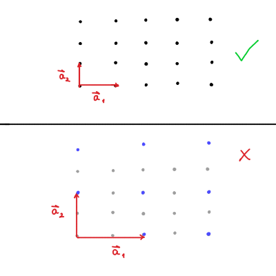
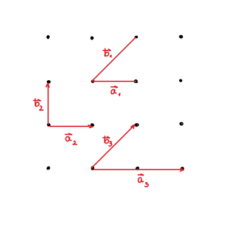
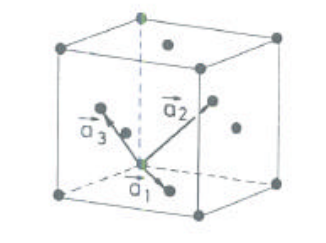
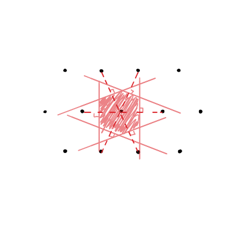
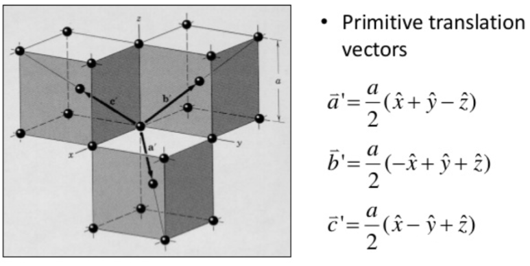

#+title: Predavanja iz Fizike trdne snovi, 8. teden v letu
#+subtitle: 2026/02/18 in 2026/02/19
#+startup: nolatexpreview
#+startup: entitiespretty nil
#+startup: show2levels
#+latex_header: \usepackage{amsmath} \usepackage{unicode-math} \usepackage{cancel} \usepackage{graphicx}
#+latex_header: \renewcommand{\theta}{\vartheta} \renewcommand{\phi}{\varphi} \renewcommand{\epsilon}{\varepsilon}
#+latex_header: \newcommand{\odv}[1]{\dot{\vec{#1}}} \newcommand{\oddv}[1]{\ddot{\vec{#1}}}
#+latex_header: \newcommand{\rot}{\mathrm{rot}}\newcommand{\dive}{\mathrm{div}} \newcommand{\iu}{\mathrm{i}}
#+latex_header: \newcommand\mapsfrom{\mathrel{\reflectbox{\ensuremath{\mapsto}}}}
#+bibliography: refs.bib
* Bravaisova rešetka/mreža (ang. /Bravais lattice/) :simetrije:

Začetnika fizike trdne snovi sta bila oče in sin Bragg, ki sta odkrila kristalno strukturo NaCl s pomočjo rentgenske svetlobe.

Kristal sestavljajo periodične ponavljajoče strukture, ki ji pravimo osnovna celica. Celica ima obliko paralelipipeda in jo sestavljajo identična grupa atomov, molekul, ipd. Tej grupi pravimo baza.

Osnova, iz katere izhaja celotna fizika trdne snovi, se imenuje Bravaisova rešetka ali mreža (v nadaljevanju okrajšana v BR, ang. /Bravais lattice/). 

BR ima po Ashcroftu [cite:@ashcroft_solid_1976] dve ekvivalentni definiciji

#+begin_definition
1) BR je neskončen nabor diskretnih točk s postavitvijo in orientacijo, ki izgleda identitično iz vsake točke, iz katere nabor gledamo. 
2) Tridimenzionalna BR je množica vseh točk, ki jo opisuje vektor \( \mathbf{R} \) in ima obliko

   \[ \mathbf{R} = n_1 \mathbf{a}_1 + n_2 \mathbf{a}_2 + n_3 \mathbf{a}_3, \ n_i \in \mathbb{Z}, \ i = 1, 2, 3.
   \]

   Vektorji \( \mathbf{a}_i, \ i = 1, 2, 3 \) so trije vektorji, ki so med seboj nekolinearni.
#+end_definition

Vektorjem \( \mathbf{a}_i, \ i = 1,2 ,3 \) pravimo primitivni osnovni vektorji, ki tvorijo našo BR.

Pri izbiri primitivnih vektorjev je gostota mrežnih točk maksimalna in vsaka druga izbira vektorjev vodi do mreže z manjšo gostoto. Primer manjše gostote kaže spodnja slika.

Pomembno se je tudi zavedati, da izbira primitivnih vektorjev ni enolična. Ravno nasprotno, obstaja neskončno mnogo izbir primitivnih vektorjev. 

Kristal ime dve vrsti simetrij:
- translacijska simetrija: lahko definiramo operator translacije \( \hat{\mathbf{T}} = n_1 \mathbf{a}_1 + n_2 \mathbf{a}_2 + n_3 \mathbf{a}_3 \), da bomo translirali valovno funkcijo tako, da velja

  \[ T_{\mathbf{R}} \psi(\mathbf{r}) = \psi(\mathbf{r} - \mathbf{R})
  \]

- točkovna simetrija pa se deli še na 3 dele:

  - rotacija okoli izbrane osi za določene kot (na zgornji sliki so koti \( \frac{\pi}{2}, \pi \) ali \( \frac{3\pi}{2} \))
  - zrcaljenje (na sliki imamo 4 zrcalne ravnine)
  - inverzija (poljubna točka se zrcali preko izbrane točke v neko drugo točko)
** Primitivna osnovna celica

Primitivna celica (ang. /primitive cell/ ali /primitive unit cell/) je območje volumna ali površine, ki ne pusti nič praznega ali dvakrat pokritega prostora, ko je translirana z vsemi vektorji, ki tvorijo BR. 

Podobno kot z primitivnimi vektorji tudi tukaj primitivna celica ni enolično določena. Za jasnejšo predstavo glej spodnjo sliko. 

Na sliki je volumen oz. površina celice definirana kot

\[ V_{POC} = \left| \mathbf{a}_1 \times \mathbf{b}_2 \right| 
\]

Primitivna celica mora vsebovati natanko eno mrežno točko, razen če se mrežne točke nahajajo na površini. Volumen ali površina primitivne celice bo vedno najmanjši možen. 

Posledično to pomeni, da je volumen primitivne celice neodvisen od izbire celice. 

Celico opišemo kot množico točk \( \mathbf{r} \), ki jo je sestavljajo primitivni vektorji \( \mathbf{a}_i, \ i = 1, 2, 3 \), oblike

\[ \mathbf{r} = x_1 \mathbf{a}_1 + x_2 \mathbf{a}_2 + x_3 \mathbf{a}_3,
\]

kjer \( x_i  \in [0, 1], \ i = 1,2 ,3 \). S takim načinom opisa primitivne celice ne pokažemo celotne simetrije Bravaisove rešetke.

Kot primer si lahko pogledamo množico, ki jo definira primitivna celica fcc BR. 

Vir: By Mhhmmiel - Own work, CC BY-SA 4.0, https://commons.wikimedia.org/w/index.php?curid=174308202

Bralec lahko vidi, da je množica točk, ki definirajo celico zgolj paraleliped *znotraj* BR.

BR smo uvedli ravno s tem razlogom, da imamo dostop do njihovih simetrijskih lastnosti. Zaželeno je torej, da to izraža tudi naša primitivna osnovna celica. Problem bomo rešili na dva načina: z drugačno definirano osnovno celico, ali pa Wigner-Seitzovo primitivno celico. 

- Konvencionalna osnovna celica je ponavadi nadmnožica primitivne celice, ki napolni prostor s translacijo vektorjev BR, se ne prekriva in odraža zaželjeno simetrijo.

  Osnovna celica bcc ima dvakratni volumen primitivne celice bcc. 
  
- Wigner-Seitzova celica vedno odraža simetrijo BR, saj je neodvisna od primitivnih vektorjev, in je enolično določena. Ta celica je prostor okoli katerekoli mrežne točke tako, da je ta prostor vedno najbližje tej točki kakor katerikoli drugi točki. Zaradi take definicije bo Wigner-Seitzova celica vedno napolnila prostora brez prekrivanja, iz česar zaključimo, da je to primitivna celica. 

#+begin_my_example
Kot primer Wigner-Seitzove celice si poglejmo trikotno kristalno strukturo, ki jo določata primitivna vektorja

\[ \mathbf{a}_1 = (a, 0) \quad \text{ in } \quad \mathbf{a}_2 = \left( \frac{a}{2}, \frac{\sqrt{3}}{2} a \right).
\]

Izbrano mrežno točko povežemo z vsemi najbližnjimi sosednjimi mrežnimi točkami. Vsako daljico prepolovimo in v tisti točki narišemo ravnino pravokotno na daljico. Ko postopek ponovimo na vseh daljicah, dobimo prostor, omejen s 6 ravninami. Ta prostor je Wigner-Seitzova celica.

#+end_my_example
** Koordinacijo število

Vsaka točka v BR ima neko število najbližjih sosedov. Zaradi lastnosti BR bo vsaka točka v kristalu imela to število enako in ga poimenujemo koordinacijsko število \( N_C \).
** Primeri kristalnih struktur 
*** Preprosta kubična Bravaisova rešetka (ang. /simple cubic/ or /sc/)

Preprosto kubično rešetko določajo bazni vektorji \( \mathbf{a}_1 = (a, 0, 0), \mathbf{a}_2 = (0, a, 0) \) in \( \mathbf{a}_3 = (0, 0, a) \).

*** Telesno centrirana BR (ang. /body-centered cubic/ or /bcc/)

Telesno centrirano BR dobimo tako, da v središče kubične mreže postavimo dodatno točko. Na novo središčno točko znotraj kristala lahko gledamo kot še eno kubično celico, ki jo tvorijo še ostale bližnje središčne točke. 

Primitivni osnovni vektorji v tej mreži so

\[ \mathbf{a}_1' = (a, 0, 0), \quad \mathbf{a}_2 ' = (0, a, 0), \quad \mathbf{a}_3' = \frac{1}{2} (a, a, a).
\]

Slednji ne odražajo lepo simetrije kristalne strukture, zato raje definiramo

\[ \mathbf{a}_1 = \frac{1}{2} (-a, a, a), \quad \mathbf{a}_2 = \frac{1}{2} (a, -a, a), \quad \mathbf{a}_3 = \frac{1}{2} (a, a, -a).
\]

Slednje vektorje lahko vidimo na spodnji sliki

Vir: https://postfiles10.naver.net/MjAxNzA0MDlfMjY1/MDAxNDkxNzM1MTE4OTM3.gxIGAbgxooImAvDd_TH-X1bEqtTRmnVnEFqyLmN1gOwg.RGKgupq2sPijLRokCq9YecmO7Z1SFLgEekU9ZkR7QQog.PNG.ocairy/image.png?type=w773

Koordinacijsko število je \( N_{bcc} = 8 \).

Elementi, ki kristalizirajo v to strukturo, so barij, krom, cezij, železo in uran.
*** Ploskovno centrirana BR (ang. /face-centered cubic/ or /fcc/)

Primitivni osnovni vektorji, ki sestavljajo to strukturo so

\[ \mathbf{a}_1 = \frac{1}{2} (a, a, 0), \quad \mathbf{a}_2 = \frac{1}{2} (0, a, a), \quad \mathbf{a}_3 = \frac{1}{2} (a, 0, a)
\]

Koordinacijsko število je \( N_{bcc} = 12 \).
*** Satje

Primer strukture z bazo za trikotno strukturo, kjer je baza \( \mathbf{d}_1 = 0 \) in \( \mathbf{d}_2 = \left( \frac{a}{2}, \frac{\sqrt{3}}{6} a \right) \).
*** Diamantna kristalna struktura

Diamantno kristalno strukturo dobimo tako, da vzamemo fcc rešetko z baznima vektorjema \( \mathbf{d}_1 = 0 \) in \( \mathbf{d}_2 = \frac{a}{4} (1, 1, 1) \).
** Recipročna Bravaisova rešetka

Predpostavimo, da imamo ravni val \( e^{\mathrm{i} \mathbf{k} \cdot \mathbf{r}} \). Očitno nima periodične kristalne strukture. Ravnemu valu sedaj prištejemo poljuben vektor \( \mathbf{R} \) Bravaisove rešetka, tako da velja period

\[ e^{\mathrm{i} \mathbf{k} (\mathbf{r} + \mathbf{R})} = e^{\mathrm{i} \mathbf{k} \mathbf{r}}.
\]

Če je temu zadoščeno, \( \mathbf{k} \) pripada vektorski recipročni rešetki.

Posledično mora biti tudi potencial periodičen s periodo Bravaisove rešetke.

Zanima nas družina \( \mathbf{k} \), za katere velja

\begin{equation}
\label{eq:1}
 e^{\mathrm{i} \mathbf{k} \mathbf{R}} = 1\, \forall \mathbf{R} = n_1 \mathbf{a}_1 + n_2 \mathbf{a}_2 + n_3 \mathbf{a}_3 \in \text{Bravaisova rešetka}
\end{equation}

Naj bodo \( \mathbf{a}_1, \mathbf{a}_2 \) in \( \mathbf{a}_3 \) primitivni vektorji.

Definiramo

\[ \mathbf{A}_1 = 2 \pi \frac{\mathbf{a}_2 \times \mathbf{a}_3}{(\mathbf{a}_1, \mathbf{a}_2, \mathbf{a}_3)}, \quad \mathbf{A}_2 = 2 \pi \frac{\mathbf{a}_3 \times \mathbf{a}_1}{(\mathbf{a}_1, \mathbf{a}_2, \mathbf{a}_3)}, \quad \mathbf{A}_3 = 2 \pi \frac{\mathbf{a}_1 \times \mathbf{a}_2}{(\mathbf{a}_1, \mathbf{a}_2, \mathbf{a}_3)},
\]

in trdimo, da velja

\[ \mathbf{a}_i \mathbf{A}_j = 2 \pi \delta_{ij}.
\]

Dokaz je samo računanje.

Za poljuben vektor \( \mathbf{R} \) velja

\[ \mathbf{R} \cdot \mathbf{A}_i = 2 \pi n_i.
\]

Minimalni valovni vektor, ki bo zadoščal \ref{eq:1}, bo

\[ \mathbf{K} = k_1 \mathbf{A}_1 + k_2 \mathbf{A}_2 + k_3 \mathbf{A}_3, \, k_i \in \mathbb{Z}, i = 1, 2, 3.
\]

#+name: Recipročna mreža za sc
#+begin_my_example
Primitivni vektorji sc mreže so

\[ \mathbf{a}_1 = (a, 0, 0), \quad \mathbf{a}_2 = (0, a, 0), \quad \mathbf{a}_3 = (0, 0, a).
\]

Vektorji so potem

\[ \mathbf{A}_1 = \frac{2\pi}{a} (1, 0, 0), \quad \mathbf{A}_2 = \frac{2\pi}{a} (0, 1, 0), \quad \mathbf{A}_3 = \frac{2\pi}{a} (0, 0, 1)
\]
#+end_my_example

#+name: Recipročna mreža za fcc
#+begin_my_example
Primitivni vektorji fcc mreže so

\[ \mathbf{a}_1 = \frac{1}{2} (a, a, 0), \quad \mathbf{a}_2 = \frac{1}{2} (a, 0, a), \quad \mathbf{a}_3 = \frac{1}{2} (0, a, a).
\]

Vektorji reciprožne mreže (?) so

\[ \mathbf{A}_1 = \frac{2\pi}{a} (1, 1, -1), \quad \mathbf{A}_2 = \frac{2\pi}{a} (1, -1, 1), \quad \mathbf{A}_3 = \frac{2\pi}{a} (-1, 1, 1), \quad
\]
#+end_my_example
* Mrežne ravnine in Millerjevi indeksi

[vstavi definicijo mrežne ravnine]

Če definiramo vektor \( \mathbf{K} = \frac{2\pi}{d} \hat{n} \), ki je pravokoten na mrežno ravnino, potem trdimo, da je del recipročne Bravaisove rešetke. Sočasno je ta vektor najmanjši možni vektor.

Iz poljubne točke izberemo dve točki v različnih ravninah. Prva točka bo \( \mathbf{R}_1 \), druga točka pa bo \( \mathbf{R}_2 \). Točki povezuje vektor \( \mathbf{R}_2 - \mathbf{R}_1 \). Iz zgornjega poglavja vemo, da velja \( \mathbf{R} \cdot \mathbf{K} = c \).

Posledično lahko za naši dve točki zapišemo

\[ \mathbf{R}_1 \cdot \mathbf{K} = c_1 \quad \text{ in } \quad \mathbf{R}_2 \cdot \mathbf{K} = c_2.
\]

Za vektor, ki povezuje točki, pa potem velja

\[ \left( \mathbf{R}_2 - \mathbf{R}_1 \right) \mathbf{K} = c_2 - c_1.
\]

Ob upoštevanju predpostavke definicije vektorja \( \mathbf{K} \), potem velja

\[ \hat{n} \left( \mathbf{R}_2 - \mathbf{R}_1 \right) \frac{2 \pi}{d} = 2 \pi = c_2 - c_1,
\]

saj za naš konkretni problem velja, da je \( \hat{n} \left( \mathbf{R}_2 - \mathbf{R}_1 \right))) = d \) projekcija vektorja \( \left( \mathbf{R}_2 - \mathbf{R}_1 \right)) \) na \( \hat{n} \). Za našo skico je to ravno \( d \).

Za poljubno drugo točko \( \mathbf{R}_i \), potem velja

\[ \hat{n} \left( \mathbf{R}_i - \mathbf{R}_1 \right) \frac{2 \pi}{d} = k_i 2 \pi, \, k_i \in \mathbb{Z}
\]

Če razliko \( \mathbf{R}_i - \mathbf{R}_1 \) definiramo kot vektor \( \mathbf{R}_j \), potem zapišemo

\[ \mathbf{R}_j \mathbf{K} = k_i 2 \pi
\]
** Millerjevi indeksi \( h, k, l \)

Millerjevi indeksi definirajo najmanjši možni vektor recipročne mreže

\begin{equation}
\label{eq:2}
 \mathbf{K} = h \mathbf{A}_1 + k \mathbf{A}_2 + l \mathbf{A}_3.
\end{equation}

Vzemimo za primer sc mrežo, primitivne vektorje smo definirali višje gor. Produkt vektorjev \( \mathbf{r} = x_1 \mathbf{a}_1 + x_2 \mathbf{a}_2 + x_3 \mathbf{a}_3 \) in \( \mathbf{K} \) bo enak \( c \). Hkrati bo tudi veljalo

\begin{align*}
  x_1 \mathbf{a}_1 \mathbf{K} &= x_1 h 2 \pi = c
  x_2 \mathbf{a}_2 \mathbf{K} &= x_2 k 2 \pi = c \\
  x_3 \mathbf{a}_3 \mathbf{K} &= x_3 l 2 \pi = c \\
\end{align*}

Zaključimo, da je razmerje

\[ h : k : l = \frac{1}{x_1} : \frac{1}{x_2} : \frac{1}{x_3}
\]

#+begin_my_example
Če vzamemo ravnino, ki ima normalo \( \hat{n} = \mathbf{a}_1 = (1, 0, 0) \), lahko vidimo iz razmerja (ker imamo deljenje z 0), da ravnin, ki jih definirata \( k \) in \( l \) ne bo sekalo (?).
#+end_my_example

#+begin_my_example
Ravnina z normalo \( \hat{n} = (1, 0, 1) \) seka dva od treh ravnin.
#+end_my_example

#+begin_my_example
Ravina z normalo \( \hat{n} = (1, 1, 1) \) seka vse tri ravnine.
#+end_my_example
* Sipanje na kristalu

Karakteristična razdalja med delci je \( a_0 \sim 0.1 \mathrm{nm} \), kar pomeni, da mora biti tudi taka tudi valovna dolžina.

Energija fotona mora potem biti

\[ W_f = h \nu = \frac{h c}{\lambda} = \frac{1240 \mathrm{nm}}{0.1 \mathrm{nm}} \sim 12.4 \mathrm{keV}.
\]

To je razlog, zakaj potrebujemo žarke X, za sipanje na kristalu.
** Braggovo sipanje

[vstavi sliko Braggovega sipanja (pravokotnici označuje razliko poti)]

Dejansko se fotoni sipajo na elektronski oblakih posamezne molekule. Žarki X se odbijejo od mrežnih ravnin po odbojnem zakonu.

Lomni količnik med mrežnimi ravninami je \( n \approx 1 \).

Iz skice lahko odčitamo pogoj za ojačitev

\[ 2d \sin \theta = n \lambda,
\]

kjer je \( d \) razdalja med mrežnima ravninama, pa \( \theta \) vpadni kot
** Von Laue sipanje

[vstavi skico]

Razlika poti med zgornjim in spodnjim žarkom je

\[ d \cos \theta_1 + d \cos \theta_2 = m \lambda.
\]

Foton predstavimo z ravnim valov oblike \( \mathbf{k} = \frac{2 \pi}{\lambda} \hat{n} \), odbiti žarek pa opišemo z \( \mathbf{k}' = \frac{2 \pi}{\lambda} \hat{n}' \), ob pogoju, da se valovna dolžina ne spremeni.

Vektorsko lahko torej zapišemo

\[ \mathbf{d} \left( \hat{n} - \hat{n}' \right) = m \lambda.
\]

Zgornjo enačbo želimo zapisati z valovnim vektorjem, zato množimo z \( \frac{2 \pi}{\lambda} \), da dobimo

\[ \mathbf{d} \left( \mathbf{k} - \mathbf{k}' \right) = 2 \pi m.
\]

Pojdimo naprej, zahtevamo, da to velja za vsak \( \mathbf{d} \), ki je del Bravaisove rešetke. Matematično

\[ \forall \mathbf{R} = \forall \mathbf{d} \in B. R.
\]

Zgornje velja natanko takrat, ko \( \mathbf{k} - \mathbf{k}' = \mathbf{K} \),

\[ \mathbf{R} \mathbf{K} = 2 \pi m.
\]

Naslednji teden dokazujemo, da je von Laueov pogoj ekvivalenten Braggovem pogoju.
