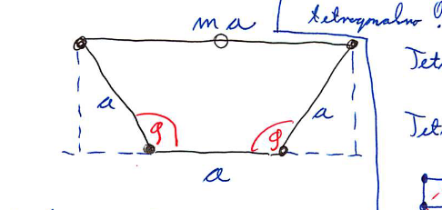

#+title: Predavanja iz Fizike trdne snovi, 9. teden v letu
#+subtitle: 2026/02/25 in 2026/02/26
#+startup: nolatexpreview
#+startup: entitiespretty nil
#+startup: show2levels
#+latex_header: \usepackage{amsmath} \usepackage{unicode-math} \usepackage{cancel} \usepackage{graphicx}
#+latex_header: \renewcommand{\theta}{\vartheta} \renewcommand{\phi}{\varphi} \renewcommand{\epsilon}{\varepsilon}
#+latex_header: \newcommand{\odv}[1]{\dot{\vec{#1}}} \newcommand{\oddv}[1]{\ddot{\vec{#1}}}
#+latex_header: \newcommand{\rot}{\mathrm{rot}}\newcommand{\dive}{\mathrm{div}} \newcommand{\iu}{\mathrm{i}}
#+latex_header: \newcommand\mapsfrom{\mathrel{\reflectbox{\ensuremath{\mapsto}}}}
* Sipanje na kristalu

Nazadnje smo dobili pogoj \( \mathbf{k} - \mathbf{k}' = \mathbf{K} \), kar v besedah pomeni, da mora biti njuna razlika enaka vektorju recipročne rešetke.

Pogoj zapišemo drugače

\[ \mathbf{k} ' = \mathbf{k} - \mathbf{K},
\]

kar kvadriramo in pokrajšamo valovna vektorja saj sta po velikosti enaka zaradi predpostavke elastičnega sipanja

\[ \mathbf{k}' ^2 = \mathbf{k} ^2 - 2\mathbf{k} \mathbf{K} + \mathbf{K} ^2 \implies 2\mathbf{k} \mathbf{K} = \mathbf{K} ^2
\]

Na koncu enačbo delimo z \( 2 \mathbf{K} \) in dobimo enakost

\[ \mathbf{k} \hat{\mathbf{K}} = \frac{K}{2}.
\]

\( \hat{\mathbf{K}} = \frac{\mathbf{K}}{K} \) je normiran vektor.

Pogoj za interferenčno sipanje leži na ravnini, na katero je recipročni vektor \( \mathbf{K} \) pravokoten. Ravnini pravimo Braggova ravnina.

[vstavi skico Braggove ravnine]

Poglejmo si še drug pogled na pogoj \( \mathbf{k} - \mathbf{k} ' = \mathbf{K} \). Ni vsak \( \mathbf{K} \) dovolj dober, da pride do interference.

Primer tega predstavlja Ewaldova krogla.

[vstavi skico kubične mreže, Ewaldove krogle]

V sc kristalu naj iz poljubnega delca izhaja valovni vektor \( \mathbf{k} \). Če okoli konca vektorja (tam, kjer je puščica) narišemo kroglo z radijem velikosti vektorja oz. v našem primeru krožnico, in če je ta krogla ravno tako ponesrečena, da ne seka nobene druge točke v kristalu, potem do interference ne bo prišlo.

Krogla predstavlja vrednosti, ki jih lahko zaseda vektor \( \mathbf{k}' \). V primeru, če ta krogla seka točko kristala, potem je izpolnjen pogoj \( \mathbf{k} - \mathbf{k}' = \mathbf{K} \).
** Debye - Sherrerjeva metoda (Sipanje na prašnem vzorcu)

Imamo kroglo, katere polmer je velikost poljubnega vektorja \( \mathbf{K} \). Vektor ne rabi biti najmanjši možen.

Iz izhodišča krogle si zamislimo valovni vektor \( \mathbf{k} \) okoli katerega ponovno narišemo kroglo. Tam, kjer večja krogla seka manjšo kroglo, dobimo kolobar. Ponovno so točke sekanja \( \mathbf{k} - \mathbf{k}' = \mathbf{K} \).

Naj bo kot med vektorjema \( \mathbf{k} \) in \( \mathbf{k}' \) kot \( \theta \). Potem iz osnovne trigonometrije zaključimo, da je kot med vektorjema \( \mathbf{k} \) in \( \mathbf{K} \) ravno \( \frac{\pi}{2} - \frac{\theta}{2} \) (enakostranični trikotnik).

Potem velja

\[ 2k \sin \frac{\theta}{2} = K.
\]

* Geometrijski strukturni faktor

Uvod o Strnadu in seštevanje faz v Strnadu na uklonski mrežici.

Za Bravaisovo rešetko lahko definiramo strukturni faktor \( S_{\mathbf{K}} \), ki je vsota vseh faz sipanj

\[ S_{\mathbf{K}} = \frac{1}{N} \sum\limits_{\mathbf{R}}^{} e^{\mathrm{i} \mathbf{K} \mathbf{R}},
\]

kjer je \( N \) število. V primeru, če je to Bravaisova rešetka, potem je \( S_{\mathbf{K}} = 1 \), saj je \( \sum_{\mathbf{k}} e^{\mathrm{i} \mathbf{K}\mathbf{R} } = N \).

V primeru, da imamo pa Bravaisovo rešetko z bazo \( \mathbf{d}_j \), kjer je \( j = 1, \ldots, p \), potem je strukturni faktor

\[ S_{\mathbf{K}} = \frac{1}{N} \sum\limits_{\mathbf{R}, \, \mathbf{j} = 1, \ldots p}^{} e^{\mathrm{i} \mathbf{K} (\mathbf{R} + \mathbf{d}_j)} = \sum\limits_{j = 1}^p e^{\mathbf{K} \mathbf{d}_j} \ne 1,
\]

kjer smo upoštevali dejstvo, da \( e^{\mathbf{R} \mathbf{K}} \cdot e^{\mathbf{K} \cdot \mathbf{d}_j} \).

Zgornji rezultat velja samo v primeru, če je kristal sestavljen iz *identičnih atomov*.

#+begin_my_example
Izračunajmo strukturni faktor bcc mreže, za katero smo povedali, da jo lahko napišemo kot kombinacije sc mreže in baze.

Primitivni vektorji so

\[ \mathbf{a}_1 = (a, 0, 0), \ \mathbf{a}_2 = (0, a, 0), \ \mathbf{a}_3 = (0, 0, a),
\]

bazi pa sta \( \mathbf{d}_1 0 \) in \( \mathrm{d}_2 = \frac{1}{2} (a, a, a) \).

Recipročni vektorji so

\[ \mathbf{A}_1 = \frac{2 \pi}{a} (1, 0, 0), \ \mathbf{A}_2 = \frac{2 \pi}{a} (0, 1, 0), \ \mathbf{A}_3 = \frac{2 \pi}{a} (0, 0, 1).
\]

Vektor recipročne mreže je potem \( \mathbf{K} = \frac{2 \pi}{a} (k_1, k_2, k_3) \) za \( k_i \in \mathbb{Z} \).

Strukturni faktor je potem

\[ S_{\mathbf{K}} = 1 + e^{\mathrm{i} \pi \left( k_1 + k_2 + k_3 \right)}
\]

[slika 120510 FCC mreže]

V rdečih točkah je strukturni faktor \( S_{\mathbf{K}} = 1 \), v modrih točkah pa \( S_{\mathbf{K}} = 0 \).
#+end_my_example

Strukturni faktor lahko vsebuje tudi atomski faktor oblike \( f_j (\mathbf{K}) \) (ang. /atomic form factor/), ki je posledica elektronskega oblaka.

Definiran je kot

\[ f_j (\mathbf{K}) = \frac{1}{e_0} \int\limits_{}^{} e^{\mathrm{i} \mathbf{K} \mathbf{r}} \rho(\mathbf{r}) \, \mathrm{d} ^3 \mathbf{r}.
\]

Strukturni faktor je potem

\[ S_{\mathbf{K}} = \sum\limits_j^{} f_j (\mathbf{K}) e^{\mathrm{i} \mathbf{K} \mathbf{d}_j}.
\]

Atomski faktor je v primeru, če se faza \( \mathbf{K} \mathbf{r} \ll 1 \) ne spreminja veliko na končnem območju, kjer je definirana gostota \( \rho(\mathbf{r}) > \infty \), potem je njen približek \( Z \) - število elektronov v atomu.
* Klasifikacija kristalov

Poznamo 7 kristalnih sistemov:

- kubični - pravi koti z enako dolgimi stranicami
- tetragonalni - pravi koti z dvema enako dolgima stranicami
- ortoromsbki - pravi kot s tremi enako dolgimi stranicami
- monoklinski - pravi kot
- triklinski - najmanj simetričen
- trigonalni
- heksagonalni

| Sistem       | Število B.R. |
| kubični      |            3 |
| tetragonalni |            2 |
| ortorombski  |            4 |
| monoklinski  |            2 |
| triklinski   |            1 |
| trigonalnia  |            1 |
| heksagonalni |            1 |
|              |           14 |

|                | baza sferično simetrične | baza arbirtarnih simetrij |
| točkovne grupe | 7 krist. sistemov        | 32 točk. grup             |
|                | 14 B.R.                  | 230 prostorskih grup      |

#+name: Grupa
#+begin_definition
Grupo označimo z \( \left\{ A, B, C, \ldots \right\} \) in ima naslednje lastnosti

1) \( A \cdot B = C \)
2) \( \exists E \), ki je identiteta, \( A E = E A = A \)
3) \( \exists A^{-1} \), kjer je \( A^{-1} \) inverz in velja \( A A^{-1} = A^{-1} A = E \).
4) asociativnost \( A \cdot (B \cdot C) = (A \cdot B) \cdot C \)
#+end_definition

\( n \)-števno os zapišemo kot

\[ C_n \left\{ C_n^1, C_n^2, \ldots, C_n^{n - 1}, E \right\}.
\]

Tudi zrcaljenje je grupa

\[ \sigma = \left\{ \sigma_x, E \right\}.
\]

Obstaja tudi nadmnožica \( n \)-števne grupe

\[ C_{4v} \left\{ C_4^n, E, \sigma_x, \sigma_y, \sigma_{xy}, \sigma_{-xy} \right\},
\]

kjer grupa vsebuje zrcaljenje preko premic \( x, y, xy \) in \( -xy \).

Ena od možnih oznak je tudi

\[ S = \sigma_k C_4 ^1,
\]

kjer \( S \) označuje rotacijo in nato zrcaljenje

\[ S_n = \left\{ C_4^n, E, \sigma, S_4^1, S_4^3, I \right\},
\]

kjer je \( I \) inverzija \( S_2 \) (zasuk za \( \pi \)).

Dokaz, da lahko število osi \( n \) zaseda samo vrednosti \( n \in \left\{ 2, 3, 4, 6 \right\} \).

#+begin_proof
Vzamemo trikotno mrežo in si zamislimo trapez

Opazujemo dve rotaciji: rotacija okrog leve spodnje točke za kot \( \theta \), ki bo desno spodnjo točko \( 1 \) slikal v levo zgornjo točko \( 1' \) in rotacija, ki je ravno zrcalna - okoli desne spodnje točke za kot \( \theta \), ki bo levo spodnjo točko \( 2 \) slikal v desno zgornjo točko \( 2' \).

Dani preslikavi morata biti tudi del B.R. in izkaže se, da je razdalja med \( 1' \) in \( 2' \) ravno

\[   \overline{1' 2'} = a - 2a \cos \theta = ma.
\]

Istočasno mora biti pa tudi večkratnik primitivnega vektorja. Dobimo pogoj

\[ \cos \phi = \frac{1 - m}{2}, \, m \in \mathbb{Z}
\]

Vrednosti, ki jih lahko zaseda \( m \) so \( \left\{ 3, 2, 1, -1, 0 \right\} \), kar je posledica vrednosti, ki jih lahko zaseda \( \cos \theta \in \left\{ -1, - \frac{1}{2}, 0, 1, \frac{1}{2} \right\} \). To se ujema s koti zasukov \( \left\{ \pi, \frac{2 \pi}{3}, 0, \frac{\pi}{2}, \frac{\pi}{3} \right\} \) in to so ravno števne osi \( C_2, C_3, E, C_4, C_6 \).
#+end_proof
* Model prostih \( e^- \) v kristalu

Elementi kot so litij, natrij, kalij imajo proste valenčne elektrone. Če za primer vzamemo ion natrija, bo imel 10 elektronov vezanih v lupinah \( 1s ^2, 2s ^2, 2 p ^6 \) in elektron v \( 3s \) pa je "prost".

Tak prost elektron ima v kovini povprečno prosto pot \( \sim 1 \mathrm{mm} \).

Rešujemo torej Schrödingerjevo enačbo za sistem prostih elektronov

\[\left( - \frac{\hbar ^2}{2m} \nabla ^2 + V \right) \psi = E \psi,
\]

kjer je \( V \) konstanen. Rešitev bomo pridobili z nastavkom

\[ \psi_{\mathbf{k}} (\mathbf{r}) = A e^{\mathrm{i} \mathbf{k} \mathbf{r}}
\]

in periodičnimi robnimi pogoji

\[ \psi(x + L, y, z) = \psi(x, y, z) \quad \text{ in } \quad \psi(x, y+ L, z) = \psi(x, y, z).
\]

Če nastavek vstavimo v prvo enačbo dobimo pogoj

\[ k_x L = n_1 2 \pi \implies k_x = n_1 \frac{2 \pi}{L} = \frac{2 \pi}{a} \frac{n_1}{N_x},
\]

kjer smo upoštevali \( N_x \cdot a = L \).

Lastna energija tako zaseda diskretne vrednosti

\[ E_{\mathbf{k}} = \frac{\hbar ^2}{2m} \left( \frac{2 \pi}{L} \right) ^2 \left( n_1 ^2 + n_2 ^2 + n_3 ^2 \right).
\]

Sledeče lastne vrednosti pa so tudi lastne vrednosti operatorja gibalne količine \( \hat{p} = - \mathrm{i} \hbar \nabla \), kar pomeni da imamo rešitve enačbe

\[ \hat{\mathbf{p}} \psi(\mathbf{r}) = h \mathbf{k} \psi(\mathbf{r}).
\]

Zaradi te lastnosti uporabljamo ravne valove kot način opisa gibanja elektronov in lahko opišemo tok, etc.
