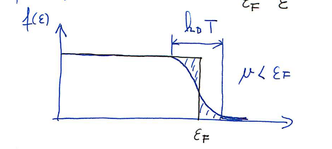

#+title: Predavanja iz Fizike trdne snovi, 10. teden v letu
#+subtitle: 2026/03/04 in 2026/03/05
#+startup: nolatexpreview
#+startup: entitiespretty nil
#+startup: show2levels
#+latex_header: \usepackage{amsmath} \usepackage{unicode-math} \usepackage{cancel} \usepackage{graphicx}
#+latex_header: \renewcommand{\theta}{\vartheta} \renewcommand{\phi}{\varphi} \renewcommand{\epsilon}{\varepsilon}
#+latex_header: \newcommand{\odv}[1]{\dot{\vec{#1}}} \newcommand{\oddv}[1]{\ddot{\vec{#1}}}
#+latex_header: \newcommand{\rot}{\mathrm{rot}}\newcommand{\dive}{\mathrm{div}} \newcommand{\iu}{\mathrm{i}}
#+latex_header: \newcommand\mapsfrom{\mathrel{\reflectbox{\ensuremath{\mapsto}}}}
* Model prostih \( e^- \) v kristalu

Lastne energije, ki lahko zasedajo \( e^- \) v kristalu so

\[ E_{\mathbf{k}} = \frac{\hbar ^2}{2m} \left( \frac{2 \pi}{L} \right) ^2 \left( m_1 ^2 + m_2 ^2 + m_3 ^2 \right).
\]

\begin{array}{|c c c|c|c|c|} \hline
m_1 & m_2 & m_3 & E_{\mathbf{k}} \left[ \frac{\hbar ^2}{2m} \left( \frac{2 \pi}{L} \right)^2 \right] & m_{\sigma} & \text{deg} \\ \hline
0 & 0 & 0 & 0 & \uparrow \downarrow & 2 \\ \hline
\pm 1 (0) [0] & 0 (\pm 1) [0] & 0 (0) [\pm 1] & 1 & \uparrow \downarrow & 12 \\ \hline
\pm 1 (\pm 1) [0] & \pm 1 (0) [\pm 1] & 0 (\pm 1) [\pm 1] & 2 & \uparrow \downarrow & 24 \\ \hline
\end{array}

Če si predstavljamo prostor valovnega vektorja \( \mathbf{k} \), bo eno stanje zasedalo prostor volumna \( \left( \frac{2 \pi}{L} \right) ^3 \). V tem volumnu se zaradi Paulijevega izključitvenega principa nahajata dva elektrona, vsak s svojim spinom (gor ali dol).

Vsi elektroni v kristalu zapolnijo kroglo, katere polmer je Fermijev valovni vektor \( \mathbf{k}_F \). Število elektronov v Fermijevi sferi je

\[ 2 \cdot \frac{4 \pi \mathbf{k}_F ^3}{3} \frac{1}{\left( \frac{2 \pi}{L} \right) ^3} = N_{el},
\]

iz česar sledi, da je vrednosti Fermijevega valovnega vektorja

\[ k_F^3 = 3 \pi ^2 n, \ n = \frac{N_{el}}{V}
\]

Sedaj lahko izrazimo tudi Fermijevo energijo

\begin{equation}
\label{eq:1}
 E_F = \frac{\hbar ^2}{2m} k_F ^2 = \frac{\hbar ^2}{2m} \left( 3 \pi ^2 \frac{N_{el}}{V} \right) ^{\frac{2}{3}}.
\end{equation}

Želimo poračunati Fermijevo hitrost, kar bomo naredili s pomočjo operatorja gibalne količine \( \hat{p} = - \mathrm{i} \hbar \nabla \). Upoštevamo, da je \( \hbar \mathbf{k} = p \) in izračunamo

\[ \hat{p} e^{\mathrm{i} \mathbf{k} \mathbf{n}} = \hbar \mathbf{k} e^{\mathrm{i} \mathbf{k} \mathbf{n}} \implies \mathbf{v}_F =  \frac{\hbar \mathbf{k}}{m}.
\]
** Gostota elektronskih stanj

Gostoto elektronskih stanj bomo definirali na dva načina

\[ D(E) = \frac{\mathrm{d} N}{\mathrm{d} E} \quad \text{ in } \quad g(E) = \frac{1}{V} \frac{\mathrm{d} N}{\mathrm{d} E}.
\]

Prva količina nam pove, koliko energijskih stanj odpade na enoto energije, druga pa je normirana(?) na enoto volumna.

Vemo, da je energija določena preko števila delcev iz enačbe \ref{eq:1}

\[ E = \frac{\hbar ^2}{2m} \left( 3 \pi ^2 \frac{N}{V} \right)^{\frac{2}{3}},
\]

iz česar lahko izrazimo število delcev

\[ N = \frac{V}{3 \pi ^2} \left( \frac{2m}{\hbar ^2} \right)^{\frac{3}{2}} E^{\frac{3}{2}}.
\]

Sedaj lahko izrazimo prvo količino

\begin{equation}
\label{eq:2}
 D(E) = \frac{\mathrm{d} N}{\mathrm{d} E} = \frac{V}{2 \pi ^3} \left( \frac{2m}{\hbar} \right)^{\frac{3}{2}}\sqrt{E}.
\end{equation}

Če želimo izračunati porazdelitev za Fermijevo energijo, potem jo lahko izrazimo kot

\[ \left( \frac{2m}{\hbar ^2} \right)^{\frac{3}{2}} = 3 \pi ^2 n E_F^{-\frac{3}{2}},
\]

kar nadomestimo v enačbi \ref{eq:2} in dobimo

\[ D(E) = \frac{3}{2} V \frac{n}{E_F} \sqrt{\frac{E}{E_F}}.
\]

Gostota stanje je potem

\[ g(E) = \frac{3}{2} \frac{n}{E_F} \sqrt{\frac{E}{E_F}}.
\]

Vse zgoraj napisano je bilo obravnavano pri temperaturi \( T = 0 \). V integralni formi je pri \( T = 0 \) število delcev

\[ N = \int\limits_{- \infty}^E D(E) \, \mathrm{d} E.
\]

V primeru \( T > 0 \), potem je število vzbujenih elektronov določeno s Fermi-Diracovo porazdelitvijo

\[ f(E) = \left( \exp \left\{ \frac{E - \mu}{k_B T} \right\} + 1\right)^{-1},
\]

kjer je \( \mu \) kemijski potencial, odvisen od temperature in zanj velja \( \lim_{T \to 0} \mu(T) = E_F \).

#+begin_my_example
Kot primer si poglejmo za temperaturo \( T \sim 300 K \). Boltzmannova konstanta ima vrednost \( k_B = 8.6 \cdot 10^{-8} \frac{\mathrm{eV}}{\mathrm{K}} \).

Njun produkt bo potem imel vrednost

\[ k_B T_{zun} = 0.026 \mathrm{eV},
\]

medtem ko ima Fermijeva energija značilno vrednost

\[ E_F = \left( 10^3 - 10^6 \right) \mathrm{eV}.
\]

Za značilne lastnosti Fermijeve energije bo torej širina porazdelitve Fermi-Diraca, še zmeraj "škatlasto".

What's the point of this comparison?
#+end_my_example
** Specifična toplota elektronskega plina \( c_v \)

Specifična toplota elektronskega plina je definirana kot

\begin{equation}
\label{eq:4}
 c_V = \frac{T}{V} \left( \frac{\partial S}{\partial T}  \right)_V = \frac{1}{V} \left( \frac{\partial U_{n}}{\partial T}  \right)_V = \left( \frac{\partial U}{\partial T}  \right)_V,
\end{equation}

kjer je \( S \) entropija, \( U_n \) pa notranja energija.

Celotna energija elektronov pri \( T = 0 \) je definirana kot vsota vseh energijskih stanj

\[ U_0 = 2 \frac{1}{V} \sum\limits_{\mathbf{k}, \mathbf{k} < \mathbf{k}_F}^{} E_{\mathbf{k}}.
\]

Za \( T > 0 \) pa izračunamo z upoštevanjem Fermi-Diracove porazdelitve

\[ U(T) = \frac{2}{V} \sum\limits_{\mathbf{k}}^{} E_{\mathbf{k}} f(E_{\mathbf{k}}).
\]

#+begin_theorem
Naj bo \( H \) funkcija odvisna zgolj od energijskih stanj \( H(E_{\mathbf{k}}) \). Potem lahko vsoto po valovnih vektorjih zapišemo z integralom

\[ h = \frac{2}{V} \sum\limits_{\mathbf{k}}^{} H(E_{\mathbf{k}}) = \frac{2}{V} \int\limits_{}^{} \frac{\mathrm{d} ^3 \mathbf{k}}{\left( \frac{2 \pi}{L} \right) ^3} H(E_{\mathbf{k}}) = \int\limits_{}^{} \frac{\mathrm{d} ^3 \mathbf{k}}{4 \pi ^3} H(E_{\mathbf{k}}) = \int\limits_{- \infty}^{\infty} g(E) H(E) \, \mathrm{d} E,
\]

kjer smo upoštevali \( L ^3 = V \).
#+end_theorem

#+begin_proof
Trdimo torej, da velja

\[ \frac{\mathrm{d} ^3 \mathbf{k}}{4 \pi ^3} = g(E) \, \mathrm{d} E.
\]

\( \mathrm{d} ^3 \mathbf{k} \) lahko razpišemo kot \( 4 \pi k ^2 \mathrm{d} k \) in za energijo \( E = \frac{\hbar ^2 k ^2}{2m} \), iz česar lahko pridemo do zveze

\[ g(E) = \frac{1}{2 \pi ^2} \left( \frac{2m}{\hbar ^2} \right)^{\frac{3}{2}} \sqrt{E}
\]
#+end_proof

Sedaj lahko celotno energijo zapišemo kot

\begin{equation}
\label{eq:5}
 U(T) = \int\limits_{}^{} \frac{\mathrm{d} ^3 \mathbf{k}}{4 \pi ^3} E_{\mathbf{k}} f(E_{\mathbf{k}}) = \int\limits_{}^{} E f(E) g(E) \, \mathrm{d} E.
\end{equation}

Gostota delcev pa je potem

\begin{equation}
\label{eq:3}
 n(T) = \int\limits_{}^{} \frac{\mathrm{d} ^3 \mathbf{k}}{4 \pi ^3} f(E_{\mathbf{k}}) = \int\limits_{}^{} f(E) g(E) \, \mathrm{d} E.
\end{equation}

To velja zgolj za interval \( (- \infty, \infty) \). Za končen interval \( (- \infty, \mu) \) nam priskoči na pomoč Sommerfeldov teorem, ki pravi

\[ \int\limits_{- \infty}^{\infty} H(E) f(e) \, \mathrm{d} E = \int\limits_{- \infty}^{\mu} H(E) \, \mathrm{d} E + \left. \frac{\pi ^2}{6} \left( k_BT \right) ^2H'(E) \right|_{E = \mu}.
\]

Dobljeno spoznanje bomo takoj uporabili na \ref{eq:3}. Prej samo povemo, da lahko interval razdelimo na

\[ \int\limits_{- \infty}^{\mu} \ldots \, \mathrm{d} E = \int\limits_{- \infty}^{E_F} \ldots \, \mathrm{d} E + \int\limits_{E_F}^{\mu} \ldots \, \mathrm{d} E.
\]

Torej dobimo

\[ n(T) = \int\limits_{}^{} f(E) g(E) \, \mathrm{d} E = \int\limits_{- \infty}^{E_F} g(E) \, \mathrm{d} E + \int\limits_{E_F}^{\mu} g(E) \, \mathrm{d} E + \left. \frac{\pi ^2}{6} \left( k_B T  \right) ^2 g'(E) \right|_{\epsilon = \mu}.
\]

Prvi integral je ekvivalenten \( \int_{- \infty}^{E_F} g(E) \, \mathrm{d} E = n \), hkrati pa iz definicije specifične toplote operiramo pod predpostavko nespreminjajočega se volumna. Iz tega torej zaključimo, da je \( n(T) = n \).

Druga pomembna predpostavka, ki nam jo bo potrdil rezultat, pa je \( \mu \sim E_F \). Naša zgornja enačba torej postane

\begin{equation}
\label{eq:6}
 0 = \int\limits_{E_F}^{\mu} g(E) \, \mathrm{d} E + \left. \frac{\pi ^2}{6} \left( k_B T \right) ^2 g'(E) \right|_{E = \mu} = \left( \mu - E_F \right) g(E_F) + \frac{\pi ^2}{6} \left( k_B T \right) ^2g'(E_F).
\end{equation}

Izrazimo lahko kemijski potencial

\[ \mu = E_F - \frac{\pi ^2}{6} \left( k_B T \right) ^2 \frac{g'(E_F)}{g(E_F)}.
\]

Če je \( g(E) \propto E^{\frac{1}{2}} \), potem bo \( g'(E) \propto E^{- \frac{1}{2}} \), iz česar sledi, da je njuno razmerje \( \frac{g'(E)}{g(E)} = \frac{1}{2E_F} \). Preostane nam torej izraz

\[ \mu = E_F \left[ 1 - \frac{\pi ^2}{12} \left( \frac{k_B T}{E_F} \right)^2 \right].
\]

Postopek ponovimo z enačbo \ref{eq:5} z enakimi predpostavkami

\[ U = \int\limits_{- \infty}^{E_F} g(E) E \, \mathrm{d} E + \left( \mu - E_F \right) E_F g(E) + \frac{\pi ^2}{6} \left( k_B T \right) ^2 \left( g(E_F) + g' (E_F) E_F \right).
\]

Integral označimo z \( U_0 \), hkrati pa upoštevamo \ref{eq:6} in se nam drugi in četrti člen odštejeta. Preostane nam

\[ U = U_0 + \frac{\pi ^2}{6} \left( k_B T \right) ^2 g(E).
\]

Sedaj lahko izrazimo specifično toploto

\[ c_V = \frac{\pi ^2}{3} k_B T g(E_F) k_B.
\]

Nadomestimo \( g(E_F) = \frac{3}{2} \frac{n}{E_F} \), iz česar zaključimo

\[ c_V = \frac{\pi ^2}{2} \frac{k_B T}{E_F} n \cdot k_B.
\]

Nadomestili smo lahko izraz iz definicije

\[ g(E) = \frac{\mathrm{d} n}{\mathrm{d} E}.
\]

Dobljeno vrednost specifične toplote lahko primerjamo s tisto od plina in opazimo drugačne predfaktorje

\[ c = \frac{3}{2} n k_B.
\]

Definiramo lahko molarno specifično toploto

\[ C_V = \frac{Z N_A}{n} c_V = \frac{Z N_A}{n} \frac{\pi ^2}{2} \frac{k_B T}{E_F} n k_B = \frac{Z R \pi ^2}{2} \frac{k_B T}{E_F},
\]

kjer smo upoštevali, da zmnožek Avogadrovega števila \( N_A \) in Boltzmannove konstante \( k_B \) poda plinsko konstanto \( R \).
** Drudejev model električne upornosti

Z Drudejevem modelom opišemo eno od idej, kako kovine prevajajo. Model predpostavlja, da se \( Z \) elektronov prosto gibljejo po kristalu. Prosto gibajoči elektroni se trkajo ob jedra atomov.

Ta model ima en prost parameter

\[ P = \frac{1}{\tau},
\]

kjer je \( P \) verjetnost in \( \tau \) relaksacijski čas.

Elektroni čutijo na sebi dve sili: električno silo, ki je posledica konstantnega končnega električnega polja (napetosti) ter spremembe gibalnih količin zaradi trkov ob jedra. Predpostavka je, da so trki instantni. Drugi Newtonov zakon za elektron je potem

\[ m \mathbf{a} = -e \mathbf{E} - \frac{m \mathbf{v}}{\tau}.
\]

Povprečna vrednost hitrosti je potem

\[ \left\langle \mathbf{v} \right\rangle = - \frac{e \tau}{m} \mathbf{E}.
\]

[Obrazloži] Gostota električnega toka je

\[ \mathbf{j} = - n e \mathbf{v},
\]

kjer imamo negativen predznak zaradi naboja (premikajo se elektroni).

Hkrati vemo iz EMP, da je Ohmov zakon

\[ \mathbf{j} = \sigma \mathbf{E},
\]

iz česar lahko potem izrazimo specifično upornost, kjer nadomestimo izraz za hitrost z njeno povprečjo vrednostjo

\[ \mathbf{j} = \frac{n e ^2 \tau}{m} \mathbf{E} = \sigma \mathbf{E} \implies \sigma = \frac{n e ^2 \tau}{m} .
\]

Vprašamo se, kaj se zgodi s Fermijevo sfero v primeru električnega polja. Če električno polje kaže v negativni smeri abscise v prostoru \( \mathbf{k} ^3 \), potem se bo krogla premaknila za \( \Delta k \) v pozitivno smer. Izračunajmo, za koliko se premakne Fermijeva sfera.

Povprečna hitrost med trki je

\[ \mathbf{v} = \frac{\hbar \mathbf{k}}{m}.
\]

Sila, ki deluje na elektron je odvisna od električnega polja

\[ \mathbf{F} = m \frac{\mathrm{d} \mathbf{v}}{\mathrm{d} t} = - e \mathbf{E}.
\]

Odvod hitrosti lahko izrazimo

\[ \frac{\mathrm{d} \mathbf{p}}{\mathrm{d} t} = \hbar \frac{\mathrm{d} \mathbf{k}}{\mathrm{d} t},
\]

kjer je \( \mathbf{p} \) gibalna količina. Odvod lahko nadomestimo z razmerjem \( \frac{\Delta k}{\tau} \) in lahko potem izrazimo

\[ \Delta k = - \frac{e \tau}{\hbar} \mathbf{E}.
\]

Izračunamo lahko tudi povprečno prosto pot \( \bar{l} \). Po definiciji je

\[ \bar{l} = v_F \cdot \tau.
\]

Fermijeva hitrost je definirana kot

\[ v_F = \frac{\hbar k_F}{m}.
\]

Prosta pot v bakru je \( v_{F, Cu} = 1.57 \cdot 10^6 \frac{\mathrm{m}}{\mathrm{s}} \).

\[
\begin{array}{|c|c|c|} \hline
T & \tau & \bar{l} \\ \hline
4 \mathrm{K} & 2 \cdot 10^{-9} \mathrm{s} & 0.3 \mathrm{cm} \\
300 \mathrm{K} & 2 \cdot 10^{-12} \mathrm{s} & 3 \cdot 10^{-6} \mathrm{cm} \\ \hline
\end{array}
\]
* Elektronska stanja v periodičnem potencialu \( U(\mathbf{r}) \)

Osnovna ideja periodičnega potenciala je to, da če se premaknemo/transliramo v kristalu za nek \( \mathbf{R} \) (bolje definiraj \( \mathbf{R} \) z BR?), potem velja

\[ U(\mathbf{r} - \mathbf{R}) = T_{\mathbf{R}} U(\mathbf{r}) = U(\mathbf{r}).
\]

Ogledali si bomo dva točki

1) šibek \( U(\mathbf{r}) \)
2) metoda tesne vezi

Predstavljajmo si periodično kristalno strukturo z ioni. Na samem mestu, kjer je ion, nam potencial divergira zaradi člena \( \frac{1}{r} \). Šibek potencial \( U(\mathbf{r}) \) predstavimo kot potencial, ki ga čutijo elektroni, ki se premikajo med ravninama ionov. V tem prostoru potencial je divergira.

Reševali bomo valovno enačbo za en elektron s periodičnim potencialom. Reševali bomo za en elektron, saj je to osnovna rešitev, s katero bomo potem sestavili večdelčno rešitev.

\[ \left[ - \frac{\hbar ^2 \nabla ^2}{2m} + U(\mathbf{r}) \right] \psi(\mathbf{r}) = E \psi(\mathbf{r}).
\]
