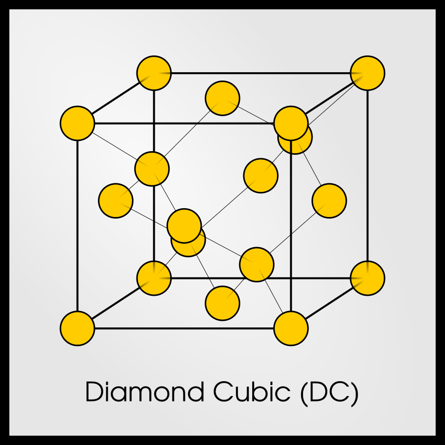

#+title: Vaje iz Fizike trdne snovi, 8. teden v letu
#+subtitle: 2026/02/16
#+startup: nolatexpreview
#+startup: entitiespretty nil
#+startup: show2levels
#+latex_header: \usepackage{amsmath} \usepackage{unicode-math} \usepackage{cancel} \usepackage{graphicx}
#+latex_header: \renewcommand{\theta}{\vartheta} \renewcommand{\phi}{\varphi} \renewcommand{\epsilon}{\varepsilon}
#+latex_header: \newcommand{\odv}[1]{\dot{\vec{#1}}} \newcommand{\oddv}[1]{\ddot{\vec{#1}}}
#+latex_header: \newcommand{\rot}{\mathrm{rot}}\newcommand{\dive}{\mathrm{div}} \newcommand{\iu}{\mathrm{i}}
#+latex_header: \newcommand\mapsfrom{\mathrel{\reflectbox{\ensuremath{\mapsto}}}}
* Kristalne strukture in polnitveno razmerje \( \eta \)

Pri MF2 smo srečali različne kristalne strukture.

** Enostavna/navadna kubična kristalna mreža (ang. /simple cubic/ or /sc/)

[[file:figures/oc.svg]]
Vir: By Vectorization: Stannered - Own work based on: Cubic crystal shape.png by Daniel Mayer at English Wikipedia, CC BY-SA 3.0, https://commons.wikimedia.org/w/index.php?curid=1735632

Mrežo definiramo z osnovno celico, ki ima neko geometrijsko obliko. S translacijo osnovne celice zgradimo kristal. Rotacija osnovne celice je prepovedana. Osnovni celici, ki ima najmanjši volumen, pravimo primitivna celica. Imamo neskončno možnosti za izbiro osnovne celice. Primitivna celica je osnovna celica, ampak tudi npr. tudi kvadrat iz 8 primitivnih celic je dobra osnovna celica.

Matematičnemu delu kristala pravimo Bramejeva mreža(?). Fizikalno je pomembno, da so v vseh točkah enake lastnosti.

Kristalno mrežo zapolnimo s togimi kroglami takega polmera, da se ne prekrivajo med sabo.

Polnitveno razmerje je definirano

\[ \eta = \frac{V_{snov}}{V_{oc}},
\]

kjer je \( V_{snov} \) volumen snovi, \( V_{oc} \) pa je volumen osnovne celice.

Stranici \( a \) pravimo mrežna razdalja.

Volumen snovi je sestavljen iz osmih osmin krogel polmera \( r = \frac{a}{2} \). Polnitveno razmerje je

\[ \eta = \frac{8 \cdot \frac{1}{8}  \frac{4}{3} \pi r ^3}{a ^3} = \frac{\pi}{6} \approx 52\%.
\]
** Telesno centrirana kubična kristalna mreža (ang. /body centered cubic/ or /bcc/)

[[file:figures/bcc.svg]]
Vir: By Original: Daniel Mayer and DrBob at English Wikipedia Vector: Stannered - Crystal stucture, CC BY-SA 3.0, https://commons.wikimedia.org/w/index.php?curid=1735630

Kristalno mrežo napolnimo ponovno s kroglicami. Tokrat bo največji možni polmer četrtina telesne diagonale, torej

\[ r = \frac{d}{4} = \frac{\sqrt{3} a}{4}.
\]

Polnitveno razmerje tako

\[ \eta = \frac{8 \cdot \frac{1}{8} \frac{4}{3} \pi r ^3 + \frac{4}{3} \pi r ^3}{a ^3} = 2\frac{4}{3} \pi \frac{3 \sqrt{3}}{64} \approx 68 \%.
\]

Za Bramejevo mrežo je značilno, da je vsaka točka med seboj enaka (središčna točka lahko igra tudi vlogo oglišča brez spremembe). Kakor vidimo iz zgornje enačbe, imamo v volumnu bcc 2 celi krogli.

Za domačo nalogo nas zanima, če lahko v osnovno celico zmanjšamo tako, da bo imela osnovna celica volumen ene krogle.
** Ploskovno centrirana kubična kristalna mreža (ang. /face-centered cubic/ or /fcc/)

[[file:figures/fcc.svg]]
Vir: By Original PNGs by Daniel Mayer and DrBob, traced in Inkscape by User:Stannered - Cubic, face-centered.png:  Lattice face centered cubic.svg:, CC BY-SA 3.0, https://commons.wikimedia.org/w/index.php?curid=1735631

V točke ponovno postavimo toge krogle. Maksimalen polmer krogel je polovica ploskovne diagonale \( r = \frac{\sqrt{2} a}{4} \).

Polnitveno razmerje je

\[ \eta = \frac{8 \cdot \frac{1}{8} \frac{4}{3} \pi r ^3 + \frac{1}{2} \cdot 6 \cdot \frac{4}{3} \pi r ^3}{a ^3} \approx 74 \%.
\]

Volumen snovi je sestavljen iz \( 8 \cdot \frac{1}{8} + \frac{1}{2} \cdot 6 = 1 + 3 = 4 \) krogel.

Osnovna celica je zadošča pogojem kakor prej, da je vsaka točka med seboj enaka. Ponovno, domača naloga, ali obstaja volumnsko 4krat manjša osnovna celica.
** Diamantna kristalna mreža

Vir:https://msestudent.com/diamond-cubic-unit-cell/

Diamantno kristalno mrežo dobimo tako, da imamo dve fcc mreži, ki se na začetku popolnoma prekrivata, nato pa eno od fcc mrež po telesni diagonali premaknemo za četrtino diagonale.

Na naslednji vajah bomo dokazali, da tvori točka oglišča s točkami na priležnih stranicah pravilni tetraeder, kjer je točka premaknjene fcc mreže v središču tetraedra.

Polmer toge krogle z maksimalnim polmerom je tokrat polovica četrtine telesne diagonale, kar je \( r = \frac{a \sqrt{3}}{4} \). Polnitveno razmerje je

\[ \eta = \frac{8 \cdot \frac{4}{3} \pi r ^3}{a ^3} = \frac{\sqrt{3} \pi}{16} \approx 34\%
\]

Diamantna struktura ni Bravaisema mreža, saj ima središče pravilnega tetraedra drugačno okolico od ogliščne točke. To bo imelo posledice pri računanju fizikalnih količin.
** Navadna heksagonalna mreža (trikotne mreže)

Osnovna celica trikotne mreže je heksagon, vendar to ni primitivna celica. Ena od možnih izbir primitivne celice je paralelogram, saj je volumen krogle v njem ravno \( 2 \cdot \frac{1}{6} + 2 \cdot \frac{1}{3} = 1 \). Ostra kota vsebujeta \( \frac{1}{6} \) kroga, topa kota pa vsak po \( \frac{1}{3} \).

Navadna heksagonalna mreža izgleda tako, da imamo ravnino \( xy \) napolnjeno s heksagoni, tridimenzionalni kristal pa je sestavljen iz nezamaknjene ravnine heksagonov, ki sega v globino osi \( z \). Ravnine heksagonov so med seboj narazen za \( h \). Osnovna celica je torej pravilna paralelna prizma. Za maksimalno zapolnjenost je polmer krogle \( r = \frac{a}{2} \) s pogojem \( h = a \). To pomeni, da je prizma enakostranična.

V osnovni celici je ravno 1 krogla. Če dodamo k razmisleku iz prvega odstavka, top in ostri kot tvorita polovico krogla v paralelogramu.
** Najgostejši sklad

aka imagine ferrero rosche stolp.

Ponovno si predstavljamo ravnino heksagonov. Ko gradimo kristal v treh dimenzijah, imamo dve opciji: naslednja ravnina ima lahko točke ali v B ali v C (glej sliko). Tretji sloj kristala je lahko v primeru, da sta prvi dve ravnini AB, s točkami v A ali C. V primeru prvih dveh ravnin AC, potem je tretji sloj možen s položaji točk A ali B. Vse omenjene kombinacije imajo enako gostoto.

Zaradi periodičnosti sta najbolj značilni mreži s periodo \( AB \) ali pa \( ABC \). Prvotni se reče heksagonalni najgostejši sklad (ang. /hexagonal close-packed/ or /hcp/).

Polnitveno razmerje je sestavljeno iz krogel s polmerom \( r = \frac{a}{2} \), vendar je tokrat višina \( h = 2a \sqrt{\frac{2}{3}} \) in ima vrednost

\[ \eta_{hcp} = \frac{2 \cdot \frac{4}{3} \pi r ^3}{\frac{\sqrt{3}}{2}a ^2 \cdot h} = \frac{\pi}{3 \sqrt{2}} \approx 74 \% = \frac{\pi \sqrt{2}}{6} = \eta_{fcc}
\]
