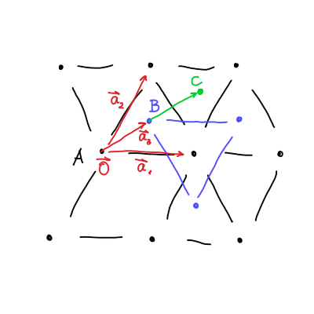
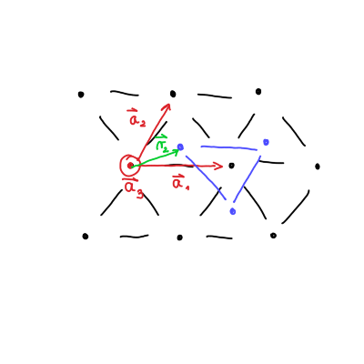

#+title: Vaje iz Fizike trdne snovi, 9. teden v letu
#+subtitle: 2026/02/23
#+startup: nolatexpreview
#+startup: entitiespretty nil
#+startup: show2levels
#+latex_header: \usepackage{amsmath} \usepackage{unicode-math} \usepackage{cancel} \usepackage{graphicx}
#+latex_header: \renewcommand{\theta}{\vartheta} \renewcommand{\phi}{\varphi} \renewcommand{\epsilon}{\varepsilon}
#+latex_header: \newcommand{\odv}[1]{\dot{\vec{#1}}} \newcommand{\oddv}[1]{\ddot{\vec{#1}}}
#+latex_header: \newcommand{\rot}{\mathrm{rot}}\newcommand{\dive}{\mathrm{div}} \newcommand{\iu}{\mathrm{i}}
#+latex_header: \newcommand\mapsfrom{\mathrel{\reflectbox{\ensuremath{\mapsto}}}}
* Kristalne strukture
** Trikotna mreža

Po dogovoru je Bravaiseva mreža množica točka definirana kot

\[ \mathbf{R} = n_1 \mathbf{a}_1 + n_2 \mathbf{a}_2 + n_3 \mathbf{a}_3, \quad n_1, n_2, n_3 \in \mathbb{Z},
\]

kjer so \( \mathbf{a}_i, \, i = 1, 2, 3 \) primitivni vektorji.

Kristalna mreža v 2D pa je

\[ \mathbf{R} = n_1 \mathbf{a}_1 + n_2 \mathbf{a}_2.
\]

Del te množice je tudi vektor \( \mathbf{R} = 0 \).

Trikotna mreža ima primitivna vektorja, ki sta dve različni stranici trikotnika. Hitro lahko vidimo, da je trikotna mreža Bravaiseva, saj so si točke ekvivalentne.

Sedaj si zamislimo hcp (AB) mrežo. Ta mreža je sedaj v tridimenzionalnem prostoru. Celoštevilski vektor \( \mathbf{R} = 2 \mathbf{a}_3 \) opisuje kristalno mrežo v poziciji C. Zaključimo, da niso vse linearne kombinacije hcp(AB) kristalne strukture del Bravaiseve mreže.

\( \mathbf{a}_3 \) si bomo izbrali tako, da kaže direktno iz lista. Zapis bomo razširili z bazo

\[ \mathbf{X} = \mathbf{R} + \mathbf{r}, \quad \mathbf{r}  \in \left\{ \mathbf{r}_1 = 0, \mathbf{r}_2 \right\}
\]

*** hcp(ABC)

Pri hcp(ABC) mreži pa je prvotno izbrana baza sedaj dobro izbrana, saj lahko B sloj opišemo z

\[ \mathbf{a}_3 + n_1 \mathbf{a}_1 + n_2 \mathbf{a}_2.
\]

Tretji sloj, C, lahko opišemo z

\[ 2 \mathbf{a}_3 + n_1 \mathbf{a}_1 + n_2 \mathbf{a}_2.
\]

Prvi sloj, A, pa lahko opišemo z

\[ 3 \mathbf{a}_3 + n_1 \mathbf{a}_1 + n_2 \mathbf{a}_2.
\]

Zaključimo, da je hpc(ABC) Bravaiseva mreža.

Primitivni vektorji ležijo na robovih pravilnega tetraedra in velja \( \left| \mathbf{a}_1 \right| = \left| a_2 \right| = \left| a_3 \right| \). Koti med primitivnimi vektorji so enaki.
** fcc

Po podobnem principu kot pri trikotni mreži želimo opisati z lastnostmi primitivnih vektorjev

\[ \mathbf{a}_1 = \left( \frac{a}{2}, \frac{a}{2}, 0 \right), \quad  \mathbf{a}_2 = \left( \frac{a}{2}, 0, \frac{a}{2} \right), \quad  \mathbf{a}_3 = \left( 0, \frac{a}{2}, \frac{a}{2} \right).
\]

Kot med primitivnima vektorjema je

\[ \cos \phi_{12} = \frac{\mathbf{a}_1 \cdot \mathbf{a}_2}{\left| \mathbf{a}_1 \right| \left| \mathbf{a}_2 \right|} = \frac{1}{2}.
\]

Ker so tudi dolžine vektorjev enake, zaključimo, da je fcc v resnici samo drug način opisa hpc(ABC).
