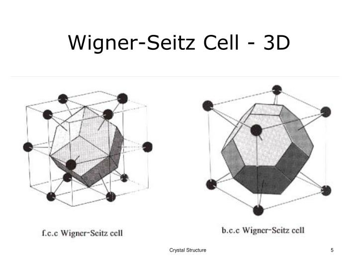

#+title: Vaje iz Fizike trdne snovi, 10. teden v letu
#+subtitle: 2026/03/02
#+startup: nolatexpreview
#+startup: entitiespretty nil
#+startup: show2levels
#+latex_header: \usepackage{amsmath} \usepackage{unicode-math} \usepackage{cancel} \usepackage{graphicx}
#+latex_header: \renewcommand{\theta}{\vartheta} \renewcommand{\phi}{\varphi} \renewcommand{\epsilon}{\varepsilon}
#+latex_header: \newcommand{\odv}[1]{\dot{\vec{#1}}} \newcommand{\oddv}[1]{\ddot{\vec{#1}}}
#+latex_header: \newcommand{\rot}{\mathrm{rot}}\newcommand{\dive}{\mathrm{div}} \newcommand{\iu}{\mathrm{i}}
#+latex_header: \newcommand\mapsfrom{\mathrel{\reflectbox{\ensuremath{\mapsto}}}}
* Kristalne strukture
** Wigner-Seitzova osnovna celica za bcc

Izberemo si eno izhodiščno točko. V našem primeru bo to središčna točka. Izhodiščno točko povežemo z vsemi ostalimi točkami v celici. Daljico do posamezne točke prepolovimo in tam narišemo ravnino pravokotno na daljico. Vse ravnine, ki se sekajo, tvorijo Wigner-Seitzovo osnovno celico, hkrati pa ohrani vse lastnosti bcc.

Enačbo ravnine s podanim normalnim vektorjem \( \hat{n} \) in razdaljo \( d = \frac{a}{2} \), ki je razdalja med središčno točko in ravnine osnovne ploskve, je

\[ \mathbf{r} \cdot \hat{n} = d,
\]

kjer je \( \mathbf{r} \) vektor na ravnini.

Potem bo ravnina osnovne ploskve za \( \hat{n} = (1, 0, 0) \) enak \( x = \frac{a}{2} \).

Ravnina do enega izmed oglišč z normalo \( \hat{n} = \frac{1}{\sqrt{3}} (1, 1, 1) \) in razdalje \( d = \frac{\sqrt{3}}{4} a \) bo

\[ \frac{1}{\sqrt{3}} (x + y + z) = \frac{\sqrt{3}}{4} a.
\]

Upoštevamo, da to novo ravnino seka stara ravnina \( x = \frac{a}{2} \), kar pomeni, da bo bila ta ravnina omejena z

\[ \frac{a}{2} + y + z = \frac{3}{4} a \implies y = \frac{a}{4} - z
\]

Postopek ponovimo za vse ostale točke in pridobimo prisekani oktaeder.

Vir: [[https://p.kagi.com/proxy/wigner-seitz-cell-3d-n.jpg?c=VZ7S0uXFgeCtr60dQz82J6Nj5tgGQ9BSIfvfY8bfqEExz9xSBPzMeOlvomx34nUWLJGo4DmzBHJolZhfbZ0uwaDLsvvKcfkzmceCXBM9cHU%3D][Linki babinki]]
** Ortorombske Bravaisove mreže

Imamo ortorombsko mrežo, kjer so \( \alpha = \beta = \gamma = \frac{\pi}{2} \) in \( a \ne b \ne c \).

Narisali smo enostavno, telesno centrirano (os, ki je bila v BCC \( C_4 \), je sedaj samo \( C_2 \)) in ploskovno centrirano mrežo.

Ortorombska celica, ki ima ploskovno centrirane točke na plašču, ni Bravaisova mreža.

Ortorombska celica, ki ima ploskovno centrirane točke na osnovnih ploskvah (ang. /base-centered ortorhombic/) je Bravaisova mreža.
** Tetragonalne Bravaisove mreže
** Recipročna mreža bcc

Naj \( \mathbf{R} \) definira Bravaisovo mrežo

\[ \mathbf{R} = n_1 \mathbf{a}_2 + n_2 \mathbf{a}_2 + n_3 \mathbf{a}_3, \ n_1, n_2, n_3 \in \mathbb{Z}
\]

kjer so \( \mathbf{a}_1, \mathbf{a}_2 \) in \( \mathbf{a}_3 \) primitivni vektorji.

Pri recipročni mreži bo za vsak \( \mathbf{R} \) veljalo, da je

\[ \exp \left\{ \mathrm{i} \mathbf{K} \cdot \mathbf{R} \right\} = 1,
\]

kjer je

\[ \mathbf{K} = m_1 \mathbf{A}_1 + m_2 \mathbf{A}_2 + m_3 \mathbf{A}_3, \ m_1, m_2, m_3 \in \mathbb{Z}.
\]

Primitivni vektorji recipročne mreže so

\[ \mathbf{A}_1 = \frac{a_2 \times \mathbf{a}_3}{\left( \mathbf{a}_1, \mathbf{a}_2, \mathbf{a}_3 \right)} \cdot 2\pi \quad \text{ in } \quad  \mathbf{A}_2 = \frac{\mathbf{a}_3 \times \mathbf{a}_1}{\left( \mathbf{a}_2 , \mathbf{a}_3, \mathbf{a}_1 \right)} \cdot 2 \pi \quad \text{ in } \quad \mathbf{A}_3 = \frac{a_1 \times \mathbf{a}_2}{\left( \mathbf{a}_3 , \mathbf{a}_2, \mathbf{a}_1 \right)} \cdot 2 \pi,
\]

kjer je \( (\mathbf{a}_i, \mathbf{a}_j, \mathbf{a}_k) \) mešani produkt.

Namesto primitivnih vektorjev

\[ \tilde{\mathbf{a}}_1 = a(1, 0, 0) \quad \text{ in } \quad \tilde{\mathbf{a}}_2 = a(0, 1, 0) \quad \text{ in } \quad \tilde{\mathbf{a}}_3 = a(0, 0, 1),
\]

bomo vzeli

\[ \mathbf{a}_1 = \frac{a}{2} \left( -1, 1, 1 \right) \quad \text{ in } \quad \mathbf{a}_2 = \frac{a}2{ \left( 1, -1, 1 \right) \quad \text{ in } \quad}\mathbf{a}_3 = \frac{a}2{ \left( 1, 1, -1 \right).
\]

Vektorski produkt \( \mathbf{a}_2 \) in \( \mathbf{a}_3 \) bo

\[ \mathbf{a}_2 \times \mathbf{a}_3 = \frac{a ^2}{2} (0, 1, 1).
\]

Mešani produkt bo potem

\[ \mathbf{a}_1 \left( \mathbf{a}_2 \times \mathbf{a}_3 \right) = \frac{a ^3}{4} (0, 1, 1) (-1, 1, 1) = \frac{a ^3}{3}
\]

Potem bo vektor recipročne mreže

\[ \mathbf{A}_1 = \frac{2 \pi \frac{a ^2}{2}}{\frac{a ^3}{2}} = \frac{2 \pi}{a } \left( 0, 1, 1 \right).
\]

Iz predavanj vemo, da velja

\[ \mathbf{a}_i \cdot \mathbf{A}_j = 2 \pi \delta_{ij},
\]

iz česar lahko zaradi časovnih omejitev hitro zaključimo še

\[ \mathbf{A}_2 = \frac{2 \pi}{a} (1, 0, 1) \quad \text{ in } \quad \mathbf{A}_3 = \frac{2 \pi}{a} (1, 1, 0).
\]

Na kolokviju je to priporočeno, če čas dopušča, izračunati.
** Recipročna trikotna mreža

Recipročne vektorje bomo izpeljali preko pogoja iz predavanj \( \mathbf{a}_i \cdot \mathbf{A}_j = 2 \pi \delta_{ij} \). Matrično bomo zmnožili

\[ \begin{bmatrix} \mathbf{a}_{1} \\ \mathbf{a}_{2} \end{bmatrix} \left[ \mathbf{A} \, \mathbf{A}_2 \right] = \begin{bmatrix}
                                                                                                              2 \pi & 0 \\
                                                                                                              0 & 2\pi
                                                                                                               \end{bmatrix} = 2 \pi \underline{I},
\]

kjer je \( \underline{I} \) identiteta.

Primitivna vektorja trikotne mreže poznamo in sta

\[ \mathbf{a}_1 = a(1, 0) \quad \text{ in } \quad \mathbf{a}_2 = a \left( \frac{1}{2}, \frac{\sqrt{3}}{2} \right).
\]

Recipročna vektorja bomo torej dobili tako, da rešimo sistem

\[ \left[ \mathbf{A}_1, \mathbf{A}_2 \right] = 2 \pi \begin{bmatrix} \mathbf{a}_{1} \\ \mathbf{a}_{2} \end{bmatrix}^{-1} = \frac{2 \pi}{a} \frac{2}{\sqrt{3}} \begin{bmatrix}
                                                                                                                                                              \frac{\sqrt{3}}{2} & 0 \\
                                                                                                                                                              -\frac{1}{2} & 1
                                                                                                                                                               \end{bmatrix}.
\]

Iz stolpcev lahko sedaj preberemo vektorje recipročne mreže.

\[ \mathbf{A}_1 = \frac{2 \pi}{a} \left( 1, - \frac{1}{\sqrt{3}} \right) = \frac{4 \pi}{\sqrt{3}a} (\frac{\sqrt{3}}{2}, - \frac{1}{2}) \quad \text{ in } \quad \mathbf{A}_2 = \frac{2 \pi}{a} \left( 0, \frac{2}{\sqrt{3}} \right) = \frac{4 \pi}{\sqrt{3}a} (0, 1)
\]

Kot med vektorjema je \( \frac{2\pi}{3} \). Recipročna mreža trikotne mreže je ponovno trikotna mreža, ki je zasukana za \( \frac{\pi}{6} \).
