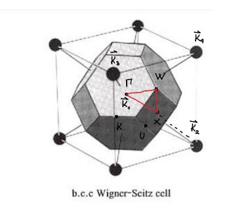
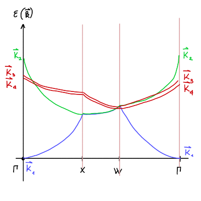

#+title: Vaje iz Fizike trdne snovi, 14. teden v letu
#+subtitle: 2026/03/30 in 2026/04/02
#+startup: nolatexpreview
#+startup: entitiespretty nil
#+startup: show2levels
#+latex_header: \usepackage{amsmath} \usepackage{unicode-math} \usepackage{cancel} \usepackage{graphicx}
#+latex_header: \renewcommand{\theta}{\vartheta} \renewcommand{\phi}{\varphi} \renewcommand{\epsilon}{\varepsilon}
#+latex_header: \newcommand{\odv}[1]{\dot{\vec{#1}}} \newcommand{\oddv}[1]{\ddot{\vec{#1}}}
#+latex_header: \newcommand{\rot}{\mathrm{rot}}\newcommand{\dive}{\mathrm{div}} \newcommand{\iu}{\mathrm{i}}
#+latex_header: \newcommand\mapsfrom{\mathrel{\reflectbox{\ensuremath{\mapsto}}}}
* Teorija: Približek šibkega potenciala (skoraj prostih elektronov)

Enačba

\begin{equation}
\label{eq:2}
 \left( \epsilon_{\mathbf{k} - \mathbf{K}}^0 - \epsilon \right) C_{\mathbf{k} - \mathbf{K}} + \sum\limits_{\mathbf{K}}^{} V_{\mathbf{K}' - \mathbf{K}} c_{\mathbf{k} - \mathbf{K}'} = 0
\end{equation}

je samo še ena oblika Schrödingerjeve enačbe. Količini \( \epsilon^0 (\mathbf{q}) = \frac{\hbar ^2 q ^2}{2m} \) je disperzija energije prostih elektronov. Na grafu \( \epsilon^0 (\mathbf{q}) \) je skupek parabol, ki imajo teme v vektorjih recipročne mreže \( K = \frac{2 \pi}{a} n \).
* Naloga: Razcep pasov

#+begin_problem
Zanima nas razcep pasov, ki se zgodi v točki \( x = \frac{\pi}{a} \), kjer se sekata paraboli vektorjev recipročne mreže \( \mathbf{K}_1 = 0\) in \( \mathbf{K}_2 = \frac{2 \pi}{a} \).
#+end_problem

Zapišemo lahko dve enačbi za osnovno in prvo vzbujeno stanje

\begin{align*}
  \left( \epsilon^0_{\mathbf{k} - \mathbf{K}_1} - \epsilon \right) c_{\mathbf{k} - \mathbf{K}_1} + \sum\limits_{\mathbf{K}' \in \left\{ \mathbf{K}_1, \mathbf{K}_2 \right\}}^{} V_{\mathbf{K}' - \mathbf{K}_1} c_{\mathbf{k} - \mathbf{K}'} &= 0 \\
  \left( \epsilon^0_{\mathbf{k} - \mathbf{K}_2} - \epsilon \right) c_{\mathbf{k} - \mathbf{K}_2} + \sum\limits_{\mathbf{K}' \in \left\{ \mathbf{K}_1, \mathbf{K}_2 \right\}}^{} V_{\mathbf{K}' - \mathbf{K}_2} c_{\mathbf{k} - \mathbf{K}'} &= 0.
\end{align*}

Označimo \( \mathbf{k} = \frac{\mathbf{K}_1 - \mathbf{K}_2}{2} \). Energiji \( \epsilon_{\mathbf{k} - \mathbf{K}_1}^0 \) in \( \epsilon_{\mathbf{k} - \mathbf{K}_2} \) sta enaki in ju bomo označili samo z \( \epsilon^0 \).

Sistem lahko zapišemo v matrični obliki za vektor \( \mathbf{c} = [c_{\mathbf{k} - \mathbf{K}_1} \ c_{\mathbf{k} - \mathbf{K}_2}]^T \)

\begin{equation}
\label{eq:3}
 \begin{bmatrix}
   \epsilon^0 - \epsilon + V_0 & V_{\mathbf{K}_2 - \mathbf{K}_1} \\
    V_{\mathbf{K}_1 - \mathbf{K}_2} &  \epsilon^0 - \epsilon + V_0
    \end{bmatrix} \begin{bmatrix} c_{\mathbf{k} - \mathbf{K}_{1}} \\ c_{\mathbf{k} - \mathbf{K}_{2}} \end{bmatrix} = 0.
\end{equation}

Matrični sistem nam predstavlja problem lastnih vrednosti

\[ \left( \epsilon^0 - \epsilon + V_0 \right) ^2 - V_{\mathbf{K}_2 - \mathbf{K}_1} V_{\mathbf{K}_1 - \mathbf{K}_2} = 0.
\]

Ob upoštevanju relacije \( V_{\mathbf{K}_1 - \mathbf{K}_2} = V^{\ast} _{\mathbf{K}_2 - \mathbf{K}_1} \) lahko zapišemo problem lastnih vrednosti kot

\[ \epsilon^0 - \epsilon + V_0 = \pm \left| V_{\mathbf{K}_2 - \mathbf{K}_1} \right| .
\]

Lastni vrednosti energije sta torej degenerirani

\[ \epsilon_{\pm} = \epsilon^0 + V_0 \mp \left| V_{\mathbf{K}_2 - \mathbf{K}_1} \right|.
\]

Njuna razlika je

\[ \Delta \epsilon = \epsilon_+ - \epsilon_- = 2 \left| V_{\mathbf{K}_2 - \mathbf{K}_1} \right|.
\]

Izračunajmo še Fourierov razvoj potenciala

\begin{align*}
  V_K &= \frac{1}{a} \int\limits_{0_-}^{0_+} V(x) e^{- \mathrm{i} K x} \, \mathrm{d} x \\
&= \frac{1}{a} \int\limits_{0_-}^{0_+} \lambda \delta(x) e^{-\mathrm{i} K x} \, \mathrm{d} x \\
&= \frac{1}{a} \lambda e^{- \mathrm{i} K 0} = \frac{\lambda}{a}
\end{align*}

Energijska reža v prvem približku je potem \( \Delta \epsilon = 2 \left| V_{\mathbf{K}_2 - \mathbf{K}_1} \right| = \frac{2 \lambda}{a} \). Dobili smo enako rešitev kakor prejšnji teden.

Želimo zapisati še lastni valovni funkciji z izračunanima energijama

\[ \psi_{\pm} = \sum\limits_{\mathbf{K} \in \left\{ \mathbf{K}_1, \mathbf{K}_2 \right\} }^{} c^{\pm}_{k - K} e^{\mathrm{i} (k - K) x}.
\]

Za \( K_1 = 0 \), \( K_2 = \frac{2 \pi}{a} \) in \( k = \frac{\pi}{a} \) je valovna funkcija linearna kombinacija nasproti potujočih ravnih valov

\[ \psi_{\pm} = c_{k - K_1}^{\pm} e^{\mathrm{i} \left( \frac{\pi}{a} - 0 \right)} + c^{\pm}_{k - K_2} e^{\mathrm{i} \left( \frac{\pi}{a} - \frac{2 \pi}{a} \right) x} =  c^{\pm} e^{\mathrm{i} \frac{\pi}{a} x} + c_{k - K_2}^{\pm} e^{- \mathrm{i} \frac{\pi}{a} x}.
\]

Za periodičen potencial ima zgornja matrična enačba obliko

\[ \left[ \mp \left| V_{K_2 - K_1} \right| \ V_{K_2 - K_1} \right] \begin{bmatrix} c^{\pm}_{k - K_{1}} \\ c^{\pm}_{k - K_{2}} \end{bmatrix} = [ \mp \frac{2 \lambda}{a} \ \frac{2 \lambda}{a} ] \begin{bmatrix} c^{\pm}_{k - K_1} \\ c^{\pm}_{k - K_2} \end{bmatrix} = 0.
\]

Lastna vektorja te enačbe sta \( \epsilon_+ = [1 1]^T \) in \( \epsilon_- = [1 -1]^T \). V matrični enačbi smo upoštevali rezultata Kronig-Penneyjevega modela.

Lastni valovni funkciji v periodičnem potencialu sta potem

\begin{align*}
  \psi_+ &\propto \cos \left( \frac{\pi}{a} x \right) \\
\psi_- &\propto \sin \left( \frac{\pi}{a} x \right)
\end{align*}

Lastni energiji zasedata vrednosti \( \epsilon_+ = \epsilon^0 + \frac{2 \lambda}{a} \) in \( \epsilon_- = \epsilon^0 \). Sinusna funkcija ima vozle na točkah, kjer je \( \delta \) funkcija in je posledično ne čuti. Kosinus jo pa čuti in ima temu primerno zvišano lastno energijo.
* Naloga: Energijska reža v FCC kristalu 

#+begin_problem
Imamo ploskovno centrirano kubično mrežo (fcc), ki ima periodičen potencial usklajen s fcc mrežo. Zanima nas energijska reža v prvi Brillouinovi coni.
#+end_problem

Iz prejšnjih vaj vemo, da ima FCC mreža BCC recipročno mrežo s stranico \( \frac{4 \pi}{a} \). Kakor vemo iz predavanj (ali pa iz Ashcroft & Mermina), Wigner-Seitzova celica recipročne mreže je prva Brillouinova cona. Iz prejšnjih vaj torej vemo, da je ima prva Brillouinova cona obliko prisekanega oktaedra.

Po dogovoru, označimo središče oktaedra z \( \Gamma \). Središča kvadratov na površini označimo z \( X \), središča šestkotnikov z \( L \), oglišča z \( W \), razpolovišča stranic kvadratov z \( U \) in razpolovišča stranic šestkotnikov s \( K \).

Glede na skico so koordinate točk

\[ \Gamma = (0, 0, 0), \quad X = \frac{4 \pi}{a} \left( \frac{1}{2}, 0, 0 \right) \quad \text{in} \quad W = \frac{4 \pi}{a} \left( \frac{1}{2}, \frac{1}{4}, 0  \right),
\]

kjer je ravnina \( xy \) tista, ki vsebuje točke \( \Gamma, W, X \).

Predpostavimo, da nimamo potenciala, torej \( V(\mathbf{r}) = 0 \). Prost elektron bo imel energijsko disperzijo enako tisti v uvodu, torej

\[ \epsilon^0 (\mathbf{q}) = \frac{\hbar ^2 q ^2}{2m}. 
\]

V našem primeru treh dimenzij bo disperzija tvorila štiridimenzionalni paraboloid. Zapišemo jo lahko z recipročnim vektorjem, če upoštevamo relacijo \( \mathbf{q} = \mathbf{k} - \mathbf{K}  \)

\[ \epsilon(\mathbf{k}) = \frac{\hbar ^2 \left( \mathbf{k} - \mathbf{K} \right) ^2}{2m}. 
\]

Vsak recipročni vektor \( \mathbf{K} \) je teme svojega paraboloida kakor smo jih imeli pri prejšnji nalogi. Zamislimo si sedaj zaključeno pot \( \Gamma \to X \to W \to \Gamma \) in narišimo graf \( \epsilon (\mathbf{k}) \).

Za točko \( \mathbf{K}_1 \), ki je ista točka kot \( \Gamma \), lahko predpostavimo ničelno energijo. 

Zamislimo si zaključeno pot \( \Gamma \to X \to W \to \Gamma \). V točki \( K_1 \) glede na \( \Gamma \) je energija ničelna. Razdalja od \( \Gamma \) do \( K_2 = \frac{4 \pi}{a} (1, 0, 0) \) je največja, torej bo energija tudi največja. Izračunamo jo po enačbi

\[ \epsilon_{\mathbf{K}_2} (\Gamma) = \frac{\hbar ^2}{2m} \left( \Gamma - \mathbf{K}_2 \right) = 16 \frac{\hbar ^2 \pi ^2}{2m a ^2} 
\]

Točki \( K_3 = \frac{4 \pi}{a} \left( \frac{1}{2}, \frac{1}{2}, - \frac{1}{2} \right) \) in \( K_4 = \frac{4 \pi}{a} \left( \frac{1}{2}, \frac{1}{2}, \frac{1}{2} \right) \) sta enako oddaljeni od \( \Gamma \) in sicer \( \frac{4 \pi}{a} \sqrt{3} \). Njuna energija je potem

\[ \epsilon_{\mathbf{K}_{3, 4}}(\Gamma) = 12 \frac{\hbar ^2 \pi ^2}{2 m a ^2}.
\]

Na podoben način izračunamo še energije za preostali točki \( X \) in \( W \). Prva je od \( \mathbf{K}_1 \) in \( \mathbf{K}_2 \) enako oddaljena za \( \frac{2 \pi}{a} \) in njuna energija bo degenerirana z vrednostjo

\[ \epsilon_{\mathbf{K}_{1, 2}} (X) = 4 \frac{\hbar ^2 \pi ^2}{ 2m a ^2},
\]

druga pa je oddaljena za \( \frac{\sqrt{5} \pi}{a} \) in energija bo

\begin{equation}
\label{eq:1}
\epsilon_{\mathbf{K}_{1, 2}} (W) = 5 \frac{\hbar ^2 \pi ^2}{2 m a ^2}.
\end{equation}

Točka \( X \) je od \( K_{3, 4} \) oddaljena za \( \frac{\sqrt{8} \pi}{a} \) in njuna energija bo

\[ \epsilon_{\mathbf{K}_{3, 4} }(X) = 8 \frac{\hbar ^2 \pi ^2}{2m a ^2}.
\]

Razdalja do \( W \) je ekvidistančna do vseh točk \( K_i, i = 1, 2, 3, 4 \), kar pomeni, da bo energija povsod enaka \eqref{eq:1}. Točka \( W \) je torej štirikratno degenerirana.

Po enačbi \eqref{eq:2} imamo torej problem lastnih vrednosti velikosti \( 4 \times 4 \) podobno kot smo imeli pri \eqref{eq:3} dvodimenzionalni problem. Izračunati želimo torej determinanto

\[ \det \begin{bmatrix}
        \epsilon^{0} - \underline{\epsilon} & V_{\mathbf{K}_2 - \mathbf{K}_1} & V_{\mathbf{K}_3 - \mathbf{K}_1} & V_{\mathbf{K}_4 - \mathbf{K}_1} \\
         V_{\mathbf{K}_1 - \mathbf{K}_2}& \epsilon^0 - \underline{\epsilon} & V_{\mathbf{K}_3 - \mathbf{K}_2} & V_{\mathbf{K}_4 - \mathbf{K}_2} \\
         V_{\mathbf{K}_1 - \mathbf{K}_3} & V_{\mathbf{K}_2 - \mathbf{K}_3} & \epsilon^0 - \underline{\epsilon} & V_{\mathbf{K}_4 - \mathbf{K}_2} \\
         V_{\mathbf{K}_1 - \mathbf{K}_4} & V_{\mathbf{K}_2 - \mathbf{K}_4} & \mathbf{V}_{\mathbf{K}_3 - \mathbf{K}_4} & \epsilon^0 - \underline{\epsilon}
        \end{bmatrix}.
\]

Surovo računanje takega lastnega problema je precej boleče, zato ga bomo oklestili s pomočjo simetrije FCC mreže. Simetrijska operacija \( A \in \mathcal{G} \), kjer je \( \mathcal{G} \) simetrijska grupa, na recipročni mreži bo podala nazaj samo vase. Za potencial potem velja

\[ V (\mathbf{R} \mathbf{r}) = V(\mathbf{r}). 
\]

Brez izgube splošnosti si lahko izberemo potencial \( U_0 = U_{\mathbf{K}_i - \mathbf{K}_i} = 0 \). Fourierove komponente zgornje matrike so

\[ U_{\mathbf{K}} = \frac{1}{V_0} \int\limits_{V_0}^{} V(\mathbf{r}) e^{- \mathrm{i} \mathbf{K} \cdot \mathbf{r}} \, \mathrm{d} ^3 \mathbf{r},
\]

kjer je \( V_0 \) volumen osnovne celice.

Za realen potencial \( V(\mathbf{r}) \), za katerega velja \( U = U^{\ast} \), bo Fourierova komponenta

\begin{equation}
\label{eq:4}
V_{\mathbf{K}} = \left( V_{\mathbf{K}}^{\ast} \right)^{\ast} = \left( \frac{1}{V_0} \int\limits_{V_0}^{} V(\mathbf{r}) e^{\mathrm{i} \mathbf{K} \cdot \mathbf{r}} \, \mathrm{d} ^3\mathbf{r} \right)^{\ast} = U^{\ast}_{- \mathbf{K}}.
\end{equation}

Potencial \( V(\mathbf{r}) \) je neodvisen na inverzijo prostora \( \mathbf{r} \to - \mathbf{r} \), dobimo iz enačbe \eqref{eq:4} identiteto

\begin{equation}
\label{eq:5}
V_{\mathbf{K}} = \frac{1}{V_0} \int\limits_{V_0}^{} V(- \mathbf{r}) e^{- \mathrm{i} \mathbf{K} \cdot \left( - \mathbf{r} \right)} \, \mathrm{d} ^3\mathbf{r}  = \frac{1}{V_0} \int\limits_{V_0}^{} V(\mathbf{r}) e^{\mathrm{i} \mathbf{K} \cdot \mathbf{r}} \, \mathrm{d} ^3 \mathbf{r} = V_{- \mathbf{K}}
\end{equation}

Iz tega zaključimo, da sta \( V_{\mathbf{K}} = V_{-\mathbf{K}}  \) in realna. \( 4 \times 4 \) sistem smo poenostavili na zgolj 6 komponent, v našem primeru se osredotočimo na zgornje trikoten del matrike.

Zasuk vektorja \( \mathbf{K} \) recipročne mreže ga preslika nazaj v vektor recipročne mreže \( A \mathbf{K} = \mathbf{K} \). Po definiciji grupe ima zasuk \( A \) inverz \( A^{-1} \), za katerega velja \( I = A A^{-1} \). Fourierova komponenta zasukanega vektorja je

\begin{align*}
  V_{A\mathbf{K}} &= \frac{1}{V_0} \int\limits_{V_0}^{} V(\mathbf{r}) e^{- \mathrm{i} A \mathbf{K} \cdot \mathbf{r}} \, \mathrm{d} ^3 \mathbf{r} \\
&= \frac{1}{V_0} \int\limits_{V_0}^{} V(\mathbf{r}) e^{- \mathrm{i} A \mathbf{K} \cdot A A^{-1} \mathbf{r} } \, \mathrm{d} ^3 \mathbf{r}
\end{align*}

Rotacija ohranja skalarni produkt, kar pomeni, da velja \( (A \mathbf{a}) \cdot (A \mathbf{b}) = \mathbf{a} \cdot \mathbf{b} \). V našem primeru velja

\[ \left[ A \mathbf{K} \right] \cdot \left[ A \left(A^{-1} \mathbf{r}\right) \right] = \mathbf{K} \cdot \left( A^{-1} \mathbf{r} \right).
\]

Fourierova komponenta je

\[ V_{A\mathbf{K}} = \frac{1}{V_0} \int\limits_{V_0}^{} V(\mathbf{r}) e^{- \mathrm{i} \mathbf{K} \cdot A^{-1} \mathbf{r}} \, \mathrm{d} ^3 \mathbf{r}.
\]

Uvedemo novo spremenljivko \( \mathbf{r} = A \mathbf{u} \)

\begin{align*}
  V_{A\mathbf{K}} &= \frac{1}{V_0} \int\limits_{V_0}^{} V(\mathbf{r}) e^{- \mathrm{i} \mathbf{K} \cdot A^{-1} \mathbf{r}} \, \mathrm{d} ^3 \mathbf{r} \\
&= \frac{1}{V_0} \int\limits_{V_0}^{} V (A\mathbf{u}) e^{- \mathrm{i} \mathbf{K} \mathbf{u}} \left| \det A \right| \, \mathrm{d} ^3 \mathbf{r} \\
&= \frac{1}{V_0} \int\limits_{V_0}^{} V(\mathbf{u}) = V_{\mathbf{K}},
\end{align*}

kjer smo upoštevali, da je \( \left| \det A \right| = 1 \) za rotacijsko matriko. Sedaj lahko poiščemo, katere simetrijske operacije na določeni Fourierovi komponenti kot rezultat podajo drugi Fourierovo komponento.

Bralcu priporočam pomoč pri vizualizaciji s prvo zgornjo sliko. Zasuk za \( \frac{\pi}{2} \) okoli osi \( k_y \) preslika \( V_{\mathbf{K}_2 - \mathbf{K}_1} \) v \( V_{\mathbf{K}_4 - \mathbf{K}_3} \). Označimo

\[ V_{\mathbf{K}_2 - \mathbf{K}_1} = V_{\mathbf{K}_4 - \mathbf{K}_3} = V_1 \in \mathbf{R}.
\]

Zrcaljenje preko ravnin pravokotnih na \( k_x, k_y \) in \( k_z \) preslika \( V_{\mathbf{K}_3 - \mathbf{K}_1}, V_{\mathbf{K}_4 - \mathbf{K}_1}, V_{\mathbf{K}_3 - \mathbf{K}_2} \) in \( V_{\mathbf{K}_4 - \mathbf{K}_2} \) medseboj. Označimo

\[  V_{\mathbf{K}_3 - \mathbf{K}_1}= V_{\mathbf{K}_4 - \mathbf{K}_1}= V_{\mathbf{K}_3 - \mathbf{K}_2} = V_{\mathbf{K}_4 - \mathbf{K}_2} = V_2 \in \mathbf{R}.
\]

Zgornji sistem smo poenostavili na dve komponenti \( V_1 \) in \( V_2 \):

\[ \begin{bmatrix}
   \epsilon^{0} - \epsilon & V_1 & V_2 & V_2 \\
    V_1 & \epsilon^0 - \epsilon & V_2 & V_2 \\
    V_2 & V_2 & \epsilon^0 - \epsilon & V_1 \\
    V_2 & V_2 &  V_1 & \epsilon^0 - \epsilon
   \end{bmatrix} \begin{bmatrix} c_{\mathbf{W} - \mathbf{K}_1} \\ c_{\mathbf{W} - \mathbf{K}_2} \\ c_{\mathbf{W} - \mathbf{K}_3} \\ c_{\mathbf{W} - \mathbf{K}_4} \end{bmatrix} = 0
\]
