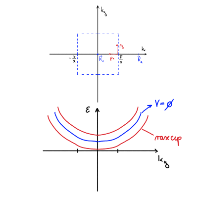
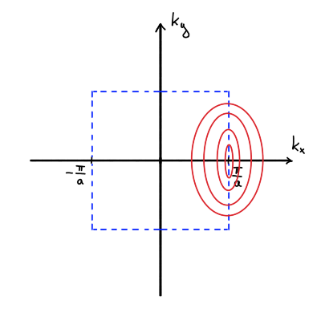
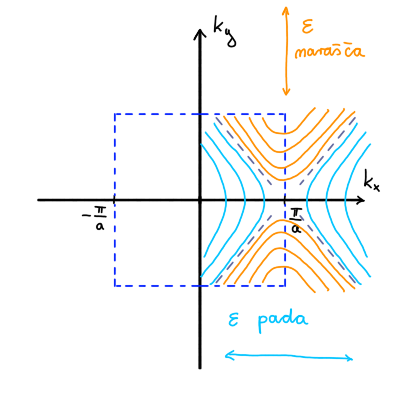
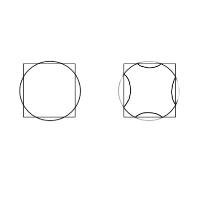
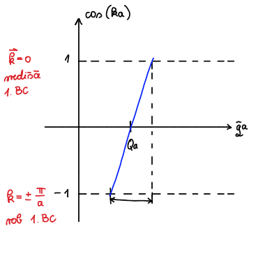

#+title: Vaje iz Fizike trdne snovi, 16. teden v letu
#+subtitle: 2026/04/13
#+startup: nolatexpreview
#+startup: entitiespretty nil
#+startup: show2levels
#+latex_header: \usepackage{amsmath} \usepackage{unicode-math} \usepackage{cancel} \usepackage{graphicx}
#+latex_header: \renewcommand{\theta}{\vartheta} \renewcommand{\phi}{\varphi} \renewcommand{\epsilon}{\varepsilon}
#+latex_header: \newcommand{\odv}[1]{\dot{\vec{#1}}} \newcommand{\oddv}[1]{\ddot{\vec{#1}}}
#+latex_header: \newcommand{\rot}{\mathrm{rot}}\newcommand{\dive}{\mathrm{div}} \newcommand{\iu}{\mathrm{i}}
#+latex_header: \newcommand\mapsfrom{\mathrel{\reflectbox{\ensuremath{\mapsto}}}}
* Nadaljevanje naloge: Energijska reža v FCC kristalu

Na zadnjih vajah smo ostali pri reševanju poenostavljenega \( 4\times 4 \) sistema

\[ \begin{bmatrix}
   \epsilon^{0} - \epsilon & V_1 & V_2 & V_2 \\
    V_1 & \epsilon^0 - \epsilon & V_2 & V_2 \\
    V_2 & V_2 & \epsilon^0 - \epsilon & V_1 \\
    V_2 & V_2 &  V_1 & \epsilon^0 - \epsilon
   \end{bmatrix} \begin{bmatrix} c_{\mathbf{W} - \mathbf{K}_1} \\ c_{\mathbf{W} - \mathbf{K}_2} \\ c_{\mathbf{W} - \mathbf{K}_3} \\ c_{\mathbf{W} - \mathbf{K}_4} \end{bmatrix} = 0.
\]

Problem lastnih vrednosti dodatno poenostavimo z elementarnimi vrstičnimi operacijami v

\[ M = \begin{bmatrix}
       \epsilon^{0} - \epsilon - V_{1} & 0 & 0 & 0 \\
       V_{1} & \epsilon^{0} - \epsilon + V_{1} & 2 V_{2} & V_{2} \\
       V_{2} & 2V_{2} & \epsilon^{0} - \epsilon + V_{1} & V_{1} \\
       0 & 0 & 0 & \epsilon^{0} - \epsilon - V_1
       \end{bmatrix}.
\]

(Trivialno) razvijemo matriko po vrsticah - najprej prvi, potem pa četrti - in nam preostane karakteristični polinom

\[ \det M = \left( \epsilon^0 - \epsilon - V_1 \right) \left[ \left( \epsilon^0 - E - V_1 \right) \cdot \left[ \left( \epsilon^0 - \epsilon + V_1 \right) ^2 - \left( 2 U_2 \right) ^2 \right]  \right].
\]

Lastne vrednosti nam poda enačba \( \det M = 0 \) in so

\begin{align*}
  \epsilon_{1, 2} &= \epsilon^0 - V_1 \\
\epsilon_3 &= \epsilon^0 + V_1 - 2 V_2 \\
\epsilon_4 &= \epsilon^0 + V_1 + 2 V_2
\end{align*}

** Disperzija v bližini točke razcepa

Vrnimo se nazaj k nalogi prejšnjega tedna o razcepu pasov v dveh dimenzijah. Energija prostega elektrona je parabola

\[ \epsilon^0 (\mathbf{q}) = \frac{\hbar ^2 q ^2}{2m}. 
\]

Razcep pasov se zgodi v točki \( x = \frac{\pi}{a} \) in točko v bližini razcepa označimo s \( \mathbf{k} = \left( \frac{\pi}{a} - p_x, p_y \right) \), kjer je \( p_x \ll \frac{\pi}{a} \). Problem lastnih vrednosti je, podobno kot prejšnji teden

\[  \det \begin{bmatrix}
         \epsilon^0 \left( \mathbf{k} - \mathbf{K}_1 \right) - \epsilon & V \\
          V^{\ast} & \epsilon^0 \left( \mathbf{k} - \mathbf{K}_2 \right) - \epsilon
          \end{bmatrix} = 0.
\]

Označimo \( \epsilon^0 \left( \mathbf{k} - \mathbf{K}_i \right) = \epsilon_i, \ i = 1, 2 \).

Lastni vrednosti matrike sta

\begin{equation}
\label{eq:1}
 \epsilon_{\pm} = \frac{\epsilon_1 + \epsilon_2}{2} \pm \frac{1}{2} \sqrt{\left( \epsilon_1 - \epsilon_2 \right) ^2 + 4 \left| V \right| ^2},
\end{equation}
kjer je \( \left| V \right| = V_{\mathbf{K}_2 - \mathbf{K}_1} V^{\ast}_{\mathbf{K}_2 - \mathbf{K}_1}\). Po definiciji velja

\begin{align*}
  \epsilon_1 &= \epsilon^0 \left( \mathbf{k} - \mathbf{K}_1 \right) = \frac{\hbar ^2}{2m} \left[ \left( \frac{\pi}{a} - p_x \right) ^2 + k_y ^2 \right] \\
\epsilon_2 &= \epsilon^0 \left( \mathbf{k} - \mathbf{K}_2 \right) = \frac{\hbar ^2}{2m} \left[ \left( \frac{\pi}{a} + p_y \right) ^2 + k_y ^2 \right],
\end{align*}
s čimer lahko izrazimo

\[ \frac{\epsilon_1 - \epsilon_2}{2} = \frac{\hbar ^2}{2m} \frac{\pi}{a} p_x \quad \text{ in } \quad \frac{\epsilon_1 + \epsilon_2}{2} = \frac{\hbar ^2}{2m} \left( p_x + \left( \frac{\pi}{a} \right)^2 + p_y ^2 \right).
\]

Dobljeni vrednosti vstavimo v enačbo \eqref{eq:1}, kjer koren razvijemo po Taylorju za šibek potencial \( \left| V \right|  \ll \frac{\hbar ^2}{2m} \frac{\pi}{a} \)

\begin{align*}
\epsilon_{\pm} &= \frac{\hbar ^2}{2m} \left[ p_x ^2 + \left( \frac{\pi}{a} \right) ^2 + p_y ^2 \right] \pm \sqrt{\left( \frac{\hbar ^2}{2m} \frac{\pi}{a} p_x \right) ^2 + \left| V \right| ^2}  \\
&= \frac{\hbar ^2}{2m} \left[ \left( \frac{\pi}{a} \right) ^2 + p_y ^2 + p_x ^2 \right] \pm \left| V \right| \left[ 1 + \frac{1}{2} \frac{\left( \frac{\hbar ^2}{2m} \frac{\pi}{a} p_x \right) ^2}{\left| V \right| ^2} + \ldots \right] \\
&= \frac{\hbar ^2}{2m} \left[ \left( \frac{\pi}{a} \right) ^2 + p_y ^2 \right] \pm \left| V \right| + \frac{\hbar ^2}{2m} p_x ^2 \left[ 1 \pm \frac{\frac{\hbar ^2}{2m} \left( \frac{\pi}{a} \right) ^2}{\left| V \right|} \right].
\end{align*}

Prva dva člena predstavljata disperzijo vzdolž roba 1. Brillouinove cone, medtem ko je zadnji člen popravek, če se premaknemo stran od roba. V zadnjem členu lahko zanemarimo \( 1 \), saj bo zaradi šibkega potenciala prevladoval ulomek s potencialom. Energijska stanja lahko še nekoliko preuredimo

\[ \epsilon_{\pm} = \frac{\hbar ^2}{2m} \left( \frac{\pi}{a} \right) ^2 \pm \left| V \right| + \frac{\hbar ^2}{2m} \left( p_y ^2 \pm \frac{1}{2} \frac{\frac{\hbar ^2}{2m} \left( \frac{\pi}{a} \right) ^2}{\left| V \right|} p_x ^2 \right)
\]

Ob robu se pasova razcepita, kakor se vidi na zgornji sliki. Drugi oklepaj v ravnokar izpeljani enačbi pa nam pove še nekaj dodatnih informacij:

- zgornji pas (s predznakom \( + \)) ima na robu minimum

  \[ \epsilon_+ = \frac{\hbar ^2}{2m} \left( \frac{\pi}{a} \right) ^2 + \left| V \right| + \frac{\hbar ^2}{2m} \left( p_y ^2 + \frac{1}{2} \frac{\frac{\hbar ^2}{2m} \left( \frac{\pi}{a} \right) ^2}{\left| V \right|} p_x ^2 \right),
  \]
  izohipse pa imajo obliko elips.

  

- spodnji pas (s predznakom \( - \)) ima na robu sedlo

  \[ \epsilon_- = \frac{\hbar ^2}{2m} \left( \frac{\pi}{a} \right) ^2 - \left| V \right| + \frac{\hbar ^2}{2m} \left( p_y ^2 - \frac{1}{2} \frac{\frac{\hbar ^2}{2m} \left( \frac{\pi}{a} \right) ^2}{\left| V \right|} p_x ^2 \right),
  \]
  izohipse pa imajo obliko hiperbol.

  
  
  
Sedaj uvedemo tenzor efektivne mase. Energijo prostega elektrona lahko prepišemo v

\[ \epsilon(\mathbf{q}) = \frac{\hbar ^2}{2m_e} \mathbf{q} ^2 = \frac{\hbar ^2}{2} \mathbf{q} \cdot \underline{m}^{-1} \mathbf{q},
\]
kjer je \( \underline{m}^{-1} = \frac{1}{m_e} I \) in je \( I \) identiteta. Energije pasov zapišemo s tenzorjem efektivne mase \( \underline{m}^{\ast} \)

\[ \epsilon_{\pm} = \frac{\hbar ^2}{2} \mathbf{p} \cdot {m^{\ast}}^{-1} \mathbf{p} + C,
\]
kjer je \( C \) konstanta. Ločimo tenzor efektivne mase za zgornji pas (levo) in za spodnji pas (desno)

\[ {\underline{m}^{\ast}}^{-1}_+ = \begin{bmatrix}
                                   \frac{\frac{\hbar ^2}{2m} \left( \frac{\pi}{a} \right) ^2}{m \left| V \right|} & 0 \\
                                    0 & \frac{1}{m}
                                    \end{bmatrix} \quad \text{ in } \quad  {\underline{m}^{\ast}}^{-1}_- = \begin{bmatrix}
                                   -\frac{\frac{\hbar ^2}{2m} \left( \frac{\pi}{a} \right) ^2}{m \left| V \right|} & 0 \\
                                    0 & \frac{1}{m}
                                    \end{bmatrix}.
\]

Ob odsotnosti potenciala ločimo dva primera:

- Fermijeva površina je popolnoma znotraj Brillouinove cone ali

- Fermijeva površina je ponekod zunaj cone. V tem primeru se deli, ki gledajo zunaj cone, pravokotno preslikajo navznoter čez rob.

  
* Naloga: Kronig-Penneyjev model s približkom tesne vezi 
** Teorija: Približek tesne vezi (ang. /tight-binding model/)

Približek tesne vezi je še en od načinov, kako opišemo elektrone v kristalu. Spoznali smo že približek šibkega potenciala, v katerem predpostavimo, proste elektroni s pripadajočimi lastnimi valovnimi funkcijami, ki jih perturbiramo s šibkim periodičnim potencialom. V približku tesne vezi predpostavimo, da elektron ni prost in je njegova valovna funkcija funkcija elektrona v izoliranem atomu.

V približku šibkega potenciala za Kronig-Penneyjev model smo uporabili periodičen \( \delta \) potencial s pozitivnimi utežmi \( \lambda \). V približku tesne vezi ima periodičen potencial negativne vrednosti uteži \( \lambda \).

** Reševanje naloge

Iz kvantne mehanike vemo, da ima potencial oblike

\[ U(x) = - \lambda \delta(x), 
\]
samo eno vezano stanje z energijo

\[ \epsilon_{at} = - \frac{m \lambda ^2}{2 \hbar ^2}, 
\]
s pripadajočo valovno funkcijo

\[ \psi_{at} (x) = \sqrt{Q} e^{- \kappa_0 \left| x \right|}, \ Q = \frac{m \lambda}{\hbar ^2}. 
\]

Za večjo vrednost \( Q \) bodo repi valovne funkcije \( \psi(x) \) padali hitreje. 

Periodičen potencial s konstanto \( a \) za približek tesne vezi ima obliko

\[ U(x) = \sum\limits_n^{} - \lambda \delta(x - na). 
\]

Repa dveh sosednjih valovnih funkcij se bosta prekrivala za dovolj majhno vrednost \( \lambda \). V približku temne vezi je predpostavljeno, kot povedano v uvodu, da se repi vezanih stanj skoraj ne prekrivajo. Posledično nastane energijska reža, ki je centrirana okoli \( \epsilon_{at} \).

Iz predhodnih vaj (13. teden) vemo, da je enačba, ki nam jo podaja Kronig-Penneyjev model

\begin{equation}
\label{eq:2}
 \cos (ka) = \cos (qa) + Q a \frac{\sin (qa)}{qa} 
\end{equation}

kjer je \( k \) Blochov valovni vektor znotraj prve Brillouinove cone \( k \in \left[ - \frac{\pi}{a}, \frac{\pi}{a} \right] \) in

\[ q = \sqrt{\frac{2 m \epsilon}{\hbar ^2}}, 
\]
valovni vektor prostega elektrona z energijo \( \epsilon \).

Zaradi periodičnega potenciala, ki ima obratno predznačen \( \delta \) potencial od približka skoraj prostih elektronov, definiramo \( \tilde{\lambda} = - \lambda \) in nadalje

\[ \tilde{Q} = \frac{m \tilde{\lambda}}{\hbar ^2}. 
\]

Energija \( \epsilon_{at} \) je negativna, saj ustreza vezanemu stanju, kar pomeni, da je valovni vektor prostega elektrona imaginaren

\[ q = \mathrm{i} \tilde{q}.
\]

Posodobljena enačba Kronig-Penneyjevega modela \eqref{eq:2} je

\[ \cos (ka) = \cos \left( \mathrm{i} \tilde{q} a \right) - \frac{\tilde{Q} a}{\mathrm{i} \tilde{q} a}  \sin \left( \mathrm{i} \tilde{q} a \right).
\]

Iz Mat4 vemo, da lahko kompleksne trigonometrične funkcije izrazimo s hiperboličnimi funkcijami, zato upoštevamo \( \cos (\mathrm{i} x) = \mathrm{ch} (x) \) in \( \sin(\mathrm{i} x) = \mathrm{i} \mathrm{sh} (x) \) in zapišemo 

\begin{equation}
\label{eq:3}
 \cos (ka) = \mathrm{ch} \left( \tilde{q} a \right) - \frac{\tilde{Q} a}{\tilde{q} a} \mathrm{sh} (\tilde{q} a) 
\end{equation}

Grafično reševanje enačbe je vidno na zgornji sliki. V skladu s približkom tesne vezi rešujemo enačbo v limiti \( \tilde{Q} a \gg 1 \), ki pomeni, da imajo valovne funkcije majhen rep in se skoraj ne prekrivajo. Limita tudi pomeni veliko utež \( \tilde{\lambda} \), ki pomeni močen potencial in tesno vezane elektrone. 

Za \( x \gg 1 \) velja \( \cosh (x) \approx \sinh (x) \) in zato pričakujemo, da bo rešitev (in posledično dovoljeno stanje) \( \tilde{q} a \approx \tilde{Q} a \). Za \( \tilde{Q} a \gg 1 \) je \( \cosh (\tilde{Q} a) \approx \sinh(\tilde{Q} a) \) in

\[ \cosh (\tilde{Q} a) - \frac{\tilde{Q} a}{\tilde{Q}a} \sinh (\tilde{Q} a) = \cosh (\tilde{Q} a) - \sinh(\tilde{Q}a) \approx 0. 
\]

Uporabimo nastavek za valovni vektor elektrona

\begin{equation}
\label{eq:4}
 \tilde{q} a = \tilde{Q} a + x, \quad x \ll \tilde{Q} a, 
\end{equation}
in ga vstavimo v enačbo \eqref{eq:3}

\[ \cos (ka) = \cosh (\tilde{Q} a + x) - \frac{\tilde{Q} a}{\tilde{Q} a + x} \sinh (\tilde{Q} a + x).
\]

Uporabimo identiteti

\[ \cosh (x + \mathrm{d} x) \approx \sin (x + \mathrm{d} x) \approx \frac{1}{2} e^x, \quad x \gg 1 \quad \text{ in } \quad  \mathrm{d} x \ll 1,
\]
da enačbo zapišemo v

\begin{align*}
  \cos (ka) &\approx \frac{e^{\tilde{Q} a + x}}{2} \left( 1 - \frac{1}{1 + \frac{x}{\tilde{Q} a}} \right) \\
&\approx \frac{e^{\tilde{Q} a + x}}{2} \frac{x}{\tilde{Q} a},
\end{align*}
kjer smo upoštevali še Taylorjev razvoj \( \frac{1}{1 + x} \approx 1 - x \) za \( x \ll 1 \). Upoštevamo še identiteto

\[ e^x x \approx \left( 1 + x + \frac{x ^2}{2} + \ldots \right) \cdot x = x + x ^2 + \frac{x ^3}{2} + \ldots \approx x,  
\]
kjer zanemarimo vse rede večje od 1, saj \( x \ll 1 \).

Zapišemo torej

\[ \cos (ka) \approx \frac{e^{\tilde{Q} a}}{2} \frac{e^x  x}{\tilde{Q} a} \implies 2 \tilde{Q} a e^{- \tilde{Q} a} \cos (ka).
\]

Nastavek za valovni vektor elektrona je potem

\[ \tilde{q} a = \tilde{Q} a + x = \tilde{Q} a \left( 1 + 2 e^{- \tilde{Q} a} \cos (ka) \right). 
\]

Če nastavek vstavimo v energijo za prost elektron, dobimo

\[ \epsilon = - \frac{\hbar ^2}{2m} \tilde{Q}  ^2 \left( 1 + 2 e^{- \tilde{Q} a} \cos (ka) \right) ^2.  
\]

Razpišemo kvadrat vsote

\[ \epsilon = - \frac{\hbar ^2}{2m} \tilde{Q} ^2 \left( 1 + 4 e^{- \tilde{Q} a} \cos (ka) + \cancel{e^{-2 \tilde{Q} a} \cos ^2 (ka)} \right), 
\]
in zanemarimo 2. red. Preostane nam torej

\begin{align*}
  \epsilon &= - \frac{\hbar ^2}{2m} \tilde{Q} \left( 1 + 4 e^{- \tilde{Q} a} \cos (ka) \right) \\
&= - \frac{\hbar ^2}{2m} \tilde{Q} ^2 - 4 \frac{\hbar ^2}{2m} \tilde{Q} ^2 e^{- \tilde{Q} a} \cos (ka) \\
&= E_0 - 2 \gamma \cos (ka),
\end{align*}
kjer smo definirali

\begin{align*}
  E_0 &= - \frac{\hbar ^2}{2m} \tilde{Q} ^2 \\
\gamma &= \frac{\hbar ^2}{m} \frac{\tilde{Q}  ^2}{e^{\tilde{Q} a}}.
\end{align*}

Prvi člen, \( E_0 \), v enačbi je energija vezanega stanja \( \delta \) funkcije, preostanek pa je popravek, ki odpravi degeneracijo zaradi prekrivanja valovnih repov. Degeneracija je odpravljena z nastankom energijske reže s širino \( 4 \gamma \)

