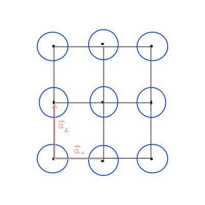
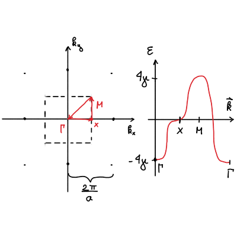
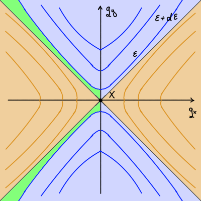
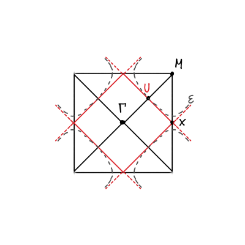
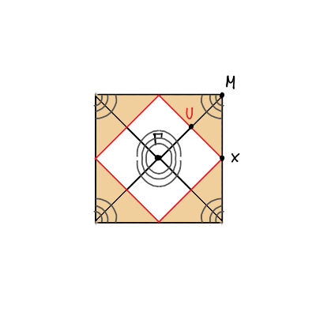
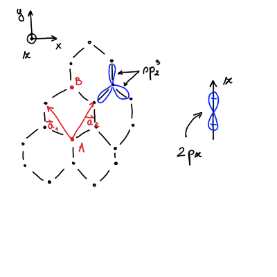

#+title: Vaje iz Fizike trdne snovi, 17. in 19. teden v letu
#+subtitle: 2026/04/20 in 2026/05/04
#+startup: nolatexpreview
#+startup: entitiespretty nil
#+startup: show2levels
#+latex_header: \usepackage{amsmath} \usepackage{unicode-math} \usepackage{cancel} \usepackage{graphicx}
#+latex_header: \renewcommand{\theta}{\vartheta} \renewcommand{\phi}{\varphi} \renewcommand{\epsilon}{\varepsilon}
#+latex_header: \newcommand{\odv}[1]{\dot{\vec{#1}}} \newcommand{\oddv}[1]{\ddot{\vec{#1}}}
#+latex_header: \newcommand{\rot}{\mathrm{rot}}\newcommand{\dive}{\mathrm{div}} \newcommand{\iu}{\mathrm{i}}
#+latex_header: \newcommand\mapsfrom{\mathrel{\reflectbox{\ensuremath{\mapsto}}}}
* Nadaljevanje naloge: Kronig-Penneyjev model s približkom tesne vezi
** Ponovitev iz predavanj

Kakor smo spoznali pri predavanjih, je energija elektrona v približku tesne vezi za tri dimenzije

\begin{equation}
\label{eq:1}
 \epsilon(\mathbf{k}) =  E_0 - \frac{\beta + \sum\limits_{\mathbf{R} \ne 0}^{} \gamma(\mathbf{R}) e^{\mathrm{i} \mathbf{k} \cdot \mathbf{R}}}{1 + \sum\limits_{\mathbf{R} \ne 0}^{} \alpha (\mathbf{R}) e^{\mathrm{i} \mathbf{k} \cdot \mathbf{R}}},
\end{equation}
kjer je \( E_0 \) energija elektrona za izoliran atom in \( \mathbf{k} \) valovni vektor elektrona. Vsota poteka po vseh sosednjih točkah Bravaiseve mreže razen po izhodišču in enačba *ne deluje za osnovne celice z bazo*. Enačba prav tako *ne deluje za atome z več kot 1 orbitalo*.

Grške črke \( \alpha, \beta \) in \( \gamma \) so t.i.~prekrivalni integrali (ang. /overlap integrals/)

\begin{align*}
\beta &= - \int\limits_{V_0}^{} \psi_0^{\ast} (\mathbf{r}) \Delta V (\mathbf{r}) \psi_0 (\mathbf{r}) \, \mathrm{d} ^3 \mathbf{r} \\
  \alpha (\mathbf{R}) &= \int\limits_{V_0}^{} \psi_0^{\ast} (\mathbf{r}) \psi_0 (\mathbf{r} - \mathbf{R}) \, \mathrm{d} ^3 \mathbf{r} \\
\gamma(\mathbf{R}) &= - \int\limits_{V_0}^{} \psi_0^{\ast} \Delta V(\mathbf{r}) \psi_0 (\mathbf{r} - \mathbf{R}) \, \mathrm{d} ^3 \mathbf{r},
\end{align*}
kjer je \( \Delta V \) definiran kot

\[ \Delta V (\mathbf{r}) = \sum\limits_{\mathbf{R} \ne 0}^{} U_{at} (\mathbf{r} - \mathbf{R}), 
\]
in zajame vse popravke k atomskemu potencialu, da opiše periodičen potencial v kristalu, \( \psi_0 \) valovna funkcija izoliranega atoma in \( V_0 \) volumen kristala.

Pokrivalni integral \( \alpha \) je simetričen \( \alpha(-\mathbf{R}) = \alpha(\mathbf{R}) \), saj je \( \psi_0(\mathbf{r}) \) realna in odvisna samo od velikost \( \mathbf{r} \). Inverzija prostora v Bravaisovi rešetki zahteva simetričen potencial \( \Delta V(- \mathbf{r}) = \Delta V(\mathbf{r}) \) in zato velja \( \gamma(- \mathbf{R}) = \gamma(\mathbf{R}) \).
** Reševanje Kronig-Penney

Na prejšnjih vajah smo definirali vezavno energijo in valovno funkcijo za Kronig-Penneyjev model 

\[ \epsilon_{at} = - \frac{\hbar ^2 \tilde{Q}}{2m} \quad \text{ in } \quad \psi_{at} = \sqrt{\tilde{Q}} e^{- \tilde{Q} \left| x \right|},
\]
kjer je

\[ \tilde{Q} = \frac{m \tilde{\lambda}}{\hbar ^2} = - \frac{m \lambda}{\hbar ^2}. 
\]

Sedaj lahko izračunamo prekrivalne integrale v eni dimenziji, začenši z

\begin{align*}
  \beta &= - \int\limits_{}^{} \psi_{at}^{\ast} (x) \Delta V(x) \psi_{at} (x) \, \mathrm{d} x \\
&= - \int\limits_{}^{} \sqrt{\tilde{Q}} e^{- \tilde{Q} \left| x \right|} \left( \sum\limits_{n \ne 0}^{} - \tilde{\lambda} \delta(x - na) \right) \cdot \sqrt{\tilde{Q}} e^{- \tilde{Q} \left| x \right|} \, \mathrm{d} x \\
&= \tilde{Q} \tilde{\lambda} \int\limits_{}^{} e^{- 2 \tilde{Q} \left| x \right|} \left( \sum\limits_{n \ne 0}^{} \delta (x - na) \right) \, \mathrm{d} x.
\end{align*}

V približku tesnega modela obravnavamo elektrone v izoliranih atomih, kjer se njihove valovne funkcije skoraj ne prekrivajo. Vsota po sosedih bo torej imela samo dva člena - najbližja soseda, saj ostalih elektron ne občuti. Za \( n = \pm 1 \) je torej

\[ \beta = 2 \tilde{\lambda} \tilde{Q} e^{- 2 \tilde{Q} a}. 
\]

Nadaljujemo z izračunom pokrivalnega integrala \( \gamma \), kjer so točke Bravaisove mreže \( \mathbf{R} = N\mathbf{a} \) za \( N \in \mathbb{Z}, N \ne 0 \)

\begin{align*}
  \gamma (Na) &= - \int\limits_{V_0}^{} \psi_{at}^{\ast}(x) \Delta U(x) \psi_{at} (x - Na) \, \mathrm{d} x \\
&= - \int\limits_{V_0}^{} \sqrt{\tilde{Q}} e^{- \tilde{Q} \left| x \right|} \left( \sum\limits_{n \ne 0}^{} - \tilde{\lambda} \delta(x - na) \right) \sqrt{\tilde{Q}} e^{- \tilde{Q} \left| x - Na \right|} \, \mathrm{d} x \\
&= \tilde{Q} \tilde{\lambda} \int\limits_{V_0}^{} e^{- \tilde{Q} \left( \left| x \right| + \left| x - Na \right|\right)} \left( \sum\limits_{n \ne 0}^{} \delta (x - na) \right) \, \mathrm{d} x
\end{align*}

Glavni, nezanemarljivi, člen vsote po vseh točkah Bravaisove mreže sta točki \( \gamma(\pm a) \) za \( N = \pm 1 \). Vse ostale točke imajo eksponentno manjši člen. Vrednost integrala je potem

\[ \gamma(\pm a) = \tilde{Q} \tilde{\lambda} e^{- \tilde{Q} a} 
\]

Podobno izračunamo še zadnji izmed pokrivalnih integralov

\begin{align*}
  \alpha (Na) &= \int\limits_{}^{} \psi^{\ast}_{at} (x) \psi_{at} (x - Na) \, \mathrm{d} x \\
&= \int\limits_{}^{} \sqrt{\tilde{Q}} e^{- \tilde{Q} \left| x \right|} \sqrt{\tilde{Q}} e^{- \tilde{Q} \left| x - Na \right|} \, \mathrm{d} x \\
&= \tilde{Q} \int\limits_{}^{} e^{- \mathbf{Q} \left( \left| x \right|  + \left| x - Na \right|\right)} \, \mathrm{d} x,
\end{align*}
katerega rezultat je 

\[ \alpha(\pm a) = \tilde{Q} e^{- \tilde{Q} a} a. 
\]

Vse izračunane integrale lahko sedaj združimo v enačbi za energijo elektrona v približku tesne vezi \eqref{eq:1}, ki se glasi

\[ \epsilon(k) = E_0 - \frac{\beta + \gamma(a) e^{\mathrm{i} ka} + \gamma(- a) e^{- \mathrm{i} ka}}{1 + \alpha(a) e^{\mathrm{i} ka} + \alpha ( -a) e^{- \mathrm{i} ka}}
\]

Integral \( \beta \) lahko zanemarimo, saj ima kvadratno eksponentno odvisnost \( e^{- 2 \tilde{Q} a} \) in prevladuje integral \( \gamma \). Upoštevamo tudi simetrične lastnosti, ki smo jih omenili v uvodu te naloge in zapišemo

\[ \epsilon(k) = E_0 - \frac{\lambda \tilde{Q} e^{- \tilde{Q} a} \left( e^{\mathrm{i} ka + e^{- \mathrm{i} ka}} \right)}{1 + a \tilde{Q} e^{- \tilde{Q} a} \left( e^{\mathrm{i} ka} + e^{- \mathrm{i} ka} \right)} 
\]

Vrednost pokrivalnega integrala \( \alpha \) je majhna v primerjavi z \( \gamma \), zato ga lahko zanemarimo in dobimo enak rezultat kot smo ga dobili prejšnji teden pri analitični rešitvi!

\[ \epsilon(k) \approx E_0 - 2 \gamma \cos (ka) 
\]
* Naloga: Dvodimenzionalna kristalna mreža in približek tesne vezi
#+begin_problem
Uporabi približek tesne vezi za izračun disperzijske relacije, širine energijske reže in gostoto stanj v dvodimenzionalni kristalni mreži. Predpostavi, da so pokrivalni integrali majhni in zanemari pokrivalni integral \( \alpha \).
#+end_problem

Kot smo že povedali, je energija elektrona v približku tesne vezi

\[ \epsilon(\mathbf{k}) = E_0 - \frac{\beta + \sum\limits_{\mathbf{R} \ne 0}^{} \gamma(\mathbf{R}) e^{\mathrm{i} \mathbf{k} \cdot \mathbf{R}}}{1 + \sum\limits_{\mathbf{R} \ne 0}^{} \alpha(\mathbf{R}) e^{\mathrm{i} \mathbf{k} \cdot \mathbf{R}}} \approx E_0 - \beta - \sum\limits_{\mathbf{R} \in \left\{ nn \right\}}^{} \gamma(\mathbf{R}) e^{\mathrm{i} \mathbf{k} \cdot \mathbf{R}},
\]

kjer smo v skladu z navodili zanemarili pokrivalni integral \( \alpha \). Integral \( \gamma \) je upoštevan zgolj za najbljižje sosede in integral \( \beta \) predstavlja samo zamik celotne energijske reže ter je odvisen od potenciala.

Na spodnji sliki se nahaja shema dvodimenzionalne kristalne mreže z narisanim elektronskim pasom \( s \) za vsak atom. 

\( s \) orbitala je sferno simetrična z \( Y_{00} = \frac{1}{\sqrt{4 \pi}} \) in ima samo radialno odvisnosti \( R(r) \propto e^{- \frac{r}{r_0}} \).

Energijo elektrona v \( s \) orbitali določa enačba

\begin{equation}
\label{eq:2}
 \epsilon(\mathbf{k}) = - \sum\limits_{\mathbf{R} \in \left\{ nn \right\}}^{} \gamma(\mathbf{R}) e^{\mathrm{i} \mathbf{k} \cdot \mathbf{R}}.
\end{equation}

Najbližji sosedi so določeni s koordinatami

\[ \pm \mathbf{a}_1 = \left( \pm a, 0 \right) \quad \text{ in } \quad \pm \mathbf{a}_2 = \left( 0, \pm a \right). 
\]

Pokrivalni integral \( \gamma \) je določen z enačbo

\[ \gamma(\mathbf{R}) = - \int\limits_{}^{} \psi_{at}^{\ast} (\mathbf{r}) \Delta V(\mathbf{r}) \psi_0 (\mathbf{r} - \mathbf{R}) \, \mathrm{d} ^3 \mathbf{r}.
\]

Simetrijska operacija \( A \in \mathcal{G} \), ki je del simetrijske grupe \( \mathcal{G} \) poda enakost

\[ \epsilon(A \mathbf{k}) = \sum\limits_{}^{} \gamma(\mathbf{R}) e^{ \mathrm{i} A \mathbf{k} \cdot A \left(A^{-1} \mathbf{R}\right)} = \sum\limits_{}^{} \gamma(\mathbf{R}) e^{\mathrm{i} \mathbf{k} \cdot A^{-1} \mathbf{R}} = \epsilon(\mathbf{k}).
\]

Tukaj smo se poslužili ohranjanja skalarnega produkta pri ortogonalnih transformacijah, kot smo jih spoznali pri [[file:20260330fts_14v.org][energijski reži v FCC.]]

Zaradi simetrije torej velja

\[ \gamma(\mathbf{a}_1) = \gamma(\mathbf{a}_2) = \gamma(- \mathbf{a}_1) = \gamma (- \mathbf{a}_2) = \gamma \in \mathbb{R}. 
\]

Energijo elektrona razpišemo v

\[ \epsilon(\mathbf{k}) = - \gamma \left( e^{ \mathrm{i} k_x a} + e^{ -\mathrm{i} k_x a} + e^{ \mathrm{i} k_y a} + e^{- \mathrm{i} k_y a} \right)  = - 2\gamma \left[ \cos (k_x a) + \cos (k_y a) \right].
\]

Z izpeljano enačbo za energijo lahko sedaj poiščemo energijsko režo. Recipročna mreža dvodimenzionalne kvadratne kristalne mreže je ponovno kvadratna mreža s konstanto \( \frac{2 \pi}{a} \) in prva Brillouinova cona je matematično podana z

\[ \left\{ \left( k_x, k_y \right); \ k_x \in \left( - \frac{\pi}{a}, \frac{\pi}{a} \right) \text{ in } k_y \in \left( - \frac{\pi}{a}, \frac{\pi}{a} \right)  \right\}. 
\]

Grafično je Brillouinova cona predstavljena na spodnji levi sliki.

Zamislimo si sedaj pot, ki je že prikazana na zgornji sliki levo, ki poteka iz središča Brillouinove cone \( \Gamma = (0, 0) \) do središča stranice \( X = \left( \frac{\pi}{a}, 0 \right) \) nadaljuje pot do oglišča \( M = \left( \frac{\pi}{a}, \frac{\pi}{a} \right) \) in se vrne v središče \( \Gamma \).

Poti parametriziramo s parametrom \( q \). Pot od središča \( \Gamma \) do razpolovišča stranice \( X \) opiše \( \mathbf{k} = \left( q, 0 \right) \) za vrednosti parametra \( q \in \left[ 0, \frac{\pi}{a} \right] \). Energija elektrona se na tej poti spreminja v skladu z enačbo

\[ \epsilon (q) = - 2 \gamma \left( \cos \left( q a \right) + 1 \right),
\]
in zasede vrednosti od \(  \epsilon = - 4\gamma \) do \( \epsilon = 0 \). V točki \( X \) ima energija sedlo.

Nadalje pot od razpolovišča stranice \( X \) do oglišča \( M \) opišemo \( \mathbf{k} = \left( \frac{\pi}{a}, q \right) \) za vrednosti parametra \( q \in \left[ 0, \frac{\pi}{a} \right] \). Energijo opiše enačba

\[ \epsilon = - 2\gamma \left( - 1 + \cos (q a) \right), 
\]
in zasede vrednosti \( \epsilon \in [0, 4 \gamma] \). V točki \( M \) ima energija maksimum.

Zadnji pot od oglišča \( M \) do središča \( \Gamma \) opišemo s \( \mathbf{k} = \left( \frac{\pi}{a} - q, \frac{\pi}{a} - q \right) \) za vrednosti \( q \in \left[ 0, \frac{\pi}{a} \right] \). Energijo podaja enačba

\[\epsilon(q) = -2 \gamma \cdot 2 \cos \left[ \left( \frac{\pi}{a} - q \right) a \right] = -4 \gamma \cos \left( \pi - q a \right) = 4 \gamma \cos (qa).
\]

Na tem delu energija zasede vrednosti \( \epsilon \in [4 \gamma, - 4\gamma] \). Energija elektrona na celotni poti niha med minimum v točki \( \Gamma \) z energijo \( \epsilon = -4\gamma \) in maksimum v točki \( M \) z energijo \( \epsilon = 4 \gamma \). Energijska reža celotne poti je \( 8 \gamma \).
** Gostota stanja

Zanima nas elektronska gostota stanj \( g (\epsilon) \) blizu simetrijskih točk Brillouinove cone. Dvodimenzionalna kvadratna kristalna mreža ima dve simetrijski operaciji, ki preslikata kristal samega vase

- štirištevna rotacija okoli osi, ki je pravokotna na ravnino kristala in poteka skozi središče
  
- refleksija preko premic \( y = x \) in \( y = - x \).

Kot smo povedali že prej, za simetrijsko operacijo \( A \in \mathcal{G} \) velja

\[ \epsilon(A \mathbf{k}) = \epsilon(\mathbf{k}). 
\]

Disperzijska relacije te kvadratne kristalne strukture je invariantna na simetrijske operacije \( A \). Zaradi štirištevne rotacija, ki preslika en kvadrant v drugega, je disperzijska relacija v vseh kvadrantih kvadrata enaka.

Skupaj s simetrijo preko premice \( x = y \) lahko torej poiščemo disperzijsko relacijo \( \epsilon(\mathbf{k}) \) samo za polovico enega kvadranta.

Zadnja simetrija, ki nam bo prišla prav, izhaja iz definicije disperzijske relacije

\begin{align*}
  \epsilon \left( \frac{\pi}{a} - k_x, \frac{\pi}{a} - k_y \right) &= - 2 \gamma \left( \cos \left( \pi - k_x a \right) + \cos \left( \pi - k_y a \right) \right) \\
&= - \epsilon \left( k_x, k_y \right),
\end{align*}

iz česar sledi simetričnost elektronske gostote stanj \( g (\epsilon) = g (- \epsilon) \).

Izračunali bomo torej disperzijsko relacijo \( \epsilon(\mathbf{k}) \) in elektronsko gostoto stanje \( g (\epsilon) \) samo na pozitivni polravnini.
*** Razvoj energije za majhne \( \mathbf{k} \) okrog izhodišča \( \Gamma \)

Za razvoj okoli poljubne točke v splošnem uporabimo nastavek

\begin{equation}
\label{eq:3}
 \mathbf{k} = \mathbf{k}_0 + \mathbf{q}, \ \left| \mathbf{q} \right| \ll \frac{\pi}{a}.
\end{equation}

Disperzijsko relacijo

\[ \epsilon(\mathbf{k}) = -2 \gamma \left[ \cos (k_x a) + \cos (k_y a) \right]
\]
razvijamo okoli točke \( \mathbf{k} = \Gamma + \mathbf{q} = \mathbf{q} \). Z upoštevanjem Taylorjevega razvoja kosinusne funkcije dobimo

\begin{align*}
  \epsilon(\mathbf{q}) &= -2\gamma \left[ \cos (q_x a) + \cos (q_y a)  \right] \\
&\approx -2 \gamma \left( 1 - \frac{q_x ^2 a ^2}{2} + 1 - \frac{q_y ^2 a ^2}{2} \right) \\
&= - 4 \gamma + \gamma a ^2 q ^2
\end{align*}

Z uvedbo efektivne mase \( m^{\ast} = \frac{\hbar ^2}{2 \gamma a ^2} \) disperzijsko relacijo zapišemo kot

\[ \epsilon(\mathbf{q}) =  - 4 \gamma + \frac{\hbar ^2 q ^2}{2 m^{\ast}}.
\]

Prvi člen disperzijske relacije je konstanta in drugi člen ima kvadratno odvisnosti. V okolici središča Brillouinove cone je disperzijska relacija elektrona enaka prostemu elektronu.

Podobno kot pri disperzijski relaciji tudi gostoto stanj povežemo z analogijo prostih elektronov. Gostoto stanj zapišemo v obliki

\[ g(\epsilon) = \frac{m^{\ast}}{\pi \hbar ^2} \Theta \left( \epsilon + 4 \gamma \right),
\]
kjer je \( \Theta \) Heavisideov stopničasta funkcija.
*** Razvoj okrog sedla \( X \)

Tokrat ima naš nastavek \eqref{eq:3} obliko

\[ \mathbf{k} = X + \mathbf{q} =  \left( \frac{\pi}{a} + q_x, q_y \right).
\]

Upoštevamo antisimetričnost kosinusa \( \cos (- x) = - \cos (x), x \in \mathbb{R} \) ter ponovno Taylorjev razvoj kosinusa, da dobimo

\begin{align*}
  \epsilon(\mathbf{k}) &= - 2\gamma \left[ \cos (k_x a) + \cos (k_y a) \right] \\
&= -2 \gamma \left[ \cos \left( \pi + q_x a \right) + \cos (q_y a)  \right] \\
&= - 2 \gamma \left[ - 2 \cos (q_x a) + \cos (q_y a) \right] \\
&\approx -2 \gamma \left[ - 1 \frac{q_x ^2 a ^2}{2} + 1 - \frac{q_y ^2 a ^2}{2} \right] = \gamma a ^2 \left( - q_x ^2 + q_y ^2 \right)
\end{align*}

Vpeljemo lahko tenzor efektivne mase oblike

\[ \mathsf{m}^{\ast} = \begin{bmatrix}
                       -\frac{\hbar ^2}{2\gamma a ^2} & 0 \\
                        0 & \frac{\hbar ^2}{2 \gamma a ^2}
                        \end{bmatrix} 
\]
in disperzijska relacija dobi obliko

\[ \epsilon(\mathbf{k}) = \frac{\hbar ^2}{2} \left( q_x, q_y \right) {\mathsf{m}^{\ast}}^{-1} \begin{pmatrix} q_{x} \\ q_{y} \end{pmatrix}
\]

Lastne vrednosti \( \mathsf{m}^{\ast} \) z nasprotnima predznakoma nam povesta, da je točka \( X \) res sedlo, ki je prikazano na spodnji sliki.

Modra barva prikazuje območje z večjo energijo glede na točko \( X \) n območje z oranžno barvo prikazuje območje z manjšo energijo glede na točko \( X \).

Pred izračunom gostote stanj, si poglejmo še spodnjo skico

V točki \( X \) ima, kot smo že povedali, disperzijska relacija \( \epsilon(\mathbf{k}) \) kvadratno odvisnosti. V točki \( U \) pa je disperzijska relacija linearna, \( \epsilon(\mathbf{k}) \propto q \). Kvadratična disperzija prispeva več h gostoti stanj kot linearna, zato upoštevamo samo kvadratično pri izračunu gostote stanj.

Gostoto stanj v točki \( X \) moramo izračunati po definiciji

\[ g (\epsilon) = \frac{1}{V} \frac{\mathrm{d} N \left( \epsilon, \epsilon + \mathrm{d} \epsilon \right)}{\mathrm{d} \epsilon}
\]
saj zaradi sedlaste oblike ne moremo uporabiti približka gostote stanj prostega elektrona. Količina \( \mathrm{d} N \) je število elektronov z energijo med \( \epsilon  \) in \( \epsilon + \mathrm{d} \epsilon \). 

Definiramo

\begin{equation}
\label{eq:4}
 G (\epsilon) = \frac{1}{V} N \left( 0, \epsilon \right), 
\end{equation}

kjer je \( N \) število stanj do energije \( \epsilon \) in \( V = L ^2 \) volumen kristala. Za funkcijo \( G(\epsilon) \) v enačbi \eqref{eq:4} velja

\[ g(\epsilon) = \frac{\mathrm{d} G}{\mathrm{d} \epsilon} = G' (\epsilon). 
\]

Število stanj \( N \) do energije \( \epsilon \) ocenimo z

\[ N(0, \epsilon) = 2 \frac{S_{\mathbf{k}} (0, \epsilon)}{\left( \frac{2 \pi}{L} \right) ^2} \cdot 2 \cdot 4.
\]

Glavni člen števila stanj člen \( \frac{S_{\mathbf{k}} (0, \epsilon)}{\left( \frac{2 \pi}{L} \right) ^2} \), ki predstavlja površino v \( \mathbf{k} \) prostoru do energije \( \epsilon \). Na zgornji sliki to predstavlja eno izmed zelenih območij. Zaradi spina elektronov pomnožimo glavni člen z \( 2 \). Prav tako ga pomnožimo z \( 2 \), ker sta pri točki \( X \) dve taki površini (zgornja in spodnja površina). Na koncu pomnožimo še s \( 4 \), ker je toliko točk \( X \) v celotni Brillouinovi coni.

Iz disperzijske relacije lahko izrazimo \( q_x \)

\begin{equation}
\label{eq:5}
 q_x = \sqrt{q_x ^2 + \frac{E}{\gamma a ^2}}. 
\end{equation}

Površina zelenega dela na sliki je integral razlike med hiperbolično funkcijo enačbe \eqref{eq:5} (modra črta) in linearno funkcijo \( q_y = q_x \) (siva črta na sliki).

\[ S_{\mathbf{k}} (0, \epsilon) = \int\limits_0^{q_x^0} \left( \sqrt{q_x ^2 + \frac{\epsilon}{\gamma a ^2}} - q_x \right) \, \mathrm{d} q_x.
\]

Funkcija \( G (\epsilon) \) definirana v enačbi \eqref{eq:4} je potem

\[ G(\epsilon) = \frac{16}{V} \left( \frac{L}{2 \pi} \right) ^2  \int\limits_0^{q_x^0} \left( \sqrt{q_x ^2 + \frac{\epsilon}{\gamma a ^2}} - q_x \right) \, \mathrm{d} q_x,
\]
in elektronska gostota stanj

\[ g(\epsilon) = \frac{16}{V} \left( \frac{L}{2\pi} \right)^2 \int\limits_0^{q_x^0} \frac{1}{2 \gamma a ^2} \left( q_x ^2 + \frac{\epsilon}{\gamma a ^2} \right)^{- \frac{1}{2}} \, \mathrm{d} q_x 
\]

Integracija gostote stanj poda

\[ g(\epsilon) = \frac{4}{\pi ^2 \gamma a ^2} \left. \left[ \sinh ^{-1} \left( \frac{q_x \sqrt{\gamma a ^2 }}{\sqrt{\epsilon}} \right) \right] \right|_0^{q_x^0},
\]

kjer smo upoštevali

\[ \int\limits_{}^{} \frac{\mathrm{d} x}{\sqrt{x ^2 + a ^2 }} = \sinh ^{-1} \frac{x}{a}. 
\]

Končen rezultat je

\[ g(\epsilon) = \frac{2}{\pi ^2 \gamma a ^2} \sinh \left( \frac{g_x^0 \sqrt{\gamma a ^2}}{\sqrt{\epsilon}} \right). 
\]

V bližini točke \( X \) nas zanimajo majhne energije \( \epsilon \) in bo veljalo \( \epsilon \ll \gamma \).

Za enačbo \( \sinh^{-1} x = y \) pri \( x \gg y \) velja

\[ x = \sinh y \approx \frac{e^y}{2} \implies y \approx \ln (2x) 
\]

Gostoto stanj se torej poenostavi v

\[ g(\epsilon) = \frac{2}{\pi ^2 \gamma a ^2} \ln \left( \frac{2 q_x^0 \sqrt{\gamma a ^2}}{\sqrt{\epsilon}} \right).
\]

Logaritem razdelimo na dva dela preko identitete \( \ln \frac{A}{B} = \ln A - \ln B \) in dobimo

\[ g(\epsilon) = \frac{2}{\pi ^2 a ^2 \gamma} \left[ \ln \left( 2 q_x^0 a \right) \underbrace{-}_{\ll} - \frac{1}{2} \ln \frac{\epsilon}{\gamma} \right].
\]

V bližini sedla, kjer je \( \epsilon \ll \gamma \), zanemarimo prvi algoritem in gostota stanje je podana z enačbo

\begin{equation}
\label{eq:7}
 g(\epsilon) \approx - \frac{\ln \epsilon}{\gamma a ^2 \pi ^2}.
\end{equation}

Gostota stanje torej narašča logaritmično blizu točke \( X \) za \( \epsilon \ll \gamma \) oz. \( \epsilon \to 0 \).

Logaritem v enačbi \eqref{eq:7} divergira za \( \epsilon \to 0 \). Tej singularnosti pravimo Van-Harejeva singularnosti. Vsako sedlo v dvodimenzionalnem kristalu poda logaritemsko odvisnost gostote stanj, medtem ko v trodimenzionalnem kristalu ne divergira, ima pa nezvezen odvod.
*** Razvoj okrog točke \( M \)

Pri transformaciji \( \Gamma \to M \) za disperzijsko relacijo velja

\begin{equation}
\label{eq:6}
 \epsilon (M) = - \epsilon(\Gamma). 
\end{equation}

Kakor smo izvedeli v prvem podpoglavju, ima okrog središča \( \Gamma \) disperzijska relacija parabolično odvisnost. Zaradi relacije \eqref{eq:6} ima tudi disperzijska relacija okrog točke \( M \) parabolično odvisnost, vendar tokrat drugače predznačeno. 

Na zgornji sliki energija znotraj rdečega romba pada in ima minimum v točki \( \Gamma \). Zunaj rdečega romba, kjer je pobarvano z oranžno barvo, pa energija narašča z maksimum v točkah \( M \). Na stranicah romba velja \( \epsilon = - \epsilon \implies \epsilon = 0\).

Iz tega sledi, da ima tudi gostota stanj okrog točke \( M \) sledečo odvisnost

\[ g (\epsilon) \propto \Theta \left( \epsilon + 4\gamma \right). 
\]
* Naloga: Grafen in približek tesne vezi 

#+begin_problem
Izpelji model z uporabo približka tesne vezi za opis elektronske disperzijske relacije v grafenu.
#+end_problem

Energijske enačbe uporabljene v prejšnji nalogi tukaj ne moremo uporabiti iz dveh razlogov:

- deluje zgolj za atome z napolnjeno orbitalo \( s \) 
  
- deluje za kristale, ki jih ne opišemo z bazo. 

Grafen je sestavljen iz ogljikovih atomov \( C \) z elektronskimi orbitalami

\[ ^{12}\mathrm{C}:\ 1 s ^2 \, 2 s ^2 \, 2p ^2
\]

Elektrona v orbitali \( 1s ^2 \) sta daleč stran od Fermijeve energije in ju lahko zanemarimo. Orbitali \( 2s ^2 \, 2p ^2 \) se [[https://www.physicsclassroom.com/Chemistry-Tutorial/Chemical-Bonding-and-Molecular-Geometry/Hybridized-Orbital-Theory][hibridizirata]] v obliko \( sp_z \). Elektronske orbitale za grafen imajo torej obliko

\[ ^{12} \mathrm{C}: \ 1 s ^2 \, 2 sp_2^3 \, \mathbf{2 p_z }
\]

Odebeljena orbitala je edina, ki je dovolj blizu Fermijeve enregije, da je nezanemarljiva. Orientirana je v smeri izven ravnine lista kot prikazuje priložena slika. 

Grafen definirata dva primitivna vektorja \( \mathbf{a}_1\) in \( \mathbf{a}_2 \), ki sta enako dolga in med njima je kot \( \frac{\pi}{3} \). Vse točke v grafenu opišemo z bazama

\[ \mathbf{r}_1 =  0 \quad \text{ in } \quad \mathbf{r}_2 = \frac{\mathbf{a}_1 + \mathbf{a}_2}{3}.
\]

Za boljšo predstavo, ponovno glej spodaj priloženo sliko.

Zaradi neustreznosti enačbe za disperzijsko relacijo predstavljene v prejšnji nalogi smo prisiljeni, da izpeljemo enačbo, ki nam bo podala disperzijsko relacijo za grafen.

** Energija elektrona

Reševali bomo stacionarno Schrödingerjevo enačbo

\[ H \left| \psi \right\rangle = \epsilon \left| \psi \right\rangle,
\]
vendar moramo definirani bazo Hilbertovega prostora, znotraj katerega bomo delovali. Bazo sestavljajo enoelektronske valovne funkcije \( \left| \psi \right\rangle \), ki jo razvijemo po položajih \( \mathbf{R} \)

\[ \left| \psi \right\rangle = \sum\limits_{\mathbf{R}, n}^{} c_{\mathbf{R}, n} \left| \mathbf{R}, n \right\rangle.
\]

Velja

\[ \left\langle \mathbf{r} \middle| \mathbf{R}, n \right\rangle = \psi_{2p_z} \left( \mathbf{r} - \mathbf{R} - \mathbf{r}_n \right),
\]

kjer je \( \psi_{2p_z} \left( \mathbf{r} - \mathbf{R} - \mathbf{r}_n \right) \) valovna funkcija \( 2p_z \) orbitale v koordinatni reprezentaciji. Črka (in indeks) \( n \) določa bazo, \( \mathbf{R} \) pa je vektor Bravaiseve rešetke.

Nastavek vstavimo v Schrödingerjevo enačbo

\[ H \sum\limits_{\mathbf{R}', n'}^{} c_{\mathbf{R}', n '} \left| \mathbf{R} ', n ' \right\rangle = \epsilon \sum\limits_{\mathbf{R}', n '}^{} c_{\mathbf{R} ', n '} \left| \mathbf{R}', n' \right\rangle,
\]
in jo pomnožimo z \( \left\langle \mathbf{R}, n \right| \). Rezultat je

\begin{equation}
\label{eq:8}
 \sum\limits_{\mathbf{R}', n'}^{} c_{\mathbf{R}', n'} \left\langle \mathbf{R}, n \middle| H \middle| \mathbf{R}', n' \right\rangle = \epsilon \sum\limits_{\mathbf{R}', n'}^{} c_{\mathbf{R}', n'} \left\langle \mathbf{R}, n \middle| \mathbf{R}', n' \right\rangle.
\end{equation}

Baza Hilbertovega prostora \( \left| \mathbf{R}, n \right\rangle \) ni ortonormalna, ne velje \( \left\langle \mathbf{R}, n \middle| \mathbf{R}', n'  \right\rangle = \delta_{\mathbf{R}, \mathbf{R}'} \delta_{n, n'} \).

Produkt

\[ \left\langle \mathbf{R}, n \middle| \mathbf{R}', n' \right\rangle = \delta_{\mathbf{R}, n, \mathbf{R}', n'}
\]
ima tudi izvendiagonalne člene, ker se valovne funkcije posameznih atomov lahko prekrivajo.

Rešujemo posplošen problem lastnih vrednosti

\[ H \mathbf{c} = \epsilon S \mathbf{c}, 
\]
kjer Hamiltonian razdelimo na vsoto izoliranih atomskih Hamiltonianov \( H_{at} \), ki je diagonalen, ter potencial \( \Delta U \), ki zajame prekrivanje med valovnimi funkcijami. Lastne vrednosti \( S \) zapišemo kot

\[ S = \mathbf{I} + \alpha, 
\]
kjer \( \mathbf{I} \) vsebuje diagonalne elemente in \( \alpha \) majhne izvendiagonalne elemente. 

Za Hamiltonian izoliran atomov velja

\[ H_{at} \left| \mathbf{R}, n \right\rangle  = \epsilon \left| \mathbf{R}, n \right\rangle.
\]

Nastavek za Hamiltonian \( H = H_{at} + \Delta V \) vstavimo v enačbo \eqref{eq:8} in dobimo

\begin{align*}
  \left\langle \mathbf{R}, n \middle| H \middle| \mathbf{R}', n' \right\rangle &= \left\langle \mathbf{R}, n \middle| H_{at} \middle| \mathbf{R}', n' \right\rangle + \left\langle \mathbf{R}, n \middle| \Delta V \middle| \mathbf{R}', n' \right\rangle \\
&= \epsilon_{at} \left\langle \mathbf{R}, n \middle| \mathbf{R}', n ' \right\rangle + \left\langle \mathbf{R}, n \middle| \Delta V \middle| \mathbf{R}', n' \right\rangle
\end{align*}

Definiramo

\[ \left\langle \mathbf{R}, n \middle| \Delta V \middle| \mathbf{R}', n' \right\rangle = \begin{cases}
                                                                                        -\beta &; \mathbf{R},n = \mathbf{R}', n'  \\
                                                                                        -\gamma &; \mathbf{R}, n \ne \mathbf{R}', n' \end{cases},
\]

kjer je \( \gamma \) vrednost pokrivalnega integrala za najbližje sosede. Posledično velja

\[ \left\langle \mathbf{R}, n \middle| H \middle| \mathbf{R}', n' \right\rangle = \begin{cases}
                                                                                  \epsilon_{at}-\beta &; \mathbf{R}, n = \mathbf{R}', n' \\
                                                                                  -\gamma &; \mathbf{R}, n \ne \mathbf{R}', n' \\
                                                                                  0 &; \text{else}
                                                                                  \end{cases}.
\]

Za vsak atom \( \mathbf{R}, n \) imamo enačbo

\[ \left( \epsilon_{at} - \beta \right) c_{\mathbf{R}, n} + \sum\limits_{\mathbf{R}', n' \in \left\{ nn \right\}}^{} (- \gamma) c_{\mathbf{R}', n'} = \epsilon c_{\mathbf{R}, n} 
\]

Prvi člen nam pove, da se energija elektrona na atomu popravi za faktor \( \beta \), medtem ko skalar \( \gamma \) dovoli elektronom skakanje v orbitale najbližjih sosedov.

