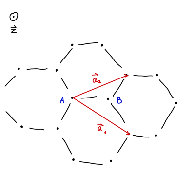
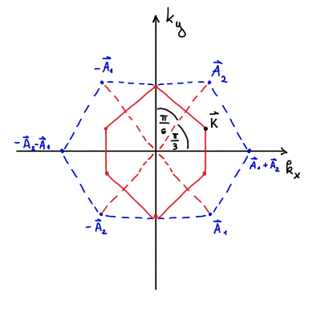

#+title: Vaje iz Fizike trdne snovi, 20. teden v letu
#+subtitle: 2026/05/11
#+startup: nolatexpreview
#+startup: entitiespretty nil
#+startup: show2levels
#+latex_header: \usepackage{amsmath} \usepackage{unicode-math} \usepackage{cancel} \usepackage{graphicx}
#+latex_header: \renewcommand{\theta}{\vartheta} \renewcommand{\phi}{\varphi} \renewcommand{\epsilon}{\varepsilon}
#+latex_header: \newcommand{\odv}[1]{\dot{\vec{#1}}} \newcommand{\oddv}[1]{\ddot{\vec{#1}}}
#+latex_header: \newcommand{\rot}{\mathrm{rot}}\newcommand{\dive}{\mathrm{div}} \newcommand{\iu}{\mathrm{i}}
#+latex_header: \newcommand\mapsfrom{\mathrel{\reflectbox{\ensuremath{\mapsto}}}}
* Grafen v približku tesne vezni

Atome v grafenu opišemo z \( \mathbf{R} - \mathbf{r}_i, \ i = 1, 2 \).

Rešimo stacionarno Schrödingerjevo enačbo, ki nam poda \( 2\times2 \) sistem. Rešitev sistema je energijska disperzija z enačbo

\begin{equation}
\label{eq:1}
 \epsilon(\mathbf{k}) = \mp \gamma \left| 1 + e^{\mathrm{i} \mathbf{k} \cdot \mathbf{a}_1} + e^{\mathrm{i} \mathbf{k} \cdot \mathbf{a}_2} \right|
\end{equation}

Recipročna mreža trikotne kristalne mreže je ponovno trikotna mreža z recipročnimi vektorji

\[ \mathbf{A}_1 = \frac{4 \pi}{\sqrt{3} a} \left( \frac{\sqrt{3}}{2}, -\frac{1}{2} \right) \quad \text{ in } \quad \mathbf{A}_2 = \frac{4 \pi}{\sqrt{3} a}\left( 0, 1 \right).
\]

Prva Brillouinova cona je Wigner-Seitzova celica recipročne mreže. Pri grafenu je označena z neprekinjeno rdečo črto na spodnji sliki

Oglišče \( \mathbf{K} \) opišemo z vektorji:

\[ \mathbf{K}= \frac{1}{3} \left( \mathbf{A}_1 + 2 \mathbf{A}_2 \right). 
\]

V enačbo~\eqref{eq:1} vstavimo nastavek \( \mathbf{k} = \mathbf{K} + \mathbf{q} \), kjer je \( \left| \mathbf{q} \right| \ll \frac{\pi}{a} \). Eksponente razvijemo do prvega reda

\[ e^{\mathrm{i} \mathbf{q} \cdot \mathbf{a}_i} = 1 + \mathrm{i} \mathbf{q} \cdot \mathbf{a}_i,
\]
prav tako pa upoštevamo skalarna produkta

\begin{align*}
  K \cdot \mathbf{a}_1 &= \frac{4 \pi}{3 a} \left( 1, 0 \right) \cdot a \left( 1, 0 \right) = \frac{4 \pi}{3} \\
K \cdot \mathbf{a}_2 &= \frac{4 \pi}{3a} \left( 1, 0 \right) \cdot a \left( \frac{1}{2}, \frac{\sqrt{3}}{2} \right) = \frac{2 \pi}{3}.
\end{align*}

Disperzijska relacija je potem

\begin{align*}
  \epsilon \left( \mathbf{K} + \mathbf{q} \right) &= \mp \gamma \left| 1 + \exp \left\{ \mathrm{i}\left[  \frac{1}{3} \left(\mathbf{A}_1 + 2 \mathbf{A}_2 \right) + \mathbf{q} \right] \mathbf{a}_1 \right\} + \exp \left\{  \mathrm{i}\left[  \frac{1}{3} \left(\mathbf{A}_1 + 2 \mathbf{A}_2 \right) + \mathbf{q} \right] \mathbf{a}_2  \right\} \right| \\
&= \mp \gamma \left| 1 + e^{\mathrm{i} \frac{2 \pi}{3}} \left( 1 + \mathrm{i} \mathbf{q} \cdot \mathbf{a}_1 \right) + e^{\mathrm{i} \frac{4 \pi}{3}} \left( 1 + \mathrm{i} \mathbf{q} \cdot \mathbf{a}_2 \right) \right|,
\end{align*}

kjer smo upoštevali \( \mathbf{a}_i \mathbf{A}_j = 2 \pi \delta_{ij} \). Polarno koordinato \( e^{\mathrm{i} \frac{4 \pi}{3}} \) lahko zapišemo tudi kot \( e^{- \mathrm{i} \frac{2 \pi}{3}} \), kar pomeni, da nam preostane

\[ \epsilon(\mathbf{K} + \mathbf{q}) = \pm \gamma \left| e^{- \mathrm{i \frac{2\pi}{3}}} \mathrm{i} \mathbf{q} \cdot \mathbf{a}_1 + e^{\mathrm{i} \frac{2 \pi}{3}} \mathrm{i} \mathbf{q} \cdot \mathbf{a}_2 \right|.
\]

Z upoštevanjem definicije Eulerjevega števila disperzijsko relacijo zapišemo kot

\[ \epsilon(\mathbf{K} + \mathbf{q}) = \pm \gamma \left| \mathrm{i} \mathbf{q} \cdot \left( \mathbf{a}_1 + \mathbf{a}_2 \right) \cos \left( \frac{2 \pi}{3} \right) + \mathrm{i} \left( \mathrm{i} \mathbf{q} \cdot \left( \mathbf{a}_2 - \mathbf{a}_1 \right) \right) \sin \left( \frac{2\pi}{3} \right)   \right|.
\]

Ker poznamo vektorja mreže, lahko izračunamo njuni vsoti in razliki

\[ \mathbf{a}_1 + \mathbf{a}_2 = a \left( \frac{3}{2}, \frac{\sqrt{3}}{2} \right) \quad \text{ in } \quad \mathbf{a}_2 - \mathbf{a}_1 = a \left(- \frac{1}{2}, \frac{\sqrt{3}}{2} \right).
\]

Sedaj lahko izračunamo skalarni produkt v disperzijski relaciji

\[ \epsilon(\mathbf{K} + \mathbf{q}) = \pm \gamma \left| - \frac{\mathrm{i}}{2} a \left( \frac{3}{2} q_x + \frac{\sqrt{3}}{2} q_y \right) - \frac{\sqrt{3}}{2} a \left( - \frac{1}{2} q_x + \frac{\sqrt{3}}{2} q_y \right) \right|,
\]
in ločimo na kompleksni in realni del

\[ \epsilon(\mathbf{K} + \mathbf{q}) = \pm \gamma a \left| \frac{\sqrt{3}}{4} q_x - \frac{3}{4} q_y + \mathrm{i}\left( - \frac{3}{4} q_x - \frac{\sqrt{3}}{4} q_y \right)  \right|.
\]

Sedaj lahko izračunamo absolutno vrednost

\begin{align*}
  \epsilon(\mathbf{K} + \mathbf{q}) &= +\pm \gamma a \sqrt{\left( \frac{\sqrt{3}}{4} q_x - \frac{3}{4} q_y \right) ^2 + \left( \frac{3}{4} q_x + \frac{\sqrt{3}}{4} q_y \right) ^2} \\
&= \pm \gamma a \sqrt{\frac{3}{16} q_x ^2 + \frac{9}{16} q_y ^2 + \frac{9}{16} q_x ^2 + \frac{3}{16} q_y ^2} \\
&= \pm \frac{\sqrt{3}}{2} \gamma a \sqrt{q_x ^2 + q_y ^2} \\
&= \pm \frac{\sqrt{3}}{2} \gamma a \left| \mathbf{q} \right|
\end{align*}

V ogliščih 1. Brillouinove cone se stožca dotikata in energijske reže ni. Povsod drugod energijska reža je.
* Kvazi-klasičen približek

Zanemarimo pol leta kvantne mehanike in elektrone obravnavamo z 2. Newtonovim zakonom. Sila, ki deluje na elektron je

\[ \hbar \dot{\mathbf{k}} = \mathbf{F} = e \left( \mathbf{E} + \mathbf{v} \times \mathbf{B} \right). 
\]

Hitrost elektrona določimo iz disperzije energije

\begin{equation}
\label{eq:2}
 \mathbf{v} = \frac{1}{\hbar} \frac{\partial \epsilon (\mathbf{k})}{\partial \mathbf{k}}. 
\end{equation}
** Ciklotronska frekvenca

Predpostavimo, da je energija \( \epsilon \) elektrona najmanjša in narašča kvadratno. Dodatno, naj bo v središču Brillouinove cone

\[ \epsilon(\mathbf{k}) = \epsilon_{min} + \frac{\hbar ^2}{2} \mathbf{k} \cdot {\left(\mathsf{m}^{\ast}\right)}^{-1} \mathbf{k},
\]

kjer je \( \mathsf{m}^{\ast} \) tenzor efektivne mase in je \( \epsilon_{\min} = \epsilon(\mathbf{k} = 0) \). Vse lastne vrednosti tenzorja efektivne mase so pozitivne, saj se elektroni nahajajo v bližini energijskega minimuma in energija narašča v vse smeri \( \mathbf{k} \). Prav tako predpostavimo, da je tenzor simetričen. 

Enačbo \eqref{eq:2} razpišemo s pomočjo Einsteinovega notacijskega pravila

\begin{align*}
 v_i &= \frac{1}{\hbar} \frac{\partial E}{\partial k_{i}} = \frac{1}{\hbar} \frac{\hbar ^2}{2} \frac{\partial }{\partial k_{i}} \left( k_j \left( \mathsf{m}^{\ast} \right)^{-1}_{jk} k_k \right) \\
&= \frac{\hbar}{2} \left[ \delta_{ij} \left( \mathsf{m}^{\ast} \right)^{-1} _{jk} k_k + k_j \left( \mathsf{m}^{\ast} \right)^{-1} _{jk} \delta_{ik} \right],
\end{align*}
kjer smo v drugi vrstici upoštevali odvajanje produkta. Zapišemo torej

\[ v_i = \frac{\hbar}{2} \left( \left( \mathsf{m}^{\ast} \right)^{-1} _{ik} k_k + k_j \left( \mathsf{m}^{\ast} \right)^{-1}_{ji} \right),
\]
in upoštevamo simetričnost tenzorja \( \mathsf{m}^{\ast}_{ij} = \mathsf{m}^{\ast}_{ji} \), da zapišemo

\[ v_i = \frac{\hbar}{2} \left[ \left( \mathsf{m}^{\ast} \right)^{-1}_{ik} k_k + k_j \left( \mathsf{m}^{\ast} \right)^{-1}_{ij} \right].
\]

Indeksa \( j \) in \( k \) sta nema indeksa, zato lahko zapišemo

\[ v_i = \frac{\hbar}{2} \left[ 2 \left( \mathsf{m}^{\ast} \right)^{-1}_{ij} k_j \right] = \hbar \left[ \left( \mathsf{m}^{\ast} \right)^{-1} \mathbf{k} \right]_i 
\]

Dobljen izraz lahko obrnemo, da dobimo

\[ \mathbf{v} = \hbar \left( \mathsf{m}^{\ast} \right)^{-1} \mathbf{k} \implies\hbar \dot{\mathbf{k}} = \mathsf{m}^{\ast} \dot{\mathbf{v}} 
\]

Dobljen izraz nadomestimo v Newtonovem drugem zakonu za nabit delec magnetnem polju in dobimo

\[ \mathsf{m}^{\ast} \dot{\mathbf{v}} = q \mathbf{v} \times \mathbf{B}. 
\]

Enačbo lahko rešimo z nastavkom \( \mathbf{v} = \mathbf{v}_0 e^{- \mathrm{i} \omega t} \)

\[ - \mathrm{i} \omega \mathsf{m}^{\ast} \mathbf{v}_0  = q \mathbf{v}_0 \times \mathbf{B}.
\]

Izračunamo vektorski produkt, da dobimo

\[ \mathsf{m}^{\ast} \mathbf{v}_0 = \frac{\mathrm{i} q B}{\omega} \begin{bmatrix} v_{0y} \\ -v_{0x} \\ 0 \end{bmatrix} 
\]

Slednje lahko zapišemo v matrični obliki kot

\[ \begin{bmatrix}
   m_{xx} & m_{xy} -\frac{qB}{\mathrm{i} \omega}  & m_{xz} \\
   m_{yx} + \frac{q B}{\mathrm{i} \omega} & m_{yy} & m_{yz} \\
    m_{zx} & m_{zy} & m_{zz}
   \end{bmatrix} \begin{bmatrix} v_{0x} \\ v_{0y} \\ v_{0z} \end{bmatrix} = \mathsf{m}^{\ast}_{\mathbf{B}} \mathbf{v}_0 = 0
\]

