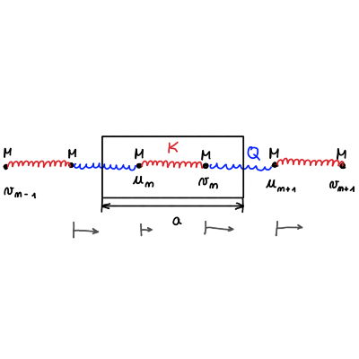
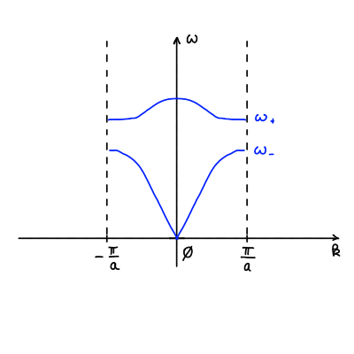

#+title: Vaje iz Fizike trdne snovi, 21. teden v letu
#+subtitle: 2026/05/18 in 2026/05/21
#+startup: nolatexpreview
#+startup: entitiespretty nil
#+startup: show2levels
#+latex_header: \usepackage{amsmath} \usepackage{unicode-math} \usepackage{cancel} \usepackage{graphicx}
#+latex_header: \renewcommand{\theta}{\vartheta} \renewcommand{\phi}{\varphi} \renewcommand{\epsilon}{\varepsilon}
#+latex_header: \newcommand{\odv}[1]{\dot{\vec{#1}}} \newcommand{\oddv}[1]{\ddot{\vec{#1}}}
#+latex_header: \newcommand{\rot}{\mathrm{rot}}\newcommand{\dive}{\mathrm{div}} \newcommand{\iu}{\mathrm{i}}
#+latex_header: \newcommand\mapsfrom{\mathrel{\reflectbox{\ensuremath{\mapsto}}}}
* Kvazi-klasičen približek
** Ciklotronska frekvenca 

Energija elektrona v bližini spodnjega roba, ki naj bo središče 1. BC, minimalno

\[ \epsilon (\mathbf{k}) = \epsilon_{min} + \frac{\hbar ^2}{2} \mathbf{k} {\underline{m}^{\ast}}^{-1} \mathbf{k},  
\]
kjer je

\[ {\underline{m}^{\ast}} = \begin{bmatrix}
                            m_{xx} & m_{xy} & m_{xz} \\
                            m_{yx} & m_{yy} & m_{yz} \\
                            m_{zx} & m_{zy} & m_{zz}
                            \end{bmatrix} = {\underline{m}^{\ast}}^T. 
\]

Drugi Newtonov zakon v kvazi-klasičnem približku je

\[ {\underline{m}}^{\ast} \dot{\mathbf{v}} = e \mathbf{v} \times \mathbf{B}.
\]

Magnetno polje naj bo usmerjeno v smeri osi \( z \), \( \mathbf{B} = B \hat{e}_z \) in hitrost ima obliko ravnega valova \( \mathbf{v} = \mathbf{v}_0 e^{- \mathrm{i} \omega t} \). Dobili smo sistem enačb

\[ \begin{bmatrix}
   m_{xx} & m_{xy} - \frac{\mathrm{i} e B}{\omega}  & m_{xz} \\
   m_{yx} + \frac{\mathrm{i} e B}{\omega} & m_{yy} & m_{yz} \\
   m_{zx} & m_{zy} & m_{zz}
   \end{bmatrix} \begin{bmatrix} v_{0x} \\ v_{0y} \\ v_{0z} \end{bmatrix} = 0
\]

Za izračun determinante bi lahko razvili matriko po stolpcih, vendar je lažji način, da jo izrazimo kot vsoto determinante brez popravkov magnetnega polja in popravkov magnetnega polja

\[ 0 = \det \mathsf{m}^{\ast} - \frac{\mathrm{i} e B}{\omega} m_{yz} m_{zx} + \frac{\mathrm{i} e B}{\omega} m_{zy} m_{xz} + \left[ m_{zz} \left( \frac{\mathrm{i} e B}{\omega} \right) ^2 \right]  
\]

Zaradi simetričnosti tenzorja se srednja člena pokrajšata in ostane nam

\[ 0 = \det m^{\ast} - \left( \frac{qB \sqrt{m_{zz}}}{\omega} \right) ^2.
\]

Iz zgornje enačbe sedaj izrazimo frekvenco, s katero sistem oscilira

\[ \omega = \frac{\left| q \right| B \sqrt{m_{zz}}}{\sqrt{\det \mathsf{m}^{\ast}}}.
\]

Frekvenco lahko sedaj primerjamo s ciklotronsko frekvenco \( \omega_C = \left| q \right| \frac{B}{m} \) in definiramo efektivno ciklotronsko frekvenco \( m_c^{\ast} \), ki ima obliko

\[ m_c^{\ast} = \sqrt{\frac{\det \mathsf{m}^{\ast}}{m_{zz}}}. 
\]

Efektivno ciklotronsko frekvenco želimo izraziti z vektorskim zapisom neodvisno od koordinat, zato uvedemo \( \mathbf{B} = B \hat{e}_B  \), izraz za \( m_c^{\ast} \) pa potem posodobimo v

\[ m_c^{\ast} = \sqrt{\frac{\det \mathsf{m}^{\ast}}{\hat{e}_B \cdot \mathsf{m}^{\ast} \cdot \hat{e}_B}}.
\]

V anizotropni snovi lastnosti izražamo z efektivno maso preko determinante tenzorja \( m^{\ast} \). Gostota stanj v izotropni snovi je, kakor smo napisali v enem izmed prejšnjih predavanj,

\[ g(\epsilon) = \frac{ \sqrt{2m ^3}}{\pi ^2 \hbar ^3} \sqrt{\epsilon}. 
\]

V anizotropni snovi pa zapišemo

\[ g (\epsilon) = \frac{\sqrt{2 \mathsf{m}^{\ast}}}{\pi ^2 \hbar ^3} \sqrt{\epsilon}, 
\]
kjer je \( \mathsf{m}^{\ast} = \sqrt[3]{\det \mathsf{m}^{\ast}} \).
* Naloga: Kemijski potencial v \( n \)-dopiranem polprevodniku

Efektivna masa \( e^- \) v prevodnem pasu ima enako oznako kot ciklotronska efektivna masa

\[ m_c^{\ast} = \sqrt[3]{\det m_c^{\ast}},
\]
efektivna masa vrzeli v valečnem pasu pa označimo z

\[ m_v^{\ast} = \sqrt[3]{\left| \det m_v^{\ast} \right|}. 
\]

Za energijsko režo \( \epsilon_g = \epsilon_c - \epsilon_v \) velja \( \epsilon_c - \epsilon_d, \epsilon_a - \epsilon_v \ll \epsilon_g \), kjer sta \( \epsilon_d \) donorski in \( \epsilon_a \) akceptorski energijski pas.

Gostota elektronskih stanj blizu dna prevodnega pasu je 

\[ g_c = \frac{\sqrt{2 m_{c}^{\ast}}}{\pi ^2 \hbar ^3} \sqrt{\epsilon - \epsilon_{c}}, \ m_c^{\ast} = \sqrt[3]{\det \mathsf{m}_c^{\ast}}, 
\]
in podobno je gostota stanj vrzeli na vrhu valenčnega pasu

\[ g_v = \frac{\sqrt{2 m_{v}^{\ast}}}{\pi ^2 \hbar ^3} \sqrt{\epsilon_v - \epsilon}, \ m_v^{\ast} = \sqrt[3]{\det \mathsf{m}_v^{\ast}}, 
\]

Za naš primer \( n \)-dopiranega polprevodnika, imamo dodaten donorski energijski pas z energijo \( \epsilon_d \), ki je tik pod dnom prevodnega pasu. Donorjev karakterizirata energija donorjev \( \epsilon_d \) in koncentracija \( n_d \), ki nam pove gostote donorjev glede na enoto volumna v polprevodniku.

Gostoto elektronov v prevodnem pasu označimo z \( n_c \), gostoto vrzeli v valenčnem pasu s \( p_v \) in gostoto vrzeli v donorskem pasu s \( p_d \).

Pri temperaturi \( T = 0 \ \mathrm{K} \) velja \( n_c = p_d = p_v = 0 \), kar pomeni, da sta valenčni pas in donorski pas popolnoma zasedena, prevodni pas pa je prazen. Pri dviganju temperature bodo določeni elektroni preskočili v prevodni pas. Drugače povedano, pri končni temperaturi \( T \ne 0 \) velja \( n_c = n_c (T) \), \( p_d = p_d (T) \) in \( p_v = p_v (T) \). Zanima nas količina prostih elektronov v prevodnem pasu ali količina vrzeli v valenčnem pasu, saj oboje prispeva k prevajanju električnega toka.

Za izračun \( n_c (T) \) moramo najti kemijski potencial \( \mu(T) \)

\[ n_c (T) = \int\limits_{\epsilon_c}^{\infty} g(\epsilon) f(\epsilon) \, \mathrm{d} \epsilon,
\]
kjer meje potekajo od dna prevodnega pasu do neskončnosti in je

\[ f(\epsilon) = {\left( e^{\beta (\epsilon - \mu)} + 1 \right)}^{-1}. 
\]

Za izračun gostote vrzeli v valenčnem pasu velja enačba

\[ p_v = \int\limits_{- \infty}^{\epsilon_v} g_v (\epsilon) \left[ 1 - f(\epsilon) \right] \, \mathrm{d} \epsilon. 
\]

Analitično to ni izračunljivo, zato uporabimo približek nedegeneriranega polprevodnika, za katerega velja \( \epsilon_c - \mu \gg k_B T \) in \( \mu - \epsilon_v \gg k_B T \). Na koncu je dobro, da preverimo, če to res drži. 

Iz predavanj vemo, da potem velja

\[ n_c = N_c e^{- \beta \left( \epsilon_c - \mu \right)}, \quad N_c = \frac{1}{4} \left( \frac{2 m_c^{\ast} k_B T}{\pi \hbar ^2} \right)^{\frac{3}{2}} 
\]
in 
\[ p_v = P_v e^{- \beta \left( \epsilon_c - \mu \right)}, \quad P_v = \frac{1}{4} \left( \frac{2 m_v^{\ast} k_B T}{\pi \hbar ^2} \right)^{\frac{3}{2}}.
\]

Prav tako vemo iz predavanj, da je gostota vrzeli v donorskem pasu

\[ p_d = \frac{N_d}{1 + 2 e^{- \beta (\epsilon_d - \mu)}}.
\]

Donorski nivo lahko zaseda nič elektronov, en elektron s spinom gor ali dol ali dva elektrona, en s spinom gor in en s spinom navzdol. Pripadajoče energije opisanih situacij so \( \epsilon = 0 \), \( \epsilon = \epsilon_d \), \( \epsilon = \epsilon_d \) in \( \epsilon = 2 \epsilon_d + U \), kjer potencial \( U \) izhaja iz elektrostatskega odboja. 

Kemijski potencial \( \mu(T) \) bomo našli preko ohranitve naboja

\begin{align*}
n_c &= p_d + p_v \\
  N_c e^{- \beta (\epsilon_c - \mu)} &= \frac{N_d}{1 + 2e ^{- \beta (\epsilon_d - \mu)}} + P_v e^{- \beta (\mu - \epsilon_v)},
\end{align*}
kjer smo vstavili iz predavanj izpeljane identitete.

Ker ne želimo reševati polinoma tretje stopnje, lahko fizikalno zanemarimo zadnji člen. Število vrzeli v spodnjem pasu je pri sobni temperaturi zanemarljivo, saj elektroni nimajo dovolj energije za preskok v valenčni pas.

Kvadratna enačba je

\[ e^{2 \beta \mu} + \frac{1}{2} e^{\beta \epsilon_d} e^{\beta \mu} - \frac{N_d}{2 N_c} e^{\beta (\epsilon_c + \epsilon_d)} = 0, 
\]
in rešitvi sta

\[ e^{\beta \mu} = - \frac{1}{4} e^{\beta \epsilon_d} \pm \sqrt{\left( \frac{1}{4} e^{\beta \epsilon_d} \right) ^2 + \frac{N_d}{2N_c} e^{\beta (\epsilon_d - \epsilon_c)}} 
\]
oziroma

\begin{equation}
\label{eq:1}
  e^{\beta \mu} = \frac{1}{4} e^{\beta \epsilon_d} \left[ -1 \pm \sqrt{1 + \frac{8N_d}{N_c} e^{\beta(\epsilon_d - \epsilon_c)}} \right],
\end{equation}
kjer vzamemo rešitev s plusom, saj je drugače rezultat nefizikalen.

Definirajmo 

\[ A = \sqrt{1 + \frac{8 N_d}{N_c} e^{\beta (\epsilon_d - \epsilon_c)} }.
\]

Za \( A \gg 1 \) smo v **limiti nizke temperature** (edina člena odvisna od temperature sta \( \beta \propto T^{-1} \) in \( N_c \propto T^{\frac{3}{2}} \)). V tej limiti potem velja 

\begin{equation}
\label{eq:2}
\begin{aligned}
  e^{\beta \mu} &\approx \frac{1}{4} e^{\beta \epsilon_d} \sqrt{8 e^{\beta(\epsilon_d - \epsilon_c)} \frac{N_d}{N_c}} \\
&= \frac{1}{2} \sqrt{\frac{2N_d}{N_c}} e^{\frac{\beta}{2} (\epsilon_c + \epsilon_d)}
\end{aligned}
\end{equation}

Rešitev logaritmiramo in delimo z \( \beta  \)

\begin{align*}
  \mu(T) &= \frac{1}{2} \left( \epsilon_c + \epsilon_d \right) + k_B T \ln \left( \sqrt{\frac{N_c}{2N_d}} \right) \\
&= \frac{1}{2} (\epsilon_c + \epsilon_d) - \frac{3}{4} \ln T 
\end{align*}

Ko se temperatura manjša, se kemijski potencial poenostavi v

\[ \mu \to \frac{\epsilon_c + \epsilon_d}{2},
\]

kar je sredina med prevodnim in donorskim nivojem.

Za \( A \ll 1 \) smo v **limiti visoke temperature**, kjer moramo paziti, da še zmeraj drži predpostavka \( \mu - \epsilon_v \gg k_B T \). Koren v enačbi \eqref{eq:1} razvijemo s Taylorjevo vrsto

\begin{equation}
\label{eq:3}
 e^{\beta \mu} = \frac{1}{4} e^{\beta \epsilon_d} \left( \frac{1}{2} \frac{8N_d}{N_c} e^{\beta \left( \epsilon_c - \epsilon_d \right)} \right) = \frac{N_d}{N_c} e^{\beta \epsilon_c} 
\end{equation}
kjer je po logaritmiranju kemijski potencial

\[ \mu = \epsilon_c + k_B T \ln \frac{N_d}{N_c}. 
\]

Ob upoštevanju odvisnosti \( N_c \propto T^{\frac{3}{2}} \), se visokotemperaturna limita veča z

\[ \mu = \epsilon_c - \frac{3}{2} k_B T \ln T +\ldots
\]

Z višanjem temperature se kemijski potenical \( \mu \) manjša.
** Koncentracija elektronov v prevodnem pasu 

Koncentracijo elektronov zapišemo po definiciji

\[ n_c = N_c e^{- \beta \left( \epsilon_c - \mu \right)} = N_c e^{- \beta \epsilon_c} e^{\beta \mu}. 
\]

Za **nizkotemperaturno** limito \( n_c \), izraz \( e^{\beta \mu} \) nadomestimo s tistim iz enačbe \eqref{eq:2}, da dobimo

\[ n_c = N_c e^{- \beta \epsilon_c} \sqrt{\frac{N_d}{2N_c}} e^{\frac{1}{2} \beta \left( \epsilon_c + \epsilon_d \right)} = \sqrt{\frac{N_d N_c}{2}} e^{- \frac{\beta}{2} \left( \epsilon_c - \epsilon_d \right)}
\]

Ker je \( N_c \propto T^{\frac{3}{2}} \), je koncentracija elektronov

\[ n_c (T) \propto T^{\frac{3}{4}} e^{- \frac{\beta}{2} \left( \epsilon_c - \epsilon_d \right)}.
\]

Za **visokotemperaturno** limito \( n_c \), izraz \( e^{\beta \mu} \) nadomestimo s tistim iz enačbe \eqref{eq:3}, da dobimo

\[ n_c = N_c e^{- \beta \epsilon_c} \frac{N_d}{N_c}e^{\beta \epsilon_c} = N_d.
\]

V približku nedegeneriranih polprevodnika je v visokitemperaturni limiti koncentracija elektronov v prevodnem pasu konstantna. Temperatura je dovolj velika, da so vsi donorski elektroni v prevodnem pasu, vendar ne tako velika, da bi elektroni iz valenčnega pasu preskakovali v prevodni pas.
* Mrežne oscilacije z alternirajočimi koeficienti   
#+begin_problem
Enodimenzionalni kristal, sestavljen iz atomov z maso \( M \), je sestavljen iz alternirajočih vzmeti s koeficientoma \( K \) in \( Q \). Najdi disperzijsko relacijo \( \omega(k) \), ki opiše mrežne oscilacije.
#+end_problem

Pravokotnik prikazuje osnovno celico našega kristala. Odmik od ravnovesne lege označimo z \( u_n \) za levi atom v kristalu in z \( v_n \) za desnega. 

Drugi Newtonov zakon za odmik \( u_n \) je

\[ M \ddot{u}_n = K \left( v_n - u_n \right) - Q \left( u_n - v_{n - 1} \right).
\]

Če je odmik \( v_n \) večji od \( u_n \) (\( v_n > u_n \)), potem na atom \( u_n \) deluje sila v desno z velikostjo \( K \left( v_n - u_n \right) \). Podobno, če je odmik \( u_n \) manjši od odmika \( v_{n - 1} \) (\( u_n < v_{n - 1} \)), potem na atom z odmikom \( u_n \) prav tako deluje sila v desno, s koeficientom \( - Q \left( u_n - v_{n- 1}  \right) \) (razlika odmikov je negativna, kar se pokrajša s sprednjim minusom). Opisan primer je prikazan na zgornji sliki.

Analogno je za odmik \( v_n \)

\[ M \ddot{v}_n = Q \left( u_{n + 1} - v_n \right) - K \left( v_n - u_n \right). 
\]

Za \( N \) atomov v kristalni mreži imamo na tak način sklopljen sistem \( 2N \) enačb. Periodičen robni pogoj oz.~translacijska simetrija nam omogoča reševanje z Blochovim teorem. Uporabili bomo torej nastavka, ki sta ravna valova

\begin{equation}
\label{eq:6}
 u_n = u_0 e^{\mathrm{i} \left( kna - \omega t \right)} \quad \text{ in } \quad v_n = v_0 e^{\mathrm{i} \left( kna - \omega t \right)}.
\end{equation}

Nastavka vstavimo v zgornji enačbi. Prva poda rezultat

\begin{align*}
 -\omega ^2 M u_0 e^{\mathrm{i} (kna - \omega t)} = K &\left[ \left( v_0 e^{\mathrm{i} (kna - \omega t)} \right) - u_0 e^{\mathrm{i} (kna - \omega t)} \right]  \\
&- Q \left[ u_0 e^{\mathrm{i} (kna - \omega t)} - v_0 e^{\mathrm{i} \left[ k \left( n - 1 \right) a - \omega t \right]} \right]
\end{align*}

Ravne valove lahko med seboj pokrajšamo in preostane nam

\[ - \omega ^2 M u_0 = K \left( v_0 - u_0 \right) - Q \left( u_0 - v_0 e^{- \mathrm{i} ka} \right).
\]

Analogno iz druge enačbe dobimo

\[ - \omega ^2 M v_0 = Q \left( u_0 e^{\mathrm{i} ka} - v_0 \right) - K \left( v_0 - u_0 \right).
\]

Sedaj lahko to zapišemo v matrični obliki in imam \( 2 \times 2 \) sistem

\begin{equation}
\label{eq:7}
 \begin{bmatrix}
  K + Q - \omega ^2 M  & - K - Q e^{\mathrm{i} ka} \\
   -K - Q e^{\mathrm{i} ka} & K + Q - \omega ^2 M
    \end{bmatrix} \begin{bmatrix} u_{0} \\ v_{0} \end{bmatrix} = 0.
\end{equation}

Kakor že mnogokrat letos, ta sistem ima rešitev za ničelno determinanto, kar nam poda enačbo

\[ 0 = \left( K + Q - \omega ^2 M ^2 \right) ^2 - \left| K + Qe^{\mathrm{i} ka} \right| ^2.
\]

Po premiku prvega člena na levo stran enačbe, jo korenimo. Zanima nas frekvenca mrežnega nihanja, zato jo izpostavimo

\[ \omega ^2 = \frac{K + Q}{M} \pm \frac{1}{M} \sqrt{K ^2 + Q ^2 + 2KQ \cos (ka)}.
\]

Koren razširimo s \( 2K Q - 2KQ \), zato da dobimo popoln kvadrat, sočasno pa uporabimo identiteto \( \cos (ka) - 1 = - 2 \sin ^2 \left( \frac{ka}{2} \right) \), da dobimo

\[ \omega ^2 = \frac{K + Q}{M} \pm \frac{1}{M} \sqrt{\left( K + Q \right) ^2 - 4KQ \sin ^2 \left( \frac{ka}{2} \right)}. 
\]

Za konec izpostavimo faktor \( \frac{K + Q}{M} \)

\begin{equation}
\label{eq:5}
 \omega ^2 = \frac{K + Q}{M} \left[ 1 \pm \sqrt{1 - \frac{4 K Q}{\left( K + Q \right) ^2} \sin ^2 \left( \frac{ka}{2} \right)}  \,\right] 
\end{equation}

Dobili smo disperzijsko relacijo \( \omega (k) \).
** Lastne frekvence disperzijske relacije

Omejimo se na prvo Brilluoinovo cono, ki jo določa \( \left| k \right| \in \left[ - \frac{\pi}{a}, \frac{\pi}{a} \right] \). Graf disperzijske relacije lahko vidimo na spodnji sliki.

Za začetek si bomo pogledali lastne frekvence v središču prve Brilluoinove cone, \( k = 0 \). Enačba

\begin{equation}
\label{eq:4}
 \omega ^2 M = K + Q \pm \left| K + Q e^{\mathrm{i} ka} \right|,
\end{equation}

ima pri \( k = 0 \) dve rešitvi

\[ \omega ^2 = \frac{K + Q}{M} \pm \frac{\left| K + Q \right|}{M}. 
\]

Lastni frekvenci sta torej \( \omega ^2 = 0 \) in \( \omega ^2 = \frac{2 (K + Q)}{M} \).

Na robu Brillouinove cone \( k = \frac{\pi}{a} \) pa enačba \eqref{eq:4} poda drugi dve rešitvi

\[ \omega ^2 = \frac{K + Q}{M} \pm \frac{K - Q}{M}. 
\]

Lastni frekvenci sta v tem primer \( \omega ^2 = \frac{2K}{M} \) in \( \omega ^2 = \frac{2Q}{M} \).
** Disperzijska relacija blizu središča Brillouinove cone

Blizu središča Brillouinove cone velja \( \left| k \right| \ll \frac{\pi}{a}\), kar pomeni, da lahko enačbo \eqref{eq:5} razvijemo najprej sinusno funkcijo, nato pa še koren

\begin{align*}
  \omega ^2 &= \frac{K + Q}{M} \left[ 1 \pm \sqrt{1 - \frac{4KQ}{\left( K + Q \right) ^2} \sin ^2 \left( \frac{ka}{2} \right)} \right] \\
&\approx \frac{K + Q}{M} \left[ 1 \pm \sqrt{1 - \frac{4KQ}{\left( K + Q \right) ^2} \cdot \frac{\left( ka \right) ^2}{4}} \right] \\
&\approx \frac{K + Q}{M} \left[ 1 \pm \left[ 1 - \frac{KQ}{2 \left( K + Q \right) ^2} \left( ka \right) ^2 \right] \right]
\end{align*}

Kvadrat pozitivne lastne frekvence je

\[ \omega ^2 = \frac{2 (K + Q)}{M} - \mathcal{O} \left[ \left( ka \right) ^2 \right], 
\]
kvadrat negativne lastne frekvence pa

\[ \omega ^2 = \frac{KQ}{2 \left( K + Q \right) M} \left( ka \right) ^2.
\]

Pozitivna veja \( \omega(k) \) je navzdol obrnjena parabola v okolici \( k = 0 \) in se ji reče /optična veja/.

Negativni veji s frekvenco

\[ \omega = \sqrt{\frac{KQ}{2 (K + Q)}M} \left| k \right|,
\]
pravimo /akustična veja/.

Optična veja se pojavi samo, ko imamo več atomov v osnovni celici, medtem ko je akustična veja vedno prisotna.
** Valovni načini disperzijske relacije

Želimo najti vrednosti oscilacijskih amplitud \( u_0 \) in \( v_0 \), ki smo ju uvedli na začetku poglavja, v enačbi \eqref{eq:6}. Izhajali bomo iz \( 2 \times 2 \) matričnega sistema v enačbi \eqref{eq:7}. Določimo \( Q > K \).
*** Akustična veja pri \( k = 0 \)

Kvadrat lastne frekvence v središču Brillouinove cone pri \( k = 0 \) za akustično vejo je \( \omega ^2 = 0 \). Matrika se preobrazi v

\[ \begin{bmatrix}
   K + Q & - (K + Q) \\
   -- & --
    \end{bmatrix} \begin{bmatrix} u_{0} \\ v_{0} \end{bmatrix} = 0,
\]
kar vodi do \( u_0 = v_0 \). Za celoten kristal to pomeni \( u_n = v_n = u_0 \). Ta rešitev je v fizikalnem smislu translacija celotne kristala. To je tudi smiselno, saj \( \omega ^2 = 0 \) ni osciliranje.
*** Optična veja pri \( k = 0 \)

Kvadrat lastne frekvence je \( \omega ^2 = \frac{2 (K + Q)}{M} \) in matrika je oblike

\[ \begin{bmatrix}
   -(K + Q) & -(K + Q) \\
   -- & --
    \end{bmatrix} \begin{bmatrix} u_{0} \\ v_{0} \end{bmatrix} = 0. 
\]

Dobimo enakost \( v_0 = - u_0 \), kar pomeni, da atoma v osnovni celici nihata v nasprotnih si fazah.
*** Akustična veja pri \( k = \frac{\pi}{a} \)

Kvadrat lastne frekvence \( \omega ^2 = \frac{2Q}{M} \) blizu roba Brillouinove cone \( k = \frac{\pi}{a} \) poda matriko

\[ \begin{bmatrix}
   K - Q & - (K - Q) \\
   -- & --
    \end{bmatrix} \begin{bmatrix} u_{0} \\ v_0 \end{bmatrix} = 0. 
\]

Amplitudi podaja enakost \( u_0 = v_0 \) za osnovno celico, kar pomeni, da atoma v njej nihata v fazi. Splošen nastavek \eqref{eq:6} pa je

\begin{align*}
  u_n &= u_0 e^{\mathrm{i} kna} = \left( -1 \right)^n u_0 \\
v_n &= v_0 e^{\mathrm{i} kna} = \left( -1 \right)^n = \left( -1 \right)^n_0
\end{align*}

Sosednji osnovni celici nihata v nasprotnih fazah. Frekvenca je odvisna od večje konstante vzmeti.
*** Optična veja pri \( k = \frac{\pi}{a} \)

Kvadrat lastne frekvence \( \omega ^2 = \frac{2K}{M} \) poda matriko

\[ \begin{bmatrix}
   Q - K  & - (Q - K) \\
   -- & --
    \end{bmatrix} \begin{bmatrix} u_{0} \\ v_{0} \end{bmatrix} = 0.
\]

Atoma v osnovni celici nihata z isto amplitudo v isti smeri, saj \( u_0 = v_0 \), sosednji osnovni celici pa nihata v nasprotnih fazah. Frekvenca je odvisna od manjše konstante vzmeti.
