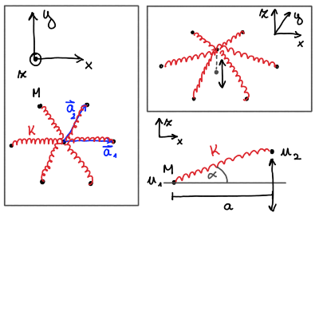

#+title: Vaje iz Fizike trdne snovi, 22. teden v letu
#+subtitle: 2026/05/25 in 2026/05/28
#+startup: nolatexpreview
#+startup: entitiespretty nil
#+startup: show2levels
#+latex_header: \usepackage{amsmath} \usepackage{unicode-math} \usepackage{cancel} \usepackage{graphicx}
#+latex_header: \renewcommand{\theta}{\vartheta} \renewcommand{\phi}{\varphi} \renewcommand{\epsilon}{\varepsilon}
#+latex_header: \newcommand{\odv}[1]{\dot{\vec{#1}}} \newcommand{\oddv}[1]{\ddot{\vec{#1}}}
#+latex_header: \newcommand{\rot}{\mathrm{rot}}\newcommand{\dive}{\mathrm{div}} \newcommand{\iu}{\mathrm{i}}
#+latex_header: \newcommand\mapsfrom{\mathrel{\reflectbox{\ensuremath{\mapsto}}}}
* Naloga: Mrežne oscilacije v trikotni mreži 
#+begin_problem
Obravnavaj dvodimenzionalno trikotno Bravaisevo mrežo z maso atomov \( M \), kjer interakcijo med atomi opisuje vzmet s konstanto \( K \). Vzmeti naj bo napete (razdalja \( a \) med atomi je večja kot stabilna dolžina vzmeti \( a_0 \)). Najdi disperzijsko relacijo \( \omega(\mathbf{k}) \) za mrežne oscilacije v transverzalni smeri na ravnino kristala. Določi dodatek k specifični toploti za nizko- in visokotemperaturno limito.
#+end_problem

Nihanje atomov iz ravnine kristala prikazuje spodnja slika

Za enostaven začetek bomo obravnavali samo dva atoma, katerih transverzalno odstopanje od ravnine kristala označimo z \( u_1 \) in \( u_2 \). Silo \( \mathbf{F} \), ki deluje med atomoma, razstavimo na komponenti vzporedni in pravokotni na ravnino kristala

\[ F_{\parallel} = F \cos (\alpha) \quad \text{ in } \quad F_{\perp} = F \sin \alpha.
\]

Velikost sile določa koeficient vzmeti \( K \) in raztegnjenost vzmeti \( \Delta l \) preko enačbe

\[ F = K \Delta l.
\]

Raztegnjenost vzmeti je določena s

\[ \Delta l = \sqrt{a ^2 + \left( u_2 - u_1 \right) ^2} - a_0. 
\]

Za majhne odmike od ravnovesne lege \( \left| u_2 - u_1 \right| \ll a \) raztegnjenost poenostavimo preko Taylorjevega razvoja

\[ \Delta l \approx a - a_0 + \frac{\left( u_2 - u_1 \right) ^2}{2a}. 
\]

Raztegnjenost vzmeti ima kvadratno odvinost glede na odmik ravnovesne lege. Sedaj razvijemo tudi sinusno in kosinusno funkcijo po definiciji

\begin{align*}
  \cos \alpha &= \frac{a}{\sqrt{ a ^2 + \left( u_2 - u_1 \right) ^2}} \approx 1 + \mathcal{O} \left[ \left( u_2 - u_1 \right) ^2 \right] \\
\sin \alpha &= \frac{u_2 - u_1}{\sqrt{a ^2 + \left( u_2 - u_1 \right) ^2}} \approx \frac{u_2 - u_1}{a} + \mathcal{O} \left[ \left( u_2 - u_1 \right) ^3 \right].
\end{align*}

To sedaj lahko upoštevamo v pravokotni in vzporedni komponenit sil

\[ F_{\parallel} = K (a - a_0) \quad \text{ in } \quad F_{\perp} = K (a - a_0) \frac{u_2 - u_1}{a},
\]
kjer je \( F_0 = K (a - a_0) \) prvotno stanje vzmeti. Sila je v linearno sorazmerna z odmikom iz ravnovesne lege \( u_2 - u_1 \) v skladu s harmonično teorijo (in Hookovim zakonom). Zaradi okoliških atomov, ki prav tako nihajo, bo vsota sil v vzporedni smeri enaka \( 0 \) in pravokotna komponenta sila je edina, ki jo upoštevamo. Zapišemo

\[ F_{\perp} = \tilde{K} \left( u_2 - u_1 \right), \ \tilde{K} = K \frac{a - a_0}{a}. 
\]

Če bi bil \( a = a_0 \), ne bi bilo linearne sorazmernosti z odmikom in ne bi mogli uporabiti harmonične teorije.
** Disperzijska relacija

Enačba gibanja za posamezen atom v kristalni mreži je vsota odmikov vseh najbližjih sosedov

\[ M \ddot{u}_{\mathbf{R}} = \sum\limits_{\mathbf{R}' \in \left\{ nn \right\}}^{} \tilde{K} \left( u_{\mathbf{R}'} - u_{\mathbf{R}} \right). 
\]

Podobno kot pri enodimenzionalnem primeru, uporabimo Blochov nastavek

\[ u_{\mathbf{R}} = u_0 e^{\mathrm{i} \left( \mathbf{k} \cdot \mathbf{R} - \omega t \right)}, 
\]
ki ga nesemo v enačbo gibanja

\[ - M \omega ^2 u_0 e^{\mathrm{i} \left( \mathbf{k} \cdot \mathbf{R} - \omega t \right)} = \sum\limits_{\mathbf{R}' \in \left\{ nn \right\}}^{} \tilde{K} u_0 \left[ e^{\mathrm{i} \left( \mathbf{k} \cdot \mathbf{R}' - \omega t \right)} - e^{\mathrm{i} \left( \mathbf{k} \cdot \mathbf{R} - \omega t \right)} \right].
\]

Pokrajšamo amplitude \( u_0 \) in ravne valove. Preostane nam

\[ - M \omega ^2 = \sum\limits_{\mathbf{R}' \in \left\{ \mathbf{R}' \in nn \right\} }^{} \tilde{K} \left[ e^{\mathrm{i} \mathbf{k} \cdot \left( \mathbf{R} - \mathbf{R}' \right)} - 1 \right].
\]

Lego izhodiščnega atoma postavimo na \( \mathbf{R} = 0 \) in preindeksiramo vsoto na

\[ - M \omega ^2 = \sum\limits_{\mathbf{R} \in \left\{ nn \right\} }^{}  \tilde{K} \left( e^{\mathrm{i} \mathbf{k} \cdot \mathbf{R}} - 1  \right).
\]

Vsoto razširimo na način \( 1 = \frac{1}{2} (1 + 1) \), kar nam omogoča zapis s kosinusno funkcijo

\begin{align*}
  -M \omega ^2 &= \frac{\tilde{K}}{2} \left[ \sum\limits_{\mathbf{R} \in \left\{ nn \right\} }^{} \left( e^{\mathrm{i} \mathbf{k} \cdot \mathbf{R}} - 1 \right) + \sum\limits_{\mathbf{R} \in \left\{ nn \right\}}^{} \left( e^{- \mathrm{i} \mathbf{k} \cdot \mathbf{R}} -1 \right)  \right] \\
 &= \frac{\tilde{K}}{2} \sum\limits_{\mathbf{R} \in \left\{ nn \right\} }^{} \left( 2 \cos (\mathbf{k} \cdot \mathbf{R}) - 2 \right) \\
&= -2 \tilde{K} \sum\limits_{\mathbf{R} \in \left\{ nn \right\}}^{} \sin ^2 \left( \frac{\mathbf{k} \cdot \mathbf{R}}{2} \right).
\end{align*}

Dodatno smo upoštevali, da vektor \( \mathbf{R} \) opisuje Bravaisevo rešetko, zato bo tako \( \mathbf{R} \) kakor \( - \mathbf{R} \) opisoval iste atome.

Frekvenca \( \omega ^2 \) je potem

\[ \omega ^2 = \frac{2 \tilde{K}}{M} \sum\limits_{\mathbf{R} \in \left\{ nn \right\} }^{} \sin ^2 \left( \frac{\mathbf{k} \cdot \mathbf{R}}{2} \right). 
\]

Primitivni vektorji trikotne mreže so

\[ \mathbf{a}_1 = a \left( 1, 0 \right), \quad \mathbf{a}_2 = \frac{a}{2} \left( 1, \sqrt{3} \right) \quad \text{ in } \quad \mathbf{a}_1 - \mathbf{a}_2 = \frac{a}{2} \left( 1, - \sqrt{3} \right).
\]

Disperzijska relacija je potem

\begin{equation}
\label{eq:1}
 \omega ^2 = \frac{2 \tilde{K}}{M} \cdot 2 \left[ \sin ^2 \left( \frac{\mathbf{k} \cdot \mathbf{a}_1}{2} \right) + \sin ^2 \left( \frac{\mathbf{k} \cdot \mathbf{a}_2}{2} \right) + \sin ^2 \left( \frac{\mathbf{k} \cdot (\mathbf{a}_1 - \mathbf{a}_2)}{2} \right)  \right],
\end{equation}
kjer smo upoštevali sodost sinusne funkcije ter sešteli skupaj enake člene.
** Disperzijska relacija blizu Brillouinove cone

Brillouinova cona trikotne mreže je ponovno trikotna mreža s stranico \( \frac{\pi}{a} \). Zanima nas torej \( \left| k \right| \ll \frac{\pi}{a} \), kar fizikalno pomeni velika valovna dolžina glede na dolžino \( a \).

Sinuse v enačbi \eqref{eq:1} lahko razvijemo s Taylorjem in dobimo

\[ \omega ^2 = \frac{4 \tilde{K}}{M} \left[ \left( \frac{\mathbf{k} \cdot \mathbf{a}_1}{2} \right) ^2 + \left( \frac{\mathbf{k} \cdot \mathbf{a}_2}{2} \right) ^2 + \left( \frac{\mathbf{k} \cdot \left( \mathbf{a}_1 - \mathbf{a}_2 \right)}{2} \right) ^2 \right].
\]

Primitivne vektorje nadomestimo z njihovimi vrednostmi in izračunamo skalarni produkt v

\[ \omega ^2 = \frac{\tilde{K}}{M} \left[ k_x ^2 a ^2 + \left( \frac{k_x}{2} + \frac{k_y \sqrt{3}}{2} \right) ^2 a ^2 + \left( \frac{k_x}{2} - \frac{k_y \sqrt{3}}{2} \right) ^2 a ^2 \right].
\]

Kvadrate vsot razpišemo in pokrajšamo enake člene. Preostane nam

\begin{align*}
  \omega ^2 &= \frac{3}{2} \frac{\tilde{K} a ^2}{M} \left( k_x ^2 + k_y ^2 \right)\\
&= \frac{3}{2} \frac{\tilde{K}}{M} a ^2 k ^2
\end{align*}

Frekvenca v trikotni kristalni mreži je

\begin{equation}
\label{eq:3}
 \omega = \sqrt{\frac{3}{2} \frac{\tilde{K}}{M}} ak = ck, \ c = \sqrt{\frac{3}{2} \frac{\tilde{K}}{M}} a. 
\end{equation}

Rešitev ustreza akustični veji, optične pa ni, saj lahko trikotno Bravaisevo mrežo opišemo z osnovno celico, ki vsebuje en atom na celico.
** Specifična toplota

Definicija kapacitete je

\[ C = \frac{\mathrm{d} E}{\mathrm{d} T}. 
\]

Iz predavanj vemo, da je notranja energija harmoničnega kristala oblike

\[ E = \sum\limits_{s, \mathbf{k}}^{} \hbar \omega_s (\mathbf{k}) \left[ \left( e^{\beta \hbar \omega_s (\mathbf{k})} -1 \right)^{-1} + \frac{1}{2} \right],
\]
kjer indeks \( s \) poteka po vseh veja disperzijske relacije (akustične in optične). V našem primeru optične veje ni, zato je poenostavljen izraz za notranjo energijo

\begin{equation}
\label{eq:2}
 E = \sum\limits_{\mathbf{k}}^{} \hbar \omega (\mathbf{k}) \left[ \left( e^{\beta \hbar \omega (\mathbf{k})} - 1 \right) ^{-1} + \cancel{\frac{1}{2}} \right]. 
\end{equation}

Energijo bomo na koncu odvajali po temperaturi, kar pomeni, da lahko konstantne člene zavržemo.

*** Nizkotemperaturna limita 

Pri nizkotemperaturni limiti \( k_B T \ll \hbar \omega (\mathbf{k}) \) so vzbujeni samo nizkofrekvenčni fononi. Prispevek k notranji energiji zaradi

- akustične veje daleč od središča Brillouinove cone \( k = 0 \) je zanemarjen 
  
- in vse optične veje so zanemarjene.

Akustično vejo blizu \( k = 0 \) pri nizkotemperaturni limiti lahko aproksimiramo z linearno disperzijo oblike

\[ \omega (\mathbf{k}) = ck, 
\]
kjer je \( c \) konstantna hitrost, s katero se fononi propagirajo skozi snov. To vstavimo v enačbo \eqref{eq:2} in dobimo

\[  E = \sum\limits_{\mathbf{k}}^{} \hbar ck  \left( e^{\beta \hbar ck} - 1 \right) ^{-1}.
\]

Tukaj lahko seštevamo po vseh \( \mathbf{k} \), saj bolj oddaljeni \( \mathbf{k} \) padajo v skladu s Bose-Einsteinovim faktorjem \( e^{-\beta \hbar ck} \).

Vsoto lahko nadomestimo z integralom po \( \mathbf{k} \)

\[ E \approx \frac{S_0}{\left( 2 \pi \right) ^2} \int\limits_{S_0}^{} \frac{\hbar c k}{e^{\beta \hbar c k} - 1} \, \mathrm{d} ^2 \mathbf{k},
\]
kjer je \( S_0 \) površina kristalne mreže. Integrand je odvisen zgolj od velikost \( k \), zato zamenjamo koordinate v polarne

\[ E \approx \frac{S_0}{\left( 2 \pi \right) ^2} \int\limits_0^{\infty} \frac{\hbar c k}{e^{\beta \hbar c k} - 1} \left( 2 \pi k \right) \, \mathrm{d} k.
\]

Z uvedbo nove spremenljivke \( x = \beta \hbar c k \), se integral pretvori na

\[ E = \frac{S_0}{2 \pi} \frac{1}{\beta ^3 \left( \hbar c \right) ^2} \int\limits_0^{\infty} \frac{x ^2}{e^x - 1} \, \mathrm{d} x = \frac{S_0}{2\pi} \frac{2 \cdot \zeta(3)}{\beta ^3 \left( \hbar c \right) ^2},
\]
kjer je \( 2\cdot\zeta(3) \approx 2.4 \) Riemann-Zeta funkcija. Upoštevamo pribižno vrednost zeta funkcije in dobimo

\[ E \approx 2.4 \cdot \frac{S}{2\pi} \frac{1}{ \beta ^3 \left( \hbar c \right) ^2} = 2.4 \cdot \frac{S}{2 \pi} \frac{\left( k_B T \right) ^3}{\left( \hbar c \right) ^2}.
\]

Specifična toplota \( c_N \) je

\[ c_N = \frac{1}{N} \frac{\mathrm{d} E}{\mathrm{d} T} = 3 \cdot \frac{2.4}{2 \pi}\frac{S}{N} \frac{k_B ^3 T ^2}{\left( \hbar c \right) ^2}.
\]

V členu \( \frac{S}{N} \) prepoznamo površino osnovne celice, ki je v našem primeru \( a ^2 \frac{ \sqrt{3}}{2} \) in specifično toplot zapišemo kot

\[ c_N = 3 \cdot \frac{2.4}{2 \pi} \frac{a ^2 \sqrt{3}}{2} \left( \frac{k_B T}{\hbar c} \right) ^2 k_B.
\]

V izrazu lahko izraz za \( c \) nadomestimo preko enačbe \eqref{eq:3} za \( \omega_0 \),

\[ c_N = \frac{3 \cdot 2.4}{2\pi} \frac{\sqrt{3}}{2} \frac{2}{3} \left( \frac{k_B T}{\hbar \omega_0} \right) ^2 k_B = 2.4 \frac{\sqrt{3}}{2 \pi} \left( \frac{k_B T}{\hbar \omega_0} \right) ^2 k_B.  
\]

V dvodimenzionalnem kristalu pri nizkotemperaturni limiti je torej prispevek k specifični toploti zaradi nihanj v mraži sorazmeren s \( c_N \propto T ^2 \) in ne \( c_N \propto T ^3 \) kot pri trodimenzionalnem kristalu.
*** Visokotemperaturna limita

Začnemo z enačbo \eqref{eq:2} in v visokotemperaturni limiti velja \( \hbar \omega (\mathbf{k}) \ll k_B T \) oz. \( \beta \hbar \omega (\mathbf{k}) \ll 1 \). Zaradi majhne vrednosti lahko razvijemo eksponent preko Taylorja

\[ e^{\beta \hbar \omega(\mathbf{k})} \approx 1 + \beta \hbar \omega (\mathbf{k}). 
\]

Energija je potem

\begin{align*}
  E &= \sum\limits_{\mathbf{k}}^{} \frac{\hbar \omega(\mathbf{k})}{e^{\beta \hbar \omega(\mathbf{k})} - 1} \\
&= \sum\limits_{\mathbf{k}}^{} \frac{\hbar \omega(\mathbf{k})}{1 + \beta \hbar \omega (\mathbf{k}) - 1} \\
&= \sum\limits_{\mathbf{k}}^{} \frac{1}{\beta} = N k_B T.
\end{align*}

Specifična toplota za visokotemperaturno limito je potem

\[ c_N = \frac{1}{N} \frac{\mathrm{d} E}{\mathrm{d} T}= k_B. 
\]

Rezultat izhaja tudi iz ekviparticijskega izreka, ki sledi iz klasične fizike. V visokotemperaturni limiti kvantni efekti postanejo zanemarljivi in kvantizirana energijska stanja v kristalu postanejo zvezna in niso več diskretna.

