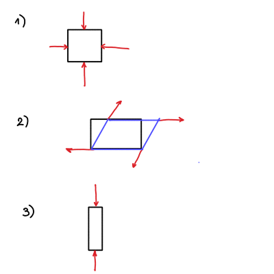

#+title: Predavanja iz Mehanike kontinuov, 9. teden v letu
#+subtitle: 2026/02/23
#+startup: nolatexpreview
#+startup: entitiespretty nil
#+startup: show2levels
#+latex_header: \usepackage{amsmath} \usepackage{unicode-math} \usepackage{cancel} \usepackage{graphicx}
#+latex_header: \renewcommand{\theta}{\vartheta} \renewcommand{\phi}{\varphi} \renewcommand{\epsilon}{\varepsilon}
#+latex_header: \newcommand{\odv}[1]{\dot{\vec{#1}}} \newcommand{\oddv}[1]{\ddot{\vec{#1}}}
#+latex_header: \newcommand{\rot}{\mathrm{rot}}\newcommand{\dive}{\mathrm{div}} \newcommand{\iu}{\mathrm{i}}
#+latex_header: \newcommand\mapsfrom{\mathrel{\reflectbox{\ensuremath{\mapsto}}}}
* Opis deformacije

Definirajmo deformacijo. To bomo storili s pomočjo premika, ki ga lahko razdelimo na translacijo, rotacijo in na koncu deformacijo. Translacijo opišemo s točkastim telesom, rotacijo s togim telesom in deformacijo z *elastičnim* telesom.

Elastoviskoznost je odvisno od opazovalnega časa. Kot primer je bil naveden Silly patty, kjer deluje kot skokica ob metu na tla (elastičnost), če pa je položeno na mizo, bo začela sčasoma se razlivati (viskoznost).

Referenčno, nedeformirano stanje označimo z \( \mathbf{r} \), deformirano stanje pa z \( \mathbf{R}(\mathbf{r}) \). Razliki teh dveh vektorjev pravimo vektor premika \( \mathbf{u}(\mathbf{r}) \). Deformirano stanje je torej

\[ \mathbf{R}(\mathbf{r}) = \mathbf{r} + \mathbf{u}(\mathbf{r}).
\]

Vektor premika \( \mathbf{u}(\mathbf{r}) \) zajema vse tri točke, ki spadajo pod premik - translacija, rotacija in deformacija. Iz vektorja premika moramo odfiltrirati translacijo in rotacijo. V primeru translacije je vektor premika enak po vseh točkah telesa. Za izluščitev translacije bomo opazovali odvod \( \mathbf{u} \). Pri rotaciji vektor premika ni enak, vendar so točke na enaki razdalji ves čas.

Opazujemo razdalji med točkama v telesu. V nedeformiranem telesu si izberem dve poljubni točki \( \mathbf{r}_1 \) in \( \mathbf{r}_2 \), ki sta za \( \mathrm{d} \mathbf{r} = \mathbf{r}_2 - \mathbf{r}_1 \) narazen. V deformiranem telesu pa sta te dve isti točki \( \mathbf{R}_1 \) in \( \mathbf{R}_2 \), z razdaljo \( \mathrm{d} \mathbf{R} = \mathbf{R}_2 - \mathbf{R}_1 \).

Izračunajmo razdaljo pred deformacijo in uvedimo Einsteinovo indeksno notacijo

\[ \mathrm{d} l ^2 = \mathrm{d} \mathbf{r} ^2 = \mathrm{d} \mathbf{r} \cdot \mathrm{d} \mathbf{r} = \mathrm{d} x_1 ^2 + \mathrm{d} x_2 ^2 +  \mathrm{d} x_3 ^2.
\]

Z vsoto zapišemo

\[ \sum\limits_{i = 1}^3 \mathrm{d} x_i ^2 \to \mathrm{d} x_i \mathrm{d} x_i = \mathrm{d} x_i ^2.
\]

(Ponovljen indeks pomeni vsoto po njem).

Razdalja po deformaciji je enaka

\[ \mathrm{d} L ^2 = \mathrm{d} \mathbf{R} ^2 = \mathrm{d} \mathbf{R} \cdot \mathrm{d} \mathbf{R} = \mathrm{d} X_i \mathrm{d} X_i,
\]

kjer je \( X_i \) komponenta \( \mathrm{d} \mathbf{R} \).

Razdaljo po deformaciji lahko zapišemo s pomočjo vektorja premika, ki je odvisen od prostorskih koordinat

\[ \mathrm{d} \mathbf{R} = \mathrm{d} \mathbf{r} + \mathrm{d} \mathbf{u}  = \mathrm{d} \mathbf{r} + \frac{\partial \mathbf{u}}{\partial \mathbf{r}}  \cdot \mathrm{d} \mathbf{r}.
\]

Parcialni odvod v sumacijskem indeksu zapišemo kot

\[ \frac{\partial \mathbf{u}}{\partial \mathbf{r}}  \cdot \mathrm{d} \mathbf{r} = \sum\limits_{k = x, y, z}^{} \frac{\partial u_{i}}{\partial x_{k}} \, \mathrm{d} x_k = \frac{\partial u_{i}}{\partial x_{k}} \mathrm{d} x_k
\]

V tem primeru imamo vsoto po koordinatah in posledično je nemi indeks (aka seštejemo in izginejo). V produktu razdalje zato uporabimo dva indeks \( k \) in \( j \). Torej

\[ \mathrm{d} L ^2 = \left( \mathrm{d} x_i + \frac{\partial u_{i}}{\partial x_{k}} \mathrm{d} x_k \right) \left( \mathrm{d} x_i + \frac{\partial u_{i}}{\partial x_{j}} \mathrm{d} x_j \right).
\]

Produkt oklepajev nam poda

\[ \mathrm{d} L ^2 = \left( \mathrm{d} x_i ^2 + \frac{\partial u_{i}}{\partial x_{j}} \mathrm{d} x_i \mathrm{d} x_j + \frac{\partial u_{i}}{\partial x_{k}} \mathrm{d} x_i \mathrm{d} x_k + \frac{\partial u_{i}}{\partial x_{j}}  \frac{\partial u_{i}}{\partial x_{k}} \mathrm{d} x_j \mathrm{d} x_k \right)
\]

Vse indeksi se ponovijo, torej so nemi. Zato lahko opravimo zamenjavo, kjer je cilj, da povsod lahko izpostavilo \( \mathrm{d} x_i \mathrm{d} x_k \).

\begin{align*}
  \text{drugi člen} &\quad j\to k \\
\text{tretji člen} &\quad k \to i, \ i \to k \\
\text{četrti člen} &\quad i \to l, \ j \to i
\end{align*}

Sprememba kvadrata razdalje med bližnjima točkama je

\[ \mathrm{d} L ^2 - \mathrm{d} l ^2 = \left( \frac{\partial u_{i}}{\partial x_{k}}  + \frac{\partial u_{k}}{\partial x_{i}}  + \frac{\partial u_{l}}{\partial x_{i}} \frac{\partial u_{l}}{\partial x_{k}}  \right) \mathrm{d} x_i \mathrm{d} x_k,
\]

kjer uvedemo deformacijski tenzor

\[ 2 u_{ik} =  \left( \frac{\partial u_{i}}{\partial x_{k}}  + \frac{\partial u_{k}}{\partial x_{i}}  + \frac{\partial u_{l}}{\partial x_{i}} \frac{\partial u_{l}}{\partial x_{k}}  \right).
\]

Deformacijski tenzor vsebuje odvode, kar nam potrdi idejo odfiltriranja translacije.

Razmislimo še o odfiltriranu rotacije iz premika. Matematično rotacijo zapišemo

\[ \begin{bmatrix} x_{1} \\ x_{2} \\ x_{3} \end{bmatrix} = \begin{bmatrix}
                                                           \cos \phi & - \sin \phi &  \\
                                                           \sin \phi & \cos \phi &  \\
                                                            &  & 1
                                                           \end{bmatrix} \begin{bmatrix} x_{1} \\ x_{2} \\ x_{3} \end{bmatrix}.
\]

V primeru deformacije je kot rotacije zelo majhen \( \phi \ll 1 \) in rotacijska matrika postane

\[ \begin{bmatrix} x_{1} \\ x_{2} \\ x_{3} \end{bmatrix} \approx \begin{bmatrix}
                                                           1 & -\phi &  \\
                                                           \phi & 1 &  \\
                                                            &  & 1
                                                           \end{bmatrix} \begin{bmatrix} x_{1} \\ x_{2} \\ x_3 \end{bmatrix} = \underline{\underline{I}} \mathbf{r} + \begin{bmatrix}
                                                                                                                                                                       & -\phi &  \\
                                                                                                                                                                      \phi &  &  \\
                                                                                                                                                                       &  &
                                                                                                                                                                      \end{bmatrix} \mathbf{r} = \underline{\underline{\mathbf{r}}} + \mathbf{u} (\mathbf{r})
\]

Vidimo torej, da lahko izrazimo kot vsoto nedeformiranega vektorja in vektorja premika \( \mathbf{u}(\mathbf{r}) \). Izračunajmo deformacijski tenzor za \( \mathbf{u}(\mathbf{r}) = \left( - \phi x_2, \phi x_1, 0 \right) \). Četrti člen je povsod ničeln, saj nista ne prva ne druga komponenta odvisna od dveh različnih prostorskih komponent. Torej

\[ u_{ik} = \frac{1}{2} \left( \frac{\partial u_{i}}{\partial x_{k}} + \frac{\partial u_{k}}{\partial x_{i}}  \right),
\]

izračunane vrednosti pa so

\begin{align*}
  u_{11} &= \frac{1}{2} \left( \frac{\partial u_{1}}{\partial x_{1}} + \frac{\partial u_{1}}{\partial x_{1}}  \right) = 0 \\
u_{12} &= \frac{1}{2} \left( \frac{\partial u_1}{\partial x_2} + \frac{\partial u_{2}}{\partial x_{1}}   \right) = \frac{1}{2} (- \phi + \phi) = 0 \\
u_{22} &= \frac{1}{2} \left( \frac{\partial u_{2}}{\partial x_{2}}  + \frac{\partial u_{2}}{\partial x_{2}}  \right) = 0
\end{align*}

Zaključimo, da je vektor premika (rotacije) za majhne deformacije ničeln.

#+name: Deformacijski tenzor pri končni rotaciji
#+begin_note
Vektor premika za končne rotacije je

\[ \mathbf{u}(\mathbf{r}) = \left( (\cos \phi - 1) x_1 - x_2 \sin \phi, x_1 \sin \phi + (\cos \phi - 1) x_2, 0\right).
\]

\begin{align*}
  u_{11} &= \frac{1}{2} \left[ (\cos \phi - 1) + (\cos \phi - 1) + (\cos \phi - 1) ^2 + \sin ^2 \phi \right] \\
&= \frac{1}{2} \left[ 2 \cos \phi - 2 +  \cos ^2 \phi - 2 \cos \phi + 1 + \sin ^2 \phi \right] = 0.
\end{align*}

Zadnje dva člena v oklepaju sta posledica nelinearnega člena.

Četrta komponenta deformacijskega tenzorja \( \frac{\partial u_{l}}{\partial x_{i}} \frac{\partial u_{l}}{\partial x_{k}}  \) je nelinearen člen in poskrbi, da so komponente tenzorja tudi za končne rotacije togega telesa ničelne.
#+end_note
** Pomen deformacijskega tenzorja

Če je deformacijski tenzor \( u_{ik} \) simetričen, potem ga lahko diagonaliziramo z neničelnimi diagonalnimi členi.

V primeru, da je \( u_{ik} \) v lastnem sistemu (= diagonaliziran), potem velja

\[ \mathrm{d} L ^2 = \mathrm{d} l ^2 + 2 u_{ik} \mathrm{d}x_i \mathrm{d}_k = \mathrm{d} l ^2 + 2 u_{11} \mathrm{d} x_1 ^2 + 2 u_{22} \mathrm{d} x_2 ^2 + 2 u_{33} \mathrm{d} x_3 ^2
\]

Izberemo bližnji točki tako, da je \( \mathrm{d}x_1 \ne 0 \) in \( \mathrm{d} x_2 = \mathrm{d} x_3 = 0 \). Razdalje med bližnjima točkama je ravno \( \mathrm{d} l ^2 = \mathrm{d} x_1 ^2 \). Po deformaciji je razdalja med točkama

\[ \mathrm{d} L ^2 = \mathrm{d} l ^2 + 2 u_{11} \mathrm{d} x_1 ^2 = \mathrm{d} x_1 ^2 (1 + 2u_{11}) = \mathrm{d} l ^2 (1 + 2 u_{11}).
\]

Za majhne spremembe lahko razvijemo

\[ \mathrm{d} L = \mathrm{d} l \sqrt{1 + 2u_{11}} \approx 1 + \frac{1}{2} \cdot 2u_{11} = 1 + u_{11}.
\]

Slednje nam tudi razloži, zakaj je tenzor definiran s faktorjem 2.

Relativna sprememba razdalje pa je potem

\[ \frac{\mathrm{d} L - \mathrm{d} l}{\mathrm{d} l} = \frac{\mathrm{d} L}{\mathrm{d} l} - 1 = 1 + u_{11} - 1 = u_{11}.
\]

Torej deformacija v lastnem sistemu je potem ravno \( u_{11} \).
*** Izvendiagonalne komponente \( u_{ik} \)

Izberimo si vektorja, ki sta pravokotna med seboj \( \mathrm{d} \mathbf{r}_1 = (\mathrm{d} x_1, 0, 0 ) \) in \( \mathrm{d} \mathbf{r}_2 = (0, \mathrm{d} x_2, 0) \).

Po deformaciji velja

\[ \mathrm{d} \mathbf{R} = \mathrm{d} \mathbf{r} + \mathrm{d} \mathbf{u} = \mathrm{d} \mathbf{r} + \frac{\partial \mathbf{u}}{\partial \mathbf{r}}  \mathrm{d} \mathbf{r}.
\]

Deformacija prve točke bi v splošnem bila

\[ \mathrm{d} \mathbf{R}_1 = \begin{bmatrix} \mathrm{d} x_1 + \frac{\partial u_{1}}{\partial x_{i}} \mathrm{d} x_i  \\ \mathrm{d} x_2 + \frac{\partial u_{2}}{\partial x_{i}} \mathrm{d} x_i \\ \mathrm{d} x_3 + \frac{\partial u_{3}}{\partial x_{i}} \mathrm{d} x_i \end{bmatrix},
\]

vendar je \( \mathrm{d} \mathbf{r}_1 \ne \mathrm{d}\mathbf{r}_1 (x_2, x_3) \) in posledično je enako tudi z \( \mathrm{d} \mathbf{u} = \mathrm{d} \mathbf{u} (x_2, x_3) \).

\[ \mathrm{d} \mathbf{R}_1 = \begin{bmatrix} \mathrm{d}x_1 + \frac{\partial u_{1}}{\partial x_{1}} \mathrm{d} x_1 \\ \frac{\partial u_{2}}{\partial x_{1}} \mathrm{d}x_1   \\ \frac{\partial u_{3}}{\partial x_{1}}  \mathrm{d} x_1 \end{bmatrix}.
\]

Enako je transformacija tudi druge točke

\[ \mathrm{d} \mathbf{R}_2 = \begin{bmatrix} \frac{\partial u_{1}}{\partial x_{2}} \mathrm{d} x_2 \\ \mathrm{d} x_2 + \frac{\partial u_{2}}{\partial x_{2}} \mathrm{d} x_2  \\ \frac{\partial u_{3}}{\partial x_{2}} \mathrm{d} x_2 \end{bmatrix}.
\]

Skalarni produkt je potem

\[ \mathrm{d} \mathbf{R}_1 \cdot \mathrm{d} \mathbf{R}_2 = \frac{\partial u_{1}}{\partial x_{2}} \mathrm{d} x_1 \mathrm{d} x_2 + \frac{\partial u_{2}}{\partial x_{1}} \mathrm{d} x_1 \mathrm{d} x_{2}  = \left( \frac{\partial u_{1}}{\partial x_{2}} + \frac{\partial u_{2}}{\partial x_{1}}  \right) \mathrm{d} x_1 \mathrm{d} x_2,
\]

kjer smo zanemarili zaradi majhnosti vse člene s produkti odvodov.

Skalarni produkt kota po deformaciji je

\[ \cos \theta_{12} = \frac{\mathrm{d} \mathbf{R}_1 \cdot \mathrm{d} \mathbf{R}_2}{\left| \mathrm{d} \mathbf{R}_1 \right| \cdot \left| \mathrm{d} \mathbf{R}_2 \right|}.
\]

Velikost \( \mathrm{d} \mathbf{R}_1 \) je

\[ \left| \mathrm{d} \mathbf{R}_1 \right|  ^2 = \mathrm{d} \mathbf{R}_1 \cdot \mathrm{d} \mathbf{R}_1 = \mathrm{d} x_1 ^2 + 2 \frac{\partial u_{1}}{\partial x_{1}} \mathrm{d} x_1 ^2 + \left( \frac{\partial u_{1}}{\partial x_{1}}  \right) ^2 \mathrm{d} x_1 ^2 + \left( \frac{\partial u_{2}}{\partial x_{1}}  \right) ^2 \mathrm{d} x_1 ^2 + \left( \frac{\partial u_{3}}{\partial x_{1}}  \right) ^2 \mathrm{d} x_1 ^2 \approx \mathrm{d} x_1 ^2,
\]

kjer smo zanemarili vse člene s kvadrati odvodov. Enako velja \( \left| \mathrm{d} \mathbf{R}_2 \right| \approx \mathrm{d} x_2 \).

Za kot potem velja

\[ \cos \theta_{12} = \frac{\left( \frac{\partial u_{1}}{\partial x_{2}}  + \frac{\partial u_{2}}{\partial x_{1}}  \right) \mathrm{d} x_1 \mathrm{d} x_2}{\mathrm{d} x_1 \mathrm{d} x_2} = 2 u_{12}.
\]

Izvendiagonalni člen nam torej pove kot med vektorjema po deformaciji.
*** Sprememba prostornine

Pred deformacijo imamo volumen

\[ \mathrm{d} V = \mathrm{d} x_1 \mathrm{d} x_2 \mathrm{d} x_3,
\]

po deformaciji pa je

\[ \mathrm{d} V = \mathrm{d} X_1 \mathrm{d} X_2 \mathrm{d} X_3.
\]

Volumna lahko povežemo preko Jacobijeve determinante

\[ \mathrm{d} X_1 \mathrm{d} X_2 \mathrm{d} X_3 = \underline{J} \mathrm{d} x_1 \mathrm{d} x_2 \mathrm{d} x_3,
\]

kjer je \( \underline{J} = \det \frac{\partial X_{i}}{\partial x_{k}}  \).

Deformacijski vektor je \( \mathbf{R} = \mathbf{r} + \mathbf{u} (\mathbf{r}) \). Posamezna komponenta in njen odvod sta potem

\[ \mathrm{d} X_i = \mathrm{d}x_i + \frac{\partial u_{i}}{\partial x_{k}}  \mathrm{d} x_k \implies \frac{\partial X_{i}}{\partial x_{k}} = \delta_{ik} + \frac{\partial u_{i}}{\partial  x_{k}}
\]

Računamo torej determinanto

\[ \det \begin{bmatrix}
        1 + \partial_{x_{1}} u_1 & \partial_{x_2} u_1 & \partial_{x_3} u_1 \\
        \partial_{x_1} u_2 & 1+ \partial_{x_2} u_2 & \partial_{x_3} u_2 \\
         \partial_{x_1} u3& \partial_{x_2} u_3 & 1 + \partial_{x_3} u_3
        \end{bmatrix} = 1 ^3 + \left( \frac{\partial u_{1}}{\partial x_{1}}  + \frac{\partial u_{2}}{\partial x_{2}}  + \frac{\partial u_{3}}{\partial x_{3}}  \right) \cdot 1 ^2 + \ldots
\]

kjer smo zanemarili vse odvode višje od prvega reda.

Relativna spremeba prostornine je

\[ \frac{\mathrm{d} V - \mathrm{d} v}{\mathrm{d} v} = \frac{\mathrm{d} V}{\mathrm{d} v} - 1 = J - 1 = \mathrm{tr} u,
\]

kjer je \( \mathrm{tr} u \) sled matrike \( u \).
** Napetostni tenzor

Hookov zakon ima obliko

\[ \mathbf{F} = k \mathbf{x},
\]

kjer je \( \mathbf{F} \) sila, ki deluje na vzmet in je vzrok deformacije, \( \mathbf{x} \) pa je mera deformacije. Prejšnje predavanje smo izpeljali deformacijski tenzor \( u_{ik} \), ki bo v Hookovem zakonu igral vlogo koeficienta \( k \). Napetostni tenzor pa bo vzrok deformacija in bo analog sili iz Hookovega zakona.

Ključ pri današnjem predavanju bodo igrali kontaktne sile. To so sile znotraj snovi, ki delujejo na svojo okolico (?). Za naš primer kontaktna sila ne more biti sila na daljavo.

Imamo košček prostornine \( \mathrm{d} ^3 \mathbf{r} \), ki bo izkusil silo

\[ F_i = \int\limits_{}^{} f_i (\mathbf{r}) \, \mathrm{d} ^3 \mathbf{r},
\]

kjer je \( f_i \) prostorninska gostota sil. Volumnski integral bomo pretvorili na integral po zaključeni ploskvi

\[ F_i = \oint\limits_S^{} p_{ik} \cdot \mathrm{d} A_k = \oint\limits_{}^{} p_{ik} n_k \, \mathrm{d} A
\]

kjer je \( p_{ik} \) tlak in tenzor, saj ima normala površine svoje komponente. Zato, da smo lahko naredili ta preskok iz prostorske gostote sile na površinsko gostoto sile \( p_{ik} n_k = \tilde{f}_i \), je bila pomembna predpostavka kontaktnih sil.

Povezavo med \( f_i \) in \( p_{ik} \) dobimo preko Gaussovega izreka, ki v splošnem pravi

\[ \int\limits_{}^{} \nabla \cdot \mathbf{E} \, \mathrm{d} V = \oint\limits_{}^{} \mathbf{E} \cdot \mathrm{d} \mathbf{A}.
\]

Napetostni tenzor \( p_{ik} \) je tako definiran

\[ f_i  = \frac{\partial p_{ik}}{\partial x_{k}}.
\]

#+begin_my_example
V primeru neobremenjenega telesa imamo robni pogoj \( p_{ik} n_k  = 0 \).
#+end_my_example

#+name: Hidrostatični tlak
#+begin_problem
Napetostni tenzor za hidrostatični tlak zapišemo

\[ p_{ik} = - p \delta_{ik}.
\]

Dogovor je, da normala na površino kaže ven iz telesa. Tlak pritiska na ploskev v obratni smeri normale, zato je napetostni tenzor negativno predznačen. Slika 1)
#+end_problem

#+name: Strižna obremenitev
#+begin_problem
Napetostni tenzor za strižno obremenitev je

\[ p_{ik} = p \left( \delta_{ix} \delta_{ky} + \delta_{iy} \delta_{kx} \right).
\]

Slika 2)
#+end_problem

#+name: Enoosna obremenitev
#+begin_problem
Napetostni tenzor za enoosno obremenitev je

\[ p_{ik} = p \delta_{iz} \delta_{kz}
\]

Slika 3)
#+end_problem

*** Simetričnost napetostnega tenzorja

Poglejmo si navor

\[ M_i = \int\limits_{}^{} \left( \mathbf{r} \times \mathbf{f} \right)_i \, \mathrm{d} ^3 \mathbf{r}.
\]

Vektorski produkt bomo zapisali v Einsteinovi notaciji

\[ M_i = \int\limits_{}^{} \epsilon_{ijk} x_j f_k \, \mathrm{d} ^3 \mathbf{r},
\]

ter upoštevamo definicijo napetostnega tenzorja

\[ \int\limits_{}^{}\epsilon_{ijk} x_j f_k \, \mathrm{d} ^3 \mathbf{r} = \int\limits_{}^{}\epsilon_{ijk} x_j \frac{\partial p_{kl}}{\partial x_{l}} \, \mathrm{d} ^3 \mathbf{r}.
\]

Radi bi zapisali divergenco produkta \( x_j p_{kl} \) namesto samo divergenco napetostnega tenzorja in to naredimo z identiteto

\[ \frac{\partial }{\partial x_{l}} \left( x_j p_{kl} \right) = x_j \frac{\partial p_{kl}}{\partial x_{l}}  + \frac{\partial x_{j}}{\partial x_{k}} p_{kl}.
\]

Upoštevamo, da velja \( \frac{\partial x_{j}}{\partial x_{l}}  = \delta_{jl} \) in dobimo razliko dveh integralov

\[ M_i = \int\limits_{}^{} \epsilon_{ijk} \frac{\partial }{\partial x_{l}}  \left( x_j p_{kl} \right) \, \mathrm{d} ^3 \mathbf{r} - \int\limits_{}^{} \epsilon_{ijk} \delta_{jl} p_{kl} \, \mathrm{d} ^3 \mathbf{r}.
\]

Prvi integral predstavlja divergenco tenzorja tretjega ranga in lahko zapišemo preko Gaussovega zakona

\[ M_i = \oint\limits_{}^{} \epsilon_{ijk} x_j p_{kl} \, \mathrm{d} A_l - \int\limits_{}^{} \epsilon_{ijk} \delta_{jl} p_{kl} \, \mathrm{d} ^3 \mathbf{r}.
\]

Za drugi integral pa bomo zahtevali, da je ničeln tako, da ga razdelimo na dva dela

\[ \epsilon_{ijk} p_{kj} = \frac{1}{2} \left( \epsilon_{ijk} p_{kj} + \epsilon_{ikj} p_{jk} \right).
\]

Lahko smo zamenjali indeksa pri Levi-Civita simbolu, saj sta indeksa \( jk \) nema. Velja \( \epsilon_{ikj} = - \epsilon_{ijk} \) in dobimo pogoj

\[ \epsilon_{ijk} p_{kj} = \epsilon_{ijk} \left( p_{kj} - p_{jk} \right).
\]

Če velja \( p_{kj} - p_{jk} =0 \) (simetričnost!), potem je navor

\[ M_i = \oint\limits_{}^{} \epsilon_{ijk} x_j p_{kl} \, \mathrm{d} A_l
\]
** Cauchyjeva enačba (ekvivalent 2. Newtonovega zakona)

Ponovno imejmo košček prostornine \( \mathrm{d} ^3 \mathbf{r} \), ki pa ima maso \( \rho \, \mathrm{d} ^3 \mathbf{r} \) in njegovo lego označimo z \( u_i \).

Želimo izpeljati ekvivalent 2. Newtonovega zakona

\[ \mathbf{F} = m \mathbf{a},
\]

kar bomo naredili z zapisom

\[ \rho\, \mathrm{d} ^3 \mathbf{r} \ddot{u}_i = f_i \, \mathrm{d} ^3 \mathbf{r}.
\]

Cauchyjeva enačba je tako

\[ \rho \ddot{u}_i = \frac{\partial p_{ik}}{\partial x_{k}} + \rho f_i^{(2)},
\]

kjer zadnji člen zavzema zunanje sile.
** Delo pri deformaciji

Navdih pri izpeljavi nam bo definicija dela \( W = \mathbf{F} \cdot \mathbf{S} \).

Integralska oblika dela bo

\[ \delta W = \int\limits_{}^{} f_i \delta u_i \, \mathrm{d} ^3 \mathbf{r}.
\]

Upoštevamo definicijo napetostnega tenzorja

\[ \delta W = \int\limits_{}^{} \frac{\partial p_{ik}}{\partial x_{k}}  \delta u_i \, \mathrm{d} ^3 \mathbf{r}.
\]

Postorimo enak trik kot pri dokazu simetričnosti napetostnega tenzorja

\[ \delta W = \int\limits_{}^{} \frac{\partial }{\partial x_{k}}  \left( p_{ik} \delta u_i \right) \, \mathrm{d} ^3 \mathbf{r} - \int\limits_{}^{} p_{ik} \frac{\partial \delta u_{i}}{\partial x_{k}} \, \mathrm{d} ^3 \mathbf{r}.
\]

Zadnji integral ponovno razdelimo na dva dela in ker imamo opravka z nemimi indeksi ter simetrični napetostnim tenzorjem, lahko indekse v drugem seštevancu zamenjamo

\begin{align*}
  p_{ik} \frac{\partial \delta u_{i}}{\partial x_{k}} &= \frac{1}{2} \left( p_{ik} \frac{\partial \delta u_{i}}{\partial x_{k}}  + p_{ki} \frac{\partial u_{k}}{\partial x_{i}}  \right) \\
&= p_{ik} \frac{1}{2} \left( \frac{\partial \delta u_{i}}{\partial x_{k}}  + \frac{\partial \delta u_{k}}{\partial x_{i}}  \right)\\
&= p_{ik} \delta u_{ik},
\end{align*}

kjer smo prepoznali deformacijski tenzor.

Prvi integral ponovno lahko prevedemo na površinski integral

\[ \delta W = \oint\limits_{}^{} p_{ik} \delta u_i \, \mathrm{d} A_k - \int\limits_{}^{} p_{ik} \delta u_{ik} \, \mathrm{d} ^3 \mathbf{r}.
\]

Predpostavimo, da imamo neskončno sredstvo, za katerega naj velja, da ima površino neobremenjeno. Prvi integral bo zato \( 0 \).

Iz termodinamike se spomnimo definicije proste energije \( \mathrm{d} f \), ki je definirana

\[ \mathrm{d} f = - s \, \mathrm{d} T + p_{ik} \mathrm{d} u_{ik},
\]

kjer je \( s \) prosta entalpija. Odčitamo torej, da je

\[ p_{ik} = \left( \frac{\partial f}{\partial u_{ik}}  \right)_T
\]
* Elastična energija
** Prosta energija izotropnega sredstva

Izotropno sredstvo je sredstvo invariantno na poljubne rotacije okoli poljubne osi, poljubne translacije ali poljubnega zrcaljenja.

Prosta energija \( f \) take preslikave mora biti odvisna od takih količin, ki so invariantne na zgornje preslikave - npr. lastne vrednosti \( u_{ik} \).

Poiščimo sedaj te lastne vrednosti.

\begin{align*}
 \det \left( u_{ik} - \lambda I \right) &= \begin{vmatrix}
                                           u_{11} - \lambda & u_{12} & u_{13} \\
                                           u_{21} & u_{22} - \lambda & u_{23} \\
                                           u_{31} & u_{32} & u_{33} - \lambda
                                           \end{vmatrix} \\
&= - \lambda ^3 + \lambda ^2 (u_{11} + u_{22} + u_{33}) + \lambda \left[-u_{22} u_{33} + u_{23} u_{32} \right. \\
&\qquad \left. - u_{11} u_{33} - u_{11} u_{22} + u_{12} u_{21} + u_{13} u_{31}\right] + \det u_{ik}  \\
&= - \lambda ^3 + \lambda ^2 \mathrm{tr} u + \lambda \left[  \left( \mathrm{tr} u \right) ^2 - \mathrm{tr} u ^2 \right].
\end{align*}

Iz 2. v 3. vrstico pridemo z naslednjim postopkom

\begin{align*}
  I &= -u_{22} u_{33} + u_{23} u_{32}- u_{11} u_{33} - u_{11} u_{22} + u_{12} u_{21} + u_{13} u_{31} \\
&= - \frac{1}{2} \left( u_{11} + u_{22} + u_{33} \right) ^2 + \frac{1}{2} \left( u_{11} ^2 + u_{22} ^2 + u_{33} ^2 \right) \\
& \quad + u_{12} u_{21} + u_{13} u_{31} + u_{23} u_{32} \\
&= - \left( \mathrm{tr} u ^2 -  \right) + \mathrm{tr} u ^2.
\end{align*}

Mazohist lahko hitro preveri s kvadriranjem tenzorja \( u_{ik} ^2 \) - za manjšega mazohista računaj zgolj diagonalne člene kvadrata matrike.

Prosta energija je odvisna od invariantnih parametrov

\[ f = f \left( \mathrm{tr} u, \frac{1}{2} \left[ \mathrm{tr} u ^2 - \left( \mathrm{tr} u \right) ^2 \right], \det u_{ik} \right) = f \left( \mathrm{tr} u, \mathrm{tr} u ^2, \det u_{ik} \right).
\]

Prosto energijo lahko sedaj razvijemo po teh invariantah

\begin{align*}
  f \approx f_0 &+ A_1 \mathrm{tr} u + A_2 \left( \mathrm{tr} u \right) ^2 + A_3 \left( \mathrm{tr} u \right) ^3 + \ldots \\
&+ B_1 \mathrm{tr} u ^2 + B_2 \left( \mathrm{tr} u ^2 \right) ^2 + \ldots \\
&+ C_1  \det u_{ik}  + \ldots \\
&+ D_1 \mathrm{tr} u \,  \mathrm{tr} u_2 + \ldots
\end{align*}

Zanima nas harmonična energija \( E_{pr} = \frac{k x ^2}{2} \), zato zanemarimo vse člene, ki imajo red potence večji od kvadrata. Ostane nam

\[ f = f_0 + A_1 \mathrm{tr} u + A_2 \left( \mathrm{tr} u \right) ^2 + B_1 \mathrm{tr} u ^2.
\]

Razpišemo sled

\[ f = f_0 + A_1 \left( u_{11} + u_{22} + u_{33} \right) + \ldots
\]

ter upoštevamo definicijo napetostnega tenzorja

\begin{align*}
  p_{ik} &= \frac{\partial f}{\partial u_{ik}} \\
&= A_1 \cdot \delta_{ik} + A_2 u^1 \ldots + B_1 u^1\ldots.
\end{align*}

Koeficient \( A_1 \) predstavlja napetost brez deformacije in ga postavimo na ničlo.

Prosto energijo zapišemo tako

\begin{align*}
  f &= f_0 + \frac{\lambda}{2} \left( \mathrm{tr} u \right) ^2 + \mu \mathrm{tr} u ^2 \\
&= f_0 + \frac{\lambda}{2} u_{ll} ^2 + \mu u_{ik} u_{ki},
\end{align*}

kjer so \( \lambda, \upsilon \) Lamejevi konstanti.
