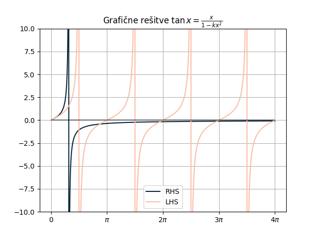

#+title: Vaje iz Mehanike kontinuov, 12. teden v letu
#+subtitle: 2026/03/16 in 2026/03/18
#+startup: nolatexpreview
#+startup: entitiespretty nil
#+startup: show2levels
#+latex_header: \usepackage{amsmath} \usepackage{unicode-math} \usepackage{cancel} \usepackage{graphicx}
#+latex_header: \renewcommand{\theta}{\vartheta} \renewcommand{\phi}{\varphi} \renewcommand{\epsilon}{\varepsilon}
#+latex_header: \newcommand{\odv}[1]{\dot{\vec{#1}}} \newcommand{\oddv}[1]{\ddot{\vec{#1}}}
#+latex_header: \newcommand{\rot}{\mathrm{rot}}\newcommand{\dive}{\mathrm{div}} \newcommand{\iu}{\mathrm{i}}
#+latex_header: \newcommand\mapsfrom{\mathrel{\reflectbox{\ensuremath{\mapsto}}}}
* Elastična krogla - nadaljevanje

Prejšnji teden nismo dokončali naloge, kjer smo iskali frekvence radialnega lastnega nihanja elastične krogle s polmerom \( R \).

Izluščili smo transcedentno enačbo

\[ \tan (kR) = \frac{kR}{1 - \frac{1 - \sigma}{2 (1 - 2\sigma)} \left( kR \right) ^2}.
\]

Na zgornji sliki lahko vidimo grafične rešitve te enačbe za \( k = 1 \). Opazimo lahko, da se z večanjem \( x = kR > 0 \) približujejo te vrednosti k \( x = n \pi, \ n = 0, 1, 2, \ldots \).

#+begin_my_example
Kot primer si vzemimo \( \sigma = 0.25 \), ki pripadaj jeklu. Prvih nekaj rešitev so

\begin{array}{c|c}
n & x_n \\ \hline
1 & 2.563 \\
2 & 6.059 \\
3 & 9.280 \\
4 & 12.459 \\
\end{array}

Na začetku naloge smo definirali \( k \) kot

\[ k ^2 = \rho \omega ^2 \frac{\left( 1 + \sigma \right) \left( 1 - 2 \sigma \right)}{E \left( 1 - \sigma \right)}.
\]

Hkrati pa vemo, da so njegove diskretne vrednosti definirane preko ničel sferičnih Besselovih funkcij \( k_n = \frac{\xi_n}{R} \). Lastne frekvence nihanja za kroglo s premerom \( R = 5 \mathrm{cm} \), gostoto \( \rho = 7800 \frac{\mathrm{kg}}{\mathrm{m} ^3} \) ter Youngovim modulom \( E = 2.0 \cdot 10^{11} \frac{\mathrm{N}}{\mathrm{m} ^2} \) so

\begin{array}{c|c}
n & \nu_n [Hz] \\ \hline
1 & 90.5 \\
2 & 214 \\
3 & 328 \\
4 & 440 \\
\end{array}
#+end_my_example
* Teorija: kristali

Elastična prosta energija kristala ima obliko kvadratne forme

\[ f(u) = \frac{1}{2} C_{ijkl} u_{ij} u_{kl}.
\]

Iz definicije napetostnega tenzorja

\[ p_{ij} = \frac{\partial f}{\partial u_{ij}} = C_{ijkl} u_{kl},
\]

vidimo, da je simetričen, saj velja \( u_{ij} = u_{ji} \). Nadalje velja tudi simetrija \( u_{kl} = u_{lk} \), iz česar sledi, da ima tenzor elastičnih konstant \( C_{ijkl} \) maksimalno 21 neodvisnih konstant.
* Tetragonalen kristal
#+begin_problem
Zapišimo deformacijsko prosto energijo za kristal s tetragonalno simetrijo. Vir: MEHK, vaje
#+end_problem

Tetragonalna struktura ima sledečo enakost stranic \( a = b \ne c \). Izberemo si tak kristal, ki pripada simetrijski grupi \( C_{4v} \). Slednja vsebuje štirištevno os \( z \) ter 2 zrcaljenji preko med seboj pravokotnih ravnin, ki vsebujeta prej omenjeno os. Naj normali teh ravnin kažeta v smeri \( x \) in \( y \).

Poglejmo si zrcaljenje

\[ x \to - x, \quad y \to y, \quad z \to z.
\]

*Komponente tenzorjev se transformirajo kot produkti komponent vektorjev*. Zgornje zrcaljenje transformira element tenzorja \( C_{xyyy} \) v \( - C_{xyyy} \), ter \( C_{xxyy} \to C_{xxyy} \). Če je transformacija hkrati tudi simetrijska operacija kristala - kot npr. prva transformacija \( C_{xyyy} \to - C_{xyyy} \) - potem so komponente, ki se slikajo druga v drugo enake. Torej bo \( C_{xyyy} = - C_{xyyy} = 0 \). Zaradi obeh zrcaljenj bodo vsi elementi tenzorja, ki imajo liho število indeksov \( x \) ali \( y \) ničelni.

Ostane nam še druga simetrijska operacija - zasuk za \( \frac{\pi}{2} \)

\[ x \to y, \quad y \to -x , \quad z \to z.
\]

Nekateri elementi tenzorja, ki se preslikajo so

\begin{align*}
  C_{xxxx } &\to C_{yyyy}= C_{xxxx} \\
C_{xxzz} &\to C_{yy zz} = C_{xxzz} \\
C_{xzxz} &\to C_{yzyz} = C_{xzxz}
\end{align*}

V prosti energiji se nam pojavita dva člena, ki bosta nakazovala, kaj naredijo transformacije in simetrijske operacije.

\[ C_{xxyy} u_{xx } u_{yy} + C_{yy xx } u_{yy} u_{xx } = 2 C_{xx yy} u_{xx } u_{yy}.
\]

Gostota proste energije bo tako

\begin{equation}
\label{eq:1}
\begin{aligned}
  f(u) = \frac{1}{2} & \left[ C_{xxxx } \left( u_{xx } ^2 + u_{yy} ^2 \right) + C_{zzzz} u_{zz} ^2 + 2 C_{xx zz} \left( u_{xx } u_{zz} + u_{yy} u_{zz} \right) \right. \\
& \left. C_{xxyy} u_{xx} u_{yy} + 4 C_{xyxy} u_{xy} ^2 + 4 C_{xzxz} \left( u_{xz} ^2 + u_{yz} ^2 \right) \right],
\end{aligned}
\end{equation}

saj velja \( C_{yxyx} = C_{xyxy} = C_{yxxy} = C_{xyyx} \).

* Kubičen kristal
#+begin_problem
Zapišimo deformacijsko prosto energijo za kristal s kubično simetrijo. Vir: MEHK, vaje
#+end_problem

Kubičen kristal ima napram tetragonalnemu kristalu dodatne simetrije:

- trikratno štirištevno os
- štirikratno trištevno os
- šestkratno dvoštevno os

Kot osnovo lahko vzamemo prosto energijo kristala iz \ref{eq:1}, vendar se bodo določeni členi še izničili. Zaradi rotacij za kot \( \frac{\pi}{2} \) okoli osi \( x \) in \( y \) imamo sledeči transformaciji

\[ x \to x, \quad y \to z, \quad z \to -y
\]

in

\[ x \to -z, \quad y \to y, \quad z \to x.
\]

Te transformacije podajo tudi simetrijske operacije

\begin{align*}
  C_{zzzz} &\to C_{xxxx} = C_{zzzz} \\
C_{xxzz} &\to C_{xxyy} = C_{xxzz} \\
C_{xzxz} &\to C_{xyxy} = C_{xzxz}.
\end{align*}

Gostota proste energije za kubičen kristal bo tako

\begin{align*}
 f(u) = \frac{1}{2} & \left[ C_{xxxx} \left( u_{xx} ^2 + u_{yy} ^2 + u_{zz} ^2 \right) + 2 C_{xxyy} \left( u_{xx} u_{yy} + u_{yy}u_{zz} + u_{xx} u_{zz} \right) + \right. \\
& + \left. 4C_{xyxy} \left( u_{xy} ^2 + u_{xz} ^2 + u_{yz} ^2 \right)  \right]
\end{align*}
* Teorija: deformacije tankih plošč

Zanima nas dogajanje s tankimi ploščami, če so obremenjene v v prečni smeri \( z \). Odmik bomo označevali z \( u_z = Z(x, y) \), enačba, ki opisuje odmike pa je

\[ D \Delta_{\perp} ^2 u_z - P = 0.
\]

Operator \( \Delta_{\perp} = \nabla ^2_{\perp} \), \( P(x, y) \) je površinska gostota sile (tlak) in \( D \) konstanta, ki je odvisna od materiala

\[ D = \frac{E h ^3}{12 \left( 1 - \sigma ^2 \right)}.
\]

Plošča je lahko vpeta na dva možna načina. Togo vpeta plošča ima robna pogoja

\[ \left. u_z \right|_{\partial S} = 0 \quad \text{ in } \quad \left. \frac{\partial u_z}{\partial \mathbf{n}} \right|_{\partial S} = 0,
\]

kjer \( \partial S \) označuje rob plošče in je \( \frac{\partial }{\partial n}  \) odvod v smeri, ki je vzporedna z ravnino plošče in pravokotna na njen rob.

V primeru prislonjene plošče pa sta robna pogoja

\[ \left. u_z \right|_{\partial S} = 0 \quad \text{ in } \quad  \left. \left( \frac{\partial ^2 u_{z}}{\partial n ^2}  + \sigma \frac{\partial \theta}{\partial l}  \frac{\partial u}{\partial n}  \right) \right|_{\partial S} = 0,
\]

kjer je \( \phi \) kot med tangento na rob plošče in osjo \( x \), \( \frac{\partial }{\partial l}  \) pa je odvod po dolžini roba. Odvod \( \frac{\partial \phi}{\partial l}  \) podaja obliko robu plošče.
* Deformacija plošče zaradi lastne teže (str. 45)
#+begin_problem
Kako se zaradi lastne teže povesi tanka okrogla plošča, ki je na robu togo vpeta?
#+end_problem

Problem je simetričen glede na polarni kot \( \phi \) in naša rešitev torej ne bo odvisna od njega. Enačba odmika bo torej imela zgolj radialno odvisnost.

Laplaceov operator za funkcijo \( f \) bo

\[ \nabla ^2_{\perp} f = \nabla_{\perp} \left[ \frac{1}{r} \frac{\partial }{\partial r} \left( r \frac{\partial f}{\partial r}  \right) \right] = \frac{1}{r} \frac{\partial }{\partial r} \left\{ r \frac{\partial }{\partial r} \left[ \frac{1}{r} \frac{\partial }{\partial r} \left( r \frac{\partial f}{\partial r}  \right) \right] \right\}.
\]

Enačba odmika, katere ploskovna gostota sil je \( P = \frac{F}{S} = \rho g h \) je

\[   \frac{1}{r} \frac{\partial }{\partial r} \left\{ r \frac{\partial }{\partial r} \left[ \frac{1}{r} \frac{\partial }{\partial r} \left( r \frac{\partial u_z}{\partial r}  \right) \right] \right\}  = \alpha, \quad \alpha = \frac{\rho g h}{D}.
\]

Enačbo pomnožimo z \( r \) in prvič integriramo

\[ r \frac{\partial }{\partial r}  \left\{ \frac{1}{r} \frac{\partial }{\partial r}    \left( r \frac{\partial u_{z}}{\partial x}  \right) \right\} = \frac{\alpha r ^2}{2} + C_1.
\]

Dobljeno enačbo sedaj delimo z \( r \) in ponovno integriramo

\[ \frac{1}{r} \frac{\partial }{\partial r}  \left( r \frac{\partial u_{z}}{\partial r}  \right) = \frac{\alpha r ^2}{4} + C_1 \ln \left| r \right| + C_2.
\]

Naš primer nima singularnosti v točki \( r = 0 \), iz česar sledi, da mora biti \( C_1 = 0 \). Ponovno pomnožimo z \( r \) in integriramo

\[ r \frac{\partial u_{z}}{\partial r}  = \frac{\alpha r ^4}{16} + C_2 \frac{r ^2}{2} + C_3.
\]

Še enkrat delimo z \( r \) in integriramo

\[ u_z = \frac{\alpha r ^4}{64} + C_2 \frac{r ^2}{4} + C_3 \ln \left| r \right| + C_4.
\]

Iz istega razloga kakor prej je \( C_3 = 0 \).

Za določitev vrednosti koeficientov moramo upoštevati še robne pogoje. Ogledali si bomo oba primera - togo vpeto in prislonjeno ploščo.

Toga vpeta plošča ima robna pogoja

\[ u_z (R) = 0 \quad \text{ in } \quad \frac{\partial u_z}{\partial r} (R) = 0.
\]

Iz drugega robnega pogoja sledi

\[ 0 = \frac{\alpha R ^3}{16} + \frac{C_2 R}{2} \implies C_2 = - \frac{\alpha R ^2}{8}.
\]

Dobljeno enakost upoštevamo še v prvem pogoju

\[ 0 = \frac{\alpha R ^4}{64} - \frac{\alpha R ^4}{32} + C_4 \implies C_4 = \frac{\alpha R ^4}{64}.
\]

Enačba, ki torej opiše odmik naše plošče je torej

\[ u_z (r) = \frac{\alpha r ^4}{64} - \frac{R ^2 r ^2 \alpha}{32} + \frac{R ^4 \alpha}{64} = \frac{\alpha}{64} \left( r ^2 - R ^2 \right) ^2
\]

V primeru prislonjene plošče imamo isti prvi pogoj z enako enačbo

\[ \frac{\alpha R ^4}{64} + \frac{C_2 R ^2}{4} + C_4 = 0.
\]

Imamo pa še drugi pogoj

\[ \left( \frac{\partial ^2 u_{z}}{\partial r ^2}+ \frac{\partial \theta}{\partial l} \sigma \frac{\partial u_z (R)}{\partial r}   \right) = 0
\]

V našem primeru je \( \frac{\partial \theta}{\partial l}  = \frac{1}{R} \). Iz drugega pogoja lahko izrazimo \( C_2 \), saj

\begin{align*}
  0 &= \frac{3 \alphaR ^2}{16} + \frac{C_2}{2} + \left( \frac{\alpha R ^2}{16} + \frac{C_2 R}{2} \right) \cdot \frac{\sigma}{R} \\
&= \frac{\alpha R ^2}{16} \left( 3 + \sigma \right) + \frac{C_2}{2} \left( 1 + \sigma \right),
\end{align*}

kjer na koncu dobimo

\[ C_2 = - \frac{\alpha R ^2 \left( 3 + \sigma \right)}{8 \left( 1 + \sigma \right)}.
\]

Vstavimo to še v enačbo od prvega pogoja in dobimo

\[ C_4 = - \frac{\alpha R ^4}{64} \left( 1 - 2 \frac{3 + \sigma}{1 + \sigma} \right).
\]

Enačba odmika je tako

\[ u_z (r) = \frac{\alpha}{64} \left( r ^4 - 2 R ^2 r ^2 \frac{3 + \sigma}{1 + \sigma} + R ^4 \frac{5 + \sigma}{1 + \sigma} \right).
\]
* Plošča s silo (str. 48)

#+begin_problem
Na okroglo ploščo, ki je na robovih prislonjena, deluje sila \( F_0 \), porazdeljena po tankem koncentričnem obroču z radijem \( r_0 < R \). Izračunaj poves plošče \( u \), če je poves zaradi lastne teže zanemarljiv.
#+end_problem

Naš problem je ponovno simetričen in odmik \( u_z \) bo neodvisen od polarnega kota \( \phi \).

Dokopati se moramo do ploskovne gostote sile \( P \), ki nastopa v enačbi

\[ D \Delta_{\perp} ^2 u_z - P = 0.
\]

Del plošče, na katerega deluje sila bomo opisali z delta funkcijo \( F_0 \delta (r - r_0) \).

Po ploskovnem integralu celotne plošče se bomo lahko dokopali do vrednosti \( P \)

\[ F_0 = \int\limits_0^R 2 \pi r \frac{\delta(r - r_0)}{2 \pi r} F_0 \, \mathrm{d} r = F_0 H (r - r_0),
\]

kjer je \( H \) Heavisideova funkcija. Ploskovna gostota sile je torej

\[ P = \frac{\delta (r - r_0)}{2 \pi r} F_0.
\]

Podobno kot v prejšnjem primeru rešujemo enačbo, ki ima samo radialni del

\[ \frac{1}{r} \frac{\partial }{\partial r} \left\{ r \frac{\partial }{\partial r} \left[ \frac{1}{r} \frac{\partial }{\partial r} \left(  r \frac{\partial u_{z}}{\partial r} \right)  \right] \right\} = \frac{F_0}{2 \pi D} \frac{\delta (r - r_0)}{r}.
\]

Označimo \( \alpha = \frac{F_0}{2 \pi D} \). Sedaj enostavno prvič integriramo

\[ r \frac{\partial }{\partial r} \left[ \frac{1}{r} \frac{\partial }{\partial r} \left( r \frac{\partial u_{z}}{\partial r}  \right)  \right] = \alpha H(r - r_0) + C_1.
\]

Delimo z \( r \) in integriramo

\[ \frac{1}{r} \frac{\partial }{\partial r}  \left( r \frac{\partial u_{z}}{\partial r}  \right) = \alpha \int\limits_{}^{} \frac{H(r - r_0)}{r} \, \mathrm{d} r + C_1 \ln \left| r \right| + C_2
\]

Leva stran enačbe je \( \nabla ^2 u_z \), ki ne divergira v \( r = 0 \), iz česar sledi \( C_1 = 0 \).

Zgornji integral bomo rešili s pomočjo identitete

\[ \int\limits_{}^{} f(x) H(x - x_0) \, \mathrm{d} x = \left[ F(x) - F(x_0) \right] H(x - x_0) + C,
\]

kjer je \( F(x) \) nedoločeni integral funkcije \( f(x) \). Sedaj lahko integriramo in pomnožimo z \( r \)

\[ \frac{\partial }{\partial r}  \left( r \frac{\partial u_z }{\partial r}  \right) = \alpha r \ln \frac{r}{r_0} H(r - r_0) + C_2 r.
\]

Po ponovnem integriranju nam preostane

\begin{equation}
\label{eq:2}
  r\frac{\partial u_{z}}{\partial r}  = \frac{\alpha r}{2} \left[ r \ln \frac{r}{r_0} - \frac{r ^2 - r_0 ^2}{2r} \right] H(r - r_0) + \frac{C_2}{2} r ^2 + C_3.
\end{equation}

Sedaj lahko delimo z \( r \) in ponovno integriramo

\[ u_z (r) = \frac{\alpha}{4} \left[ \left( r ^2 + r_0 ^2 \right) \ln \frac{r}{r_0} \left( r ^2 - r_0 ^2 \right) \right] H(r - r_0) + \frac{C_2}{4} r ^4 + C_3 \ln \left| r \right| + C_4
\]

\( C_3 = 0 \) zaradi nesingularnosti v izhodišču.

Plošča je prislonjena, torej sta robna pogoja

\[ u_z (R) = 0 \quad \text{ in } \quad \left. \left( \frac{\partial ^2 u_{z}}{\partial r ^2} + \sigma \frac{\partial \theta}{\partial r}  \frac{\partial u_z}{\partial r}  \right)\right|_{r = R} = 0
\]

Za upoštevanje drugega potrebujemo prvi odvod, ki ga imamo že izračunanega v \ref{eq:3} ter drugi odvod, ki ga moramo še izračunati

\[ \left. \frac{\partial ^2 u}{\partial r ^2} \right|_{r = R} = \frac{\alpha}{R} \left[ \ln \frac{R}{r_0} + \frac{1}{2} \left( 1 - \frac{r_0 ^2}{R ^2} \right) \right] + \frac{C_2}{2}.
\]

Iz robnih pogojev dobimo zvezi

\begin{align*}
 0 &= \frac{\alpha}{4} \left[ \left( R ^2 + r_0 ^2 \right) \ln \frac{R}{r_0} - \left( R ^2 - r_0 ^2 \right) \right] + \frac{1}{4} C_2 R ^2 + C_4 \\
0&= \frac{1 + \sigma}{2} \left( C_2 + \alpha \ln \frac{R}{r_0} \right) + \frac{\alpha \left( 1 - \sigma \right)}{4} \left( 1 - \frac{r_0 ^2}{R ^2} \right),
\end{align*}

vrednosti koeficientov pa so tako

\begin{align*}
  A &= - \alpha \left[ \frac{1 - \sigma}{1 + \sigma} \frac{R ^2 - r_0 ^2}{2 R ^2} + \ln \frac{R}{r_0} \right] \\
B &= - \frac{\alpha}{4} \left[ \frac{3 + \sigma}{2 (1 + \sigma)} \left( R ^2 - r_0 ^2 \right) - r_0 ^2 \ln \frac{R}{r_0} \right].
\end{align*}
* Upogib plošče zaradi lastne teže - variacijski pristop (str. 52)

#+begin_problem
Upogib prislonjene vodoravne kvadratne plošče s stranico \( a \) opišemo z razvojem

\[ u(x, y) = \sum\limits_{m, n}^{} a_{mn} \sin \frac{m \pi x}{a} \sin \frac{n \pi y}{a}.
\]

Variacijsko določimo poves sredine železne plošče s stranico \( 1 \mathrm{m} \) in debelino \( 1 \mathrm{cm} \) zaradi lastne teže. Ocenimo napako, ki jo naredimo, če upoštevamo le prvi člen razvoja. Prožnostni modul železa je \( E = 2 \cdot 10^{11} \frac{\mathrm{N}}{\mathrm{m} ^2} \), Poissonovo število \( \sigma = 0.25 \), gostota pa \( \rho = 7800 \frac{\mathrm{kg}}{\mathrm{m} ^3} \).
#+end_problem
